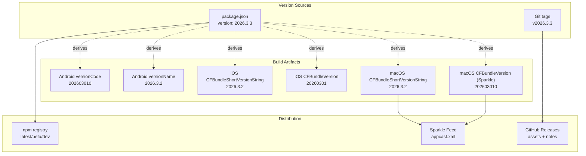
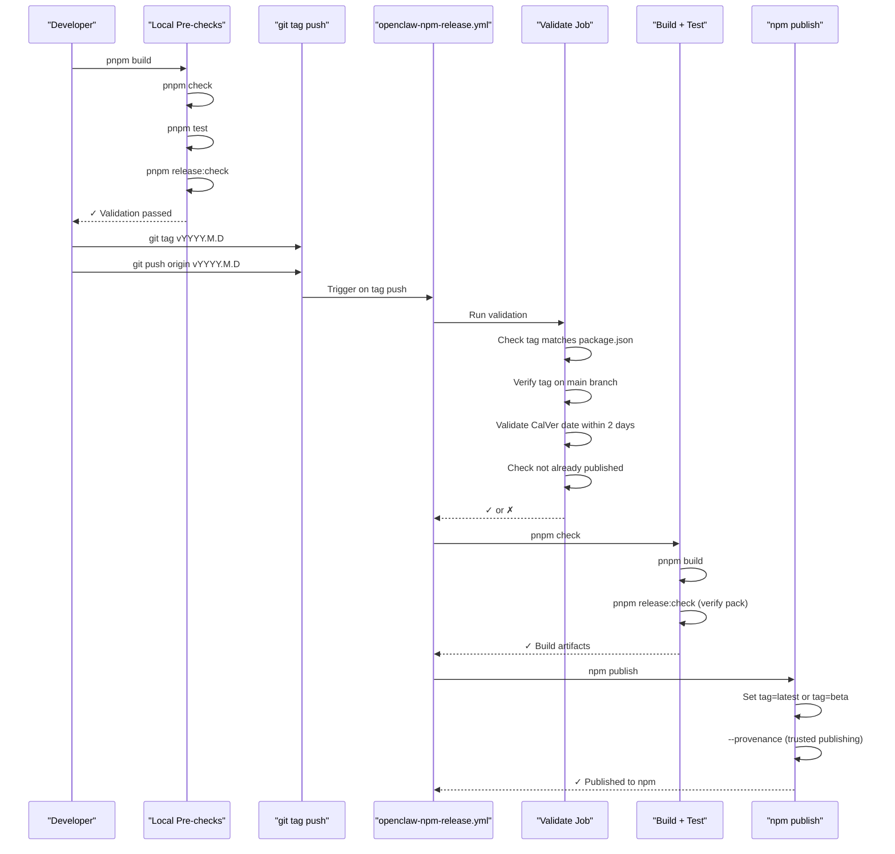
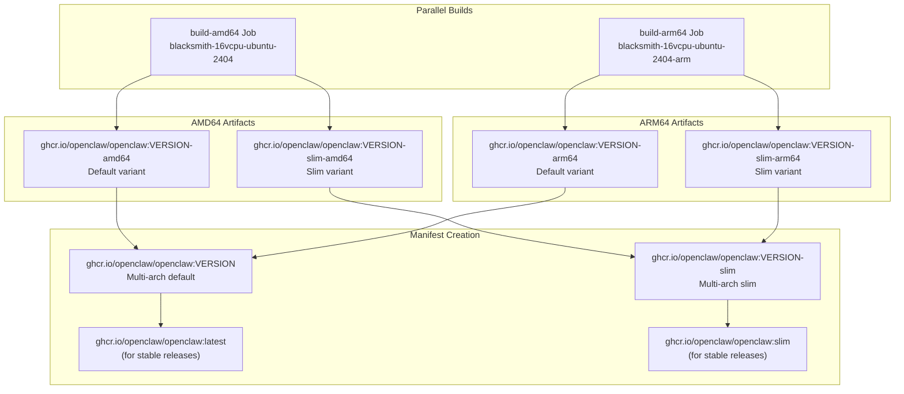
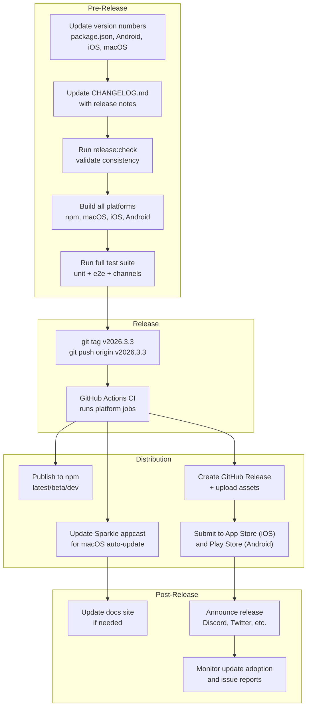

# Release Process

<details>
<summary>Relevant source files</summary>

The following files were used as context for generating this wiki page:

- [.github/actions/setup-node-env/action.yml](.github/actions/setup-node-env/action.yml)
- [.github/actions/setup-pnpm-store-cache/action.yml](.github/actions/setup-pnpm-store-cache/action.yml)
- [.github/workflows/auto-response.yml](.github/workflows/auto-response.yml)
- [.github/workflows/ci.yml](.github/workflows/ci.yml)
- [.github/workflows/codeql.yml](.github/workflows/codeql.yml)
- [.github/workflows/docker-release.yml](.github/workflows/docker-release.yml)
- [.github/workflows/install-smoke.yml](.github/workflows/install-smoke.yml)
- [.github/workflows/labeler.yml](.github/workflows/labeler.yml)
- [.github/workflows/openclaw-npm-release.yml](.github/workflows/openclaw-npm-release.yml)
- [.github/workflows/sandbox-common-smoke.yml](.github/workflows/sandbox-common-smoke.yml)
- [.github/workflows/stale.yml](.github/workflows/stale.yml)
- [.github/workflows/workflow-sanity.yml](.github/workflows/workflow-sanity.yml)
- [docs/channels/irc.md](docs/channels/irc.md)
- [docs/ci.md](docs/ci.md)
- [docs/providers/venice.md](docs/providers/venice.md)
- [docs/reference/RELEASING.md](docs/reference/RELEASING.md)
- [docs/tools/creating-skills.md](docs/tools/creating-skills.md)
- [scripts/ci-changed-scope.mjs](scripts/ci-changed-scope.mjs)
- [scripts/docker/install-sh-common/cli-verify.sh](scripts/docker/install-sh-common/cli-verify.sh)
- [scripts/docker/install-sh-common/version-parse.sh](scripts/docker/install-sh-common/version-parse.sh)
- [scripts/docker/install-sh-nonroot/run.sh](scripts/docker/install-sh-nonroot/run.sh)
- [scripts/docker/install-sh-smoke/run.sh](scripts/docker/install-sh-smoke/run.sh)
- [scripts/sync-labels.ts](scripts/sync-labels.ts)
- [scripts/test-install-sh-docker.sh](scripts/test-install-sh-docker.sh)
- [src/agents/model-tool-support.test.ts](src/agents/model-tool-support.test.ts)
- [src/agents/model-tool-support.ts](src/agents/model-tool-support.ts)
- [src/agents/venice-models.test.ts](src/agents/venice-models.test.ts)
- [src/agents/venice-models.ts](src/agents/venice-models.ts)
- [src/cli/program/help.test.ts](src/cli/program/help.test.ts)
- [src/scripts/ci-changed-scope.test.ts](src/scripts/ci-changed-scope.test.ts)

</details>

This document describes the versioning strategy, release checklist, changelog maintenance, and distribution process for OpenClaw releases across npm, GitHub, and platform-specific channels (macOS, iOS, Android).

For CI/CD pipeline details, see [CI/CD Pipeline](#8.1). For platform-specific development setup, see [macOS Dev Setup](/platforms/mac/dev-setup), [iOS](/platforms/ios), and [Android](/platforms/android).

## Purpose and Scope

This page covers:

- Versioning scheme and version number coordination
- Release checklist and pre-release validation
- Changelog format and maintenance practices
- Distribution to npm, GitHub releases, and platform app stores
- Platform-specific release processes (Sparkle auto-updates for macOS, mobile builds)
- Update mechanisms and channels (stable/beta/dev)

---

## CalVer Versioning Scheme

OpenClaw uses **calendar-based versioning (CalVer)**: `YYYY.M.D[-beta.N]`

**Stable Release Format:**

- `YYYY.M.D` where month and day are **not zero-padded**
- Examples: `2026.3.8`, `2026.2.26` (not `2026.03.08`)
- Git tag: `vYYYY.M.D`

**Beta Prerelease Format:**

- `YYYY.M.D-beta.N` where N is the beta iteration
- Examples: `2026.3.8-beta.1`, `2026.2.15-beta.1`
- Git tag: `vYYYY.M.D-beta.N`

**Version Validation:**
The release workflow enforces ([.github/workflows/openclaw-npm-release.yml:38-48]()):

- Tag must match `package.json` version (with `v` prefix for git tag)
- Tag must be on `main` branch
- CalVer date cannot be more than 2 UTC calendar days away from release date
- No duplicate versions on npm registry

**Distribution Channels:**

| Channel | Tag Pattern        | npm dist-tag | Purpose               |
| ------- | ------------------ | ------------ | --------------------- |
| Stable  | `vYYYY.M.D`        | `latest`     | Production releases   |
| Beta    | `vYYYY.M.D-beta.N` | `beta`       | Prerelease testing    |
| Dev     | (none)             | `dev`        | Moving head of `main` |

**Historical Note:**
Legacy tag patterns like `v2026.1.11-1`, `v2026.2.6-3`, and `v2.0.0-beta2` exist in repo history but are deprecated. Use `vYYYY.M.D` for stable and `vYYYY.M.D-beta.N` for beta going forward.

Sources: [docs/reference/RELEASING.md:22-46](), [.github/workflows/openclaw-npm-release.yml:38-48]()

---

## Version Coordination Across Platforms



**Key Invariants:**

- **npm version** is the canonical source for all platform versions
- **Mobile build numbers** must be monotonic integers for app store submission
- **macOS `APP_BUILD`** must be numeric and monotonic for Sparkle version comparison ([docs/platforms/mac/release.md:29-31]())
- Android `versionCode` format: `YYYYMMDDNN` (date + lane suffix)
- iOS `CFBundleVersion` format: `YYYYMMDD` (date only)

Sources: [package.json:3](), [apps/android/app/build.gradle.kts:24-25](), [apps/ios/Sources/Info.plist:22-35](), [apps/macos/Sources/OpenClaw/Resources/Info.plist:18-20]()

---

## Release Checklist

### Pre-Release Validation

**Release Validation Workflow**



**Manual Pre-Release Steps:**

1. **Version and Metadata** ([docs/reference/RELEASING.md:48-54]())
   - Bump `package.json` version (e.g., `2026.1.29`)
   - Run `pnpm plugins:sync` to align extension versions
   - Update version strings in [src/version.ts]() and Baileys user agent in [src/web/session.ts]()
   - Verify `package.json` metadata: name, description, repository, keywords, license
   - Ensure `pnpm-lock.yaml` is current if dependencies changed

2. **Build and Artifacts** ([docs/reference/RELEASING.md:56-62]())
   - If A2UI changed: `pnpm canvas:a2ui:bundle` and commit [src/canvas-host/a2ui/a2ui.bundle.js]()
   - `pnpm build` to regenerate `dist/`
   - Verify `files` in `package.json` includes required `dist/` folders
   - Confirm `dist/build-info.json` exists with commit hash
   - Optional: `npm pack --pack-destination /tmp` to inspect tarball

3. **Changelog and Documentation** ([docs/reference/RELEASING.md:64-67]())
   - Update `CHANGELOG.md` with user-facing highlights (descending by version)
   - Ensure README examples/flags match current CLI behavior

4. **Validation Suite** ([docs/reference/RELEASING.md:69-83]())

   ```bash
   pnpm build
   pnpm check                  # Types, lint, format
   pnpm test                   # Full test suite
   pnpm release:check          # npm pack validation

   # Installer smoke tests (Docker-based)
   OPENCLAW_INSTALL_SMOKE_SKIP_NONROOT=1 pnpm test:install:smoke

   # Optional: Full installer E2E with real providers
   pnpm test:install:e2e:openai     # Requires OPENAI_API_KEY
   pnpm test:install:e2e:anthropic  # Requires ANTHROPIC_API_KEY
   ```

5. **Tag and Push** ([docs/reference/RELEASING.md:96-100]())
   ```bash
   git tag vYYYY.M.D
   git push origin vYYYY.M.D
   ```
   This triggers [.github/workflows/openclaw-npm-release.yml]()

**Automated Validation in CI:**

The npm release workflow ([.github/workflows/openclaw-npm-release.yml:38-69]()) performs:

- Tag format validation (stable: `vYYYY.M.D`, beta: `vYYYY.M.D-beta.N`)
- Package.json version match (tag without `v` prefix)
- Ancestry check (tag must be on `main` branch via `git merge-base`)
- CalVer date range check (within ±2 UTC days of release timestamp)
- Duplicate version check (`npm view openclaw@VERSION` must not exist)
- Full build and test suite
- `pnpm release:check` to verify pack contents

Sources: [docs/reference/RELEASING.md:48-83](), [.github/workflows/openclaw-npm-release.yml:38-69]()

---

## Changelog Maintenance

The changelog follows a **structured format** with three main categories:

| Section        | Purpose                                                               |
| -------------- | --------------------------------------------------------------------- |
| `### Changes`  | New features, improvements, and non-breaking changes                  |
| `### Breaking` | Breaking changes requiring user action (bold with migration guidance) |
| `### Fixes`    | Bug fixes with symptoms, root cause, and resolution                   |

**Changelog Entry Format:**

```markdown
### Changes

- Feature/area: description of change with context and user impact. (#PR) Thanks @contributor.
```

**Best Practices:**

- **User-centric language**: describe impact, not implementation
- **Include context**: why the change was needed, what problem it solves
- **Cite PRs and contributors**: `(#12345) Thanks @username`
- **Breaking changes**: must include migration path or workaround
- **Categorize precisely**: Changes vs Fixes vs Breaking

**Example Breaking Change Entry:**

```markdown
### Breaking

- **BREAKING:** Gateway auth now requires explicit `gateway.auth.mode` when both
  `gateway.auth.token` and `gateway.auth.password` are configured. Set
  `gateway.auth.mode` to `token` or `password` before upgrade to avoid startup
  failures. (#35094) Thanks @joshavant.
```

Sources: [CHANGELOG.md:1-166]()

---

## Distribution Channels

### npm Registry Publishing

**Trusted Publishing with Provenance**

OpenClaw uses **npm trusted publishing** with OIDC-based provenance attestation. The publish workflow ([.github/workflows/openclaw-npm-release.yml:71-80]()) runs on GitHub-hosted runners (required for `id-token: write` permission) and publishes with `--provenance` flag.

**Dist-Tag Selection:**

| Dist-Tag | Trigger                  | npm Command                                           |
| -------- | ------------------------ | ----------------------------------------------------- |
| `latest` | Tag `vYYYY.M.D` (stable) | `npm publish --access public --provenance`            |
| `beta`   | Tag `vYYYY.M.D-beta.N`   | `npm publish --access public --tag beta --provenance` |

Version detection logic ([.github/workflows/openclaw-npm-release.yml:72-80]()):

```bash
PACKAGE_VERSION=$(node -p "require('./package.json').version")

if [[ "$PACKAGE_VERSION" == *-beta.* ]]; then
  npm publish --access public --tag beta --provenance
else
  npm publish --access public --provenance
fi
```

**Package Contents:**

The `files` field in `package.json` controls published artifacts:

- `CHANGELOG.md`, `LICENSE`, `README.md`
- `openclaw.mjs` (CLI entry point mapped via `bin`)
- `dist/` (compiled TypeScript, includes `dist/node-host/**` and `dist/acp/**`)
- `assets/`, `docs/`, `extensions/`, `skills/`

**Pre-Publish Validation:**

The workflow builds fresh artifacts before publishing:

```bash
pnpm build                # Regenerate dist/
pnpm release:check        # Validate pack contents
```

**Verification:**
After publish, verify the release:

```bash
npm view openclaw version
npm view openclaw dist-tags
npx -y openclaw@X.Y.Z --version
```

**Troubleshooting:**

Common issues from [docs/reference/RELEASING.md:103-112]():

- **npm pack hangs**: Ensure `package.json` `files` excludes large binaries (e.g., macOS `.app` bundles)
- **Dist-tag update fails**: Use legacy auth for OTP prompts:
  ```bash
  NPM_CONFIG_AUTH_TYPE=legacy npm dist-tag add openclaw@X.Y.Z latest
  ```
- **`npx` verification fails**: Clear cache and retry:
  ```bash
  NPM_CONFIG_CACHE=/tmp/npm-cache-$(date +%s) npx -y openclaw@X.Y.Z --version
  ```

Sources: [.github/workflows/openclaw-npm-release.yml:71-80](), [docs/reference/RELEASING.md:94-112]()

---

### GitHub Releases

**Manual Release Creation:**

GitHub Releases are created **manually** after npm publish, serving as the changelog archive and asset distribution point.

**Release Workflow** ([docs/reference/RELEASING.md:113-121]()):

1. Push git tag: `git tag vX.Y.Z && git push origin vX.Y.Z`
2. npm release workflow publishes to npm
3. Manually create GitHub Release for `vX.Y.Z` with:
   - **Title**: `openclaw X.Y.Z` (not just the tag name)
   - **Body**: Full changelog section from `CHANGELOG.md` (Highlights + Changes + Fixes), inline, no bare links, and **must not repeat the title in the body**
   - **Assets**: Attach artifacts (optional npm tarball, macOS `.zip`/`.dmg`, Android `.apk`, iOS `.ipa`)

**Release Notes Structure:**

The release body should include the **full** changelog section for that version:

```markdown
### Highlights

- Major feature announcements

### Changes

- Feature: description with context (#PR) Thanks @contributor

### Breaking

- **BREAKING:** Migration guidance (#PR)

### Fixes

- Fix: symptom → root cause → resolution (#PR)
```

**Artifact Attachments:**

- `openclaw-X.Y.Z.tgz` — npm tarball (from `npm pack`, optional)
- `OpenClaw-X.Y.Z.zip` — macOS Sparkle-signed archive
- `OpenClaw-X.Y.Z.dSYM.zip` — macOS debug symbols (if generated)
- `openclaw-X.Y.Z-release.apk` — Android release APK
- iOS `.ipa` (if built for TestFlight/App Store)

**Post-Release:**
Commit updated `appcast.xml` (Sparkle feed) and push to `main` so macOS auto-update fetches from the GitHub Release.

**Verification:**

```bash
# From a clean temp directory, verify npm install and CLI work
npx -y openclaw@X.Y.Z send --help
```

Sources: [docs/reference/RELEASING.md:113-121]()

---

### macOS Distribution

**Sparkle Auto-Update System**

macOS releases use **Sparkle** for in-app auto-updates. The update feed (`appcast.xml`) is committed to the repo and served from GitHub Pages or CDN.

**Version Constraints** ([docs/reference/RELEASING.md:85-91]()):

- `APP_BUILD` must be **numeric and monotonic** (Sparkle uses numeric comparison)
- If `APP_BUILD` is not set, it auto-derives from `APP_VERSION` as `YYYYMMDDNN`:
  - Stable releases: `YYYYMMDD90` (e.g., `2026030190`)
  - Beta releases: lane-derived suffix (e.g., `2026030101` for beta.1)

**Build and Sign Workflow:**

```bash
# 1. Build and sign app bundle
BUNDLE_ID=ai.openclaw.mac \
APP_VERSION=2026.3.2 \
BUILD_CONFIG=release \
SIGN_IDENTITY="Developer ID Application: <Name> (<TEAMID>)" \
scripts/package-mac-app.sh

# 2. Create distribution artifacts (zip, dmg)
BUNDLE_ID=ai.openclaw.mac \
APP_VERSION=2026.3.2 \
BUILD_CONFIG=release \
SIGN_IDENTITY="Developer ID Application: <Name> (<TEAMID>)" \
scripts/package-mac-dist.sh

# 3. Notarize DMG (requires App Store Connect API key)
xcrun notarytool submit dist/OpenClaw-2026.3.2.dmg \
  --keychain-profile openclaw-notary \
  --wait

# 4. Staple notarization ticket
xcrun stapler staple dist/OpenClaw-2026.3.2.dmg

# 5. Generate Sparkle appcast entry
scripts/make_appcast.sh 2026.3.2
```

**Output Artifacts:**

- `dist/OpenClaw.app` — Signed app bundle
- `dist/OpenClaw-{version}.zip` — Sparkle-signed archive (for auto-update)
- `dist/OpenClaw-{version}.dmg` — Notarized disk image (for manual download)
- `dist/OpenClaw-{version}.dSYM.zip` — Debug symbols (optional)

**Appcast Update:**

The `scripts/make_appcast.sh` script:

1. Reads version and build number from `Info.plist`
2. Generates Sparkle XML entry with EdDSA signature
3. Converts CHANGELOG.md section to HTML release notes
4. Updates `appcast.xml` with new entry

Commit and push `appcast.xml` so Sparkle clients fetch the update.

**Prerequisites** ([docs/reference/RELEASING.md:17-20]()):

- Load env from `~/.profile`: `SPARKLE_PRIVATE_KEY_FILE` and App Store Connect API vars
- Sparkle keys in `~/Library/CloudStorage/Dropbox/Backup/Sparkle` (if needed)
- Keychain profile `openclaw-notary` for notarization

**Detailed Release Steps:**
See [macOS release documentation](/platforms/mac/release) for the complete build, sign, and notarization workflow.

Sources: [docs/reference/RELEASING.md:85-91](), [docs/platforms/mac/release.md]() (referenced)

---

### iOS Release

**Version Management:**

- `CFBundleShortVersionString` ([apps/ios/Sources/Info.plist:22]()): marketing version (e.g., `"2026.3.2"`)
- `CFBundleVersion` ([apps/ios/Sources/Info.plist:35]()): build number (e.g., `"20260301"`, monotonic)

**Build Commands:**

```bash
# Generate Xcode project from project.yml
pnpm ios:gen

# Build for simulator
IOS_DEST="platform=iOS Simulator,name=iPhone 17" pnpm ios:build

# Build for device (requires signing)
pnpm ios:build
```

**Signing Configuration:**
Managed via `Signing.xcconfig` and environment variables:

- `OPENCLAW_CODE_SIGN_STYLE` (Automatic or Manual)
- `OPENCLAW_DEVELOPMENT_TEAM` (Team ID)
- `OPENCLAW_APP_BUNDLE_ID` (Bundle identifier)
- `OPENCLAW_APP_PROFILE` (Provisioning profile name)

**Release Steps:**

1. Update versions in [apps/ios/project.yml:101-102]() and [apps/ios/Sources/Info.plist:22,35]()
2. Run `pnpm ios:build` with release configuration
3. Archive via Xcode or `xcodebuild archive`
4. Submit to App Store Connect via Xcode Organizer or `xcrun altool`

Sources: [apps/ios/project.yml:1-119](), [apps/ios/Sources/Info.plist:1-91](), [package.json:262-265]()

---

### Android Release

**Version Management:**

- `versionCode` ([apps/android/app/build.gradle.kts:24]()): monotonic integer for Play Store (e.g., `202603010`)
- `versionName` ([apps/android/app/build.gradle.kts:25]()): display version (e.g., `"2026.3.2"`)

**Build Commands:**

```bash
# Debug build
pnpm android:assemble

# Release build (requires signing key)
cd apps/android
./gradlew :app:assembleRelease
```

**Output Filename:**
The `androidComponents` block ([apps/android/app/build.gradle.kts:82-94]()) customizes output filename:

```
openclaw-{versionName}-{buildType}.apk
```

Example: `openclaw-2026.3.2-release.apk`

**Release Steps:**

1. Update `versionCode` (increment monotonically) and `versionName` in [apps/android/app/build.gradle.kts:24-25]()
2. Build release APK: `./gradlew :app:assembleRelease`
3. Sign with release keystore (configured in `signing` block, not shown in provided files)
4. Upload to Google Play Console

Sources: [apps/android/app/build.gradle.kts:1-169](), [package.json:218-224]()

---

### Docker Multi-Arch Releases

**Docker Image Distribution**

Docker images are built for **amd64** and **arm64** platforms, then combined into a multi-arch manifest. The workflow ([.github/workflows/docker-release.yml]()) triggers on:

- Push to `main` branch
- Git tags matching `v*`
- Excludes: docs, markdown, `.agents/**`, `skills/**`

**Build Architecture**



**Image Tagging Logic** ([.github/workflows/docker-release.yml:246-281]()):

| Git Ref              | Tags Created                                            |
| -------------------- | ------------------------------------------------------- |
| `main` branch        | `main`, `main-slim`                                     |
| `vYYYY.M.D` (stable) | `YYYY.M.D`, `YYYY.M.D-slim`, `latest`, `slim`           |
| `vYYYY.M.D-beta.N`   | `YYYY.M.D-beta.N`, `YYYY.M.D-beta.N-slim` (no `latest`) |

**Build Variants:**

The `OPENCLAW_VARIANT` build arg controls image flavor:

- **Default** (no build arg): Full image with all bundled dependencies
- **Slim** (`OPENCLAW_VARIANT=slim`): Minimal image excluding optional deps

Both variants share build cache stages to optimize build time.

**OCI Labels** ([.github/workflows/docker-release.yml:82-101]()):

Each image includes standardized labels:

```dockerfile
org.opencontainers.image.revision=${GITHUB_SHA}
org.opencontainers.image.version=${VERSION}
org.opencontainers.image.created=${TIMESTAMP}
```

**Manifest Creation** ([.github/workflows/docker-release.yml:283-309]()):

The `create-manifest` job uses `docker buildx imagetools create` to combine platform-specific images:

```bash
docker buildx imagetools create \
  -t ghcr.io/openclaw/openclaw:2026.3.3 \
  ${AMD64_DIGEST} \
  ${ARM64_DIGEST}
```

Sources: [.github/workflows/docker-release.yml:1-310]()

---

## Update Mechanisms

### User-Facing Update Command

```bash
openclaw update [--channel stable|beta|dev]
```

**Behavior:**

- Detects current install method (npm, git source, or other)
- Updates to latest version on specified channel
- For npm installs: `npm install -g openclaw@latest` (or `@beta`, `@dev`)
- For git installs: `git pull && pnpm install && pnpm build`

**Auto-Update Configuration** ([docs/gateway/configuration.md:269-283]()):

```json5
{
  update: {
    channel: 'stable', // stable | beta | dev
    checkOnStart: true, // Check for updates on gateway start
    auto: {
      enabled: false, // Auto-install updates (disabled by default)
      stableDelayHours: 72, // Delay before auto-applying stable updates
      stableJitterHours: 24, // Random jitter to spread update load
      betaCheckIntervalHours: 6, // How often to check for beta updates
    },
  },
}
```

**macOS Auto-Update Flow:**

1. Sparkle checks appcast feed on app launch
2. User prompted when update available
3. Update downloaded in background
4. User chooses "Install and Relaunch"
5. Sparkle replaces app bundle and relaunches

Sources: [README.md:85-90](), [docs/gateway/configuration.md:269-283]()

---

## Contributor Credits

The `scripts/update-clawtributors.ts` script maintains the contributor section in README.md:

**Data Sources:**

- GitHub API: fetch contributors via `gh api "repos/openclaw/openclaw/contributors"`
- Git history: parse commits for name/email mappings
- Manual mappings: [scripts/clawtributors-map.json:1-41]() for display name overrides

**Update Command:**

```bash
# Run manually before release
pnpm tsx scripts/update-clawtributors.ts
```

**Output:**
Updates the contributor grid in [README.md]() with avatars and profile links.

Sources: [scripts/update-clawtributors.ts:1-227](), [scripts/clawtributors-map.json:1-41]()

---

## Summary Workflow Diagram



Sources: [package.json:3,289,294](), [CHANGELOG.md:1-166](), [docs/platforms/mac/release.md:1-45](), [apps/android/app/build.gradle.kts:24-25](), [apps/ios/Sources/Info.plist:22,35]()
