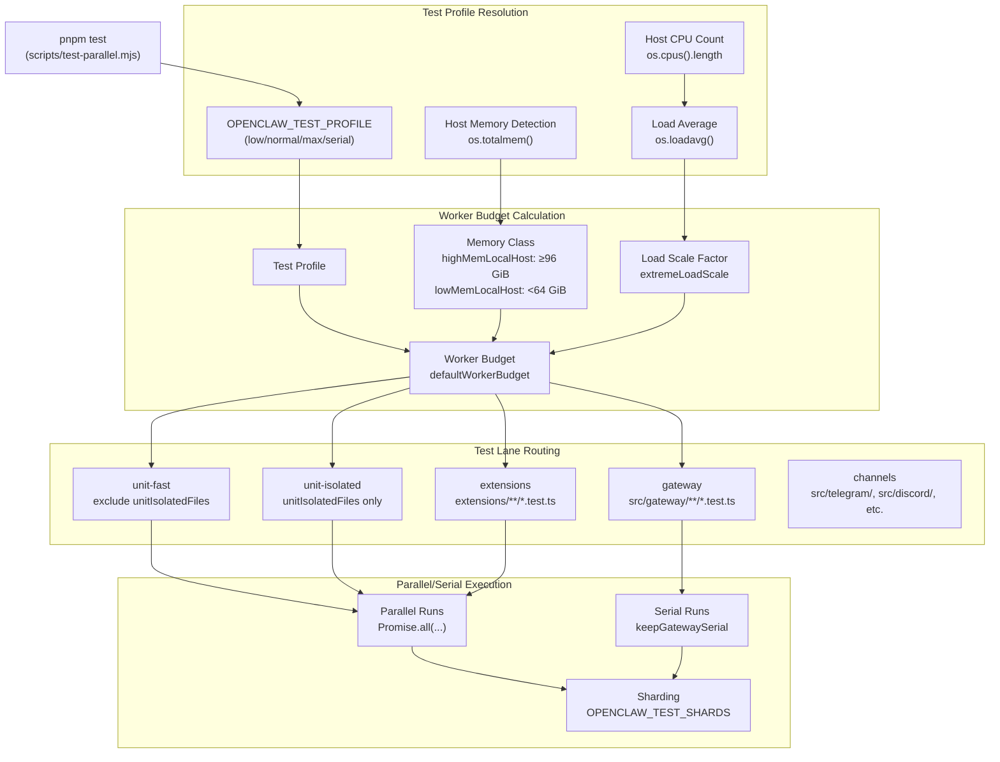
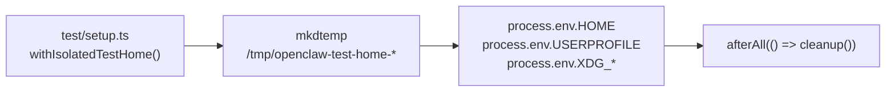
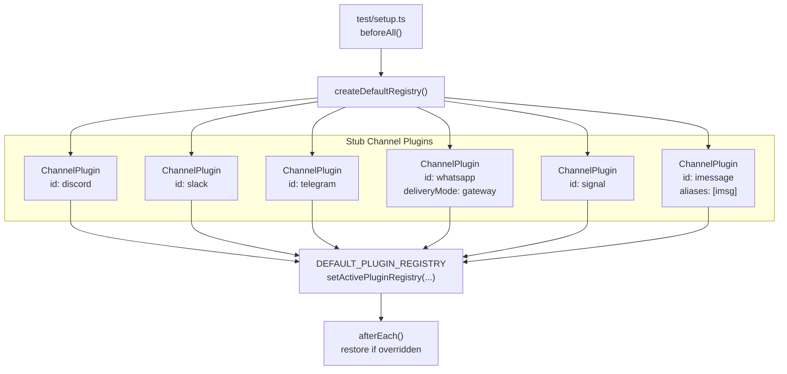
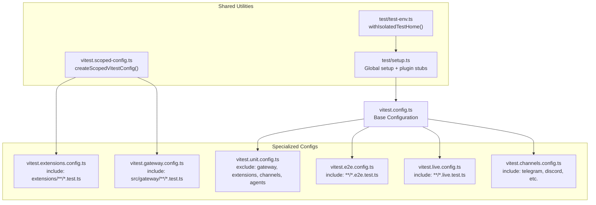

# Testing Framework

<details>
<summary>Relevant source files</summary>

The following files were used as context for generating this wiki page:

- [AGENTS.md](AGENTS.md)
- [docs/help/testing.md](docs/help/testing.md)
- [docs/reference/test.md](docs/reference/test.md)
- [scripts/e2e/parallels-macos-smoke.sh](scripts/e2e/parallels-macos-smoke.sh)
- [scripts/e2e/parallels-windows-smoke.sh](scripts/e2e/parallels-windows-smoke.sh)
- [scripts/test-parallel.mjs](scripts/test-parallel.mjs)
- [src/gateway/hooks-test-helpers.ts](src/gateway/hooks-test-helpers.ts)
- [src/shared/config-ui-hints-types.ts](src/shared/config-ui-hints-types.ts)
- [test/setup.ts](test/setup.ts)
- [test/test-env.ts](test/test-env.ts)
- [ui/src/ui/controllers/nodes.ts](ui/src/ui/controllers/nodes.ts)
- [ui/src/ui/controllers/skills.ts](ui/src/ui/controllers/skills.ts)
- [ui/src/ui/views/agents-panels-status-files.ts](ui/src/ui/views/agents-panels-status-files.ts)
- [ui/src/ui/views/agents-panels-tools-skills.ts](ui/src/ui/views/agents-panels-tools-skills.ts)
- [ui/src/ui/views/agents-utils.test.ts](ui/src/ui/views/agents-utils.test.ts)
- [ui/src/ui/views/agents-utils.ts](ui/src/ui/views/agents-utils.ts)
- [ui/src/ui/views/agents.ts](ui/src/ui/views/agents.ts)
- [ui/src/ui/views/channel-config-extras.ts](ui/src/ui/views/channel-config-extras.ts)
- [ui/src/ui/views/chat.test.ts](ui/src/ui/views/chat.test.ts)
- [ui/src/ui/views/login-gate.ts](ui/src/ui/views/login-gate.ts)
- [ui/src/ui/views/skills.ts](ui/src/ui/views/skills.ts)
- [vitest.channels.config.ts](vitest.channels.config.ts)
- [vitest.config.ts](vitest.config.ts)
- [vitest.e2e.config.ts](vitest.e2e.config.ts)
- [vitest.extensions.config.ts](vitest.extensions.config.ts)
- [vitest.gateway.config.ts](vitest.gateway.config.ts)
- [vitest.live.config.ts](vitest.live.config.ts)
- [vitest.scoped-config.ts](vitest.scoped-config.ts)
- [vitest.unit.config.ts](vitest.unit.config.ts)

</details>

OpenClaw's testing framework is a multi-tier suite built on Vitest that separates unit tests, integration tests, end-to-end tests, and live provider tests. The framework provides environment isolation, parallel execution orchestration, and adaptive worker allocation to balance speed and stability across development and CI environments.

**For information about running tests locally, interpreting live test results, or adding regressions, see the [Testing Guide](docs/help/testing.md).**

---

## Test Suite Tiers

OpenClaw partitions tests into six distinct tiers, each with its own Vitest configuration and execution characteristics:

| Tier           | Config                        | Scope                            | Pool            | Workers       |
| -------------- | ----------------------------- | -------------------------------- | --------------- | ------------- |
| **Unit**       | `vitest.unit.config.ts`       | Core logic, isolated helpers     | vmForks / forks | 2-16          |
| **Extensions** | `vitest.extensions.config.ts` | Plugin/extension code            | vmForks / forks | 1-6           |
| **Gateway**    | `vitest.gateway.config.ts`    | Gateway server, WebSocket, RPC   | forks           | 1-6           |
| **Channels**   | `vitest.channels.config.ts`   | Telegram, Discord, Slack, etc.   | forks           | CI-determined |
| **E2E**        | `vitest.e2e.config.ts`        | Multi-instance gateway scenarios | forks           | 1-4           |
| **Live**       | `vitest.live.config.ts`       | Real provider API calls          | forks           | 1             |

**Sources:** [vitest.config.ts:1-205](), [vitest.unit.config.ts:1-31](), [vitest.e2e.config.ts:1-33](), [vitest.live.config.ts:1-17](), [vitest.gateway.config.ts:1-4](), [vitest.extensions.config.ts:1-4](), [vitest.channels.config.ts:1-21]()

---

## Test Orchestration Architecture



**Sources:** [scripts/test-parallel.mjs:1-744]()

The orchestrator (`scripts/test-parallel.mjs`) performs the following steps:

1. **Profile Detection** - Reads `OPENCLAW_TEST_PROFILE` (default: `normal`) and host resources
2. **Worker Budget** - Calculates per-lane worker counts based on profile and memory class
3. **Lane Splitting** - Separates unit tests into `unit-fast` (vmForks) and `unit-isolated` (forks)
4. **Execution** - Runs lanes in parallel (except gateway, which defaults to serial)
5. **Sharding** - Applies `OPENCLAW_TEST_SHARDS` for CI stability (Windows uses 2 shards)

**Sources:** [scripts/test-parallel.mjs:98-127](), [scripts/test-parallel.mjs:486-577]()

---

## Test Environment Isolation

### Isolated HOME Directory

Every non-live test run creates a temporary HOME directory to prevent tests from touching real user state:



**Sources:** [test/test-env.ts:54-143](), [test/setup.ts:32-36]()

The isolation routine:

1. Creates a temporary directory via `mkdtemp`
2. Overrides `HOME`, `USERPROFILE`, and XDG paths
3. Clears sensitive env vars (`TELEGRAM_BOT_TOKEN`, `GITHUB_TOKEN`, etc.)
4. Removes config/state overrides (`OPENCLAW_CONFIG_PATH`, `OPENCLAW_STATE_DIR`)
5. Restores original environment on cleanup

**Live tests bypass isolation** and use the real user environment to access stored credentials and profiles.

**Sources:** [test/test-env.ts:54-66](), [test/test-env.ts:67-92]()

---

## Channel Plugin Stubs

The global test setup creates a default plugin registry with stub implementations for core channels:



**Sources:** [test/setup.ts:141-186](), [test/setup.ts:192-199]()

Each stub plugin provides:

- `ChannelPlugin` interface implementation
- `listAccountIds` and `resolveAccount` config helpers
- `isConfigured` check
- `ChannelOutboundAdapter` with `sendText` and `sendMedia` methods

Tests that need custom plugin behavior can override the active registry and restore it in `afterEach`.

**Sources:** [test/setup.ts:94-139](), [test/setup.ts:196-199]()

---

## Worker Pool Strategies

### vmForks vs Forks

OpenClaw uses Vitest's `vmForks` pool on Node 22-24 for faster test startup, with automatic fallback to `forks` on Node 25+:

| Pool        | Node Support | Isolation                    | Startup | Env Leaks                           |
| ----------- | ------------ | ---------------------------- | ------- | ----------------------------------- |
| **vmForks** | 22-24        | VM contexts (shared process) | Fast    | Possible (cleared via `unstubEnvs`) |
| **forks**   | All          | Process isolation            | Slower  | None                                |

**Sources:** [scripts/test-parallel.mjs:107-115](), [vitest.config.ts:79]()

The orchestrator determines the pool:

- Checks `OPENCLAW_TEST_VM_FORKS` env var (0 = force forks, 1 = force vmForks)
- On Windows, forces `forks` regardless of Node version
- On low-memory hosts (`<64 GiB`), forces `forks` to avoid OOM
- Otherwise, uses `vmForks` on Node 22-24

**Sources:** [scripts/test-parallel.mjs:107-115]()

### Unit-Isolated Lane

Tests that require full process isolation are routed to the `unit-isolated` lane, which always uses `forks`:

```typescript
const unitIsolatedFilesRaw = [
  'src/plugins/loader.test.ts',
  'src/security/temp-path-guard.test.ts',
  'src/infra/git-commit.test.ts',
  'src/imessage/monitor.shutdown.unhandled-rejection.test.ts',
  // ... ~90 additional files
]
```

**Sources:** [scripts/test-parallel.mjs:10-94]()

These files are excluded from the `unit-fast` lane and run with forced `forks` pool to avoid:

- Filesystem contention (temp path guards, git commit tests)
- Process-level listener leaks (unhandled rejection handlers)
- Module cache pollution (dynamic import tests)

**Sources:** [scripts/test-parallel.mjs:130-156]()

---

## Test Profiles and Worker Allocation

The orchestrator supports four test profiles:

| Profile    | Use Case                   | Unit Workers    | Gateway Workers | Parallelism             |
| ---------- | -------------------------- | --------------- | --------------- | ----------------------- |
| **low**    | CI, low-memory hosts       | 2               | 1               | Serial gateway          |
| **normal** | Default local              | 2-8 (adaptive)  | 1               | Serial gateway          |
| **max**    | High-memory workstations   | 4-14 (adaptive) | 2-6             | Parallel gateway opt-in |
| **serial** | Debugging, flake isolation | 1               | 1               | Full serial             |

**Sources:** [scripts/test-parallel.mjs:510-553]()

### Load-Aware Scaling

On local (non-CI) runs, the orchestrator adjusts worker counts based on `os.loadavg()[0]`:

```typescript
const loadRatio = os.loadavg()[0] / hostCpuCount
const extremeLoadScale = loadRatio >= 1.1 ? 0.75 : loadRatio >= 1 ? 0.85 : 1
const localWorkers = Math.max(
  4,
  Math.min(16, Math.floor(baseLocalWorkers * extremeLoadScale))
)
```

**Sources:** [scripts/test-parallel.mjs:499-508]()

This prevents overwhelming the host during active development while maintaining fast test runs under normal load.

---

## Coverage Configuration

OpenClaw enforces V8 coverage thresholds via `vitest.config.ts`:

| Metric         | Threshold | Provider |
| -------------- | --------- | -------- |
| **Lines**      | 70%       | V8       |
| **Functions**  | 70%       | V8       |
| **Branches**   | 55%       | V8       |
| **Statements** | 70%       | V8       |

**Sources:** [vitest.config.ts:103-114]()

### Exclusions

Coverage excludes integration-heavy surfaces:

- **Entrypoints** - `src/entry.ts`, `src/index.ts`, `src/runtime.ts`, `src/cli/**`
- **Channel integrations** - `src/telegram/**`, `src/discord/**`, `src/slack/**`, etc.
- **Gateway server** - `src/gateway/server.ts`, `src/gateway/control-ui.ts`, protocol methods
- **Agent surfaces** - `src/agents/**` (validated via live/e2e tests)
- **Plugins** - `src/plugins/**`
- **Interactive UIs** - `src/tui/**`, `src/wizard/**`

**Sources:** [vitest.config.ts:117-201]()

The `all: false` setting ensures only exercised files count toward coverage, preventing an ever-growing exclude list.

**Sources:** [vitest.config.ts:108]()

---

## Configuration File Hierarchy



**Sources:** [vitest.config.ts:1-205](), [vitest.scoped-config.ts:1-18]()

All configs extend `vitest.config.ts`, which provides:

- Base test environment settings (`testTimeout`, `hookTimeout`)
- Plugin SDK alias resolution
- Coverage configuration
- Global setup file reference

**Sources:** [vitest.config.ts:57-92]()

The `createScopedVitestConfig` helper simplifies creation of include/exclude-only variants.

**Sources:** [vitest.scoped-config.ts:4-17]()

---

## Running Tests

### Common Commands

| Command                | Suite                  | Notes                          |
| ---------------------- | ---------------------- | ------------------------------ |
| `pnpm test`            | Unit (fast + isolated) | Default local gate             |
| `pnpm test:coverage`   | Unit + coverage report | V8 thresholds enforced         |
| `pnpm test:gateway`    | Gateway integration    | Serial by default              |
| `pnpm test:extensions` | Plugin/extension tests | vmForks when available         |
| `pnpm test:channels`   | Messaging channels     | Telegram, Discord, Slack, etc. |
| `pnpm test:e2e`        | End-to-end scenarios   | Multi-instance gateway         |
| `pnpm test:live`       | Live provider tests    | Requires API keys              |

**Sources:** [docs/help/testing.md:22-35]()

### Environment Variables

| Variable                       | Purpose                    | Example                          |
| ------------------------------ | -------------------------- | -------------------------------- |
| `OPENCLAW_TEST_PROFILE`        | Worker/parallelism profile | `low`, `normal`, `max`, `serial` |
| `OPENCLAW_TEST_VM_FORKS`       | Force pool strategy        | `0` (forks), `1` (vmForks)       |
| `OPENCLAW_TEST_WORKERS`        | Override worker count      | `8`                              |
| `OPENCLAW_TEST_SERIAL_GATEWAY` | Force serial gateway       | `1`                              |
| `OPENCLAW_TEST_LOAD_AWARE`     | Disable load scaling       | `0`                              |
| `OPENCLAW_TEST_SHARDS`         | Shard count                | `2` (Windows CI default)         |
| `OPENCLAW_TEST_SHARD_INDEX`    | Shard index                | `1` (1-based)                    |

**Sources:** [scripts/test-parallel.mjs:119-127](), [scripts/test-parallel.mjs:201-265]()

### Targeted Runs

The orchestrator supports file filters and vitest options:

```bash
# Single file
pnpm test -- src/config/schema.test.ts

# Pattern match
pnpm test -- security

# With vitest flags
pnpm test -- src/agents/skills.test.ts -t "syncs merged skills"
```

**Sources:** [docs/help/testing.md:135]()

The wrapper infers the target config (unit/extensions/gateway/channels) based on file path and routes to the appropriate Vitest configuration.

**Sources:** [scripts/test-parallel.mjs:342-383](), [scripts/test-parallel.mjs:384-456]()

---

## Gateway Test Execution Behavior

Gateway tests run **serially by default** to avoid port collisions on the default control port (18789):

```typescript
const parallelGatewayEnabled =
  process.env.OPENCLAW_TEST_PARALLEL_GATEWAY === '1' ||
  (!isCI && highMemLocalHost)

const keepGatewaySerial =
  isWindowsCi ||
  process.env.OPENCLAW_TEST_SERIAL_GATEWAY === '1' ||
  testProfile === 'serial' ||
  !parallelGatewayEnabled
```

**Sources:** [scripts/test-parallel.mjs:489-496]()

On high-memory local hosts (≥96 GiB), gateway tests can run in parallel when `OPENCLAW_TEST_PARALLEL_GATEWAY=1` is set. Each test allocates a unique port to avoid conflicts.

**Sources:** [scripts/test-parallel.mjs:489-491]()

---

## E2E Test Configuration

E2E tests use adaptive worker counts and default to silent mode:

```typescript
const defaultWorkers = isCI
  ? Math.min(2, Math.max(1, Math.floor(cpuCount * 0.25)))
  : 1
const e2eWorkers =
  Number.isFinite(requestedWorkers) && requestedWorkers > 0
    ? Math.min(16, requestedWorkers)
    : defaultWorkers
const verboseE2E = process.env.OPENCLAW_E2E_VERBOSE === '1'
```

**Sources:** [vitest.e2e.config.ts:8-16]()

E2E tests always use process `forks` (not `vmForks`) to ensure deterministic isolation across multi-instance gateway scenarios.

**Sources:** [vitest.e2e.config.ts:26]()

### E2E Environment Variables

| Variable               | Purpose               | Default           |
| ---------------------- | --------------------- | ----------------- |
| `OPENCLAW_E2E_WORKERS` | Worker count override | CI: 1-2, Local: 1 |
| `OPENCLAW_E2E_VERBOSE` | Enable verbose logs   | `0` (silent)      |

**Sources:** [vitest.e2e.config.ts:10-15](), [docs/help/testing.md:69-71]()

---

## Live Test Behavior

Live tests bypass HOME isolation and load credentials from the real user environment:

```typescript
const live =
  process.env.LIVE === '1' ||
  process.env.OPENCLAW_LIVE_TEST === '1' ||
  process.env.OPENCLAW_LIVE_GATEWAY === '1'

if (live) {
  loadProfileEnv()
  return { cleanup: () => {}, tempHome: process.env.HOME ?? '' }
}
```

**Sources:** [test/test-env.ts:55-65]()

The `loadProfileEnv()` function sources `~/.profile` to populate missing API keys:

**Sources:** [test/test-env.ts:18-52]()

Live tests are **serial** (1 worker) by default to avoid rate limit conflicts.

**Sources:** [vitest.live.config.ts:12]()

For detailed live test configuration (model allowlists, provider selection, image probes), see [Testing Guide](docs/help/testing.md).

**Sources:** [docs/help/testing.md:80-284]()

---

## Sharding Support

The orchestrator supports sharding for CI stability, with automatic sharding on Windows CI:

```typescript
const shardCount = configuredShardCount ?? (isWindowsCi ? 2 : 1)
```

**Sources:** [scripts/test-parallel.mjs:204]()

When sharding is enabled, each lane runs once per shard:

```typescript
for (let shardIndex = 1; shardIndex <= shardCount; shardIndex += 1) {
  const code = await runOnce(entry, [
    '--shard',
    `${shardIndex}/${shardCount}`,
    ...extraArgs,
  ])
  if (code !== 0) {
    return code
  }
}
```

**Sources:** [scripts/test-parallel.mjs:660-667]()

Shards can be run individually via `OPENCLAW_TEST_SHARD_INDEX`:

```bash
OPENCLAW_TEST_SHARDS=2 OPENCLAW_TEST_SHARD_INDEX=1 pnpm test
```

**Sources:** [scripts/test-parallel.mjs:249-265]()

---

## Summary

The OpenClaw testing framework provides:

1. **Multi-tier suite organization** - Unit, extensions, gateway, channels, e2e, live
2. **Intelligent orchestration** - Parallel/serial execution, adaptive worker allocation, load-aware scaling
3. **Environment isolation** - Temporary HOME directories, cleared env vars, plugin stubs
4. **Pool strategies** - vmForks for speed (Node 22-24), forks for isolation
5. **Coverage enforcement** - V8 with 70% thresholds (lines/functions/statements)
6. **Flexible execution** - Test profiles, sharding, targeted runs, file filters

**Sources:** [scripts/test-parallel.mjs:1-744](), [vitest.config.ts:1-205](), [test/setup.ts:1-205](), [test/test-env.ts:1-148]()
