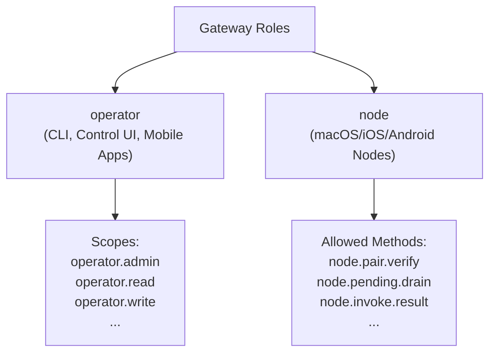
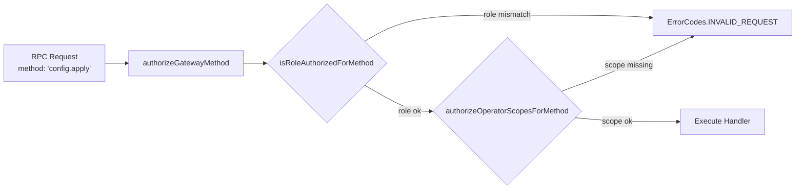
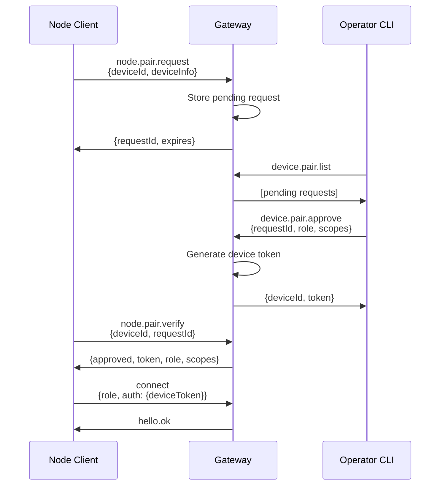
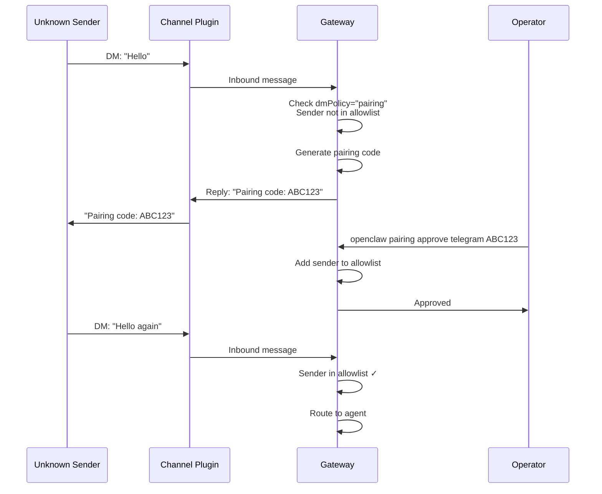
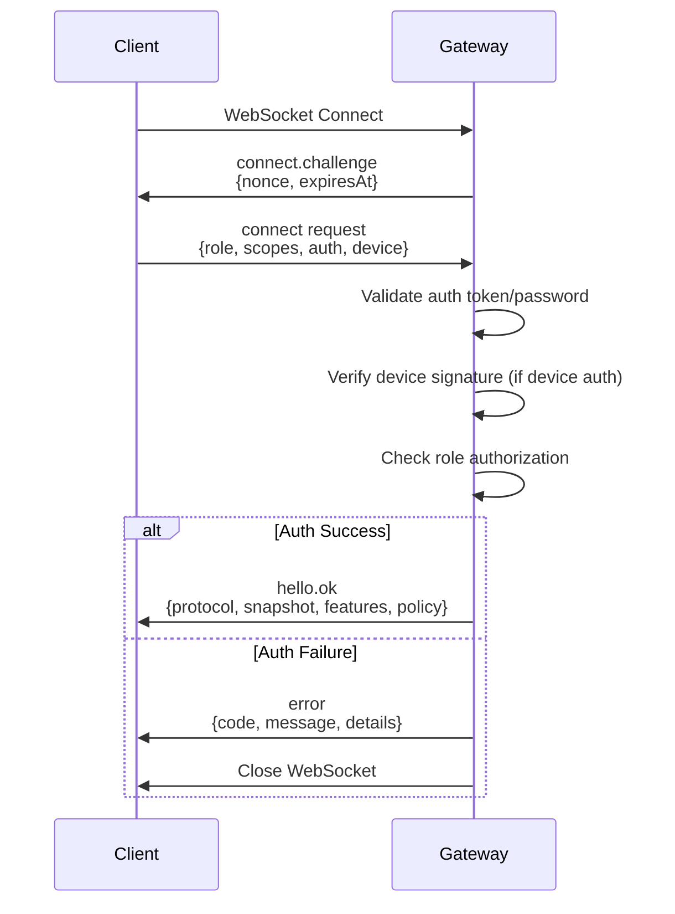
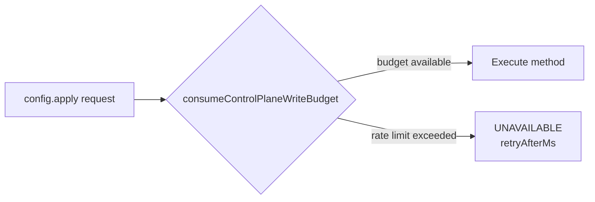

# Authentication & Authorization

<details>
<summary>Relevant source files</summary>

The following files were used as context for generating this wiki page:

- [README.md](README.md)
- [apps/macos/Sources/OpenClawProtocol/GatewayModels.swift](apps/macos/Sources/OpenClawProtocol/GatewayModels.swift)
- [apps/shared/OpenClawKit/Sources/OpenClawProtocol/GatewayModels.swift](apps/shared/OpenClawKit/Sources/OpenClawProtocol/GatewayModels.swift)
- [assets/avatar-placeholder.svg](assets/avatar-placeholder.svg)
- [docs/channels/index.md](docs/channels/index.md)
- [docs/cli/index.md](docs/cli/index.md)
- [docs/cli/onboard.md](docs/cli/onboard.md)
- [docs/concepts/multi-agent.md](docs/concepts/multi-agent.md)
- [docs/docs.json](docs/docs.json)
- [docs/gateway/index.md](docs/gateway/index.md)
- [docs/gateway/troubleshooting.md](docs/gateway/troubleshooting.md)
- [docs/index.md](docs/index.md)
- [docs/reference/wizard.md](docs/reference/wizard.md)
- [docs/start/getting-started.md](docs/start/getting-started.md)
- [docs/start/hubs.md](docs/start/hubs.md)
- [docs/start/onboarding.md](docs/start/onboarding.md)
- [docs/start/setup.md](docs/start/setup.md)
- [docs/start/wizard-cli-automation.md](docs/start/wizard-cli-automation.md)
- [docs/start/wizard-cli-reference.md](docs/start/wizard-cli-reference.md)
- [docs/start/wizard.md](docs/start/wizard.md)
- [docs/tools/skills-config.md](docs/tools/skills-config.md)
- [docs/tools/skills.md](docs/tools/skills.md)
- [docs/web/webchat.md](docs/web/webchat.md)
- [docs/zh-CN/channels/index.md](docs/zh-CN/channels/index.md)
- [extensions/bluebubbles/src/send-helpers.ts](extensions/bluebubbles/src/send-helpers.ts)
- [scripts/clawtributors-map.json](scripts/clawtributors-map.json)
- [scripts/protocol-gen-swift.ts](scripts/protocol-gen-swift.ts)
- [scripts/update-clawtributors.ts](scripts/update-clawtributors.ts)
- [scripts/update-clawtributors.types.ts](scripts/update-clawtributors.types.ts)
- [src/agents/subagent-registry-cleanup.test.ts](src/agents/subagent-registry-cleanup.test.ts)
- [src/agents/tool-catalog.test.ts](src/agents/tool-catalog.test.ts)
- [src/agents/tool-catalog.ts](src/agents/tool-catalog.ts)
- [src/agents/tool-policy.plugin-only-allowlist.test.ts](src/agents/tool-policy.plugin-only-allowlist.test.ts)
- [src/agents/tool-policy.test.ts](src/agents/tool-policy.test.ts)
- [src/agents/tool-policy.ts](src/agents/tool-policy.ts)
- [src/agents/tools/gateway-tool.ts](src/agents/tools/gateway-tool.ts)
- [src/discord/monitor/thread-bindings.shared-state.test.ts](src/discord/monitor/thread-bindings.shared-state.test.ts)
- [src/gateway/method-scopes.test.ts](src/gateway/method-scopes.test.ts)
- [src/gateway/method-scopes.ts](src/gateway/method-scopes.ts)
- [src/gateway/protocol/index.ts](src/gateway/protocol/index.ts)
- [src/gateway/protocol/schema.ts](src/gateway/protocol/schema.ts)
- [src/gateway/protocol/schema/protocol-schemas.ts](src/gateway/protocol/schema/protocol-schemas.ts)
- [src/gateway/protocol/schema/types.ts](src/gateway/protocol/schema/types.ts)
- [src/gateway/server-methods-list.ts](src/gateway/server-methods-list.ts)
- [src/gateway/server-methods.ts](src/gateway/server-methods.ts)
- [src/gateway/server.ts](src/gateway/server.ts)

</details>

## Purpose and Scope

This document describes the authentication and authorization mechanisms in the OpenClaw Gateway. It covers:

- Gateway authentication modes (token/password)
- Role-based access control (operator/node roles)
- Scope-based method authorization
- Device pairing for client connections
- Channel-level access control (DM policies, allowlists)

For configuration details, see [Configuration System](#2.3). For pairing workflows in messaging channels, see the Channels section (#4).

---

## Authentication Overview

The Gateway supports multiple authentication modes to secure WebSocket RPC connections and HTTP endpoints. Authentication occurs during the initial `connect` handshake and is enforced for all subsequent method calls.

### Authentication Modes

OpenClaw supports three authentication modes configured via `gateway.auth.mode`:

| Mode       | Credential Type | Use Case                                    |
| ---------- | --------------- | ------------------------------------------- |
| `token`    | Shared token    | Default; suitable for single-user setups    |
| `password` | Shared password | Alternative to token; required for Funnel   |
| `none`     | No auth         | Loopback-only; blocked on non-loopback bind |

**Sources:** [README.md:214-227](), [docs/gateway/troubleshooting.md:92-150]()

### Configuration

Gateway authentication is configured in `~/.openclaw/openclaw.json`:

```json5
{
  gateway: {
    auth: {
      mode: 'token', // "token" | "password" | "none"
      token: 'secret-token', // Shared token for mode="token"
      password: 'secret-pwd', // Shared password for mode="password"
      allowTailscale: true, // Allow Tailscale identity headers
    },
  },
}
```

**Sources:** [README.md:214-227](), [docs/cli/index.md:62-68]()

### SecretRef Support

Tokens and passwords can be stored as `SecretRef` objects instead of plaintext:

```json5
{
  gateway: {
    auth: {
      token: {
        source: 'env',
        key: 'OPENCLAW_GATEWAY_TOKEN',
      },
    },
  },
}
```

The Gateway resolves `SecretRef` values at startup and runtime. Supported sources: `env`, `file`, `exec`.

**Sources:** [docs/start/wizard.md:75-81](), [docs/cli/onboard.md:1-40]()

---

## Role-Based Access Control

OpenClaw defines two primary roles for Gateway connections:

### Roles



**Diagram: Role Hierarchy**

| Role       | Description                                     | Default Scopes      |
| ---------- | ----------------------------------------------- | ------------------- |
| `operator` | CLI clients, Control UI, mobile apps (non-node) | `operator.admin`    |
| `node`     | Paired device nodes (macOS/iOS/Android)         | (implicit node set) |

Roles are declared in the `connect` request via `ConnectParams.role`.

**Sources:** [src/gateway/server-methods.ts:39-66](), [apps/shared/OpenClawKit/Sources/OpenClawProtocol/GatewayModels.swift:15-75]()

### Scopes

Scopes provide fine-grained authorization for operator clients:

| Scope              | Grants Access To                          |
| ------------------ | ----------------------------------------- |
| `operator.admin`   | All methods (superuser)                   |
| `operator.read`    | Read-only methods (config.get, logs, etc) |
| `operator.write`   | Write methods (config.apply, update, etc) |
| `operator.chat`    | Chat methods (chat.send, agent, etc)      |
| `operator.cron`    | Cron management                           |
| `operator.pairing` | Device pairing                            |

Scopes are declared in `ConnectParams.scopes` as a string array. Clients with `operator.admin` bypass all scope checks.

**Sources:** [src/gateway/method-scopes.ts:1-6](), [src/gateway/server-methods.ts:57-64]()

### Method Authorization



**Diagram: Method Authorization Flow**

The `authorizeGatewayMethod` function in [src/gateway/server-methods.ts:39-66]() validates:

1. **Role check**: Is the client's role allowed for this method?
2. **Scope check** (operator only): Does the client have required scopes?

Node clients bypass scope checks. The `ADMIN_SCOPE` (`operator.admin`) bypasses all scope requirements.

**Sources:** [src/gateway/server-methods.ts:39-66](), [src/gateway/method-scopes.ts:1-97]()

---

## Device Pairing

Device pairing allows trusted nodes (macOS/iOS/Android apps) to connect to the Gateway with per-device tokens.

### Pairing Flow



**Diagram: Device Pairing Sequence**

**Sources:** [apps/shared/OpenClawKit/Sources/OpenClawProtocol/GatewayModels.swift:1-700](), [docs/gateway/troubleshooting.md:92-150](), [docs/cli/index.md:499-521]()

### Device Authentication v2 (Challenge-Response)

Starting with Gateway protocol v3, device authentication uses a challenge-response mechanism:

1. Gateway sends `connect.challenge` (random nonce) in the initial handshake
2. Client signs `{challenge, deviceId, timestamp}` with its device key
3. Client sends `connect.params.device.nonce` and signature
4. Gateway verifies signature against stored device public key

This prevents replay attacks and validates device identity.

**Sources:** [docs/gateway/troubleshooting.md:130-145]()

### Device Token Management

Device tokens can be rotated or revoked:

```bash
openclaw devices list
openclaw devices rotate --device <id> --role operator --scope operator.admin
openclaw devices revoke --device <id> --role operator
```

**Sources:** [docs/cli/index.md:499-521]()

---

## Channel Access Control

Channel access control operates independently from Gateway authentication, governing which senders can interact with agents through messaging platforms.

### DM Policies

Each channel supports DM-level access policies via `dmPolicy`:

| Policy      | Behavior                                               |
| ----------- | ------------------------------------------------------ |
| `pairing`   | Unknown senders receive pairing code; require approval |
| `allowlist` | Only senders in `allowFrom` can message                |
| `open`      | All senders allowed (requires `"*"` in `allowFrom`)    |
| `disabled`  | All DMs blocked                                        |

Configuration example:

```json5
{
  channels: {
    telegram: {
      dmPolicy: 'pairing',
      allowFrom: ['+15555550123'],
    },
  },
}
```

**Sources:** [README.md:118-124](), [docs/channels/index.md:1-80]()

### Pairing Workflow



**Diagram: DM Pairing Flow**

**Sources:** [README.md:118-124](), [docs/cli/index.md:489-498]()

### Group Policies

Groups support additional access controls:

- **Mention gating**: `requireMention: true` requires explicit @mention to respond
- **Group allowlists**: `channels.<channel>.groups` acts as allowlist when set
- **Per-group mention patterns**: Custom mention triggers via `messages.groupChat.mentionPatterns`

**Sources:** [README.md:118-124](), [docs/channels/index.md:1-80]()

---

## Connect Handshake

### Protocol Flow



**Diagram: Connect Handshake Protocol**

**Sources:** [apps/shared/OpenClawKit/Sources/OpenClawProtocol/GatewayModels.swift:15-117](), [docs/gateway/troubleshooting.md:92-150]()

### ConnectParams Schema

The client sends `ConnectParams` during connect:

```typescript
{
  minProtocol: number,
  maxProtocol: number,
  role?: string,           // "operator" | "node"
  scopes?: string[],       // ["operator.admin", ...]
  auth?: {
    token?: string,
    password?: string,
    deviceToken?: string,
  },
  device?: {
    id: string,
    nonce: string,         // Challenge nonce
    signature: string,     // Signed challenge payload
    timestamp: number,
  },
  client: object,          // Client metadata
}
```

**Sources:** [apps/shared/OpenClawKit/Sources/OpenClawProtocol/GatewayModels.swift:15-75](), [src/gateway/protocol/index.ts:79-82]()

### HelloOk Response

On successful authentication, the Gateway responds with `HelloOk`:

```typescript
{
  type: "hello.ok",
  protocol: 3,
  server: {...},
  snapshot: {...},         // Initial state snapshot
  features: {...},
  auth?: {
    deviceId?: string,
    roles?: string[],
    scopes?: string[],
  },
  policy: {                // Client policy
    maxRequestSize?: number,
    rateLimits?: {...},
  },
}
```

**Sources:** [apps/shared/OpenClawKit/Sources/OpenClawProtocol/GatewayModels.swift:77-117]()

---

## Error Codes

### Authentication Errors

| Error Code                   | Meaning                             | Client Action                            |
| ---------------------------- | ----------------------------------- | ---------------------------------------- |
| `AUTH_TOKEN_MISSING`         | Required token not provided         | Send token in `auth.token`               |
| `AUTH_TOKEN_MISMATCH`        | Token does not match gateway config | Check token, retry with device token     |
| `AUTH_DEVICE_TOKEN_MISMATCH` | Device token invalid/revoked        | Re-pair device                           |
| `PAIRING_REQUIRED`           | Device known but not approved       | Approve via `device.pair.approve`        |
| `NOT_PAIRED`                 | Node not paired                     | Initiate pairing via `node.pair.request` |
| `INVALID_REQUEST`            | Role/scope unauthorized for method  | Check role and scopes                    |

**Sources:** [docs/gateway/troubleshooting.md:120-145](), [apps/shared/OpenClawKit/Sources/OpenClawProtocol/GatewayModels.swift:7-13]()

### Error Response Format

Errors follow the `ErrorShape` schema:

```typescript
{
  code: string,            // Error code constant
  message: string,         // Human-readable message
  details?: {
    code?: string,         // Detailed error code
    canRetryWithDeviceToken?: boolean,
    retryable?: boolean,
  },
  retryAfterMs?: number,
}
```

**Sources:** [apps/shared/OpenClawKit/Sources/OpenClawProtocol/GatewayModels.swift:343-371](), [src/gateway/protocol/index.ts:124-131]()

---

## Control Plane Rate Limiting

Write methods to the control plane (`config.apply`, `config.patch`, `update.run`) are rate-limited to **3 requests per 60 seconds** per client/actor.



**Diagram: Control Plane Rate Limiting**

Rate limiting is keyed by actor identity (device ID, IP, or client metadata) and enforced in [src/gateway/server-methods.ts:109-133]().

**Sources:** [src/gateway/server-methods.ts:38-38](), [src/gateway/server-methods.ts:109-133]()

---

## Configuration Reference

### Minimal Gateway Auth Config

```json5
{
  gateway: {
    auth: {
      mode: 'token',
      token: 'your-secret-token',
    },
  },
}
```

### Full Gateway Auth Config

```json5
{
  gateway: {
    auth: {
      mode: 'token', // "token" | "password" | "none"
      token: 'your-secret-token', // or SecretRef
      password: 'your-secret-password', // or SecretRef
      allowTailscale: true, // Allow Tailscale identity
      trustedProxies: ['127.0.0.1'], // Trusted proxy IPs
    },
    bind: 'loopback', // "loopback" | "lan" | "tailnet" | ...
    port: 18789,
  },
}
```

### Channel Access Config

```json5
{
  channels: {
    telegram: {
      dmPolicy: 'pairing', // "pairing" | "allowlist" | "open" | "disabled"
      allowFrom: ['+15555550123'],
      groups: {
        '*': {
          requireMention: true,
        },
      },
    },
  },
}
```

**Sources:** [README.md:214-227](), [README.md:318-379](), [docs/channels/index.md:1-80]()

---

## Related Documentation

- [WebSocket Protocol & RPC](#2.1) — Protocol frame structure and RPC mechanics
- [Configuration System](#2.3) — Full configuration schema and validation
- [Multi-Agent Routing](#2.5) — Agent binding and routing rules
- [Channels](#4) — Channel-specific access control details
- [Security](#10.1) — Broader security policies and best practices
