# Configuration Reference

<details>
<summary>Relevant source files</summary>

The following files were used as context for generating this wiki page:

- [CHANGELOG.md](CHANGELOG.md)
- [docs/cli/memory.md](docs/cli/memory.md)
- [docs/concepts/memory.md](docs/concepts/memory.md)
- [docs/gateway/configuration-reference.md](docs/gateway/configuration-reference.md)
- [docs/gateway/configuration.md](docs/gateway/configuration.md)
- [src/agents/memory-search.test.ts](src/agents/memory-search.test.ts)
- [src/agents/memory-search.ts](src/agents/memory-search.ts)
- [src/agents/pi-embedded-runner/extensions.ts](src/agents/pi-embedded-runner/extensions.ts)
- [src/agents/pi-extensions/compaction-safeguard-runtime.ts](src/agents/pi-extensions/compaction-safeguard-runtime.ts)
- [src/agents/pi-extensions/compaction-safeguard.test.ts](src/agents/pi-extensions/compaction-safeguard.test.ts)
- [src/agents/pi-extensions/compaction-safeguard.ts](src/agents/pi-extensions/compaction-safeguard.ts)
- [src/cli/memory-cli.test.ts](src/cli/memory-cli.test.ts)
- [src/cli/memory-cli.ts](src/cli/memory-cli.ts)
- [src/config/config.compaction-settings.test.ts](src/config/config.compaction-settings.test.ts)
- [src/config/schema.help.quality.test.ts](src/config/schema.help.quality.test.ts)
- [src/config/schema.help.ts](src/config/schema.help.ts)
- [src/config/schema.labels.ts](src/config/schema.labels.ts)
- [src/config/schema.ts](src/config/schema.ts)
- [src/config/types.agent-defaults.ts](src/config/types.agent-defaults.ts)
- [src/config/types.tools.ts](src/config/types.tools.ts)
- [src/config/types.ts](src/config/types.ts)
- [src/config/zod-schema.agent-defaults.ts](src/config/zod-schema.agent-defaults.ts)
- [src/config/zod-schema.agent-runtime.ts](src/config/zod-schema.agent-runtime.ts)
- [src/config/zod-schema.ts](src/config/zod-schema.ts)
- [src/memory/manager.ts](src/memory/manager.ts)

</details>

This page provides comprehensive field-by-field documentation of the `~/.openclaw/openclaw.json` configuration file structure. For an overview of the configuration loading pipeline, validation, and hot reload behavior, see [Configuration System](#2.3).

All configuration fields are optional unless explicitly stated otherwise. OpenClaw uses safe defaults when fields are omitted. The config format is **JSON5**, which supports comments and trailing commas.

**Sources:** [docs/gateway/configuration-reference.md:1-15]()

---

## Configuration Schema Overview

The root configuration object is validated by `ConfigSchema` in the codebase and contains these top-level sections:

```mermaid
graph TB
    Root["ConfigSchema (root)"]

    Root --> Meta["meta: MetaSchema"]
    Root --> Env["env: EnvSchema"]
    Root --> Wizard["wizard: WizardSchema"]
    Root --> Diagnostics["diagnostics: DiagnosticsSchema"]
    Root --> Logging["logging: LoggingSchema"]
    Root --> CLI["cli: CliSchema"]
    Root --> Update["update: UpdateSchema"]
    Root --> Gateway["gateway: GatewaySchema"]
    Root --> Channels["channels: ChannelsSchema"]
    Root --> Agents["agents: AgentsSchema"]
    Root --> Tools["tools: ToolsSchema"]
    Root --> Browser["browser: BrowserSchema"]
    Root --> Web["web: WebSchema"]
    Root --> Discovery["discovery: DiscoverySchema"]
    Root --> Session["session: SessionSchema"]
    Root --> Messages["messages: MessagesSchema"]
    Root --> Commands["commands: CommandsSchema"]
    Root --> Approvals["approvals: ApprovalsSchema"]
    Root --> ACP["acp: AcpSchema"]
    Root --> Talk["talk: TalkSchema"]
    Root --> Bindings["bindings: BindingsSchema[]"]
```

**Configuration Validation Path:**

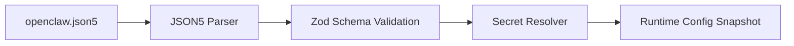

**Sources:** [src/config/zod-schema.providers-core.ts:1-50](), [src/config/schema.help.ts:1-350]()

---

## Meta Section

System-managed metadata fields that record config write and version history:

| Field                     | Type     | Description                                  |
| ------------------------- | -------- | -------------------------------------------- |
| `meta.lastTouchedVersion` | `string` | OpenClaw version that last wrote this config |
| `meta.lastTouchedAt`      | `string` | ISO timestamp of last config write           |

**Example:**

```json5
{
  meta: {
    lastTouchedVersion: '2026.2.25',
    lastTouchedAt: '2026-02-25T10:30:00.000Z',
  },
}
```

**Sources:** [src/config/schema.help.ts:9-11]()

---

## Environment Section

Controls environment variable import and runtime variable injection:

| Field                    | Type                     | Default | Description                                           |
| ------------------------ | ------------------------ | ------- | ----------------------------------------------------- |
| `env.shellEnv.enabled`   | `boolean`                | `true`  | Load variables from user shell profile during startup |
| `env.shellEnv.timeoutMs` | `number`                 | `5000`  | Maximum time for shell environment resolution         |
| `env.vars`               | `Record<string, string>` | `{}`    | Explicit key/value environment overrides              |

**Example:**

```json5
{
  env: {
    shellEnv: {
      enabled: true,
      timeoutMs: 5000,
    },
    vars: {
      NODE_ENV: 'production',
      LOG_LEVEL: 'info',
    },
  },
}
```

**Sources:** [src/config/schema.help.ts:12-20]()

---

## Gateway Section

Gateway runtime configuration for bind mode, authentication, control UI, and operational controls.

### Core Gateway Fields

```mermaid
graph TB
    Gateway["gateway"]

    Gateway --> Port["port: number (18789)"]
    Gateway --> Mode["mode: 'local' | 'remote'"]
    Gateway --> Bind["bind: 'auto' | 'lan' | 'loopback' | 'custom' | 'tailnet'"]
    Gateway --> CustomBindHost["customBindHost: string"]
    Gateway --> ControlUi["controlUi: ControlUiSchema"]
    Gateway --> Auth["auth: GatewayAuthSchema"]
    Gateway --> Tools["tools: GatewayToolsSchema"]
    Gateway --> Remote["remote: RemoteGatewaySchema"]
    Gateway --> Reload["reload: ReloadSchema"]
    Gateway --> TLS["tls: TlsSchema"]
    Gateway --> HTTP["http: HttpSchema"]
    Gateway --> Tailscale["tailscale: TailscaleSchema"]
```

| Field                               | Type                                                             | Default   | Description                                                                                           |
| ----------------------------------- | ---------------------------------------------------------------- | --------- | ----------------------------------------------------------------------------------------------------- |
| `gateway.port`                      | `number`                                                         | `18789`   | TCP port for gateway listener (API, Control UI, channel ingress)                                      |
| `gateway.mode`                      | `"local"` \| `"remote"`                                          | `"local"` | Operation mode: local runs channels and agents on this host; remote connects through remote transport |
| `gateway.bind`                      | `"auto"` \| `"lan"` \| `"loopback"` \| `"custom"` \| `"tailnet"` | `"auto"`  | Network bind profile controlling interface exposure                                                   |
| `gateway.customBindHost`            | `string`                                                         | -         | Explicit bind host/IP when `bind` is `"custom"`                                                       |
| `gateway.channelHealthCheckMinutes` | `number`                                                         | `5`       | Interval in minutes for automatic channel health probing                                              |

**Sources:** [src/config/schema.help.ts:68-110](), [docs/gateway/configuration-reference.md:68-126]()

### Gateway Authentication

The `gateway.auth` object controls HTTP/WebSocket access authentication:

| Field                         | Type                                                       | Default  | Description                                           |
| ----------------------------- | ---------------------------------------------------------- | -------- | ----------------------------------------------------- |
| `gateway.auth.mode`           | `"none"` \| `"token"` \| `"password"` \| `"trusted-proxy"` | `"none"` | Authentication mode                                   |
| `gateway.auth.token`          | `SecretInput`                                              | -        | Bearer token for token auth mode                      |
| `gateway.auth.password`       | `SecretInput`                                              | -        | Password for password auth mode                       |
| `gateway.auth.allowTailscale` | `boolean`                                                  | `false`  | Allow Tailscale identity paths to satisfy auth checks |
| `gateway.auth.rateLimit`      | `RateLimitSchema`                                          | -        | Login/auth attempt throttling controls                |
| `gateway.auth.trustedProxy`   | `TrustedProxyAuthSchema`                                   | -        | Trusted-proxy auth header mapping                     |

**Example:**

```json5
{
  gateway: {
    port: 18789,
    bind: 'loopback',
    auth: {
      mode: 'token',
      token: '${GATEWAY_TOKEN}',
    },
  },
}
```

**Sources:** [src/config/schema.help.ts:82-96](), [docs/gateway/configuration-reference.md:68-126]()

### Gateway TLS

| Field                      | Type      | Default | Description                                     |
| -------------------------- | --------- | ------- | ----------------------------------------------- |
| `gateway.tls.enabled`      | `boolean` | `false` | Enable TLS termination at gateway listener      |
| `gateway.tls.autoGenerate` | `boolean` | `false` | Auto-generate local TLS certificate/key pair    |
| `gateway.tls.certPath`     | `string`  | -       | Filesystem path to TLS certificate file         |
| `gateway.tls.keyPath`      | `string`  | -       | Filesystem path to TLS private key file         |
| `gateway.tls.caPath`       | `string`  | -       | Optional CA bundle path for client verification |

**Sources:** [src/config/schema.help.ts:116-127]()

### Remote Gateway

For split-host operation where this instance proxies to another runtime:

| Field                           | Type                  | Default    | Description                                                 |
| ------------------------------- | --------------------- | ---------- | ----------------------------------------------------------- |
| `gateway.remote.transport`      | `"direct"` \| `"ssh"` | `"direct"` | Connection transport                                        |
| `gateway.remote.url`            | `string`              | -          | Remote Gateway WebSocket URL (`ws://` or `wss://`)          |
| `gateway.remote.token`          | `SecretInput`         | -          | Bearer token for remote gateway authentication              |
| `gateway.remote.password`       | `SecretInput`         | -          | Password credential for remote gateway                      |
| `gateway.remote.tlsFingerprint` | `string`              | -          | Expected sha256 TLS fingerprint (pin to avoid MITM)         |
| `gateway.remote.sshTarget`      | `string`              | -          | SSH tunnel target (format: `user@host` or `user@host:port`) |
| `gateway.remote.sshIdentity`    | `string`              | -          | Optional SSH identity file path                             |

**Sources:** [src/config/schema.help.ts:112-145]()

---

## Channels Section

Multi-channel messaging integration configuration. Each channel starts automatically when its config section exists unless `enabled: false`.

### Channel Defaults and Shared Settings

```mermaid
graph TB
    Channels["channels"]

    Channels --> Defaults["defaults: ChannelDefaultsSchema"]
    Channels --> ModelByChannel["modelByChannel: Record<provider, Record<id, model>>"]
    Channels --> Telegram["telegram: TelegramConfigSchema"]
    Channels --> Discord["discord: DiscordConfigSchema"]
    Channels --> Slack["slack: SlackConfigSchema"]
    Channels --> WhatsApp["whatsapp: WhatsAppConfigSchema"]
    Channels --> Signal["signal: SignalConfigSchema"]
    Channels --> GoogleChat["googlechat: GoogleChatConfigSchema"]
    Channels --> Mattermost["mattermost: MattermostConfigSchema"]
    Channels --> IMessage["imessage: IMessageConfigSchema"]
    Channels --> BlueBubbles["bluebubbles: BlueBubblesConfigSchema"]
    Channels --> IRC["irc: IrcConfigSchema"]
    Channels --> MSTeams["msteams: MSTeamsConfigSchema"]
```

| Field                                      | Type                                      | Default       | Description                                                      |
| ------------------------------------------ | ----------------------------------------- | ------------- | ---------------------------------------------------------------- |
| `channels.defaults.groupPolicy`            | `"open"` \| `"allowlist"` \| `"disabled"` | `"allowlist"` | Fallback group policy when provider-level `groupPolicy` is unset |
| `channels.defaults.heartbeat.showOk`       | `boolean`                                 | `false`       | Include healthy channel statuses in heartbeat output             |
| `channels.defaults.heartbeat.showAlerts`   | `boolean`                                 | `true`        | Include degraded/error statuses in heartbeat output              |
| `channels.defaults.heartbeat.useIndicator` | `boolean`                                 | `true`        | Render compact indicator-style heartbeat output                  |

**Channel Model Override Mapping:**

Use `channels.modelByChannel` to pin specific channel IDs to a model. Values accept `provider/model` or configured model aliases.

```json5
{
  channels: {
    modelByChannel: {
      discord: {
        '123456789012345678': 'anthropic/claude-opus-4-6',
      },
      slack: {
        C1234567890: 'openai/gpt-4.1',
      },
      telegram: {
        '-1001234567890': 'openai/gpt-4.1-mini',
        '-1001234567890:topic:99': 'anthropic/claude-sonnet-4-6',
      },
    },
  },
}
```

**Sources:** [docs/gateway/configuration-reference.md:68-90](), [src/config/zod-schema.providers-core.ts:1-100]()

### DM and Group Access Policies

All channels support DM policies and group policies:

**DM Policy Values:**

| Policy                | Behavior                                                        |
| --------------------- | --------------------------------------------------------------- |
| `"pairing"` (default) | Unknown senders get a one-time pairing code; owner must approve |
| `"allowlist"`         | Only senders in `allowFrom` (or paired allow store)             |
| `"open"`              | Allow all inbound DMs (requires `allowFrom: ["*"]`)             |
| `"disabled"`          | Ignore all inbound DMs                                          |

**Group Policy Values:**

| Policy                  | Behavior                                               |
| ----------------------- | ------------------------------------------------------ |
| `"allowlist"` (default) | Only groups matching the configured allowlist          |
| `"open"`                | Bypass group allowlists (mention-gating still applies) |
| `"disabled"`            | Block all group/room messages                          |

**Sources:** [docs/gateway/configuration-reference.md:22-43]()

### Telegram Configuration

**Schema Path:** `TelegramConfigSchema` in [src/config/zod-schema.providers-core.ts:152-344]()

**Core Fields:**

| Field                              | Type                                                | Default       | Description                                                        |
| ---------------------------------- | --------------------------------------------------- | ------------- | ------------------------------------------------------------------ |
| `channels.telegram.enabled`        | `boolean`                                           | `true`        | Enable Telegram channel                                            |
| `channels.telegram.botToken`       | `SecretInput`                                       | -             | Telegram bot token (env: `TELEGRAM_BOT_TOKEN` for default account) |
| `channels.telegram.tokenFile`      | `string`                                            | -             | Alternative: path to file containing bot token                     |
| `channels.telegram.dmPolicy`       | `DmPolicy`                                          | `"pairing"`   | Direct message access policy                                       |
| `channels.telegram.groupPolicy`    | `GroupPolicy`                                       | `"allowlist"` | Group message access policy                                        |
| `channels.telegram.allowFrom`      | `Array<string \| number>`                           | -             | Allowlist for DM senders (numeric Telegram user IDs)               |
| `channels.telegram.groupAllowFrom` | `Array<string \| number>`                           | -             | Allowlist for group senders (falls back to `allowFrom`)            |
| `channels.telegram.historyLimit`   | `number`                                            | `50`          | Group chat history limit                                           |
| `channels.telegram.dmHistoryLimit` | `number`                                            | -             | DM history limit (falls back to unlimited)                         |
| `channels.telegram.textChunkLimit` | `number`                                            | `4000`        | Max text chars before splitting                                    |
| `channels.telegram.chunkMode`      | `"length"` \| `"newline"`                           | `"length"`    | Text splitting strategy                                            |
| `channels.telegram.streaming`      | `"off"` \| `"partial"` \| `"block"` \| `"progress"` | `"partial"`   | Live stream preview mode                                           |
| `channels.telegram.mediaMaxMb`     | `number`                                            | `100`         | Max media file size in MB                                          |
| `channels.telegram.linkPreview`    | `boolean`                                           | `true`        | Enable link preview in messages                                    |

**Group Configuration:**

```json5
{
  channels: {
    telegram: {
      groups: {
        '-1001234567890': {
          requireMention: true,
          allowFrom: ['123456789'],
          systemPrompt: 'Keep answers brief.',
          topics: {
            '99': {
              requireMention: false,
              skills: ['search'],
              agentId: 'research',
            },
          },
        },
      },
    },
  },
}
```

**Multi-Account Configuration:**

```json5
{
  channels: {
    telegram: {
      accounts: {
        default: {
          name: 'Primary bot',
          botToken: '123456:ABC...',
        },
        alerts: {
          name: 'Alerts bot',
          botToken: '987654:XYZ...',
        },
      },
      defaultAccount: 'default',
    },
  },
}
```

**Sources:** [docs/gateway/configuration-reference.md:152-212](), [src/config/zod-schema.providers-core.ts:152-344](), [docs/channels/telegram.md:1-100]()

### Discord Configuration

**Schema Path:** `DiscordConfigSchema` in [src/config/zod-schema.providers-core.ts:417-580]()

**Core Fields:**

| Field                                 | Type                                                | Default       | Description                                                      |
| ------------------------------------- | --------------------------------------------------- | ------------- | ---------------------------------------------------------------- |
| `channels.discord.enabled`            | `boolean`                                           | `true`        | Enable Discord channel                                           |
| `channels.discord.token`              | `SecretInput`                                       | -             | Discord bot token (env: `DISCORD_BOT_TOKEN` for default account) |
| `channels.discord.dmPolicy`           | `DmPolicy`                                          | `"pairing"`   | Direct message access policy                                     |
| `channels.discord.groupPolicy`        | `GroupPolicy`                                       | `"allowlist"` | Guild access policy                                              |
| `channels.discord.allowFrom`          | `Array<string>`                                     | -             | Allowlist for DM senders (Discord IDs as strings)                |
| `channels.discord.historyLimit`       | `number`                                            | `20`          | Guild channel history limit                                      |
| `channels.discord.dmHistoryLimit`     | `number`                                            | -             | DM history limit                                                 |
| `channels.discord.textChunkLimit`     | `number`                                            | `2000`        | Max text chars before splitting                                  |
| `channels.discord.chunkMode`          | `"length"` \| `"newline"`                           | `"length"`    | Text splitting strategy                                          |
| `channels.discord.streaming`          | `"off"` \| `"partial"` \| `"block"` \| `"progress"` | `"off"`       | Stream preview mode                                              |
| `channels.discord.maxLinesPerMessage` | `number`                                            | `17`          | Max lines before splitting tall messages                         |
| `channels.discord.mediaMaxMb`         | `number`                                            | `8`           | Max media file size in MB                                        |
| `channels.discord.allowBots`          | `boolean` \| `"mentions"`                           | `false`       | Allow bot-authored messages                                      |
| `channels.discord.replyToMode`        | `"off"` \| `"first"` \| `"all"`                     | `"off"`       | Reply threading mode                                             |

**Guild Configuration:**

```json5
{
  channels: {
    discord: {
      guilds: {
        '123456789012345678': {
          slug: 'friends-of-openclaw',
          requireMention: false,
          ignoreOtherMentions: true,
          users: ['987654321098765432'],
          channels: {
            general: { allow: true },
            help: {
              allow: true,
              requireMention: true,
              skills: ['docs'],
              systemPrompt: 'Short answers only.',
            },
          },
        },
      },
    },
  },
}
```

**Thread Bindings Configuration:**

| Field                                                   | Type      | Default | Description                                                        |
| ------------------------------------------------------- | --------- | ------- | ------------------------------------------------------------------ |
| `channels.discord.threadBindings.enabled`               | `boolean` | -       | Discord override for thread-bound session features                 |
| `channels.discord.threadBindings.idleHours`             | `number`  | `24`    | Inactivity auto-unfocus timeout in hours (0 disables)              |
| `channels.discord.threadBindings.maxAgeHours`           | `number`  | `0`     | Hard max age in hours (0 disables)                                 |
| `channels.discord.threadBindings.spawnSubagentSessions` | `boolean` | `false` | Opt-in for `sessions_spawn({ thread: true })` auto thread creation |

**Voice Configuration:**

```json5
{
  channels: {
    discord: {
      voice: {
        enabled: true,
        autoJoin: [
          {
            guildId: '123456789012345678',
            channelId: '234567890123456789',
          },
        ],
        daveEncryption: true,
        decryptionFailureTolerance: 24,
        tts: {
          provider: 'openai',
          openai: { voice: 'alloy' },
        },
      },
    },
  },
}
```

**Sources:** [docs/gateway/configuration-reference.md:215-326](), [src/config/zod-schema.providers-core.ts:417-580](), [docs/channels/discord.md:1-300]()

### Slack Configuration

**Schema Path:** `SlackConfigSchema` in [src/config/zod-schema.providers-core.ts:655-850]()

**Core Fields:**

| Field                                  | Type                                                | Default       | Description                                                          |
| -------------------------------------- | --------------------------------------------------- | ------------- | -------------------------------------------------------------------- |
| `channels.slack.enabled`               | `boolean`                                           | `true`        | Enable Slack channel                                                 |
| `channels.slack.botToken`              | `SecretInput`                                       | -             | Slack bot token (env: `SLACK_BOT_TOKEN` for default account)         |
| `channels.slack.appToken`              | `SecretInput`                                       | -             | Slack app token for socket mode (env: `SLACK_APP_TOKEN` for default) |
| `channels.slack.signingSecret`         | `SecretInput`                                       | -             | Slack signing secret for HTTP mode                                   |
| `channels.slack.mode`                  | `"socket"` \| `"http"`                              | `"socket"`    | Connection mode                                                      |
| `channels.slack.dmPolicy`              | `DmPolicy`                                          | `"pairing"`   | Direct message access policy                                         |
| `channels.slack.groupPolicy`           | `GroupPolicy`                                       | `"allowlist"` | Channel access policy                                                |
| `channels.slack.allowFrom`             | `Array<string>`                                     | -             | Allowlist for DM senders (Slack user IDs)                            |
| `channels.slack.historyLimit`          | `number`                                            | `50`          | Channel history limit                                                |
| `channels.slack.textChunkLimit`        | `number`                                            | `4000`        | Max text chars before splitting                                      |
| `channels.slack.streaming`             | `"off"` \| `"partial"` \| `"block"` \| `"progress"` | `"partial"`   | Stream mode                                                          |
| `channels.slack.nativeStreaming`       | `boolean`                                           | `true`        | Use Slack native streaming API when streaming is enabled             |
| `channels.slack.reactionNotifications` | `"off"` \| `"own"` \| `"all"` \| `"allowlist"`      | `"own"`       | Reaction notification mode                                           |
| `channels.slack.replyToMode`           | `"off"` \| `"first"` \| `"all"`                     | `"off"`       | Reply threading mode                                                 |

**Channel Configuration:**

```json5
{
  channels: {
    slack: {
      channels: {
        C123: {
          allow: true,
          requireMention: true,
          users: ['U123'],
          skills: ['docs'],
          systemPrompt: 'Short answers only.',
        },
      },
    },
  },
}
```

**Thread Configuration:**

| Field                                 | Type                      | Default    | Description                                   |
| ------------------------------------- | ------------------------- | ---------- | --------------------------------------------- |
| `channels.slack.thread.historyScope`  | `"thread"` \| `"channel"` | `"thread"` | Per-thread or shared across channel           |
| `channels.slack.thread.inheritParent` | `boolean`                 | `false`    | Copy parent channel transcript to new threads |

**Sources:** [docs/gateway/configuration-reference.md:365-440](), [src/slack/monitor/provider.ts:1-300]()

### WhatsApp Configuration

**Schema Path:** `WhatsAppConfigSchema` (implicit in gateway channels)

WhatsApp runs through the gateway's web channel (Baileys Web). It starts automatically when a linked session exists.

| Field                                | Type                      | Default       | Description                               |
| ------------------------------------ | ------------------------- | ------------- | ----------------------------------------- |
| `channels.whatsapp.dmPolicy`         | `DmPolicy`                | `"pairing"`   | Direct message access policy              |
| `channels.whatsapp.groupPolicy`      | `GroupPolicy`             | `"allowlist"` | Group access policy                       |
| `channels.whatsapp.allowFrom`        | `Array<string>`           | -             | Allowlist for DM senders (phone numbers)  |
| `channels.whatsapp.groupAllowFrom`   | `Array<string>`           | -             | Allowlist for group senders               |
| `channels.whatsapp.textChunkLimit`   | `number`                  | `4000`        | Max text chars before splitting           |
| `channels.whatsapp.chunkMode`        | `"length"` \| `"newline"` | `"length"`    | Text splitting strategy                   |
| `channels.whatsapp.mediaMaxMb`       | `number`                  | `50`          | Max media file size in MB                 |
| `channels.whatsapp.sendReadReceipts` | `boolean`                 | `true`        | Send blue ticks (false in self-chat mode) |

**Multi-Account Configuration:**

```json5
{
  channels: {
    whatsapp: {
      accounts: {
        default: {},
        personal: {},
        biz: {
          // authDir: "~/.openclaw/credentials/whatsapp/biz"
        },
      },
      defaultAccount: 'default',
    },
  },
}
```

**Sources:** [docs/gateway/configuration-reference.md:92-150]()

### Signal Configuration

**Schema Path:** Signal integration via signal-cli

| Field                                   | Type                                           | Default     | Description                             |
| --------------------------------------- | ---------------------------------------------- | ----------- | --------------------------------------- |
| `channels.signal.enabled`               | `boolean`                                      | `true`      | Enable Signal channel                   |
| `channels.signal.account`               | `string`                                       | -           | Optional account binding (phone number) |
| `channels.signal.dmPolicy`              | `DmPolicy`                                     | `"pairing"` | Direct message access policy            |
| `channels.signal.allowFrom`             | `Array<string>`                                | -           | Allowlist (phone numbers or UUIDs)      |
| `channels.signal.reactionNotifications` | `"off"` \| `"own"` \| `"all"` \| `"allowlist"` | `"own"`     | Reaction notification mode              |
| `channels.signal.reactionAllowlist`     | `Array<string>`                                | -           | Allowlist for reaction notifications    |
| `channels.signal.historyLimit`          | `number`                                       | `50`        | History limit                           |

**Sources:** [docs/gateway/configuration-reference.md:484-506]()

### Other Channels

Additional channels are configured similarly under their respective keys:

- **Google Chat**: `channels.googlechat` (service account + webhook)
- **Mattermost**: `channels.mattermost` (bot token + base URL)
- **iMessage**: `channels.imessage` (imsg CLI + DB path)
- **BlueBubbles**: `channels.bluebubbles` (server URL + password)
- **IRC**: `channels.irc` (server + channels + NickServ)
- **Microsoft Teams**: `channels.msteams` (app credentials + webhook)

See [Channels](#4) for detailed channel-specific documentation.

**Sources:** [docs/gateway/configuration-reference.md:329-653]()

---

## Agents Section

Agent runtime configuration covering defaults and explicit agent entries used for routing and execution context.

### Agent Configuration Structure

```mermaid
graph TB
    Agents["agents"]

    Agents --> Defaults["defaults: AgentDefaultsSchema"]
    Agents --> List["list: AgentSchema[]"]

    Defaults --> Model["model: AgentModelSchema"]
    Defaults --> ImageModel["imageModel: AgentModelSchema"]
    Defaults --> PdfModel["pdfModel: AgentModelSchema"]
    Defaults --> Models["models: Record<string, AgentModelEntry>"]
    Defaults --> Workspace["workspace: string"]
    Defaults --> Heartbeat["heartbeat: HeartbeatSchema"]
    Defaults --> Compaction["compaction: CompactionSchema"]
    Defaults --> ContextPruning["contextPruning: ContextPruningSchema"]
    Defaults --> MemorySearch["memorySearch: MemorySearchSchema"]

    List --> AgentId["id: string"]
    List --> AgentRuntime["runtime: AgentRuntimeSchema"]
    List --> AgentModel["model: AgentModelSchema"]
    List --> AgentTools["tools: ToolPolicySchema"]
    List --> AgentIdentity["identity: IdentitySchema"]
    List --> AgentWorkspace["workspace: string"]
```

**Sources:** [src/config/zod-schema.agent-defaults.ts:1-150]()

### Agent Defaults

**Workspace and Bootstrap:**

| Field                                              | Type                              | Default                 | Description                                                             |
| -------------------------------------------------- | --------------------------------- | ----------------------- | ----------------------------------------------------------------------- |
| `agents.defaults.workspace`                        | `string`                          | `~/.openclaw/workspace` | Default workspace directory                                             |
| `agents.defaults.repoRoot`                         | `string`                          | (auto-detected)         | Repository root shown in system prompt Runtime line                     |
| `agents.defaults.skipBootstrap`                    | `boolean`                         | `false`                 | Disable automatic creation of workspace bootstrap files                 |
| `agents.defaults.bootstrapMaxChars`                | `number`                          | `20000`                 | Max chars per workspace bootstrap file before truncation                |
| `agents.defaults.bootstrapTotalMaxChars`           | `number`                          | `150000`                | Max total chars across all bootstrap files                              |
| `agents.defaults.bootstrapPromptTruncationWarning` | `"off"` \| `"once"` \| `"always"` | `"once"`                | Controls agent-visible warning text when bootstrap context is truncated |

**Model Configuration:**

| Field                            | Type                                    | Default  | Description                                             |
| -------------------------------- | --------------------------------------- | -------- | ------------------------------------------------------- |
| `agents.defaults.model`          | `string` \| `AgentModelListConfig`      | -        | Primary model (string) or model with fallbacks (object) |
| `agents.defaults.imageModel`     | `string` \| `AgentModelListConfig`      | -        | Vision model config                                     |
| `agents.defaults.pdfModel`       | `string` \| `AgentModelListConfig`      | -        | PDF tool model config                                   |
| `agents.defaults.models`         | `Record<string, AgentModelEntryConfig>` | -        | Model catalog and allowlist for `/model` command        |
| `agents.defaults.contextTokens`  | `number`                                | `200000` | Context token limit                                     |
| `agents.defaults.timeoutSeconds` | `number`                                | `600`    | Agent turn timeout                                      |
| `agents.defaults.maxConcurrent`  | `number`                                | `1`      | Max parallel agent runs across sessions                 |

**Model Entry Configuration:**

```json5
{
  agents: {
    defaults: {
      models: {
        'anthropic/claude-opus-4-6': {
          alias: 'opus',
          params: {
            temperature: 0.7,
            cacheRetention: 'auto',
          },
        },
        'openai/gpt-5.2': {
          alias: 'gpt',
        },
      },
      model: {
        primary: 'anthropic/claude-opus-4-6',
        fallbacks: ['openai/gpt-5.2'],
      },
    },
  },
}
```

**Built-in Model Aliases:**

| Alias          | Model                           |
| -------------- | ------------------------------- |
| `opus`         | `anthropic/claude-opus-4-6`     |
| `sonnet`       | `anthropic/claude-sonnet-4-5`   |
| `gpt`          | `openai/gpt-5.2`                |
| `gpt-mini`     | `openai/gpt-5-mini`             |
| `gemini`       | `google/gemini-3-pro-preview`   |
| `gemini-flash` | `google/gemini-3-flash-preview` |

**Sources:** [docs/gateway/configuration-reference.md:756-926]()

### Agent List

Each agent entry in `agents.list[]` defines an agent with explicit routing and execution config:

| Field                           | Type                               | Default      | Description                              |
| ------------------------------- | ---------------------------------- | ------------ | ---------------------------------------- |
| `agents.list[].id`              | `string`                           | (required)   | Unique agent ID for routing and bindings |
| `agents.list[].runtime.type`    | `"embedded"` \| `"acp"`            | `"embedded"` | Runtime type                             |
| `agents.list[].runtime.acp`     | `AcpRuntimeConfig`                 | -            | ACP runtime defaults when `type=acp`     |
| `agents.list[].model`           | `string` \| `AgentModelListConfig` | (inherits)   | Agent-specific model override            |
| `agents.list[].workspace`       | `string`                           | (inherits)   | Agent-specific workspace                 |
| `agents.list[].tools`           | `ToolPolicySchema`                 | (inherits)   | Agent-specific tool policy               |
| `agents.list[].identity.name`   | `string`                           | -            | Agent display name                       |
| `agents.list[].identity.avatar` | `string`                           | -            | Avatar image path or URL                 |
| `agents.list[].skills`          | `Array<string>`                    | (all skills) | Allowlist of skills for this agent       |

**Example:**

```json5
{
  agents: {
    list: [
      {
        id: 'main',
        identity: {
          name: 'OpenClaw',
          avatar: 'avatar.png',
        },
      },
      {
        id: 'research',
        model: 'anthropic/claude-sonnet-4-5',
        skills: ['web_search', 'memory'],
        workspace: '~/research-workspace',
      },
      {
        id: 'codex',
        runtime: {
          type: 'acp',
          acp: {
            agent: 'codex',
            backend: 'acpx',
            mode: 'persistent',
          },
        },
      },
    ],
  },
}
```

**Sources:** [docs/gateway/configuration-reference.md:201-230](), [src/config/types.agent-defaults.ts:1-200]()

### Heartbeat Configuration

Periodic heartbeat runs for proactive agent activity:

| Field                                                 | Type                            | Default    | Description                                   |
| ----------------------------------------------------- | ------------------------------- | ---------- | --------------------------------------------- |
| `agents.defaults.heartbeat.every`                     | `string`                        | `"30m"`    | Duration string (ms/s/m/h), 0m disables       |
| `agents.defaults.heartbeat.model`                     | `string`                        | (inherits) | Model for heartbeat runs                      |
| `agents.defaults.heartbeat.includeReasoning`          | `boolean`                       | `false`    | Include reasoning in heartbeat output         |
| `agents.defaults.heartbeat.lightContext`              | `boolean`                       | `false`    | Keep only `HEARTBEAT.md` from bootstrap files |
| `agents.defaults.heartbeat.session`                   | `string`                        | `"main"`   | Session key for heartbeat                     |
| `agents.defaults.heartbeat.to`                        | `string`                        | -          | Target channel for heartbeat delivery         |
| `agents.defaults.heartbeat.target`                    | `"none"` \| `"last"` \| channel | `"none"`   | Heartbeat delivery target                     |
| `agents.defaults.heartbeat.prompt`                    | `string`                        | -          | Custom prompt for heartbeat runs              |
| `agents.defaults.heartbeat.suppressToolErrorWarnings` | `boolean`                       | `false`    | Suppress tool error warnings in heartbeat     |

**Sources:** [docs/gateway/configuration-reference.md:963-994]()

### Compaction Configuration

Context compaction controls for long-running sessions:

| Field                                                        | Type                                | Default                            | Description                                                     |
| ------------------------------------------------------------ | ----------------------------------- | ---------------------------------- | --------------------------------------------------------------- |
| `agents.defaults.compaction.mode`                            | `"default"` \| `"safeguard"`        | `"safeguard"`                      | Compaction strategy                                             |
| `agents.defaults.compaction.reserveTokensFloor`              | `number`                            | `24000`                            | Reserve token floor before compaction                           |
| `agents.defaults.compaction.identifierPolicy`                | `"strict"` \| `"off"` \| `"custom"` | `"strict"`                         | Identifier preservation policy                                  |
| `agents.defaults.compaction.identifierInstructions`          | `string`                            | -                                  | Custom identifier-preservation text when `policy=custom`        |
| `agents.defaults.compaction.postCompactionSections`          | `Array<string>`                     | `["Session Startup", "Red Lines"]` | AGENTS.md sections to re-inject after compaction                |
| `agents.defaults.compaction.memoryFlush.enabled`             | `boolean`                           | `true`                             | Silent agentic turn before compaction to store durable memories |
| `agents.defaults.compaction.memoryFlush.softThresholdTokens` | `number`                            | `6000`                             | Token threshold for memory flush trigger                        |

**Sources:** [docs/gateway/configuration-reference.md:996-1024]()

### Context Pruning Configuration

| Field                                               | Type                     | Default | Description                              |
| --------------------------------------------------- | ------------------------ | ------- | ---------------------------------------- |
| `agents.defaults.contextPruning.mode`               | `"off"` \| `"cache-ttl"` | `"off"` | Context pruning mode                     |
| `agents.defaults.contextPruning.ttl`                | `string`                 | `"60m"` | Cache TTL duration string                |
| `agents.defaults.contextPruning.keepLastAssistants` | `number`                 | `3`     | Keep N most recent assistant messages    |
| `agents.defaults.contextPruning.softTrimRatio`      | `number`                 | `0.7`   | Context size ratio to trigger soft trim  |
| `agents.defaults.contextPruning.hardClearRatio`     | `number`                 | `0.9`   | Context size ratio to trigger hard clear |

**Sources:** [docs/gateway/configuration-reference.md:1025-1110]()

---

## Tools Section

Global tool access policy and capability configuration.

### Tool Policy Structure

```mermaid
graph TB
    Tools["tools"]

    Tools --> Allow["allow: string[]"]
    Tools --> Deny["deny: string[]"]
    Tools --> Profile["profile: string"]
    Tools --> AlsoAllow["alsoAllow: string[]"]
    Tools --> Web["web: WebToolsSchema"]
    Tools --> Exec["exec: ExecToolSchema"]
    Tools --> Media["media: MediaToolsSchema"]
    Tools --> Links["links: LinksToolSchema"]
    Tools --> AgentToAgent["agentToAgent: AgentToAgentSchema"]
    Tools --> Elevated["elevated: ElevatedToolsSchema"]
    Tools --> Subagents["subagents: SubagentToolPolicySchema"]
    Tools --> Sandbox["sandbox: SandboxToolPolicySchema"]
    Tools --> FS["fs: FsToolsSchema"]
    Tools --> Sessions["sessions: SessionsToolSchema"]
    Tools --> Message["message: MessageToolSchema"]
    Tools --> LoopDetection["loopDetection: LoopDetectionSchema"]
```

**Sources:** [src/config/schema.help.ts:293-330]()

### Global Tool Policy

| Field             | Type            | Default | Description                                                   |
| ----------------- | --------------- | ------- | ------------------------------------------------------------- |
| `tools.allow`     | `Array<string>` | -       | Absolute tool allowlist (replaces profile defaults)           |
| `tools.deny`      | `Array<string>` | -       | Global tool denylist (blocks even if profile allows)          |
| `tools.profile`   | `string`        | -       | Named tool profile (e.g., `"default"`, `"minimal"`, `"full"`) |
| `tools.alsoAllow` | `Array<string>` | -       | Additional tools to allow beyond profile                      |

**Sources:** [src/config/schema.help.ts:295-299]()

### Web Tools

| Field                              | Type                                                              | Default   | Description                             |
| ---------------------------------- | ----------------------------------------------------------------- | --------- | --------------------------------------- |
| `tools.web.search.enabled`         | `boolean`                                                         | `true`    | Enable web search tool                  |
| `tools.web.search.provider`        | `"brave"` \| `"perplexity"` \| `"gemini"` \| `"grok"` \| `"kimi"` | `"brave"` | Search provider                         |
| `tools.web.search.apiKey`          | `SecretInput`                                                     | -         | API key for search provider             |
| `tools.web.search.maxResults`      | `number`                                                          | `10`      | Max search results to return            |
| `tools.web.search.timeoutSeconds`  | `number`                                                          | `30`      | Search timeout                          |
| `tools.web.search.cacheTtlMinutes` | `number`                                                          | `60`      | Search result cache TTL                 |
| `tools.web.fetch.enabled`          | `boolean`                                                         | `true`    | Enable web fetch tool                   |
| `tools.web.fetch.maxChars`         | `number`                                                          | `50000`   | Max chars to extract from fetched pages |
| `tools.web.fetch.timeoutSeconds`   | `number`                                                          | `30`      | Fetch timeout                           |

**Sources:** [docs/gateway/configuration-reference.md:1315-1420]()

### Exec Tool

| Field                                | Type                                | Default    | Description                                           |
| ------------------------------------ | ----------------------------------- | ---------- | ----------------------------------------------------- |
| `tools.exec.host`                    | `"local"` \| `"node"`               | `"local"`  | Execution host strategy                               |
| `tools.exec.security`                | `"strict"` \| `"permissive"`        | `"strict"` | Security posture                                      |
| `tools.exec.ask`                     | `"always"` \| `"auto"` \| `"never"` | `"auto"`   | Approval strategy                                     |
| `tools.exec.node`                    | `NodeBindingSchema`                 | -          | Node binding for delegated execution                  |
| `tools.exec.notifyOnExit`            | `boolean`                           | `true`     | Notify agent when process exits                       |
| `tools.exec.approvalRunningNoticeMs` | `number`                            | `5000`     | Delay before showing "running" notice during approval |

**Sources:** [src/config/schema.help.ts:302-310]()

### Media Tools

| Field                        | Type                 | Default  | Description                     |
| ---------------------------- | -------------------- | -------- | ------------------------------- |
| `tools.media.image.enabled`  | `boolean`            | `true`   | Enable image understanding      |
| `tools.media.image.maxBytes` | `number` \| `string` | `"10MB"` | Max image size                  |
| `tools.media.image.maxChars` | `number`             | `10000`  | Max output chars                |
| `tools.media.image.models`   | `Array<string>`      | -        | Image understanding models      |
| `tools.media.audio.enabled`  | `boolean`            | `true`   | Enable audio transcription      |
| `tools.media.video.enabled`  | `boolean`            | `true`   | Enable video understanding      |
| `tools.media.concurrency`    | `number`             | `3`      | Max concurrent media processing |

**Sources:** [src/config/schema.help.ts:132-150]()

### Agent-to-Agent Tool

| Field                        | Type            | Default | Description                                                   |
| ---------------------------- | --------------- | ------- | ------------------------------------------------------------- |
| `tools.agentToAgent.enabled` | `boolean`       | `false` | Enable agent-to-agent tool surface                            |
| `tools.agentToAgent.allow`   | `Array<string>` | -       | Allowlist of target agent IDs permitted for cross-agent calls |

**Sources:** [src/config/schema.help.ts:311-316]()

### Elevated Tools

| Field                      | Type                            | Default | Description                                     |
| -------------------------- | ------------------------------- | ------- | ----------------------------------------------- |
| `tools.elevated.enabled`   | `boolean`                       | `false` | Enable elevated tool execution path             |
| `tools.elevated.allowFrom` | `Record<string, Array<string>>` | -       | Sender allow rules by channel/provider identity |

**Example:**

```json5
{
  tools: {
    elevated: {
      enabled: true,
      allowFrom: {
        telegram: ['123456789'],
        discord: ['user:987654321098765432'],
      },
    },
  },
}
```

**Sources:** [src/config/schema.help.ts:317-322]()

---

## Browser Section

Browser runtime controls for local or remote CDP attachment, profile routing, and automation behavior.

| Field                       | Type                                   | Default | Description                                            |
| --------------------------- | -------------------------------------- | ------- | ------------------------------------------------------ |
| `browser.enabled`           | `boolean`                              | `true`  | Enable browser capability wiring                       |
| `browser.cdpUrl`            | `string`                               | -       | Remote CDP websocket URL                               |
| `browser.executablePath`    | `string`                               | (auto)  | Explicit browser executable path                       |
| `browser.headless`          | `boolean`                              | `true`  | Force browser launch in headless mode                  |
| `browser.noSandbox`         | `boolean`                              | `false` | Disable Chromium sandbox isolation flags               |
| `browser.attachOnly`        | `boolean`                              | `false` | Restrict to attach-only mode (no local browser launch) |
| `browser.cdpPortRangeStart` | `number`                               | `9222`  | Starting local CDP port for auto-allocated profiles    |
| `browser.defaultProfile`    | `string`                               | -       | Default profile name when not explicitly chosen        |
| `browser.profiles`          | `Record<string, BrowserProfileConfig>` | -       | Named browser profile connection map                   |

**Profile Configuration:**

| Field                           | Type                       | Description                             |
| ------------------------------- | -------------------------- | --------------------------------------- |
| `browser.profiles.*.cdpPort`    | `number`                   | Per-profile local CDP port              |
| `browser.profiles.*.cdpUrl`     | `string`                   | Per-profile CDP websocket URL           |
| `browser.profiles.*.driver`     | `"clawd"` \| `"extension"` | Browser driver mode                     |
| `browser.profiles.*.attachOnly` | `boolean`                  | Per-profile attach-only override        |
| `browser.profiles.*.color`      | `string`                   | Accent color for visual differentiation |

**Sources:** [src/config/schema.help.ts:231-282]()

---

## Discovery Section

Service discovery settings for local mDNS advertisement and optional wide-area signaling.

| Field                        | Type                               | Default     | Description                          |
| ---------------------------- | ---------------------------------- | ----------- | ------------------------------------ |
| `discovery.mdns.mode`        | `"minimal"` \| `"full"` \| `"off"` | `"minimal"` | mDNS broadcast mode                  |
| `discovery.wideArea.enabled` | `boolean`                          | `false`     | Enable wide-area discovery signaling |

**Sources:** [src/config/schema.help.ts:283-292]()

---

## Session Section

Session management configuration for scope, keys, and thread bindings.

| Field                                | Type                                          | Default        | Description                        |
| ------------------------------------ | --------------------------------------------- | -------------- | ---------------------------------- |
| `session.scope`                      | `"per-sender"` \| `"per-channel"` \| `"main"` | `"per-sender"` | Session isolation scope            |
| `session.mainKey`                    | `string`                                      | `"main"`       | Session key for main session       |
| `session.dmScope`                    | `"per-sender"` \| `"main"`                    | `"main"`       | DM session scope                   |
| `session.threadBindings.enabled`     | `boolean`                                     | -              | Global thread-binding feature gate |
| `session.threadBindings.idleHours`   | `number`                                      | `24`           | Idle timeout in hours              |
| `session.threadBindings.maxAgeHours` | `number`                                      | `0`            | Hard max age in hours (0 disables) |

**Sources:** [src/config/types.base.ts:1-100]()

---

## Commands Section

Chat command handling configuration for native and text commands.

| Field                       | Type                            | Default  | Description                                         |
| --------------------------- | ------------------------------- | -------- | --------------------------------------------------- |
| `commands.native`           | `boolean` \| `"auto"`           | `"auto"` | Register native commands when supported             |
| `commands.text`             | `boolean`                       | `true`   | Parse `/commands` in chat messages                  |
| `commands.bash`             | `boolean`                       | `false`  | Allow `!` (alias: `/bash`)                          |
| `commands.bashForegroundMs` | `number`                        | `2000`   | Bash command foreground timeout                     |
| `commands.config`           | `boolean`                       | `false`  | Allow `/config` command                             |
| `commands.debug`            | `boolean`                       | `false`  | Allow `/debug` command                              |
| `commands.restart`          | `boolean`                       | `false`  | Allow `/restart` + gateway restart tool             |
| `commands.allowFrom`        | `Record<string, Array<string>>` | -        | Per-provider command authorization                  |
| `commands.useAccessGroups`  | `boolean`                       | `true`   | Use access-group policies for command authorization |

**Sources:** [docs/gateway/configuration-reference.md:720-753]()

---

## ACP Section

ACP runtime controls for enabling dispatch, selecting backends, and constraining allowed agent targets.

| Field                       | Type            | Default | Description                                                            |
| --------------------------- | --------------- | ------- | ---------------------------------------------------------------------- |
| `acp.enabled`               | `boolean`       | `false` | Global ACP feature gate                                                |
| `acp.dispatch.enabled`      | `boolean`       | `true`  | Independent dispatch gate for ACP session turns                        |
| `acp.backend`               | `string`        | -       | Default ACP runtime backend id (e.g., `"acpx"`)                        |
| `acp.defaultAgent`          | `string`        | -       | Fallback ACP target agent id when spawns don't specify explicit target |
| `acp.allowedAgents`         | `Array<string>` | -       | Allowlist of ACP target agent ids permitted for runtime sessions       |
| `acp.maxConcurrentSessions` | `number`        | -       | Maximum concurrently active ACP sessions                               |

**Stream Configuration:**

| Field                          | Type                       | Default  | Description                                               |
| ------------------------------ | -------------------------- | -------- | --------------------------------------------------------- |
| `acp.stream.coalesceIdleMs`    | `number`                   | -        | Coalescer idle flush window in ms for streamed text       |
| `acp.stream.maxChunkChars`     | `number`                   | -        | Max chunk size for streamed block projection              |
| `acp.stream.repeatSuppression` | `boolean`                  | `true`   | Suppress repeated status/tool projection lines            |
| `acp.stream.deliveryMode`      | `"live"` \| `"final_only"` | `"live"` | Stream output incrementally or buffer until terminal      |
| `acp.stream.maxOutputChars`    | `number`                   | -        | Max assistant output chars per ACP turn before truncation |

**Sources:** [src/config/schema.help.ts:166-201]()

---

## Configuration Resolution Flow

The configuration loading and validation flow follows this pipeline:

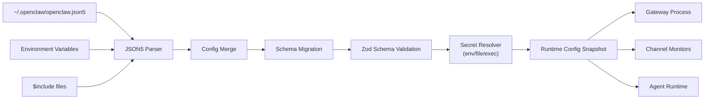

**Key Code Paths:**

- Config loading: [src/config/config.ts]()
- Schema validation: [src/config/zod-schema.providers-core.ts]()
- Secret resolution: [src/config/types.secrets.ts]()
- Hot reload: [src/gateway/reload.ts]()

**Sources:** [src/config/config.ts:1-100](), [src/config/zod-schema.providers-core.ts:1-100]()

---

## Channel-Specific Configuration Deep Dive

### Telegram Configuration Code Mapping

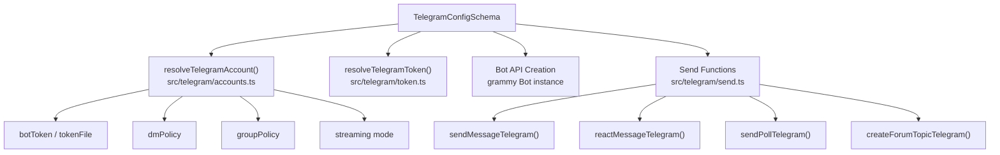

**Sources:** [src/telegram/send.ts:1-100](), [src/telegram/accounts.ts:1-50]()

### Discord Configuration Code Mapping

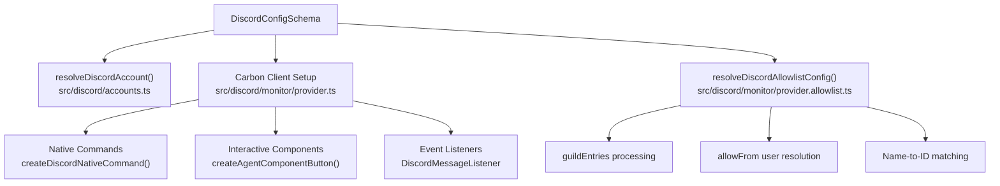

**Sources:** [src/discord/monitor/provider.ts:1-300](), [src/discord/accounts.ts:1-50]()

### Slack Configuration Code Mapping

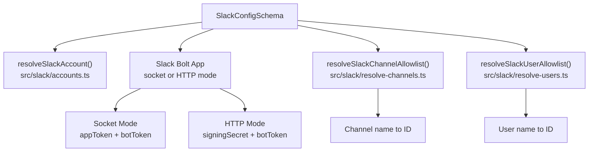

**Sources:** [src/slack/monitor/provider.ts:1-200](), [src/slack/accounts.ts:1-50]()

---

## Tool Configuration Code Mapping

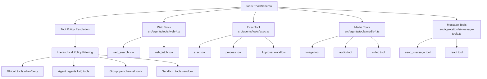

**Sources:** [src/agents/tools/web-search.ts:1-50](), [src/agents/tools/exec.ts:1-100]()

---

## Multi-Account Configuration Pattern

All channels support multi-account configuration following this pattern:

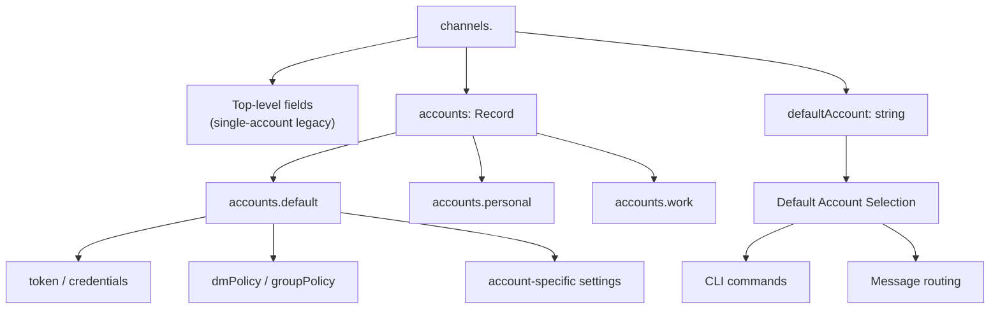

**Account Resolution Order:**

1. Explicit `accountId` parameter in CLI/API
2. Configured `channels.<provider>.defaultAccount`
3. Account named `"default"` in `channels.<provider>.accounts`
4. First account (alphabetically sorted) in `channels.<provider>.accounts`
5. Top-level single-account config (legacy path)

**Sources:** [src/telegram/accounts.ts:1-100](), [src/discord/accounts.ts:1-100](), [src/slack/accounts.ts:1-100]()

---

## Field-Level Help and Labels

The codebase maintains comprehensive metadata for all config fields:

- **Help Text**: [src/config/schema.help.ts:1-1000]() - Detailed descriptions for each field
- **Field Labels**: [src/config/schema.labels.ts:1-1000]() - Human-readable labels for UI/CLI display
- **Zod Schemas**: [src/config/zod-schema.\*.ts]() - Type-safe validation schemas

**Example Field Documentation Pattern:**

```typescript
// From schema.help.ts
export const FIELD_HELP: Record<string, string> = {
  'channels.telegram.streaming':
    "Live stream preview mode: 'off' disables streaming, 'partial' streams " +
    "text in real-time via draft API or message edits, 'block' uses block " +
    "streaming with coalesced chunks, 'progress' maps to 'partial' on Telegram.",

  'channels.discord.threadBindings.idleHours':
    'Discord override for inactivity auto-unfocus in hours (0 disables). ' +
    'When a thread-bound session is idle for this duration, the binding is ' +
    'automatically removed.',
}
```

**Sources:** [src/config/schema.help.ts:1-1000](), [src/config/schema.labels.ts:1-1000]()

---

This configuration reference covers all major sections and fields in the OpenClaw configuration file. For runtime behavior and validation pipeline details, see [Configuration System](#2.3). For channel-specific setup and behavior, see [Channels](#4).
