# Configuration System

<details>
<summary>Relevant source files</summary>

The following files were used as context for generating this wiki page:

- [CHANGELOG.md](CHANGELOG.md)
- [docs/cli/memory.md](docs/cli/memory.md)
- [docs/concepts/memory.md](docs/concepts/memory.md)
- [docs/gateway/configuration-reference.md](docs/gateway/configuration-reference.md)
- [docs/gateway/configuration.md](docs/gateway/configuration.md)
- [src/agents/memory-search.test.ts](src/agents/memory-search.test.ts)
- [src/agents/memory-search.ts](src/agents/memory-search.ts)
- [src/agents/pi-embedded-runner/extensions.ts](src/agents/pi-embedded-runner/extensions.ts)
- [src/agents/pi-extensions/compaction-safeguard-runtime.ts](src/agents/pi-extensions/compaction-safeguard-runtime.ts)
- [src/agents/pi-extensions/compaction-safeguard.test.ts](src/agents/pi-extensions/compaction-safeguard.test.ts)
- [src/agents/pi-extensions/compaction-safeguard.ts](src/agents/pi-extensions/compaction-safeguard.ts)
- [src/cli/memory-cli.test.ts](src/cli/memory-cli.test.ts)
- [src/cli/memory-cli.ts](src/cli/memory-cli.ts)
- [src/config/config.compaction-settings.test.ts](src/config/config.compaction-settings.test.ts)
- [src/config/schema.help.quality.test.ts](src/config/schema.help.quality.test.ts)
- [src/config/schema.help.ts](src/config/schema.help.ts)
- [src/config/schema.labels.ts](src/config/schema.labels.ts)
- [src/config/schema.ts](src/config/schema.ts)
- [src/config/types.agent-defaults.ts](src/config/types.agent-defaults.ts)
- [src/config/types.tools.ts](src/config/types.tools.ts)
- [src/config/types.ts](src/config/types.ts)
- [src/config/zod-schema.agent-defaults.ts](src/config/zod-schema.agent-defaults.ts)
- [src/config/zod-schema.agent-runtime.ts](src/config/zod-schema.agent-runtime.ts)
- [src/config/zod-schema.ts](src/config/zod-schema.ts)
- [src/memory/manager.ts](src/memory/manager.ts)

</details>

The Configuration System provides runtime configuration loading, validation, hot-reload, and management for the OpenClaw gateway and all its subsystems (channels, agents, tools, models, etc.). It reads configuration from `~/.openclaw/openclaw.json` in JSON5 format, validates it against a strict Zod schema, resolves secrets and includes, and exposes a runtime snapshot to all gateway components. The system supports multiple reload modes, programmatic updates via RPC, and automatic migration from legacy formats.

For channel-specific configuration patterns, see [Channels](#4). For agent and model configuration, see [Agents](#3). For the complete field reference, see page [2.3.1](#2.3.1).

---

## Architecture Overview

The configuration system operates as a multi-stage pipeline that transforms raw JSON5 files into a validated, resolved runtime snapshot consumed by all gateway subsystems.

### Configuration Loading Pipeline

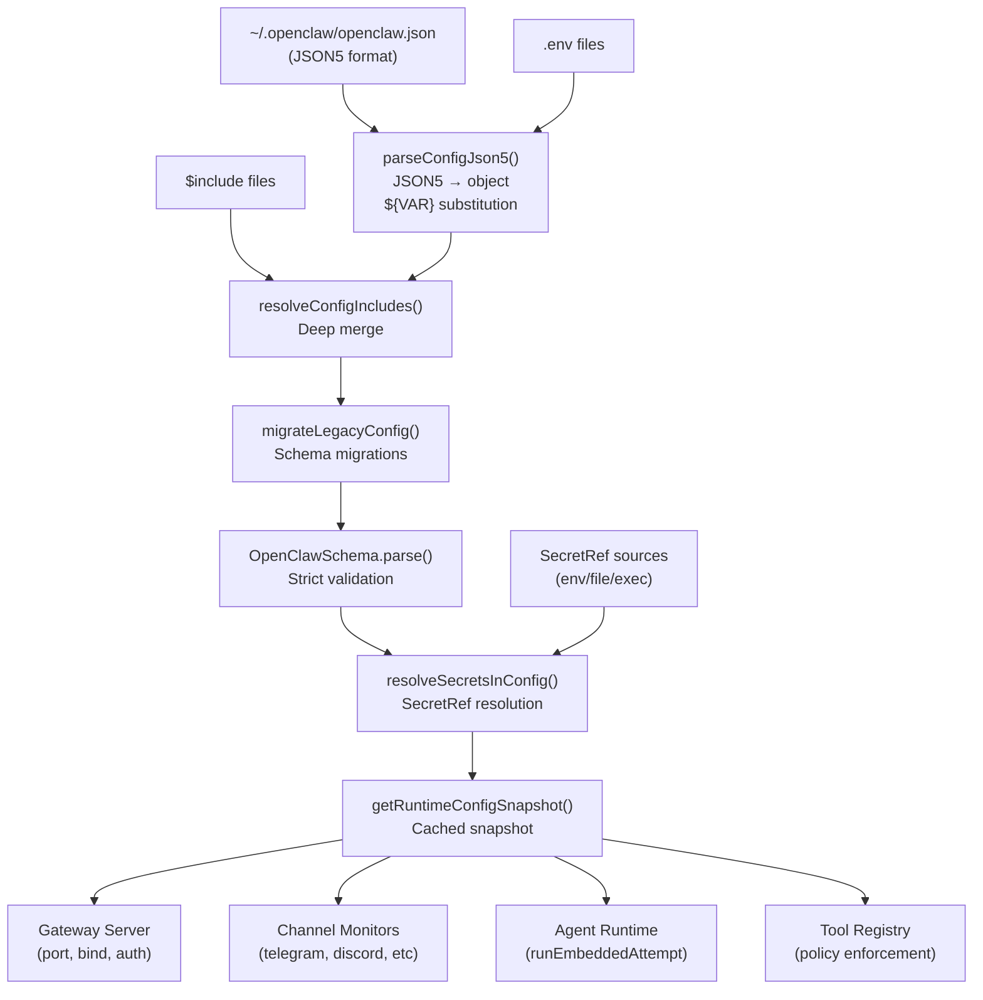

**Sources:** [src/config/zod-schema.ts:206-850](), [docs/gateway/configuration.md:1-604]()

---

## Core Configuration Modules

### Config I/O and Loading

The primary entry point is `loadConfig()`, which reads `~/.openclaw/openclaw.json`, validates it through the pipeline, and caches the result:

```mermaid
flowchart LR
    loadConfig["loadConfig()<br/>(entry point)"]
    readSnapshot["readConfigFileSnapshot()<br/>Read file + compute hash"]
    parseJson5["parseConfigJson5()<br/>JSON5.parse + ${VAR} subst"]
    validate["OpenClawSchema.parse()<br/>Strict Zod validation"]
    migrate["migrateLegacyConfig()<br/>Auto-upgrade old formats"]
    resolveIncludes["resolveConfigIncludes()<br/>$include deep merge"]
    resolveSecrets["resolveSecretsInConfig()<br/>Resolve env/file/exec refs"]

    loadConfig --> readSnapshot
    readSnapshot --> parseJson5
    parseJson5 --> migrate
    migrate --> resolveIncludes
    resolveIncludes --> validate
    validate --> resolveSecrets
    resolveSecrets --> RuntimeSnapshot["getRuntimeConfigSnapshot()<br/>In-memory cache"]
```

| Function                   | Purpose                        | Key Implementation                          |
| -------------------------- | ------------------------------ | ------------------------------------------- |
| `loadConfig()`             | Full config load + cache       | Returns cached snapshot or re-parses file   |
| `parseConfigJson5()`       | JSON5 parse + env substitution | Supports `${VAR_NAME}` syntax in strings    |
| `OpenClawSchema.parse()`   | Zod validation                 | Root schema with `.strict()` on all objects |
| `migrateLegacyConfig()`    | Schema migrations              | Auto-upgrades deprecated field paths        |
| `resolveConfigIncludes()`  | $include merge                 | Supports nested includes up to 10 levels    |
| `resolveSecretsInConfig()` | SecretRef resolution           | Resolves `{ $ref: "env:VAR" }` patterns     |

**Sources:** [src/config/zod-schema.ts:206-850](), [docs/gateway/configuration.md:12-604]()

### Validation with Zod

All configuration is validated against `OpenClawSchema`, a comprehensive Zod schema defined in [src/config/zod-schema.ts:206-850](). The schema is strict by default—unknown keys cause validation failures, and all field types are enforced at parse time.

**OpenClawSchema Structure** (from [src/config/zod-schema.ts:206-850]()):

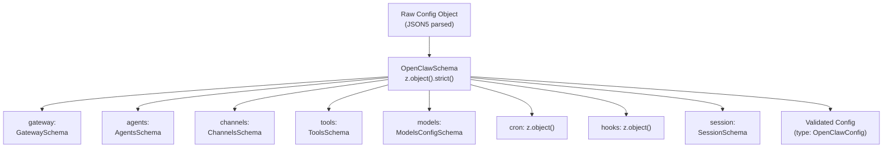

**Key Schema Characteristics:**

- **Strict mode**: `.strict()` on all object schemas rejects unknown keys (except `$schema` at root)
- **Optional by default**: Most fields have `.optional()` to support partial configs
- **Custom transforms**: Fields like `meta.lastTouchedAt` auto-coerce numeric timestamps to ISO strings [src/config/zod-schema.ts:217-225]()
- **Cross-field refinements**: `.superRefine()` validates complex rules (e.g., `dmPolicy: "allowlist"` requires non-empty `allowFrom`)
- **Sensitive field marking**: `.register(sensitive)` marks secrets for log redaction [src/config/zod-schema.ts:16]()

**Sources:** [src/config/zod-schema.ts:206-850](), [src/config/types.ts:1-36]()

### SecretRef Pattern

The SecretRef system allows config values to reference secrets stored outside the config file (environment variables, files, or executable output). Fields that support SecretRef use `SecretInputSchema` from [src/config/zod-schema.core.ts:10-12]().

**Example SecretRef usage:**

```json5
{
  gateway: {
    auth: {
      token: {
        source: 'env',
        provider: 'default',
        id: 'OPENCLAW_GATEWAY_TOKEN',
      },
    },
  },
  models: {
    providers: {
      openai: {
        apiKey: { source: 'env', provider: 'default', id: 'OPENAI_API_KEY' },
      },
    },
  },
}
```

**SecretRef Resolution Flow:**

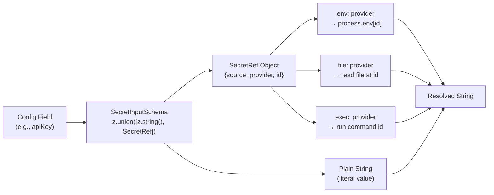

| Provider | ID Format        | Resolution                         |
| -------- | ---------------- | ---------------------------------- |
| `env`    | `VAR_NAME`       | `process.env.VAR_NAME`             |
| `file`   | `/absolute/path` | Read file content, trim whitespace |
| `exec`   | `command args`   | Run command, capture stdout, trim  |

**Sensitive field redaction:** Fields marked with `.register(sensitive)` are automatically redacted in logs [src/config/zod-schema.ts:16](), [src/config/zod-schema.sensitive.ts:1-16]().

**Sources:** [src/config/zod-schema.core.ts:10-12](), [src/config/zod-schema.sensitive.ts:1-16](), [docs/gateway/configuration.md:501-538]()

---

## Hot Reload System

The gateway watches `~/.openclaw/openclaw.json` and applies changes automatically without manual restarts, based on the configured reload mode.

### Reload Modes

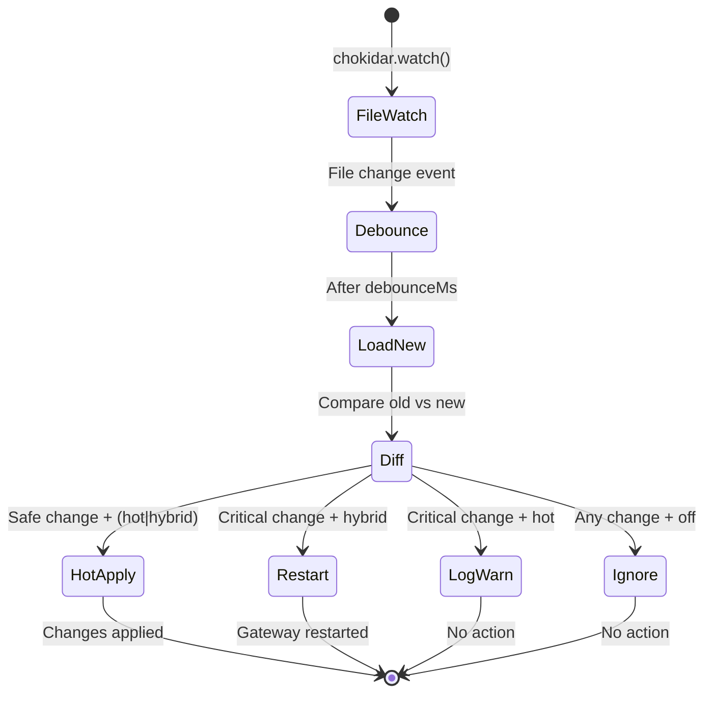

| Mode                   | Behavior                                                         | When to use            |
| ---------------------- | ---------------------------------------------------------------- | ---------------------- |
| **`hybrid`** (default) | Hot-apply safe changes instantly; auto-restart for critical ones | Production (safest)    |
| **`hot`**              | Hot-apply safe changes only; log warnings for critical ones      | Manual restart control |
| **`restart`**          | Restart on any config change                                     | Testing/development    |
| **`off`**              | Disable file watching entirely                                   | External orchestration |

**Configuration:**

```json5
{
  gateway: {
    reload: {
      mode: 'hybrid', // hot | restart | hybrid | off
      debounceMs: 300, // Coalesce rapid edits
    },
  },
}
```

### Hot vs Restart Fields

The system classifies config fields into "hot-apply" and "restart-required" categories:

| Category            | Fields                                           | Restart? |
| ------------------- | ------------------------------------------------ | -------- |
| Channels            | `channels.*`, `web.*`                            | No       |
| Agents & Models     | `agents.*`, `models.*`, `bindings.*`             | No       |
| Automation          | `hooks.*`, `cron.*`                              | No       |
| Sessions & Messages | `session.*`, `messages.*`                        | No       |
| Tools & Media       | `tools.*`, `browser.*`, `skills.*`               | No       |
| **Gateway Server**  | `gateway.port`, `gateway.bind`, `gateway.auth.*` | **Yes**  |
| **Infrastructure**  | `discovery.*`, `plugins.*`                       | **Yes**  |

**Exceptions:** `gateway.reload` and `gateway.remote` do **not** trigger restarts when changed [docs/gateway/configuration.md:380-390]()

**Implementation:**

- Field classification logic: [src/gateway/config-reload.ts:100-200]()
- Hot-reload orchestration: [src/gateway/config-reload.ts:200-400]()
- Restart coordination: [src/gateway/restart.ts:1-300]()

**Sources:** [src/gateway/config-reload.ts:1-500](), [src/gateway/restart.ts:1-300](), [docs/gateway/configuration.md:348-388]()

---

## $include Directives

Config files can be split and composed using `$include` directives, which support both single-file replacement and multi-file deep merging.

### Include Resolution

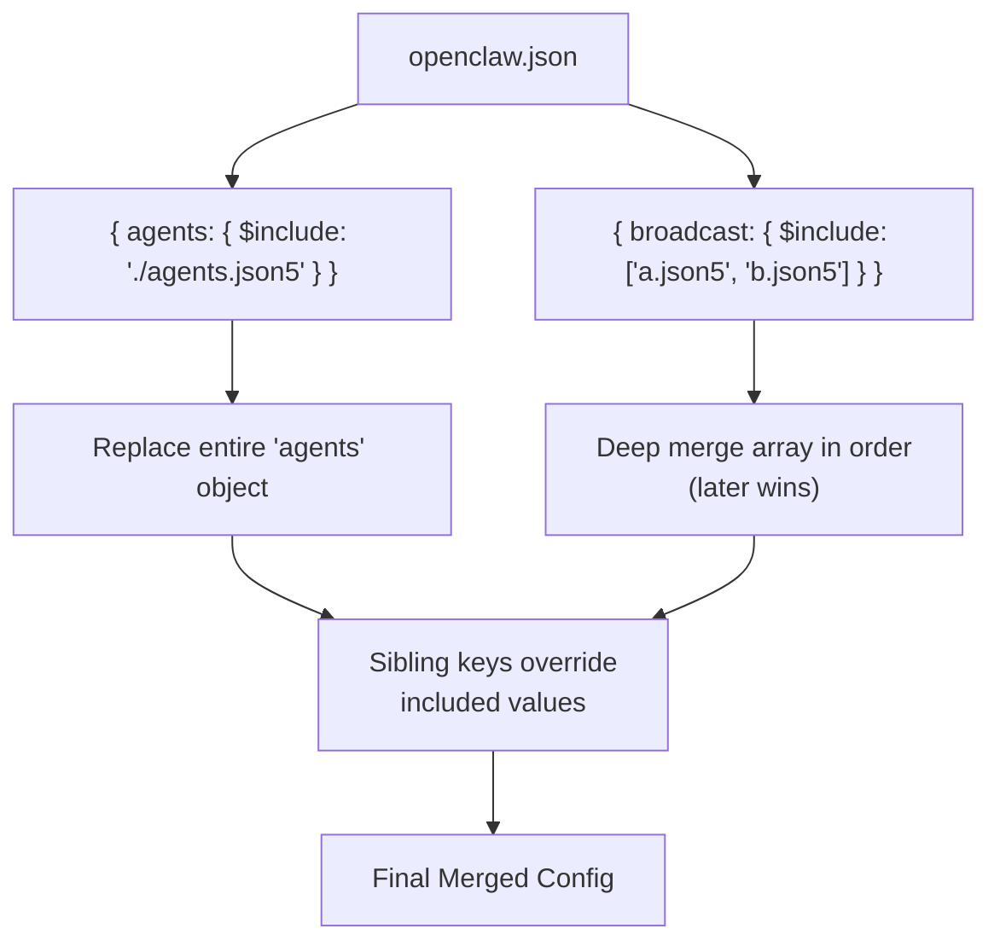

**Semantics:**

- **Single file**: `{ $include: "./file.json5" }` replaces the containing object
- **Array of files**: `{ $include: ["a.json5", "b.json5"] }` deep-merges in order (later wins)
- **Sibling keys**: Merged after includes, overriding included values
- **Nested includes**: Supported up to 10 levels deep
- **Relative paths**: Resolved relative to the including file

**Example:**

```json5
// ~/.openclaw/openclaw.json
{
  gateway: { port: 18789 },
  agents: { $include: './agents.json5' },
  broadcast: {
    $include: ['./clients/a.json5', './clients/b.json5'],
  },
}
```

**Error handling:**

- Missing files, parse errors, and circular includes produce clear diagnostics
- Validation happens **after** full include resolution

**Sources:** [src/config/includes.ts:1-200](), [docs/gateway/configuration.md:325-347]()

---

## Config RPC (Programmatic Updates)

The gateway exposes WebSocket RPC methods for programmatic config updates, supporting both full replacement (`config.apply`) and partial updates (`config.patch`).

### RPC Methods

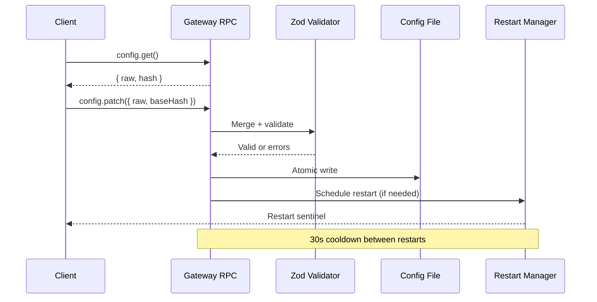

**Rate Limiting:**

- Control-plane writes (`config.apply`, `config.patch`, `update.run`) are limited to **3 requests per 60 seconds** per `deviceId+clientIp`
- When limited, RPC returns `UNAVAILABLE` with `retryAfterMs`

| Method                 | Purpose                           | Key Params                       |
| ---------------------- | --------------------------------- | -------------------------------- |
| `config.get`           | Fetch current config + hash       | —                                |
| `config.apply`         | Full config replacement           | `raw`, `baseHash`, `sessionKey?` |
| `config.patch`         | Partial update (JSON merge patch) | `raw`, `baseHash`, `sessionKey?` |
| `config.schema.lookup` | Inspect single config path        | `path`                           |

**Restart coordination:**

- Pending restart requests are coalesced while one is in-flight
- 30-second cooldown applies between restart cycles
- Optional `sessionKey` param enables post-restart wake-up ping

**Sources:** [src/gateway/rpc/config.ts:1-400](), [src/gateway/restart.ts:1-300](), [docs/gateway/configuration.md:389-448]()

---

## Environment Variables

The config system integrates environment variables through multiple layers:

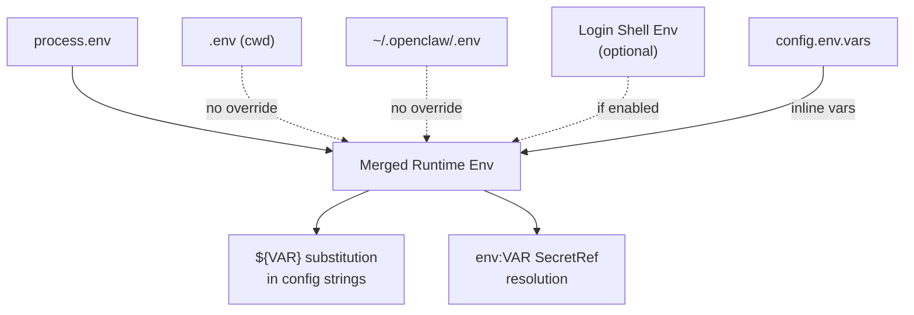

**Load order (no override):**

1. `process.env` (highest precedence)
2. `.env` from current working directory
3. `~/.openclaw/.env` (global fallback)
4. Shell environment import (if `env.shellEnv.enabled: true`)
5. `config.env.vars` (inline config vars)

**Shell environment import:**

```json5
{
  env: {
    shellEnv: {
      enabled: true, // Run login shell to import missing vars
      timeoutMs: 15000, // Shell resolution timeout
    },
    vars: {
      GROQ_API_KEY: 'gsk-...', // Inline var injection
    },
  },
}
```

**Substitution syntax:**

```json5
{
  gateway: {
    auth: { token: '${OPENCLAW_GATEWAY_TOKEN}' },
  },
}
```

**Sources:** [src/config/env.ts:1-300](), [src/config/io.ts:50-100](), [docs/gateway/configuration.md:449-488]()

---

## Legacy Migration System

The config system includes automatic migrations from legacy config formats, triggered during validation:

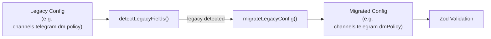

**Migration examples:**

| Legacy Field                                         | New Field                            | Notes                   |
| ---------------------------------------------------- | ------------------------------------ | ----------------------- |
| `channels.telegram.dm.policy`                        | `channels.telegram.dmPolicy`         | DM policy flattening    |
| `channels.discord.dm.allowFrom`                      | `channels.discord.allowFrom`         | DM allowlist flattening |
| `heartbeat` (root)                                   | `agents.defaults.heartbeat`          | Agent-scoped heartbeat  |
| `channels.telegram.groups."*".requireMention: false` | `requireMention: true` (new default) | Mention gating flip     |

**Behavior:**

- Migrations run **before** Zod validation
- Legacy fields are removed after successful migration
- Migration failures block startup; run `openclaw doctor --fix` to repair
- Non-migratable legacy entries produce detailed errors [src/config/legacy-migrate.ts:300-400]()

**Sources:** [src/config/legacy-migrate.ts:1-400](), [CHANGELOG.md:118]()

---

## Runtime Config Snapshot

The validated, resolved config is cached as a runtime snapshot. All gateway subsystems consume this snapshot rather than re-parsing config files. The snapshot is managed through a small set of functions that coordinate cache updates during hot reload and restarts.

**Config Snapshot Lifecycle:**

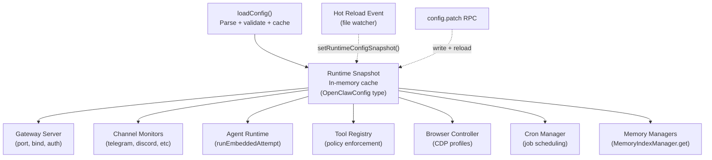

**Cache invalidation:**

- **Hot reload**: Snapshot swapped atomically after successful validation
- **Gateway restart**: Cache cleared on process start
- **Manual**: Used by test harnesses to reset config state

**Sources:** [src/config/zod-schema.ts:206-850](), [src/memory/manager.ts:135-190](), [docs/gateway/configuration.md:348-444]()

---

## Config Schema Metadata

The config system includes rich metadata for Control UI rendering, CLI help text, and validation diagnostics. The schema building system ([src/config/schema.ts:1-712]()) combines Zod schemas with UI hints to generate Control UI forms.

### Schema Building and UI Hints

**`buildConfigSchema()` Function** ([src/config/schema.ts:449-484]()):

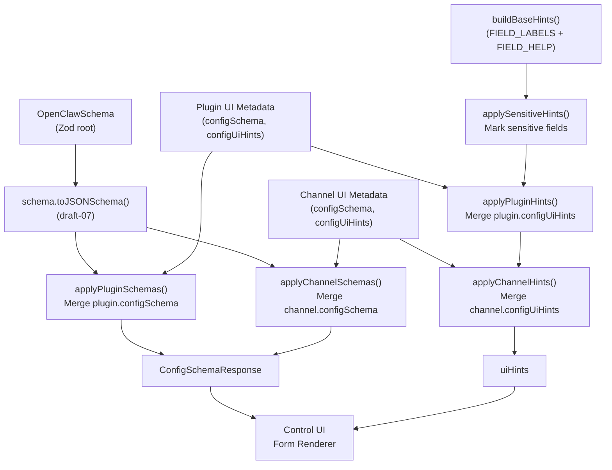

**Schema Lookup for Dynamic Fields** ([src/config/schema.ts:678-711]()):

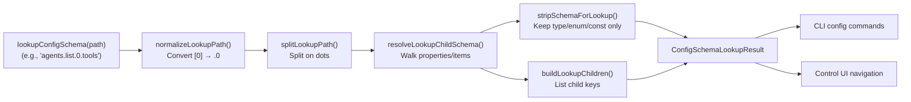

**Metadata sources:**

- **Field labels**: [src/config/schema.labels.ts:1-500]() — Human-readable field names
- **Field help**: [src/config/schema.help.ts:1-500]() — Detailed descriptions and guidance
- **UI hints**: Merged from plugins/channels via `applyPluginHints()`, `applyChannelHints()` [src/config/schema.ts:167-241]()

**Usage:**

- **Control UI**: Calls `buildConfigSchema()` to render forms with labels, help text, and validation
- **CLI**: Uses `lookupConfigSchema()` for path-specific field metadata
- **Schema introspection**: Gateway exposes `config.schema.lookup` RPC for dynamic field discovery

**Sources:** [src/config/schema.ts:1-712](), [src/config/schema.labels.ts:1-500](), [src/config/schema.help.ts:1-500]()

---

## Config Validation Error Handling

Validation failures produce structured error messages with exact field paths and actionable guidance:

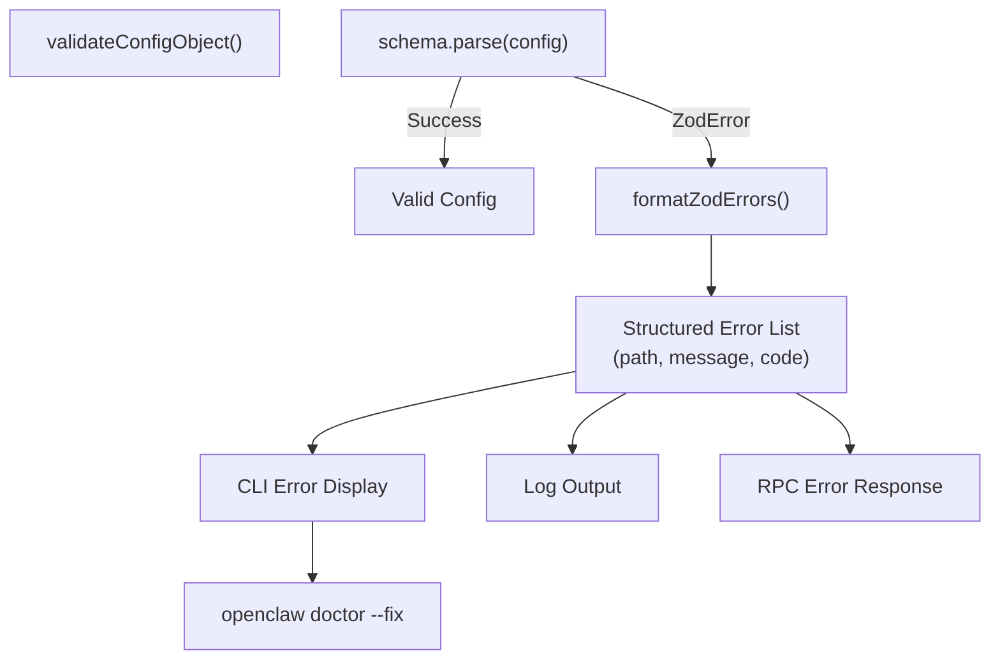

**Error structure:**

```typescript
{
  path: ["channels", "telegram", "dmPolicy"],
  message: "Invalid enum value. Expected 'pairing' | 'allowlist' | 'open' | 'disabled', received 'public'",
  code: "invalid_enum_value"
}
```

**Error handling paths:**

- **Startup**: Gateway refuses to boot; only diagnostic commands work (`doctor`, `logs`, `health`, `status`)
- **Hot reload**: Changes rejected; gateway continues with old config
- **RPC**: `config.apply`/`config.patch` return detailed validation errors
- **CLI**: `openclaw doctor` lists issues; `openclaw doctor --fix` applies repairs when possible

**Sources:** [src/config/validation.ts:150-250](), [src/cli/commands/doctor.ts:1-800](), [docs/gateway/configuration.md:61-74]()

---

## Configuration File Locations

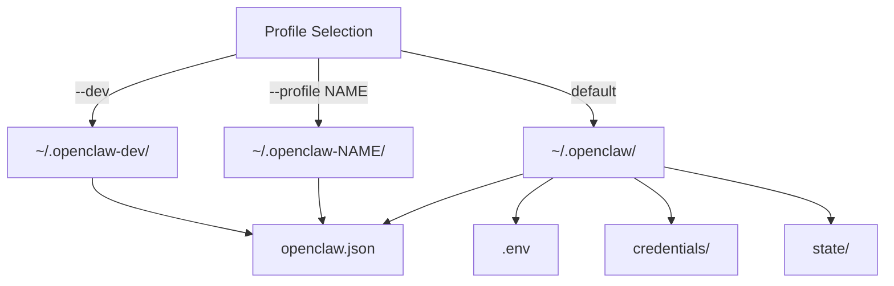

**Standard paths:**

- **Config file**: `~/.openclaw/openclaw.json` (JSON5 format)
- **Global env**: `~/.openclaw/.env`
- **Credentials**: `~/.openclaw/credentials/` (channel auth, OAuth tokens)
- **State**: `~/.openclaw/state/` (sessions, cron, pairing store)

**Profile isolation:**

- `--dev`: Shifts all paths to `~/.openclaw-dev/` and default ports (+100 offset)
- `--profile NAME`: Shifts all paths to `~/.openclaw-NAME/`
- Profiles are fully isolated; no shared state

**Sources:** [src/config/paths.ts:1-200](), [src/cli/profile.ts:1-150]()

---

## Key Takeaways

1. **Strict validation**: Config must fully match Zod schema; unknown keys fail startup
2. **Hot reload by default**: `hybrid` mode auto-restarts only when necessary
3. **SecretRef everywhere**: Keep secrets out of config files using `{ $ref: "env:VAR" }`
4. **$include composition**: Split large configs into focused files with deep merge
5. **RPC-driven updates**: Control UI and CLI update config via WebSocket RPC
6. **Migration safety**: Legacy configs auto-migrate; `openclaw doctor --fix` repairs issues
7. **Runtime snapshot**: All subsystems consume cached, validated config—no file I/O in hot path

**Sources:** [src/config/io.ts:1-500](), [src/config/validation.ts:1-300](), [src/config/zod-schema.ts:162-700](), [src/gateway/config-reload.ts:1-500](), [docs/gateway/configuration.md:1-500]()
