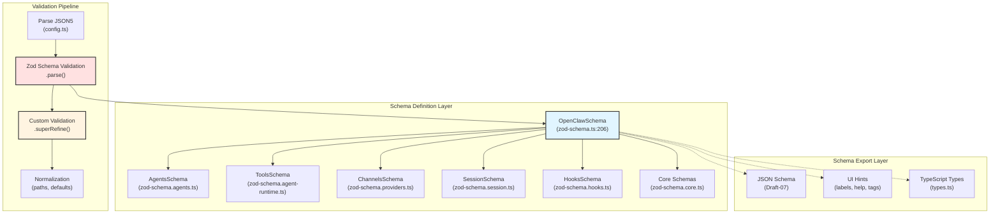
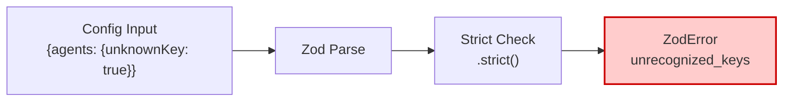
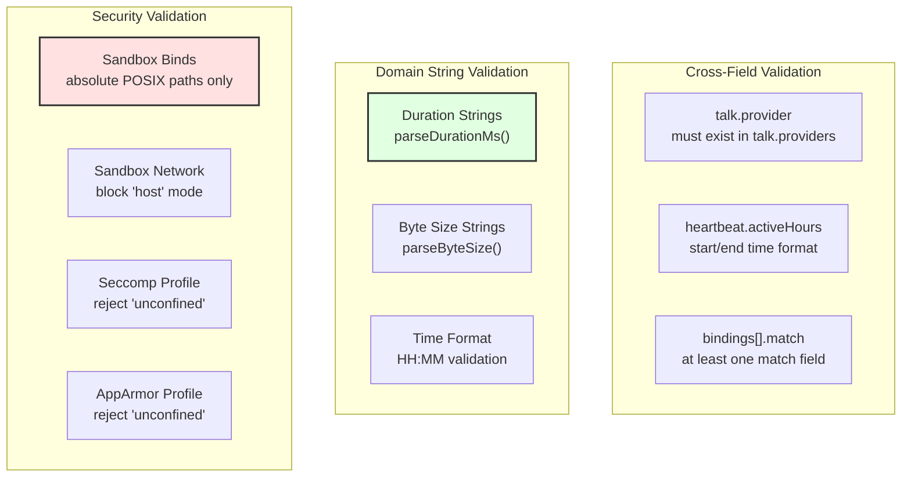
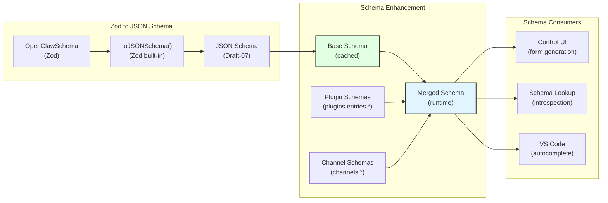
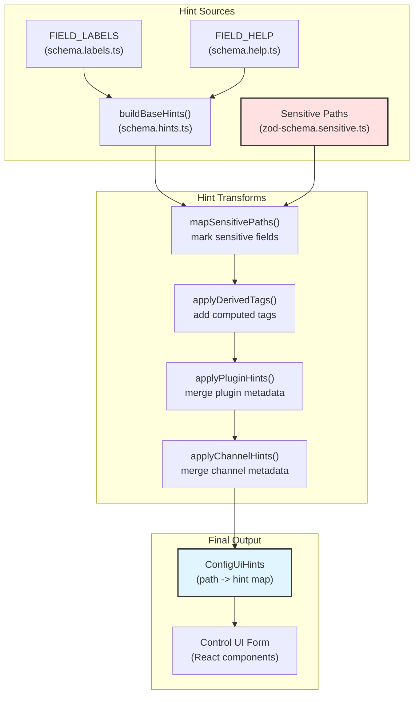
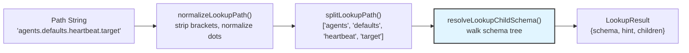
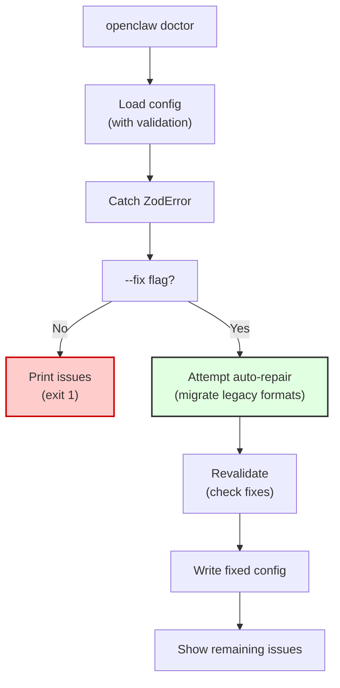
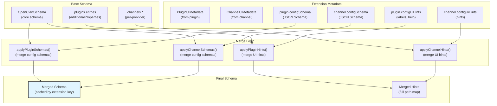

# Schema Validation

<details>
<summary>Relevant source files</summary>

The following files were used as context for generating this wiki page:

- [CHANGELOG.md](CHANGELOG.md)
- [docs/cli/memory.md](docs/cli/memory.md)
- [docs/concepts/memory.md](docs/concepts/memory.md)
- [docs/gateway/configuration-reference.md](docs/gateway/configuration-reference.md)
- [docs/gateway/configuration.md](docs/gateway/configuration.md)
- [src/agents/memory-search.test.ts](src/agents/memory-search.test.ts)
- [src/agents/memory-search.ts](src/agents/memory-search.ts)
- [src/agents/pi-embedded-runner/extensions.ts](src/agents/pi-embedded-runner/extensions.ts)
- [src/agents/pi-extensions/compaction-safeguard-runtime.ts](src/agents/pi-extensions/compaction-safeguard-runtime.ts)
- [src/agents/pi-extensions/compaction-safeguard.test.ts](src/agents/pi-extensions/compaction-safeguard.test.ts)
- [src/agents/pi-extensions/compaction-safeguard.ts](src/agents/pi-extensions/compaction-safeguard.ts)
- [src/cli/memory-cli.test.ts](src/cli/memory-cli.test.ts)
- [src/cli/memory-cli.ts](src/cli/memory-cli.ts)
- [src/config/config.compaction-settings.test.ts](src/config/config.compaction-settings.test.ts)
- [src/config/schema.help.quality.test.ts](src/config/schema.help.quality.test.ts)
- [src/config/schema.help.ts](src/config/schema.help.ts)
- [src/config/schema.labels.ts](src/config/schema.labels.ts)
- [src/config/schema.ts](src/config/schema.ts)
- [src/config/types.agent-defaults.ts](src/config/types.agent-defaults.ts)
- [src/config/types.tools.ts](src/config/types.tools.ts)
- [src/config/types.ts](src/config/types.ts)
- [src/config/zod-schema.agent-defaults.ts](src/config/zod-schema.agent-defaults.ts)
- [src/config/zod-schema.agent-runtime.ts](src/config/zod-schema.agent-runtime.ts)
- [src/config/zod-schema.ts](src/config/zod-schema.ts)
- [src/memory/manager.ts](src/memory/manager.ts)

</details>

Schema validation is the mechanism by which OpenClaw enforces type safety and business rules for all configuration files. Every field in `~/.openclaw/openclaw.json` must conform to a strict Zod schema, with unknown keys, malformed types, or invalid cross-field constraints causing the Gateway to refuse startup. This page documents the validation pipeline, custom validation rules, and the schema-to-UI-hints transformation used by the Control UI.

For broader configuration topics, see [Configuration System](#2.3). For the complete field reference, see [Configuration Reference](#2.3.1).

---

## Validation Architecture

OpenClaw uses **Zod** as its runtime validation library, with the entire configuration surface described by a single root schema (`OpenClawSchema`) composed of modular sub-schemas. Validation happens at multiple lifecycle points: startup, hot-reload, RPC config updates, and doctor repairs.

### Schema Composition Flow



**Sources:** [src/config/zod-schema.ts:1-900](), [src/config/schema.ts:429-446]()

---

## Strict Validation Rules

OpenClaw enforces **strict object schemas** by default. All Zod object schemas use `.strict()`, which rejects any keys not explicitly defined in the schema. The only root-level exception is `$schema` (string), allowed for JSON Schema metadata in editors.

### Validation Entry Points

| Context       | File                   | Function                       | Behavior on Failure                                     |
| ------------- | ---------------------- | ------------------------------ | ------------------------------------------------------- |
| Startup       | `src/config/config.ts` | `loadConfig()`                 | Gateway refuses to start; only diagnostic commands work |
| Hot Reload    | `src/config/reload.ts` | `applyConfigChange()`          | New config rejected; old config remains active          |
| RPC Update    | `src/rpc/config.ts`    | `config.apply`, `config.patch` | RPC returns validation errors; no restart               |
| Doctor Repair | `src/cli/doctor.ts`    | `openclaw doctor --fix`        | Attempts auto-repair; shows remaining issues            |

**Sources:** [docs/gateway/configuration.md:62-73]()

### Unknown Key Rejection



When an unknown key is detected, Zod raises a `ZodError` with code `unrecognized_keys`. The Gateway startup path catches this and refuses to boot, logging the exact path and key name.

**Sources:** [src/config/zod-schema.ts:206-900]()

---

## SuperRefine Custom Validation

Beyond basic type checks, OpenClaw uses `.superRefine()` hooks to enforce complex cross-field constraints, domain-specific rules, and security policies.

### SuperRefine Validation Types



**Sources:** [src/config/zod-schema.ts:206-562](), [src/config/zod-schema.agent-runtime.ts:95-204]()

### Example: Duration String Validation

```typescript
// src/config/zod-schema.ts:538-561
cron: z.object({
  sessionRetention: z.union([z.string(), z.literal(false)]).optional(),
  // ...
}).superRefine((val, ctx) => {
  if (val.sessionRetention !== undefined && val.sessionRetention !== false) {
    try {
      parseDurationMs(String(val.sessionRetention).trim(), { defaultUnit: 'h' })
    } catch {
      ctx.addIssue({
        code: z.ZodIssueCode.custom,
        path: ['sessionRetention'],
        message: 'invalid duration (use ms, s, m, h, d)',
      })
    }
  }
})
```

The `parseDurationMs()` function validates that duration strings like `"2h"`, `"30m"`, or `"1d"` are well-formed. If parsing fails, a custom validation issue is added.

**Sources:** [src/config/zod-schema.ts:538-561](), [src/cli/parse-duration.js]()

### Example: Sandbox Security Validation

```typescript
// src/config/zod-schema.agent-runtime.ts:139-164
SandboxDockerSchema.superRefine((data, ctx) => {
  if (data.binds) {
    for (let i = 0; i < data.binds.length; i += 1) {
      const bind = data.binds[i]?.trim() ?? ''
      const firstColon = bind.indexOf(':')
      const source = (firstColon <= 0 ? bind : bind.slice(0, firstColon)).trim()
      if (!source.startsWith('/')) {
        ctx.addIssue({
          code: z.ZodIssueCode.custom,
          path: ['binds', i],
          message: `Sandbox security: bind mount "${bind}" uses a non-absolute source path. Only absolute POSIX paths are supported.`,
        })
      }
    }
  }

  if (data.network?.trim().toLowerCase() === 'host') {
    ctx.addIssue({
      code: z.ZodIssueCode.custom,
      path: ['network'],
      message:
        'Sandbox security: network mode "host" is blocked. Use "bridge" or "none" instead.',
    })
  }
})
```

This validation ensures that sandbox configurations cannot bypass Docker isolation via relative bind paths or host networking.

**Sources:** [src/config/zod-schema.agent-runtime.ts:139-204]()

---

## JSON Schema Generation

For tooling integration (Control UI form generation, editor autocomplete), OpenClaw converts its Zod schema to **JSON Schema Draft-07** using Zod's built-in `toJSONSchema()` method.

### Schema Generation Pipeline



**Sources:** [src/config/schema.ts:429-484]()

### Base Schema Caching

The JSON Schema conversion is cached to avoid repeated Zod-to-JSON transformation overhead:

```typescript
// src/config/schema.ts:352-446
let cachedBase: ConfigSchemaResponse | null = null

function buildBaseConfigSchema(): ConfigSchemaResponse {
  if (cachedBase) {
    return cachedBase
  }
  const schema = OpenClawSchema.toJSONSchema({
    target: 'draft-07',
    unrepresentable: 'any',
  })
  schema.title = 'OpenClawConfig'
  const hints = applyDerivedTags(
    mapSensitivePaths(OpenClawSchema, '', buildBaseHints())
  )
  const next = {
    schema: stripChannelSchema(schema),
    uiHints: hints,
    version: VERSION,
    generatedAt: new Date().toISOString(),
  }
  cachedBase = next
  return next
}
```

The cache is **singleton** and lives for the Gateway process lifetime. Plugin and channel extensions create separate merged caches (LRU with max 64 entries).

**Sources:** [src/config/schema.ts:352-446]()

---

## UI Hints and Form Generation

Beyond the JSON Schema structure, OpenClaw generates **UI hints** (labels, help text, tags, placeholders) that the Control UI uses to render a user-friendly configuration form.

### UI Hints Architecture



**Sources:** [src/config/schema.ts:5-9](), [src/config/schema.hints.ts]()

### Sensitive Field Marking

Fields containing credentials are marked via the `.register(sensitive)` Zod extension:

```typescript
// Example from src/config/zod-schema.ts:663-664
gateway: z.object({
  auth: z.object({
    token: SecretInputSchema.optional().register(sensitive),
    password: SecretInputSchema.optional().register(sensitive),
  }),
})
```

The `sensitive` symbol is tracked during schema traversal, and matching paths are marked in the UI hints with `sensitive: true`. The Control UI then renders these fields as password inputs and redacts them in JSON exports.

**Sources:** [src/config/zod-schema.sensitive.ts:1-30](), [src/config/schema.hints.ts:1-400]()

---

## Schema Introspection and Lookup

The Control UI and CLI tools need to introspect specific config paths (e.g., `agents.defaults.heartbeat.target`) without loading the entire schema. OpenClaw provides a **schema lookup API** that resolves paths to their JSON Schema definition and UI hints.

### Lookup Resolution Flow



**Sources:** [src/config/schema.ts:678-711]()

### Wildcard and Array Index Support

The lookup system supports wildcards (`*`) and array indices for dynamic paths:

| Path Syntax                  | Meaning                      |
| ---------------------------- | ---------------------------- |
| `agents.list.*.heartbeat`    | Any agent's heartbeat config |
| `agents.list[0].workspace`   | First agent's workspace path |
| `channels.telegram.groups.*` | Any Telegram group override  |
| `bindings[*].match.peer.id`  | Any binding's peer match     |

**Sources:** [src/config/schema.ts:486-497](), [src/config/schema.ts:562-586]()

### Lookup Child Enumeration

For each resolved path, the lookup result includes **child schemas**:

```typescript
// Type from src/config/schema.ts:108-116
export type ConfigSchemaLookupChild = {
  key: string
  path: string
  type?: string | string[]
  required: boolean
  hasChildren: boolean
  hint?: ConfigUiHint
  hintPath?: string
}
```

The Control UI uses this to render expandable tree nodes and determine whether a field is a leaf (primitive) or branch (object/array).

**Sources:** [src/config/schema.ts:108-124](), [src/config/schema.ts:639-676]()

---

## Validation Error Handling

When validation fails, OpenClaw reports structured errors with exact paths and actionable messages. Errors are surfaced differently depending on the entry point.

### Error Reporting by Context

```mermaid
graph TB
    subgraph "Startup Validation Failure"
        StartupError["ZodError<br/>(config load)"]
        LogErrors["Log to stderr<br/>(formatted)"]
        RefuseStart["Gateway refuses to start<br/>(process.exit)"]

        StartupError --> LogErrors
        LogErrors --> RefuseStart
    end

    subgraph "Hot Reload Validation Failure"
        ReloadError["ZodError<br/>(config.reload)"]
        LogWarn["Log warning<br/>(retain old config)"]
        SendEvent["Send reload.failed event<br/>(WebSocket)"]

        ReloadError --> LogWarn
        LogWarn --> SendEvent
    end

    subgraph "RPC Validation Failure"
        RPCError["ZodError<br/>(config.apply/patch)"]
        FormatIssues["Format issues<br/>(top 3)"]
        ReturnError["Return error response<br/>(RPC reply)"]

        RPCError --> FormatIssues
        FormatIssues --> ReturnError
    end

    style RefuseStart fill:#ffcccc,stroke:#cc0000,stroke-width:2px
    style SendEvent fill:#fff4e1,stroke:#333,stroke-width:2px
```



**Sources:** [docs/gateway/configuration.md:62-73](), [docs/gateway/configuration.md:454-504]()

### Structured Error Output

Validation errors include:

- **Path**: Dot-separated path to the invalid field (e.g., `agents.defaults.heartbeat.every`)
- **Message**: Human-readable error description
- **Code**: Zod error code (`invalid_type`, `unrecognized_keys`, `custom`, etc.)
- **Expected/Received**: For type errors, the expected and actual types

Example error output from `openclaw doctor`:

```
✗ Config validation failed (3 issues):

  agents.defaults.heartbeat.every
    └─ invalid duration (use ms, s, m, h)

  agents.defaults.sandbox.docker.binds[2]
    └─ Sandbox security: bind mount "data:/app" uses a non-absolute source path. Only absolute POSIX paths are supported.

  channels.telegram.unknownField
    └─ Unrecognized key: unknownField
```

**Sources:** [src/cli/doctor.ts]()

---

## Doctor Command

The `openclaw doctor` command validates the active configuration and provides auto-repair for common issues.

### Doctor Workflow



**Sources:** [docs/gateway/configuration.md:62-73]()

### Auto-Repair Examples

The doctor command can automatically fix:

| Issue                            | Repair                                          |
| -------------------------------- | ----------------------------------------------- |
| Legacy Baileys auth dir          | Migrate to `whatsapp/default` structure         |
| Duplicated OpenRouter model keys | Canonicalize to single `openrouter/...` entry   |
| Outdated Anthropic model aliases | Update to current model names                   |
| Missing default account IDs      | Add explicit default account when multi-account |
| Padded cron storage kinds        | Normalize whitespace in payload kinds           |

**Sources:** [CHANGELOG.md:119-120](), [CHANGELOG.md:91-92]()

---

## Plugin and Channel Schema Extension

Plugins and channels can contribute their own schemas, which are dynamically merged into the base schema at runtime. This allows third-party extensions to define type-safe configuration without modifying core schema files.

### Extension Merge Flow



**Sources:** [src/config/schema.ts:285-350](), [src/config/schema.ts:167-241]()

### Plugin Schema Merge Example

When a plugin provides a `configSchema`, it is merged into the corresponding `plugins.entries.<pluginId>.config` slot:

```typescript
// src/config/schema.ts:285-323
function applyPluginSchemas(
  schema: ConfigSchema,
  plugins: PluginUiMetadata[]
): ConfigSchema {
  const next = cloneSchema(schema)
  const entriesNode = asSchemaObject(
    root?.properties?.plugins?.properties?.entries
  )

  for (const plugin of plugins) {
    if (!plugin.configSchema) continue

    const entryBase = asSchemaObject(entriesNode.additionalProperties)
    const entrySchema = entryBase ? cloneSchema(entryBase) : { type: 'object' }

    const baseConfigSchema = asSchemaObject(entryObject.properties?.config)
    const pluginSchema = asSchemaObject(plugin.configSchema)

    // Merge plugin schema into config slot
    const nextConfigSchema =
      baseConfigSchema &&
      pluginSchema &&
      isObjectSchema(baseConfigSchema) &&
      isObjectSchema(pluginSchema)
        ? mergeObjectSchema(baseConfigSchema, pluginSchema)
        : cloneSchema(plugin.configSchema)

    entryObject.properties = {
      ...entryObject.properties,
      config: nextConfigSchema,
    }
    entryProperties[plugin.id] = entryObject
  }

  return next
}
```

This allows plugins like `@openclaw/mattermost` to define their own `channels.mattermost` schema without requiring core changes.

**Sources:** [src/config/schema.ts:285-323](), [src/config/schema.ts:326-350]()

---

## Summary

OpenClaw's schema validation system provides:

1. **Strict type safety** via Zod with `.strict()` object schemas
2. **Custom business rules** via `.superRefine()` hooks
3. **JSON Schema export** for tooling and UI generation
4. **UI hints** for Control UI form rendering
5. **Path introspection** for dynamic schema queries
6. **Structured error reporting** with exact paths and actionable messages
7. **Auto-repair** via `openclaw doctor --fix`
8. **Extension merging** for plugin and channel schemas

All validation happens synchronously during config load, hot-reload, and RPC updates, ensuring that the Gateway always operates on valid configuration.

**Sources:** [src/config/zod-schema.ts:1-900](), [src/config/schema.ts:1-712](), [docs/gateway/configuration.md:62-73]()
