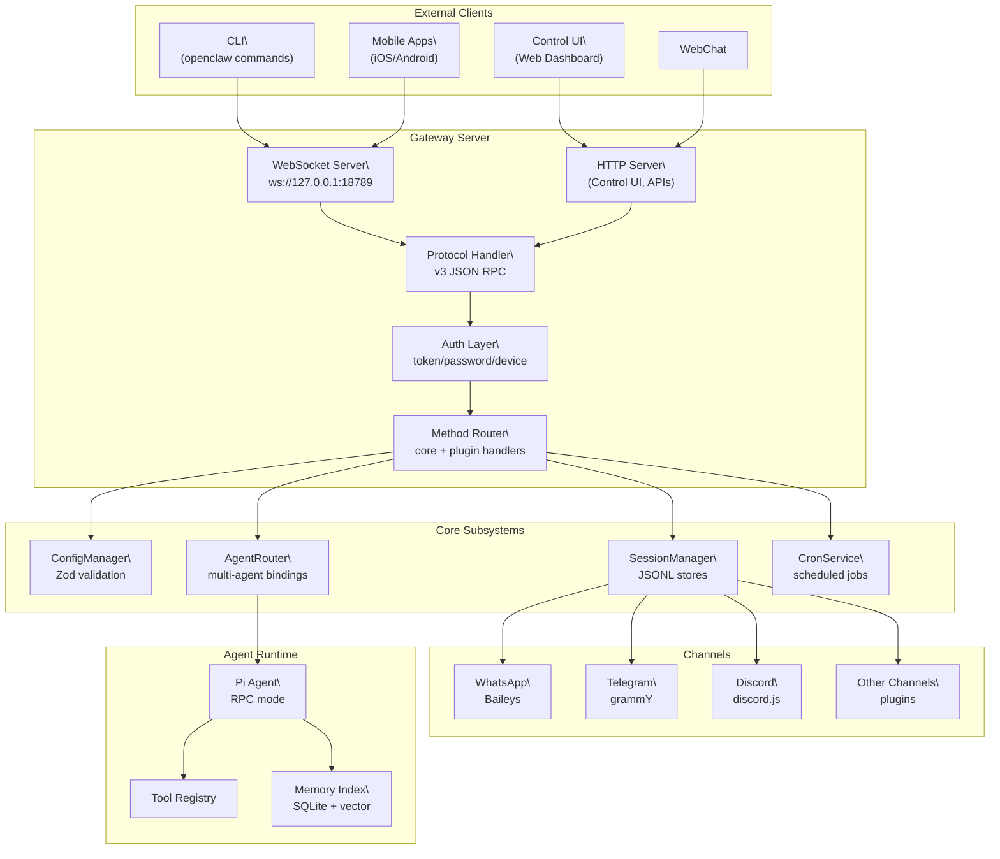
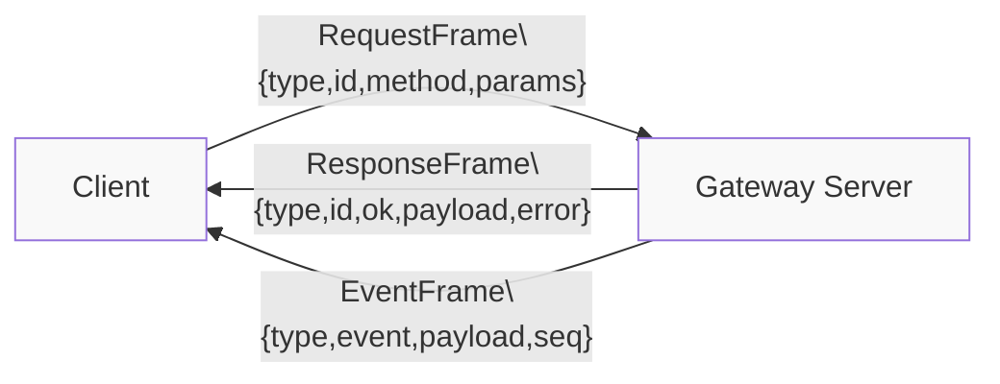
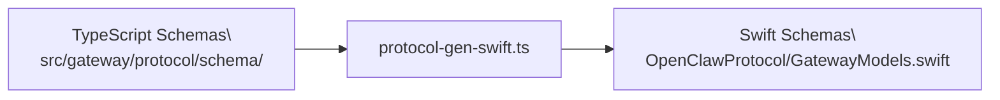
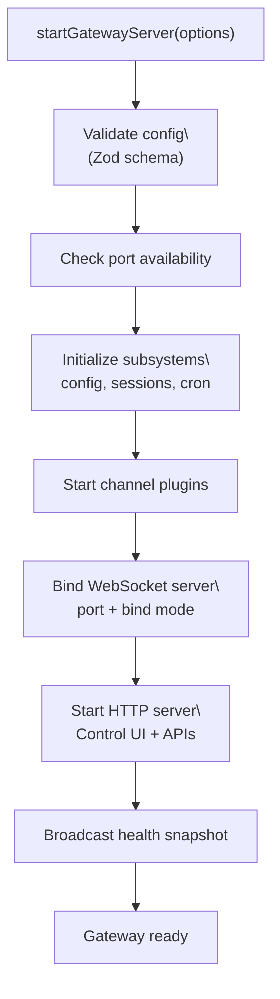
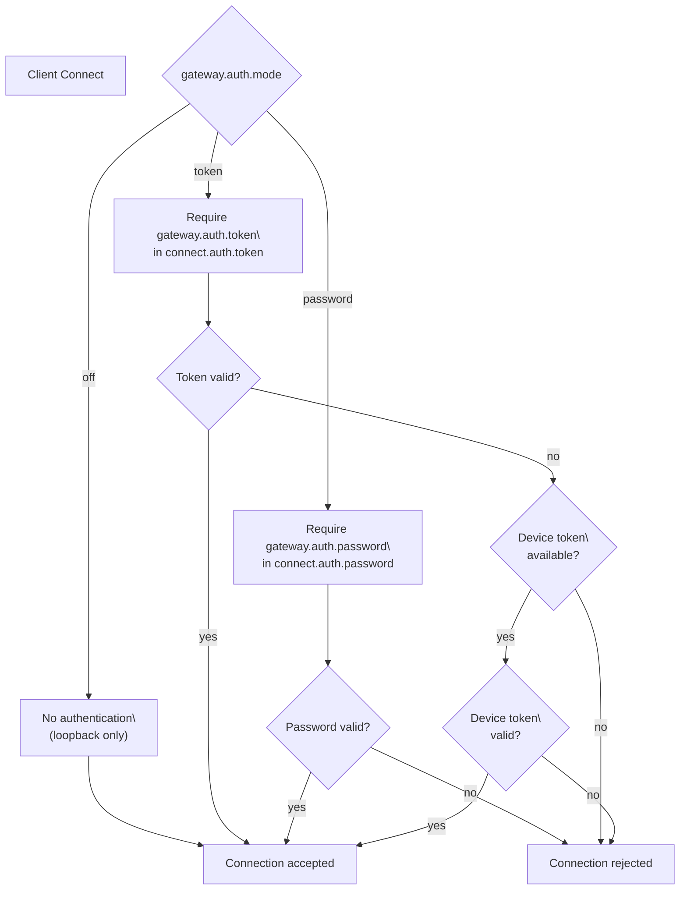
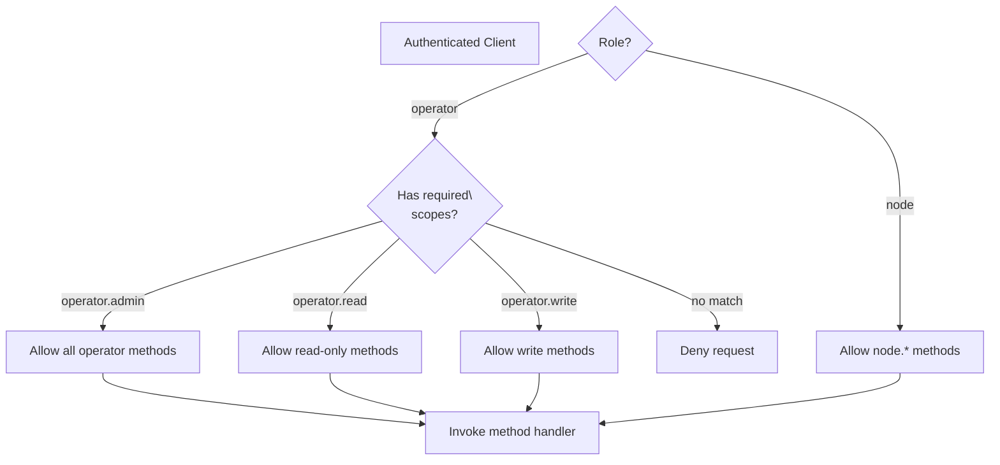
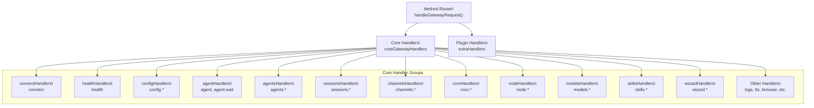
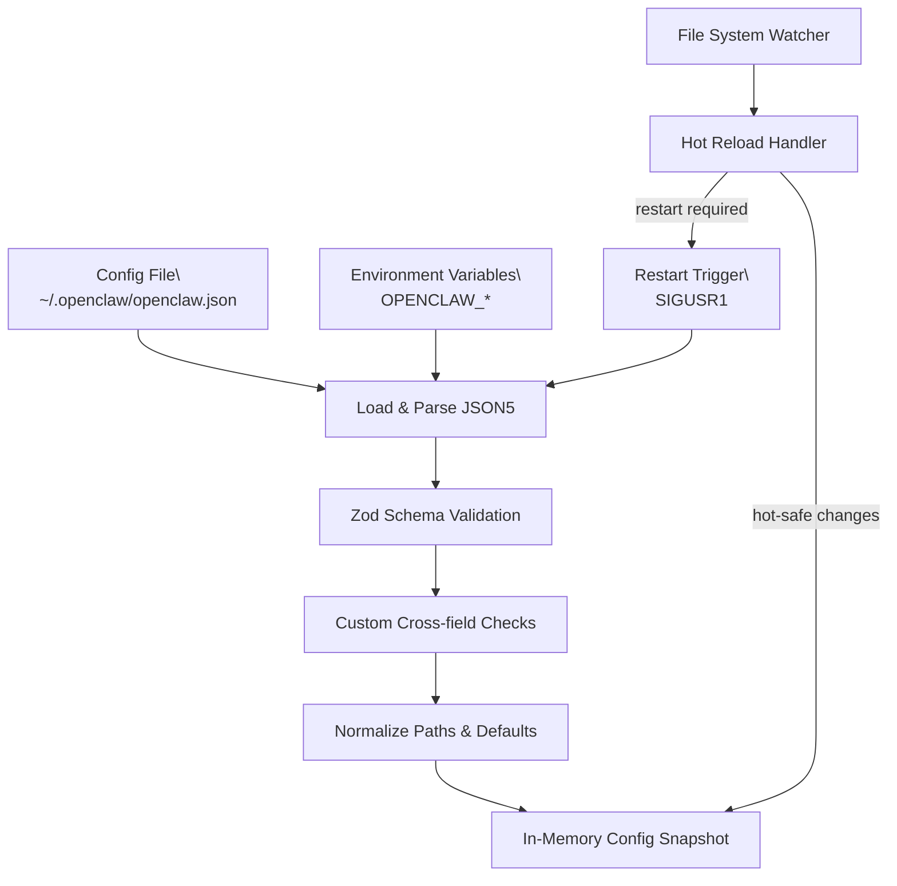
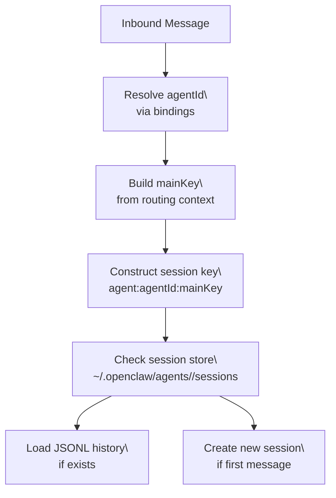
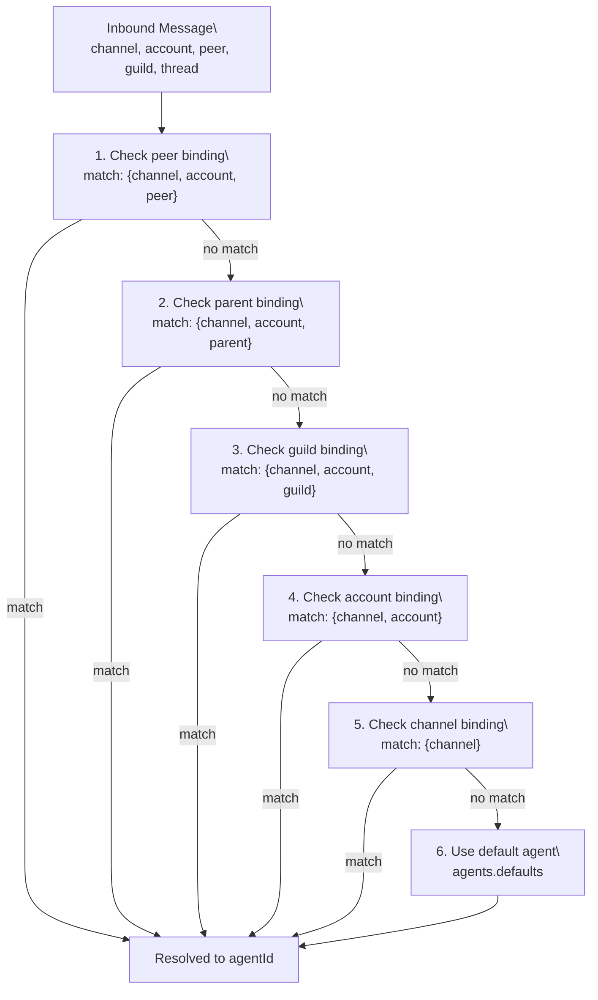

# Gateway

<details>
<summary>Relevant source files</summary>

The following files were used as context for generating this wiki page:

- [README.md](README.md)
- [apps/macos/Sources/OpenClawProtocol/GatewayModels.swift](apps/macos/Sources/OpenClawProtocol/GatewayModels.swift)
- [apps/shared/OpenClawKit/Sources/OpenClawProtocol/GatewayModels.swift](apps/shared/OpenClawKit/Sources/OpenClawProtocol/GatewayModels.swift)
- [assets/avatar-placeholder.svg](assets/avatar-placeholder.svg)
- [docs/channels/index.md](docs/channels/index.md)
- [docs/cli/index.md](docs/cli/index.md)
- [docs/cli/onboard.md](docs/cli/onboard.md)
- [docs/concepts/multi-agent.md](docs/concepts/multi-agent.md)
- [docs/docs.json](docs/docs.json)
- [docs/gateway/index.md](docs/gateway/index.md)
- [docs/gateway/troubleshooting.md](docs/gateway/troubleshooting.md)
- [docs/index.md](docs/index.md)
- [docs/reference/wizard.md](docs/reference/wizard.md)
- [docs/start/getting-started.md](docs/start/getting-started.md)
- [docs/start/hubs.md](docs/start/hubs.md)
- [docs/start/onboarding.md](docs/start/onboarding.md)
- [docs/start/setup.md](docs/start/setup.md)
- [docs/start/wizard-cli-automation.md](docs/start/wizard-cli-automation.md)
- [docs/start/wizard-cli-reference.md](docs/start/wizard-cli-reference.md)
- [docs/start/wizard.md](docs/start/wizard.md)
- [docs/tools/skills-config.md](docs/tools/skills-config.md)
- [docs/tools/skills.md](docs/tools/skills.md)
- [docs/web/webchat.md](docs/web/webchat.md)
- [docs/zh-CN/channels/index.md](docs/zh-CN/channels/index.md)
- [extensions/bluebubbles/src/send-helpers.ts](extensions/bluebubbles/src/send-helpers.ts)
- [scripts/clawtributors-map.json](scripts/clawtributors-map.json)
- [scripts/protocol-gen-swift.ts](scripts/protocol-gen-swift.ts)
- [scripts/update-clawtributors.ts](scripts/update-clawtributors.ts)
- [scripts/update-clawtributors.types.ts](scripts/update-clawtributors.types.ts)
- [src/agents/subagent-registry-cleanup.test.ts](src/agents/subagent-registry-cleanup.test.ts)
- [src/agents/tool-catalog.test.ts](src/agents/tool-catalog.test.ts)
- [src/agents/tool-catalog.ts](src/agents/tool-catalog.ts)
- [src/agents/tool-policy.plugin-only-allowlist.test.ts](src/agents/tool-policy.plugin-only-allowlist.test.ts)
- [src/agents/tool-policy.test.ts](src/agents/tool-policy.test.ts)
- [src/agents/tool-policy.ts](src/agents/tool-policy.ts)
- [src/agents/tools/gateway-tool.ts](src/agents/tools/gateway-tool.ts)
- [src/discord/monitor/thread-bindings.shared-state.test.ts](src/discord/monitor/thread-bindings.shared-state.test.ts)
- [src/gateway/method-scopes.test.ts](src/gateway/method-scopes.test.ts)
- [src/gateway/method-scopes.ts](src/gateway/method-scopes.ts)
- [src/gateway/protocol/index.ts](src/gateway/protocol/index.ts)
- [src/gateway/protocol/schema.ts](src/gateway/protocol/schema.ts)
- [src/gateway/protocol/schema/protocol-schemas.ts](src/gateway/protocol/schema/protocol-schemas.ts)
- [src/gateway/protocol/schema/types.ts](src/gateway/protocol/schema/types.ts)
- [src/gateway/server-methods-list.ts](src/gateway/server-methods-list.ts)
- [src/gateway/server-methods.ts](src/gateway/server-methods.ts)
- [src/gateway/server.ts](src/gateway/server.ts)

</details>

The Gateway is the central control plane for OpenClaw. It runs as a single long-lived WebSocket server that coordinates all communication between clients (CLI, Control UI, mobile apps, web chat), messaging channels (WhatsApp, Telegram, Discord, etc.), and the agent runtime. The Gateway handles authentication, configuration management, session routing, multi-agent isolation, and service lifecycle.

For detailed operational procedures, see [Gateway Runbook](#2.6). For authentication details, see [Authentication & Authorization](#2.2). For configuration, see [Configuration System](#2.3).

---

## Architecture Overview

The Gateway acts as the network hub for all OpenClaw subsystems:



Sources: [README.md:187-202](), [docs/index.md:59-71](), high-level diagrams

The Gateway exposes a single multiplexed port (default 18789) that serves:

- WebSocket RPC for control plane operations
- HTTP endpoints for Control UI, webhooks, and OpenAI-compatible APIs
- Static files for the web dashboard

---

## WebSocket Protocol

The Gateway implements a JSON-based RPC protocol over WebSockets (protocol version 3). All communication uses typed frames with schema validation.

### Frame Types



Sources: [src/gateway/protocol/schema/frames.ts:1-100](), [apps/shared/OpenClawKit/Sources/OpenClawProtocol/GatewayModels.swift:119-203]()

#### RequestFrame

Sent by clients to invoke methods:

| Field    | Type        | Description                                       |
| -------- | ----------- | ------------------------------------------------- |
| `type`   | `"request"` | Frame type discriminator                          |
| `id`     | `string`    | Unique request ID for matching responses          |
| `method` | `string`    | RPC method name (e.g., `"agent"`, `"config.get"`) |
| `params` | `object?`   | Method-specific parameters                        |

Sources: [apps/shared/OpenClawKit/Sources/OpenClawProtocol/GatewayModels.swift:119-143]()

#### ResponseFrame

Sent by the Gateway in reply to requests:

| Field     | Type          | Description                   |
| --------- | ------------- | ----------------------------- |
| `type`    | `"response"`  | Frame type discriminator      |
| `id`      | `string`      | Matches the request ID        |
| `ok`      | `boolean`     | Success/failure indicator     |
| `payload` | `any?`        | Method result (if `ok=true`)  |
| `error`   | `ErrorShape?` | Error details (if `ok=false`) |

Sources: [apps/shared/OpenClawKit/Sources/OpenClawProtocol/GatewayModels.swift:145-173]()

#### EventFrame

Broadcast by the Gateway for state changes:

| Field          | Type      | Description                                  |
| -------------- | --------- | -------------------------------------------- |
| `type`         | `"event"` | Frame type discriminator                     |
| `event`        | `string`  | Event name (e.g., `"agent.event"`, `"tick"`) |
| `payload`      | `any?`    | Event-specific data                          |
| `seq`          | `number?` | Sequence number for ordering                 |
| `stateVersion` | `object?` | State version tracking                       |

Sources: [apps/shared/OpenClawKit/Sources/OpenClawProtocol/GatewayModels.swift:175-203]()

### Protocol Version

The current protocol version is **3**, defined in `GATEWAY_PROTOCOL_VERSION`:

Sources: [apps/shared/OpenClawKit/Sources/OpenClawProtocol/GatewayModels.swift:5](), [src/gateway/protocol/schema/frames.ts]()

Clients must specify min/max protocol versions during connection handshake via `ConnectParams`:

```typescript
{
  minProtocol: 3,
  maxProtocol: 3,
  client: { ... },
  role: "operator" | "node",
  scopes: string[],
  auth: { token?, password?, device? }
}
```

Sources: [apps/shared/OpenClawKit/Sources/OpenClawProtocol/GatewayModels.swift:15-75]()

### Schema Generation

Protocol schemas are defined in TypeScript and auto-generated for Swift clients:



Sources: [scripts/protocol-gen-swift.ts:1-20](), [apps/shared/OpenClawKit/Sources/OpenClawProtocol/GatewayModels.swift:1-3]()

The generation script reads schema definitions and produces Swift `Codable` structs with matching field names (converted to camelCase).

---

## Server Lifecycle

### Startup Sequence



Sources: [src/gateway/server.impl.js](), [docs/gateway/index.md:28-62]()

The Gateway server is started via `startGatewayServer(options)` which accepts:

| Option       | Type      | Default      | Description                                               |
| ------------ | --------- | ------------ | --------------------------------------------------------- |
| `port`       | `number`  | `18789`      | Listen port                                               |
| `bind`       | `string`  | `"loopback"` | Bind mode: `loopback`, `lan`, `tailnet`, `auto`, `custom` |
| `token`      | `string?` | -            | Auth token (or from config)                               |
| `password`   | `string?` | -            | Auth password (or from config)                            |
| `configPath` | `string?` | -            | Config file override                                      |
| `verbose`    | `boolean` | `false`      | Enable verbose logging                                    |

Sources: [src/gateway/server.impl.js](), [docs/cli/index.md:740-766]()

### Bind Modes

| Mode       | Description                      | Bind Address         |
| ---------- | -------------------------------- | -------------------- |
| `loopback` | Local-only access (default)      | `127.0.0.1`          |
| `lan`      | LAN access                       | `0.0.0.0`            |
| `tailnet`  | Tailscale Serve/Funnel           | Managed by Tailscale |
| `auto`     | Auto-detect based on environment | Varies               |
| `custom`   | User-specified address           | From config          |

Sources: [docs/gateway/index.md:76-93](), [README.md:213-228]()

**Security note**: Non-loopback bind modes require authentication (`gateway.auth.token` or `gateway.auth.password`). The Gateway refuses to start without auth on public interfaces.

Sources: [docs/gateway/troubleshooting.md:172-174]()

### Hot Reload

The Gateway supports configuration hot-reload with multiple modes:

| Mode      | Behavior                                                         |
| --------- | ---------------------------------------------------------------- |
| `off`     | No config reload                                                 |
| `hot`     | Apply only hot-safe changes without restart                      |
| `restart` | Restart Gateway on reload-required changes                       |
| `hybrid`  | Apply hot-safe changes immediately, restart for others (default) |

Sources: [docs/gateway/index.md:85-93]()

Hot-safe changes include most tool policies, channel settings, and session defaults. Changes requiring restart include port, bind address, and auth mode.

---

## Authentication and Authorization

### Authentication Modes

The Gateway supports three authentication modes, configured via `gateway.auth.mode`:



Sources: [docs/gateway/troubleshooting.md:108-150](), [src/gateway/server-methods/connect.ts]()

#### Token Authentication

Clients send `connect.auth.token` matching `gateway.auth.token` (or `OPENCLAW_GATEWAY_TOKEN`):

```json
{
  "type": "request",
  "method": "connect",
  "params": {
    "auth": {
      "token": "your-secret-token-here"
    }
  }
}
```

Sources: [apps/shared/OpenClawKit/Sources/OpenClawProtocol/GatewayModels.swift:15-75]()

Token mismatches return `AUTH_TOKEN_MISMATCH` error with `canRetryWithDeviceToken=true` to allow device token fallback.

#### Password Authentication

Similar to token auth but uses bcrypt-hashed password comparison:

```json
{
  "type": "request",
  "method": "connect",
  "params": {
    "auth": {
      "password": "your-password"
    }
  }
}
```

Sources: [docs/gateway/troubleshooting.md:119-130]()

#### Device Authentication

For paired devices (nodes), per-device tokens can be issued and rotated:

```bash
openclaw devices list
openclaw devices rotate --device <id> --role node
```

Sources: [docs/gateway/troubleshooting.md:127-130](), [docs/cli/index.md:498-511]()

### Authorization: Roles and Scopes

After authentication, the Gateway enforces role-based access control:



Sources: [src/gateway/server-methods.ts:38-66](), [src/gateway/role-policy.ts]()

#### Operator Scopes

The `operator` role requires explicit scopes for method authorization:

| Scope            | Permissions                                                       |
| ---------------- | ----------------------------------------------------------------- |
| `operator.admin` | All methods (bypass scope checks)                                 |
| `operator.read`  | Read-only methods (`config.get`, `sessions.list`, `health`, etc.) |
| `operator.write` | Write methods (`config.apply`, `sessions.patch`, `agent`, etc.)   |

Sources: [src/gateway/method-scopes.ts:1-50]()

The Gateway maps each method to required scopes:

```typescript
const METHOD_SCOPES = {
  'config.get': [READ_SCOPE],
  'config.apply': [WRITE_SCOPE],
  agent: [WRITE_SCOPE],
  // ...
}
```

Sources: [src/gateway/method-scopes.ts]()

#### Node Role

The `node` role is for paired devices (iOS, Android, macOS apps) and restricts access to node-specific methods:

- `node.pair.*`
- `node.invoke.*`
- `node.pending.*`
- `node.describe`

Sources: [src/gateway/role-policy.ts](), [src/gateway/server-methods.ts:52-54]()

### Control Plane Rate Limiting

Write operations to the control plane (`config.apply`, `config.patch`, `update.run`) are rate-limited to **3 requests per 60 seconds** per actor:

Sources: [src/gateway/server-methods.ts:38-134](), [src/gateway/control-plane-rate-limit.ts]()

Rate-limited requests return:

```json
{
  "ok": false,
  "error": {
    "code": "UNAVAILABLE",
    "message": "rate limit exceeded for config.apply; retry after 42s",
    "retryable": true,
    "retryAfterMs": 42000
  }
}
```

Sources: [src/gateway/server-methods.ts:109-133]()

---

## Method Handlers

The Gateway implements RPC methods through a handler registry. Handlers are organized by subsystem:



Sources: [src/gateway/server-methods.ts:68-98](), [src/gateway/server-methods.ts:100-157]()

### Handler Implementation

Each handler implements the `GatewayRequestHandler` interface:

```typescript
type GatewayRequestHandler = (opts: {
  req: RequestFrame
  params: Record<string, unknown>
  client: ClientContext
  respond: (ok: boolean, payload?: any, error?: ErrorShape) => void
  context: GatewayContext
}) => Promise<void>
```

Sources: [src/gateway/server-methods/types.ts]()

Handler modules export an object mapping method names to handlers:

```typescript
export const agentHandlers: GatewayRequestHandlers = {
  agent: async ({ params, respond, context }) => {
    // validate params
    // execute agent turn
    // respond with result or error
  },
  'agent.wait': async ({ params, respond, context }) => {
    // ...
  },
}
```

Sources: [src/gateway/server-methods/agent.js]()

### Method Registry

All available methods are listed in `listGatewayMethods()`:

Sources: [src/gateway/server-methods-list.ts:1-100]()

The registry includes:

- **Config methods**: `config.get`, `config.set`, `config.apply`, `config.patch`, `config.schema`, `config.schema.lookup`
- **Agent methods**: `agent`, `agent.identity`, `agent.wait`
- **Session methods**: `sessions.list`, `sessions.patch`, `sessions.reset`, `sessions.delete`, `sessions.compact`
- **Channel methods**: `channels.status`, `channels.logout`
- **Node methods**: `node.pair.request`, `node.pair.approve`, `node.invoke`, etc.
- **Cron methods**: `cron.status`, `cron.list`, `cron.add`, `cron.run`
- **System methods**: `health`, `wake`, `update.run`, `logs.tail`

Sources: [src/gateway/server-methods-list.ts:4-100]()

### Plugin Methods

Plugins can extend the Gateway with custom RPC methods via `extraHandlers`:

```typescript
handleGatewayRequest({
  req,
  respond,
  client,
  context,
  extraHandlers: {
    'custom.method': async ({ params, respond }) => {
      // custom logic
      respond(true, { result: 'ok' })
    },
  },
})
```

Sources: [src/gateway/server-methods.ts:100-157]()

---

## Configuration Management

The Gateway manages configuration through a validated, hot-reloadable system.

### Configuration Flow



Sources: [docs/gateway/index.md:85-93](), [src/config/config.ts](), [src/config/io.ts]()

### Configuration Precedence

For most settings, precedence is:

1. CLI flags (e.g., `--port`, `--token`)
2. Environment variables (e.g., `OPENCLAW_GATEWAY_PORT`, `OPENCLAW_GATEWAY_TOKEN`)
3. Config file (`~/.openclaw/openclaw.json` or `OPENCLAW_CONFIG_PATH`)
4. Schema defaults

Sources: [docs/gateway/index.md:76-84]()

### Config Methods

The Gateway exposes RPC methods for config manipulation:

| Method                 | Description           | Requires Restart   |
| ---------------------- | --------------------- | ------------------ |
| `config.get`           | Read current config   | No                 |
| `config.set`           | Set a specific key    | Depends on key     |
| `config.apply`         | Replace entire config | Depends on changes |
| `config.patch`         | Merge partial update  | Depends on changes |
| `config.schema`        | Get full JSON schema  | No                 |
| `config.schema.lookup` | Get schema for a path | No                 |

Sources: [src/gateway/server-methods/config.ts](), [docs/cli/index.md:388-399]()

Example `config.patch` request:

```json
{
  "type": "request",
  "method": "config.patch",
  "params": {
    "raw": "{\"agents\":{\"defaults\":{\"model\":{\"primary\":\"anthropic/claude-opus-4\"}}}}",
    "baseHash": "abc123..."
  }
}
```

Sources: [src/gateway/protocol/schema/config.ts]()

The Gateway validates the patch, applies hot-safe changes immediately, and triggers restart if needed.

---

## Session Management

The Gateway routes inbound messages to isolated session stores based on routing keys.

### Session Key Structure

Session keys follow a hierarchical format:

```
agent:<agentId>:<mainKey>
```

Where `<mainKey>` is constructed from routing context:

```
<channel>:<accountId>:<groupId>:<threadId>:<peerId>
```

Sources: [docs/concepts/session.md](), [src/gateway/session-utils.ts]()

Example session keys:

- Direct message: `agent:main:whatsapp:default::+15551234567`
- Group chat: `agent:main:discord:work:guild:123456789::user:987654321`
- Thread: `agent:main:telegram:alerts::thread:555:user:111`

### Session Resolution



Sources: [src/gateway/session-utils.ts](), [docs/concepts/session.md]()

### Session Storage

Each session is stored as a JSONL file:

```
~/.openclaw/agents/<agentId>/sessions/<sessionKey>.jsonl
```

Each line contains a turn:

```jsonl
{"role":"user","content":"Hello"}
{"role":"assistant","content":"Hi there!"}
```

Sources: [docs/concepts/session.md](), [src/gateway/session-utils.ts]()

### Session Methods

| Method             | Description                                           |
| ------------------ | ----------------------------------------------------- |
| `sessions.list`    | List all sessions with metadata                       |
| `sessions.preview` | Get recent messages from a session                    |
| `sessions.patch`   | Update session metadata (model, thinking level, etc.) |
| `sessions.reset`   | Clear session history                                 |
| `sessions.delete`  | Remove session and history                            |
| `sessions.compact` | Trigger context compaction                            |
| `sessions.resolve` | Resolve session key from routing info                 |

Sources: [src/gateway/server-methods/sessions.ts](), [src/gateway/protocol/schema/sessions.ts]()

---

## Multi-Agent Routing

The Gateway supports multiple isolated agents with independent workspaces, sessions, and auth profiles. Routing is controlled by **bindings**.

### Binding Resolution



Sources: [docs/concepts/multi-agent.md:1-50](), [src/gateway/multi-agent-router.ts]()

### Binding Configuration

Bindings are defined in `bindings` array:

```json5
{
  bindings: [
    {
      agentId: 'work',
      match: {
        channel: 'discord',
        account: 'work-bot',
        guild: { kind: 'guild', id: '123456789' },
      },
    },
    {
      agentId: 'personal',
      match: {
        channel: 'whatsapp',
        peer: { kind: 'direct', id: '+15551234567' },
      },
    },
  ],
}
```

Sources: [docs/concepts/multi-agent.md:146-200]()

### Agent Isolation

Each agent is fully isolated:

| Isolated Resource | Location                                                |
| ----------------- | ------------------------------------------------------- |
| Workspace         | `~/.openclaw/workspace-<agentId>`                       |
| Agent directory   | `~/.openclaw/agents/<agentId>/agent`                    |
| Auth profiles     | `~/.openclaw/agents/<agentId>/agent/auth-profiles.json` |
| Session store     | `~/.openclaw/agents/<agentId>/sessions`                 |
| Skills            | `<workspace>/skills` (plus shared `~/.openclaw/skills`) |

Sources: [docs/concepts/multi-agent.md:14-48]()

---

## Service Management

The Gateway runs as a supervised service via platform-specific supervisors.

### Service Installation

```bash
openclaw gateway install [--runtime node|bun] [--port 18789]
```

This installs a user-level service:

- **macOS**: LaunchAgent at `~/Library/LaunchAgents/ai.openclaw.gateway.plist`
- **Linux/WSL2**: systemd user unit at `~/.config/systemd/user/openclaw-gateway.service`

Sources: [docs/gateway/index.md:125-142](), [docs/cli/index.md:769-790]()

### Service Labels

Service labels follow naming conventions:

- Default profile: `ai.openclaw.gateway` (macOS) or `openclaw-gateway` (Linux)
- Named profile: `ai.openclaw.<profile>` or `openclaw-<profile>`

Sources: [docs/gateway/index.md:139]()

### Service Operations

| Command                      | Description                  |
| ---------------------------- | ---------------------------- |
| `openclaw gateway status`    | Check service and RPC health |
| `openclaw gateway start`     | Start the service            |
| `openclaw gateway stop`      | Stop the service             |
| `openclaw gateway restart`   | Restart the service          |
| `openclaw gateway uninstall` | Remove service unit          |

Sources: [docs/cli/index.md:769-790]()

### Status Output

`openclaw gateway status` provides comprehensive diagnostics:

```
Runtime: running (macOS launchd)
Service: ai.openclaw.gateway
PID: 12345
Config (cli): ~/.openclaw/openclaw.json
Config (service): ~/.openclaw/openclaw.json
Probe target: ws://127.0.0.1:18789
RPC probe: ok (12ms)
```

Sources: [docs/gateway/index.md:99](), [docs/gateway/troubleshooting.md:156-170]()

The command probes the WebSocket RPC by default. Use `--no-probe` to skip RPC health check.

---

## Health and Diagnostics

### Health Endpoint

The `health` method returns a snapshot of Gateway state:

```json
{
  "ok": true,
  "status": "running",
  "uptimeMs": 123456,
  "version": "2025.4.1",
  "configPath": "~/.openclaw/openclaw.json",
  "stateDir": "~/.openclaw",
  "channels": {
    "whatsapp": { "status": "connected" },
    "telegram": { "status": "connected" }
  }
}
```

Sources: [src/gateway/server-methods/health.ts](), [docs/gateway/health.md]()

### Snapshot Events

The Gateway broadcasts `snapshot` events containing:

```typescript
type Snapshot = {
  presence: PresenceEntry[]
  health: HealthSnapshot
  stateVersion: { presence: number; health: number }
  uptimeMs: number
  configPath?: string
  stateDir?: string
  sessionDefaults?: Record<string, unknown>
  authMode?: string
  updateAvailable?: { version: string; url: string }
}
```

Sources: [apps/shared/OpenClawKit/Sources/OpenClawProtocol/GatewayModels.swift:297-341](), [src/gateway/protocol/schema/snapshot.ts]()

Clients receive snapshots on connect and whenever state changes.

### Presence Tracking

The Gateway tracks all connected clients via presence entries:

| Field      | Description                  |
| ---------- | ---------------------------- |
| `host`     | Client hostname              |
| `version`  | Client version               |
| `platform` | OS platform                  |
| `deviceId` | Unique device ID (for nodes) |
| `roles`    | Client roles                 |
| `scopes`   | Authorization scopes         |
| `ts`       | Last heartbeat timestamp     |

Sources: [apps/shared/OpenClawKit/Sources/OpenClawProtocol/GatewayModels.swift:205-277]()

### Doctor Command

The `openclaw doctor` CLI command (via `doctor.memory.status` RPC) performs health checks:

```bash
openclaw doctor
```

Checks include:

- Config validation and migrations
- Service status and port conflicts
- Token/password drift detection
- Channel configuration sanity
- Legacy service detection
- Workspace memory suggestions

Sources: [docs/gateway/doctor.md](), [docs/cli/index.md:401-410](), [src/gateway/server-methods/doctor.ts]()

### Log Streaming

The `logs.tail` method streams Gateway logs to clients:

```json
{
  "method": "logs.tail",
  "params": {
    "follow": true,
    "limit": 100
  }
}
```

Logs are streamed as events with structured data:

```json
{
  "event": "logs.entry",
  "payload": {
    "timestamp": "2025-01-15T10:30:00Z",
    "level": "info",
    "message": "channel connected",
    "channel": "whatsapp"
  }
}
```

Sources: [src/gateway/server-methods/logs.ts](), [docs/cli/index.md:792-808]()

---

## Control Plane Features

### Wake Method

The `wake` method triggers immediate actions without waiting for messages:

```json
{
  "method": "wake",
  "params": {
    "reason": "config-reload",
    "broadcast": true
  }
}
```

Use cases:

- Force configuration reload
- Trigger channel reconnections
- Broadcast state updates to clients

Sources: [src/gateway/protocol/schema/agent.ts]()

### Update Method

The `update.run` method triggers in-place Gateway updates:

```json
{
  "method": "update.run",
  "params": {
    "channel": "latest",
    "restartDelayMs": 5000,
    "sessionKey": "agent:main:whatsapp:default::+15551234567"
  }
}
```

The Gateway:

1. Downloads and installs the update
2. Writes a restart sentinel with delivery info
3. Schedules a graceful restart (SIGUSR1)
4. Announces the update to the specified session

Sources: [src/agents/tools/gateway-tool.ts:1-150](), [src/gateway/server-methods/update.ts]()

### Wizard Methods

The Gateway includes an interactive onboarding wizard accessible via RPC:

| Method          | Description              |
| --------------- | ------------------------ |
| `wizard.start`  | Begin wizard flow        |
| `wizard.next`   | Progress to next step    |
| `wizard.cancel` | Abort wizard             |
| `wizard.status` | Get current wizard state |

Sources: [src/gateway/server-methods/wizard.ts](), [src/gateway/protocol/schema/wizard.ts]()

This enables remote clients (Control UI, mobile apps) to guide users through Gateway setup without CLI access.

---

## Error Handling

### Error Codes

Standard error codes returned in `ResponseFrame.error`:

| Code              | Description                         | Retryable |
| ----------------- | ----------------------------------- | --------- |
| `NOT_LINKED`      | Auth profile missing or invalid     | No        |
| `NOT_PAIRED`      | Device not paired                   | No        |
| `AGENT_TIMEOUT`   | Agent turn exceeded timeout         | Yes       |
| `INVALID_REQUEST` | Malformed request or unauthorized   | No        |
| `UNAVAILABLE`     | Service unavailable or rate-limited | Yes       |

Sources: [apps/shared/OpenClawKit/Sources/OpenClawProtocol/GatewayModels.swift:7-13](), [src/gateway/protocol/schema/error-codes.ts]()

### Error Shape

```typescript
type ErrorShape = {
  code: string
  message: string
  details?: unknown
  retryable?: boolean
  retryAfterMs?: number
}
```

Sources: [apps/shared/OpenClawKit/Sources/OpenClawProtocol/GatewayModels.swift:343-371](), [src/gateway/protocol/schema/frames.ts]()

Example error response:

```json
{
  "type": "response",
  "id": "req-123",
  "ok": false,
  "error": {
    "code": "UNAVAILABLE",
    "message": "rate limit exceeded",
    "retryable": true,
    "retryAfterMs": 30000,
    "details": {
      "limit": "3 per 60s"
    }
  }
}
```

Sources: [src/gateway/server-methods.ts:116-131]()

---

## Integration Points

### CLI Integration

The CLI connects to the Gateway via WebSocket and invokes methods directly:

```bash
openclaw gateway call config.get --params '{"path":"gateway.port"}'
```

Sources: [docs/cli/index.md:812-835]()

### Control UI Integration

The web dashboard connects on page load and maintains a persistent WebSocket:

```typescript
const ws = new WebSocket("ws://127.0.0.1:18789");
ws.send(JSON.stringify({
  type: "request",
  id: "req-1",
  method: "connect",
  params: { ... }
}));
```

Sources: [docs/web/control-ui.md](), [docs/gateway/troubleshooting.md:92-150]()

### Mobile App Integration

iOS and Android apps use the auto-generated Swift/Kotlin protocol models to communicate with the Gateway:

```swift
let params = ConnectParams(
    minProtocol: 3,
    maxProtocol: 3,
    client: ["name": "OpenClaw iOS", "version": "1.0"],
    role: "node",
    ...
)
```

Sources: [apps/shared/OpenClawKit/Sources/OpenClawProtocol/GatewayModels.swift:15-75](), [apps/macos/Sources/OpenClawProtocol/GatewayModels.swift:15-75]()

### Plugin Integration

Plugins extend the Gateway by providing:

- Custom RPC methods via `extraHandlers`
- Channel integrations
- Tool implementations
- Skills

Sources: [src/gateway/server-methods.ts:100-157](), [docs/tools/plugin.md]()

Plugins run in the Gateway process and have full access to context:

```typescript
const pluginHandlers: GatewayRequestHandlers = {
  'custom.action': async ({ params, respond, context }) => {
    // Access config, sessions, channels, etc.
    respond(true, { result: 'ok' })
  },
}
```

Sources: [src/gateway/server-methods.ts:135-157]()

---

Sources for this document: [README.md:187-202](), [docs/index.md:59-71](), [src/gateway/server.ts:1-4](), [src/gateway/server.impl.js](), [src/gateway/protocol/schema/frames.ts](), [src/gateway/protocol/schema.ts:1-19](), [src/gateway/protocol/index.ts:1-100](), [src/gateway/server-methods.ts:1-158](), [src/gateway/server-methods-list.ts:1-100](), [apps/shared/OpenClawKit/Sources/OpenClawProtocol/GatewayModels.swift:1-700](), [apps/macos/Sources/OpenClawProtocol/GatewayModels.swift:1-700](), [scripts/protocol-gen-swift.ts:1-100](), [docs/gateway/index.md:1-200](), [docs/gateway/troubleshooting.md:1-400](), [docs/cli/index.md:740-900](), [docs/concepts/multi-agent.md:1-300](), [docs/start/getting-started.md:1-136](), [docs/start/wizard.md:1-126]()
