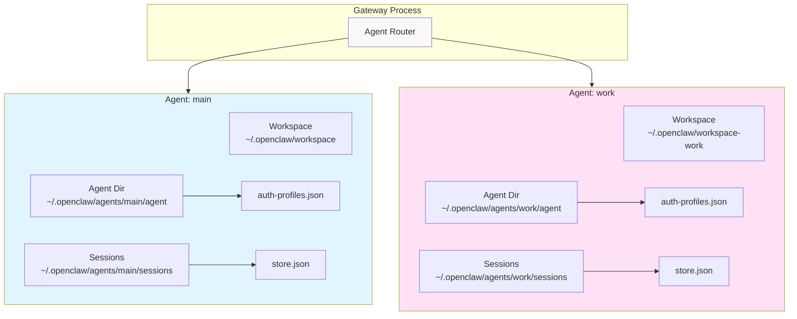
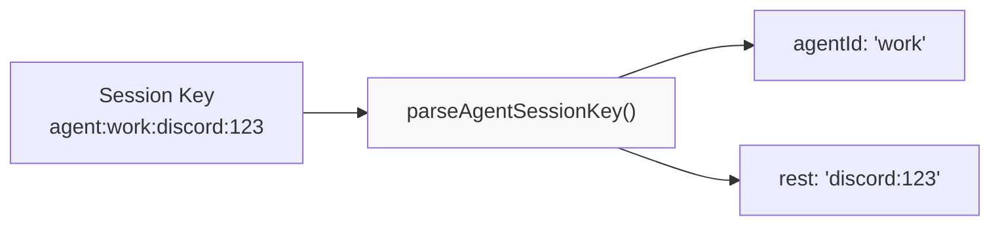
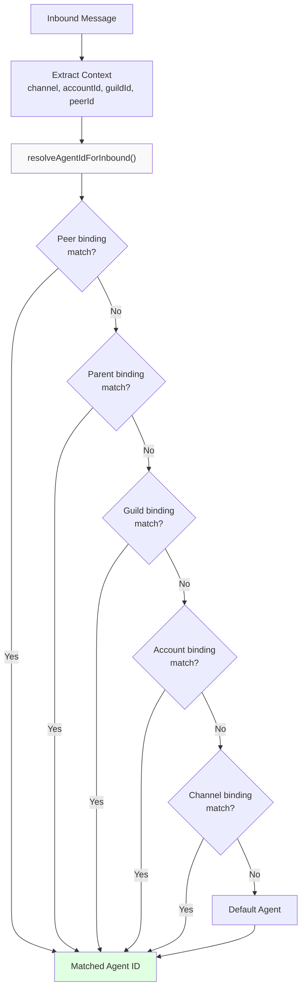
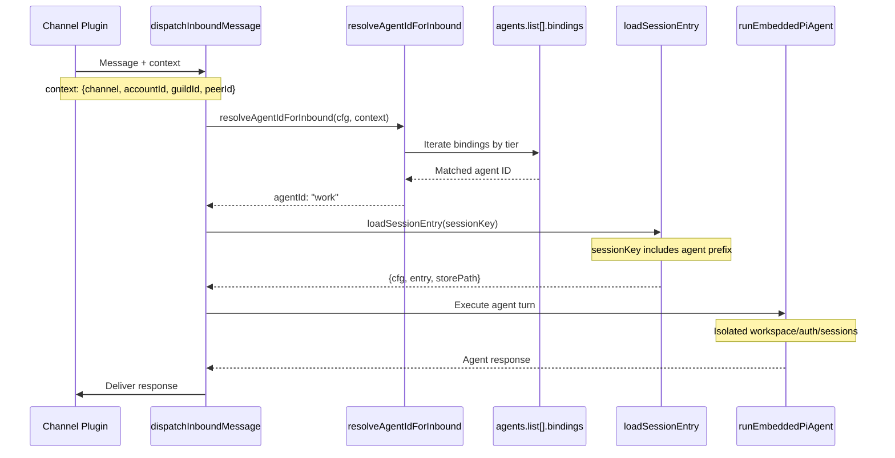
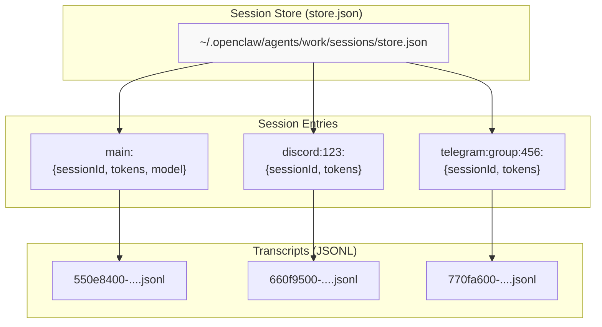
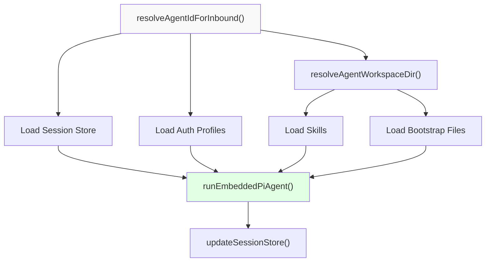

# Multi-Agent Routing

<details>
<summary>Relevant source files</summary>

The following files were used as context for generating this wiki page:

- [README.md](README.md)
- [assets/avatar-placeholder.svg](assets/avatar-placeholder.svg)
- [docs/channels/index.md](docs/channels/index.md)
- [docs/cli/index.md](docs/cli/index.md)
- [docs/cli/onboard.md](docs/cli/onboard.md)
- [docs/concepts/multi-agent.md](docs/concepts/multi-agent.md)
- [docs/docs.json](docs/docs.json)
- [docs/gateway/index.md](docs/gateway/index.md)
- [docs/gateway/troubleshooting.md](docs/gateway/troubleshooting.md)
- [docs/index.md](docs/index.md)
- [docs/reference/wizard.md](docs/reference/wizard.md)
- [docs/start/getting-started.md](docs/start/getting-started.md)
- [docs/start/hubs.md](docs/start/hubs.md)
- [docs/start/onboarding.md](docs/start/onboarding.md)
- [docs/start/setup.md](docs/start/setup.md)
- [docs/start/wizard-cli-automation.md](docs/start/wizard-cli-automation.md)
- [docs/start/wizard-cli-reference.md](docs/start/wizard-cli-reference.md)
- [docs/start/wizard.md](docs/start/wizard.md)
- [docs/tools/skills-config.md](docs/tools/skills-config.md)
- [docs/tools/skills.md](docs/tools/skills.md)
- [docs/web/webchat.md](docs/web/webchat.md)
- [docs/zh-CN/channels/index.md](docs/zh-CN/channels/index.md)
- [extensions/bluebubbles/src/send-helpers.ts](extensions/bluebubbles/src/send-helpers.ts)
- [scripts/clawtributors-map.json](scripts/clawtributors-map.json)
- [scripts/update-clawtributors.ts](scripts/update-clawtributors.ts)
- [scripts/update-clawtributors.types.ts](scripts/update-clawtributors.types.ts)
- [src/agents/byteplus.live.test.ts](src/agents/byteplus.live.test.ts)
- [src/agents/current-time.ts](src/agents/current-time.ts)
- [src/agents/live-test-helpers.ts](src/agents/live-test-helpers.ts)
- [src/agents/model-selection.test.ts](src/agents/model-selection.test.ts)
- [src/agents/model-selection.ts](src/agents/model-selection.ts)
- [src/agents/moonshot.live.test.ts](src/agents/moonshot.live.test.ts)
- [src/agents/subagent-registry-cleanup.test.ts](src/agents/subagent-registry-cleanup.test.ts)
- [src/auto-reply/heartbeat-reply-payload.ts](src/auto-reply/heartbeat-reply-payload.ts)
- [src/auto-reply/reply/post-compaction-context.test.ts](src/auto-reply/reply/post-compaction-context.test.ts)
- [src/auto-reply/reply/post-compaction-context.ts](src/auto-reply/reply/post-compaction-context.ts)
- [src/auto-reply/reply/session-reset-prompt.test.ts](src/auto-reply/reply/session-reset-prompt.test.ts)
- [src/auto-reply/reply/session-reset-prompt.ts](src/auto-reply/reply/session-reset-prompt.ts)
- [src/commands/agent.test.ts](src/commands/agent.test.ts)
- [src/commands/agent.ts](src/commands/agent.ts)
- [src/commands/agent/types.ts](src/commands/agent/types.ts)
- [src/config/sessions.ts](src/config/sessions.ts)
- [src/cron/isolated-agent.ts](src/cron/isolated-agent.ts)
- [src/gateway/protocol/schema/logs-chat.ts](src/gateway/protocol/schema/logs-chat.ts)
- [src/gateway/protocol/schema/primitives.ts](src/gateway/protocol/schema/primitives.ts)
- [src/gateway/server-methods/agent.ts](src/gateway/server-methods/agent.ts)
- [src/gateway/server-methods/chat.directive-tags.test.ts](src/gateway/server-methods/chat.directive-tags.test.ts)
- [src/gateway/server-methods/chat.ts](src/gateway/server-methods/chat.ts)
- [src/gateway/server-methods/sessions.ts](src/gateway/server-methods/sessions.ts)
- [src/gateway/server.agent.gateway-server-agent-a.test.ts](src/gateway/server.agent.gateway-server-agent-a.test.ts)
- [src/gateway/server.agent.gateway-server-agent-b.test.ts](src/gateway/server.agent.gateway-server-agent-b.test.ts)
- [src/gateway/server.chat.gateway-server-chat.test.ts](src/gateway/server.chat.gateway-server-chat.test.ts)
- [src/gateway/server.sessions.gateway-server-sessions-a.test.ts](src/gateway/server.sessions.gateway-server-sessions-a.test.ts)
- [src/gateway/session-utils.test.ts](src/gateway/session-utils.test.ts)
- [src/gateway/session-utils.ts](src/gateway/session-utils.ts)
- [src/gateway/test-helpers.ts](src/gateway/test-helpers.ts)
- [src/web/auto-reply/heartbeat-runner.test.ts](src/web/auto-reply/heartbeat-runner.test.ts)
- [src/web/auto-reply/heartbeat-runner.ts](src/web/auto-reply/heartbeat-runner.ts)

</details>

## Purpose and Scope

This document describes the Gateway's multi-agent routing system, which enables a single Gateway process to host multiple isolated agents. Each agent maintains its own workspace, authentication profiles, and session storage. The routing system uses a 6-tier priority mechanism to map inbound messages from messaging channels to the appropriate agent based on configurable bindings.

For multi-agent configuration examples and workspace isolation details, see [Multi-Agent](#3.x). For session key formats and session lifecycle, see [Session Management](#2.4).

---

## Agent Isolation Model

Each agent in the Gateway is fully isolated with its own resources:

| Resource                | Path Pattern                                         | Purpose                                                 |
| ----------------------- | ---------------------------------------------------- | ------------------------------------------------------- |
| **Workspace**           | `~/.openclaw/workspace-<agentId>`                    | Bootstrap files (`AGENTS.md`, `SOUL.md`), skills, notes |
| **Agent Directory**     | `~/.openclaw/agents/<agentId>/agent/`                | Auth profiles, model registry                           |
| **Session Store**       | `~/.openclaw/agents/<agentId>/sessions/store.json`   | Session metadata index                                  |
| **Session Transcripts** | `~/.openclaw/agents/<agentId>/sessions/<uuid>.jsonl` | JSONL conversation history                              |



**Agent Isolation Boundaries**

The default agent ID is `"main"`. Agent IDs are normalized to lowercase via `normalizeAgentId()`.

**Sources:**

- [src/agents/agent-scope.ts:1-100]()
- [src/routing/session-key.ts:20-60]()
- [src/config/sessions/paths.ts:1-80]()
- [docs/concepts/multi-agent.md:13-42]()

---

## Session Key Structure

Session keys encode routing information in the format: `[agent:id:]scope`

| Format          | Example                  | Agent ID         | Scope               |
| --------------- | ------------------------ | ---------------- | ------------------- |
| Explicit agent  | `agent:work:main`        | `work`           | `main`              |
| Default agent   | `main`                   | `main` (default) | `main`              |
| Channel scope   | `discord:guild:123`      | `main` (default) | `discord:guild:123` |
| Agent + channel | `agent:ops:telegram:456` | `ops`            | `telegram:456`      |



**Session Key Parsing Flow**

The function `parseAgentSessionKey()` extracts the agent ID prefix. When no `agent:` prefix exists, the default agent is used.

**Sources:**

- [src/routing/session-key.ts:80-150]()
- [src/config/sessions/session-key.ts:1-100]()
- [src/gateway/session-utils.ts:180-250]()

---

## Routing Priority System

The routing system matches inbound messages to agents using a 6-tier priority cascade:

| Tier | Binding Type | Context Field | Match Scope                   | Priority |
| ---- | ------------ | ------------- | ----------------------------- | -------- |
| 1    | `peer`       | `peerId`      | Specific sender               | Highest  |
| 2    | `parent`     | `parentId`    | Parent context (thread/topic) | ↓        |
| 3    | `guild`      | `guildId`     | Discord guild/Slack workspace | ↓        |
| 4    | `account`    | `accountId`   | Channel account ID            | ↓        |
| 5    | `channel`    | `channel`     | Messaging platform            | ↓        |
| 6    | `default`    | (none)        | Fallback when no match        | Lowest   |



**Routing Priority Cascade**

The function `resolveAgentIdForInbound()` implements this priority logic by iterating through configured bindings in tier order.

**Sources:**

- [src/agents/agent-scope.ts:200-450]()
- [docs/concepts/multi-agent.md:80-150]()
- [README.md:130]()

---

## Binding Configuration

Bindings are configured in `agents.list[].bindings` and specify which inbound contexts route to each agent:

```json5
{
  agents: {
    list: [
      {
        name: 'work',
        workspace: '~/.openclaw/workspace-work',
        agentDir: '~/.openclaw/agents/work/agent',
        bindings: [
          // Tier 1: Peer binding (specific user)
          {
            channel: 'discord',
            accountId: 'work-bot',
            peerId: 'user:123456789',
          },
          // Tier 3: Guild binding (Discord server)
          {
            channel: 'discord',
            accountId: 'work-bot',
            guildId: '789',
          },
          // Tier 4: Account binding (all messages to this bot)
          {
            channel: 'telegram',
            accountId: 'alerts',
          },
          // Tier 5: Channel binding (all WhatsApp messages)
          {
            channel: 'whatsapp',
          },
        ],
      },
      {
        name: 'personal',
        workspace: '~/.openclaw/workspace-personal',
        bindings: [
          {
            channel: 'telegram',
            accountId: 'personal-bot',
          },
        ],
      },
    ],
  },
}
```

Bindings are matched in declaration order within each tier. The first matching binding wins.

**Sources:**

- [docs/concepts/multi-agent.md:160-280]()
- [src/agents/agent-scope.ts:250-400]()

---

## Routing Resolution Flow



**Message Routing Sequence**

1. **Message Ingress**: Channel plugin receives message with platform-specific metadata
2. **Context Extraction**: Extract `channel`, `accountId`, `guildId`, `peerId`, `parentId`
3. **Agent Resolution**: Call `resolveAgentIdForInbound(cfg, context)` to match bindings
4. **Session Key Construction**: Build session key with agent prefix (e.g., `agent:work:discord:123`)
5. **State Loading**: Load session store via `loadSessionEntry()` from `~/.openclaw/agents/<agentId>/sessions/`
6. **Workspace Resolution**: Load workspace via `resolveAgentWorkspaceDir(cfg, agentId)`
7. **Auth Loading**: Load auth profiles from `~/.openclaw/agents/<agentId>/agent/auth-profiles.json`
8. **Execution**: Dispatch to `runEmbeddedPiAgent()` or `runCliAgent()` with isolated context
9. **State Persistence**: Update session store via `updateSessionStore(storePath, ...)`

**Sources:**

- [src/auto-reply/dispatch.ts:50-300]()
- [src/agents/agent-scope.ts:200-500]()
- [src/commands/agent.ts:678-850]()
- [src/gateway/server-methods/chat.ts:100-400]()

---

## Per-Agent Session Storage

Each agent maintains its own session store at:

```
~/.openclaw/agents/<agentId>/sessions/store.json
```

The session store is a JSON object mapping session keys to session entries:

```json5
{
  main: {
    sessionId: '550e8400-e29b-41d4-a716-446655440000',
    updatedAt: 1704067200000,
    totalTokens: 12500,
    modelOverride: 'claude-sonnet-4-6',
    authProfileOverride: 'anthropic:work-key',
    channel: 'discord',
    to: 'user:123',
    accountId: 'work-bot',
  },
  'discord:guild:789': {
    sessionId: '660f9500-f39c-51e5-b827-557766550111',
    updatedAt: 1704070800000,
    totalTokens: 8200,
  },
}
```



**Per-Agent Session Store Structure**

Session transcripts are stored as JSONL files at `~/.openclaw/agents/<agentId>/sessions/<sessionId>.jsonl`.

Functions:

- `resolveStorePath(cfg, agentId)`: Returns path to session store
- `updateSessionStore(storePath, updateFn)`: Atomic update with file locking
- `loadSessionStore(storePath)`: Read session store with validation

**Sources:**

- [src/config/sessions/store.ts:1-250]()
- [src/config/sessions/paths.ts:40-120]()
- [src/gateway/session-utils.ts:180-400]()

---

## Agent Directory Layout

```
~/.openclaw/
├── openclaw.json                        # Global configuration
├── agents/
│   ├── main/                           # Default agent
│   │   ├── agent/
│   │   │   ├── auth-profiles.json      # OAuth tokens, API keys
│   │   │   └── models.json             # Model registry
│   │   └── sessions/
│   │       ├── store.json              # Session metadata index
│   │       ├── <uuid-1>.jsonl          # Session transcript
│   │       └── <uuid-2>.jsonl
│   ├── work/                           # Work agent
│   │   ├── agent/
│   │   │   ├── auth-profiles.json
│   │   │   └── models.json
│   │   └── sessions/
│   │       └── store.json
│   └── personal/                       # Personal agent
│       ├── agent/
│       └── sessions/
├── workspace/                          # Default agent workspace
│   ├── AGENTS.md
│   ├── SOUL.md
│   └── skills/
├── workspace-work/                     # Work agent workspace
│   ├── AGENTS.md
│   ├── SOUL.md
│   └── skills/
└── workspace-personal/                 # Personal agent workspace
    ├── AGENTS.md
    └── skills/
```

The `agentDir` path is resolved via `resolveAgentDir(cfg, agentId)`, and workspace path via `resolveAgentWorkspaceDir(cfg, agentId)`.

**Sources:**

- [src/agents/agent-scope.ts:1-150]()
- [src/config/paths.ts:1-100]()
- [docs/concepts/multi-agent.md:40-80]()

---

## Gateway RPC Methods

### `agent` Method

Executes an agent turn with explicit agent targeting:

**Request Parameters:**

```typescript
{
  message: string;           // User message
  agentId?: string;          // Explicit agent override
  sessionKey?: string;       // Session key (may include agent: prefix)
  channel?: string;          // Channel for routing context
  accountId?: string;        // Account for routing context
  groupId?: string;          // Group for routing context
  peerId?: string;           // Peer for routing context
}
```

**Resolution Logic:**

1. If `agentId` provided, use it (validate against `agents.list`)
2. Else if `sessionKey` has `agent:` prefix, extract agent ID
3. Else resolve via `resolveAgentIdForInbound()` using context
4. Else use default agent

**Sources:**

- [src/gateway/server-methods/agent.ts:149-500]()
- [src/commands/agent.ts:678-900]()

### `chat.send` Method

Sends a message in an existing session with automatic agent routing:

**Request Parameters:**

```typescript
{
  sessionKey: string;        // Session key (may include agent: prefix)
  message: string;
  deliver?: boolean;         // Whether to deliver to channel
}
```

**Agent Resolution:**

1. Parse `sessionKey` for `agent:` prefix via `parseAgentSessionKey()`
2. If no prefix, use default agent
3. Load session store from `~/.openclaw/agents/<agentId>/sessions/`

**Sources:**

- [src/gateway/server-methods/chat.ts:1-600]()
- [src/routing/session-key.ts:80-150]()

### `sessions.list` Method

Lists sessions across all agents or filtered by agent:

**Request Parameters:**

```typescript
{
  agentId?: string;          // Filter by agent
  active?: number;           // Active within N minutes
}
```

Returns combined session list from all agent stores via `loadCombinedSessionStoreForGateway()`.

**Sources:**

- [src/gateway/server-methods/sessions.ts:96-110]()
- [src/gateway/session-utils.ts:550-650]()

---

## Routing Context Structure

Inbound messages carry routing context extracted by channel plugins:

```typescript
{
  channel: string;           // "discord", "telegram", "whatsapp", etc.
  accountId?: string;        // Channel account identifier
  guildId?: string;          // Discord guild / Slack workspace
  peerId?: string;           // Sender identifier (user:123)
  parentId?: string;         // Parent context (thread/forum)
  threadId?: string;         // Thread/topic identifier
  groupId?: string;          // Group chat identifier
}
```

This context is passed to `resolveAgentIdForInbound()` which matches it against bindings.

**Sources:**

- [src/agents/agent-scope.ts:400-550]()
- [src/auto-reply/dispatch.ts:50-200]()
- [src/gateway/server-methods/agent.ts:195-270]()

---

## CLI Commands

### `openclaw agents list`

Lists all configured agents with optional binding details:

```bash
openclaw agents list
openclaw agents list --bindings
openclaw agents list --json
```

**Output:**

- Agent name and ID
- Workspace path
- Agent directory path
- Configured bindings (with `--bindings`)

**Sources:**

- [docs/cli/index.md:575-605]()

### `openclaw agents add`

Creates a new isolated agent with wizard or non-interactive mode:

```bash
# Interactive wizard
openclaw agents add work

# Non-interactive
openclaw agents add work \
  --workspace ~/.openclaw/workspace-work \
  --model anthropic/claude-sonnet-4-6 \
  --bind discord:work-bot \
  --bind telegram:alerts \
  --non-interactive
```

**Sources:**

- [docs/cli/index.md:589-605]()
- [src/commands/agents-add.ts:1-300]()

### `openclaw agents bind`

Adds routing bindings to an existing agent:

```bash
openclaw agents bind --agent work --bind discord:work-bot
openclaw agents bind --agent work --bind telegram:alerts --bind whatsapp
```

**Binding Format:** `channel[:accountId]`

**Sources:**

- [docs/cli/index.md:612-621]()

### `openclaw agents unbind`

Removes routing bindings from an agent:

```bash
openclaw agents unbind --agent work --bind discord:work-bot
openclaw agents unbind --agent work --all
```

**Sources:**

- [docs/cli/index.md:622-632]()

---

## Session Key Migration

The Gateway automatically migrates legacy session keys to canonical format:

**Migration Triggers:**

1. Loading session entries via `loadSessionEntry()`
2. Updating session stores via `updateSessionStore()`
3. Gateway method handlers (`chat.send`, `agent`, etc.)

**Migration Logic:**

1. Parse session key with `parseAgentSessionKey()`
2. Normalize agent ID with `normalizeAgentId()` (lowercase)
3. Find existing entry with case-insensitive match via `findStoreMatch()`
4. Migrate to canonical key via `migrateAndPruneGatewaySessionStoreKey()`
5. Delete legacy keys (mixed-case variants)

```mermaid
graph LR
    Legacy["Legacy Key<br/>AGENT:Work:Main"]
    Parse["parseAgentSessionKey()"]
    Normalize["normalizeAgentId()"]
    Canonical["Canonical Key<br/>agent:work:main"]
    FindMatch["findStoreMatch()"]
    Migrate["migrateAndPruneGatewaySessionStoreKey()"]
    Store["Session Store<br/>(canonical keys only)"]

    Legacy --> Parse
    Parse --> Normalize
    Normalize --> Canonical
    Canonical --> FindMatch
    FindMatch --> Migrate
    Migrate --> Store

    style Canonical fill:#e1ffe1
    style Migrate fill:#f9f9f9
```



**Session Key Migration Flow**

**Sources:**

- [src/gateway/session-utils.ts:180-280]()
- [src/config/sessions/store.ts:100-250]()
- [src/routing/session-key.ts:20-80]()

---

## Default Agent Resolution

When no agent ID is specified or matched, the Gateway resolves the default agent:

**Resolution Order:**

1. Check `agents.defaults.agentId` in config
2. Fall back to `"main"` if not configured
3. Create agent directories on first use via `ensureAgentWorkspace()`

**Implementation:**

```typescript
function resolveDefaultAgentId(cfg: OpenClawConfig): string {
  return normalizeAgentId(cfg.agents?.defaults?.agentId ?? 'main')
}
```

**Sources:**

- [src/agents/agent-scope.ts:1-80]()
- [src/config/sessions.ts:1-50]()

---

## Multi-Agent Execution Context

When executing an agent turn, the Gateway establishes isolated context:

**Execution Steps:**

1. **Agent Resolution**: Determine target agent ID via routing or explicit session key
2. **Workspace Loading**: Call `resolveAgentWorkspaceDir(cfg, agentId)`
3. **Session Loading**: Load session store from `~/.openclaw/agents/<agentId>/sessions/store.json`
4. **Session Entry Resolution**: Find or create session entry for session key
5. **Auth Resolution**: Load auth profiles from `~/.openclaw/agents/<agentId>/agent/auth-profiles.json`
6. **Model Resolution**: Apply agent-specific model overrides and fallbacks
7. **Skill Loading**: Load workspace skills from `<workspace>/skills/` and shared skills from `~/.openclaw/skills/`
8. **Bootstrap Loading**: Read `AGENTS.md`, `SOUL.md`, `TOOLS.md` from workspace
9. **Execution**: Call `runEmbeddedPiAgent()` or `runCliAgent()` with isolated context
10. **State Persistence**: Save session updates via `updateSessionStore()` to agent's session store



**Multi-Agent Execution Pipeline**

**Sources:**

- [src/commands/agent.ts:678-1100]()
- [src/agents/pi-embedded.ts:1-500]()
- [src/agents/workspace.ts:1-200]()
- [src/agents/auth-profiles.ts:1-150]()
- [src/agents/skills.ts:1-300]()
