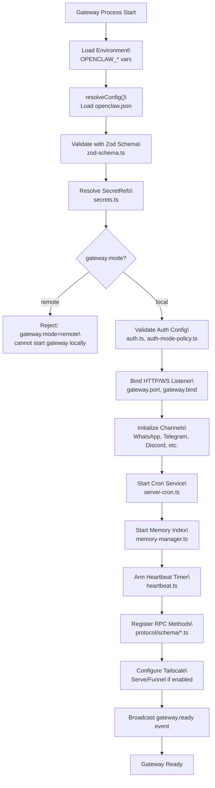
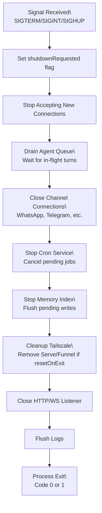
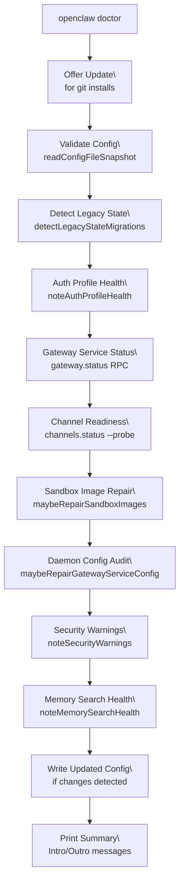
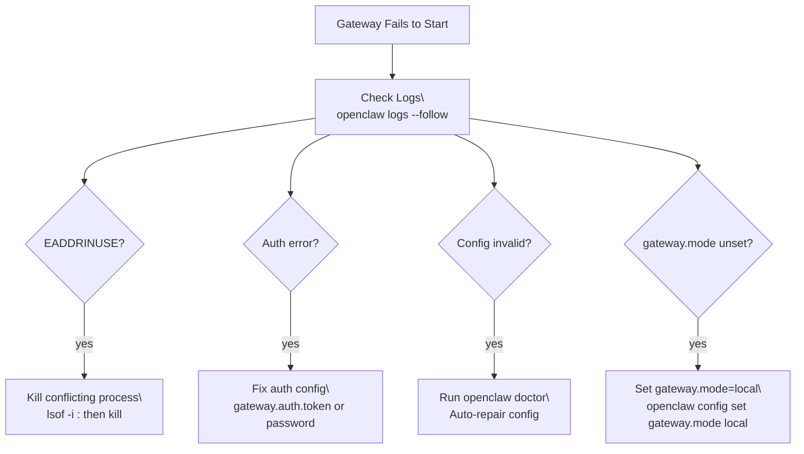
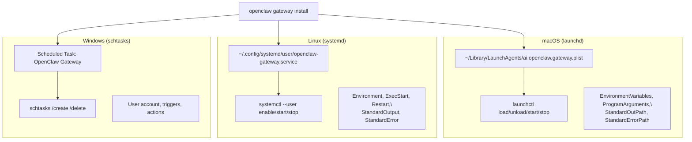
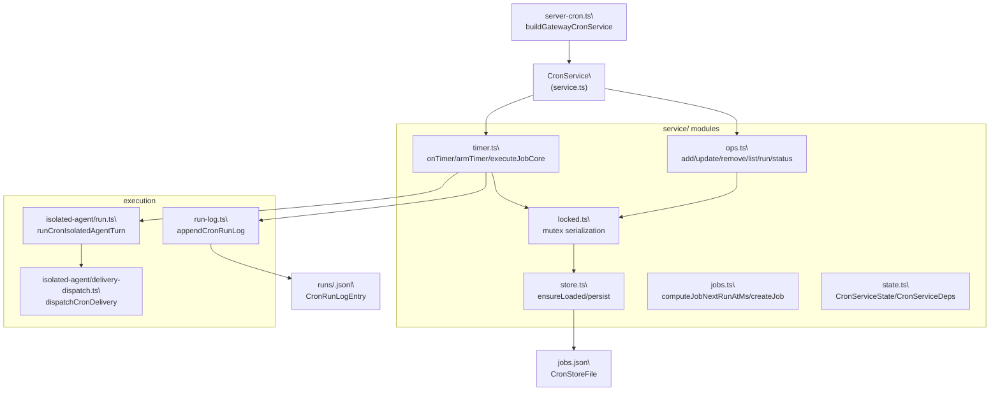
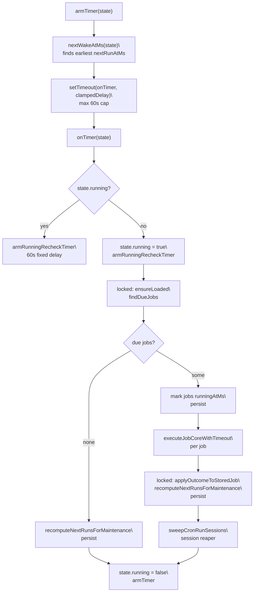
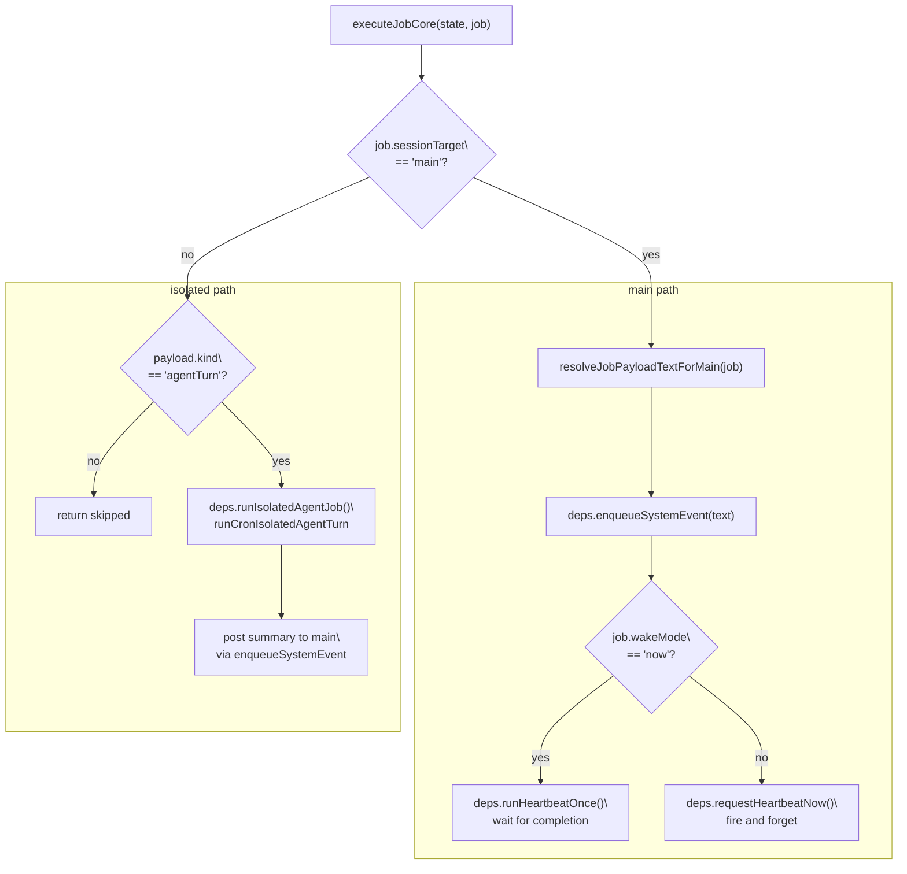
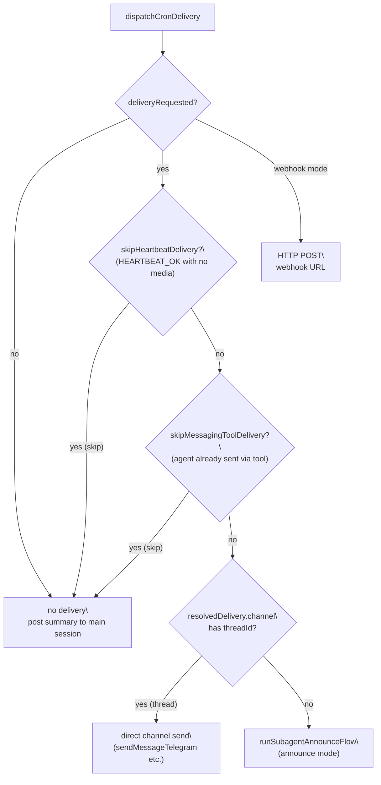
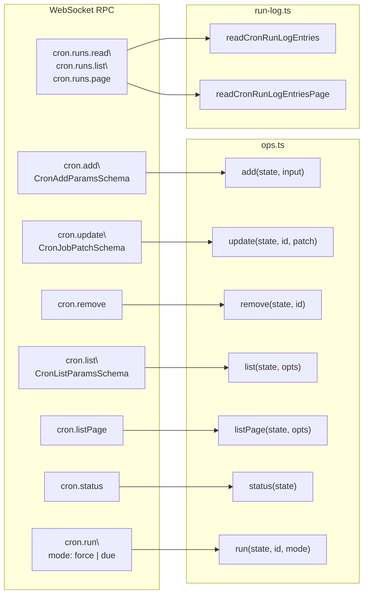

# Service Lifecycle & Diagnostics

<details>
<summary>Relevant source files</summary>

The following files were used as context for generating this wiki page:

- [README.md](README.md)
- [assets/avatar-placeholder.svg](assets/avatar-placeholder.svg)
- [docs/channels/index.md](docs/channels/index.md)
- [docs/cli/index.md](docs/cli/index.md)
- [docs/cli/onboard.md](docs/cli/onboard.md)
- [docs/concepts/multi-agent.md](docs/concepts/multi-agent.md)
- [docs/docs.json](docs/docs.json)
- [docs/gateway/background-process.md](docs/gateway/background-process.md)
- [docs/gateway/doctor.md](docs/gateway/doctor.md)
- [docs/gateway/index.md](docs/gateway/index.md)
- [docs/gateway/troubleshooting.md](docs/gateway/troubleshooting.md)
- [docs/index.md](docs/index.md)
- [docs/reference/wizard.md](docs/reference/wizard.md)
- [docs/start/getting-started.md](docs/start/getting-started.md)
- [docs/start/hubs.md](docs/start/hubs.md)
- [docs/start/onboarding.md](docs/start/onboarding.md)
- [docs/start/setup.md](docs/start/setup.md)
- [docs/start/wizard-cli-automation.md](docs/start/wizard-cli-automation.md)
- [docs/start/wizard-cli-reference.md](docs/start/wizard-cli-reference.md)
- [docs/start/wizard.md](docs/start/wizard.md)
- [docs/tools/skills-config.md](docs/tools/skills-config.md)
- [docs/tools/skills.md](docs/tools/skills.md)
- [docs/web/webchat.md](docs/web/webchat.md)
- [docs/zh-CN/channels/index.md](docs/zh-CN/channels/index.md)
- [extensions/bluebubbles/src/send-helpers.ts](extensions/bluebubbles/src/send-helpers.ts)
- [scripts/clawtributors-map.json](scripts/clawtributors-map.json)
- [scripts/update-clawtributors.ts](scripts/update-clawtributors.ts)
- [scripts/update-clawtributors.types.ts](scripts/update-clawtributors.types.ts)
- [src/agents/bash-process-registry.test.ts](src/agents/bash-process-registry.test.ts)
- [src/agents/bash-process-registry.ts](src/agents/bash-process-registry.ts)
- [src/agents/bash-tools.test.ts](src/agents/bash-tools.test.ts)
- [src/agents/bash-tools.ts](src/agents/bash-tools.ts)
- [src/agents/pi-embedded-helpers.ts](src/agents/pi-embedded-helpers.ts)
- [src/agents/pi-embedded-runner.ts](src/agents/pi-embedded-runner.ts)
- [src/agents/pi-embedded-subscribe.ts](src/agents/pi-embedded-subscribe.ts)
- [src/agents/pi-tools-agent-config.test.ts](src/agents/pi-tools-agent-config.test.ts)
- [src/agents/pi-tools.ts](src/agents/pi-tools.ts)
- [src/agents/subagent-registry-cleanup.test.ts](src/agents/subagent-registry-cleanup.test.ts)
- [src/cli/models-cli.test.ts](src/cli/models-cli.test.ts)
- [src/commands/doctor.ts](src/commands/doctor.ts)

</details>

The Gateway is the central control plane process that manages all sessions, routing, channels, and agent invocations. This page documents the Gateway's startup and shutdown sequences, health monitoring mechanisms, the `openclaw doctor` diagnostic tool, troubleshooting workflows, and daemon management across platforms (launchd on macOS, systemd on Linux, and schtasks on Windows).

For the overall Gateway architecture see page [2](), for configuration management see page [2.3](), and for authentication see page [2.2]().
</thinking>

---

## Gateway Startup Sequence

The Gateway starts in one of three modes:

- **Foreground**: Direct CLI invocation (`openclaw gateway`)
- **Daemon**: Supervised by launchd (macOS) or systemd (Linux)
- **Embedded**: Bundled in native apps (macOS.app, iOS/Android nodes)

**Title: Gateway startup initialization sequence**



Sources: [src/gateway/server.ts](), [src/config/config.ts](), [src/config/zod-schema.ts](), [src/gateway/auth-mode-policy.ts](), [src/gateway/server-cron.ts]()

### Configuration Loading

The Gateway loads configuration from multiple sources in this precedence order:

| Source                                | Precedence | Notes                                   |
| ------------------------------------- | ---------- | --------------------------------------- |
| `OPENCLAW_CONFIG_PATH` env var        | Highest    | Explicit override path                  |
| `~/.openclaw-<profile>/openclaw.json` | High       | When `OPENCLAW_PROFILE` is set          |
| `~/.openclaw/openclaw.json`           | Default    | Standard location                       |
| Schema defaults                       | Lowest     | Built-in fallbacks from `zod-schema.ts` |

The config loader in [src/config/config.ts:readConfigFileSnapshot]() performs validation on load. If validation fails, the Gateway refuses to start and logs detailed schema errors.

### Port Binding & Auth Validation

Defined in [src/gateway/server.ts]() and [src/gateway/auth-mode-policy.ts]().

The Gateway enforces these invariants at startup:

| Condition                          | Enforcement                                                               |
| ---------------------------------- | ------------------------------------------------------------------------- |
| Non-loopback bind without auth     | **Blocked**: requires `gateway.auth.mode` to be `"token"` or `"password"` |
| Both token and password configured | **Blocked** unless `gateway.auth.mode` is explicitly set                  |
| Tailscale Funnel without password  | **Blocked**: Funnel requires `gateway.auth.mode="password"`               |
| Port already in use                | **Blocked**: logs `EADDRINUSE` and exits (or kills with `--force` flag)   |

If `gateway.bind` is `"loopback"` (default), the Gateway binds to `127.0.0.1` and `::1`. For other bind modes (`"lan"`, `"tailnet"`), it binds to all interfaces (`0.0.0.0` and `::`).

Sources: [src/gateway/server.ts](), [src/gateway/auth-mode-policy.ts]()

### Channel Initialization

Channels are initialized sequentially during startup. Each channel:

1. Resolves its account configurations from `channels.<channel>.accounts`
2. Initializes persistent sessions (e.g., WhatsApp QR pairing state)
3. Registers message handlers with the Gateway router
4. Reports readiness via `channel.status` in the RPC schema

If a channel fails to start (e.g., invalid credentials), the Gateway logs a warning but does not abort startup. The channel status is marked as `"error"` and can be inspected via `openclaw channels status`.

Sources: [src/channels/](), [src/gateway/protocol/schema/channels.ts]()

---

## Gateway Shutdown Sequence

The Gateway handles shutdown signals (`SIGTERM`, `SIGINT`, `SIGHUP`) with a graceful cleanup sequence.

**Title: Gateway shutdown and cleanup flow**



Sources: [src/gateway/server.ts](), [src/gateway/tailscale.ts]()

### Signal Handling

| Signal            | Behavior                                                                  |
| ----------------- | ------------------------------------------------------------------------- |
| `SIGTERM`         | Graceful shutdown with 30-second drain timeout                            |
| `SIGINT` (Ctrl+C) | Graceful shutdown (same as SIGTERM)                                       |
| `SIGHUP`          | Reload configuration without restarting (if `gateway.reload.mode` allows) |
| `SIGUSR1`         | Force restart (used by config hot-reload when breaking changes detected)  |

The shutdown timeout is configurable via `gateway.shutdownTimeoutMs` (default: 30000 ms). If cleanup exceeds this timeout, the process force-exits with code 1.

Sources: [src/gateway/server.ts]()

### Tailscale Cleanup

When `gateway.tailscale.resetOnExit` is `true`, the shutdown sequence calls `tailscale serve off` and `tailscale funnel off` to remove port forwarding rules. This ensures the Gateway does not remain exposed on the tailnet after exit.

Sources: [src/gateway/tailscale.ts]()

---

## Health Checks & Monitoring

The Gateway exposes several mechanisms for health monitoring:

### HTTP Health Endpoint

| Route           | Method | Auth | Response              |
| --------------- | ------ | ---- | --------------------- |
| `/health`       | `GET`  | None | `{ ok: true }` or 503 |
| `/probe/health` | `GET`  | None | Same as `/health`     |

The health endpoint returns 200 if the Gateway is running and accepting connections, or 503 if shutting down. It does not require authentication.

Sources: [src/gateway/server.ts]()

### RPC Health Methods

Defined in [src/gateway/protocol/schema/gateway.ts]().

| Method           | Returns                           | Description                                                       |
| ---------------- | --------------------------------- | ----------------------------------------------------------------- |
| `gateway.health` | `{ ok, version, uptime, ... }`    | Detailed health snapshot including memory usage and config status |
| `gateway.status` | `{ status, mode, services, ... }` | Gateway mode, channel statuses, and service states                |
| `gateway.probe`  | `{ ok, reachable }`               | Simple reachability check for remote Gateways                     |

The `gateway.health` method includes:

- `uptime`: Process uptime in seconds
- `memory`: `process.memoryUsage()` snapshot
- `channels`: Per-channel connection states
- `config.valid`: Whether the loaded config passed schema validation
- `config.warnings`: Any non-fatal config issues (e.g., deprecated keys)

Sources: [src/gateway/protocol/schema/gateway.ts](), [src/gateway/server.ts]()

### Heartbeat Monitoring

The heartbeat system (documented in page [2.4]()) emits periodic `system.heartbeat` events. When `heartbeat.enabled` is `true`, the Gateway runs the heartbeat loop every `heartbeat.intervalMs` (default: 30 minutes).

Heartbeat failures (e.g., agent invocation errors) are logged but do not stop the Gateway. Clients can monitor heartbeat events via the `system.event` RPC subscription.

Sources: [src/infra/heartbeat.ts](), [src/gateway/protocol/schema/system.ts]()

---

## Doctor Command

The `openclaw doctor` command is a diagnostic and repair tool that validates config, migrates legacy state, checks service health, and offers automatic fixes for common issues.

**Title: Doctor command execution flow**



Sources: [src/commands/doctor.ts](), [docs/gateway/doctor.md]()

### What Doctor Checks

| Check             | Description                                  | Auto-Fix                  |
| ----------------- | -------------------------------------------- | ------------------------- |
| Config validation | Zod schema compliance, deprecated keys       | Normalizes and migrates   |
| Legacy state      | Old session paths, WhatsApp auth, agent dirs | Moves to new locations    |
| Auth profiles     | OAuth token expiry, API key resolution       | Refreshes expiring tokens |
| Gateway health    | Service running, RPC probe                   | Offers restart            |
| Channels          | Connection status, DM policy safety          | Warns on open policies    |
| Sandbox images    | Docker images for sandboxing                 | Pulls missing images      |
| Daemon config     | Supervisor plist/service correctness         | Repairs on `--fix`        |
| Security          | Open DM access, weak auth                    | Warns and suggests fixes  |
| Memory index      | QMD subprocess, embedded search              | Reports status            |

### Doctor Command Options

Defined in [src/commands/doctor.ts]() and [docs/cli/doctor.md]().

| Flag                         | Behavior                                                   |
| ---------------------------- | ---------------------------------------------------------- |
| `--yes`                      | Accept all defaults without prompting                      |
| `--repair` or `--fix`        | Apply recommended repairs without confirmation             |
| `--non-interactive`          | Skip prompts; apply only safe migrations                   |
| `--deep`                     | Scan for extra Gateway services (launchd/systemd/schtasks) |
| `--no-workspace-suggestions` | Skip workspace memory hints                                |

### Config Migrations

Doctor applies these automatic migrations when detected:

| Legacy Pattern                             | Migration                                                   | Files                                       |
| ------------------------------------------ | ----------------------------------------------------------- | ------------------------------------------- |
| Old session paths (`~/.openclaw/sessions`) | Move to `~/.openclaw/agents/<agentId>/sessions`             | [src/commands/doctor-state-migrations.ts]() |
| WhatsApp auth in `~/.openclaw/credentials` | Move to `~/.openclaw/agents/<agentId>/credentials`          | [src/commands/doctor-state-migrations.ts]() |
| Legacy cron store format                   | Convert `jobId`, `schedule.cron`, top-level delivery fields | [src/commands/doctor-cron.ts]()             |
| Anthropic OAuth profile with wrong ID      | Rename `anthropic:oauth` → `anthropic:<userId>`             | [src/commands/doctor-auth.ts]()             |
| Deprecated CLI auth profiles               | Remove unused CLI-specific OAuth entries                    | [src/commands/doctor-auth.ts]()             |

Sources: [src/commands/doctor.ts](), [src/commands/doctor-state-migrations.ts](), [src/commands/doctor-cron.ts](), [src/commands/doctor-auth.ts]()

### Health Check Integration

Doctor calls `gateway.health` and `gateway.status` RPCs to check Gateway health. If the Gateway is not running, Doctor offers to start it (with confirmation).

If health checks fail, Doctor prints actionable guidance:

- Port conflicts → suggests `openclaw gateway --force` or `lsof -i :<port>`
- Auth errors → validates token/password configuration
- Service not loaded → offers `openclaw gateway install`

Sources: [src/commands/doctor-gateway-health.ts](), [src/commands/doctor-gateway-daemon-flow.ts]()

---

## Troubleshooting Workflows

Documented in [docs/gateway/troubleshooting.md]().

### Command Ladder

Run these commands in sequence for first-line diagnostics:

```bash
openclaw status                    # High-level overview
openclaw gateway status            # Gateway-specific health
openclaw logs --follow             # Real-time log tail
openclaw doctor                    # Auto-repair and validation
openclaw channels status --probe   # Channel connection checks
```

**Expected Healthy Signals:**

- `openclaw gateway status` shows `Runtime: running` and `RPC probe: ok`
- `openclaw doctor` reports no blocking issues
- `openclaw channels status` shows channels as `connected` or `ready`

Sources: [docs/gateway/troubleshooting.md:14-30]()

### Common Failure Modes

**Title: Troubleshooting decision tree for Gateway startup failures**



Sources: [docs/gateway/troubleshooting.md](), [src/commands/doctor.ts]()

### Diagnostic Signatures in Logs

| Log Message                                     | Meaning                                       | Fix                                                        |
| ----------------------------------------------- | --------------------------------------------- | ---------------------------------------------------------- |
| `Gateway start blocked: set gateway.mode=local` | `gateway.mode` is unset or `"remote"`         | Set `gateway.mode: "local"` in config                      |
| `refusing to bind gateway ... without auth`     | Non-loopback bind without auth                | Configure `gateway.auth.token` or `gateway.auth.password`  |
| `another gateway instance is already listening` | Port conflict (EADDRINUSE)                    | Kill the conflicting process or use `--force`              |
| `AUTH_TOKEN_MISMATCH`                           | Client token does not match Gateway token     | Sync tokens or approve device token via `openclaw devices` |
| `device nonce required`                         | Client did not complete device auth handshake | Update client to device auth v2 protocol                   |
| `Config validation failed`                      | Schema validation errors                      | Run `openclaw doctor` or fix config manually               |

Sources: [docs/gateway/troubleshooting.md:151-175](), [src/gateway/auth-mode-policy.ts]()

### Log Inspection

The Gateway writes logs to:

- **Foreground**: stdout/stderr
- **Daemon (macOS)**: `~/Library/Logs/OpenClaw/gateway.log`
- **Daemon (Linux)**: `journalctl --user -u openclaw-gateway`
- **Windows**: Windows Event Log or file specified in service config

View logs with:

```bash
openclaw logs --follow              # Tail live logs
openclaw logs --lines 500           # Last 500 lines
openclaw logs --channel telegram    # Filter by channel
```

Sources: [docs/gateway/troubleshooting.md](), [src/commands/logs.ts]()

---

## Daemon Management

The Gateway can run as a supervised daemon on macOS (launchd), Linux (systemd), and Windows (schtasks). Daemon installation is handled by `openclaw gateway install`.

**Title: Daemon service architecture across platforms**



Sources: [src/daemon/](), [src/daemon/service.ts](), [src/daemon/launchd.ts](), [src/daemon/systemd.ts]()

### Daemon Commands

| Command                      | Behavior                                    |
| ---------------------------- | ------------------------------------------- |
| `openclaw gateway install`   | Install daemon/service for the current user |
| `openclaw gateway uninstall` | Remove daemon/service                       |
| `openclaw gateway start`     | Start the daemon                            |
| `openclaw gateway stop`      | Stop the daemon                             |
| `openclaw gateway restart`   | Stop then start                             |
| `openclaw gateway status`    | Check if daemon is loaded and running       |

Sources: [src/daemon/service.ts](), [docs/cli/gateway.md]()

### Daemon Configuration

Daemon services read configuration from:

1. Environment variables in the service definition (macOS/Linux)
2. The standard config path (`~/.openclaw/openclaw.json`)
3. `OPENCLAW_*` environment variables (if set in the service environment)

**Note:** On macOS, launchd agents inherit a limited environment. If you need to pass environment variables to the Gateway daemon, set them in the `EnvironmentVariables` dict in the plist file using `openclaw gateway install` or edit the plist directly.

Sources: [src/daemon/launchd.ts:createLaunchAgentPlist](), [src/daemon/systemd.ts:createSystemdUnitContent]()

### Service Health Monitoring

The daemon implementations differ in restart behavior:

| Platform           | Restart Policy          | Configured In               |
| ------------------ | ----------------------- | --------------------------- |
| macOS (launchd)    | `KeepAlive: true`       | `ai.openclaw.gateway.plist` |
| Linux (systemd)    | `Restart=on-failure`    | `openclaw-gateway.service`  |
| Windows (schtasks) | Manual restart required | Task Scheduler settings     |

On macOS, launchd automatically restarts the Gateway if it exits with a non-zero code. On Linux, systemd only restarts on failure (exit code ≠ 0). Windows requires manual intervention or custom monitoring.

Sources: [src/daemon/launchd.ts](), [src/daemon/systemd.ts]()

### Doctor Service Audits

Doctor validates daemon configuration with these checks:

| Check                            | Description                                     | Auto-Fix                                      |
| -------------------------------- | ----------------------------------------------- | --------------------------------------------- |
| Service installed but not loaded | Daemon file exists but supervisor is not aware  | Offers `launchctl load` or `systemctl enable` |
| Service config out of sync       | Plist/service file differs from expected config | Regenerates service file on `--fix`           |
| Extra Gateway services           | Multiple launchd/systemd entries                | Reports and offers removal                    |
| Node version mismatch            | Service uses wrong Node runtime                 | Updates service definition                    |
| Environment variable overrides   | Launchd overrides from `launchctl setenv`       | Warns if divergent from config                |

Sources: [src/commands/doctor-gateway-services.ts](), [src/commands/doctor-platform-notes.ts]()

---

## Related Pages

- **[2.3] Configuration System** — Config loading, validation, and hot-reload
- **[2.3.1] Configuration Reference** — Full config schema documentation
- **[2.4] Session Management** — Session storage and lifecycle
- **[6] Cron & Scheduled Jobs** — Background job scheduler (previously on this page)
- **[7] Control UI** — Web dashboard for Gateway management

Sources: Table of contents structure

---

## Core Data Model

### CronJob

A `CronJob` is the central record. Its type is defined in [src/cron/types.ts:111-128]().

| Field            | Type                | Description                                |
| ---------------- | ------------------- | ------------------------------------------ |
| `id`             | `string`            | Unique job identifier                      |
| `name`           | `string`            | Human-readable label                       |
| `agentId`        | `string?`           | Target agent; falls back to default agent  |
| `sessionKey`     | `string?`           | Origin session namespace for wake routing  |
| `enabled`        | `boolean`           | Whether the job participates in scheduling |
| `deleteAfterRun` | `boolean?`          | Delete the job after a successful run      |
| `schedule`       | `CronSchedule`      | When to fire                               |
| `sessionTarget`  | `CronSessionTarget` | `"main"` or `"isolated"`                   |
| `wakeMode`       | `CronWakeMode`      | `"now"` or `"next-heartbeat"`              |
| `payload`        | `CronPayload`       | What to do when fired                      |
| `delivery`       | `CronDelivery?`     | How to deliver results to a channel        |
| `state`          | `CronJobState`      | Runtime tracking fields                    |

### Schedule Types

Defined in [src/cron/types.ts:3-12]().

| `kind`  | Fields                                              | Behavior                                                                                     |
| ------- | --------------------------------------------------- | -------------------------------------------------------------------------------------------- |
| `at`    | `at: string` (ISO 8601)                             | One-shot: fires once at the specified time                                                   |
| `every` | `everyMs: number`, `anchorMs?: number`              | Interval: fires repeatedly with a fixed gap from an anchor point                             |
| `cron`  | `expr: string`, `tz?: string`, `staggerMs?: number` | Cron expression (supports seconds-level); optional timezone and deterministic stagger window |

The `staggerMs` field on `cron` schedules introduces a deterministic per-job offset derived from the job ID (via SHA-256 hash) to avoid all jobs firing exactly at the top of the hour.

### Payload Kinds

Defined in [src/cron/types.ts:58-72]().

| `kind`        | Fields                                                                             | Behavior                                               |
| ------------- | ---------------------------------------------------------------------------------- | ------------------------------------------------------ |
| `systemEvent` | `text: string`                                                                     | Injects `text` as a system event into the main session |
| `agentTurn`   | `message`, `model?`, `thinking?`, `timeoutSeconds?`, `allowUnsafeExternalContent?` | Runs a full isolated agent turn with the given message |

### Session Targets

| Value        | Description                                                                                              |
| ------------ | -------------------------------------------------------------------------------------------------------- |
| `"main"`     | The payload text is enqueued as a system event on the main session; no separate agent context is created |
| `"isolated"` | A dedicated session is created (or reused) for this job; the agent runs independently                    |

### Delivery Modes

Defined in [src/cron/types.ts:19-27]().

| Mode         | Behavior                                                                                                                 |
| ------------ | ------------------------------------------------------------------------------------------------------------------------ |
| `"none"`     | No outbound delivery; result is only available in the run log                                                            |
| `"announce"` | After the isolated run, dispatch output to the specified channel via the subagent announce flow or a direct channel send |
| `"webhook"`  | POST the result summary to an HTTP URL                                                                                   |

---

## Service Architecture

**Title: CronService internal structure**



Sources: [src/cron/service/state.ts](), [src/cron/service/ops.ts](), [src/cron/service/timer.ts](), [src/cron/run-log.ts](), [src/gateway/server-cron.ts]()

---

### CronServiceDeps

The `CronServiceDeps` interface ([src/cron/service/state.ts:37-92]()) wires the scheduler to the rest of the Gateway:

| Dep                       | Signature                                | Purpose                                                       |
| ------------------------- | ---------------------------------------- | ------------------------------------------------------------- |
| `enqueueSystemEvent`      | `(text, opts?) => void`                  | Inject text into a main-session event queue                   |
| `requestHeartbeatNow`     | `(opts?) => void`                        | Trigger the heartbeat runner without waiting                  |
| `runHeartbeatOnce`        | `(opts?) => Promise<HeartbeatRunResult>` | Wait for a single heartbeat cycle to complete                 |
| `runIsolatedAgentJob`     | `(params) => Promise<...>`               | Run a full isolated agent turn for a cron job                 |
| `onEvent`                 | `(evt: CronEvent) => void`               | Receive job lifecycle events (added/started/finished/removed) |
| `cronConfig`              | `CronConfig?`                            | Session retention and run log settings                        |
| `resolveSessionStorePath` | `(agentId?) => string`                   | Look up sessions.json path per agent                          |

---

### CronServiceState

`CronServiceState` ([src/cron/service/state.ts:98-107]()) is the runtime state object threaded through all internal operations:

| Field              | Type                      | Description                                                     |
| ------------------ | ------------------------- | --------------------------------------------------------------- |
| `deps`             | `CronServiceDepsInternal` | All wired-in dependencies                                       |
| `store`            | `CronStoreFile \| null`   | In-memory copy of `jobs.json`                                   |
| `timer`            | `NodeJS.Timeout \| null`  | Active `setTimeout` handle                                      |
| `running`          | `boolean`                 | `true` while a timer tick is executing                          |
| `storeLoadedAtMs`  | `number \| null`          | When the store was last loaded                                  |
| `storeFileMtimeMs` | `number \| null`          | Mtime of the store file at last load; used for change detection |

---

## Scheduling & Timer Loop

**Title: Timer tick and job execution flow**



Sources: [src/cron/service/timer.ts:239-278](), [src/cron/service/timer.ts:291-443]()

#### Key Invariants

- The timer delay is clamped to `MAX_TIMER_DELAY_MS = 60_000` ms. Even jobs scheduled years away will cause a tick every 60 seconds.
- If `state.running` is already `true` when the timer fires (a job is still running), a new 60 s recheck timer is armed and the tick exits immediately. This prevents the scheduler from going silent during long-running jobs (issue #12025).
- After every tick, the store is force-reloaded before writing results so that concurrent disk writes (e.g., from isolated delivery paths) are not overwritten.

#### Startup Catch-up

On `start()` ([src/cron/service/ops.ts:89-128]()), the service:

1. Clears any stale `runningAtMs` markers left from a previous crash.
2. Calls `runMissedJobs` ([src/cron/service/timer.ts:500-578]()) to immediately execute any jobs whose `nextRunAtMs` is in the past and that have not yet run since the last terminal status (guarded by `skipAtIfAlreadyRan`).
3. Recomputes all `nextRunAtMs` values and arms the timer.

---

## Job Execution

**Title: executeJobCore branching by sessionTarget and payload kind**



Sources: [src/cron/service/timer.ts:591-765]()

### Main Session Jobs

When `sessionTarget === "main"`:

- The payload `text` is passed to `enqueueSystemEvent`, which places it into the system-event queue for the appropriate session.
- With `wakeMode === "now"`: `runHeartbeatOnce` is awaited. If the main lane is busy (returns `reason: "requests-in-flight"`), the service retries up to `wakeNowHeartbeatBusyMaxWaitMs` (default 2 min) before falling back to `requestHeartbeatNow`.
- With `wakeMode === "next-heartbeat"`: `requestHeartbeatNow` is called non-blocking.

### Isolated Agent Jobs

When `sessionTarget === "isolated"` and `payload.kind === "agentTurn"`:

1. `runIsolatedAgentJob` is called, which delegates to `runCronIsolatedAgentTurn` ([src/cron/isolated-agent/run.ts:90-646]()).
2. The isolated run resolves the agent config, model, auth profile, and session; then calls `runEmbeddedPiAgent` (or `runCliAgent` for CLI-backed providers).
3. After the run completes, if delivery was not already handled and a summary is available, the summary is enqueued as a system event on the main session.

#### Security: External Hook Content

If the session key marks the job as an external hook (e.g., `hook:gmail:`), `runCronIsolatedAgentTurn` wraps the message in security boundaries using `buildSafeExternalPrompt` to prevent prompt injection, unless `allowUnsafeExternalContent: true` is set on the payload ([src/cron/isolated-agent/run.ts:327-362]()).

---

## Error Backoff

Defined in [src/cron/service/timer.ts:94-105]().

When a recurring job errors, its next run is delayed by an exponential backoff. The natural next-run time and the backoff time are compared and the later one wins:

| Consecutive Errors | Delay      |
| ------------------ | ---------- |
| 1                  | 30 seconds |
| 2                  | 1 minute   |
| 3                  | 5 minutes  |
| 4                  | 15 minutes |
| 5+                 | 60 minutes |

The `consecutiveErrors` counter resets to `0` on a successful run.

### One-shot Jobs

For `schedule.kind === "at"` jobs ([src/cron/service/timer.ts:153-167]()):

- After any terminal status (`ok`, `error`, or `skipped`), the job is disabled (`enabled = false`) and `nextRunAtMs` is cleared.
- If `deleteAfterRun === true` **and** the status is `ok`, the job is deleted from the store entirely.

---

## Delivery

After an isolated run completes, `dispatchCronDelivery` ([src/cron/isolated-agent/delivery-dispatch.ts]()) routes the output based on the job's `delivery` configuration.

**Title: Delivery dispatch decision tree**



Sources: [src/cron/isolated-agent/run.ts:585-645](), [src/gateway/server-cron.ts:52-70]()

**Delivery modes in detail:**

| `delivery.mode` | Behavior                                                                                                                                                              |
| --------------- | --------------------------------------------------------------------------------------------------------------------------------------------------------------------- |
| `"none"`        | Output is only available in run log; no outbound send                                                                                                                 |
| `"announce"`    | Calls `runSubagentAnnounceFlow` (or direct channel send for threaded targets). If `bestEffort: true`, delivery failures downgrade the run status from `error` to `ok` |
| `"webhook"`     | POSTs the run summary to `delivery.to` as JSON; timeout is 10 seconds                                                                                                 |

The `delivery.channel` field accepts any `ChannelId` (e.g., `"telegram"`, `"discord"`) or the special value `"last"` which resolves to the channel used in the most recent conversation in that session.

---

## Run Log

Every completed job execution is appended to a per-job JSONL file. The relevant code is in [src/cron/run-log.ts]().

**Storage layout:**

```
~/.openclaw/cron/
  jobs.json              # CronStoreFile (all job definitions + state)
  runs/
    <jobId>.jsonl        # CronRunLogEntry per completed execution
```

`CronRunLogEntry` fields ([src/cron/run-log.ts:7-23]()):

| Field                | Description                                                 |
| -------------------- | ----------------------------------------------------------- |
| `ts`                 | Unix timestamp of log write                                 |
| `jobId`              | Job identifier                                              |
| `status`             | `ok` / `error` / `skipped`                                  |
| `error`              | Error message if applicable                                 |
| `summary`            | Agent output summary                                        |
| `delivered`          | Whether output was delivered to a channel                   |
| `deliveryStatus`     | `delivered` / `not-delivered` / `unknown` / `not-requested` |
| `durationMs`         | Wall-clock duration of the run                              |
| `model` / `provider` | Model used for the run                                      |
| `usage`              | Token usage telemetry                                       |

Log files are pruned automatically: default cap is **2 MB** and **2000 lines** (`DEFAULT_CRON_RUN_LOG_MAX_BYTES`, `DEFAULT_CRON_RUN_LOG_KEEP_LINES`). These limits are configurable via `cron.runLog.maxBytes` and `cron.runLog.keepLines` in `openclaw.json` (see page [2.3.1]()).

---

## Store Persistence

Defined in [src/cron/store.ts]().

| Symbol                            | Value                                             |
| --------------------------------- | ------------------------------------------------- |
| `DEFAULT_CRON_STORE_PATH`         | `~/.openclaw/cron/jobs.json`                      |
| `resolveCronStorePath(cfg?)`      | Resolves store path from config or default        |
| `loadCronStore(storePath)`        | Reads and parses; returns empty store on `ENOENT` |
| `saveCronStore(storePath, store)` | Atomic write via tmp-file rename                  |

The store is hot-reloaded on each timer tick (force-reload) and on each mutation operation. The service tracks `storeFileMtimeMs` to skip unnecessary disk reads when the file has not changed.

---

## RPC Methods

The `cron.*` methods are available to authenticated operator clients over the Gateway WebSocket protocol (see page [2.1]()). Schemas are defined in [src/gateway/protocol/schema/cron.ts]().

**Title: cron.\* RPC surface mapped to internal operations**



Sources: [src/cron/service/ops.ts](), [src/gateway/protocol/schema/cron.ts](), [src/cron/run-log.ts]()

### Method Reference

| Method           | Parameters                                                                           | Returns                                      |
| ---------------- | ------------------------------------------------------------------------------------ | -------------------------------------------- |
| `cron.add`       | `CronAddParamsSchema`                                                                | `CronJob`                                    |
| `cron.update`    | `id`, `CronJobPatchSchema`                                                           | `CronJob`                                    |
| `cron.remove`    | `id`                                                                                 | `{ ok, removed }`                            |
| `cron.list`      | `includeDisabled?`, `limit?`, `offset?`, `query?`, `enabled?`, `sortBy?`, `sortDir?` | `CronJob[]`                                  |
| `cron.listPage`  | Same as list                                                                         | `CronListPageResult`                         |
| `cron.status`    | —                                                                                    | `{ enabled, storePath, jobs, nextWakeAtMs }` |
| `cron.run`       | `id`, `mode: "force" \| "due"`                                                       | `CronRunResult`                              |
| `cron.runs.read` | `jobId`, `limit?`                                                                    | `CronRunLogEntry[]`                          |
| `cron.runs.page` | `jobId`, `offset?`, `limit?`, `status?`, `sortDir?`                                  | `CronRunLogPageResult`                       |

The `cron.run` method with `mode: "force"` bypasses the schedule check and runs the job immediately. If the job is already running (`runningAtMs` is set), it returns `{ ok: true, ran: false, reason: "already-running" }` without executing a second instance.

---

## Gateway Integration

`buildGatewayCronService` in [src/gateway/server-cron.ts:72-]() instantiates the `CronService` and wires it into the running Gateway:

- **Store path** is resolved from `cfg.cron?.store` via `resolveCronStorePath`.
- **Enabled flag**: disabled by either `OPENCLAW_SKIP_CRON=1` env var or `cron.enabled: false` in config.
- **Agent/session resolution**: `enqueueSystemEvent` and `requestHeartbeatNow` callbacks resolve the target `agentId` and `sessionKey` at call time by re-reading the live config (hot-reload safe).
- **Webhook delivery**: Handled in the `onEvent` callback inside `buildGatewayCronService`; fires HTTP POSTs using `fetchWithSsrFGuard` (SSRF-protected) with a 10 s timeout.
- **WebSocket broadcast**: Every `CronEvent` (added / updated / started / finished / removed) is broadcast to all connected operator clients via the Gateway's `broadcast` function.

Sources: [src/gateway/server-cron.ts]()

---

## Concurrency

The service serializes mutations through an async mutex (`locked` in [src/cron/service/locked.ts]()). Read operations (`list`, `status`, `listPage`) acquire the same lock but use a maintenance-only recompute path that never advances a past-due `nextRunAtMs` without executing the job, so they remain non-blocking even during long-running isolated turns.

Concurrent job execution is controlled by `cronConfig.maxConcurrentRuns` (resolved in `resolveRunConcurrency` in [src/cron/service/timer.ts:73-79]()). It defaults to `1` (sequential). When greater than 1, the timer tick fans out across a worker pool up to `min(maxConcurrentRuns, dueJobCount)`.
