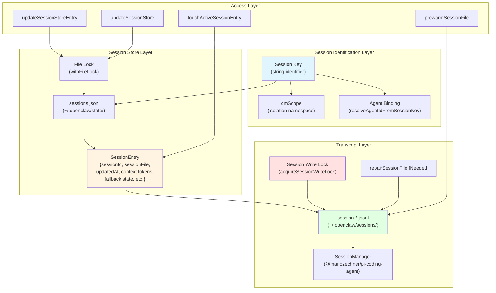
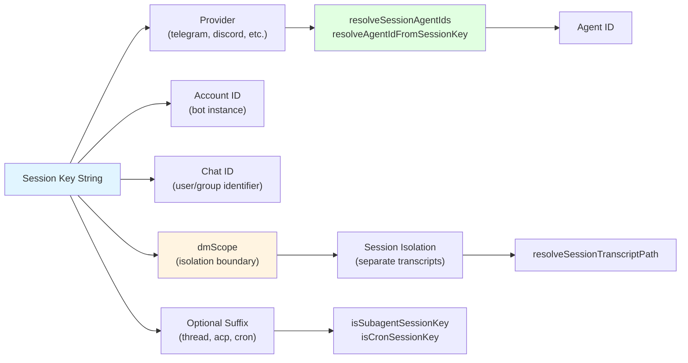
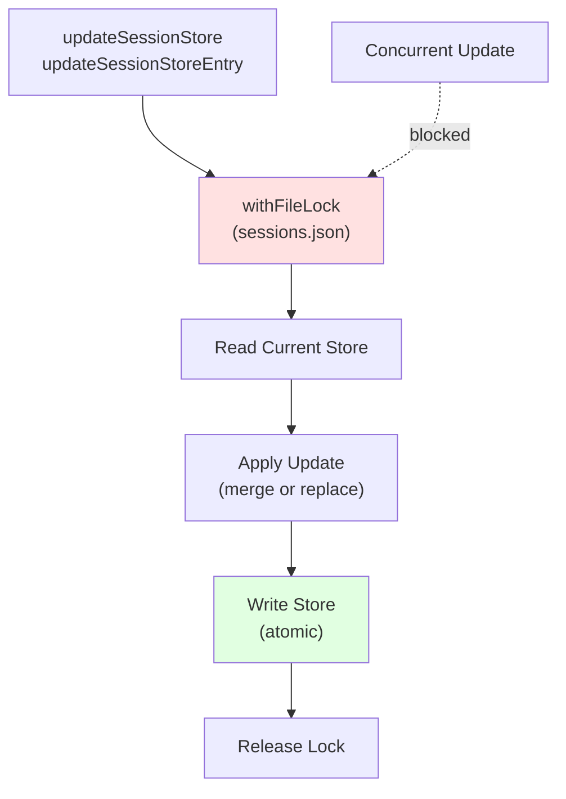
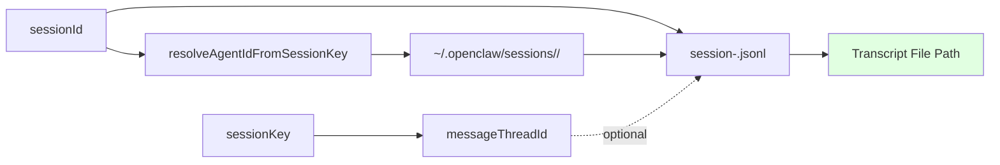
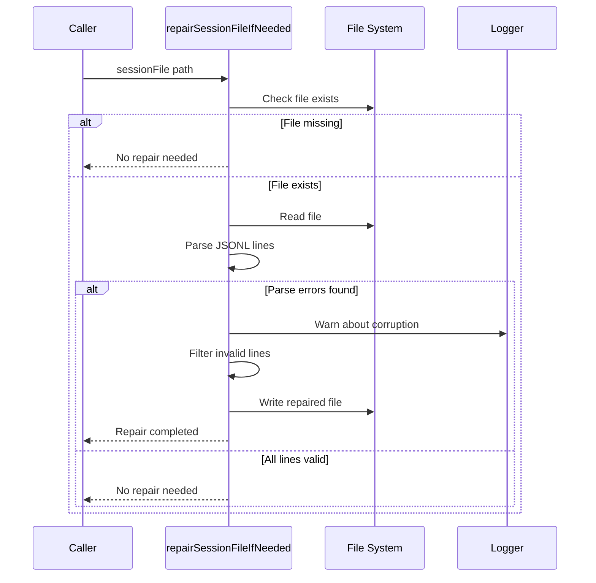
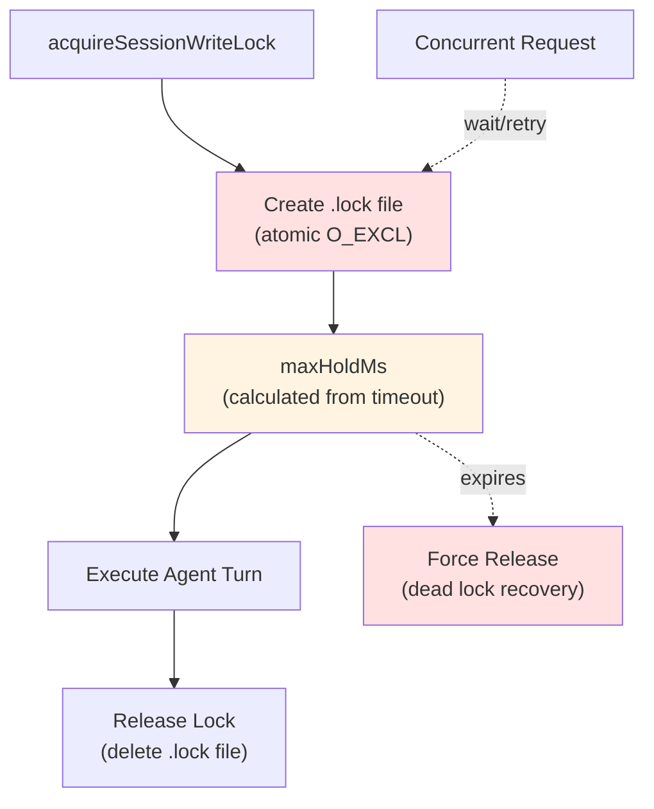
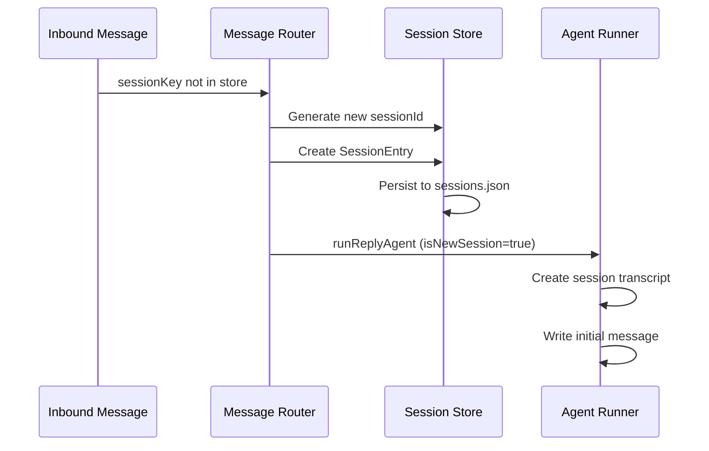
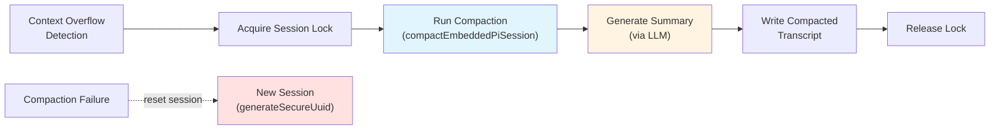
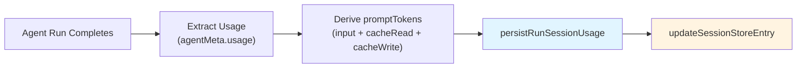
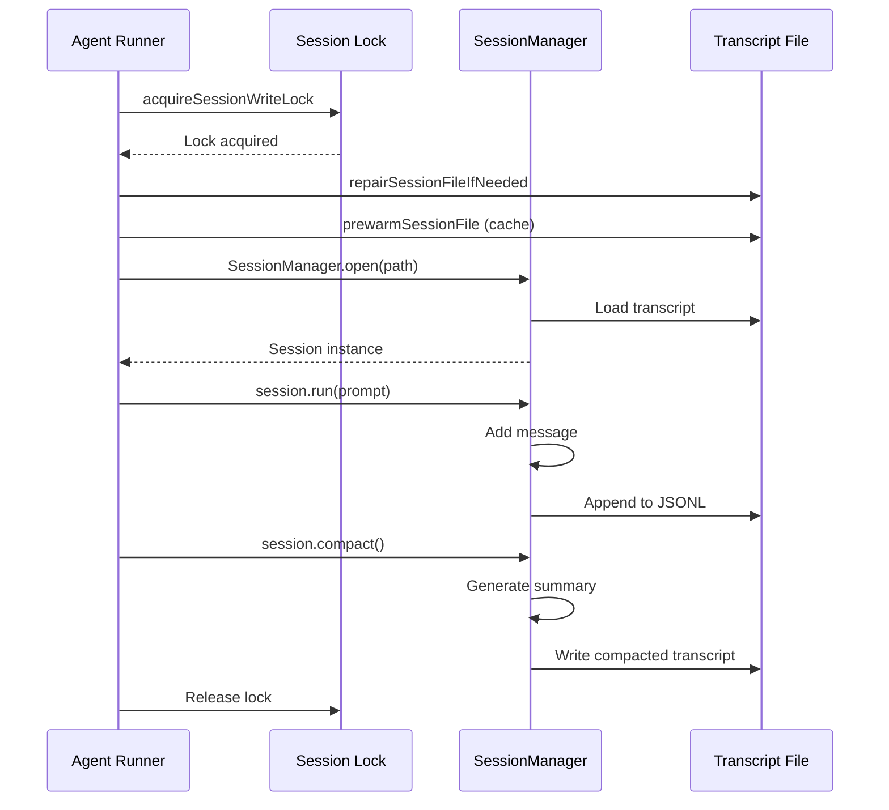

# Session Management

<details>
<summary>Relevant source files</summary>

The following files were used as context for generating this wiki page:

- [apps/macos/Sources/OpenClawProtocol/GatewayModels.swift](apps/macos/Sources/OpenClawProtocol/GatewayModels.swift)
- [apps/shared/OpenClawKit/Sources/OpenClawProtocol/GatewayModels.swift](apps/shared/OpenClawKit/Sources/OpenClawProtocol/GatewayModels.swift)
- [scripts/protocol-gen-swift.ts](scripts/protocol-gen-swift.ts)
- [src/agents/byteplus.live.test.ts](src/agents/byteplus.live.test.ts)
- [src/agents/current-time.ts](src/agents/current-time.ts)
- [src/agents/live-test-helpers.ts](src/agents/live-test-helpers.ts)
- [src/agents/model-selection.test.ts](src/agents/model-selection.test.ts)
- [src/agents/model-selection.ts](src/agents/model-selection.ts)
- [src/agents/moonshot.live.test.ts](src/agents/moonshot.live.test.ts)
- [src/agents/tool-catalog.test.ts](src/agents/tool-catalog.test.ts)
- [src/agents/tool-catalog.ts](src/agents/tool-catalog.ts)
- [src/agents/tool-policy.plugin-only-allowlist.test.ts](src/agents/tool-policy.plugin-only-allowlist.test.ts)
- [src/agents/tool-policy.test.ts](src/agents/tool-policy.test.ts)
- [src/agents/tool-policy.ts](src/agents/tool-policy.ts)
- [src/agents/tools/gateway-tool.ts](src/agents/tools/gateway-tool.ts)
- [src/auto-reply/heartbeat-reply-payload.ts](src/auto-reply/heartbeat-reply-payload.ts)
- [src/auto-reply/reply/post-compaction-context.test.ts](src/auto-reply/reply/post-compaction-context.test.ts)
- [src/auto-reply/reply/post-compaction-context.ts](src/auto-reply/reply/post-compaction-context.ts)
- [src/auto-reply/reply/session-reset-prompt.test.ts](src/auto-reply/reply/session-reset-prompt.test.ts)
- [src/auto-reply/reply/session-reset-prompt.ts](src/auto-reply/reply/session-reset-prompt.ts)
- [src/commands/agent.test.ts](src/commands/agent.test.ts)
- [src/commands/agent.ts](src/commands/agent.ts)
- [src/commands/agent/types.ts](src/commands/agent/types.ts)
- [src/config/sessions.ts](src/config/sessions.ts)
- [src/cron/isolated-agent.ts](src/cron/isolated-agent.ts)
- [src/discord/monitor/thread-bindings.shared-state.test.ts](src/discord/monitor/thread-bindings.shared-state.test.ts)
- [src/gateway/method-scopes.test.ts](src/gateway/method-scopes.test.ts)
- [src/gateway/method-scopes.ts](src/gateway/method-scopes.ts)
- [src/gateway/protocol/index.ts](src/gateway/protocol/index.ts)
- [src/gateway/protocol/schema.ts](src/gateway/protocol/schema.ts)
- [src/gateway/protocol/schema/logs-chat.ts](src/gateway/protocol/schema/logs-chat.ts)
- [src/gateway/protocol/schema/primitives.ts](src/gateway/protocol/schema/primitives.ts)
- [src/gateway/protocol/schema/protocol-schemas.ts](src/gateway/protocol/schema/protocol-schemas.ts)
- [src/gateway/protocol/schema/types.ts](src/gateway/protocol/schema/types.ts)
- [src/gateway/server-methods-list.ts](src/gateway/server-methods-list.ts)
- [src/gateway/server-methods.ts](src/gateway/server-methods.ts)
- [src/gateway/server-methods/agent.ts](src/gateway/server-methods/agent.ts)
- [src/gateway/server-methods/chat.directive-tags.test.ts](src/gateway/server-methods/chat.directive-tags.test.ts)
- [src/gateway/server-methods/chat.ts](src/gateway/server-methods/chat.ts)
- [src/gateway/server-methods/sessions.ts](src/gateway/server-methods/sessions.ts)
- [src/gateway/server.agent.gateway-server-agent-a.test.ts](src/gateway/server.agent.gateway-server-agent-a.test.ts)
- [src/gateway/server.agent.gateway-server-agent-b.test.ts](src/gateway/server.agent.gateway-server-agent-b.test.ts)
- [src/gateway/server.chat.gateway-server-chat.test.ts](src/gateway/server.chat.gateway-server-chat.test.ts)
- [src/gateway/server.sessions.gateway-server-sessions-a.test.ts](src/gateway/server.sessions.gateway-server-sessions-a.test.ts)
- [src/gateway/server.ts](src/gateway/server.ts)
- [src/gateway/session-utils.test.ts](src/gateway/session-utils.test.ts)
- [src/gateway/session-utils.ts](src/gateway/session-utils.ts)
- [src/gateway/test-helpers.ts](src/gateway/test-helpers.ts)
- [src/web/auto-reply/heartbeat-runner.test.ts](src/web/auto-reply/heartbeat-runner.test.ts)
- [src/web/auto-reply/heartbeat-runner.ts](src/web/auto-reply/heartbeat-runner.ts)

</details>

## Purpose and Scope

This document describes OpenClaw's session management system: how conversations are identified, isolated, persisted, and synchronized across the Gateway and Agent execution layers. Sessions maintain conversation history, track agent state, and ensure safe concurrent access through file-based locking.

For information about how sessions are created and routed from inbound channel messages, see [Message Flow and Agent Turn Execution](#2). For details on the session storage format and repair mechanisms, see the transcript sections below.

---

## Session Architecture Overview

Sessions are the fundamental unit of conversation state in OpenClaw. Each session represents a distinct conversation thread (DM, group chat, or internal interaction) and maintains its own transcript, metadata, and execution context.



**Sources:** [src/config/sessions.ts](), [src/agents/session-write-lock.ts](), [src/agents/pi-embedded-runner/run/attempt.ts:536-541](), [src/auto-reply/reply/agent-runner.ts:181-195]()

---

## Session Keys and Identification

### Session Key Format

Session keys are structured string identifiers that encode the routing and isolation context for a conversation:

```
<provider>:<accountId>:<chatId>:<dmScope>
```

Additional suffixes may be appended for specialized session types:

- **Thread sessions:** `:thread:<threadId>` or `:topic:<topicId>`
- **Subagent sessions:** `:acp:<subagentName>`
- **Cron sessions:** `:cron:<jobId>`



**Sources:** [src/routing/session-key.ts](), [src/agents/agent-scope.ts:resolveSessionAgentIds](), [src/config/sessions.ts:resolveAgentIdFromSessionKey]()

### dmScope Isolation

The `dmScope` component isolates sessions to prevent cross-contamination. Different dmScope values create entirely separate conversation contexts even for the same user and provider:

| dmScope Value | Purpose                                    |
| ------------- | ------------------------------------------ |
| `dm`          | Standard direct message sessions           |
| `group`       | Group chat sessions                        |
| `internal`    | Internal system sessions (Control UI, CLI) |
| `cron`        | Scheduled job sessions                     |
| `acp`         | Agent Control Plane (subagent) sessions    |

**Sources:** [src/routing/session-key.ts](), [src/agents/pi-embedded-runner/run/attempt.ts:606-611]()

---

## Session Store and Registry

### SessionEntry Structure

The session store maintains a registry mapping session keys to their metadata. Each `SessionEntry` contains:

```typescript
type SessionEntry = {
  sessionId: string // Unique session UUID
  sessionFile: string // Path to JSONL transcript
  updatedAt: number // Last activity timestamp (ms)
  createdAt?: number // Session creation timestamp
  contextTokens?: number // Model context window size
  systemSent?: boolean // Whether system intro was sent
  abortedLastRun?: boolean // Last run was aborted
  totalTokens?: number // Cumulative usage tokens
  promptTokens?: number // Last prompt tokens
  fallbackNoticeSelectedModel?: string // Fallback tracking
  fallbackNoticeActiveModel?: string
  fallbackNoticeReason?: string
  compactionCount?: number // Auto-compaction counter
  groupActivationNeedsSystemIntro?: boolean
  systemPromptReport?: object // Last system prompt metadata
  cliSessionId?: string // CLI provider session tracking
}
```

**Sources:** [src/config/sessions.ts](), [src/auto-reply/reply/agent-runner.ts:256-284]()

### Persistent Store File

The session store is persisted to `~/.openclaw/state/sessions.json`. All updates acquire a file lock to ensure atomicity:



**Sources:** [src/config/sessions.ts:updateSessionStore](), [src/auto-reply/reply/agent-runner.ts:189-194](), [src/infra/file-lock.ts]()

### Session Store Operations

| Function                       | Purpose                                  |
| ------------------------------ | ---------------------------------------- |
| `updateSessionStore`           | Update entire store with atomic callback |
| `updateSessionStoreEntry`      | Update single session entry              |
| `touchActiveSessionEntry`      | Update `updatedAt` timestamp             |
| `resolveSessionFilePath`       | Resolve transcript file path from entry  |
| `resolveSessionTranscriptPath` | Generate transcript path from sessionId  |

**Sources:** [src/config/sessions.ts](), [src/auto-reply/reply/agent-runner.ts:181-195]()

---

## Session Transcripts

### JSONL Format

Session transcripts are stored as newline-delimited JSON (JSONL) files in `~/.openclaw/sessions/`. Each line represents a message in the conversation history:

```jsonl
{"sessionId":"uuid","role":"user","content":"Hello","timestamp":1234567890}
{"sessionId":"uuid","role":"assistant","content":"Hi there","timestamp":1234567891}
{"sessionId":"uuid","role":"toolCall","name":"exec","arguments":{"command":"ls"},"timestamp":1234567892}
{"sessionId":"uuid","role":"toolResult","name":"exec","content":"file1.txt","timestamp":1234567893}
```

The transcript format follows the Pi agent message schema with OpenClaw-specific extensions for tool execution metadata.

**Sources:** [src/agents/pi-embedded-runner/run/attempt.ts](), [@mariozechner/pi-coding-agent SessionManager]()

### Transcript Paths and Resolution



**Sources:** [src/config/sessions.ts:resolveSessionTranscriptPath](), [src/agents/agent-paths.ts]()

### Transcript Repair

The system automatically repairs corrupted transcript files before opening them:



**Sources:** [src/agents/session-file-repair.ts](), [src/agents/pi-embedded-runner/run/attempt.ts:543-546]()

---

## File-Based Locking

### Lock Acquisition and Hold Time

OpenClaw uses file-based locking to serialize access to session transcripts during agent turns. This prevents race conditions when multiple requests target the same session:



**Lock hold time calculation:**

```
maxHoldMs = timeoutMs + LOCK_HOLD_BUFFER_MS
```

Where `LOCK_HOLD_BUFFER_MS` provides additional margin to prevent premature lock expiration during slow operations (compaction, tool execution).

**Sources:** [src/agents/session-write-lock.ts:acquireSessionWriteLock](), [src/agents/session-write-lock.ts:resolveSessionLockMaxHoldFromTimeout](), [src/agents/pi-embedded-runner/run/attempt.ts:536-541]()

### Lock Scope and Guarantees

Session write locks guarantee:

- **Mutual exclusion:** Only one agent turn executes per session at a time
- **Deadlock prevention:** Lock expiration with configurable `maxHoldMs`
- **Transcript consistency:** Prevents interleaved message writes

The lock file path is derived from the transcript path:

```
<transcript-path>.lock
```

**Sources:** [src/agents/session-write-lock.ts](), [src/infra/file-lock.ts]()

---

## Session Lifecycle

### Creation and Initialization

Sessions are created lazily when the first message arrives for a new session key:



**Sources:** [src/auto-reply/reply/agent-runner.ts:63-93](), [src/config/sessions.ts]()

### Active Session Updates

During an agent turn, the session entry is updated to track:

```typescript
// Touch session to update activity timestamp
await updateSessionStoreEntry({
  storePath,
  sessionKey,
  update: async () => ({ updatedAt: Date.now() }),
})

// Persist usage after turn completion
await persistRunSessionUsage({
  storePath,
  sessionKey,
  usage,
  lastCallUsage,
  promptTokens,
  modelUsed,
  providerUsed,
  contextTokensUsed,
  systemPromptReport,
})
```

**Sources:** [src/auto-reply/reply/agent-runner.ts:189-194](), [src/auto-reply/reply/session-run-accounting.ts:persistRunSessionUsage]()

### Session Compaction

When conversation history exceeds the model's context window, auto-compaction triggers to summarize older messages:



**Compaction triggers auto-increment of `compactionCount` in the session entry.**

**Sources:** [src/agents/pi-embedded-runner/compact.ts](), [src/auto-reply/reply/agent-runner.ts:328-340](), [src/auto-reply/reply/session-run-accounting.ts:incrementRunCompactionCount]()

### Session Reset and Deletion

Sessions can be reset (new transcript, same key) or deleted entirely:

| Operation   | Effect                                   | API Method                 |
| ----------- | ---------------------------------------- | -------------------------- |
| **Reset**   | Generates new `sessionId`, preserves key | `sessions.reset`           |
| **Delete**  | Removes entry and transcript file        | `sessions.delete`          |
| **Cleanup** | Removes orphaned/expired sessions        | Auto-cleanup on store load |

**Reset implementation:**

```typescript
const nextSessionId = generateSecureUuid();
const nextEntry: SessionEntry = {
  ...prevEntry,
  sessionId: nextSessionId,
  updatedAt: Date.now(),
  systemSent: false,
  abortedLastRun: false,
  fallbackNotice* fields cleared
};
```

**Sources:** [src/auto-reply/reply/agent-runner.ts:256-340](), [src/gateway/server-methods/sessions.ts]()

---

## Session Operations (RPC Methods)

The Gateway exposes session management through RPC methods accessible via WebSocket protocol:

### sessions.list

**Request:**

```typescript
{
  method: "sessions.list",
  params: {
    agentId?: string;
    dmScope?: string;
    limit?: number;
    offset?: number;
  }
}
```

**Response:**

```typescript
{
  sessions: Array<{
    sessionKey: string
    sessionId: string
    updatedAt: number
    totalTokens?: number
    agentId: string
    messageChannel?: string
  }>
  total: number
}
```

**Sources:** [src/gateway/protocol/schema/sessions.ts](), [src/gateway/server-methods/sessions.ts]()

### sessions.preview

Retrieves the last N messages from a session transcript without loading the full history:

```typescript
{
  method: "sessions.preview",
  params: {
    sessionKey: string;
    limit?: number;  // Default: 10
  }
}
```

**Sources:** [src/gateway/server-methods/sessions.ts]()

### sessions.patch

Updates session metadata without modifying the transcript:

```typescript
{
  method: "sessions.patch",
  params: {
    sessionKey: string;
    updates: {
      contextTokens?: number;
      totalTokens?: number;
      responseUsage?: "off" | "minimal" | "full";
      // ... other SessionEntry fields
    }
  }
}
```

**Returns:** `SessionsPatchResult` with updated entry.

**Sources:** [src/gateway/protocol/schema/sessions.ts](), [src/gateway/session-utils.types.ts]()

### sessions.reset

Resets a session by generating a new `sessionId` and creating a fresh transcript:

```typescript
{
  method: "sessions.reset",
  params: {
    sessionKey: string;
    preserveMetadata?: boolean;
  }
}
```

**Cleanup behavior:** Optionally deletes the old transcript file.

**Sources:** [src/gateway/server-methods/sessions.ts](), [src/auto-reply/reply/agent-runner.ts:261-327]()

### sessions.delete

Permanently removes a session entry and its transcript file:

```typescript
{
  method: "sessions.delete",
  params: {
    sessionKey: string;
  }
}
```

**Sources:** [src/gateway/server-methods/sessions.ts]()

### sessions.compact

Manually triggers compaction for a session (normally happens automatically):

```typescript
{
  method: "sessions.compact",
  params: {
    sessionKey: string;
    force?: boolean;
    tokenBudget?: number;
  }
}
```

**Response:**

```typescript
{
  ok: boolean;
  compacted: boolean;
  reason?: string;
  messagesBefore?: number;
  messagesAfter?: number;
}
```

**Sources:** [src/gateway/protocol/schema/sessions.ts](), [src/gateway/server-methods/sessions.ts]()

---

## Session Metadata and State Tracking

### Usage Accounting

Sessions track token usage across turns to enable accurate context window management:

```typescript
type UsageSnapshot = {
  totalTokens: number // Cumulative usage
  promptTokens: number // Last call prompt tokens
  contextTokens: number // Model context window size
}
```

**Usage persistence flow:**



**Sources:** [src/auto-reply/reply/session-run-accounting.ts:persistRunSessionUsage](), [src/agents/usage.ts]()

### Fallback State

When model fallback occurs (provider unavailable, rate limit, etc.), the session tracks the transition:

```typescript
{
  fallbackNoticeSelectedModel: "anthropic/claude-3-5-sonnet",
  fallbackNoticeActiveModel: "openai/gpt-4o",
  fallbackNoticeReason: "rate_limit"
}
```

This state persists until the selected model becomes available again, allowing the system to display informative notices to users.

**Sources:** [src/auto-reply/reply/agent-runner.ts:422-454](), [src/auto-reply/fallback-state.ts]()

### System Prompt Reporting

The `systemPromptReport` field stores metadata about the system prompt used in the last turn:

```typescript
type SessionSystemPromptReport = {
  promptCharacters: number
  bootstrapFilesInjected: number
  skillsPromptIncluded: boolean
  contextFilesInjected: number
  truncationWarnings?: string[]
  // ... additional metadata
}
```

This enables diagnostics and debugging of context window budget issues.

**Sources:** [src/config/sessions/types.ts](), [src/agents/system-prompt-report.ts]()

---

## Session Manager Integration

### SessionManager Lifecycle

The `SessionManager` class from `@mariozechner/pi-coding-agent` provides the low-level interface to transcript files:



**Sources:** [src/agents/pi-embedded-runner/run/attempt.ts:536-605](), [@mariozechner/pi-coding-agent]()

### Guard Wrappers

The `guardSessionManager` wrapper adds OpenClaw-specific safety checks:

```typescript
const sessionManager = guardSessionManager(SessionManager.open(sessionFile), {
  agentId: sessionAgentId,
  sessionKey: params.sessionKey,
  allowSyntheticToolResults: transcriptPolicy.allowSyntheticToolResults,
  allowedToolNames,
})
```

Guards enforce:

- Tool name allowlists (prevent unauthorized tool injection)
- Synthetic tool result policies (some providers require real tool calls)
- Transcript repair and validation

**Sources:** [src/agents/session-tool-result-guard-wrapper.ts](), [src/agents/pi-embedded-runner/run/attempt.ts:554-558]()

### Session Manager Caching

The `prewarmSessionFile` function implements an LRU cache to avoid redundant file reads:

```typescript
const SESSION_CACHE_SIZE = 32
const sessionCache = new Map<string, { content: string; mtime: number }>()

async function prewarmSessionFile(path: string): Promise<void> {
  const stats = await fs.stat(path)
  const cached = sessionCache.get(path)
  if (cached && cached.mtime === stats.mtimeMs) {
    return // Cache hit
  }
  const content = await fs.readFile(path, 'utf-8')
  sessionCache.set(path, { content, mtime: stats.mtimeMs })
  // Evict oldest entries if cache exceeds size
}
```

**Sources:** [src/agents/pi-embedded-runner/session-manager-cache.ts](), [src/agents/pi-embedded-runner/run/attempt.ts:547]()

---

## Session Isolation and Security

### dmScope Boundaries

Sessions with different `dmScope` values are completely isolated:

| Scenario                 | Session Key Pattern                       | Isolation              |
| ------------------------ | ----------------------------------------- | ---------------------- |
| User DMs bot on Telegram | `telegram:bot1:user123:dm`                | Separate from groups   |
| Same user in group chat  | `telegram:bot1:user123:group:chat456`     | Separate transcript    |
| Control UI interaction   | `internal:webchat:session789:internal`    | Separate from channels |
| Subagent spawned in DM   | `telegram:bot1:user123:dm:acp:researcher` | Nested session         |

**Access control:** The Gateway's routing layer enforces dmPolicy and groupPolicy before resolving session keys, preventing unauthorized cross-scope access.

**Sources:** [src/routing/session-key.ts](), [src/gateway/server.impl.ts]()

### Subagent Session Nesting

ACP (Agent Control Plane) subagents create nested sessions under their parent:

```
Parent:  telegram:bot1:user123:dm
Subagent: telegram:bot1:user123:dm:acp:researcher
```

The `isSubagentSessionKey` predicate identifies these sessions for special handling (minimal system prompts, thread binding persistence).

**Sources:** [src/routing/session-key.ts:isSubagentSessionKey](), [src/agents/pi-embedded-runner/run/attempt.ts:606-611]()

---

## Performance Considerations

### Lock Contention

High-frequency requests to the same session can cause lock contention. The system mitigates this through:

- **Queue policies:** `mode: "enqueue"` defers followup turns until the active turn completes
- **Lock timeouts:** Expired locks are force-released to prevent permanent deadlock
- **Typing indicators:** Provide user feedback during long-running turns

**Sources:** [src/auto-reply/reply/queue-policy.ts](), [src/auto-reply/reply/agent-runner.ts:206-223]()

### Transcript Size Growth

Large transcripts impact performance. OpenClaw manages this through:

- **Auto-compaction:** Triggered when `estimateMessagesTokens()` exceeds context window
- **History limits:** `dmHistoryLimit` configuration caps message retention
- **Tool result truncation:** Oversized tool outputs are truncated before persistence

**Sources:** [src/agents/compaction.ts](), [src/agents/pi-embedded-runner/history.ts](), [src/agents/pi-embedded-runner/tool-result-truncation.ts]()

### Session Store Size

The global `sessions.json` file can grow large with many active sessions. Cleanup strategies:

- **Auto-expiry:** Sessions inactive beyond configured TTL are removed on load
- **Manual deletion:** `sessions.delete` RPC method
- **Agent-scoped isolation:** Each agent maintains separate session subdirectories

**Sources:** [src/config/sessions.ts]()
