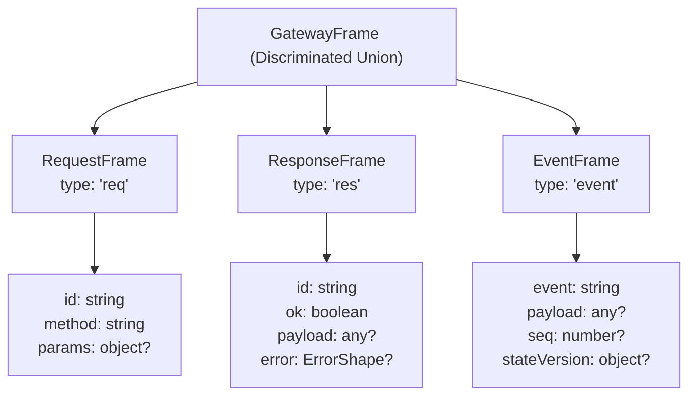
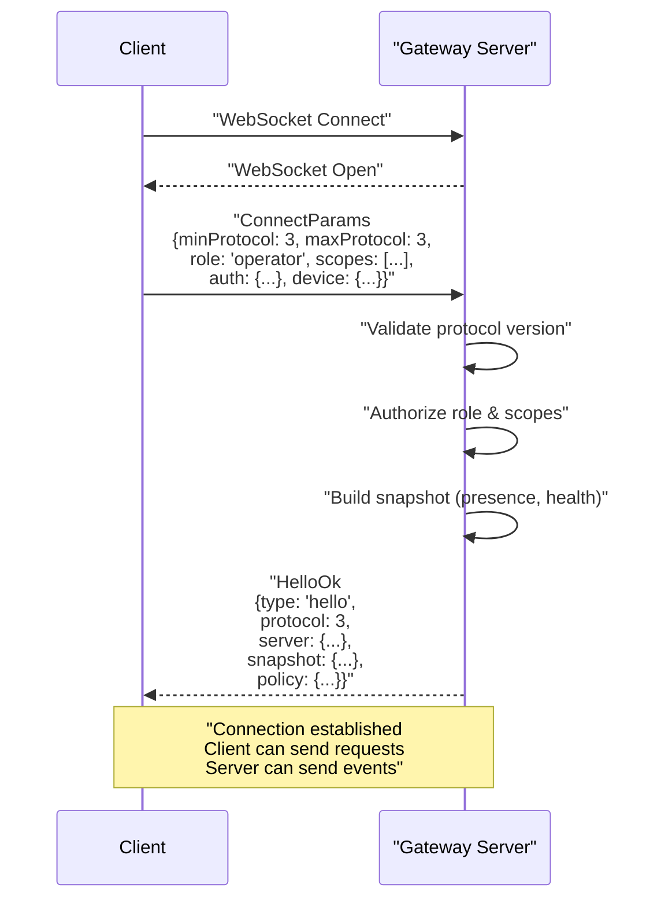
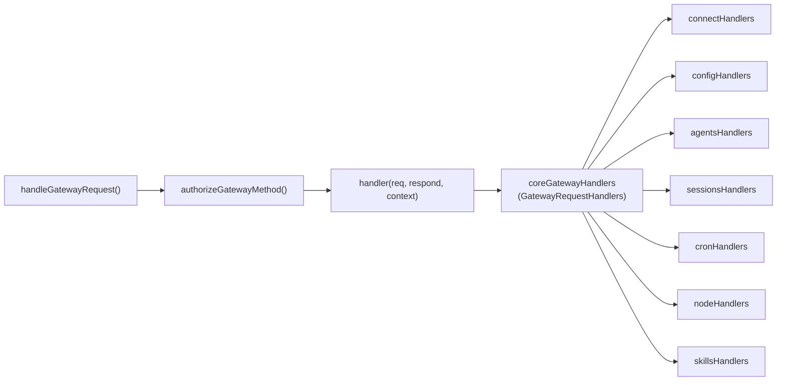
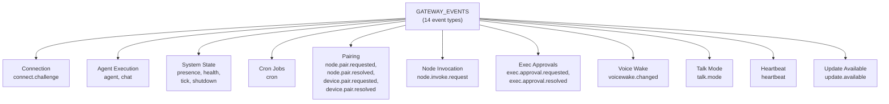
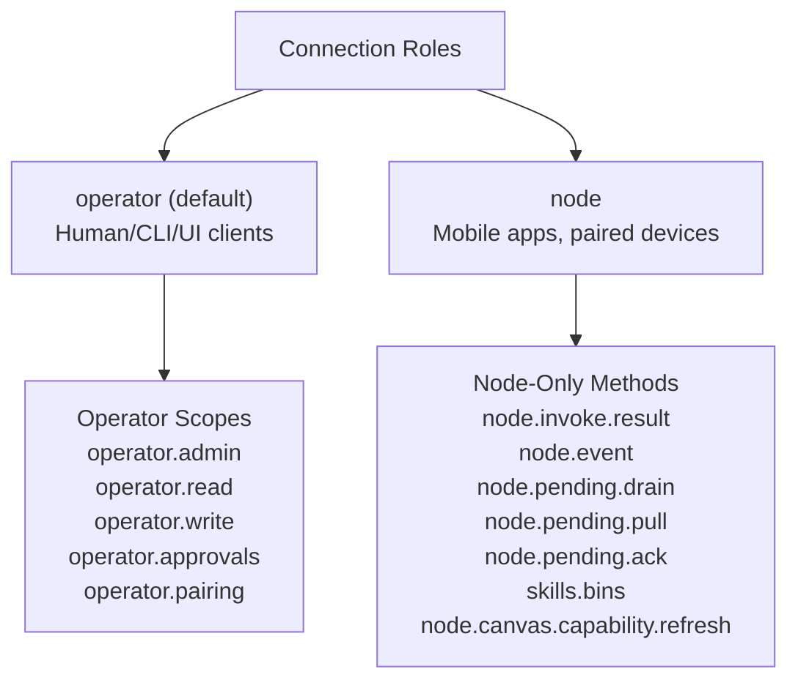
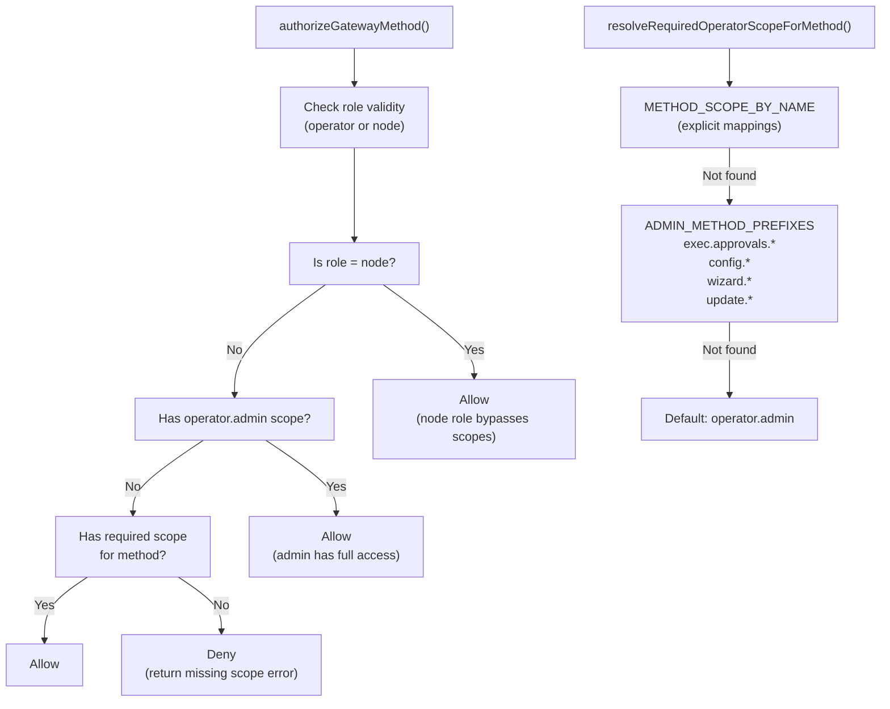
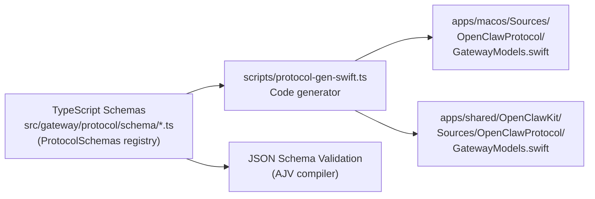
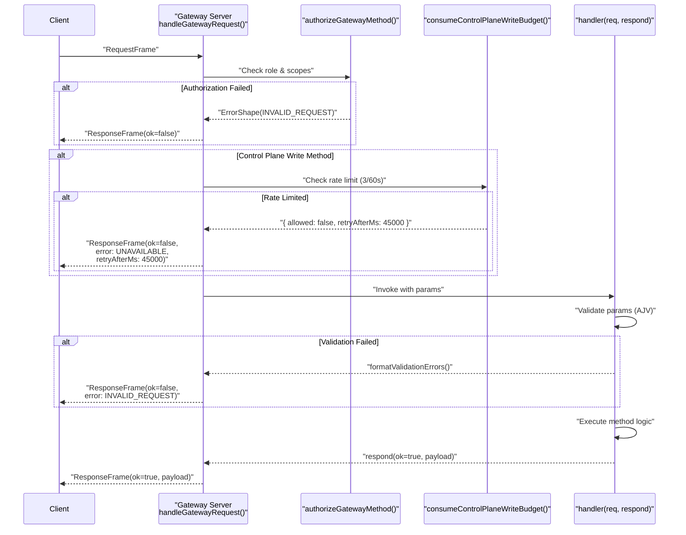

# WebSocket Protocol & RPC

<details>
<summary>Relevant source files</summary>

The following files were used as context for generating this wiki page:

- [apps/macos/Sources/OpenClawProtocol/GatewayModels.swift](apps/macos/Sources/OpenClawProtocol/GatewayModels.swift)
- [apps/shared/OpenClawKit/Sources/OpenClawProtocol/GatewayModels.swift](apps/shared/OpenClawKit/Sources/OpenClawProtocol/GatewayModels.swift)
- [scripts/protocol-gen-swift.ts](scripts/protocol-gen-swift.ts)
- [src/agents/tool-catalog.test.ts](src/agents/tool-catalog.test.ts)
- [src/agents/tool-catalog.ts](src/agents/tool-catalog.ts)
- [src/agents/tool-policy.plugin-only-allowlist.test.ts](src/agents/tool-policy.plugin-only-allowlist.test.ts)
- [src/agents/tool-policy.test.ts](src/agents/tool-policy.test.ts)
- [src/agents/tool-policy.ts](src/agents/tool-policy.ts)
- [src/agents/tools/gateway-tool.ts](src/agents/tools/gateway-tool.ts)
- [src/discord/monitor/thread-bindings.shared-state.test.ts](src/discord/monitor/thread-bindings.shared-state.test.ts)
- [src/gateway/method-scopes.test.ts](src/gateway/method-scopes.test.ts)
- [src/gateway/method-scopes.ts](src/gateway/method-scopes.ts)
- [src/gateway/protocol/index.ts](src/gateway/protocol/index.ts)
- [src/gateway/protocol/schema.ts](src/gateway/protocol/schema.ts)
- [src/gateway/protocol/schema/protocol-schemas.ts](src/gateway/protocol/schema/protocol-schemas.ts)
- [src/gateway/protocol/schema/types.ts](src/gateway/protocol/schema/types.ts)
- [src/gateway/server-methods-list.ts](src/gateway/server-methods-list.ts)
- [src/gateway/server-methods.ts](src/gateway/server-methods.ts)
- [src/gateway/server.ts](src/gateway/server.ts)

</details>

The Gateway's WebSocket protocol (v3) defines the communication contract between clients (CLI, Control UI, native apps, channel plugins) and the Gateway server. This page documents the protocol's frame structure, RPC method registry, event broadcasting, authorization model, and cross-platform schema generation.

For Gateway configuration and lifecycle management, see [Configuration System](#2.3). For authentication mechanisms beyond protocol-level authorization, see [Authentication & Authorization](#2.2).

---

## Protocol Version & Frame Types

The Gateway protocol is currently at **version 3** (`PROTOCOL_VERSION = 3`). All communication occurs via JSON-encoded frames over WebSocket connections on `ws://127.0.0.1:18789` (default).

### Frame Structure

The protocol defines three core frame types, unified under the `GatewayFrame` discriminated union:



**Sources:** [src/gateway/protocol/schema/frames.ts:1-200](), [apps/shared/OpenClawKit/Sources/OpenClawProtocol/GatewayModels.swift:119-203]()

#### RequestFrame

Client-initiated RPC calls. Each request must include a unique `id` for correlation with the corresponding response.

| Field    | Type      | Description                                       |
| -------- | --------- | ------------------------------------------------- |
| `type`   | `"req"`   | Frame discriminator                               |
| `id`     | `string`  | Unique request identifier (UUID recommended)      |
| `method` | `string`  | RPC method name (e.g., `"agent"`, `"config.get"`) |
| `params` | `object?` | Method-specific parameters (validated per-method) |

**Sources:** [apps/shared/OpenClawKit/Sources/OpenClawProtocol/GatewayModels.swift:119-143]()

#### ResponseFrame

Server responses to client requests. The `id` matches the originating request.

| Field     | Type          | Description                             |
| --------- | ------------- | --------------------------------------- |
| `type`    | `"res"`       | Frame discriminator                     |
| `id`      | `string`      | Request correlation ID                  |
| `ok`      | `boolean`     | Success/failure indicator               |
| `payload` | `any?`        | Method result (present when `ok=true`)  |
| `error`   | `ErrorShape?` | Error details (present when `ok=false`) |

**ErrorShape Structure:**

| Field          | Type       | Description                                  |
| -------------- | ---------- | -------------------------------------------- |
| `code`         | `string`   | Error code (see [Error Codes](#error-codes)) |
| `message`      | `string`   | Human-readable error message                 |
| `details`      | `any?`     | Additional error context                     |
| `retryable`    | `boolean?` | Whether client should retry                  |
| `retryAfterMs` | `number?`  | Milliseconds to wait before retry            |

**Sources:** [apps/shared/OpenClawKit/Sources/OpenClawProtocol/GatewayModels.swift:145-173](), [apps/shared/OpenClawKit/Sources/OpenClawProtocol/GatewayModels.swift:343-371]()

#### EventFrame

Server-initiated broadcasts (no request correlation). Clients subscribe to events via the connection handshake.

| Field          | Type      | Description                                |
| -------------- | --------- | ------------------------------------------ |
| `type`         | `"event"` | Frame discriminator                        |
| `event`        | `string`  | Event name (e.g., `"agent"`, `"presence"`) |
| `payload`      | `any?`    | Event-specific data                        |
| `seq`          | `number?` | Event sequence number                      |
| `stateVersion` | `object?` | State version metadata                     |

**Sources:** [apps/shared/OpenClawKit/Sources/OpenClawProtocol/GatewayModels.swift:175-203]()

---

## Connection Handshake

Clients initiate a connection by sending a `ConnectParams` frame. The Gateway responds with `HelloOk` containing the negotiated protocol version and initial state snapshot.

### Connection Flow



**Sources:** [src/gateway/protocol/schema/frames.ts:1-100](), [src/gateway/server-methods/connect.ts:1-200]()

### ConnectParams

| Field         | Type        | Required | Description                                                       |
| ------------- | ----------- | -------- | ----------------------------------------------------------------- |
| `minProtocol` | `number`    | Yes      | Minimum supported protocol version                                |
| `maxProtocol` | `number`    | Yes      | Maximum supported protocol version                                |
| `client`      | `object`    | Yes      | Client metadata (name, version, platform)                         |
| `role`        | `string?`   | No       | Connection role: `"operator"` or `"node"` (default: `"operator"`) |
| `scopes`      | `string[]?` | No       | Operator scopes (see [Authorization](#authorization-system))      |
| `auth`        | `object?`   | No       | Authentication credentials (token/password)                       |
| `device`      | `object?`   | No       | Device pairing information (for nodes)                            |
| `caps`        | `string[]?` | No       | Client capabilities                                               |
| `commands`    | `string[]?` | No       | Supported node commands (for role=node)                           |

**Sources:** [apps/shared/OpenClawKit/Sources/OpenClawProtocol/GatewayModels.swift:15-75]()

### HelloOk

| Field           | Type       | Description                                     |
| --------------- | ---------- | ----------------------------------------------- |
| `type`          | `"hello"`  | Response discriminator                          |
| `protocol`      | `number`   | Negotiated protocol version                     |
| `server`        | `object`   | Server metadata (version, platform, instanceId) |
| `features`      | `object`   | Enabled features                                |
| `snapshot`      | `Snapshot` | Current system state                            |
| `canvasHostUrl` | `string?`  | Canvas host URL (if canvas feature enabled)     |
| `auth`          | `object?`  | Authentication status                           |
| `policy`        | `object`   | Authorization policy                            |

**Snapshot Structure:**

| Field             | Type              | Description                    |
| ----------------- | ----------------- | ------------------------------ |
| `presence`        | `PresenceEntry[]` | Connected clients/nodes        |
| `health`          | `object`          | System health metrics          |
| `stateVersion`    | `StateVersion`    | State version counters         |
| `uptimeMs`        | `number`          | Gateway uptime in milliseconds |
| `configPath`      | `string?`         | Configuration file path        |
| `authMode`        | `string?`         | Authentication mode            |
| `updateAvailable` | `object?`         | Update availability info       |

**Sources:** [apps/shared/OpenClawKit/Sources/OpenClawProtocol/GatewayModels.swift:77-117](), [apps/shared/OpenClawKit/Sources/OpenClawProtocol/GatewayModels.swift:297-341]()

---

## RPC Methods

The Gateway exposes **100+ RPC methods** organized into functional categories. Each method has an associated schema for parameter validation and scope-based authorization requirements.

### Method Registry

```mermaid
graph TB
    subgraph "Core Methods (BASE_METHODS)"
        HealthMethods["Health & Diagnostics<br/>health, doctor.memory.status,<br/>logs.tail, status"]
        ConfigMethods["Configuration<br/>config.get, config.set,<br/>config.apply, config.patch,<br/>config.schema, config.schema.lookup"]
        AgentMethods["Agent Management<br/>agents.list, agents.create,<br/>agents.update, agents.delete,<br/>agents.files.*"]
        SessionMethods["Session Management<br/>sessions.list, sessions.patch,<br/>sessions.reset, sessions.delete,<br/>sessions.compact"]
        CronMethods["Cron Jobs<br/>cron.list, cron.add,<br/>cron.update, cron.remove,<br/>cron.run, cron.runs"]
        NodeMethods["Node/Device Pairing<br/>node.pair.*, node.invoke,<br/>device.pair.*, device.token.*"]
        SkillsMethods["Skills & Tools<br/>skills.status, skills.install,<br/>tools.catalog, models.list"]
        ExecMethods["Execution Control<br/>exec.approvals.*, send,<br/>agent, agent.wait, wake"]
    end

    subgraph "Channel Plugin Methods"
        ChannelMethods["Channel-Specific Methods<br/>Injected by channel plugins<br/>via gatewayMethods export"]
    end

    Registry["listGatewayMethods()<br/>100+ methods"]

    Registry --> HealthMethods
    Registry --> ConfigMethods
    Registry --> AgentMethods
    Registry --> SessionMethods
    Registry --> CronMethods
    Registry --> NodeMethods
    Registry --> SkillsMethods
    Registry --> ExecMethods
    Registry --> ChannelMethods
```



**Sources:** [src/gateway/server-methods-list.ts:4-111]()

### Method Categories

The `BASE_METHODS` array defines core Gateway methods, with additional methods contributed by channel plugins:

**Configuration & System:**

- `config.get`, `config.set`, `config.apply`, `config.patch`
- `config.schema`, `config.schema.lookup`
- `health`, `status`, `update.run`
- `wizard.start`, `wizard.next`, `wizard.cancel`, `wizard.status`

**Agents & Sessions:**

- `agents.list`, `agents.create`, `agents.update`, `agents.delete`
- `agents.files.list`, `agents.files.get`, `agents.files.set`
- `sessions.list`, `sessions.patch`, `sessions.reset`, `sessions.delete`
- `agent`, `agent.identity.get`, `agent.wait`

**Skills & Tools:**

- `skills.status`, `skills.bins`, `skills.install`, `skills.update`
- `tools.catalog`, `models.list`

**Cron & Automation:**

- `cron.list`, `cron.status`, `cron.add`, `cron.update`, `cron.remove`, `cron.run`, `cron.runs`

**Nodes & Devices:**

- `node.pair.request`, `node.pair.approve`, `node.pair.reject`, `node.pair.verify`
- `node.list`, `node.describe`, `node.invoke`, `node.rename`
- `node.pending.drain`, `node.pending.enqueue`, `node.pending.ack`
- `device.pair.list`, `device.pair.approve`, `device.pair.reject`, `device.pair.remove`

**Messaging & Channels:**

- `send`, `channels.status`, `channels.logout`
- `talk.mode`, `talk.config`

**Execution & Approvals:**

- `exec.approvals.get`, `exec.approvals.set`
- `exec.approval.request`, `exec.approval.resolve`
- `wake`, `voicewake.get`, `voicewake.set`

**Sources:** [src/gateway/server-methods-list.ts:4-106]()

### Method Handler Registration

Handlers are registered in `coreGatewayHandlers` by merging category-specific handler objects:



**Sources:** [src/gateway/server-methods.ts:68-98](), [src/gateway/server-methods.ts:100-157]()

### Parameter Validation

Each method's parameters are validated using AJV against pre-compiled JSON schemas:

```typescript
// Example: Agent RPC method validation
validateAgentParams(req.params) // Compiled from AgentParamsSchema
validateSessionsListParams(req.params) // Compiled from SessionsListParamsSchema
validateConfigApplyParams(req.params) // Compiled from ConfigApplyParamsSchema
```

Validation errors are formatted and returned as `ErrorShape` with code `INVALID_REQUEST`:

**Sources:** [src/gateway/protocol/index.ts:259-423](), [src/gateway/protocol/index.ts:424-458]()

---

## Event Broadcasting

The Gateway broadcasts events to all connected clients (or filtered subsets based on event type). Events are server-initiated and do not require a request correlation ID.

### Event Types



**Sources:** [src/gateway/server-methods-list.ts:113-133]()

### Event Descriptions

| Event                     | Payload                  | Description                                        |
| ------------------------- | ------------------------ | -------------------------------------------------- |
| `connect.challenge`       | `object`                 | Authentication challenge during connection         |
| `agent`                   | `AgentEvent`             | Agent execution progress (tool calls, text deltas) |
| `chat`                    | `ChatEvent`              | WebChat-specific agent events                      |
| `presence`                | `PresenceEntry[]`        | Connected client/node presence updates             |
| `health`                  | `object`                 | System health metric changes                       |
| `tick`                    | `TickEvent`              | Periodic heartbeat (every 5s by default)           |
| `shutdown`                | `ShutdownEvent`          | Gateway shutdown signal                            |
| `heartbeat`               | `object`                 | Client heartbeat acknowledgment                    |
| `cron`                    | `object`                 | Cron job execution events                          |
| `node.pair.requested`     | `object`                 | Node pairing request received                      |
| `node.pair.resolved`      | `object`                 | Node pairing approved/rejected                     |
| `node.invoke.request`     | `NodeInvokeRequestEvent` | Operator invoking node command                     |
| `device.pair.requested`   | `object`                 | Device pairing request received                    |
| `device.pair.resolved`    | `object`                 | Device pairing approved/rejected                   |
| `exec.approval.requested` | `object`                 | Exec tool requires operator approval               |
| `exec.approval.resolved`  | `object`                 | Exec approval granted/denied                       |
| `voicewake.changed`       | `object`                 | Voice wake configuration changed                   |
| `talk.mode`               | `object`                 | Talk mode activated/deactivated                    |
| `update.available`        | `object`                 | Gateway update available                           |

**Sources:** [src/gateway/server-methods-list.ts:113-133](), [src/gateway/protocol/schema/frames.ts:1-200]()

---

## Authorization System

The Gateway enforces role-based access control (RBAC) and scope-based authorization for all RPC methods.

### Roles



**Sources:** [src/gateway/method-scopes.ts:1-218](), [src/gateway/role-policy.ts:1-50]()

#### Operator Role

Default role for human operators, CLI clients, and Control UI. Requires scope-based authorization:

| Scope                | Description                    | Example Methods                                               |
| -------------------- | ------------------------------ | ------------------------------------------------------------- |
| `operator.admin`     | Full administrative access     | `config.apply`, `wizard.start`, `update.run`, `agents.create` |
| `operator.read`      | Read-only access               | `config.get`, `sessions.list`, `agents.list`, `health`        |
| `operator.write`     | Write operations               | `send`, `agent`, `chat.send`, `wake`                          |
| `operator.approvals` | Execution approval management  | `exec.approval.request`, `exec.approval.resolve`              |
| `operator.pairing`   | Device/node pairing management | `node.pair.approve`, `device.pair.approve`                    |

**Default CLI Scopes:** `CLI_DEFAULT_OPERATOR_SCOPES` includes all five scopes.

**Sources:** [src/gateway/method-scopes.ts:1-20](), [src/gateway/method-scopes.ts:32-134]()

#### Node Role

Reserved for paired mobile apps and devices. Node role methods bypass operator scope checks:

- `node.invoke.result` — Return command invocation results
- `node.event` — Send arbitrary events to operator
- `node.pending.drain` — Poll pending commands
- `node.pending.pull` — Legacy pending queue access
- `node.pending.ack` — Acknowledge pending items
- `skills.bins` — Download skill binaries
- `node.canvas.capability.refresh` — Update canvas capabilities

**Sources:** [src/gateway/method-scopes.ts:22-30](), [src/gateway/role-policy.ts:1-50]()

### Scope Resolution

Method authorization follows a strict precedence:



**Sources:** [src/gateway/server-methods.ts:39-66](), [src/gateway/method-scopes.ts:136-218]()

### Scope Assignment Examples

| Method                  | Required Scope       | Rationale                      |
| ----------------------- | -------------------- | ------------------------------ |
| `health`                | `operator.read`      | Non-sensitive diagnostics      |
| `sessions.list`         | `operator.read`      | Read-only session enumeration  |
| `send`                  | `operator.write`     | Sends messages via agent       |
| `agent`                 | `operator.write`     | Invokes agent execution        |
| `config.apply`          | `operator.admin`     | Modifies system configuration  |
| `agents.delete`         | `operator.admin`     | Destructive agent operation    |
| `exec.approval.resolve` | `operator.approvals` | Grants/denies exec permissions |
| `node.pair.approve`     | `operator.pairing`   | Approves device pairing        |
| `wizard.start`          | `operator.admin`     | Admin-only prefix match        |
| `update.run`            | `operator.admin`     | Admin-only prefix match        |

**Sources:** [src/gateway/method-scopes.ts:32-153]()

### Error Codes

The protocol defines standard error codes in the `ErrorCode` enum:

```swift
public enum ErrorCode: String, Codable, Sendable {
    case notLinked = "NOT_LINKED"
    case notPaired = "NOT_PAIRED"
    case agentTimeout = "AGENT_TIMEOUT"
    case invalidRequest = "INVALID_REQUEST"
    case unavailable = "UNAVAILABLE"
}
```

- **`NOT_LINKED`** — Authentication required but not provided
- **`NOT_PAIRED`** — Node/device pairing required
- **`AGENT_TIMEOUT`** — Agent execution exceeded timeout
- **`INVALID_REQUEST`** — Validation failure or authorization denial
- **`UNAVAILABLE`** — Rate limit exceeded or service unavailable

**Sources:** [apps/shared/OpenClawKit/Sources/OpenClawProtocol/GatewayModels.swift:7-13](), [src/gateway/protocol/schema/error-codes.ts:1-20]()

---

## Schema Generation for Swift Clients

The Gateway protocol schemas are defined in TypeScript using `@sinclair/typebox` and automatically transpiled to Swift structs for use in macOS and iOS clients.

### Generation Pipeline



**Sources:** [scripts/protocol-gen-swift.ts:1-248]()

### Type Mapping

The generator maps TypeScript/JSON Schema types to Swift types with Codable conformance:

| TypeScript/JSON Schema      | Swift Type               |
| --------------------------- | ------------------------ |
| `string`                    | `String`                 |
| `number` (integer)          | `Int`                    |
| `number` (float)            | `Double`                 |
| `boolean`                   | `Bool`                   |
| `array`                     | `[ElementType]`          |
| `object` (typed properties) | Custom `struct`          |
| `object` (dynamic)          | `[String: AnyCodable]`   |
| `anyOf` / `oneOf`           | `AnyCodable`             |
| Optional field              | `Type?` (Swift Optional) |

**Sources:** [scripts/protocol-gen-swift.ts:84-111]()

### Generated Struct Example

TypeScript schema:

```typescript
export const RequestFrameSchema = Type.Object({
  type: Type.Literal('req'),
  id: Type.String(),
  method: Type.String(),
  params: Type.Optional(Type.Any()),
})
```

Generated Swift struct:

```swift
public struct RequestFrame: Codable, Sendable {
    public let type: String
    public let id: String
    public let method: String
    public let params: AnyCodable?

    public init(type: String, id: String, method: String, params: AnyCodable?) {
        self.type = type
        self.id = id
        self.method = method
        self.params = params
    }

    private enum CodingKeys: String, CodingKey {
        case type
        case id
        case method
        case params
    }
}
```

**Sources:** [scripts/protocol-gen-swift.ts:113-156](), [apps/shared/OpenClawKit/Sources/OpenClawProtocol/GatewayModels.swift:119-143]()

### CodingKeys Conversion

Property names are automatically converted from `snake_case` or `kebab-case` to `camelCase`, with explicit `CodingKeys` mapping for JSON serialization:

```swift
// JSON: { "minProtocol": 3, "maxProtocol": 3 }
// Swift properties: minprotocol, maxprotocol
private enum CodingKeys: String, CodingKey {
    case minprotocol = "minProtocol"
    case maxprotocol = "maxProtocol"
}
```

**Sources:** [scripts/protocol-gen-swift.ts:63-79](), [scripts/protocol-gen-swift.ts:113-156]()

### Discriminated Union (GatewayFrame)

The `GatewayFrame` enum uses custom `Codable` implementation for type-safe frame parsing:

```swift
public enum GatewayFrame: Codable, Sendable {
    case req(RequestFrame)
    case res(ResponseFrame)
    case event(EventFrame)
    case unknown(type: String, raw: [String: AnyCodable])

    public init(from decoder: Decoder) throws {
        let typeContainer = try decoder.container(keyedBy: CodingKeys.self)
        let type = try typeContainer.decode(String.self, forKey: .type)
        switch type {
        case "req":
            self = try .req(RequestFrame(from: decoder))
        case "res":
            self = try .res(ResponseFrame(from: decoder))
        case "event":
            self = try .event(EventFrame(from: decoder))
        default:
            let container = try decoder.singleValueContainer()
            let raw = try container.decode([String: AnyCodable].self)
            self = .unknown(type: type, raw: raw)
        }
    }
}
```

**Sources:** [scripts/protocol-gen-swift.ts:158-211](), [apps/shared/OpenClawKit/Sources/OpenClawProtocol/GatewayModels.swift:2900-3000]()

---

## Validation & Error Handling

### AJV Schema Validation

All request parameters are validated using pre-compiled AJV validators before handler execution:

```typescript
export const validateAgentParams = ajv.compile(AgentParamsSchema)
export const validateConfigApplyParams = ajv.compile(ConfigApplyParamsSchema)
export const validateSessionsListParams = ajv.compile(SessionsListParamsSchema)
// ... 40+ compiled validators
```

**Sources:** [src/gateway/protocol/index.ts:253-423]()

### Validation Error Formatting

Validation errors are transformed into human-readable messages via `formatValidationErrors()`:

```typescript
// AJV error: { instancePath: "/agentId", message: "must be string" }
// Formatted: "at /agentId: must be string"

// AJV error: { keyword: "additionalProperties", params: { additionalProperty: "unknown" } }
// Formatted: "at root: unexpected property 'unknown'"
```

**Sources:** [src/gateway/protocol/index.ts:424-458]()

### Request Handling Flow



**Sources:** [src/gateway/server-methods.ts:100-157]()

### Rate Limiting

Control plane write methods (`config.apply`, `config.patch`, `update.run`) are rate-limited to **3 requests per 60 seconds** per client:

```typescript
const CONTROL_PLANE_WRITE_METHODS = new Set([
  'config.apply',
  'config.patch',
  'update.run',
])
```

When rate limit is exceeded, the response includes `retryAfterMs` in the error details.

**Sources:** [src/gateway/server-methods.ts:38-134](), [src/gateway/control-plane-rate-limit.ts:1-100]()

---

## Protocol Evolution

The protocol version is incremented when breaking changes are introduced. Clients specify `minProtocol` and `maxProtocol` in `ConnectParams` to negotiate compatibility:

```typescript
// Client supports protocol versions 2-3
{ minProtocol: 2, maxProtocol: 3 }

// Server negotiates version 3 (intersection of server and client ranges)
{ protocol: 3 }
```

If no compatible version exists, the connection is rejected with an error.

**Sources:** [src/gateway/protocol/schema/protocol-schemas.ts:301](), [apps/shared/OpenClawKit/Sources/OpenClawProtocol/GatewayModels.swift:5]()

---

**Page Sources:**

- [src/gateway/protocol/schema.ts:1-19]()
- [src/gateway/protocol/index.ts:1-673]()
- [src/gateway/protocol/schema/frames.ts:1-200]()
- [src/gateway/protocol/schema/protocol-schemas.ts:1-302]()
- [src/gateway/server-methods.ts:1-158]()
- [src/gateway/server-methods-list.ts:1-134]()
- [src/gateway/method-scopes.ts:1-218]()
- [scripts/protocol-gen-swift.ts:1-248]()
- [apps/shared/OpenClawKit/Sources/OpenClawProtocol/GatewayModels.swift:1-3000]()
- [src/gateway/role-policy.ts:1-50]()
