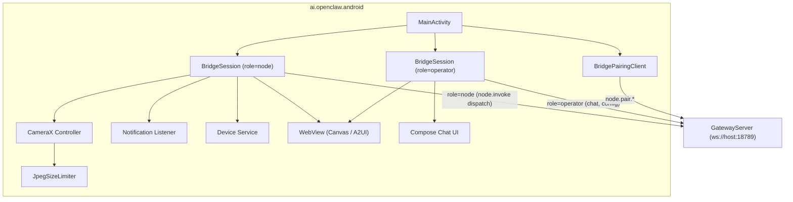
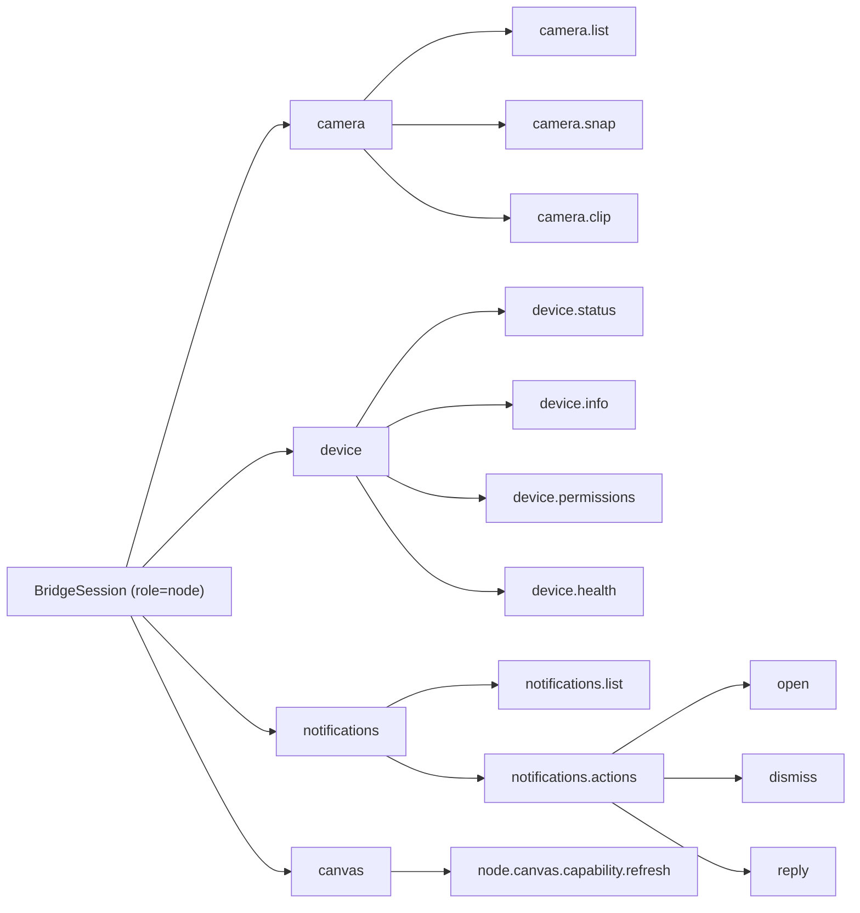

# Android Client

Relevant source files

The following files were used as context for generating this wiki page:

- [.npmrc](.npmrc)
- [apps/android/app/build.gradle.kts](apps/android/app/build.gradle.kts)
- [apps/ios/ShareExtension/Info.plist](apps/ios/ShareExtension/Info.plist)
- [apps/ios/Sources/Info.plist](apps/ios/Sources/Info.plist)
- [apps/ios/Tests/Info.plist](apps/ios/Tests/Info.plist)
- [apps/ios/WatchApp/Info.plist](apps/ios/WatchApp/Info.plist)
- [apps/ios/WatchExtension/Info.plist](apps/ios/WatchExtension/Info.plist)
- [apps/ios/project.yml](apps/ios/project.yml)
- [apps/macos/Sources/OpenClaw/Resources/Info.plist](apps/macos/Sources/OpenClaw/Resources/Info.plist)
- [docs/platforms/mac/release.md](docs/platforms/mac/release.md)
- [extensions/diagnostics-otel/package.json](extensions/diagnostics-otel/package.json)
- [extensions/discord/package.json](extensions/discord/package.json)
- [extensions/memory-lancedb/package.json](extensions/memory-lancedb/package.json)
- [extensions/nostr/package.json](extensions/nostr/package.json)
- [package.json](package.json)
- [pnpm-lock.yaml](pnpm-lock.yaml)
- [pnpm-workspace.yaml](pnpm-workspace.yaml)
- [ui/package.json](ui/package.json)

The Android client (`ai.openclaw.android`) is the Android device node for OpenClaw. Located at `apps/android/`, it connects to the Gateway via WebSocket in the `node` role, registers device capabilities (camera, device status, notifications, canvas), and hosts a native Compose-based chat UI and WebView canvas for A2UI interaction.

This page covers the Android app's connection architecture, pairing flow, node capabilities, image handling, and build configuration. For the equivalent iOS client, see [6.1](#6.1). For the macOS client, see [6.2](#6.2). For the shared node role protocol and Bridge connection model, see [6](#6).

---

## Architecture Overview

The app maintains two concurrent WebSocket connections to the Gateway — one in the `node` role and one in the `operator` role — both managed by `BridgeSession` instances. The `node` connection handles capability advertisement and `node.invoke` dispatch. The `operator` connection is used for chat, config, and canvas RPCs. Initial device pairing is handled by `BridgePairingClient`.

**Android App Component Map**

Sources: [apps/android/app/build.gradle.kts](), [CHANGELOG.md:11-12](), [CHANGELOG.md:141-141]()

---

## BridgeSession

`BridgeSession` manages a single WebSocket connection to the Gateway. Two instances are created at app startup, one per role:

| Instance         | Role       | Responsibilities                                                        |
| ---------------- | ---------- | ----------------------------------------------------------------------- |
| node session     | `node`     | Advertises capabilities, receives and dispatches `node.invoke` commands |
| operator session | `operator` | Issues chat, config, and canvas RPCs on behalf of the local user        |

The WebSocket transport uses OkHttp3. An earlier bug where OkHttp added a native `Origin` header caused Gateway rejection; this was corrected by explicitly removing the header from the connection setup.

Device identity is derived from a keypair. The keypair is stored using `androidx.security:security-crypto` (encrypted SharedPreferences), and Bouncycastle (`bcprov-jdk18on`) provides the underlying cryptographic primitives for key generation and signing during the `connect.challenge` / `hello-ok` handshake.

Sources: [apps/android/app/build.gradle.kts:124-127](), [CHANGELOG.md:141-141]()

---

## BridgePairingClient

`BridgePairingClient` implements the device pairing approval flow. When an Android node first connects, a pending pairing request is stored on the Gateway and the operator must approve it via CLI or UI before the node is granted its auth token. This follows the `node.pair.*` protocol described in [2.2](#2.2).

QR code scanning for initial setup uses ZXing (`zxing-android-embedded`). The user scans a setup code displayed by the Gateway or CLI output to bootstrap the connection without manually entering credentials.

Sources: [apps/android/app/build.gradle.kts:139-140](), [CHANGELOG.md:141-141]()

---

## Node Capabilities

When the `node`-role `BridgeSession` connects, it advertises a set of capabilities to the Gateway. The Gateway can then call these via `node.invoke`. The capability set has grown across recent releases.

**Android Node Capability Tree**

Sources: [CHANGELOG.md:11-12](), [CHANGELOG.md:40-42](), [CHANGELOG.md:59-60]()

### Camera

Camera commands use the CameraX library suite (`camera-core`, `camera-camera2`, `camera-lifecycle`, `camera-video`, `camera-view`).

| Command       | Description               | Notes                                       |
| ------------- | ------------------------- | ------------------------------------------- |
| `camera.list` | List available cameras    | Returns device IDs and facing info          |
| `camera.snap` | Capture a still photo     | Output is size-limited by `JpegSizeLimiter` |
| `camera.clip` | Record a short video clip | Binary upload; no base64 fallback           |

Behavioral constraints:

- `facing=both` is rejected when `deviceId` is also specified, to prevent mislabeled duplicate captures.
- `maxWidth` must be a positive integer; non-positive values fall back to the safe resize default.
- `camera.clip` uses deterministic binary upload transport. The base64 fallback was removed to make transport failures explicit.
- The invoke-result acknowledgement timeout is scaled to the full invoke budget to accommodate large clip payloads.

Sources: [apps/android/app/build.gradle.kts:134-139](), [CHANGELOG.md:40-41]()

### Device

| Command              | Description                                         |
| -------------------- | --------------------------------------------------- |
| `device.status`      | Current device status (battery, connectivity, etc.) |
| `device.info`        | Static device metadata (model, OS version)          |
| `device.permissions` | Runtime permission grant states                     |
| `device.health`      | Device health diagnostics                           |

Sources: [CHANGELOG.md:11-11](), [CHANGELOG.md:59-59]()

### Notifications

| Command                         | Action                     | Notes                               |
| ------------------------------- | -------------------------- | ----------------------------------- |
| `notifications.list`            | List active notifications  | Returns notification metadata array |
| `notifications.actions open`    | Open/launch a notification | Permitted on non-clearable entries  |
| `notifications.actions dismiss` | Dismiss a notification     | Gated: only clearable notifications |
| `notifications.actions reply`   | Send an inline reply       | Permitted on non-clearable entries  |

The notification listener is rebound immediately before executing any notification action to ensure the action targets the current live state.

Sources: [CHANGELOG.md:11-11](), [CHANGELOG.md:40-40](), [CHANGELOG.md:60-60]()

### Canvas and A2UI

The Android node supports the canvas capability. The WebView is hosted via `androidx.webkit:webkit`. The Gateway pushes a URL to the node; the node loads it in the WebView and executes A2UI interactions.

Key behaviors:

- `node.canvas.capability.refresh` is sent with empty object params (`{}`) to signal A2UI readiness and to recover after a scoped capability expiry. The Gateway validates that `params` is an object (not `null`), so sending `{}` rather than nothing is required for schema compliance.
- Canvas URLs are normalized by scope before being loaded.
- A2UI readiness is verified by polling for the `openclawA2UI` host object in the WebView JavaScript context, with retries on load delay.
- A debug diagnostics JSON endpoint can be enabled at runtime for canvas troubleshooting.

Sources: [apps/android/app/build.gradle.kts:106-106](), [CHANGELOG.md:12-12](), [CHANGELOG.md:42-42]()

---

## JpegSizeLimiter

`JpegSizeLimiter` enforces maximum dimension and byte-size constraints on JPEG images produced by camera commands before they are transmitted to the Gateway. This prevents oversized payloads from overwhelming the WebSocket transport or Gateway processing.

Key rules enforced by `JpegSizeLimiter`:

- Non-positive `maxWidth` values are rejected at the call site; a safe resize default is used instead.
- EXIF metadata is handled via `androidx.exifinterface:exifinterface` to preserve or strip orientation data during resize.

Sources: [apps/android/app/build.gradle.kts:125-125](), [CHANGELOG.md:40-42]()

---

## Chat UI

The native Android chat interface is built with Jetpack Compose and driven by the `operator`-role `BridgeSession`. Streaming partial replies are assembled incrementally before being rendered.

Markdown rendering uses the CommonMark library suite:

| Library                            | Purpose                                |
| ---------------------------------- | -------------------------------------- |
| `commonmark`                       | Core CommonMark block/inline parsing   |
| `commonmark-ext-autolink`          | Automatic URL and email linkification  |
| `commonmark-ext-gfm-strikethrough` | GitHub Flavored Markdown strikethrough |
| `commonmark-ext-gfm-tables`        | GFM table rendering                    |
| `commonmark-ext-task-list-items`   | Task list checkbox items               |

Sources: [apps/android/app/build.gradle.kts:128-133](), [CHANGELOG.md:152-153]()

---

## Build Configuration

The app module is at `apps/android/app/` and built with Gradle Kotlin DSL.

### Module Identity

| Property       | Value                                       |
| -------------- | ------------------------------------------- |
| Application ID | `ai.openclaw.android`                       |
| `compileSdk`   | 36                                          |
| `minSdk`       | 31 (Android 12)                             |
| `targetSdk`    | 36                                          |
| `versionName`  | `2026.2.27` (matches monorepo version)      |
| `versionCode`  | `202602270`                                 |
| Supported ABIs | `armeabi-v7a`, `arm64-v8a`, `x86`, `x86_64` |

APK output files are named `openclaw-{versionName}-{buildType}.apk` via a custom `androidComponents.onVariants` hook [apps/android/app/build.gradle.kts:78-89]().

Release builds enable both minification and resource shrinking (`isMinifyEnabled = true`, `isShrinkResources = true`). Debug builds have both disabled.

The app shares resource assets with the cross-platform `OpenClawKit` library by adding `../../shared/OpenClawKit/Sources/OpenClawKit/Resources` to the `main` source set's asset directories [apps/android/app/build.gradle.kts:13-17]().

### Key Runtime Dependencies

| Dependency                                                                             | Version    | Role                                         |
| -------------------------------------------------------------------------------------- | ---------- | -------------------------------------------- |
| `okhttp3:okhttp`                                                                       | 5.3.2      | WebSocket transport (`BridgeSession`)        |
| `bouncycastle:bcprov-jdk18on`                                                          | 1.83       | Device identity keypairs                     |
| `security-crypto`                                                                      | 1.1.0      | Encrypted credential storage                 |
| `webkit`                                                                               | 1.15.0     | Canvas / A2UI WebView                        |
| `dnsjava:dnsjava`                                                                      | 3.6.4      | Unicast DNS-SD for tailnet gateway discovery |
| `camera-core` / `camera-camera2` / `camera-lifecycle` / `camera-video` / `camera-view` | 1.5.2      | CameraX for camera capability                |
| `zxing-android-embedded`                                                               | 4.3.0      | QR code scan for pairing setup               |
| `commonmark` + extensions                                                              | 0.27.1     | Chat markdown rendering                      |
| `kotlinx-serialization-json`                                                           | 1.10.0     | JSON serialization                           |
| `exifinterface`                                                                        | 1.4.2      | Image EXIF metadata handling                 |
| Compose BOM                                                                            | 2026.02.00 | Native UI framework                          |

Sources: [apps/android/app/build.gradle.kts:98-151]()

---

## Development Commands

The root `package.json` exposes npm scripts for common Android tasks:

| Script                     | Underlying Command                                                         | Description                         |
| -------------------------- | -------------------------------------------------------------------------- | ----------------------------------- |
| `android:assemble`         | `./gradlew :app:assembleDebug`                                             | Build debug APK                     |
| `android:install`          | `./gradlew :app:installDebug`                                              | Install on connected ADB device     |
| `android:run`              | `installDebug` + `adb shell am start -n ai.openclaw.android/.MainActivity` | Install and launch                  |
| `android:test`             | `./gradlew :app:testDebugUnitTest`                                         | Run unit tests                      |
| `android:test:integration` | `vitest run ... android-node.capabilities.live.test.ts`                    | Gateway-side live integration tests |

The integration test suite is located at `src/gateway/android-node.capabilities.live.test.ts` in the Node.js gateway codebase and requires a connected Android device. It is gated by the environment variables `OPENCLAW_LIVE_TEST=1` and `OPENCLAW_LIVE_ANDROID_NODE=1`.

Sources: [package.json:50-54]()
