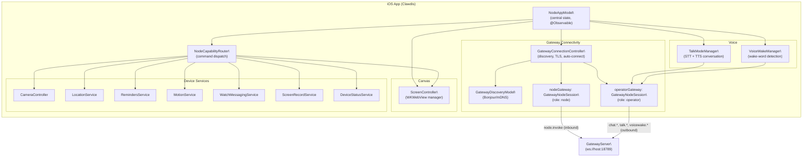
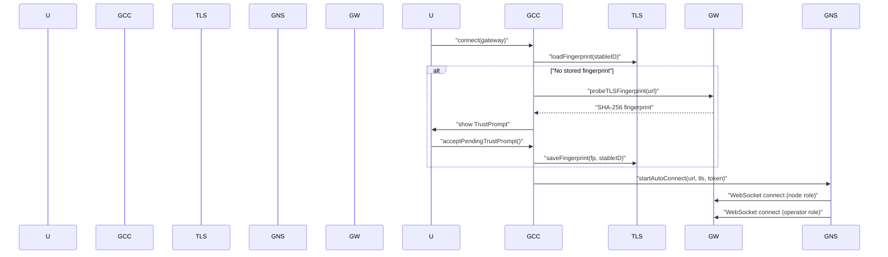
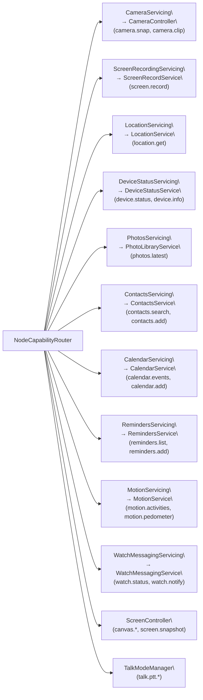
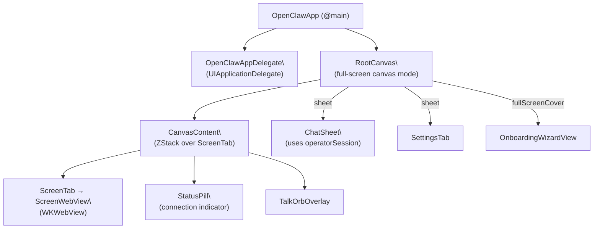

# iOS Client

<details>
<summary>Relevant source files</summary>

The following files were used as context for generating this wiki page:

- [.npmrc](.npmrc)
- [apps/android/app/build.gradle.kts](apps/android/app/build.gradle.kts)
- [apps/ios/ShareExtension/Info.plist](apps/ios/ShareExtension/Info.plist)
- [apps/ios/Sources/Info.plist](apps/ios/Sources/Info.plist)
- [apps/ios/Tests/Info.plist](apps/ios/Tests/Info.plist)
- [apps/ios/WatchApp/Info.plist](apps/ios/WatchApp/Info.plist)
- [apps/ios/WatchExtension/Info.plist](apps/ios/WatchExtension/Info.plist)
- [apps/ios/project.yml](apps/ios/project.yml)
- [apps/macos/Sources/OpenClaw/Resources/Info.plist](apps/macos/Sources/OpenClaw/Resources/Info.plist)
- [docs/platforms/mac/release.md](docs/platforms/mac/release.md)
- [extensions/diagnostics-otel/package.json](extensions/diagnostics-otel/package.json)
- [extensions/discord/package.json](extensions/discord/package.json)
- [extensions/memory-lancedb/package.json](extensions/memory-lancedb/package.json)
- [extensions/nostr/package.json](extensions/nostr/package.json)
- [package.json](package.json)
- [pnpm-lock.yaml](pnpm-lock.yaml)
- [pnpm-workspace.yaml](pnpm-workspace.yaml)
- [ui/package.json](ui/package.json)

</details>

This page documents the iOS Clawdis app: its internal architecture, how it connects to the OpenClaw Gateway, and the device capability services it exposes. The app's primary role is to function as a "node" client, registering device hardware (camera, location, microphone, etc.) with the gateway so agents can invoke them.

For the Gateway WebSocket protocol the app speaks, see [2.1](#2.1). For the node pairing approval flow, see [2.2](#2.2). For macOS and Android clients, see [6.2](#6.2) and [6.3](#6.3).

---

## Architecture Overview

The iOS app establishes **two simultaneous WebSocket connections** to the gateway, each with a distinct role:

| Connection        | Role       | Purpose                                                                    |
| ----------------- | ---------- | -------------------------------------------------------------------------- |
| `nodeGateway`     | `node`     | Receives `node.invoke` commands from agents; registers device capabilities |
| `operatorGateway` | `operator` | Issues chat, talk, config, and voicewake RPC calls to the gateway          |

Both are instances of `GatewayNodeSession` held by `NodeAppModel`.

**Architecture of the iOS client**



Sources: [apps/ios/Sources/Model/NodeAppModel.swift:95-116](), [apps/ios/Sources/Gateway/GatewayConnectionController.swift:19-57]()

---

## NodeAppModel

`NodeAppModel` ([apps/ios/Sources/Model/NodeAppModel.swift:50-217]()) is the central `@Observable` class for the iOS app. It is created once and injected into the SwiftUI environment.

**Responsibilities:**

- Holds the two `GatewayNodeSession` instances (`nodeGateway`, `operatorGateway`)
- Manages connection lifecycle: connect, disconnect, health monitoring, background suppression
- Owns `VoiceWakeManager`, `TalkModeManager`, and `ScreenController`
- Builds the `NodeCapabilityRouter` which dispatches inbound `BridgeInvokeRequest` commands
- Handles deep links (`openclaw://agent?...`), canvas A2UI actions, push wake events, and Apple Watch quick replies
- Tracks observable state used by the SwiftUI views: `gatewayStatusText`, `gatewayServerName`, `seamColorHex`, `cameraHUDKind`, etc.

**Capability routing** is implemented via the lazily initialized `capabilityRouter: NodeCapabilityRouter`. All inbound `node.invoke` requests arrive on `nodeGateway` and are passed to `handleInvoke(_:)`, which applies background and permission guards before delegating to the router.

```
handleInvoke(_:)
  ↓ background check (canvas/camera/screen/talk blocked)
  ↓ camera.enabled check
  ↓ capabilityRouter.handle(req)
    ↓ routes by req.command prefix
```

Sources: [apps/ios/Sources/Model/NodeAppModel.swift:709-755]()

---

## GatewayConnectionController

`GatewayConnectionController` ([apps/ios/Sources/Gateway/GatewayConnectionController.swift:21-57]()) manages gateway discovery and connection setup.

**Discovery**

The controller uses `GatewayDiscoveryModel` for Bonjour/mDNS discovery on the local network. When gateways appear, it calls `maybeAutoConnect()`, which respects:

- `gateway.autoconnect` (UserDefaults)
- `gateway.preferredStableID` (previously connected gateway)
- Stored TLS fingerprint (auto-connect only connects to previously trusted gateways)

**TLS trust model**

The app uses a TOFU (Trust On First Use) model with certificate pinning by SHA-256 fingerprint. On first connection to a new gateway:

1. The controller probes the TLS endpoint via `probeTLSFingerprint(url:)`.
2. A `TrustPrompt` is shown to the user (displayed via `.gatewayTrustPromptAlert()` SwiftUI modifier).
3. On acceptance, the fingerprint is stored via `GatewayTLSStore.saveFingerprint(_:stableID:)`.
4. Subsequent connections verify against the stored fingerprint without re-prompting.

**Connection flow**

**Gateway connection and TLS trust flow**



Sources: [apps/ios/Sources/Gateway/GatewayConnectionController.swift:90-155](), [apps/ios/Sources/Gateway/GatewayConnectionController.swift:241-277]()

---

## TalkModeManager

`TalkModeManager` ([apps/ios/Sources/Voice/TalkModeManager.swift:16-103]()) implements two-way voice conversation with the agent.

**Speech-to-text (STT)**: Uses `SFSpeechRecognizer` with `AVAudioEngine`. Audio is tapped from the microphone, fed into an `SFSpeechAudioBufferRecognitionRequest`, and results are emitted as partial or final transcripts.

**Text-to-speech (TTS)**: Handled by the gateway via ElevenLabs. Configuration (`apiKey`, `voiceId`, `modelId`) is fetched from the gateway on connect. Streaming audio is played via `PCMStreamingAudioPlayer` (PCM) or `StreamingAudioPlayer` (MP3).

**Capture modes:**

| Mode         | Enum case     | Description                                |
| ------------ | ------------- | ------------------------------------------ |
| Idle         | `.idle`       | No active capture                          |
| Continuous   | `.continuous` | Always-on listening with silence detection |
| Push-to-talk | `.pushToTalk` | Single utterance capture                   |

**Key methods:**

| Method                                               | Description                                                                     |
| ---------------------------------------------------- | ------------------------------------------------------------------------------- |
| `start()`                                            | Enters continuous capture mode, requests permissions, subscribes to chat events |
| `stop()`                                             | Cleans up all audio resources and chat subscriptions                            |
| `beginPushToTalk()`                                  | Starts a single PTT capture, returns `OpenClawTalkPTTStartPayload`              |
| `endPushToTalk()`                                    | Stops PTT, sends transcript to gateway, returns `OpenClawTalkPTTStopPayload`    |
| `suspendForBackground(keepActive:)`                  | Releases mic; optionally keeps listening in background                          |
| `resumeAfterBackground(wasSuspended:wasKeptActive:)` | Restores capture state                                                          |

**Silence detection**: A `silenceTask` polling every 200ms checks `lastAudioActivity` and `lastHeard`. If both fall outside `silenceWindow` (0.9 s), the current transcript is processed and sent to the gateway.

**Noise floor calibration**: The first 22 audio samples calibrate `noiseFloor`. The VAD threshold is clamped to `[0.12, 0.35]` above the measured floor.

**Microphone coordination**: `TalkModeManager` and `VoiceWakeManager` compete for the same microphone. When talk mode is enabled, `NodeAppModel.setTalkEnabled(_:)` calls `voiceWake.setSuppressedByTalk(true)` and suspends voice wake capture.

Sources: [apps/ios/Sources/Voice/TalkModeManager.swift:1-340]()

---

## VoiceWakeManager

`VoiceWakeManager` ([apps/ios/Sources/Voice/VoiceWakeManager.swift:83-213]()) runs continuous always-on wake-word detection using `SFSpeechRecognizer`.

Audio buffers are enqueued into `AudioBufferQueue` (a thread-safe ring buffer) via an `AVAudioEngine` tap. A `tapDrainTask` drains the queue every 40ms and appends buffers to the recognition request.

Wake-word matching is delegated to `WakeWordGate.match(transcript:segments:config:)` from `SwabbleKit`. The active trigger words come from `VoiceWakePreferences` (stored in `UserDefaults`), kept in sync with the gateway via the `voicewake.changed` server event.

On a match, the command text is sent to the gateway via `NodeAppModel.sendVoiceTranscript(text:sessionKey:)` on the operator session.

**State transitions:**

- `setEnabled(true)` → `start()` → requests mic + speech permissions → `startRecognition()` → `isListening = true`
- `suspendForExternalAudioCapture()` → pauses recognition, releases `AVAudioSession`
- `resumeAfterExternalAudioCapture(wasSuspended:)` → calls `start()` if was suspended
- On recognition error → restarts after 700ms delay

Sources: [apps/ios/Sources/Voice/VoiceWakeManager.swift:83-270]()

---

## ScreenController

`ScreenController` ([apps/ios/Sources/Screen/ScreenController.swift:8-374]()) manages the single `WKWebView` that forms the primary visual surface of the app.

**Canvas modes:**

| Mode                      | `urlString` | Scroll behavior                  |
| ------------------------- | ----------- | -------------------------------- |
| Default canvas (scaffold) | `""`        | Disabled (raw touch passthrough) |
| External URL              | non-empty   | Enabled                          |

The default canvas loads `CanvasScaffold/scaffold.html` from the `OpenClawKit` bundle.

**Security**: Loopback URLs (`localhost`, `127.x.x.x`, `::1`) received from the gateway are silently redirected to the default canvas. Local network URLs (LAN IPs, `.local`, `.ts.net`, `.tailscale.net`, Tailscale CGNAT `100.64/10`) are permitted.

**Key operations:**

| Method                                     | Description                                                                  |
| ------------------------------------------ | ---------------------------------------------------------------------------- |
| `navigate(to:)`                            | Loads a URL in the web view, or shows default canvas for empty/loopback URLs |
| `showDefaultCanvas()`                      | Resets to scaffold HTML                                                      |
| `eval(javaScript:)`                        | Evaluates JS via `WKWebView.evaluateJavaScript`, async/await wrapper         |
| `snapshotBase64(maxWidth:format:quality:)` | Takes a `WKSnapshotConfiguration` snapshot, returns base64 PNG or JPEG       |
| `waitForA2UIReady(timeoutMs:)`             | Polls `globalThis.openclawA2UI.applyMessages` until ready                    |

**A2UI actions**: Button clicks inside the canvas post a `userAction` message that is intercepted by `ScreenWebView` and forwarded to `NodeAppModel.handleCanvasA2UIAction(body:)`. This method packages the action as an agent message and sends it via `sendAgentRequest(link:)`.

Sources: [apps/ios/Sources/Screen/ScreenController.swift:1-374]()

---

## Device Services

Each capability is backed by a protocol and a concrete implementation. `GatewayConnectionController` enumerates the currently enabled capabilities when building the connection options.

**Device service protocol map**



Sources: [apps/ios/Sources/Services/NodeServiceProtocols.swift:1-103]()

**Capability summary table:**

| Capability         | Protocol                   | Command prefix    | iOS permission                                                    |
| ------------------ | -------------------------- | ----------------- | ----------------------------------------------------------------- |
| Camera photo/video | `CameraServicing`          | `camera.*`        | NSCameraUsageDescription                                          |
| Screen recording   | `ScreenRecordingServicing` | `screen.record`   | ReplayKit                                                         |
| GPS location       | `LocationServicing`        | `location.get`    | NSLocationWhenInUseUsageDescription                               |
| Photos library     | `PhotosServicing`          | `photos.latest`   | NSPhotoLibraryUsageDescription                                    |
| Contacts           | `ContactsServicing`        | `contacts.*`      | NSContactsUsageDescription                                        |
| Calendar           | `CalendarServicing`        | `calendar.*`      | NSCalendarsUsageDescription                                       |
| Reminders          | `RemindersServicing`       | `reminders.*`     | NSRemindersUsageDescription                                       |
| Motion/pedometer   | `MotionServicing`          | `motion.*`        | NSMotionUsageDescription                                          |
| Apple Watch        | `WatchMessagingServicing`  | `watch.*`         | WatchConnectivity                                                 |
| Canvas web view    | `ScreenController`         | `canvas.*`        | —                                                                 |
| Voice STT/TTS      | `TalkModeManager`          | `talk.ptt.*`      | NSMicrophoneUsageDescription, NSSpeechRecognitionUsageDescription |
| Wake word          | `VoiceWakeManager`         | — (outbound only) | same as above                                                     |

**Background restrictions**: Commands with prefixes `canvas.*`, `camera.*`, `screen.*`, and `talk.*` return a `backgroundUnavailable` error when `isBackgrounded == true`. Location commands additionally require `Always` authorization when backgrounded.

Sources: [apps/ios/Sources/Model/NodeAppModel.swift:757-760](), [apps/ios/Sources/Services/NodeServiceProtocols.swift:1-103]()

---

## Background and Foreground Lifecycle

`NodeAppModel.setScenePhase(_:)` is called by the SwiftUI `onChange(of: scenePhase)` handler.

**Background transition:**

1. `isBackgrounded = true`
2. Gateway health monitor stopped
3. 25-second `UIBackgroundTask` started (`beginBackgroundConnectionGracePeriod`)
4. Voice wake and talk mode mic released (`suspendForExternalAudioCapture`)
5. After grace period, `suppressBackgroundReconnect` disconnects both WebSocket sessions and sets status to "Background idle"
6. Optional background listening: if `talk.background.enabled` is set, talk mode is kept active

**Foreground transition:**

1. Grace period cancelled
2. Background suppression cleared
3. Health monitor restarted if operator is connected
4. If backgrounded for ≥ 3 seconds: health check sent (`health` RPC, 2s timeout); if unhealthy, both sessions are disconnected and the reconnect loop handles re-connect
5. Mic restored for voice wake and talk mode

Silent APNs push wakes are handled by `OpenClawAppDelegate.application(_:didReceiveRemoteNotification:fetchCompletionHandler:)`, which calls `NodeAppModel.handleSilentPushWake(_:)`. A `BGAppRefreshTask` is also scheduled for periodic wake-up.

Sources: [apps/ios/Sources/Model/NodeAppModel.swift:297-369](), [apps/ios/Sources/OpenClawApp.swift:75-155]()

---

## Onboarding and Settings

**First-run flow** is managed by `OnboardingWizardView` ([apps/ios/Sources/Onboarding/OnboardingWizardView.swift:45-]()). Steps:

| Step            | Enum case  | Content                 |
| --------------- | ---------- | ----------------------- |
| Welcome         | `.welcome` | Splash screen           |
| Connection mode | `.mode`    | Manual vs. setup code   |
| Connect         | `.connect` | Gateway list or QR scan |
| Authentication  | `.auth`    | Token/password entry    |
| Success         | `.success` | Confirmation            |

`RootCanvas.startupPresentationRoute(...)` determines whether to show onboarding, settings, or nothing on launch based on `hasConnectedOnce`, `onboardingComplete`, and the existence of a saved gateway config.

**Settings** (`SettingsTab`, [apps/ios/Sources/Settings/SettingsTab.swift:9-]()) exposes:

- Gateway section: setup code entry, discovered gateway list, manual host/port/TLS override, debug log view
- Device features: Voice Wake toggle, Talk Mode toggle, Background Listening, Wake Words, Camera, Location mode (`off`/`whileUsing`/`always`), Prevent Sleep
- Agent picker (selects which gateway agent the session key targets)
- Device info: display name, instance ID, platform string

Credentials (token, password) are stored per `instanceId` via `GatewaySettingsStore` (backed by the iOS keychain).

Sources: [apps/ios/Sources/Settings/SettingsTab.swift:61-509](), [apps/ios/Sources/RootCanvas.swift:48-67]()

---

## UI Structure

**Main view hierarchy**



The `ScreenTab` renders `ScreenWebView` (a `UIViewRepresentable` wrapping `WKWebView`). The coordinator class `ScreenWebViewCoordinator` calls `ScreenController.attachWebView(_:)` on appearance.

The `StatusPill` shows gateway connection state (`.connected`, `.connecting`, `.error`, `.disconnected`) with an animated pulsing dot while connecting, plus an activity slot that surfaces camera HUD, screen recording, pairing status, and voice wake state.

Sources: [apps/ios/Sources/RootCanvas.swift:69-263](), [apps/ios/Sources/Status/StatusPill.swift:1-140](), [apps/ios/Sources/Screen/ScreenTab.swift:1-27]()
