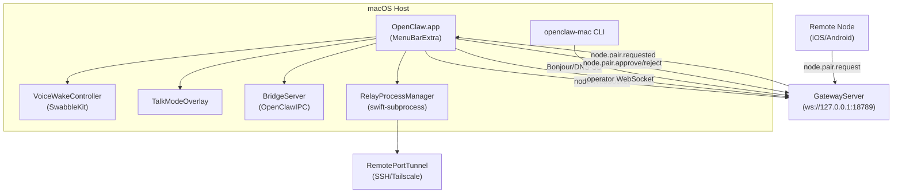
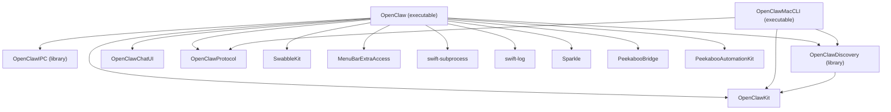
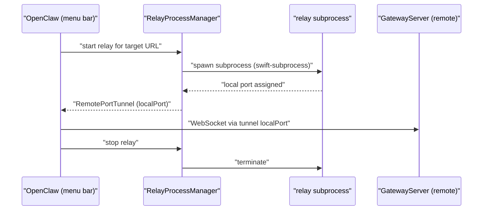
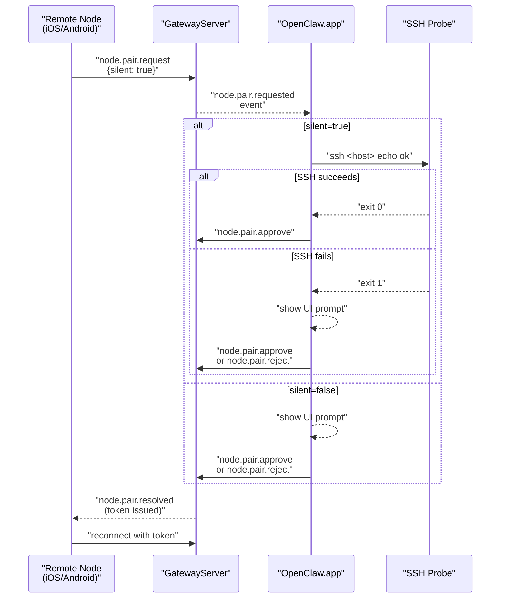
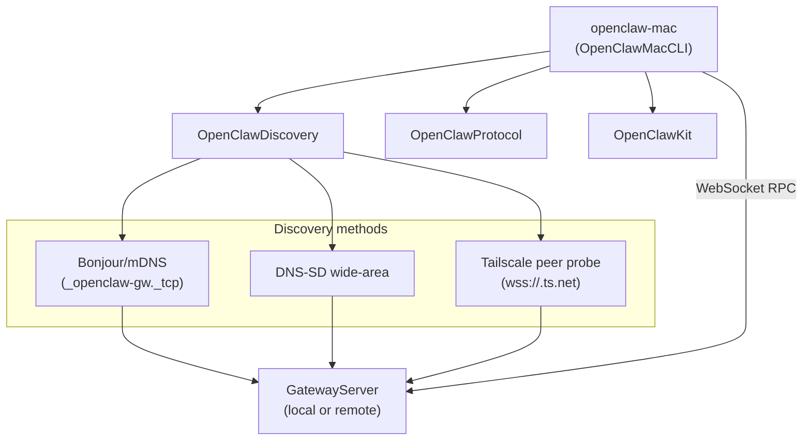
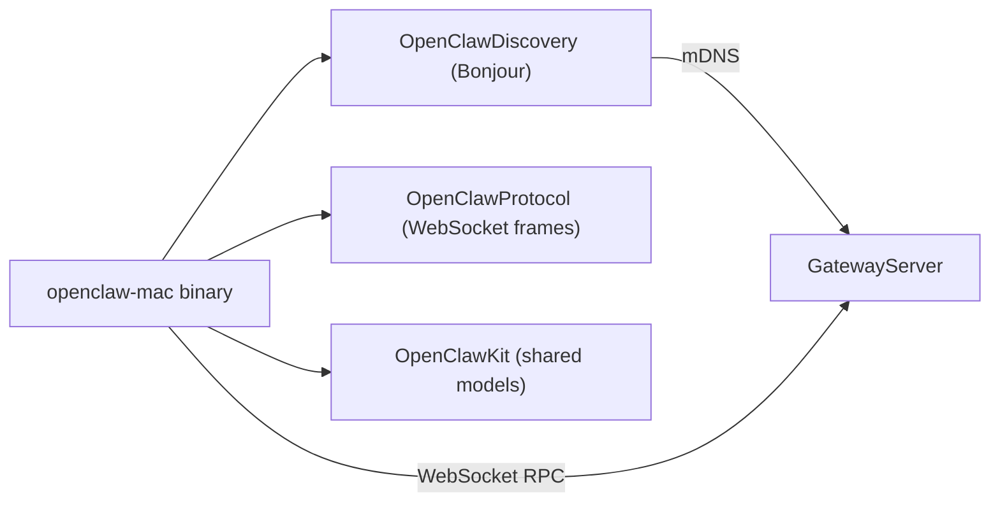

# macOS Client

Relevant source files

The following files were used as context for generating this wiki page:

- [.npmrc](.npmrc)
- [apps/android/app/build.gradle.kts](apps/android/app/build.gradle.kts)
- [apps/ios/ShareExtension/Info.plist](apps/ios/ShareExtension/Info.plist)
- [apps/ios/Sources/Info.plist](apps/ios/Sources/Info.plist)
- [apps/ios/Tests/Info.plist](apps/ios/Tests/Info.plist)
- [apps/ios/WatchApp/Info.plist](apps/ios/WatchApp/Info.plist)
- [apps/ios/WatchExtension/Info.plist](apps/ios/WatchExtension/Info.plist)
- [apps/ios/project.yml](apps/ios/project.yml)
- [apps/macos/Sources/OpenClaw/Resources/Info.plist](apps/macos/Sources/OpenClaw/Resources/Info.plist)
- [docs/platforms/mac/release.md](docs/platforms/mac/release.md)
- [extensions/diagnostics-otel/package.json](extensions/diagnostics-otel/package.json)
- [extensions/discord/package.json](extensions/discord/package.json)
- [extensions/memory-lancedb/package.json](extensions/memory-lancedb/package.json)
- [extensions/nostr/package.json](extensions/nostr/package.json)
- [package.json](package.json)
- [pnpm-lock.yaml](pnpm-lock.yaml)
- [pnpm-workspace.yaml](pnpm-workspace.yaml)
- [ui/package.json](ui/package.json)

The macOS client (`OpenClaw.app`) is a menu bar application that serves as both a Gateway control interface and a device node. It provides Voice Wake/push-to-talk, Talk Mode overlay, WebChat access, debug tools, and remote Gateway control via SSH tunnels and Tailscale discovery. The app is packaged as a Swift Package at `apps/macos/`.

Related pages: [iOS Client](#6.1), [Android Client](#6.3), [WebSocket Protocol & RPC](#2.1), [Authentication & Device Pairing](#2.2).

---

## Architecture Overview

The macOS app operates in dual mode:

1. **Node mode**: Connects to the Gateway as a device node, registers capabilities (screen automation, camera, canvas), and handles `node.invoke` requests.
2. **Operator mode**: Maintains a second WebSocket connection for chat, session management, and configuration RPC calls.

It also serves as a pairing approval surface: when iOS/Android nodes send `node.pair.request`, the macOS app presents Approve/Reject UI. Silent auto-approval is supported when the request includes `silent: true` and SSH connectivity to the Gateway host can be verified.

**Key features** (from README.md and CHANGELOG.md):

| Feature                | Purpose                                                  |
| ---------------------- | -------------------------------------------------------- |
| Menu bar control       | Gateway health, session list, agent picker               |
| Voice Wake / PTT       | Wake-word detection (`SwabbleKit`), push-to-talk overlay |
| Talk Mode              | Continuous voice interaction overlay                     |
| WebChat                | In-app browser-based chat UI                             |
| Debug tools            | Session inspector, capability testing                    |
| Remote Gateway control | SSH tunnel relay, Tailscale Serve/Funnel discovery       |
| Pairing approval       | Interactive/silent approval for remote nodes             |

Sources: [README.md:289-295](), [CHANGELOG.md:161](), [package.json:1-18]()

**Component interaction diagram**

Sources: [apps/macos/Package.swift:1-92](), [README.md:289-295](), [CHANGELOG.md:161]()

---

## Swift Package Structure

The macOS app is a standalone Swift Package (`apps/macos/Package.swift`) targeting macOS 15+. It produces four products:

| Product             | Kind       | Purpose                                                                                    |
| ------------------- | ---------- | ------------------------------------------------------------------------------------------ |
| `OpenClawIPC`       | library    | Local IPC protocol between the menu bar process and other processes (e.g., `BridgeServer`) |
| `OpenClawDiscovery` | library    | Bonjour/mDNS discovery of local Gateway instances                                          |
| `OpenClaw`          | executable | The menu bar app itself                                                                    |
| `openclaw-mac`      | executable | Headless CLI companion (`OpenClawMacCLI` target)                                           |

**Main app dependencies**

| Dependency                                 | Role in macOS app                                      |
| ------------------------------------------ | ------------------------------------------------------ |
| `MenuBarExtraAccess`                       | Menu bar window lifecycle and access management        |
| `swift-subprocess`                         | Powers `RelayProcessManager` for spawning subprocesses |
| `swift-log`                                | Structured logging                                     |
| `Sparkle`                                  | In-app auto-update                                     |
| `PeekabooBridge` / `PeekabooAutomationKit` | Screen automation capabilities exposed to the agent    |
| `OpenClawKit`                              | Shared models, bridge frames, capability definitions   |
| `OpenClawChatUI`                           | Shared chat UI components                              |
| `OpenClawProtocol`                         | Gateway WebSocket protocol frame types                 |
| `SwabbleKit`                               | Wake-word engine (same lib as iOS)                     |

Sources: [apps/macos/Package.swift:1-92](), [apps/macos/Package.resolved:1-132]()

**Package target dependency diagram**

Sources: [apps/macos/Package.swift:26-92]()

---

## Menu Bar Features

The main executable `OpenClaw` runs as a menu bar-resident application (no Dock icon). It leverages `MenuBarExtraAccess` for lifecycle management and presents a popover UI with the following surfaces:

| Surface             | Purpose                                              |
| ------------------- | ---------------------------------------------------- |
| Connection status   | Gateway reachability (connected/connecting/offline)  |
| Session list        | Active chat sessions, selectable for WebChat         |
| Agent picker        | Configured agents from `agents.list`                 |
| Pairing approvals   | Interactive prompts for `node.pair.requested` events |
| Voice Wake controls | Wake word on/off, push-to-talk activation            |
| Talk Mode toggle    | Enable continuous voice overlay                      |
| WebChat window      | In-app browser view of `http://127.0.0.1:18789/`     |
| Debug tools         | Session inspector, capability probe, log viewer      |
| Settings            | Gateway URL, auth token/password, node display name  |

**Dual WebSocket connections**:

1. **Node connection** (`node` role): Registers device capabilities via `node.describe`, handles `node.invoke` requests (screen automation, camera, canvas).
2. **Operator connection** (`operator` role): Handles `chat.send`, `sessions.list`, `config.get`, and other RPC methods.

Sources: [apps/macos/Package.swift:43-67](), [README.md:289-295](), [CHANGELOG.md:161]()

---

## BridgeServer and OpenClawIPC

`OpenClawIPC` is a zero-dependency Swift library that implements local inter-process communication. The main app hosts a `BridgeServer` that other local processes can connect to. This allows tools like the `openclaw-mac` CLI or spawned subprocesses managed by `RelayProcessManager` to communicate with the running app without going through the Gateway.

The IPC framing mirrors the Gateway's bridge frame format — the same `BridgeInvokeRequest` / `BridgeInvokeResponse` types defined in `OpenClawKit` are reused, so capability invocations from the Gateway flow through the same path as local IPC calls.

Sources: [apps/macos/Package.swift:27-31](), [apps/macos/Package.swift:79-90]()

---

## RelayProcessManager

`RelayProcessManager` uses `swift-subprocess` to spawn and supervise relay processes. A relay process provides a `RemotePortTunnel`: it forwards a local port to a remote Gateway endpoint, enabling the menu bar app to reach a Gateway that isn't on the local network without requiring a full VPN.

**Lifecycle**

Sources: [apps/macos/Package.swift:52-54]()

---

**Pairing sequence diagram**

Sources: [CHANGELOG.md:161]()

## openclaw-mac CLI

The `OpenClawMacCLI` target produces a standalone binary (`openclaw-mac`) for headless Gateway interaction. It reuses `OpenClawDiscovery` for Bonjour/DNS-SD discovery and speaks the Gateway WebSocket protocol via `OpenClawProtocol`.

**Use cases**:

| Scenario               | Example                                                          |
| ---------------------- | ---------------------------------------------------------------- |
| Scripted Gateway calls | `openclaw-mac call sessions.list`                                |
| CI/CD automation       | Trigger agent runs without the full app                          |
| Gateway discovery      | `openclaw-mac discover` (Bonjour/mDNS probe)                     |
| Tailscale peer probe   | Discover Gateway via `wss://<peer>.ts.net` (CHANGELOG.md #32860) |

**Architecture**: Pure command-line tool with no `OpenClawIPC` or UI dependencies. Uses `OpenClawDiscovery` for mDNS (`_openclaw-gw._tcp`) and DNS-SD wide-area lookups, including Tailscale Serve/Funnel endpoints.

---

## Device Capabilities

The macOS app registers node capabilities with the Gateway via `node.describe` after completing the `connect.challenge` handshake. Capabilities are exposed as `node.invoke` actions that the agent runtime can call through the `nodes` tool.

**macOS-specific capabilities**:

| Capability        | Implementation                               | Agent access                        |
| ----------------- | -------------------------------------------- | ----------------------------------- |
| `system.run`      | Command execution (bash/zsh)                 | `node.invoke action=system.run`     |
| `system.notify`   | macOS notification center                    | `node.invoke action=system.notify`  |
| Screen automation | `PeekabooBridge`, `PeekabooAutomationKit`    | `node.invoke action=screen.*`       |
| Screen capture    | Accessibility + Screen Recording permissions | `node.invoke action=screen.capture` |

**Shared capabilities** (also on iOS):

| Capability       | Implementation                | Agent access                     |
| ---------------- | ----------------------------- | -------------------------------- |
| Canvas rendering | `OpenClawKit` (web view)      | `canvas.*` tool actions          |
| Camera snap/clip | System camera APIs            | `node.invoke action=camera.*`    |
| Voice Wake       | `SwabbleKit` wake-word engine | Wake word triggers chat sessions |

**Permission model**: The macOS app tracks TCC (Transparency, Consent, and Control) permissions for Screen Recording, Accessibility, Camera, and Microphone. When a `node.invoke` action requires a missing permission, the response includes `PERMISSION_MISSING` with actionable guidance.

Sources: [apps/macos/Package.swift:43-67](), [README.md:240-252]()
</str>

<old_str>

## Node Pairing Approval

When a remote node (iOS, Android, etc.) attempts to pair with the Gateway, the Gateway emits a `node.pair.requested` event to all connected operator-role clients. The macOS app receives this event and presents an approval UI.

The pairing flow documented in `docs/gateway/pairing.md`:

1. Remote node connects and calls `node.pair.request`.
2. Gateway stores a pending request (expires after 5 minutes) and emits `node.pair.requested`.
3. macOS app receives the event and presents **Approve / Reject**.
4. If the request carries `silent: true`, the app can attempt **silent auto-approval** by verifying an SSH connection to the gateway host using the same local user. If SSH verification fails, it falls back to the interactive prompt.
5. On approval, the app calls `node.pair.approve`, which causes the Gateway to issue a fresh auth token to the node.
6. The Gateway emits `node.pair.resolved`.
   </old_str>
   <new_str>

## Pairing Approval Flow

When a remote node (iOS, Android) attempts to pair, the Gateway emits `node.pair.requested` to all connected operator clients. The macOS app presents an approval UI (or attempts silent auto-approval).

**Pairing sequence**:

1. Remote node connects and calls `node.pair.request { silent: true/false }`.
2. Gateway stores pending request (expires after 5 minutes), emits `node.pair.requested`.
3. macOS app receives event and evaluates approval mode:
   - **Silent mode** (`silent: true`): Attempt SSH connection verification to Gateway host. If SSH succeeds (same local user context), auto-approve. If SSH fails, fall back to interactive prompt.
   - **Interactive mode**: Present Approve/Reject UI with node metadata (device name, platform, requested capabilities).
4. On approval, macOS app calls `node.pair.approve`, Gateway issues fresh auth token.
5. Gateway emits `node.pair.resolved`, remote node receives token and reconnects.

**Silent approval logic** (introduced in CHANGELOG.md #32860):

- Requires `silent: true` in the pairing request.
- macOS app probes SSH connectivity: `ssh <gateway-host> echo ok`.
- If probe succeeds, approval is automatic (no user interaction).
- If probe fails (host unreachable, credentials missing), falls back to interactive prompt.

---

**openclaw-mac dependency diagram**

Sources: [apps/macos/Package.swift:69-78](), [CHANGELOG.md:161]()

Sources: [apps/macos/Package.swift:69-78]()

---

## Update Mechanism

The app integrates `Sparkle` (version 2.x) for automatic updates. Release artifacts are published and Sparkle's appcast mechanism handles update discovery and installation in the background. See [Releasing](#8.2) for the macOS release process.

Sources: [apps/macos/Package.swift:21](), [apps/macos/Package.resolved:46-56]()
