# Core Concepts

<details>
<summary>Relevant source files</summary>

The following files were used as context for generating this wiki page:

- [CHANGELOG.md](CHANGELOG.md)
- [README.md](README.md)
- [assets/avatar-placeholder.svg](assets/avatar-placeholder.svg)
- [docs/channels/index.md](docs/channels/index.md)
- [docs/cli/index.md](docs/cli/index.md)
- [docs/cli/memory.md](docs/cli/memory.md)
- [docs/cli/onboard.md](docs/cli/onboard.md)
- [docs/concepts/memory.md](docs/concepts/memory.md)
- [docs/concepts/multi-agent.md](docs/concepts/multi-agent.md)
- [docs/docs.json](docs/docs.json)
- [docs/gateway/configuration-reference.md](docs/gateway/configuration-reference.md)
- [docs/gateway/configuration.md](docs/gateway/configuration.md)
- [docs/gateway/index.md](docs/gateway/index.md)
- [docs/gateway/troubleshooting.md](docs/gateway/troubleshooting.md)
- [docs/index.md](docs/index.md)
- [docs/reference/wizard.md](docs/reference/wizard.md)
- [docs/start/getting-started.md](docs/start/getting-started.md)
- [docs/start/hubs.md](docs/start/hubs.md)
- [docs/start/onboarding.md](docs/start/onboarding.md)
- [docs/start/setup.md](docs/start/setup.md)
- [docs/start/wizard-cli-automation.md](docs/start/wizard-cli-automation.md)
- [docs/start/wizard-cli-reference.md](docs/start/wizard-cli-reference.md)
- [docs/start/wizard.md](docs/start/wizard.md)
- [docs/tools/skills-config.md](docs/tools/skills-config.md)
- [docs/tools/skills.md](docs/tools/skills.md)
- [docs/web/webchat.md](docs/web/webchat.md)
- [docs/zh-CN/channels/index.md](docs/zh-CN/channels/index.md)
- [extensions/bluebubbles/src/send-helpers.ts](extensions/bluebubbles/src/send-helpers.ts)
- [scripts/clawtributors-map.json](scripts/clawtributors-map.json)
- [scripts/update-clawtributors.ts](scripts/update-clawtributors.ts)
- [scripts/update-clawtributors.types.ts](scripts/update-clawtributors.types.ts)
- [src/agents/memory-search.test.ts](src/agents/memory-search.test.ts)
- [src/agents/memory-search.ts](src/agents/memory-search.ts)
- [src/agents/pi-embedded-runner/extensions.ts](src/agents/pi-embedded-runner/extensions.ts)
- [src/agents/pi-extensions/compaction-safeguard-runtime.ts](src/agents/pi-extensions/compaction-safeguard-runtime.ts)
- [src/agents/pi-extensions/compaction-safeguard.test.ts](src/agents/pi-extensions/compaction-safeguard.test.ts)
- [src/agents/pi-extensions/compaction-safeguard.ts](src/agents/pi-extensions/compaction-safeguard.ts)
- [src/agents/subagent-registry-cleanup.test.ts](src/agents/subagent-registry-cleanup.test.ts)
- [src/cli/memory-cli.test.ts](src/cli/memory-cli.test.ts)
- [src/cli/memory-cli.ts](src/cli/memory-cli.ts)
- [src/config/config.compaction-settings.test.ts](src/config/config.compaction-settings.test.ts)
- [src/config/schema.help.quality.test.ts](src/config/schema.help.quality.test.ts)
- [src/config/schema.help.ts](src/config/schema.help.ts)
- [src/config/schema.labels.ts](src/config/schema.labels.ts)
- [src/config/schema.ts](src/config/schema.ts)
- [src/config/types.agent-defaults.ts](src/config/types.agent-defaults.ts)
- [src/config/types.tools.ts](src/config/types.tools.ts)
- [src/config/types.ts](src/config/types.ts)
- [src/config/zod-schema.agent-defaults.ts](src/config/zod-schema.agent-defaults.ts)
- [src/config/zod-schema.agent-runtime.ts](src/config/zod-schema.agent-runtime.ts)
- [src/config/zod-schema.ts](src/config/zod-schema.ts)
- [src/memory/manager.ts](src/memory/manager.ts)

</details>

This page explains the fundamental building blocks of OpenClaw: **Gateway**, **Agents**, **Sessions**, **Channels**, **Workspaces**, **Tools**, **Skills**, **Memory**, and **Configuration**. Understanding these concepts is essential before diving into system architecture or specific subsystems.

For detailed architectural diagrams showing how these components interact, see [System Architecture](#1.3). For initial setup guidance, see [Getting Started](#1.1).

---

## Gateway: Central Control Plane

The **Gateway** is the single WebSocket RPC server that coordinates all OpenClaw activity. It runs as a persistent service and exposes a control plane at `ws://127.0.0.1:18789` (default port).

**Key responsibilities:**

- Manages channel connections (WhatsApp, Telegram, Discord, etc.)
- Routes inbound messages to appropriate agent sessions
- Handles authentication and authorization
- Serves the Control UI web dashboard
- Coordinates cron jobs and webhooks
- Maintains session state and transcripts

**Gateway lifecycle:**

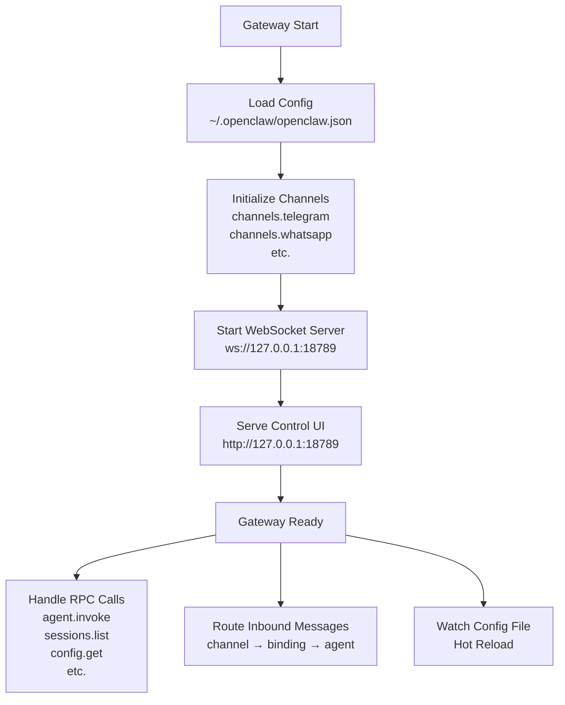

**Core Gateway files:**

- [src/gateway/gateway.ts]() - Main Gateway service class
- [src/gateway/rpc-server.ts]() - WebSocket RPC handler
- [src/gateway/control-ui.ts]() - HTTP UI server

**Gateway RPC methods:**

- `agent.invoke` - Execute agent turn
- `sessions.list` - Query sessions
- `config.get` / `config.patch` - Configuration management
- `gateway.status` - Health and diagnostics
- `cron.list` / `cron.add` - Job management

**Sources:** [README.md:187-202](), [docs/gateway/configuration.md:69-73](), [src/gateway/]()

---

## Agents: Execution Units

An **Agent** is an isolated execution context with its own workspace, session storage, model configuration, and tool policy. Agents process user messages and execute tools to generate responses.

**Agent runtime model:**

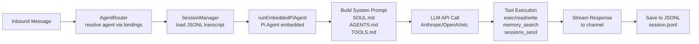

**Agent configuration schema:**

| Field                             | Purpose                              | Default                 |
| --------------------------------- | ------------------------------------ | ----------------------- |
| `agents.defaults.workspace`       | Root directory for agent files       | `~/.openclaw/workspace` |
| `agents.defaults.model.primary`   | Primary model ID                     | (none, must configure)  |
| `agents.defaults.model.fallbacks` | Fallback models on error             | `[]`                    |
| `agents.defaults.tools`           | Tool allowlist/denylist              | (all core tools)        |
| `agents.defaults.sandbox.mode`    | Sandboxing: `off`, `non-main`, `all` | `off`                   |
| `agents.list[]`                   | Per-agent overrides                  | (empty list)            |

**Multi-agent routing:**

Agents can be isolated by channel, account, peer, or custom binding rules. The router uses a 6-tier priority system:

1. **Peer-specific** - `match.peer.id` (e.g., WhatsApp `+15551234567`)
2. **Parent binding** - Inherited from parent agent
3. **Guild/group** - `match.guild.id` (Discord server, Telegram group)
4. **Account** - `match.account.id` (multi-account WhatsApp/Telegram)
5. **Channel** - `match.channel` (e.g., `telegram`)
6. **Default agent** - Agent with `default: true`

**Agent implementation:**

- [src/agents/agent-scope.ts]() - Agent resolution and workspace paths
- [src/agents/pi-embedded-runner.ts]() - Embedded Pi Agent execution
- [src/agents/agent-router.ts]() - Binding-based routing

**Sources:** [docs/gateway/configuration.md:111-133](), [src/config/types.agent-defaults.ts](), [README.md:314-331]()

---

## Sessions: Conversation State

A **Session** represents a single conversation thread with persistent state, stored as a JSONL transcript file.

**Session key structure:**

```
agent:<agentId>:<channel>:<mode>:<peerId>[:<threadId>]
```

Examples:

- `agent:main:telegram:direct:123456789` - Direct message on Telegram
- `agent:main:discord:guild:987654321:channel:555` - Discord channel
- `agent:main:whatsapp:group:123@g.us` - WhatsApp group

**Session lifecycle diagram:**

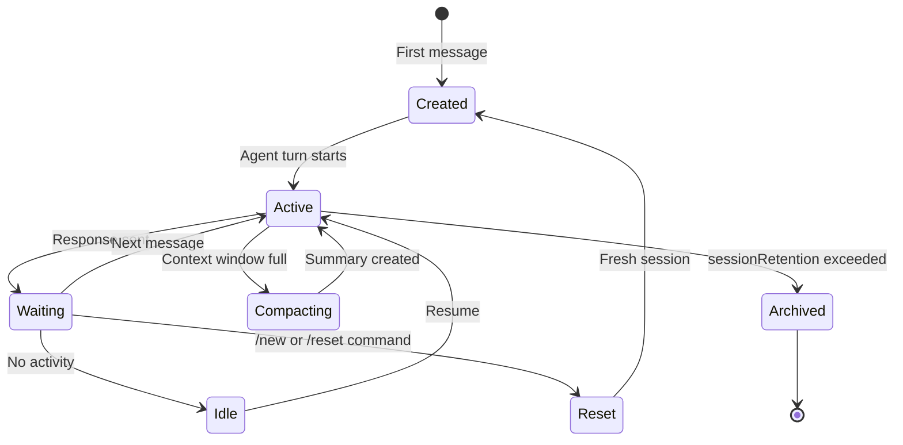

**Session storage:**

Sessions are stored as JSONL files under `~/.openclaw/agents/<agentId>/sessions/`:

- **Main session:** `main.jsonl` - Default direct message session
- **Channel sessions:** `<channel>-<accountId>-<peerId>.jsonl`
- **Group sessions:** `group-<channelId>.jsonl`

Each JSONL line is a turn object:

```json
{"role": "user", "content": "Hello", "timestamp": "2025-01-15T10:30:00Z"}
{"role": "assistant", "content": "Hi there!", "timestamp": "2025-01-15T10:30:05Z"}
```

**Session configuration:**

| Field                            | Purpose                | Default    |
| -------------------------------- | ---------------------- | ---------- |
| `session.dmScope`                | DM isolation level     | `main`     |
| `session.reset.mode`             | Auto-reset trigger     | `off`      |
| `session.reset.idleMinutes`      | Idle time before reset | (disabled) |
| `session.threadBindings.enabled` | Discord thread routing | `false`    |

**Session scoping modes:**

- `main` - Single shared session across all DMs
- `per-peer` - One session per sender (channel-agnostic)
- `per-channel-peer` - Isolate by both channel and sender
- `per-account-channel-peer` - Full isolation including account ID

**Sources:** [docs/concepts/session.md](), [src/config/sessions/](), [docs/gateway/configuration.md:178-204]()

---

## Channels: Messaging Integrations

**Channels** are plugin-based integrations with messaging platforms. Each channel runs as a subprocess or service within the Gateway.

**Built-in channels:**

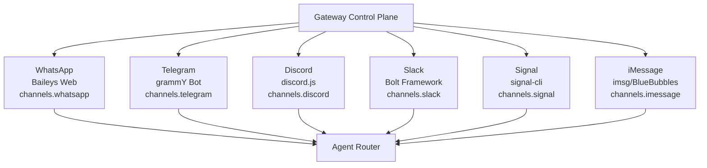

**Channel access control:**

All channels support DM and group policies:

| Policy              | Behavior                                     |
| ------------------- | -------------------------------------------- |
| `pairing` (default) | Unknown senders get one-time pairing code    |
| `allowlist`         | Only allow senders in `allowFrom` array      |
| `open`              | Accept all DMs (requires `allowFrom: ["*"]`) |
| `disabled`          | Ignore all DMs                               |

**Channel configuration pattern:**

```json5
{
  channels: {
    telegram: {
      enabled: true,
      botToken: '123:abc',
      dmPolicy: 'pairing',
      allowFrom: ['tg:123456789'],
      groups: {
        '*': { requireMention: true },
      },
    },
  },
}
```

**Channel plugin architecture:**

- [src/channels/registry.ts]() - Channel discovery and lifecycle
- [src/channels/plugins/]() - Per-channel implementations
- [src/channels/channel-manager.ts]() - Unified channel interface

**Sources:** [README.md:152-154](), [docs/gateway/configuration-reference.md:19-44](), [src/channels/]()

---

## Workspaces: Agent File Structure

A **Workspace** is the agent's working directory containing prompt files, memory, skills, and session state.

**Default workspace layout:**

```
~/.openclaw/workspace/          # agents.defaults.workspace
├── SOUL.md                     # Agent identity/personality
├── AGENTS.md                   # Multi-agent coordination rules
├── TOOLS.md                    # Tool usage guidelines
├── MEMORY.md                   # Long-term curated memory
├── memory/                     # Daily memory logs
│   ├── 2025-01-14.md
│   └── 2025-01-15.md
├── skills/                     # Workspace skills
│   ├── git-backup/
│   │   └── SKILL.md
│   └── image-gen/
│       └── SKILL.md
└── .openclaw/                  # Workspace metadata
    └── config.json
```

**Prompt injection flow:**

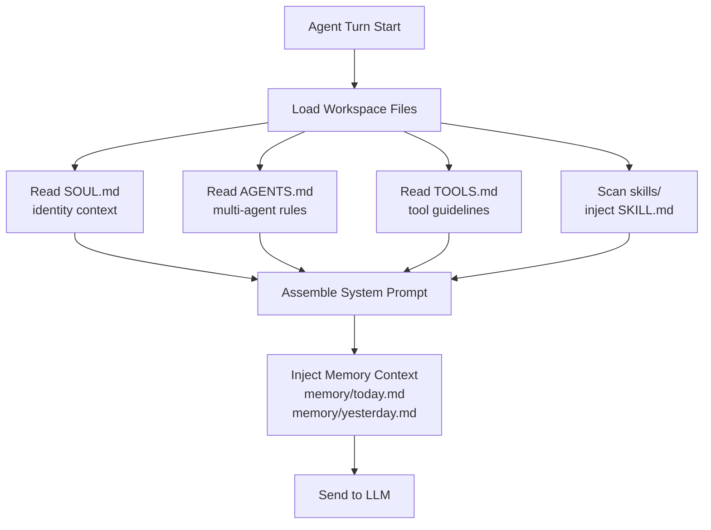

**Workspace resolution per agent:**

```typescript
// agents.defaults.workspace or agents.list[].workspace
resolveAgentWorkspaceDir(config, agentId)
  → ~/.openclaw/workspace  (default)
  → ~/work/agent-persona   (custom)
```

**Workspace configuration:**

| Field                        | Purpose               | Default                 |
| ---------------------------- | --------------------- | ----------------------- |
| `agents.defaults.workspace`  | Global workspace path | `~/.openclaw/workspace` |
| `agents.list[].workspace`    | Per-agent override    | (inherits default)      |
| `agents.defaults.promptMode` | System prompt size    | `full`                  |

**Sources:** [docs/concepts/agent-workspace.md](), [README.md:312-317](), [src/agents/agent-scope.ts:1-50]()

---

## Tools: Agent Capabilities

**Tools** are atomic functions that agents can invoke to interact with the system, filesystem, network, or external services.

**Core tool categories:**

```mermaid
graph TB
    Agent["Agent Runtime"] --> Exec["Execution Tools"]
    Agent --> Files["File Tools"]
    Agent --> Memory["Memory Tools"]
    Agent --> Sessions["Session Tools"]
    Agent --> Network["Network Tools"]
    Agent --> Platform["Platform Tools"]

    Exec --> exec["exec<br/>run bash commands"]
    Exec --> process["process<br/>background jobs"]

    Files --> read["read<br/>read files"]
    Files --> write["write<br/>write files"]
    Files --> edit["edit<br/>patch files"]

    Memory --> memory_search["memory_search<br/>semantic recall"]
    Memory --> memory_get["memory_get<br/>direct read"]

    Sessions --> sessions_list["sessions_list<br/>discover sessions"]
    Sessions --> sessions_send["sessions_send<br/>message another session"]
    Sessions --> sessions_spawn["sessions_spawn<br/>create subagent"]

    Network --> web_search["web_search<br/>Perplexity/Brave/etc."]
    Network --> browser["browser.*<br/>Chrome CDP control"]

    Platform --> canvas["canvas.*<br/>macOS/iOS UI"]
    Platform --> nodes["nodes.*<br/>device actions"]
```

**Tool execution policy:**

Tools are filtered through a multi-layered policy system:

1. **Gateway-level:** `gateway.tools.allow` / `gateway.tools.deny`
2. **Agent-level:** `agents.defaults.tools.allow` / `agents.defaults.tools.deny`
3. **Provider-level:** Per-model tool availability
4. **Group-level:** `channels.telegram.groups[].tools`
5. **Sandbox-level:** Sandbox tool restrictions
6. **Per-tool:** Individual tool policy overrides

**Tool policy precedence:**

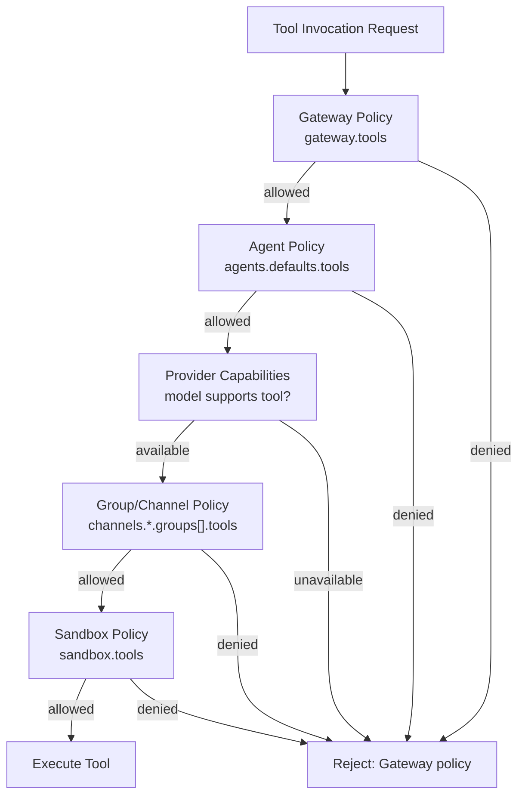

**Tool configuration:**

```json5
{
  agents: {
    defaults: {
      tools: {
        allow: ['exec', 'read', 'write', 'memory_search'],
        deny: ['browser', 'nodes'],
        profile: 'coding', // preset: coding, messaging, research
      },
    },
  },
}
```

**Tool implementation:**

- [src/tools/]() - Core tool implementations
- [src/tools/registry.ts]() - Tool discovery and registration
- [src/agents/tool-policy.ts]() - Policy enforcement

**Sources:** [docs/tools/](), [src/config/types.tools.ts](), [README.md:163-169]()

---

## Skills: Modular Tool Bundles

**Skills** are installable packages that provide additional tools, prompts, and configuration. Skills follow a three-tier precedence model.

**Skill precedence hierarchy:**

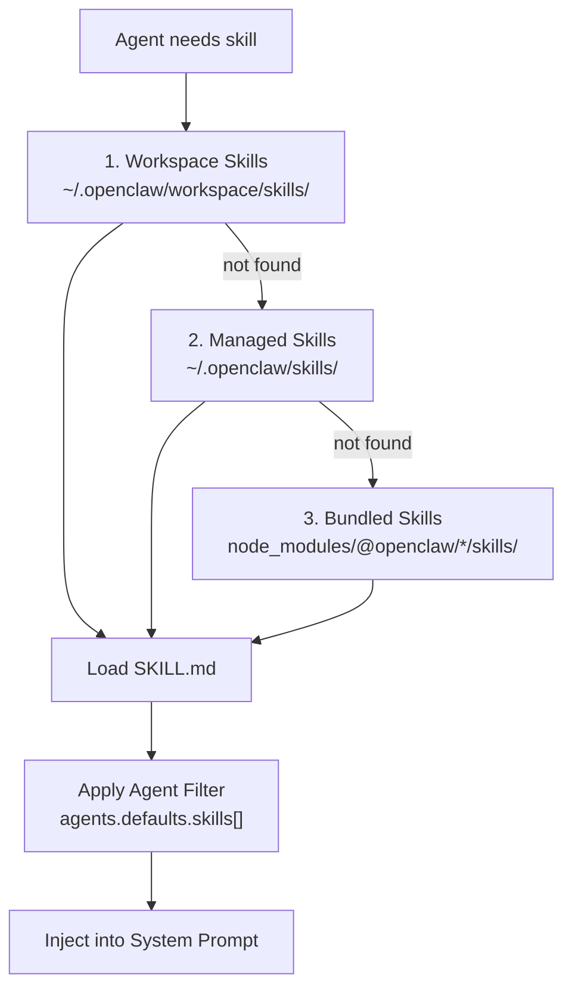

**Skill directory structure:**

```
git-backup/                    # skill-id
├── SKILL.md                   # Prompt injection
├── scripts/
│   └── backup.sh              # Helper scripts
└── .openclaw/
    └── skill.json             # Metadata
```

**SKILL.md format:**

```markdown
# Git Backup

## Description

Automated git backup with commit message generation.

## Tools

- exec (backup.sh)
- write (commit messages)

## Usage

Ask me to "backup the workspace" or "commit changes".
```

**Skill configuration:**

```json5
{
  skills: {
    entries: {
      'git-backup': {
        enabled: true,
        apiKey: 'optional-api-key',
        env: { GIT_AUTHOR: 'OpenClaw' },
      },
    },
  },
  agents: {
    defaults: {
      skills: ['git-backup', 'web-search'], // allowlist
    },
  },
}
```

**Skill management:**

- [src/skills/manager.ts]() - Skill discovery and loading
- [src/skills/skill-filter.ts]() - Agent-based filtering
- CLI: `openclaw skills list`, `openclaw skills info <id>`

**Sources:** [docs/tools/skills.md](), [README.md:135-136](), [docs/tools/skills-config.md]()

---

## Memory: Persistent Context

**Memory** is the agent's long-term knowledge store, implemented as Markdown files with hybrid vector + full-text search.

**Memory architecture:**

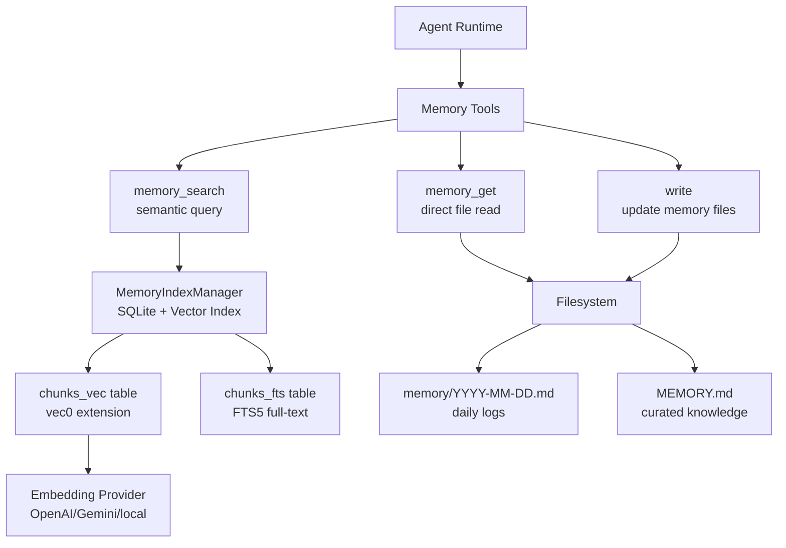

**Memory file structure:**

| File                   | Purpose                     | Loading                     |
| ---------------------- | --------------------------- | --------------------------- |
| `MEMORY.md`            | Curated long-term knowledge | Main session only           |
| `memory/YYYY-MM-DD.md` | Daily append-only logs      | Today + yesterday           |
| `memory/*.md`          | Additional memory files     | Indexed but not auto-loaded |

**Memory search flow:**

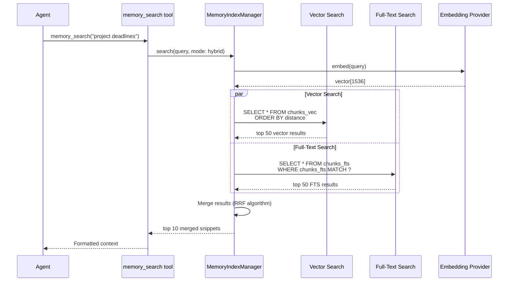

**Memory configuration:**

```json5
{
  agents: {
    defaults: {
      memorySearch: {
        backend: 'builtin', // or "qmd"
        provider: 'openai', // openai, gemini, local, auto
        model: 'text-embedding-3-small',
        enabled: true,
        citations: 'auto',
        maxResults: 10,
      },
    },
  },
}
```

**Memory implementation:**

- [src/memory/manager.ts]() - Core MemoryIndexManager class
- [src/memory/embeddings.ts]() - Embedding provider abstraction
- [src/memory/hybrid.ts]() - RRF (Reciprocal Rank Fusion) merging

**Sources:** [docs/concepts/memory.md](), [src/memory/manager.ts:1-200](), [src/agents/memory-search.ts]()

---

## Configuration: JSON5 System

**Configuration** is managed through a single JSON5 file at `~/.openclaw/openclaw.json` with Zod schema validation and hot reload support.

**Configuration flow:**

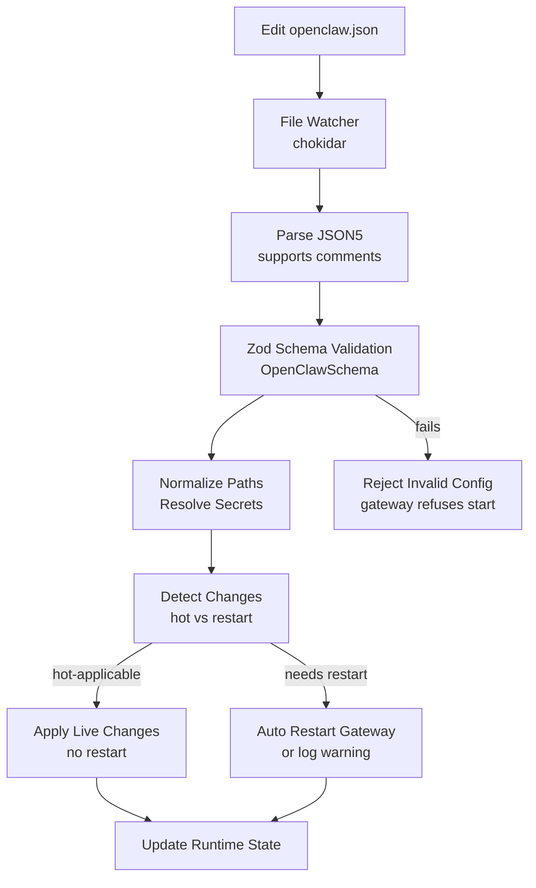

**Configuration validation:**

OpenClaw uses Zod for strict schema validation:

- [src/config/zod-schema.ts]() - Root OpenClawSchema
- [src/config/zod-schema.agents.ts]() - Agent configuration
- [src/config/zod-schema.providers.ts]() - Channel configuration

**Validation errors block Gateway startup:**

```bash
$ openclaw gateway
Error: Config validation failed:
  - agents.defaults.workspace: invalid path
  - channels.telegram.botToken: required field missing

Run 'openclaw doctor' to diagnose and repair.
```

**Hot reload rules:**

| Config Section | Hot Reload? | Restart Required? |
| -------------- | ----------- | ----------------- |
| `agents.*`     | ✅ Yes      | ❌ No             |
| `channels.*`   | ✅ Yes      | ❌ No             |
| `tools.*`      | ✅ Yes      | ❌ No             |
| `skills.*`     | ✅ Yes      | ❌ No             |
| `gateway.port` | ❌ No       | ✅ Yes            |
| `gateway.bind` | ❌ No       | ✅ Yes            |
| `gateway.auth` | ❌ No       | ✅ Yes            |
| `discovery.*`  | ❌ No       | ✅ Yes            |

**Configuration reload modes:**

```json5
{
  gateway: {
    reload: {
      mode: 'hybrid', // hot | restart | hybrid | off
      debounceMs: 300,
    },
  },
}
```

**Mode behaviors:**

- `hot` - Apply safe changes only, log warning for restart-required
- `restart` - Auto-restart on any change
- `hybrid` (default) - Hot-apply when safe, auto-restart when needed
- `off` - Disable file watching, manual restart required

**Configuration commands:**

```bash
# Get nested value
openclaw config get agents.defaults.workspace

# Set value (writes to file)
openclaw config set agents.defaults.model.primary "anthropic/claude-opus-4-6"

# Remove value
openclaw config unset tools.web.search.apiKey

# Validate without starting
openclaw doctor
```

**Configuration RPC methods:**

The Gateway exposes WebSocket RPCs for remote configuration:

- `config.get` - Read current config
- `config.patch` - Merge partial update
- `config.apply` - Full config replace
- `config.validate` - Pre-flight validation

**Sources:** [docs/gateway/configuration.md](), [src/config/config.ts](), [src/config/zod-schema.ts:1-100]()

---

## Concept Relationships

**Cross-cutting concerns:**

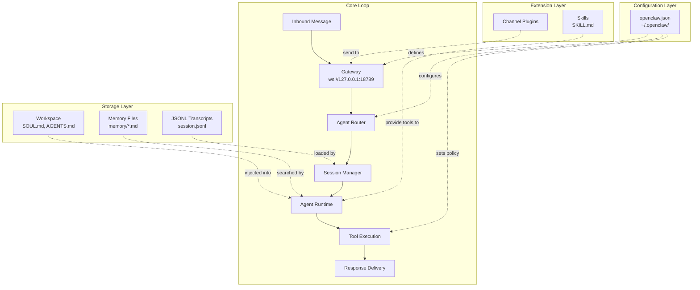

**Key integration points:**

| From     | To             | Via             | Purpose                |
| -------- | -------------- | --------------- | ---------------------- |
| Channels | Gateway        | WebSocket RPC   | Message delivery       |
| Gateway  | Agent Router   | Bindings        | Route to correct agent |
| Agent    | Workspace      | File I/O        | Load prompt files      |
| Agent    | Memory         | `memory_search` | Semantic recall        |
| Agent    | Tools          | Policy check    | Execute capabilities   |
| Agent    | Sessions       | JSONL write     | Persist transcript     |
| Config   | All subsystems | Hot reload      | Apply settings         |

**Sources:** All sections above, [README.md:187-202](), [docs/concepts/architecture.md]()
