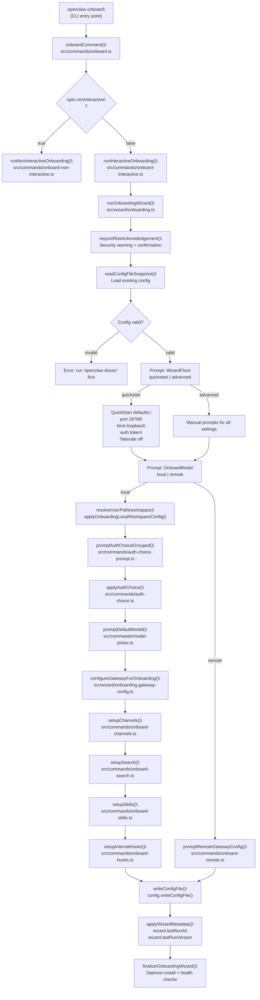
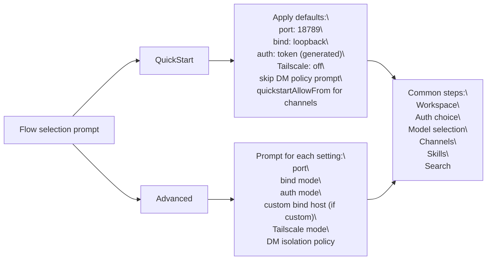

# Getting Started

<details>
<summary>Relevant source files</summary>

The following files were used as context for generating this wiki page:

- [README.md](README.md)
- [assets/avatar-placeholder.svg](assets/avatar-placeholder.svg)
- [docs/channels/index.md](docs/channels/index.md)
- [docs/cli/index.md](docs/cli/index.md)
- [docs/cli/onboard.md](docs/cli/onboard.md)
- [docs/concepts/multi-agent.md](docs/concepts/multi-agent.md)
- [docs/docs.json](docs/docs.json)
- [docs/gateway/index.md](docs/gateway/index.md)
- [docs/gateway/troubleshooting.md](docs/gateway/troubleshooting.md)
- [docs/index.md](docs/index.md)
- [docs/reference/wizard.md](docs/reference/wizard.md)
- [docs/start/getting-started.md](docs/start/getting-started.md)
- [docs/start/hubs.md](docs/start/hubs.md)
- [docs/start/onboarding.md](docs/start/onboarding.md)
- [docs/start/setup.md](docs/start/setup.md)
- [docs/start/wizard-cli-automation.md](docs/start/wizard-cli-automation.md)
- [docs/start/wizard-cli-reference.md](docs/start/wizard-cli-reference.md)
- [docs/start/wizard.md](docs/start/wizard.md)
- [docs/tools/skills-config.md](docs/tools/skills-config.md)
- [docs/tools/skills.md](docs/tools/skills.md)
- [docs/web/webchat.md](docs/web/webchat.md)
- [docs/zh-CN/channels/index.md](docs/zh-CN/channels/index.md)
- [extensions/bluebubbles/src/send-helpers.ts](extensions/bluebubbles/src/send-helpers.ts)
- [scripts/clawtributors-map.json](scripts/clawtributors-map.json)
- [scripts/update-clawtributors.ts](scripts/update-clawtributors.ts)
- [scripts/update-clawtributors.types.ts](scripts/update-clawtributors.types.ts)
- [src/agents/model-auth.ts](src/agents/model-auth.ts)
- [src/agents/models-config.fills-missing-provider-apikey-from-env-var.test.ts](src/agents/models-config.fills-missing-provider-apikey-from-env-var.test.ts)
- [src/agents/models-config.providers.openai-codex.test.ts](src/agents/models-config.providers.openai-codex.test.ts)
- [src/agents/models-config.providers.ts](src/agents/models-config.providers.ts)
- [src/agents/models-config.ts](src/agents/models-config.ts)
- [src/agents/subagent-registry-cleanup.test.ts](src/agents/subagent-registry-cleanup.test.ts)
- [src/cli/program.ts](src/cli/program.ts)
- [src/cli/program/register.onboard.ts](src/cli/program/register.onboard.ts)
- [src/commands/auth-choice-options.test.ts](src/commands/auth-choice-options.test.ts)
- [src/commands/auth-choice-options.ts](src/commands/auth-choice-options.ts)
- [src/commands/auth-choice.apply.api-providers.ts](src/commands/auth-choice.apply.api-providers.ts)
- [src/commands/auth-choice.preferred-provider.ts](src/commands/auth-choice.preferred-provider.ts)
- [src/commands/auth-choice.test.ts](src/commands/auth-choice.test.ts)
- [src/commands/auth-choice.ts](src/commands/auth-choice.ts)
- [src/commands/configure.ts](src/commands/configure.ts)
- [src/commands/onboard-auth.config-core.ts](src/commands/onboard-auth.config-core.ts)
- [src/commands/onboard-auth.credentials.ts](src/commands/onboard-auth.credentials.ts)
- [src/commands/onboard-auth.models.ts](src/commands/onboard-auth.models.ts)
- [src/commands/onboard-auth.test.ts](src/commands/onboard-auth.test.ts)
- [src/commands/onboard-auth.ts](src/commands/onboard-auth.ts)
- [src/commands/onboard-non-interactive.ts](src/commands/onboard-non-interactive.ts)
- [src/commands/onboard-non-interactive/local/auth-choice.ts](src/commands/onboard-non-interactive/local/auth-choice.ts)
- [src/commands/onboard-types.ts](src/commands/onboard-types.ts)
- [src/wizard/onboarding.ts](src/wizard/onboarding.ts)

</details>

This page covers prerequisites, installation, the `openclaw onboard` wizard, the `openclaw doctor` command, and verifying a working setup. It targets first-time users going from zero to a running Gateway.

For definitions of Gateway, Agent, Node, Channel, and Session, see [Core Concepts](#1.2). For deep Gateway configuration after setup is working, see [Configuration](#2.3). For the full CLI surface, see [Gateway](#2).

---

## Prerequisites

| Requirement         | Details                                                                          |
| ------------------- | -------------------------------------------------------------------------------- |
| **Node.js**         | Version 22 or newer (`node --version` to check)                                  |
| **Package manager** | npm or pnpm; **pnpm is recommended**                                             |
| **OS**              | macOS, Linux, or Windows via WSL2 (WSL2 strongly recommended on Windows)         |
| **RAM**             | 512MB-1GB minimum for personal use; 2GB recommended with headroom for logs/media |
| **Disk**            | ~500MB for Gateway installation                                                  |

The minimum runtime is enforced at process startup via `assertSupportedRuntime` before any commands run. Bun is **not recommended** for the Gateway.

Sources: [docs/help/faq.md:362-377](), [src/index.ts:44-45]()

---

## Installation

Three installation paths are supported:

| Method                             | Command                                             | Use case                                                                                   |
| ---------------------------------- | --------------------------------------------------- | ------------------------------------------------------------------------------------------ |
| **Installer script (recommended)** | `curl -fsSL https://openclaw.ai/install.sh \| bash` | Most users; handles Node detection, installation, PATH setup, and onboarding automatically |
| **npm/pnpm global**                | `npm install -g openclaw@latest`                    | Clean installs with Node >= 22 already on PATH                                             |
| **From source (git)**              | `git clone` + `pnpm install && pnpm build`          | Contributors and development; allows local edits                                           |

### Installer Script (Recommended)

The installer script automatically detects Node, installs it if missing, installs OpenClaw globally via npm, and launches the onboarding wizard.

**macOS/Linux/WSL2:**

```bash
curl -fsSL https://openclaw.ai/install.sh | bash
```

**Windows (PowerShell):**

```powershell
iwr -useb https://openclaw.ai/install.ps1 | iex
```

**Skip onboarding (install binary only):**

```bash
curl -fsSL https://openclaw.ai/install.sh | bash -s -- --no-onboard
```

**Install from git checkout (hackable install):**

```bash
curl -fsSL https://openclaw.ai/install.sh | bash -s -- --install-method git
```

The `--install-method git` flag clones the repository and installs from source, allowing you to modify code locally. This is useful for development or when working with AI coding assistants that need to read the full source tree.

Sources: [docs/help/faq.md:318-332](), [docs/install/installer.md:14-67]()

### npm/pnpm

If you already have Node 22+ installed:

```bash
npm install -g openclaw@latest
# or
pnpm add -g openclaw@latest
```

After installation, run the onboarding wizard:

```bash
openclaw onboard --install-daemon
```

Sources: [docs/install/index.md:72-85]()

### From Source (Git)

For contributors or development workflows:

```bash
git clone https://github.com/openclaw/openclaw.git
cd openclaw
pnpm install
pnpm build
pnpm ui:build   # builds Control UI assets; auto-installs UI deps on first run
```

For source installs:

- `pnpm openclaw ...` runs TypeScript directly via `tsx`
- `pnpm build` is required before running via Node or the packaged binary
- `pnpm gateway:watch` provides hot-reload during development

Run onboarding after building:

```bash
pnpm openclaw onboard
```

Sources: [docs/help/faq.md:318-340](), [docs/install/index.md:34-69]()

---

## Running the Onboarding Wizard

`openclaw onboard` is the recommended first step after installing. It is an interactive wizard that configures:

- Model provider authentication (Anthropic, OpenAI, Google Gemini, local models, etc.)
- Agent workspace directory
- Gateway settings (port, bind address, authentication)
- Communication channels (Telegram, Discord, WhatsApp, etc.)
- Skills and memory search setup
- Optional background daemon installation

```bash
openclaw onboard --install-daemon
```

The `--install-daemon` flag installs the Gateway as a **launchd user service** (macOS) or **systemd user unit** (Linux/WSL2), ensuring it runs automatically after system boot and persists after the terminal closes.

### Wizard Execution Flow

**Diagram: Onboarding wizard execution path → code entities**



Sources: [src/commands/onboard.ts:1-24](), [src/wizard/onboarding.ts:73-553](), [src/commands/onboard-interactive.ts:1-30]()

### QuickStart vs Advanced Mode

The first prompt is mode selection (unless `--flow` is specified via CLI). QuickStart applies sensible defaults and minimizes prompts; Advanced provides full control over all settings.

**Diagram: QuickStart vs Advanced configuration flow**



| Setting           | QuickStart Default                               | Advanced                                          |
| ----------------- | ------------------------------------------------ | ------------------------------------------------- |
| Gateway bind      | `loopback` (127.0.0.1)                           | `loopback`, `lan`, `auto`, `custom`, or `tailnet` |
| Gateway port      | `18789`                                          | Configurable                                      |
| Gateway auth      | Token (auto-generated via `randomToken()`)       | Token or Password                                 |
| Tailscale mode    | Off                                              | Off / Serve / Funnel                              |
| Mode              | Local only                                       | Local or Remote                                   |
| DM isolation      | `per-channel-peer` (implicit)                    | Explicit prompt                                   |
| Channel allowFrom | Auto-configured for QuickStart-eligible channels | Prompted per channel                              |

**Type reference:** `WizardFlow = "quickstart" | "advanced"` is defined in [src/wizard/onboarding.types.ts](). The `"manual"` CLI value is normalized to `"advanced"` before processing.

Sources: [src/wizard/onboarding.ts:108-139](), [src/wizard/onboarding.ts:229-279](), [src/wizard/onboarding.types.ts:1-20]()

### What the Wizard Writes to Config

All wizard output is written to `~/.openclaw/openclaw.json` (resolved via `CONFIG_PATH` constant). The sections it populates:

| Config key                      | What is set                                           | Source function                         |
| ------------------------------- | ----------------------------------------------------- | --------------------------------------- |
| `agents.defaults.workspace`     | Workspace directory (default `~/.openclaw/workspace`) | `applyOnboardingLocalWorkspaceConfig()` |
| `agents.defaults.model`         | Primary model (e.g., `anthropic/claude-opus-4-6`)     | `applyPrimaryModel()`                   |
| `agents.defaults.models`        | Model allowlist with aliases                          | `applyAuthChoice()`                     |
| `auth.profiles.*`               | Auth profile configurations                           | `applyAuthProfileConfig()`              |
| `gateway.mode`                  | `local` or `remote`                                   | Wizard mode selection                   |
| `gateway.port`                  | Default `18789` (`DEFAULT_GATEWAY_PORT`)              | Gateway configuration flow              |
| `gateway.bind`                  | `loopback`, `lan`, `tailnet`, `custom`, or `auto`     | Gateway configuration flow              |
| `gateway.auth.mode`             | `token` or `password`                                 | Gateway configuration flow              |
| `gateway.auth.token`            | Auto-generated hex token via `randomToken()`          | Gateway configuration flow              |
| `gateway.tailscale.mode`        | `off`, `serve`, or `funnel`                           | Gateway configuration flow              |
| `gateway.tailscale.resetOnExit` | Boolean flag                                          | Gateway configuration flow              |
| `channels.*`                    | Channel tokens and `allowFrom` lists                  | `setupChannels()`                       |
| `memory.backend`                | `qmd` or `builtin`                                    | `setupSearch()`                         |
| `skills.*`                      | Skills configuration                                  | `setupSkills()`                         |
| `hooks.newSession.appendMemory` | Session memory hook                                   | `setupInternalHooks()`                  |
| `wizard.lastRunAt`              | ISO 8601 timestamp                                    | `applyWizardMetadata()`                 |
| `wizard.lastRunVersion`         | Package version at run time                           | `applyWizardMetadata()`                 |
| `wizard.lastRunCommand`         | `"onboard"`                                           | `applyWizardMetadata()`                 |

Sources: [src/commands/onboard-helpers.ts:40-62](), [src/wizard/onboarding.ts:409-537](), [src/config/config.ts:1-50]()

### Key `onboard` Flags

| Flag                                                | Effect                                                            | Use case                        |
| --------------------------------------------------- | ----------------------------------------------------------------- | ------------------------------- |
| `--install-daemon`                                  | Install Gateway as a launchd/systemd service                      | Persist Gateway across reboots  |
| `--flow quickstart\|advanced`                       | Skip the flow selection prompt                                    | Automation or known preferences |
| `--mode local\|remote`                              | Skip the mode selection prompt                                    | Automation                      |
| `--non-interactive`                                 | Run without prompts; requires explicit flags for all options      | CI/CD, automation scripts       |
| `--accept-risk`                                     | Acknowledge security warning (required for `--non-interactive`)   | Headless installs               |
| `--reset`                                           | Clear config/credentials/sessions before running                  | Fresh start                     |
| `--reset-scope config\|config+creds+sessions\|full` | Control reset granularity (`full` also removes workspace)         | Targeted cleanup                |
| `--workspace <dir>`                                 | Set workspace directory path                                      | Custom workspace location       |
| `--auth-choice <choice>`                            | Set auth method (see [Auth Choice Options](#auth-choice-options)) | Non-interactive setup           |
| `--token-provider <provider>`                       | Provider for `--auth-choice token`                                | Non-interactive token auth      |
| `--token <value>`                                   | Token value for `--auth-choice token`                             | Non-interactive token auth      |
| `--anthropic-api-key <key>`                         | Anthropic API key                                                 | Non-interactive API key auth    |
| `--openai-api-key <key>`                            | OpenAI API key                                                    | Non-interactive API key auth    |
| `--gemini-api-key <key>`                            | Google Gemini API key                                             | Non-interactive API key auth    |
| `--gateway-port <port>`                             | Override gateway port (default `18789`)                           | Custom port binding             |
| `--gateway-bind <mode>`                             | Override bind address (`loopback\|lan\|tailnet\|custom\|auto`)    | Network configuration           |
| `--gateway-auth <mode>`                             | Auth mode (`token\|password`)                                     | Gateway authentication          |
| `--skip-channels`                                   | Skip channel setup step                                           | Fast initial setup              |
| `--skip-skills`                                     | Skip skills install step                                          | Fast initial setup              |
| `--skip-search`                                     | Skip memory search setup                                          | Fast initial setup              |
| `--secret-input-mode <mode>`                        | API key persistence mode (`plaintext\|ref`)                       | SecretRef configuration         |

Sources: [src/cli/program/register.onboard.ts:1-143](), [docs/cli/onboard.md]()

### Auth Choice Options

The `--auth-choice` flag accepts these values:

| Value               | Provider                     | Auth Method                                   |
| ------------------- | ---------------------------- | --------------------------------------------- |
| `token`             | Anthropic                    | Setup token (paste from `claude setup-token`) |
| `apiKey`            | Anthropic                    | API key                                       |
| `openai-codex`      | OpenAI                       | Codex OAuth (ChatGPT subscription)            |
| `openai-api-key`    | OpenAI                       | API key                                       |
| `gemini-api-key`    | Google                       | Gemini API key                                |
| `google-gemini-cli` | Google                       | Gemini CLI OAuth (unofficial)                 |
| `github-copilot`    | GitHub                       | Copilot (GitHub device login)                 |
| `vllm`              | vLLM                         | Local/self-hosted OpenAI-compatible server    |
| `minimax-portal`    | MiniMax                      | OAuth                                         |
| `minimax-api`       | MiniMax                      | API key                                       |
| `qwen-portal`       | Qwen                         | OAuth                                         |
| `chutes`            | Chutes                       | OAuth                                         |
| ... and many more   | See [Auth Choice Options](#) | Various API keys and OAuth flows              |

For the complete list, see [src/commands/auth-choice-options.ts:190-300]().

Sources: [src/commands/auth-choice-options.ts:20-188](), [src/commands/onboard-provider-auth-flags.ts:1-200]()

---

## The `doctor` Command

`openclaw doctor` is the health check, repair, and migration tool. It validates config, checks auth profiles, migrates legacy state, repairs sandbox images, audits service configurations, and offers interactive fixes for detected issues.

**When to run doctor:**

- After initial installation (via onboarding wizard)
- After upgrading OpenClaw (`openclaw update`)
- When the Gateway won't start or behaves unexpectedly
- Before filing a bug report (include `openclaw doctor` output)

```bash
openclaw doctor
```

For headless or automated environments:

```bash
openclaw doctor --yes          # accept all defaults without prompting (including restart/service/sandbox repairs)
openclaw doctor --repair       # apply recommended repairs without prompting
openclaw doctor --non-interactive  # safe migrations only, no prompts (skips restart/service/sandbox actions)
openclaw doctor --deep         # scan system services for extra gateway installs (launchd/systemd/schtasks)
```

Sources: [src/commands/doctor.ts:72-363](), [docs/gateway/doctor.md:1-100]()

### What `doctor` Checks and Repairs

**Diagram: doctorCommand execution flow → check modules**

```mermaid
flowchart TD
    Entry["doctorCommand()\
src/commands/doctor.ts:72"] --> Header["printWizardHeader()\
intro('OpenClaw doctor')"]
    Header --> Update["maybeOfferUpdateBeforeDoctor()\
doctor-update.ts"]
    Update --> UIProto["maybeRepairUiProtocolFreshness()\
doctor-ui.ts"]
    UIProto --> InstChk["noteSourceInstallIssues()\
doctor-install.ts"]
    InstChk --> DepEnv["noteDeprecatedLegacyEnvVars()\
doctor-platform-notes.ts"]
    DepEnv --> CfgLoad["loadAndMaybeMigrateDoctorConfig()\
doctor-config-flow.ts"]
    CfgLoad --> AuthRep["maybeRepairAnthropicOAuthProfileId()\
doctor-auth.ts"]
    AuthRep --> AuthHP["noteAuthProfileHealth()\
doctor-auth.ts"]
    AuthHP --> GWTok{"gateway.auth.token\
missing?"}
    GWTok -->|"yes"| GenTok["Prompt: generate token?\
randomToken()"]
    GWTok -->|"no"| LegacySt["detectLegacyStateMigrations()\
doctor-state-migrations.ts"]
    GenTok --> LegacySt
    LegacySt --> RunMig["runLegacyStateMigrations()\
(if detected)"]
    RunMig --> StateInt["noteStateIntegrity()\
doctor-state-integrity.ts"]
    StateInt --> SessLock["noteSessionLockHealth()\
doctor-session-locks.ts"]
    SessLock --> Sandbox["maybeRepairSandboxImages()\
doctor-sandbox.ts"]
    Sandbox --> SbxWarn["noteSandboxScopeWarnings()\
doctor-sandbox.ts"]
    SbxWarn --> SvcScan["maybeScanExtraGatewayServices()\
doctor-gateway-services.ts"]
    SvcScan --> SvcRep["maybeRepairGatewayServiceConfig()\
doctor-gateway-services.ts"]
    SvcRep --> MacLA["noteMacLaunchAgentOverrides()\
doctor-platform-notes.ts"]
    MacLA --> MacEnv["noteMacLaunchctlGatewayEnvOverrides()\
doctor-platform-notes.ts"]
    MacEnv --> Sec["noteSecurityWarnings()\
doctor-security.ts"]
    Sec --> OAuthTLS["noteOpenAIOAuthTlsPrerequisites()\
oauth-tls-preflight.ts"]
    OAuthTLS --> Hooks["Validate hooks.gmail.model\
(if configured)"]
    Hooks --> Linger["ensureSystemdUserLingerInteractive()\
systemd-linger.ts"]
    Linger --> WStat["noteWorkspaceStatus()\
doctor-workspace-status.ts"]
    WStat --> Boot["noteBootstrapFileSize()\
doctor-bootstrap-size.ts"]
    Boot --> Shell["doctorShellCompletion()\
doctor-completion.ts"]
    Shell --> GWHealth["checkGatewayHealth()\
doctor-gateway-health.ts"]
    GWHealth --> MemProbe["probeGatewayMemoryStatus()\
doctor-gateway-health.ts"]
    MemProbe --> MemHP["noteMemorySearchHealth()\
doctor-memory-search.ts"]
    MemHP --> DaemRep["maybeRepairGatewayDaemon()\
doctor-gateway-daemon-flow.ts"]
    DaemRep --> Write{"Config changed?"}
    Write -->|"yes"| WriteC["writeConfigFile()\
applyWizardMetadata()"]
    Write -->|"no"| Backup
    WriteC --> Backup["Log backup path\
(if .bak exists)"]
    Backup --> WSug["noteWorkspaceBackupTip()\
shouldSuggestMemorySystem()"]
    WSug --> Final["readConfigFileSnapshot()\
Validate final state"]
    Final --> Outro["outro('Doctor complete.')"]
```



Sources: [src/commands/doctor.ts:72-363]()

| Check category          | What it examines                                                                  | Module/Function                                                          |
| ----------------------- | --------------------------------------------------------------------------------- | ------------------------------------------------------------------------ |
| **Pre-flight update**   | Offers update for git installs (interactive only)                                 | `maybeOfferUpdateBeforeDoctor()`                                         |
| **UI protocol**         | Rebuilds Control UI when protocol schema is newer                                 | `maybeRepairUiProtocolFreshness()`                                       |
| **Source install**      | pnpm workspace mismatch, missing UI assets, missing tsx binary                    | `noteSourceInstallIssues()`                                              |
| **Deprecated env vars** | Legacy `CLAWDBOT_*` env vars                                                      | `noteDeprecatedLegacyEnvVars()`                                          |
| **Config validity**     | Validates `openclaw.json` against Zod schema; applies migrations                  | `loadAndMaybeMigrateDoctorConfig()`                                      |
| **Auth profiles**       | OAuth/API key health; repairs Anthropic OAuth profile IDs; checks expiry/cooldown | `maybeRepairAnthropicOAuthProfileId()`, `noteAuthProfileHealth()`        |
| **Gateway token**       | Ensures `gateway.auth.token` is set; offers to generate via `randomToken()`       | Gateway token check in `doctorCommand()`                                 |
| **Legacy state**        | Old session/agent file paths; WhatsApp auth migration                             | `detectLegacyStateMigrations()`, `runLegacyStateMigrations()`            |
| **State integrity**     | Session lock health; dangling lock files; state directory permissions             | `noteStateIntegrity()`, `noteSessionLockHealth()`                        |
| **Sandbox images**      | Docker image availability when `tools.sandbox.enabled: true`                      | `maybeRepairSandboxImages()`                                             |
| **Sandbox scope**       | Warns if sandbox config violates security best practices                          | `noteSandboxScopeWarnings()`                                             |
| **Extra services**      | Scans launchd/systemd/schtasks for duplicate gateway instances                    | `maybeScanExtraGatewayServices()`                                        |
| **Service config**      | LaunchAgent/systemd unit config matches current settings                          | `maybeRepairGatewayServiceConfig()`                                      |
| **macOS overrides**     | Cached launchd label; env var overrides in launchctl                              | `noteMacLaunchAgentOverrides()`, `noteMacLaunchctlGatewayEnvOverrides()` |
| **Security**            | Open DM policies, non-loopback bind without auth                                  | `noteSecurityWarnings()`                                                 |
| **OAuth TLS**           | OpenAI Codex OAuth TLS prerequisites                                              | `noteOpenAIOAuthTlsPrerequisites()`                                      |
| **Hooks config**        | Validates `hooks.gmail.model` against model catalog                               | `resolveHooksGmailModel()`, `getModelRefStatus()`                        |
| **systemd linger**      | Ensures systemd user linger is enabled on Linux (prevents session kill on logout) | `ensureSystemdUserLingerInteractive()`                                   |
| **Workspace**           | Workspace directory status; extra workspace dir detection                         | `noteWorkspaceStatus()`                                                  |
| **Bootstrap size**      | Warns if bootstrap files are unusually large                                      | `noteBootstrapFileSize()`                                                |
| **Shell completion**    | Tab completion installation for bash/zsh/fish                                     | `doctorShellCompletion()`                                                |
| **Gateway health**      | Live WebSocket probe; checks if Gateway is reachable                              | `checkGatewayHealth()`                                                   |
| **Memory status**       | Probes memory search backend readiness                                            | `probeGatewayMemoryStatus()`                                             |
| **Memory health**       | Memory backend configuration and status                                           | `noteMemorySearchHealth()`                                               |
| **Daemon repair**       | Service running status; offers restart/reload                                     | `maybeRepairGatewayDaemon()`                                             |

Sources: [src/commands/doctor.ts:72-363](), [docs/gateway/doctor.md:59-86]()

### `doctor` Flags

| Flag                         | Effect                                                                          | When to use                   |
| ---------------------------- | ------------------------------------------------------------------------------- | ----------------------------- |
| `--yes`                      | Accept all prompts with defaults (including restart/service/sandbox repairs)    | Automation, headless installs |
| `--repair` / `--fix`         | Apply recommended repairs without prompting (repairs + restarts where safe)     | Automation, known issues      |
| `--force`                    | Apply aggressive repairs too (overwrites custom supervisor configs)             | When `--repair` isn't enough  |
| `--non-interactive`          | Run without prompts; only apply safe migrations (skips restart/service/sandbox) | CI/CD, read-only diagnostics  |
| `--deep`                     | Scan system services for extra gateway instances (launchd/systemd/schtasks)     | Debugging multiple installs   |
| `--generate-gateway-token`   | Generate and write a gateway token non-interactively                            | Headless token generation     |
| `--no-workspace-suggestions` | Suppress workspace memory hints                                                 | Clean output for automation   |

Sources: [src/commands/doctor-prompter.ts:1-50](), [docs/gateway/doctor.md:14-52]()

---

## Verifying a Working Setup

**Diagram: Post-install verification sequence → Gateway + CLI components**

```mermaid
sequenceDiagram
    participant User
    participant OCCli as "openclaw CLI\
(src/index.ts)"
    participant GWSvc as "Gateway Service\
(launchd/systemd)"
    participant GWProc as "Gateway Process\
(GatewayServer)"
    participant WSConn as "WebSocket\
ws://127.0.0.1:18789"
    participant Browser as "Control UI\
(browser)"

    User->>OCCli: openclaw gateway status
    OCCli->>GWSvc: Check service runtime\
(resolveGatewayService().isRunning())
    GWSvc-->>OCCli: "running" or "stopped"
    OCCli->>WSConn: RPC probe\
(buildGatewayConnectionDetails())
    WSConn->>GWProc: WebSocket handshake + auth
    GWProc-->>WSConn: pong
    WSConn-->>OCCli: RPC ok
    OCCli-->>User: "Runtime: running\
RPC probe: ok"

    User->>OCCli: openclaw status
    OCCli->>WSConn: RPC: health request\
(gateway/call.ts)
    WSConn->>GWProc: health()
    GWProc-->>WSConn: { agents, sessions, channels, providers }
    WSConn-->>OCCli: status payload
    OCCli-->>User: formatted status report

    User->>OCCli: openclaw doctor
    OCCli->>OCCli: doctorCommand()\
Run all checks
    OCCli-->>User: "Doctor complete."

    User->>OCCli: openclaw dashboard
    OCCli->>Browser: open http://127.0.0.1:18789/
    Browser->>WSConn: WebSocket connect\
Authorization: Bearer <token>
    WSConn->>GWProc: authenticate + establish session
    GWProc-->>Browser: OpenClawApp\
(Control UI rendered)
```

Sources: [src/index.ts:1-100](), [src/gateway/call.ts:1-100](), [src/commands/doctor.ts:72-363]()

Run these commands in sequence to confirm a healthy install:

```bash
# 1. Is the gateway service running and reachable?
openclaw gateway status

# 2. Overall system status snapshot
openclaw status

# 3. Run health checks and repairs
openclaw doctor

# 4. Open the Control UI in the browser
openclaw dashboard
```

### Expected Healthy Output

| Command                    | Healthy Output                                                    | What it checks                                              |
| -------------------------- | ----------------------------------------------------------------- | ----------------------------------------------------------- |
| `openclaw gateway status`  | `Runtime: running` and `RPC probe: ok`                            | Service supervisor status + WebSocket reachability          |
| `openclaw status`          | No blocking errors; shows configured channels and agents          | Live Gateway health via RPC; agent/session/provider summary |
| `openclaw doctor`          | No critical issues; `Config valid: true`                          | All doctor checks pass; config validates against Zod schema |
| `openclaw channels status` | Channels show `connected` or `ready`                              | Live channel connection status from running Gateway         |
| `openclaw dashboard`       | Browser opens to `http://127.0.0.1:18789/` and renders Control UI | WebSocket auth succeeds; UI assets are built                |

### Troubleshooting Startup Issues

If the Gateway does not start or RPC probe fails:

```bash
# Tail the latest log file
openclaw logs --follow

# If RPC is down, tail file logs directly
tail -f "$(ls -t /tmp/openclaw/openclaw-*.log | head -1)"

# Check service supervisor status
openclaw gateway status

# Full diagnostic report (safe to share; tokens redacted)
openclaw status --all
```

**Common issues:**

- **Port collision:** Another process is using port `18789`. Change `gateway.port` in config or stop the conflicting process.
- **Missing auth token:** Run `openclaw doctor` to generate one.
- **Invalid config:** Run `openclaw doctor` to repair and migrate.
- **Service not installed:** Run `openclaw onboard --install-daemon` or `openclaw daemon install`.

Sources: [docs/help/faq.md:203-250](), [docs/help/troubleshooting.md:14-50]()

---

## Key Environment Variables

| Variable                    | Effect                                                              | Default                              |
| --------------------------- | ------------------------------------------------------------------- | ------------------------------------ |
| `OPENCLAW_HOME`             | Overrides the home directory for all internal path resolution       | `~`                                  |
| `OPENCLAW_STATE_DIR`        | Overrides the state directory                                       | `~/.openclaw`                        |
| `OPENCLAW_CONFIG_PATH`      | Overrides config file path                                          | `~/.openclaw/openclaw.json`          |
| `OPENCLAW_AGENT_DIR`        | Overrides the agent directory (for auth profiles, sessions, memory) | `~/.openclaw/agents/main/agent`      |
| `OPENCLAW_GATEWAY_TOKEN`    | Gateway auth token; read by both CLI and Gateway at startup         | (none; must be set in config or env) |
| `OPENCLAW_GATEWAY_PASSWORD` | Gateway password (alternative to token)                             | (none)                               |
| `OPENCLAW_GATEWAY_PORT`     | Overrides gateway port                                              | `18789`                              |
| `NODE_ENV`                  | Node environment (`production`, `development`, `test`)              | (none)                               |

**Legacy aliases (deprecated):**

- `CLAWDBOT_GATEWAY_TOKEN` → use `OPENCLAW_GATEWAY_TOKEN`
- `CLAWDBOT_GATEWAY_PASSWORD` → use `OPENCLAW_GATEWAY_PASSWORD`

Sources: [docs/help/faq.md:123-127](), [src/config/paths.ts:1-50](), [src/commands/doctor-platform-notes.ts:1-50]()

---

## Important Files and Paths

| Path                                               | Purpose                                                   | Constant/Function                            |
| -------------------------------------------------- | --------------------------------------------------------- | -------------------------------------------- |
| `~/.openclaw/openclaw.json`                        | Primary config file                                       | `CONFIG_PATH`                                |
| `~/.openclaw/workspace/`                           | Default agent workspace root                              | `DEFAULT_WORKSPACE` constant                 |
| `~/.openclaw/agents/main/agent/`                   | Default agent directory (auth profiles, sessions, memory) | `resolveOpenClawAgentDir()`                  |
| `~/.openclaw/agents/main/agent/auth-profiles.json` | Model provider auth profiles                              | `authProfilePathForAgent()`                  |
| `~/.openclaw/agents/main/agent/sessions/`          | Session transcript storage                                | `resolveAgentSessionsDir()`                  |
| `~/.openclaw/credentials/`                         | Channel credential storage (WhatsApp, etc.)               | Channel-specific paths                       |
| `/tmp/openclaw/openclaw-*.log`                     | Gateway log files (timestamped)                           | Log rotation in Gateway startup              |
| `~/Library/LaunchAgents/ai.openclaw.gateway.plist` | macOS launchd service config                              | `resolveGatewayService()` (macOS)            |
| `~/.config/systemd/user/openclaw-gateway.service`  | Linux systemd user unit                                   | `resolveGatewayService()` (Linux)            |
| `~/.openclaw/.backup/`                             | Config backups (`.json.bak` files)                        | Created by `writeConfigFile()` on migrations |

Sources: [src/config/config.ts:1-50](), [src/config/paths.ts:1-100](), [src/commands/onboard-helpers.ts:1-30](), [docs/help/faq.md:91-96]()

---

## Minimal Config Example

If you bypass the onboarding wizard and want a minimal hand-written config:

```json5
{
  gateway: {
    mode: 'local',
    auth: { mode: 'token', token: 'your-gateway-token-here' },
  },
  agents: {
    defaults: {
      model: 'anthropic/claude-opus-4-6',
    },
  },
}
```

**Note:** The Zod schema validates all config fields at startup via `readConfigFileSnapshot()`. An invalid config file prevents the Gateway from starting. The schema enforces required fields, type constraints, and legacy field migrations.

For a complete example with channels and auth profiles, see the [Configuration Reference](#2.3.1).

Sources: [src/config/config.ts:1-100](), [src/config/validation.ts:1-100]()

---

## Next Steps

| Goal                                      | Where to go                             |
| ----------------------------------------- | --------------------------------------- |
| Connect WhatsApp, Telegram, Discord       | [Channels](#4)                          |
| Learn Gateway, Agent, Session concepts    | [Core Concepts](#1.2)                   |
| Configure `openclaw.json` in detail       | [Configuration](#2.3)                   |
| Understand the Gateway WebSocket protocol | [WebSocket Protocol](#2.1)              |
| Set up authentication and device pairing  | [Authentication & Device Pairing](#2.2) |
| Understand the agent execution pipeline   | [Agent Execution Pipeline](#3.1)        |
| Run a security audit                      | [Security Audit](#7.1)                  |
