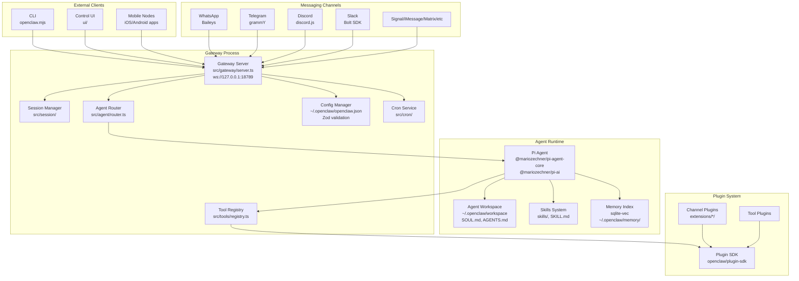
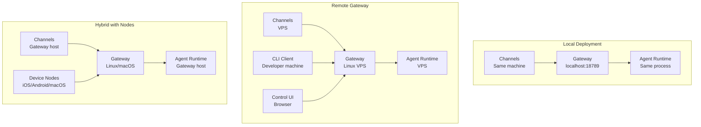

# Overview

<details>
<summary>Relevant source files</summary>

The following files were used as context for generating this wiki page:

- [.npmrc](.npmrc)
- [README.md](README.md)
- [apps/android/app/build.gradle.kts](apps/android/app/build.gradle.kts)
- [apps/ios/ShareExtension/Info.plist](apps/ios/ShareExtension/Info.plist)
- [apps/ios/Sources/Info.plist](apps/ios/Sources/Info.plist)
- [apps/ios/Tests/Info.plist](apps/ios/Tests/Info.plist)
- [apps/ios/WatchApp/Info.plist](apps/ios/WatchApp/Info.plist)
- [apps/ios/WatchExtension/Info.plist](apps/ios/WatchExtension/Info.plist)
- [apps/ios/project.yml](apps/ios/project.yml)
- [apps/macos/Sources/OpenClaw/Resources/Info.plist](apps/macos/Sources/OpenClaw/Resources/Info.plist)
- [assets/avatar-placeholder.svg](assets/avatar-placeholder.svg)
- [docs/channels/index.md](docs/channels/index.md)
- [docs/cli/index.md](docs/cli/index.md)
- [docs/cli/onboard.md](docs/cli/onboard.md)
- [docs/concepts/multi-agent.md](docs/concepts/multi-agent.md)
- [docs/docs.json](docs/docs.json)
- [docs/gateway/index.md](docs/gateway/index.md)
- [docs/gateway/troubleshooting.md](docs/gateway/troubleshooting.md)
- [docs/index.md](docs/index.md)
- [docs/platforms/mac/release.md](docs/platforms/mac/release.md)
- [docs/reference/wizard.md](docs/reference/wizard.md)
- [docs/start/getting-started.md](docs/start/getting-started.md)
- [docs/start/hubs.md](docs/start/hubs.md)
- [docs/start/onboarding.md](docs/start/onboarding.md)
- [docs/start/setup.md](docs/start/setup.md)
- [docs/start/wizard-cli-automation.md](docs/start/wizard-cli-automation.md)
- [docs/start/wizard-cli-reference.md](docs/start/wizard-cli-reference.md)
- [docs/start/wizard.md](docs/start/wizard.md)
- [docs/tools/skills-config.md](docs/tools/skills-config.md)
- [docs/tools/skills.md](docs/tools/skills.md)
- [docs/web/webchat.md](docs/web/webchat.md)
- [docs/zh-CN/channels/index.md](docs/zh-CN/channels/index.md)
- [extensions/bluebubbles/src/send-helpers.ts](extensions/bluebubbles/src/send-helpers.ts)
- [extensions/diagnostics-otel/package.json](extensions/diagnostics-otel/package.json)
- [extensions/discord/package.json](extensions/discord/package.json)
- [extensions/memory-lancedb/package.json](extensions/memory-lancedb/package.json)
- [extensions/nostr/package.json](extensions/nostr/package.json)
- [package.json](package.json)
- [pnpm-lock.yaml](pnpm-lock.yaml)
- [pnpm-workspace.yaml](pnpm-workspace.yaml)
- [scripts/clawtributors-map.json](scripts/clawtributors-map.json)
- [scripts/update-clawtributors.ts](scripts/update-clawtributors.ts)
- [scripts/update-clawtributors.types.ts](scripts/update-clawtributors.types.ts)
- [src/agents/subagent-registry-cleanup.test.ts](src/agents/subagent-registry-cleanup.test.ts)
- [ui/package.json](ui/package.json)

</details>

## Purpose and Scope

This document introduces OpenClaw as a self-hosted multi-agent AI gateway system. It explains the high-level architecture, core capabilities, and deployment model. For hands-on setup instructions, see [Getting Started](#1.1). For conceptual deep-dives on agents, sessions, and routing, see [Core Concepts](#1.2). For detailed architectural diagrams and subsystem interactions, see [System Architecture](#1.3).

## What is OpenClaw?

OpenClaw is a **self-hosted gateway** that connects messaging platforms (WhatsApp, Telegram, Discord, Slack, Signal, iMessage, and others) to AI coding agents. It runs as a single process on your infrastructure, managing sessions, routing, tool execution, and channel connections.

**Key characteristics:**

- **Self-hosted**: Runs on your hardware with your credentials and data
- **Multi-channel**: One gateway process serves multiple messaging platforms simultaneously
- **Multi-agent**: Supports isolated agent workspaces with independent sessions and auth profiles
- **Agent-native**: Built for coding agents with tool use, context management, and background execution
- **Extensible**: Plugin SDK for custom channels, tools, and integrations

The gateway acts as a **control plane** for all agent interactions. Clients (CLI, web UI, mobile apps, channel plugins) connect via WebSocket RPC on port 18789 (default). The agent runtime is embedded using the Pi Agent system [package.json:354-356]().

**Sources:** [README.md:1-27](), [package.json:1-473](), [docs/index.md:44-56]()

## High-Level Architecture



**Sources:** [package.json:16-18](), [package.json:354-356](), [README.md:186-202]()

## Core Components

### Gateway Server

The gateway is the **central control plane** that runs on a single multiplexed port (default 18789). It handles:

- **WebSocket RPC**: Client connections for CLI, Control UI, and mobile nodes
- **HTTP APIs**: OpenAI-compatible endpoints, webhook receivers, tool invocations
- **Session routing**: Maps inbound messages to agent sessions
- **Authentication**: Token-based or password-based auth [docs/gateway/index.md:76]()

**Entry point:** `openclaw.mjs` → `dist/index.js` [package.json:16-36]()

**Configuration:** `~/.openclaw/openclaw.json` validated with Zod schemas [docs/gateway/index.md:63-66]()

**Sources:** [package.json:16-36](), [docs/gateway/index.md:1-10]()

### Agent Runtime

OpenClaw embeds the **Pi Agent** system for agent execution:

- `@mariozechner/pi-agent-core`: Core agent loop and tool calling
- `@mariozechner/pi-ai`: LLM provider integrations
- `@mariozechner/pi-coding-agent`: Coding-specific tools

**Agent isolation:** Each agent has:

- Dedicated workspace directory (`~/.openclaw/workspace` or `~/.openclaw/workspace-<agentId>`)
- Separate session store (`~/.openclaw/agents/<agentId>/sessions/`)
- Independent auth profiles (`~/.openclaw/agents/<agentId>/agent/auth-profiles.json`)

**Sources:** [package.json:354-356](), [docs/concepts/multi-agent.md:13-37]()

### Session Management

Sessions are keyed by agent + routing scope:

- **Per-sender**: `agent:main:peer:<phoneNumber>`
- **Per-channel**: `agent:main:channel:whatsapp`
- **Per-group**: `agent:main:guild:<groupId>`

Session files are stored as JSONL transcripts in `~/.openclaw/agents/<agentId>/sessions/<sessionKey>.jsonl`.

**Sources:** [docs/concepts/multi-agent.md:40-56](), [README.md:147-149]()

### Configuration System

Configuration is loaded from `~/.openclaw/openclaw.json` (JSON5 format):

- **Zod validation**: Schema defined in TypeScript with runtime validation
- **Hot reload**: Most changes apply without restart (port/bind require restart)
- **Secret management**: Supports SecretRef for environment variables, files, or exec commands
- **Migration**: `openclaw doctor` auto-repairs legacy formats

**Sources:** [docs/gateway/index.md:63-66](), [README.md:318-330]()

### Tools System

Tools are registered in `src/tools/registry.ts` with multi-layered policy enforcement:

- **Global policies**: `tools.global.allowlist`, `tools.global.denylist`
- **Agent policies**: Per-agent tool filtering
- **Sandbox policies**: Restrict tools in non-main sessions
- **Per-tool policies**: Fine-grained access control

**Built-in tools:**

- `bash`/`exec`: Shell command execution
- `read`, `write`, `edit`: File operations
- `browser_*`: Browser automation via Playwright
- `memory_search`: Vector + FTS hybrid search
- `sessions_*`: Agent-to-agent communication

**Sources:** [README.md:334-338](), [docs/tools/skills.md:1-9]()

### Skills System

Skills are **modular tool instructions** loaded from:

1. **Workspace skills**: `<workspace>/skills/` (highest precedence)
2. **Managed skills**: `~/.openclaw/skills/`
3. **Bundled skills**: Shipped with the package

Each skill is a directory with `SKILL.md` containing YAML frontmatter + instructions. Skills can declare dependencies (binaries, API keys) and gating rules.

**Format:** AgentSkills.io-compatible markdown files

**Sources:** [docs/tools/skills.md:10-27](), [README.md:312-317]()

### Memory System

Long-term memory uses **SQLite + vector embeddings**:

- **Database**: `~/.openclaw/memory/<agentId>.sqlite`
- **Vector extension**: `sqlite-vec` [package.json:179]()
- **Hybrid search**: Vector similarity + full-text search
- **Indexing**: `memory_index` tool indexes `MEMORY.md` and `memory/*.md`

**Sources:** [package.json:179](), [docs/cli/index.md:295-299]()

### Plugin SDK

The plugin system supports extensibility via `openclaw/plugin-sdk`:

**Channel plugins:** Custom messaging platform integrations (see `extensions/` for 25+ examples)

**Tool plugins:** Add custom tools to the registry

**Exports:** [package.json:38-214]() defines subpaths for each plugin type

**Sources:** [package.json:38-214](), [README.md:285-290]()

## Key Capabilities

| Capability                  | Description                                                                | Code Reference                             |
| --------------------------- | -------------------------------------------------------------------------- | ------------------------------------------ |
| **Multi-channel messaging** | WhatsApp, Telegram, Discord, Slack, Signal, iMessage, Matrix, and 20+ more | [extensions/\*/]()                         |
| **Multi-agent routing**     | Isolated agents with independent workspaces, sessions, and auth            | [docs/concepts/multi-agent.md:1-10]()      |
| **Tool execution**          | Bash, file ops, browser control, memory search, agent messaging            | [src/tools/]()                             |
| **Context compaction**      | Automatic session summarization when context window fills                  | [README.md:174-176]()                      |
| **Cron scheduling**         | Background agent tasks with configurable delivery                          | [src/cron/](), [README.md:167-169]()       |
| **WebSocket RPC**           | Real-time bidirectional communication for all clients                      | [docs/gateway/index.md:71-77]()            |
| **OAuth integration**       | Token refresh for Anthropic, OpenAI, Google providers                      | [docs/cli/index.md:459]()                  |
| **Device pairing**          | Secure node registration with challenge-response auth                      | [docs/gateway/troubleshooting.md:93-150]() |
| **Hot reload**              | Config changes apply without restart (hybrid mode default)                 | [docs/gateway/index.md:63-66]()            |
| **Sandboxing**              | Per-session Docker isolation for non-main sessions                         | [README.md:334-338]()                      |

**Sources:** [README.md:126-176](), [docs/gateway/index.md:69-77]()

## Platform Support

### Operating Systems

| Platform    | Gateway Support | Node Support | Installation Method               |
| ----------- | --------------- | ------------ | --------------------------------- |
| **macOS**   | ✓ Full          | ✓ Full       | npm, installer script, native app |
| **Linux**   | ✓ Full          | ✓ Full       | npm, installer script, Docker     |
| **Windows** | ✓ WSL2 required | ✓ Via WSL2   | npm, PowerShell installer         |

**Native clients:**

- **macOS app**: Menu bar control, Voice Wake, Canvas, WebChat [apps/macos/]()
- **iOS app**: Node mode, Canvas, camera, voice [apps/ios/]()
- **Android app**: Node mode, Canvas, camera, device actions [apps/android/]()

**Sources:** [README.md:22-31](), [package.json:432]()

### Runtime Requirements

- **Node.js**: ≥22.16.0 (22 LTS or 24 recommended) [package.json:431-433]()
- **Package manager**: npm, pnpm (recommended), or bun [package.json:434]()
- **Optional**: Docker for sandboxing [README.md:335-336]()
- **Optional**: Browser binaries for `browser_*` tools (Playwright)

**Sources:** [package.json:431-434](), [README.md:52-56]()

## Installation Overview

### Quick Install (Recommended)

```bash
# Install globally
npm install -g openclaw@latest

# Run onboarding wizard
openclaw onboard --install-daemon
```

The wizard configures:

1. Model authentication (API key or OAuth)
2. Gateway settings (port, bind, auth)
3. Channel connections (optional)
4. System service installation (launchd/systemd)
5. Skills setup

For detailed setup instructions, see [Getting Started](#1.1).

**Sources:** [README.md:50-81](), [docs/start/wizard.md:10-33]()

### Alternative Installations

| Method             | Use Case             | Command                                             |
| ------------------ | -------------------- | --------------------------------------------------- |
| **Docker**         | Container deployment | See [Docker docs](#)                                |
| **Nix**            | Declarative config   | See [Nix docs](#)                                   |
| **Install script** | Automated setup      | `curl -fsSL https://openclaw.ai/install.sh \| bash` |
| **From source**    | Development          | `git clone && pnpm install && pnpm build`           |

**Sources:** [README.md:82-111](), [docs/start/getting-started.md:30-53]()

## Configuration Overview

### Minimal Configuration

A minimal `~/.openclaw/openclaw.json` requires only a model:

```json5
{
  agent: {
    model: 'anthropic/claude-opus-4-6',
  },
}
```

**Sources:** [README.md:320-328]()

### Key Configuration Sections

| Section    | Purpose                          | Example                                                  |
| ---------- | -------------------------------- | -------------------------------------------------------- |
| `gateway`  | Port, bind, auth, Tailscale      | `gateway: { port: 18789, auth: { mode: "token" } }`      |
| `agents`   | Agent list, workspaces, bindings | `agents: { list: [{ name: "work", workspace: "..." }] }` |
| `channels` | Channel credentials and policies | `channels: { whatsapp: { allowFrom: ["+1..."] } }`       |
| `tools`    | Tool policies and allowlists     | `tools: { global: { allowlist: ["bash", "read"] } }`     |
| `skills`   | Skills configuration and gating  | `skills: { entries: { mcp: { enabled: true } } }`        |
| `memory`   | Vector search config             | `memory: { provider: "openai" }`                         |
| `cron`     | Scheduled jobs                   | `cron: { jobs: [{ schedule: "0 9 * * *" }] }`            |

For complete configuration reference, see [Configuration](#2.3.1).

**Sources:** [docs/gateway/configuration.md:1-10](), [README.md:320-330]()

## Deployment Models



### Local Deployment

- Gateway runs on developer machine (macOS/Linux)
- Best for: Development, single-user personal use
- Access: Loopback only (127.0.0.1) or LAN bind

### Remote Gateway

- Gateway runs on VPS/server
- Clients connect via Tailscale or SSH tunnel
- Best for: Always-on availability, team usage
- See [Remote Access](#2.5) for setup details

### Hybrid with Nodes

- Gateway on server or macOS
- Device nodes (iOS/Android/macOS) paired for local actions
- `node.invoke` routes device-specific commands (camera, screen recording, notifications)
- Best for: Multi-device workflows, remote gateway with local device capabilities

**Sources:** [README.md:230-238](), [docs/gateway/remote.md:1-10]()

## Security Defaults

OpenClaw requires **explicit opt-in** for public access:

### DM Policy (Default: Pairing)

- **Pairing mode**: Unknown senders receive a pairing code; messages are dropped until approval
- **Approval**: `openclaw pairing approve <channel> <code>`
- **Open mode**: Requires explicit `dmPolicy="open"` and `"*"` in allowlist

**Sources:** [README.md:112-124](), [docs/channels/pairing.md:1-10]()

### Tool Policies

- **Main session**: Full host access (default)
- **Non-main sessions**: Sandboxed or restricted based on `agents.defaults.sandbox.mode`
- **Group safety**: Set `sandbox.mode: "non-main"` to run group/channel sessions in Docker

**Sources:** [README.md:334-338](), [docs/gateway/sandboxing.md:1-10]()

### Authentication

- **Loopback bind**: Token auth recommended (even on 127.0.0.1)
- **Non-loopback bind**: Token or password auth **required**
- **Device pairing**: Challenge-response with Ed25519 signatures

**Sources:** [docs/gateway/index.md:76](), [docs/gateway/troubleshooting.md:93-150]()

## Next Steps

- **Setup**: Follow [Getting Started](#1.1) for installation and onboarding
- **Concepts**: Read [Core Concepts](#1.2) for agents, sessions, and routing
- **Architecture**: See [System Architecture](#1.3) for detailed subsystem diagrams
- **Configuration**: Explore [Configuration Reference](#2.3.1) for all options

**Sources:** [docs/start/getting-started.md:1-136](), [docs/start/wizard.md:1-126]()
