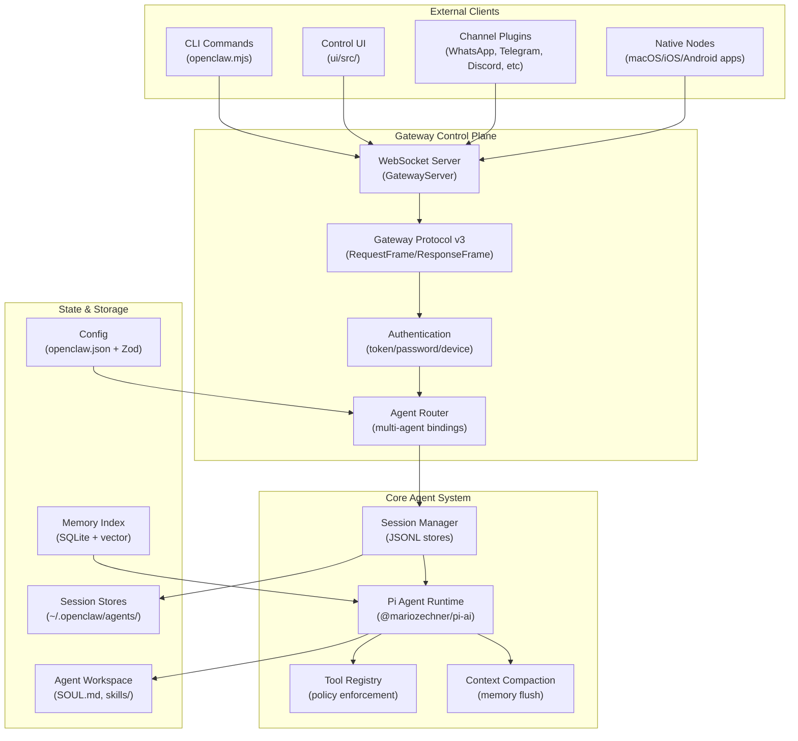
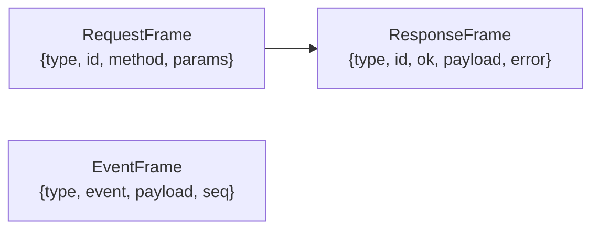
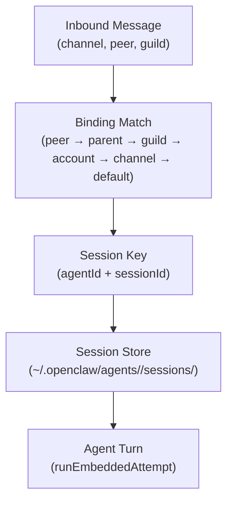
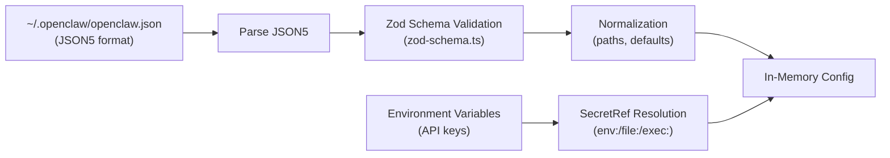
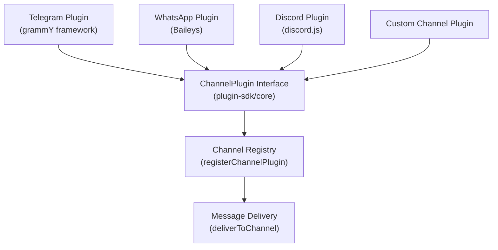
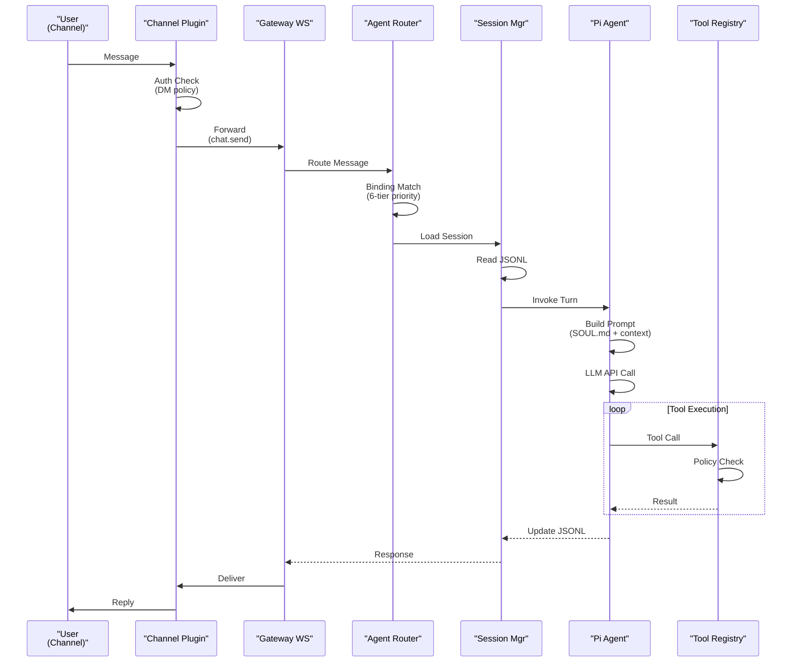
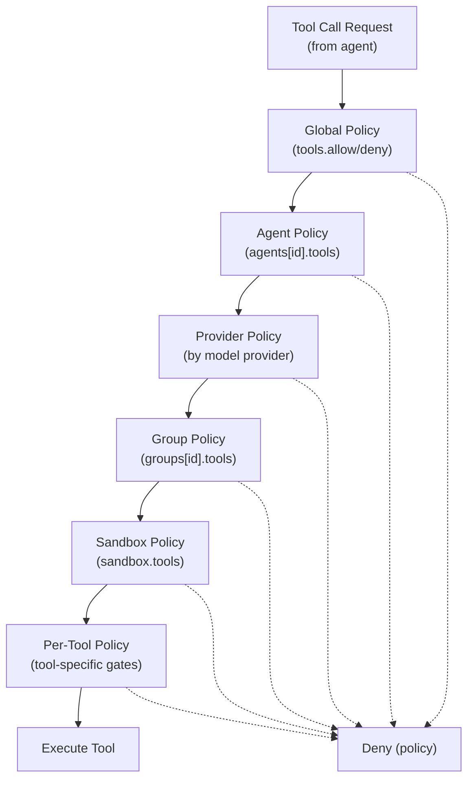
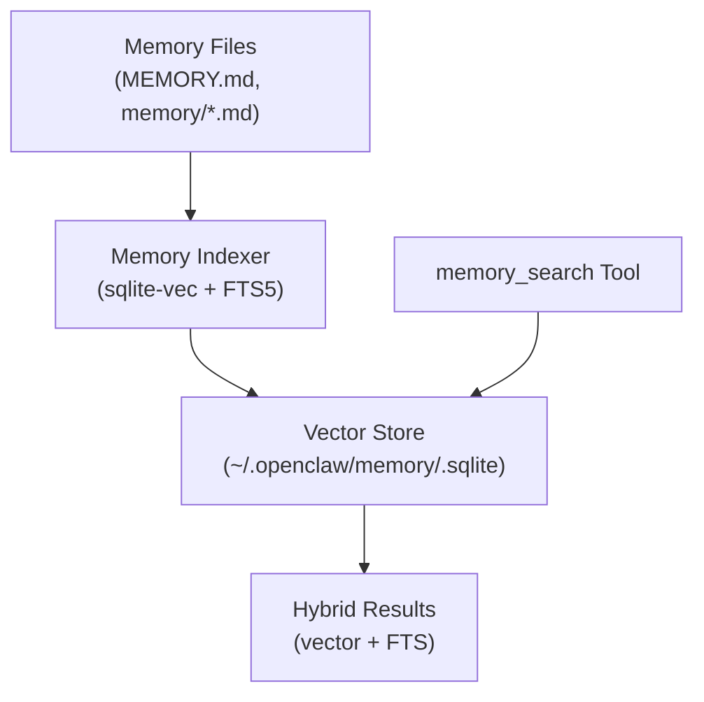
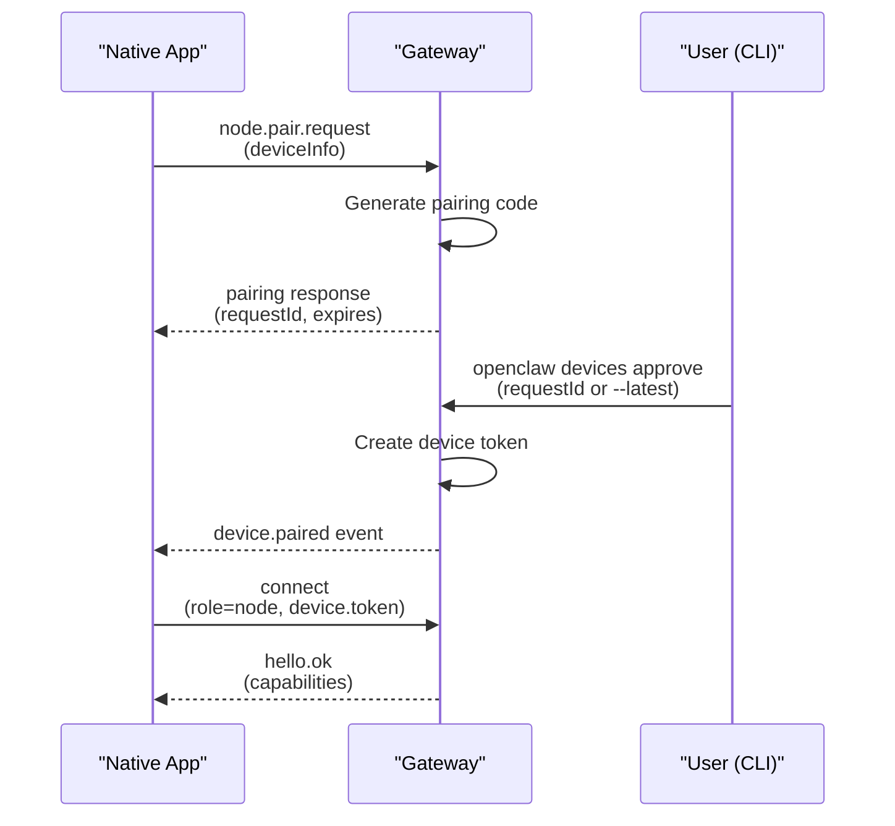
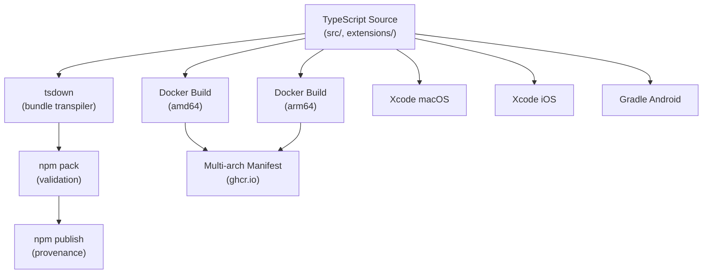

# System Architecture

<details>
<summary>Relevant source files</summary>

The following files were used as context for generating this wiki page:

- [.npmrc](.npmrc)
- [README.md](README.md)
- [apps/android/app/build.gradle.kts](apps/android/app/build.gradle.kts)
- [apps/ios/ShareExtension/Info.plist](apps/ios/ShareExtension/Info.plist)
- [apps/ios/Sources/Info.plist](apps/ios/Sources/Info.plist)
- [apps/ios/Tests/Info.plist](apps/ios/Tests/Info.plist)
- [apps/ios/WatchApp/Info.plist](apps/ios/WatchApp/Info.plist)
- [apps/ios/WatchExtension/Info.plist](apps/ios/WatchExtension/Info.plist)
- [apps/ios/project.yml](apps/ios/project.yml)
- [apps/macos/Sources/OpenClaw/Resources/Info.plist](apps/macos/Sources/OpenClaw/Resources/Info.plist)
- [apps/macos/Sources/OpenClawProtocol/GatewayModels.swift](apps/macos/Sources/OpenClawProtocol/GatewayModels.swift)
- [apps/shared/OpenClawKit/Sources/OpenClawProtocol/GatewayModels.swift](apps/shared/OpenClawKit/Sources/OpenClawProtocol/GatewayModels.swift)
- [assets/avatar-placeholder.svg](assets/avatar-placeholder.svg)
- [docs/channels/index.md](docs/channels/index.md)
- [docs/cli/index.md](docs/cli/index.md)
- [docs/cli/onboard.md](docs/cli/onboard.md)
- [docs/concepts/multi-agent.md](docs/concepts/multi-agent.md)
- [docs/docs.json](docs/docs.json)
- [docs/gateway/index.md](docs/gateway/index.md)
- [docs/gateway/troubleshooting.md](docs/gateway/troubleshooting.md)
- [docs/index.md](docs/index.md)
- [docs/platforms/mac/release.md](docs/platforms/mac/release.md)
- [docs/reference/wizard.md](docs/reference/wizard.md)
- [docs/start/getting-started.md](docs/start/getting-started.md)
- [docs/start/hubs.md](docs/start/hubs.md)
- [docs/start/onboarding.md](docs/start/onboarding.md)
- [docs/start/setup.md](docs/start/setup.md)
- [docs/start/wizard-cli-automation.md](docs/start/wizard-cli-automation.md)
- [docs/start/wizard-cli-reference.md](docs/start/wizard-cli-reference.md)
- [docs/start/wizard.md](docs/start/wizard.md)
- [docs/tools/skills-config.md](docs/tools/skills-config.md)
- [docs/tools/skills.md](docs/tools/skills.md)
- [docs/web/webchat.md](docs/web/webchat.md)
- [docs/zh-CN/channels/index.md](docs/zh-CN/channels/index.md)
- [extensions/bluebubbles/src/send-helpers.ts](extensions/bluebubbles/src/send-helpers.ts)
- [extensions/diagnostics-otel/package.json](extensions/diagnostics-otel/package.json)
- [extensions/discord/package.json](extensions/discord/package.json)
- [extensions/memory-lancedb/package.json](extensions/memory-lancedb/package.json)
- [extensions/nostr/package.json](extensions/nostr/package.json)
- [package.json](package.json)
- [pnpm-lock.yaml](pnpm-lock.yaml)
- [pnpm-workspace.yaml](pnpm-workspace.yaml)
- [scripts/clawtributors-map.json](scripts/clawtributors-map.json)
- [scripts/protocol-gen-swift.ts](scripts/protocol-gen-swift.ts)
- [scripts/update-clawtributors.ts](scripts/update-clawtributors.ts)
- [scripts/update-clawtributors.types.ts](scripts/update-clawtributors.types.ts)
- [src/agents/subagent-registry-cleanup.test.ts](src/agents/subagent-registry-cleanup.test.ts)
- [src/agents/tool-catalog.test.ts](src/agents/tool-catalog.test.ts)
- [src/agents/tool-catalog.ts](src/agents/tool-catalog.ts)
- [src/agents/tool-policy.plugin-only-allowlist.test.ts](src/agents/tool-policy.plugin-only-allowlist.test.ts)
- [src/agents/tool-policy.test.ts](src/agents/tool-policy.test.ts)
- [src/agents/tool-policy.ts](src/agents/tool-policy.ts)
- [src/agents/tools/gateway-tool.ts](src/agents/tools/gateway-tool.ts)
- [src/discord/monitor/thread-bindings.shared-state.test.ts](src/discord/monitor/thread-bindings.shared-state.test.ts)
- [src/gateway/method-scopes.test.ts](src/gateway/method-scopes.test.ts)
- [src/gateway/method-scopes.ts](src/gateway/method-scopes.ts)
- [src/gateway/protocol/index.ts](src/gateway/protocol/index.ts)
- [src/gateway/protocol/schema.ts](src/gateway/protocol/schema.ts)
- [src/gateway/protocol/schema/protocol-schemas.ts](src/gateway/protocol/schema/protocol-schemas.ts)
- [src/gateway/protocol/schema/types.ts](src/gateway/protocol/schema/types.ts)
- [src/gateway/server-methods-list.ts](src/gateway/server-methods-list.ts)
- [src/gateway/server-methods.ts](src/gateway/server-methods.ts)
- [src/gateway/server.ts](src/gateway/server.ts)
- [ui/package.json](ui/package.json)

</details>

## Purpose and Scope

This document provides a high-level architectural overview of OpenClaw, explaining how the major subsystems interact to deliver a self-hosted multi-agent AI gateway. It covers the core components, data flow patterns, and key abstractions that define the system architecture.

For detailed configuration mechanics, see [Configuration System](#2.3). For agent execution internals, see [Agent Execution Pipeline](#3.1). For channel integration patterns, see [Channel Architecture](#4.1).

---

## Architectural Overview

OpenClaw is built around a **central Gateway control plane** that coordinates multiple subsystems. The architecture follows a hub-and-spoke model where the Gateway acts as the single source of truth for sessions, routing, and state synchronization.



**Sources:** [package.json:1-473](), [src/gateway/server.ts:1-4](), [README.md:186-202](), diagrams provided

---

## Core Subsystems

### Gateway Control Plane

The Gateway is a WebSocket RPC server that implements protocol version 3. All client interactions flow through this central control plane.

**Key Components:**

| Component            | Location                                | Responsibility                           |
| -------------------- | --------------------------------------- | ---------------------------------------- |
| `GatewayServer`      | [src/gateway/server.impl.js]()          | WebSocket lifecycle, frame dispatch      |
| `startGatewayServer` | [src/gateway/server.impl.js]()          | Server initialization function           |
| Protocol schemas     | [src/gateway/protocol/schema.ts:1-19]() | Request/response/event frame definitions |
| Method handlers      | [src/gateway/server-methods.ts:1-24]()  | RPC method implementations               |

The Gateway binds to `gateway.bind` (default: loopback) and port `gateway.port` (default: 18789). It supports three authentication modes: `token`, `password`, and `none`.

**Protocol Frame Types:**



**Sources:** [src/gateway/protocol/index.ts:1-196](), [apps/shared/OpenClawKit/Sources/OpenClawProtocol/GatewayModels.swift:1-365](), [docs/gateway/index.md:1-19]()

---

### Agent Runtime & Session Management

Each incoming message is routed to an agent via a **6-tier binding precedence** system. Sessions are stored as JSONL files with per-agent isolation.

**Session Resolution Flow:**



**Session Storage:**

- **Format:** JSONL (one JSON object per line)
- **Location:** `~/.openclaw/agents/{agentId}/sessions/{sessionKey}.jsonl`
- **Isolation:** Per-agent directories prevent cross-agent contamination

**Agent Invocation:**

The core agent execution happens in `runEmbeddedAttempt` (Pi agent RPC mode), which:

1. Loads session history from JSONL
2. Constructs system prompt from `SOUL.md`, `AGENTS.md`, workspace files
3. Invokes LLM with tool schemas
4. Executes tool calls via `ToolRegistry`
5. Streams response deltas back to client
6. Appends turn to session JSONL

**Sources:** [README.md:186-202](), [docs/gateway/configuration.md](), [docs/concepts/multi-agent.md:1-18](), diagrams provided

---

### Configuration System

Configuration uses **JSON5** with **Zod schema validation**. The system supports hot-reload for most changes, with automatic migration from legacy formats.

**Configuration Pipeline:**



**Key Configuration Sections:**

| Section    | Purpose                 | Schema Location                                         |
| ---------- | ----------------------- | ------------------------------------------------------- |
| `agent`    | Default model selection | [src/gateway/protocol/schema/config.js]()               |
| `agents`   | Multi-agent definitions | [src/gateway/protocol/schema/agents-models-skills.js]() |
| `channels` | Channel accounts        | [src/gateway/protocol/schema/channels.js]()             |
| `gateway`  | Gateway bind/port/auth  | [src/gateway/protocol/schema/config.js]()               |
| `tools`    | Tool policies           | [src/gateway/protocol/schema/config.js]()               |

**Hot Reload Mechanism:**

The configuration system watches `openclaw.json` and applies safe changes without restart. Breaking changes (port, bind address) trigger a `SIGUSR1` signal to request manual restart.

**Sources:** [docs/gateway/configuration.md](), diagrams Diagram 4, [src/gateway/protocol/schema.ts:1-19]()

---

### Channel Plugin Architecture

Channels are implemented as **plugins** that integrate with the Gateway via a unified plugin SDK. Each channel plugin implements account resolution and message delivery.

**Channel Plugin Interface:**



**Plugin SDK Exports:**

The `openclaw/plugin-sdk` package provides subpath exports for each channel:

```
./plugin-sdk/telegram
./plugin-sdk/discord
./plugin-sdk/slack
./plugin-sdk/whatsapp
./plugin-sdk/signal
./plugin-sdk/imessage
... (20+ channel plugins)
```

**Account Resolution:**

Each channel plugin resolves an `accountId` from the incoming message context. This allows multiple accounts per channel (e.g., two WhatsApp instances with separate phone numbers).

**Sources:** [package.json:38-214](), [docs/channels/index.md](), [README.md:152-154]()

---

## Message Flow Architecture

The complete message flow from external channel to agent response involves multiple stages with policy enforcement at each layer.



**Message Flow Stages:**

1. **Channel Layer:** DM pairing, group mention gating, allowlist checks
2. **Gateway Layer:** Authentication (token/password/device), rate limiting
3. **Router Layer:** Binding resolution, agent selection
4. **Session Layer:** History loading, context window management
5. **Agent Layer:** System prompt construction, LLM invocation
6. **Tool Layer:** Policy enforcement, execution, result capture
7. **Delivery Layer:** Channel-specific formatting, chunking

**Sources:** Diagram 2 provided, [docs/channels/index.md](), [README.md:186-202]()

---

## Tool Execution & Policy Enforcement

Tools are the primary mechanism for agent-environment interaction. The tool system implements **multi-layered policy filtering** to control what agents can execute.

**Tool Policy Layers:**



**Tool Groups:**

The system defines semantic tool groups that can be allowed/denied as a unit:

| Group      | Tools Included                             |
| ---------- | ------------------------------------------ |
| `coding`   | `read`, `write`, `edit`, `exec`, `process` |
| `browser`  | `browser_*` actions                        |
| `nodes`    | `node.invoke`, device-local actions        |
| `canvas`   | `canvas.*` visual workspace                |
| `sessions` | `sessions_list`, `sessions_send`, etc.     |
| `cron`     | `cron_add`, `cron_remove`, etc.            |

**Tool Profile Presets:**

```typescript
tools.profile: "coding" | "research" | "safe" | "custom"
```

**Sources:** [src/agents/tool-policy.ts:1-6](), [src/agents/tools/gateway-tool.ts:1-3](), [docs/tools/skills.md:1-2]()

---

## Memory & Indexing

OpenClaw provides a hybrid memory system combining **SQLite FTS** (full-text search) and **vector embeddings** for semantic recall.

**Memory Architecture:**



**Indexing Process:**

1. Scan `MEMORY.md` and `memory/*.md` in workspace
2. Chunk documents into semantic units
3. Generate embeddings via configured provider
4. Store in SQLite with `sqlite-vec` extension
5. Build FTS5 index for keyword search

**Search Strategy:**

The `memory_search` tool performs **hybrid retrieval**:

- Vector similarity search for semantic matches
- FTS keyword search for exact phrases
- Result fusion and re-ranking

**Sources:** [package.json:178-180](), [docs/cli/index.md:295-300](), [extensions/memory-lancedb/package.json:1-18]()

---

## Native Client Architecture

Native macOS, iOS, and Android apps connect to the Gateway as **paired nodes** using the same WebSocket protocol with device-specific authentication.

**Node Pairing Flow:**



**Platform-Specific Builds:**

| Platform | Build System     | Output        | Distribution          |
| -------- | ---------------- | ------------- | --------------------- |
| macOS    | Xcode + SwiftPM  | `.app` bundle | DMG + Sparkle updates |
| iOS      | XcodeGen + Xcode | `.ipa`        | TestFlight/App Store  |
| Android  | Gradle + Kotlin  | `.apk`        | GitHub releases       |

**Node Capabilities:**

Nodes expose platform-specific capabilities via the `node.invoke` RPC method:

- `system.run` (macOS only)
- `camera.snap`, `camera.clip`
- `screen.record`
- `location.get`
- `canvas.*` (visual workspace)

**Sources:** [apps/ios/Sources/Info.plist:1-103](), [apps/android/app/build.gradle.kts:1-214](), [apps/ios/project.yml:1-99](), [docs/platforms/mac/release.md:1-23]()

---

## Build & Distribution Pipeline

OpenClaw uses a **monorepo** structure with platform-specific build targets orchestrated via npm scripts and CI workflows.

**Build Targets:**



**Package Structure:**

The npm package exports multiple subpaths for plugin SDK:

```
dist/index.js              # Main gateway entry
dist/plugin-sdk/index.js   # Plugin SDK core
dist/plugin-sdk/telegram.js
dist/plugin-sdk/discord.js
... (30+ plugin subpaths)
```

**CI Scope Detection:**

GitHub Actions workflows use path-based scope detection to skip irrelevant builds:

- Changes to `docs/**` → skip platform builds
- Changes to `apps/macos/**` → macOS build only
- Changes to `src/**` → full build matrix

**Sources:** [package.json:217-340](), [pnpm-workspace.yaml:1-7](), diagrams Diagram 5, [README.md:178-184]()

---

## Key Abstractions & Patterns

### Session Keys

A **session key** uniquely identifies a conversation context:

```
{agentId}:{channelId}:{peerId}[:{threadId}]
```

Examples:

- `default:whatsapp:+1234567890` (WhatsApp DM)
- `work:discord:guild123:thread456` (Discord thread)

### Agent Bindings

Bindings route inbound messages to agents using a **6-tier priority**:

1. **Peer binding** (exact match)
2. **Parent binding** (group → DM fallback)
3. **Guild binding** (Discord/Slack workspace)
4. **Account binding** (channel account)
5. **Channel binding** (entire channel)
6. **Default agent** (fallback)

### Tool Policy Resolution

Tool policies are resolved via **cascading precedence**:

```
Global → Agent → Provider → Group → Sandbox → Tool-Specific
```

Each layer can `allow`, `deny`, or defer to the next layer.

### Secret References

Sensitive values support **SecretRef** indirection:

```json
{
  "type": "SecretRef",
  "source": "env" | "file" | "exec",
  "target": "VAR_NAME" | "/path" | "command"
}
```

This prevents plaintext secrets in config files.

**Sources:** [docs/concepts/multi-agent.md:10-18](), [docs/gateway/configuration.md](), diagrams provided

---

## Technology Stack

| Layer          | Technology                     | Purpose                   |
| -------------- | ------------------------------ | ------------------------- |
| **Runtime**    | Node.js 22+                    | JavaScript execution      |
| **Language**   | TypeScript                     | Type-safe development     |
| **Build**      | tsdown                         | Fast bundler              |
| **Validation** | Zod                            | Runtime schema validation |
| **Database**   | SQLite + sqlite-vec            | Memory index storage      |
| **Protocol**   | WebSocket (ws)                 | Gateway RPC transport     |
| **Agent**      | Pi Agent (@mariozechner/pi-ai) | Embedded agent runtime    |
| **Channels**   | grammY, Baileys, discord.js    | Messaging SDKs            |
| **macOS**      | Swift + SwiftUI                | Native app framework      |
| **iOS**        | Swift + SwiftUI                | Native app framework      |
| **Android**    | Kotlin + Jetpack Compose       | Native app framework      |

**Sources:** [package.json:342-473](), [apps/android/app/build.gradle.kts:33-154](), [apps/ios/project.yml:1-99]()

---

This architecture provides the foundation for a self-hosted, multi-channel AI gateway with strong isolation guarantees, flexible routing, and extensible plugin support.
