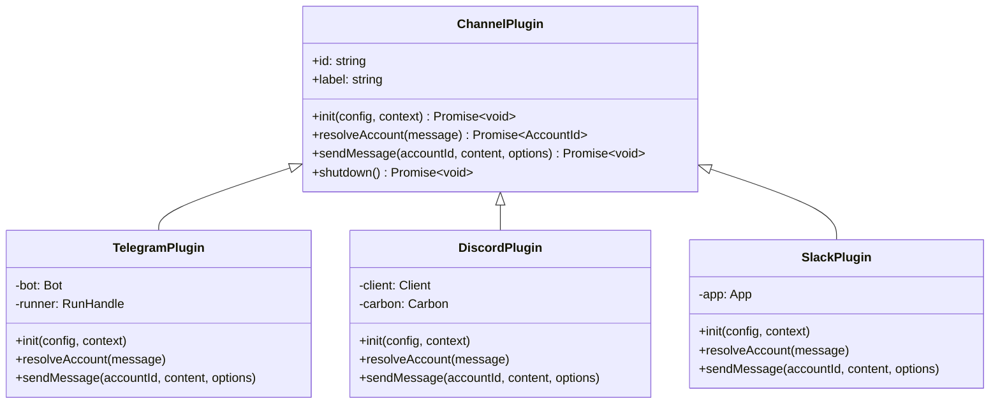
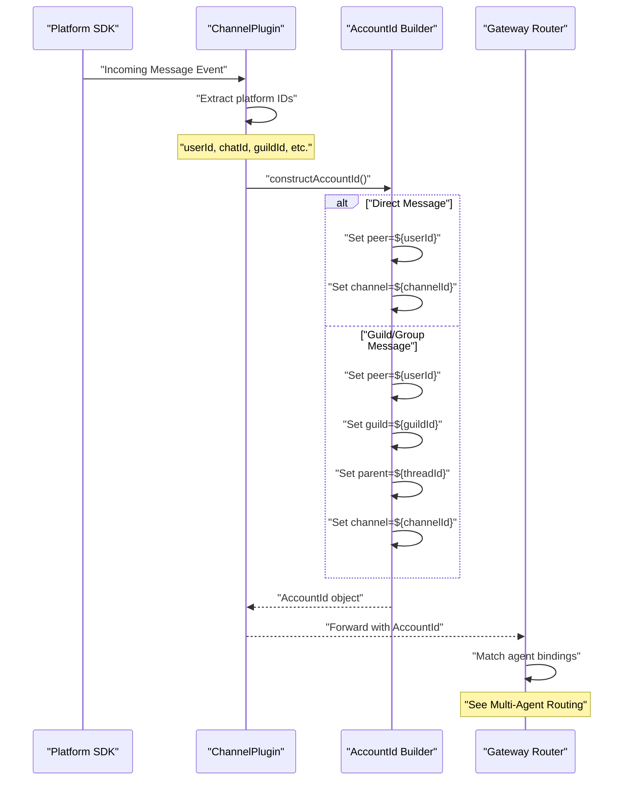
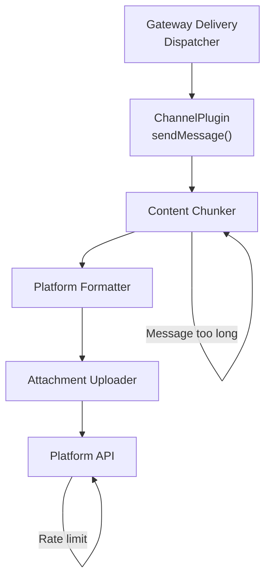
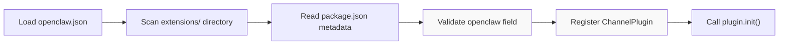
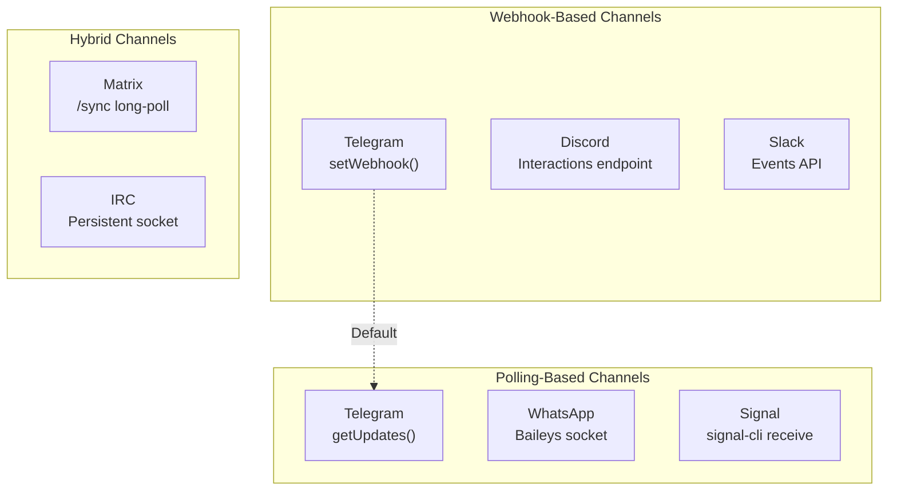
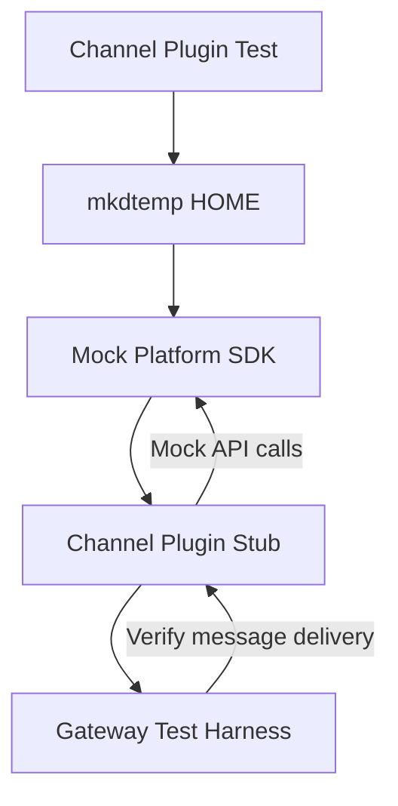
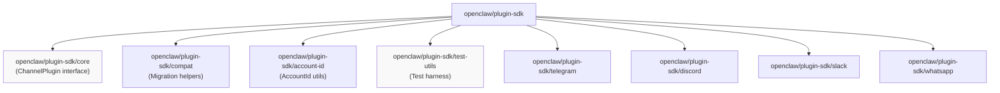

# Channel Plugins

<details>
<summary>Relevant source files</summary>

The following files were used as context for generating this wiki page:

- [.npmrc](.npmrc)
- [apps/android/app/build.gradle.kts](apps/android/app/build.gradle.kts)
- [apps/ios/ShareExtension/Info.plist](apps/ios/ShareExtension/Info.plist)
- [apps/ios/Sources/Info.plist](apps/ios/Sources/Info.plist)
- [apps/ios/Tests/Info.plist](apps/ios/Tests/Info.plist)
- [apps/ios/WatchApp/Info.plist](apps/ios/WatchApp/Info.plist)
- [apps/ios/WatchExtension/Info.plist](apps/ios/WatchExtension/Info.plist)
- [apps/ios/project.yml](apps/ios/project.yml)
- [apps/macos/Sources/OpenClaw/Resources/Info.plist](apps/macos/Sources/OpenClaw/Resources/Info.plist)
- [docs/platforms/mac/release.md](docs/platforms/mac/release.md)
- [extensions/diagnostics-otel/package.json](extensions/diagnostics-otel/package.json)
- [extensions/discord/package.json](extensions/discord/package.json)
- [extensions/memory-lancedb/package.json](extensions/memory-lancedb/package.json)
- [extensions/nostr/package.json](extensions/nostr/package.json)
- [package.json](package.json)
- [pnpm-lock.yaml](pnpm-lock.yaml)
- [pnpm-workspace.yaml](pnpm-workspace.yaml)
- [ui/package.json](ui/package.json)

</details>

Channel plugins extend OpenClaw to support messaging platforms by implementing platform-specific message receipt, account resolution, and message delivery. This page covers the plugin SDK structure, the `ChannelPlugin` interface, account resolution mechanisms, and integration patterns for channel implementations.

For general plugin architecture and discovery, see [Plugin Architecture](#9.1). For tool plugin development, see [Tool Plugins](#9.3). For channel-specific configuration and usage, see [Channel Architecture](#4.1).

---

## Plugin SDK Structure

The plugin SDK provides subpath exports for each channel integration, bundling platform-specific dependencies and utilities. Each channel plugin export includes the `ChannelPlugin` interface implementation and platform library wrappers.

**Available Channel Plugin Exports**

| Export Path                    | Platform        | Primary Library           | Extension Path        |
| ------------------------------ | --------------- | ------------------------- | --------------------- |
| `openclaw/plugin-sdk/telegram` | Telegram        | grammY                    | `extensions/telegram` |
| `openclaw/plugin-sdk/discord`  | Discord         | discord.js + Carbon       | `extensions/discord`  |
| `openclaw/plugin-sdk/slack`    | Slack           | @slack/bolt               | `extensions/slack`    |
| `openclaw/plugin-sdk/whatsapp` | WhatsApp        | Baileys                   | `extensions/whatsapp` |
| `openclaw/plugin-sdk/signal`   | Signal          | signal-cli wrapper        | `extensions/signal`   |
| `openclaw/plugin-sdk/imessage` | iMessage        | macOS bridging            | `extensions/imessage` |
| `openclaw/plugin-sdk/line`     | LINE            | @line/bot-sdk             | `extensions/line`     |
| `openclaw/plugin-sdk/msteams`  | Microsoft Teams | @microsoft/agents-hosting | `extensions/msteams`  |
| `openclaw/plugin-sdk/matrix`   | Matrix          | matrix-bot-sdk            | `extensions/matrix`   |
| `openclaw/plugin-sdk/irc`      | IRC             | Custom protocol           | `extensions/irc`      |
| `openclaw/plugin-sdk/nostr`    | Nostr           | nostr-tools               | `extensions/nostr`    |
| `openclaw/plugin-sdk/twitch`   | Twitch          | @twurple                  | `extensions/twitch`   |

Sources: [package.json:39-202]()

---

## ChannelPlugin Interface

All channel plugins implement the `ChannelPlugin` interface, which defines the contract for platform integration. The interface specifies methods for initialization, account resolution, message delivery, and cleanup.

**Core Interface Structure**



**Method Descriptions**

| Method                                     | Purpose                                                 | Required |
| ------------------------------------------ | ------------------------------------------------------- | -------- |
| `init(config, context)`                    | Initialize platform connection, register event handlers | Yes      |
| `resolveAccount(message)`                  | Map incoming message to `AccountId`                     | Yes      |
| `sendMessage(accountId, content, options)` | Deliver agent response to platform                      | Yes      |
| `shutdown()`                               | Clean up resources, close connections                   | Yes      |
| `updatePresence?(status)`                  | Update bot online status                                | No       |
| `handleCommand?(command, context)`         | Process channel-specific commands                       | No       |

Sources: [package.json:39-74](), extensions package.json files

---

## Account Resolution Flow

Channel plugins resolve incoming messages to `AccountId` objects that encode peer, guild, and channel context. The Gateway uses these identifiers for multi-agent routing (see [Multi-Agent Routing](#2.5)).

**Account Resolution Pipeline**



**AccountId Structure**

The `AccountId` type encodes hierarchical context for routing:

| Field     | Type      | Purpose                     | Example                   |
| --------- | --------- | --------------------------- | ------------------------- |
| `channel` | `string`  | Channel plugin identifier   | `"telegram"`, `"discord"` |
| `account` | `string`  | Bot account identifier      | `"bot1"`, `"main-bot"`    |
| `peer`    | `string`  | User/sender identifier      | `"telegram:123456789"`    |
| `guild`   | `string?` | Server/workspace identifier | `"discord:987654321"`     |
| `parent`  | `string?` | Thread/topic parent         | `"telegram:forum:456"`    |

Sources: [package.json:207-209]()

---

## Message Delivery Implementation

Channel plugins implement `sendMessage()` to deliver agent responses through platform APIs. The method handles content formatting, chunking, attachment uploads, and reply threading.

**Message Delivery Flow**



**Platform-Specific Considerations**

| Platform | Max Length | Markdown Support        | Attachment Method           | Rate Limits            |
| -------- | ---------- | ----------------------- | --------------------------- | ---------------------- |
| Telegram | 4096       | Partial (HTML/Markdown) | `sendPhoto`, `sendDocument` | 30 msg/sec per chat    |
| Discord  | 2000       | Full (subset)           | Embed attachments           | 5 msg/5sec per channel |
| Slack    | 40000      | mrkdwn format           | `files.upload`              | Tier-based             |
| WhatsApp | 4096       | None (plain text)       | Media message               | Dynamic                |
| Signal   | 2000       | None (plain text)       | Attachment field            | Client-dependent       |

**Example: Telegram chunking and formatting**

Telegram plugin chunks messages exceeding 4096 characters and formats code blocks using HTML:

```typescript
// extensions/telegram/src/telegram-channel-plugin.ts
async sendMessage(accountId: AccountId, content: string, options: SendOptions) {
  const chunks = chunkMessage(content, 4096);

  for (const chunk of chunks) {
    const formatted = markdownToTelegramHTML(chunk);

    await this.bot.api.sendMessage(accountId.peer, formatted, {
      parse_mode: 'HTML',
      reply_to_message_id: options.replyToMessageId,
    });
  }
}
```

Sources: [package.json:51-54]()

---

## Plugin Metadata and Registration

Channel plugins declare metadata in `package.json` under the `openclaw` field. This metadata drives UI selection, documentation links, and installation flows.

**Metadata Schema**

```typescript
{
  "openclaw": {
    "extensions": ["./index.ts"],           // Plugin entry point
    "channel": {
      "id": "nostr",                        // Unique channel identifier
      "label": "Nostr",                     // Display name
      "selectionLabel": "Nostr (NIP-04 DMs)", // Dropdown text
      "docsPath": "/channels/nostr",        // Documentation path
      "docsLabel": "nostr",                 // Docs link text
      "blurb": "Decentralized protocol...", // Short description
      "order": 55,                          // UI sort order
      "quickstartAllowFrom": true           // Enable quick setup
    },
    "install": {
      "npmSpec": "@openclaw/nostr",         // npm package name
      "localPath": "extensions/nostr",      // Monorepo path
      "defaultChoice": "npm"                // Install preference
    }
  }
}
```

**Plugin Discovery Process**



Sources: [extensions/nostr/package.json:1-36](), [extensions/discord/package.json:1-12]()

---

## Platform Integration Patterns

Channel plugins integrate platform-specific SDKs using common patterns for authentication, webhook handling, and polling.

**Authentication Strategies**

| Platform | Auth Method         | Config Field                    | Token Storage       |
| -------- | ------------------- | ------------------------------- | ------------------- |
| Telegram | Bot token           | `channels.telegram[].token`     | Plain or SecretRef  |
| Discord  | Bot token           | `channels.discord[].token`      | Plain or SecretRef  |
| Slack    | OAuth + App token   | `channels.slack[].appToken`     | Plain or SecretRef  |
| WhatsApp | Session credentials | `channels.whatsapp[].session`   | Encrypted files     |
| Signal   | Phone registration  | `channels.signal[].phone`       | signal-cli data dir |
| Matrix   | Access token        | `channels.matrix[].accessToken` | Plain or SecretRef  |

**Webhook vs. Polling**

Plugins choose between webhook-based (push) and polling-based (pull) message receipt:



**Example: Telegram grammY runner**

Telegram plugin uses grammY's `run()` helper with automatic long-polling:

```typescript
// extensions/telegram/src/telegram-channel-plugin.ts
import { Bot } from 'grammy';
import { run } from '@grammyjs/runner';

async init(config: TelegramChannelConfig, context: PluginContext) {
  this.bot = new Bot(config.token);

  this.bot.on('message', async (ctx) => {
    const accountId = this.resolveAccount(ctx);
    await context.gateway.ingestMessage(accountId, ctx.message.text);
  });

  this.runner = run(this.bot);  // Starts long-polling
}
```

Sources: [package.json:348-349](), [package.json:374]()

---

## Testing Channel Plugins

Channel plugin tests use isolated environment setup and mock platform SDKs to avoid external dependencies.

**Test Environment Isolation**



**Test Utilities**

The plugin SDK provides test utilities at `openclaw/plugin-sdk/test-utils`:

| Utility                     | Purpose            | Usage                     |
| --------------------------- | ------------------ | ------------------------- |
| `createMockGateway()`       | Stub Gateway RPC   | Capture ingested messages |
| `createMockPluginContext()` | Stub PluginContext | Provide logger, config    |
| `mockPlatformAPI()`         | Mock platform SDK  | Verify API call sequences |
| `createTestAccountId()`     | Generate AccountId | Test routing logic        |

**Example: Discord plugin test structure**

```typescript
// extensions/discord/src/discord-channel-plugin.test.ts
import { describe, it, expect, beforeEach } from 'vitest'
import {
  createMockGateway,
  createMockPluginContext,
} from 'openclaw/plugin-sdk/test-utils'
import { DiscordPlugin } from './discord-channel-plugin.js'

describe('DiscordPlugin', () => {
  let plugin: DiscordPlugin
  let mockGateway: ReturnType<typeof createMockGateway>

  beforeEach(async () => {
    mockGateway = createMockGateway()
    const context = createMockPluginContext({ gateway: mockGateway })

    plugin = new DiscordPlugin()
    await plugin.init({ token: 'mock-token' }, context)
  })

  it('resolves DM message to AccountId', async () => {
    const message = createMockDiscordDM('user123', 'Hello')
    const accountId = await plugin.resolveAccount(message)

    expect(accountId.channel).toBe('discord')
    expect(accountId.peer).toBe('discord:user123')
    expect(accountId.guild).toBeUndefined()
  })
})
```

Sources: [package.json:179-182]()

---

## Plugin SDK Exports Reference

The plugin SDK exports platform-specific modules and shared utilities through subpath exports.

**Core Plugin SDK Exports**



**Subpath Export Details**

| Export Path                      | Purpose                | Key Exports                                     |
| -------------------------------- | ---------------------- | ----------------------------------------------- |
| `openclaw/plugin-sdk`            | Main entry point       | `ChannelPlugin`, `PluginContext`                |
| `openclaw/plugin-sdk/core`       | Core interfaces        | `ChannelPlugin`, `SendOptions`, `IngestContext` |
| `openclaw/plugin-sdk/compat`     | Backward compatibility | `migrateV2Config()`, `deprecatedAPI`            |
| `openclaw/plugin-sdk/account-id` | AccountId utilities    | `parseAccountId()`, `formatAccountId()`         |
| `openclaw/plugin-sdk/telegram`   | Telegram integration   | `TelegramPlugin`, grammY re-exports             |
| `openclaw/plugin-sdk/discord`    | Discord integration    | `DiscordPlugin`, Carbon + discord.js            |
| `openclaw/plugin-sdk/slack`      | Slack integration      | `SlackPlugin`, @slack/bolt                      |

Sources: [package.json:38-215]()

---

## Implementation Checklist

When implementing a new channel plugin:

**Required Implementation**

- [ ] Implement `ChannelPlugin` interface
- [ ] Define `id` and `label` properties
- [ ] Implement `init()` with platform SDK setup
- [ ] Implement `resolveAccount()` for all message types (DM, group, thread)
- [ ] Implement `sendMessage()` with chunking and formatting
- [ ] Implement `shutdown()` with cleanup
- [ ] Add `package.json` metadata under `openclaw` field

**Recommended Implementation**

- [ ] Add error recovery for network failures
- [ ] Implement rate limiting (platform-specific)
- [ ] Support attachment uploads (images, files, voice)
- [ ] Handle reply threading (`replyToMessageId`)
- [ ] Add logging for message ingestion and delivery
- [ ] Implement `updatePresence()` for status updates
- [ ] Add integration tests with mock platform SDK

**Documentation Requirements**

- [ ] Add channel documentation page at `docs/channels/{channelId}.md`
- [ ] Update channel comparison table
- [ ] Document authentication setup
- [ ] Provide example configuration
- [ ] Link from [Channel Architecture](#4.1)

Sources: All sections above
