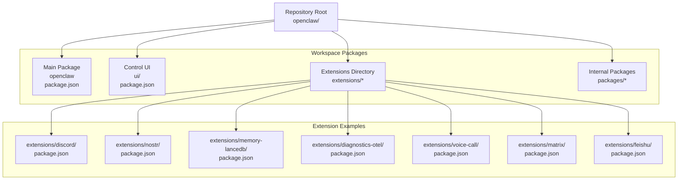
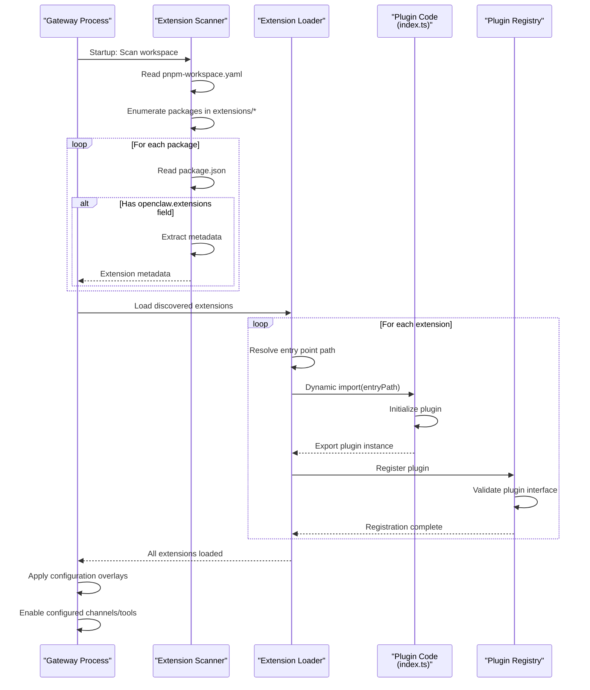
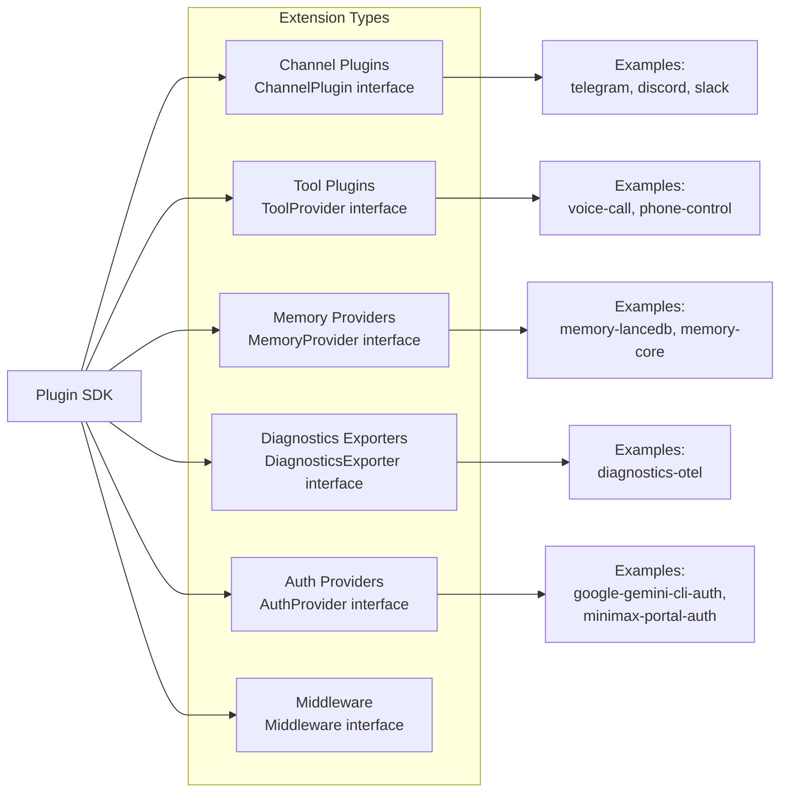

# Plugin SDK

<details>
<summary>Relevant source files</summary>

The following files were used as context for generating this wiki page:

- [.npmrc](.npmrc)
- [apps/android/app/build.gradle.kts](apps/android/app/build.gradle.kts)
- [apps/ios/ShareExtension/Info.plist](apps/ios/ShareExtension/Info.plist)
- [apps/ios/Sources/Info.plist](apps/ios/Sources/Info.plist)
- [apps/ios/Tests/Info.plist](apps/ios/Tests/Info.plist)
- [apps/ios/WatchApp/Info.plist](apps/ios/WatchApp/Info.plist)
- [apps/ios/WatchExtension/Info.plist](apps/ios/WatchExtension/Info.plist)
- [apps/ios/project.yml](apps/ios/project.yml)
- [apps/macos/Sources/OpenClaw/Resources/Info.plist](apps/macos/Sources/OpenClaw/Resources/Info.plist)
- [docs/platforms/mac/release.md](docs/platforms/mac/release.md)
- [extensions/diagnostics-otel/package.json](extensions/diagnostics-otel/package.json)
- [extensions/discord/package.json](extensions/discord/package.json)
- [extensions/memory-lancedb/package.json](extensions/memory-lancedb/package.json)
- [extensions/nostr/package.json](extensions/nostr/package.json)
- [package.json](package.json)
- [pnpm-lock.yaml](pnpm-lock.yaml)
- [pnpm-workspace.yaml](pnpm-workspace.yaml)
- [ui/package.json](ui/package.json)

</details>

The Plugin SDK provides APIs and utilities for extending OpenClaw with custom channel integrations, tool implementations, memory providers, and other extensions. This document covers the SDK's package structure, module exports, extension discovery system, and development workflow.

For creating specific channel plugins, see [Channel Plugins](#9.2). For implementing custom tools, see [Tool Plugins](#9.3). For the skills system (workspace/managed/bundled skills), see [Skills System](#5).

---

## Purpose and Scope

The Plugin SDK enables third-party developers to extend OpenClaw without modifying core code. It provides:

- **Channel Plugin APIs**: Interfaces for integrating messaging platforms (Telegram, Discord, Slack, WhatsApp, etc.)
- **Tool Plugin APIs**: Interfaces for adding agent-accessible tools and capabilities
- **Extension Framework**: Discovery, loading, and lifecycle management for extensions
- **Core Utilities**: Shared abstractions for account IDs, async queues, protocol types, and testing
- **Platform-Specific Modules**: Pre-built helpers for common platforms (e.g., grammY for Telegram, discord.js for Discord)

The SDK is distributed as part of the `openclaw` npm package with dedicated subpath exports for each module.

**Sources**: [package.json:1-474]()

---

## Package Structure and Exports

### Module Export Map

The Plugin SDK uses package.json subpath exports to expose modules without bundling them into a monolithic entry point. This allows plugins to import only what they need, reducing bundle size and build time.

```mermaid
graph TB
    subgraph "npm Package: openclaw"
        MainExport["Main Export<br/>openclaw"]
        PluginSDK["Plugin SDK Root<br/>openclaw/plugin-sdk"]
        Core["Core Utilities<br/>openclaw/plugin-sdk/core"]
        Compat["Compatibility Layer<br/>openclaw/plugin-sdk/compat"]
    end

    subgraph "Channel-Specific Modules"
        Telegram["openclaw/plugin-sdk/telegram"]
        Discord["openclaw/plugin-sdk/discord"]
        Slack["openclaw/plugin-sdk/slack"]
        Signal["openclaw/plugin-sdk/signal"]
        WhatsApp["openclaw/plugin-sdk/whatsapp"]
        iMessage["openclaw/plugin-sdk/imessage"]
        Other["... 20+ more channels"]
    end

    subgraph "Extension Modules"
        MemoryCore["openclaw/plugin-sdk/memory-core"]
        MemoryLance["openclaw/plugin-sdk/memory-lancedb"]
        DiagOTel["openclaw/plugin-sdk/diagnostics-otel"]
        VoiceCall["openclaw/plugin-sdk/voice-call"]
        DevicePair["openclaw/plugin-sdk/device-pair"]
    end

    subgraph "Utility Modules"
        TestUtils["openclaw/plugin-sdk/test-utils"]
        AccountID["openclaw/plugin-sdk/account-id"]
        AsyncQueue["openclaw/plugin-sdk/keyed-async-queue"]
    end

    PluginSDK --> Core
    PluginSDK --> Compat
    PluginSDK --> Telegram
    PluginSDK --> Discord
    PluginSDK --> Slack
    PluginSDK --> Signal
    PluginSDK --> WhatsApp
    PluginSDK --> iMessage
    PluginSDK --> Other
    PluginSDK --> MemoryCore
    PluginSDK --> MemoryLance
    PluginSDK --> DiagOTel
    PluginSDK --> VoiceCall
    PluginSDK --> DevicePair
    PluginSDK --> TestUtils
    PluginSDK --> AccountID
    PluginSDK --> AsyncQueue
```



**Sources**: [package.json:38-215]()

### File System Layout

The SDK modules are built from TypeScript sources and output to the `dist/plugin-sdk/` directory:

| Export Subpath                   | TypeScript Source              | Built Output                    | Purpose                       |
| -------------------------------- | ------------------------------ | ------------------------------- | ----------------------------- |
| `openclaw/plugin-sdk`            | `src/plugin-sdk/index.ts`      | `dist/plugin-sdk/index.js`      | Main SDK entry point          |
| `openclaw/plugin-sdk/core`       | `src/plugin-sdk/core.ts`       | `dist/plugin-sdk/core.js`       | Core types and utilities      |
| `openclaw/plugin-sdk/compat`     | `src/plugin-sdk/compat.ts`     | `dist/plugin-sdk/compat.js`     | Backwards compatibility layer |
| `openclaw/plugin-sdk/telegram`   | `src/plugin-sdk/telegram.ts`   | `dist/plugin-sdk/telegram.js`   | Telegram-specific helpers     |
| `openclaw/plugin-sdk/discord`    | `src/plugin-sdk/discord.ts`    | `dist/plugin-sdk/discord.js`    | Discord-specific helpers      |
| ...                              | ...                            | ...                             | ...                           |
| `openclaw/plugin-sdk/test-utils` | `src/plugin-sdk/test-utils.ts` | `dist/plugin-sdk/test-utils.js` | Testing utilities             |

Each module has a corresponding `.d.ts` file for TypeScript type definitions.

**Sources**: [package.json:38-215]()

---

## Extension Discovery and Loading

### Workspace Structure

Extensions are organized in a pnpm monorepo workspace:



**Sources**: [pnpm-workspace.yaml:1-6](), [package.json:1-474]()

### Extension Metadata Format

Extensions declare metadata in their `package.json` under the `openclaw` field. The Gateway discovers extensions by scanning workspace packages for this metadata.

#### Minimal Extension

```json
{
  "name": "@openclaw/discord",
  "openclaw": {
    "extensions": ["./index.ts"]
  }
}
```

**Sources**: [extensions/discord/package.json:1-12]()

#### Channel Plugin Extension

```json
{
  "name": "@openclaw/nostr",
  "openclaw": {
    "extensions": ["./index.ts"],
    "channel": {
      "id": "nostr",
      "label": "Nostr",
      "selectionLabel": "Nostr (NIP-04 DMs)",
      "docsPath": "/channels/nostr",
      "docsLabel": "nostr",
      "blurb": "Decentralized protocol; encrypted DMs via NIP-04.",
      "order": 55,
      "quickstartAllowFrom": true
    },
    "install": {
      "npmSpec": "@openclaw/nostr",
      "localPath": "extensions/nostr",
      "defaultChoice": "npm"
    },
    "releaseChecks": {
      "rootDependencyMirrorAllowlist": ["nostr-tools"]
    }
  }
}
```

**Sources**: [extensions/nostr/package.json:1-36]()

#### Memory Provider Extension

```json
{
  "name": "@openclaw/memory-lancedb",
  "openclaw": {
    "extensions": ["./index.ts"]
  },
  "dependencies": {
    "@lancedb/lancedb": "^0.26.2",
    "@sinclair/typebox": "0.34.48",
    "openai": "^6.27.0"
  }
}
```

**Sources**: [extensions/memory-lancedb/package.json:1-18]()

### Metadata Fields

| Field                    | Type               | Purpose                                      | Example                |
| ------------------------ | ------------------ | -------------------------------------------- | ---------------------- |
| `extensions`             | `string[]`         | Entry point files (relative to package root) | `["./index.ts"]`       |
| `channel.id`             | `string`           | Unique channel identifier                    | `"nostr"`              |
| `channel.label`          | `string`           | Display name                                 | `"Nostr"`              |
| `channel.selectionLabel` | `string`           | Label in UI pickers                          | `"Nostr (NIP-04 DMs)"` |
| `channel.docsPath`       | `string`           | Documentation URL path                       | `"/channels/nostr"`    |
| `channel.order`          | `number`           | Sort order in UI                             | `55`                   |
| `install.npmSpec`        | `string`           | npm install specifier                        | `"@openclaw/nostr"`    |
| `install.localPath`      | `string`           | Monorepo local path                          | `"extensions/nostr"`   |
| `install.defaultChoice`  | `"npm" \| "local"` | Default install source                       | `"npm"`                |

**Sources**: [extensions/nostr/package.json:10-34]()

---

## Module Organization

### Core Module (`openclaw/plugin-sdk/core`)

Provides foundational types and utilities used by all plugins:

- **Protocol Types**: Gateway RPC protocol schemas, message types, event types
- **Abstract Interfaces**: `ChannelPlugin`, `ToolProvider`, `MemoryProvider`
- **Configuration Schemas**: Zod schemas for plugin configuration
- **Account ID Helpers**: Canonicalization and validation for multi-platform account identifiers

### Compatibility Module (`openclaw/plugin-sdk/compat`)

Provides backwards compatibility shims for plugins written against older SDK versions. Allows gradual migration without breaking existing plugins.

### Platform-Specific Modules

Each platform module exports helpers, types, and utilities specific to that messaging platform:

| Module                         | Platform             | Key Exports                                                     |
| ------------------------------ | -------------------- | --------------------------------------------------------------- |
| `openclaw/plugin-sdk/telegram` | Telegram (grammY)    | Bot context helpers, account ID resolution, message formatters  |
| `openclaw/plugin-sdk/discord`  | Discord (discord.js) | Guild/channel/thread helpers, message threading, embed builders |
| `openclaw/plugin-sdk/slack`    | Slack (Bolt)         | Event adapters, block kit builders, thread resolution           |
| `openclaw/plugin-sdk/whatsapp` | WhatsApp (Baileys)   | Media handling, message crypto, jid utilities                   |
| `openclaw/plugin-sdk/signal`   | Signal               | Message crypto, group management, identity verification         |
| `openclaw/plugin-sdk/matrix`   | Matrix               | Room/event handling, E2EE utilities, federation helpers         |

**Sources**: [package.json:51-158]()

### Utility Modules

#### Account ID Module (`openclaw/plugin-sdk/account-id`)

Provides canonical account identifier parsing and formatting across platforms:

```typescript
// Example usage (conceptual)
import { parseAccountId, formatAccountId } from 'openclaw/plugin-sdk/account-id'

const accountId = parseAccountId('telegram:123456789')
// { platform: 'telegram', id: '123456789', raw: 'telegram:123456789' }
```

**Sources**: [package.json:207-210]()

#### Keyed Async Queue (`openclaw/plugin-sdk/keyed-async-queue`)

Provides per-key async queue for serializing operations:

```typescript
// Example usage (conceptual)
import { KeyedAsyncQueue } from 'openclaw/plugin-sdk/keyed-async-queue'

const queue = new KeyedAsyncQueue<string>()
await queue.run('user-123', async () => {
  // Operations for user-123 are serialized
})
```

**Sources**: [package.json:211-214]()

#### Test Utils (`openclaw/plugin-sdk/test-utils`)

Provides mocks, stubs, and test helpers for plugin development:

- Mock gateway connections
- Stub channel accounts
- Test message builders
- Isolation helpers

**Sources**: [package.json:179-182]()

---

## Extension Loading Flow



**Sources**: [pnpm-workspace.yaml:1-6](), [extensions/nostr/package.json:10-13](), [extensions/discord/package.json:6-10]()

---

## Development Workflow

### Creating a New Extension

1. **Create extension directory** in `extensions/<name>/`
2. **Initialize package.json** with `openclaw.extensions` metadata
3. **Implement entry point** (e.g., `index.ts`) that exports plugin
4. **Add to workspace** (pnpm-workspace.yaml automatically includes `extensions/*`)
5. **Install dependencies** via pnpm
6. **Import SDK modules** as needed

### Plugin Entry Point Structure

A typical plugin entry point exports a plugin instance that implements one or more plugin interfaces:

```typescript
// extensions/example/index.ts (conceptual)
import type { ChannelPlugin } from 'openclaw/plugin-sdk/core'
import { defineChannelPlugin } from 'openclaw/plugin-sdk'

export const plugin: ChannelPlugin = defineChannelPlugin({
  id: 'example',
  label: 'Example Channel',

  async start(config) {
    // Initialize channel connection
  },

  async stop() {
    // Cleanup
  },

  async sendMessage(accountId, message) {
    // Send message via platform API
  },

  // ... more methods
})
```

### Build System Integration

The main build script compiles all TypeScript sources (including plugin-sdk modules) and outputs to `dist/`:

```bash
# Build all modules including plugin-sdk
pnpm build

# Output structure:
# dist/
#   index.js              # Main entry
#   plugin-sdk/
#     index.js            # SDK entry
#     index.d.ts
#     core.js
#     core.d.ts
#     telegram.js
#     telegram.d.ts
#     ... (all plugin-sdk modules)
```

**Sources**: [package.json:226-227]()

---

## Platform-Specific Integrations

### Mobile Platforms

The SDK is consumed by native iOS and Android apps through the npm package distribution. Native apps use WebSocket RPC to communicate with the Gateway but can also import TypeScript utilities for shared logic.

#### iOS Integration

iOS apps use Swift Package Manager to depend on `OpenClawKit`, which includes protocol definitions and utilities. The iOS app project is configured with XcodeGen:

**Sources**: [apps/ios/project.yml:1-340](), [apps/ios/Sources/Info.plist:1-105]()

#### Android Integration

Android apps use Gradle to manage dependencies. The app includes Kotlin equivalents of SDK protocol types:

**Sources**: [apps/android/app/build.gradle.kts:1-214]()

### macOS Distribution

The macOS app bundles the Gateway and uses Sparkle for auto-updates. Plugin SDK modules are bundled into the app package:

**Sources**: [apps/macos/Sources/OpenClaw/Resources/Info.plist:1-82](), [docs/platforms/mac/release.md:1-91]()

---

## Plugin SDK vs. Skills System

The Plugin SDK and Skills System serve different purposes:

| Aspect        | Plugin SDK                                                    | Skills System                               |
| ------------- | ------------------------------------------------------------- | ------------------------------------------- |
| Purpose       | Extend Gateway infrastructure (channels, memory, diagnostics) | Add agent capabilities (tools, knowledge)   |
| Distribution  | npm packages in monorepo `extensions/*`                       | Directory-based (workspace/managed/bundled) |
| Loading       | Discovered via package.json metadata                          | Scanned from filesystem paths               |
| Configuration | `openclaw.extensions` in package.json                         | `skills.entries` in openclaw.json           |
| Precedence    | Workspace → managed → bundled                                 | Workspace → managed → bundled               |
| Examples      | Telegram plugin, LanceDB memory provider                      | Web scraper skill, calculator skill         |

See [Skills System](#5) for details on skill development and management.

**Sources**: [extensions/nostr/package.json:1-36](), [extensions/memory-lancedb/package.json:1-18]()

---

## TypeScript Type Generation

The SDK includes TypeScript definitions for all exported modules. The build process generates `.d.ts` files alongside JavaScript outputs:

```bash
# Generate plugin-sdk type definitions
pnpm build:plugin-sdk:dts

# Output: dist/plugin-sdk/**/*.d.ts files
```

Type definitions are generated via:

1. `tsc -p tsconfig.plugin-sdk.dts.json` - Generates base `.d.ts` files
2. `scripts/write-plugin-sdk-entry-dts.ts` - Generates root entry types

**Sources**: [package.json:228]()

---

## Extension Points Summary

The Plugin SDK exposes these primary extension points:



**Sources**: [package.json:51-215]()

---

This document provides an overview of the Plugin SDK's structure, exports, and extension mechanism. For implementing specific plugin types, see the subsections: [Channel Plugins](#9.2) for messaging platform integrations and [Tool Plugins](#9.3) for custom agent capabilities.
