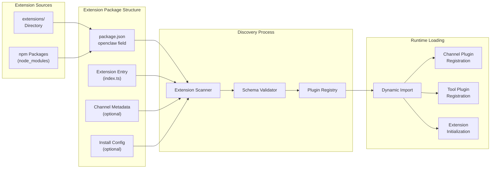
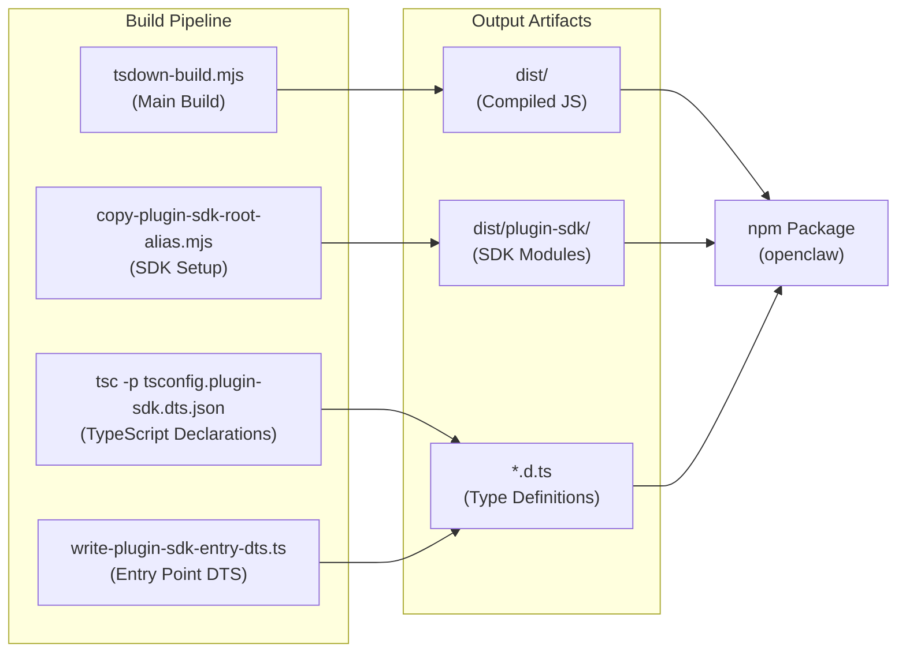
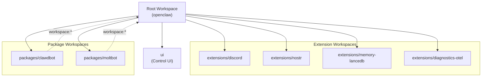

# Plugin Architecture

<details>
<summary>Relevant source files</summary>

The following files were used as context for generating this wiki page:

- [.npmrc](.npmrc)
- [apps/android/app/build.gradle.kts](apps/android/app/build.gradle.kts)
- [apps/ios/ShareExtension/Info.plist](apps/ios/ShareExtension/Info.plist)
- [apps/ios/Sources/Info.plist](apps/ios/Sources/Info.plist)
- [apps/ios/Tests/Info.plist](apps/ios/Tests/Info.plist)
- [apps/ios/WatchApp/Info.plist](apps/ios/WatchApp/Info.plist)
- [apps/ios/WatchExtension/Info.plist](apps/ios/WatchExtension/Info.plist)
- [apps/ios/project.yml](apps/ios/project.yml)
- [apps/macos/Sources/OpenClaw/Resources/Info.plist](apps/macos/Sources/OpenClaw/Resources/Info.plist)
- [docs/platforms/mac/release.md](docs/platforms/mac/release.md)
- [extensions/diagnostics-otel/package.json](extensions/diagnostics-otel/package.json)
- [extensions/discord/package.json](extensions/discord/package.json)
- [extensions/memory-lancedb/package.json](extensions/memory-lancedb/package.json)
- [extensions/nostr/package.json](extensions/nostr/package.json)
- [package.json](package.json)
- [pnpm-lock.yaml](pnpm-lock.yaml)
- [pnpm-workspace.yaml](pnpm-workspace.yaml)
- [ui/package.json](ui/package.json)

</details>

This document describes OpenClaw's plugin architecture, including the plugin SDK structure, extension discovery, and plugin types. The plugin system enables developers to extend OpenClaw with custom channel integrations, tools, and functionality.

For information about creating channel plugins specifically, see [Channel Plugins](#9.2). For tool plugin development, see [Tool Plugins](#9.3).

## Overview

OpenClaw's plugin architecture provides a modular extension system built around npm packages with TypeScript exports. Plugins are discovered from the `extensions/` directory and can provide:

- **Channel integrations** (Telegram, Discord, Slack, etc.)
- **Tool implementations** (custom agent capabilities)
- **Memory backends** (LanceDB, external stores)
- **Diagnostics exporters** (OpenTelemetry)
- **Other functionality** (device pairing, diffs, voice call, etc.)

The plugin SDK is distributed as subpath exports from the main `openclaw` package, allowing plugin authors to import specific functionality without pulling in the entire codebase.

**Sources:** [package.json:35-215](), [pnpm-workspace.yaml:1-18]()

## Plugin SDK Module Structure

```mermaid
graph TB
    MainPackage["openclaw<br/>(Main Package)"]

    subgraph "Core SDK Exports"
        PluginSDK["./plugin-sdk<br/>(Main Entry)"]
        Core["./plugin-sdk/core<br/>(Core Utilities)"]
        Compat["./plugin-sdk/compat<br/>(Compatibility Layer)"]
    end

    subgraph "Channel SDK Exports"
        Telegram["./plugin-sdk/telegram"]
        Discord["./plugin-sdk/discord"]
        Slack["./plugin-sdk/slack"]
        Signal["./plugin-sdk/signal"]
        WhatsApp["./plugin-sdk/whatsapp"]
        iMessage["./plugin-sdk/imessage"]
        Line["./plugin-sdk/line"]
        MSTeams["./plugin-sdk/msteams"]
        Matrix["./plugin-sdk/matrix"]
        IRC["./plugin-sdk/irc"]
        Nostr["./plugin-sdk/nostr"]
        Others["./plugin-sdk/...<br/>(15+ more channels)"]
    end

    subgraph "Feature SDK Exports"
        MemoryCore["./plugin-sdk/memory-core"]
        MemoryLanceDB["./plugin-sdk/memory-lancedb"]
        DiagnosticsOTel["./plugin-sdk/diagnostics-otel"]
        VoiceCall["./plugin-sdk/voice-call"]
        DevicePair["./plugin-sdk/device-pair"]
        Diffs["./plugin-sdk/diffs"]
        TestUtils["./plugin-sdk/test-utils"]
        AccountID["./plugin-sdk/account-id"]
        KeyedQueue["./plugin-sdk/keyed-async-queue"]
    end

    MainPackage --> PluginSDK
    MainPackage --> Core
    MainPackage --> Compat

    MainPackage --> Telegram
    MainPackage --> Discord
    MainPackage --> Slack
    MainPackage --> Signal
    MainPackage --> WhatsApp
    MainPackage --> iMessage
    MainPackage --> Line
    MainPackage --> MSTeams
    MainPackage --> Matrix
    MainPackage --> IRC
    MainPackage --> Nostr
    MainPackage --> Others

    MainPackage --> MemoryCore
    MainPackage --> MemoryLanceDB
    MainPackage --> DiagnosticsOTel
    MainPackage --> VoiceCall
    MainPackage --> DevicePair
    MainPackage --> Diffs
    MainPackage --> TestUtils
    MainPackage --> AccountID
    MainPackage --> KeyedQueue
```



The plugin SDK is organized into three categories:

| Category        | Purpose                          | Example Exports                                                                        |
| --------------- | -------------------------------- | -------------------------------------------------------------------------------------- |
| **Core SDK**    | Base utilities and interfaces    | `./plugin-sdk`, `./plugin-sdk/core`, `./plugin-sdk/compat`                             |
| **Channel SDK** | Channel-specific implementations | `./plugin-sdk/telegram`, `./plugin-sdk/discord`, etc. (20+ channels)                   |
| **Feature SDK** | Reusable functionality modules   | `./plugin-sdk/memory-core`, `./plugin-sdk/diagnostics-otel`, `./plugin-sdk/voice-call` |

Each subpath export provides both TypeScript type definitions (`.d.ts`) and JavaScript implementation (`.js`), enabling type-safe plugin development.

**Sources:** [package.json:38-215]()

## Extension Discovery and Registration



Extensions are discovered through the following mechanisms:

1. **Workspace scanning** - The `extensions/` directory is scanned for packages with `openclaw.extensions` field
2. **Package.json parsing** - Each extension declares entry points in its `package.json`
3. **Dynamic import** - Extension entry files are loaded at runtime via dynamic imports
4. **Registration** - Extensions register with the appropriate subsystems (channels, tools, etc.)

**Sources:** [pnpm-workspace.yaml:1-6](), [extensions/nostr/package.json:10-15](), [extensions/memory-lancedb/package.json:12-16]()

## Extension Package Format

### Basic Extension Structure

```json
{
  "name": "@openclaw/example-extension",
  "version": "2026.3.13",
  "type": "module",
  "openclaw": {
    "extensions": ["./index.ts"]
  }
}
```

### Channel Extension Structure

Channel extensions include additional metadata for UI integration:

```json
{
  "openclaw": {
    "extensions": ["./index.ts"],
    "channel": {
      "id": "nostr",
      "label": "Nostr",
      "selectionLabel": "Nostr (NIP-04 DMs)",
      "docsPath": "/channels/nostr",
      "docsLabel": "nostr",
      "blurb": "Decentralized protocol; encrypted DMs via NIP-04.",
      "order": 55,
      "quickstartAllowFrom": true
    },
    "install": {
      "npmSpec": "@openclaw/nostr",
      "localPath": "extensions/nostr",
      "defaultChoice": "npm"
    }
  }
}
```

**Channel metadata fields:**

| Field                 | Type      | Purpose                              |
| --------------------- | --------- | ------------------------------------ |
| `id`                  | `string`  | Unique channel identifier            |
| `label`               | `string`  | Display name for UI                  |
| `selectionLabel`      | `string`  | Label for channel selection dropdown |
| `docsPath`            | `string`  | Documentation URL path               |
| `blurb`               | `string`  | Short description for UI             |
| `order`               | `number`  | Sort order in UI listings            |
| `quickstartAllowFrom` | `boolean` | Enable quickstart wizard support     |

**Sources:** [extensions/nostr/package.json:1-35]()

## Extension Type Patterns

### Memory Backend Extensions

Memory backend extensions provide alternative storage implementations for agent memory:

```
extensions/memory-lancedb/
├── package.json          # Extension metadata
├── index.ts             # Extension entry point
└── src/                 # Implementation
```

Dependencies are declared in the extension's `package.json`:

```json
{
  "dependencies": {
    "@lancedb/lancedb": "^0.26.2",
    "@sinclair/typebox": "0.34.48",
    "openai": "^6.27.0"
  }
}
```

**Sources:** [extensions/memory-lancedb/package.json:1-17]()

### Diagnostics Extensions

Diagnostics extensions provide observability integrations:

```json
{
  "openclaw": {
    "extensions": ["./index.ts"]
  },
  "dependencies": {
    "@opentelemetry/api": "^1.9.0",
    "@opentelemetry/sdk-node": "^0.213.0",
    "@opentelemetry/exporter-logs-otlp-proto": "^0.213.0"
  }
}
```

**Sources:** [extensions/diagnostics-otel/package.json:1-24]()

### Bundled vs Managed Extensions

OpenClaw distinguishes between two extension distribution models:

| Model       | Location                | Distribution            | Example                  |
| ----------- | ----------------------- | ----------------------- | ------------------------ |
| **Bundled** | `extensions/` directory | Included in npm package | Discord, Telegram, Slack |
| **Managed** | External npm packages   | Installed separately    | Third-party extensions   |

Bundled extensions are included in the published `openclaw` package under the `extensions/` directory, while managed extensions are installed as separate npm dependencies.

**Sources:** [package.json:23-34](), [pnpm-workspace.yaml:5]()

## Build System Integration



The plugin SDK build process involves:

1. **Main build** (`tsdown-build.mjs`) - Compiles TypeScript source to JavaScript
2. **SDK alias setup** (`copy-plugin-sdk-root-alias.mjs`) - Creates plugin SDK module structure
3. **Type generation** (`tsconfig.plugin-sdk.dts.json`) - Generates TypeScript declaration files
4. **Entry point generation** (`write-plugin-sdk-entry-dts.ts`) - Creates main SDK entry point types

Build output is structured as:

```
dist/
├── index.js                    # Main package entry
├── plugin-sdk/
│   ├── index.js               # Plugin SDK main entry
│   ├── index.d.ts
│   ├── core.js                # Core utilities
│   ├── core.d.ts
│   ├── telegram.js            # Channel exports
│   ├── telegram.d.ts
│   └── ...                    # Additional modules
└── ...
```

**Sources:** [package.json:226-228]()

## Workspace Dependency Management



The workspace structure uses pnpm workspaces for monorepo management:

```yaml
packages:
  - . # Root package (openclaw)
  - ui # Control UI
  - packages/* # Packages (clawdbot, moltbot)
  - extensions/* # Plugin extensions
```

Extensions can reference the root workspace using `workspace:*` protocol:

```json
{
  "devDependencies": {
    "openclaw": "workspace:*"
  }
}
```

**Sources:** [pnpm-workspace.yaml:1-6]()

## Native Binary Dependency Management

OpenClaw uses pnpm's `onlyBuiltDependencies` to control which packages are allowed to execute build scripts, mitigating supply chain risks:

```yaml
onlyBuiltDependencies:
  - '@lydell/node-pty'
  - '@matrix-org/matrix-sdk-crypto-nodejs'
  - '@napi-rs/canvas'
  - '@tloncorp/api'
  - '@whiskeysockets/baileys'
  - authenticate-pam
  - esbuild
  - node-llama-cpp
  - protobufjs
  - sharp
```

This allowlist ensures only trusted packages with native addons can execute build scripts during installation. Extensions that require additional native dependencies must add them to this list.

**Sources:** [pnpm-workspace.yaml:7-18](), [package.json:452-464]()

## Platform-Specific Plugin Considerations

### Android Plugin Dependencies

Android native client apps (built with Kotlin/Gradle) can integrate with OpenClaw plugins through the Gateway WebSocket protocol. The Android app does not directly load Node.js plugins but can consume plugin-provided channels and tools via RPC.

**Sources:** [apps/android/app/build.gradle.kts:1-214]()

### iOS/macOS Plugin Dependencies

iOS and macOS native apps (built with Swift/Xcode) follow the same pattern as Android - they interact with plugins through the Gateway rather than loading them directly. The Swift codebase uses OpenClawKit framework for shared protocol implementations.

Native apps declare permissions for plugin functionality in their Info.plist files:

```xml
<key>NSCameraUsageDescription</key>
<string>OpenClaw can capture photos or short video clips when requested via the gateway.</string>
<key>NSLocalNetworkUsageDescription</key>
<string>OpenClaw discovers and connects to your OpenClaw gateway on the local network.</string>
```

**Sources:** [apps/ios/Sources/Info.plist:51-54](), [apps/ios/project.yml:1-340](), [apps/macos/Sources/OpenClaw/Resources/Info.plist:48-63]()

## Plugin SDK Import Patterns

### Monolithic Import Prevention

OpenClaw enforces plugin SDK import boundaries through custom linting:

```bash
# Lint check for monolithic imports
lint:plugins:no-monolithic-plugin-sdk-entry-imports
```

This prevents plugins from importing the entire SDK (`import * from 'openclaw/plugin-sdk'`) and instead requires targeted subpath imports:

```typescript
// ❌ Avoid - pulls in entire SDK
import { ChannelPlugin } from 'openclaw/plugin-sdk'

// ✅ Preferred - targeted import
import { ChannelPlugin } from 'openclaw/plugin-sdk/core'
```

**Sources:** [package.json:280]()

## Plugin Distribution

### npm Distribution

Plugins distributed via npm should:

1. Declare `openclaw` as a peer dependency (optional, for type imports)
2. Use the `openclaw` field in `package.json` for metadata
3. Export extension entry points as ES modules
4. Include TypeScript type definitions

### Local Development

For local plugin development, use the workspace protocol:

```json
{
  "devDependencies": {
    "openclaw": "workspace:*"
  }
}
```

This allows testing plugins against the local OpenClaw build without publishing.

**Sources:** [extensions/memory-lancedb/package.json:1-17]()

## Release and Versioning

Plugin extensions follow OpenClaw's CalVer versioning scheme (YYYY.M.D):

```json
{
  "name": "@openclaw/example",
  "version": "2026.3.13"
}
```

Release checks validate that bundled extensions mirror root package dependencies when appropriate:

```json
{
  "openclaw": {
    "releaseChecks": {
      "rootDependencyMirrorAllowlist": ["nostr-tools"]
    }
  }
}
```

**Sources:** [extensions/nostr/package.json:29-33]()
