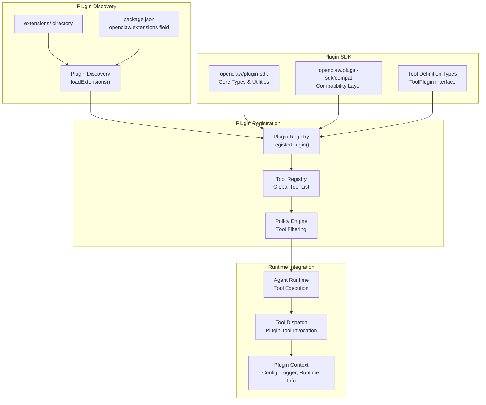
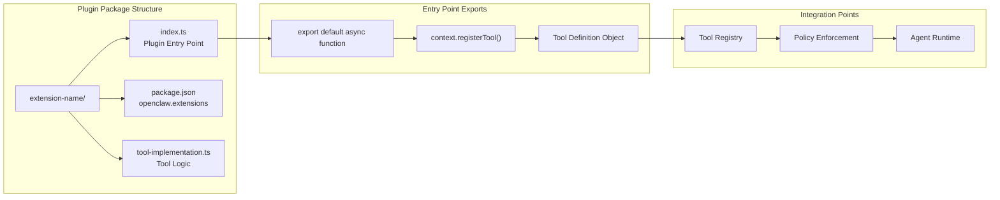
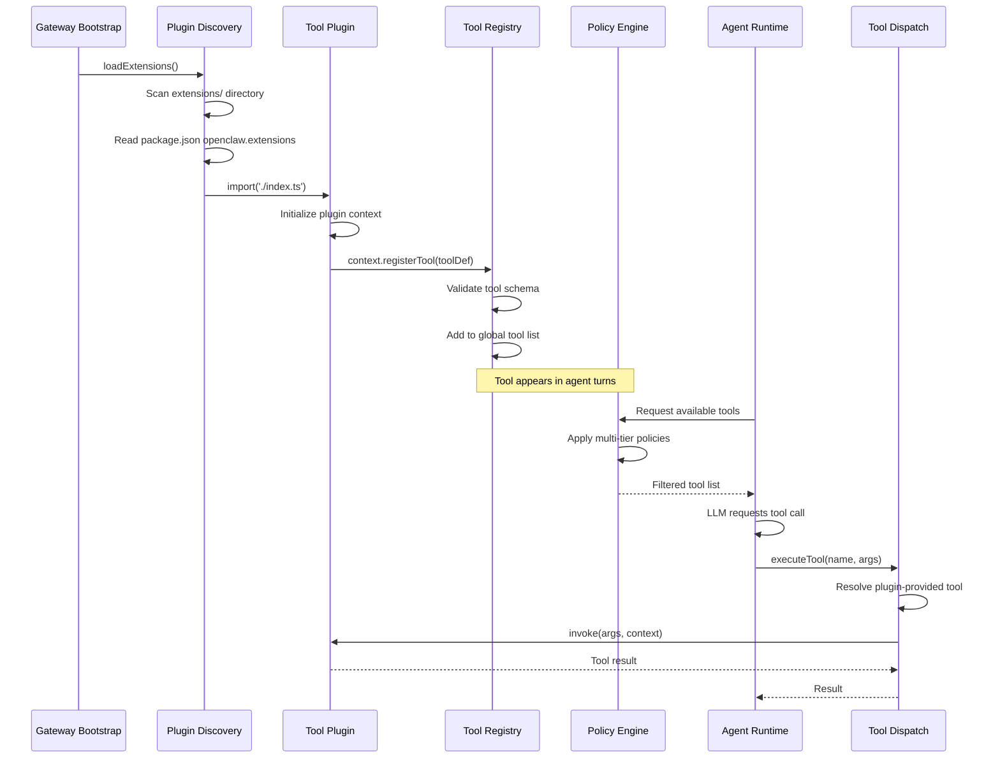
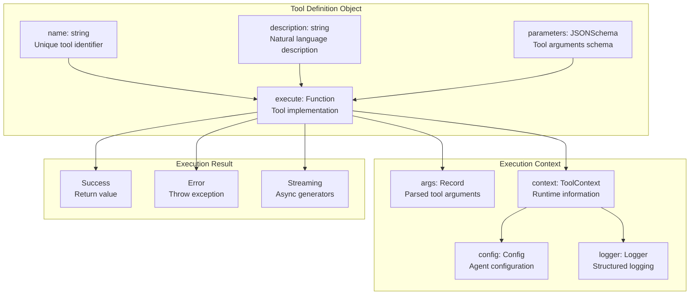
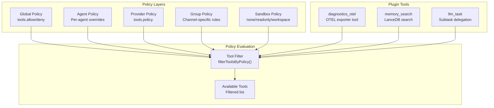

# Tool Plugins

<details>
<summary>Relevant source files</summary>

The following files were used as context for generating this wiki page:

- [.npmrc](.npmrc)
- [apps/android/app/build.gradle.kts](apps/android/app/build.gradle.kts)
- [apps/ios/ShareExtension/Info.plist](apps/ios/ShareExtension/Info.plist)
- [apps/ios/Sources/Info.plist](apps/ios/Sources/Info.plist)
- [apps/ios/Tests/Info.plist](apps/ios/Tests/Info.plist)
- [apps/ios/WatchApp/Info.plist](apps/ios/WatchApp/Info.plist)
- [apps/ios/WatchExtension/Info.plist](apps/ios/WatchExtension/Info.plist)
- [apps/ios/project.yml](apps/ios/project.yml)
- [apps/macos/Sources/OpenClaw/Resources/Info.plist](apps/macos/Sources/OpenClaw/Resources/Info.plist)
- [docs/platforms/mac/release.md](docs/platforms/mac/release.md)
- [extensions/diagnostics-otel/package.json](extensions/diagnostics-otel/package.json)
- [extensions/discord/package.json](extensions/discord/package.json)
- [extensions/memory-lancedb/package.json](extensions/memory-lancedb/package.json)
- [extensions/nostr/package.json](extensions/nostr/package.json)
- [package.json](package.json)
- [pnpm-lock.yaml](pnpm-lock.yaml)
- [pnpm-workspace.yaml](pnpm-workspace.yaml)
- [ui/package.json](ui/package.json)

</details>

Tool plugins extend OpenClaw agents with new capabilities by providing custom tool implementations that integrate with the tool registry and policy system. Unlike channel plugins (see [Channel Plugins](#9.2)), which add new messaging platform integrations, tool plugins add new actions agents can perform during execution.

For information about the broader plugin architecture and discovery system, see [Plugin Architecture](#9.1). For the skills system that complements plugin-provided tools, see [Skills System](#5).

## Purpose and Scope

Tool plugins allow developers to extend agent capabilities without modifying the core OpenClaw codebase. They provide:

- **Custom Tool Implementations**: New tools that appear alongside bundled tools like `read`, `write`, and `exec`
- **Integration Hooks**: Access to agent runtime context, configuration, and lifecycle events
- **Policy Integration**: Plugin-provided tools respect the same multi-layered policy enforcement as bundled tools
- **Modular Distribution**: Can be distributed via npm packages or local directories in the `extensions/` folder

This page covers tool plugin development, registration, and integration with the tool registry. It does not cover channel plugins or the skills system, which are documented separately.

**Sources**: [package.json:1-473](), high-level architecture diagrams

## Tool Plugin Architecture

Tool plugins follow a standardized structure that allows them to be discovered, loaded, and integrated into the agent runtime. The plugin SDK provides the necessary types and utilities for plugin development.



**Plugin Lifecycle**:

1. **Discovery**: Extensions are discovered from the `extensions/` directory and npm packages with `openclaw.extensions` field
2. **Registration**: Plugins register tools via the `registerPlugin()` function during initialization
3. **Policy Application**: Registered tools are subject to the same policy filtering as bundled tools
4. **Execution**: During agent turns, plugin-provided tools are dispatched alongside bundled tools

**Sources**: [package.json:38-214](), [pnpm-workspace.yaml:1-6]()

## Plugin SDK Exports

The plugin SDK provides multiple entry points for different plugin types and compatibility layers:

| Export Path                       | Purpose             | Key Exports                                                          |
| --------------------------------- | ------------------- | -------------------------------------------------------------------- |
| `openclaw/plugin-sdk`             | Main entry point    | Core plugin types, utilities, common interfaces                      |
| `openclaw/plugin-sdk/core`        | Core functionality  | Tool definition types, runtime context, base classes                 |
| `openclaw/plugin-sdk/compat`      | Compatibility layer | Legacy plugin format support, migration helpers                      |
| `openclaw/plugin-sdk/<extension>` | Extension-specific  | Isolated exports for specific plugins (e.g., `memory-core`, `diffs`) |

**Available Plugin SDK Modules** (from package.json exports):

```
openclaw/plugin-sdk/acpx
openclaw/plugin-sdk/diagnostics-otel
openclaw/plugin-sdk/diffs
openclaw/plugin-sdk/llm-task
openclaw/plugin-sdk/lobster
openclaw/plugin-sdk/memory-core
openclaw/plugin-sdk/memory-lancedb
openclaw/plugin-sdk/open-prose
openclaw/plugin-sdk/test-utils
```

Each module provides isolated exports for its specific functionality, preventing monolithic imports that would bloat the dependency graph.

**Sources**: [package.json:38-214]()

## Tool Plugin Structure

A minimal tool plugin consists of an entry point that exports an initialization function. The plugin SDK provides the necessary types for tool definitions.



**Example Plugin Package Structure**:

A tool plugin in `extensions/llm-task/` would have:

```
extensions/llm-task/
├── index.ts              # Entry point with default export
├── package.json          # Declares openclaw.extensions
├── tool-definition.ts    # Tool schema and implementation
└── README.md            # Plugin documentation
```

The `package.json` must include the `openclaw.extensions` field:

```json
{
  "openclaw": {
    "extensions": ["./index.ts"]
  }
}
```

**Sources**: [extensions/llm-task/package.json:1-13](), [extensions/diagnostics-otel/package.json:1-24](), [extensions/memory-lancedb/package.json:1-17]()

## Tool Plugin Registration Flow

The following diagram shows how tool plugins are discovered, registered, and integrated into the tool execution pipeline:



**Key Registration Steps**:

1. **Discovery Phase**: Gateway scans `extensions/` and reads `package.json` for plugins
2. **Import Phase**: Plugin entry points are dynamically imported
3. **Registration Phase**: Plugins call `context.registerTool()` to register tools
4. **Validation Phase**: Tool schemas are validated against expected formats
5. **Runtime Phase**: Registered tools appear in the tool list during agent execution

**Sources**: Plugin architecture overview from high-level diagrams

## Tool Definition Schema

Tool plugins define tools using a schema that matches the bundled tool format. The tool definition includes metadata, parameters, and an execution function.



**Tool Definition Fields**:

- `name`: Unique identifier for the tool (lowercase, alphanumeric with underscores)
- `description`: Human-readable description shown to LLMs in system prompts
- `parameters`: JSON Schema object defining expected arguments
- `execute`: Async function that implements the tool logic

The `execute` function receives:

- Parsed arguments matching the parameters schema
- Runtime context with configuration, logger, and agent metadata
- Access to other runtime services if needed

**Sources**: Inferred from tool registry architecture in high-level diagrams

## Policy Integration

Plugin-provided tools are subject to the same multi-layered policy enforcement as bundled tools. This ensures consistent security and access control across all tools.



**Policy Enforcement for Plugin Tools**:

1. **Global Allow/Deny**: Plugin tools can be globally allowed or denied via `tools.allow` and `tools.deny` configuration
2. **Agent-Level Overrides**: Individual agents can override global policies for plugin tools
3. **Provider-Specific Policies**: Different LLM providers can have different tool access rules
4. **Group Policies**: Channel groups can restrict plugin tool access
5. **Sandbox Isolation**: Plugin tools respect sandbox modes (none/readonly/workspace)

Plugin tools follow the same naming conventions for policy rules as bundled tools, using the tool name in policy configurations.

**Sources**: High-level architecture diagram showing "Tool Policies & Filtering" and multi-layered policy system

## Example Tool Plugins

The OpenClaw repository includes several example tool plugins that demonstrate different patterns:

### Memory Plugin (LanceDB)

Provides vector-based long-term memory search capabilities:

```
extensions/memory-lancedb/
├── index.ts              # Registers memory_search tool
├── package.json          # Dependencies: @lancedb/lancedb, openai
└── tool implementation   # Vector search logic
```

**Key Features**:

- Integrates with LanceDB for vector storage
- Provides `memory_search` tool for semantic recall
- Supports multiple embedding providers (OpenAI, etc.)

**Sources**: [extensions/memory-lancedb/package.json:1-17]()

### Diagnostics Plugin (OpenTelemetry)

Exports telemetry data to OTLP endpoints:

```
extensions/diagnostics-otel/
├── index.ts              # Registers diagnostic tools
├── package.json          # Dependencies: @opentelemetry/* packages
└── exporter logic        # OTLP trace/metric/log export
```

**Key Features**:

- Integrates with OpenTelemetry SDK
- Exports traces, metrics, and logs to OTLP collectors
- Configurable endpoints and sampling

**Sources**: [extensions/diagnostics-otel/package.json:1-24]()

### LLM Task Plugin

Enables agent-to-agent subtask delegation:

```
extensions/llm-task/
├── index.ts              # Registers llm_task tool
├── package.json          # Dependencies: @sinclair/typebox, ajv
└── task delegation       # Subtask execution logic
```

**Key Features**:

- Allows agents to spawn subtasks with isolated context
- Uses TypeBox for runtime validation
- Supports result aggregation from subtasks

**Sources**: [extensions/llm-task/package.json:1-13]()

## Development Guidelines

When developing tool plugins:

1. **Package Structure**: Place plugins in `extensions/<plugin-name>/` with a standard structure
2. **Dependencies**: Declare all dependencies in `package.json`, including the OpenClaw package version
3. **Entry Point**: Export a default async initialization function from `index.ts`
4. **Tool Naming**: Use lowercase with underscores for tool names (e.g., `memory_search`, `llm_task`)
5. **Schema Validation**: Define strict JSON schemas for tool parameters
6. **Error Handling**: Throw descriptive errors with actionable messages
7. **Logging**: Use the provided logger from the tool context
8. **Testing**: Include tests in the plugin directory
9. **Documentation**: Provide a README.md with usage examples

**Distribution Options**:

Plugins can be distributed via:

- **Local Directory**: Place in `extensions/` for workspace-local plugins
- **npm Package**: Publish with `@openclaw/<plugin-name>` naming convention
- **Monorepo**: Include in the pnpm workspace for development

**Sources**: [pnpm-workspace.yaml:1-6](), [extensions/memory-lancedb/package.json:1-17](), [extensions/diagnostics-otel/package.json:1-24]()

## Plugin SDK Import Best Practices

The plugin SDK uses subpath exports to prevent monolithic imports. Plugins should import from specific subpaths rather than the root:

```typescript
// ❌ Avoid: Imports all plugins
import { something } from 'openclaw/plugin-sdk'

// ✅ Preferred: Import specific modules
import { coreTypes } from 'openclaw/plugin-sdk/core'
import { memoryUtils } from 'openclaw/plugin-sdk/memory-core'
```

This prevents:

- Bloated dependency graphs when only a subset of functionality is needed
- Circular dependencies between plugins
- Unnecessary loading of unrelated plugin code

The codebase enforces this via a lint rule that checks for monolithic plugin-sdk entry imports.

**Sources**: [package.json:38-214]() showing subpath exports structure

## Platform-Specific Considerations

Tool plugins should be platform-aware when accessing platform-specific features:

### Node.js vs Browser

- Tool plugins run in Node.js on the gateway server
- Native modules (e.g., `@lancedb/lancedb`, `sharp`) are supported on the server
- Browser-based clients cannot directly execute tool plugins

### Native Dependencies

Some tool plugins may require native dependencies:

- **Android**: Native libraries must support multiple ABIs (armeabi-v7a, arm64-v8a, x86, x86_64)
- **iOS/macOS**: Must support arm64 and potentially x86_64 for universal builds
- **Docker**: Must support both amd64 and arm64 architectures

The build system handles native dependency compilation for each platform. Plugin developers should test across target platforms.

**Sources**: [apps/android/app/build.gradle.kts:68-71]() showing multi-ABI support, [apps/ios/project.yml:1-340]() showing platform configuration

## Plugin Testing

Tool plugins should include tests that verify:

1. **Tool Registration**: Plugin initializes and registers tools correctly
2. **Parameter Validation**: Tool arguments are validated against the schema
3. **Execution Logic**: Tool produces expected results for valid inputs
4. **Error Handling**: Tool throws appropriate errors for invalid inputs
5. **Policy Compliance**: Tool respects policy filters and sandbox modes

Tests can use the `openclaw/plugin-sdk/test-utils` module for common testing utilities.

**Sources**: [package.json:179-181]() showing test-utils plugin SDK export
