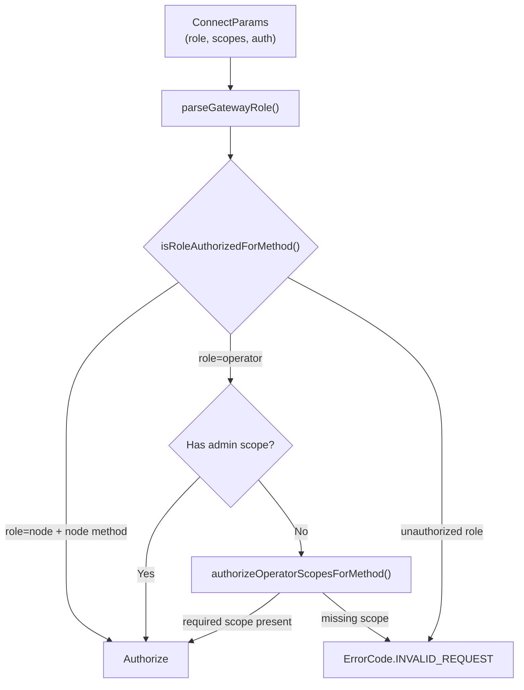
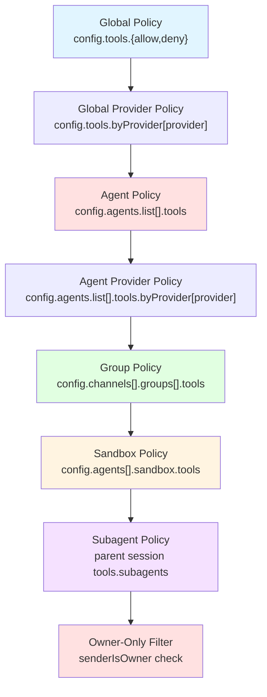
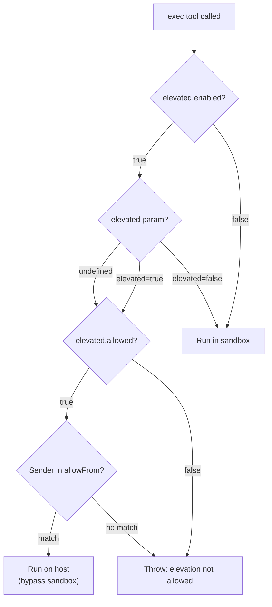

# Access Control Policies

<details>
<summary>Relevant source files</summary>

The following files were used as context for generating this wiki page:

- [apps/macos/Sources/OpenClawProtocol/GatewayModels.swift](apps/macos/Sources/OpenClawProtocol/GatewayModels.swift)
- [apps/shared/OpenClawKit/Sources/OpenClawProtocol/GatewayModels.swift](apps/shared/OpenClawKit/Sources/OpenClawProtocol/GatewayModels.swift)
- [docs/gateway/background-process.md](docs/gateway/background-process.md)
- [docs/gateway/doctor.md](docs/gateway/doctor.md)
- [scripts/protocol-gen-swift.ts](scripts/protocol-gen-swift.ts)
- [src/agents/bash-process-registry.test.ts](src/agents/bash-process-registry.test.ts)
- [src/agents/bash-process-registry.ts](src/agents/bash-process-registry.ts)
- [src/agents/bash-tools.test.ts](src/agents/bash-tools.test.ts)
- [src/agents/bash-tools.ts](src/agents/bash-tools.ts)
- [src/agents/pi-embedded-helpers.ts](src/agents/pi-embedded-helpers.ts)
- [src/agents/pi-embedded-runner.ts](src/agents/pi-embedded-runner.ts)
- [src/agents/pi-embedded-subscribe.ts](src/agents/pi-embedded-subscribe.ts)
- [src/agents/pi-tools-agent-config.test.ts](src/agents/pi-tools-agent-config.test.ts)
- [src/agents/pi-tools.ts](src/agents/pi-tools.ts)
- [src/agents/tool-catalog.test.ts](src/agents/tool-catalog.test.ts)
- [src/agents/tool-catalog.ts](src/agents/tool-catalog.ts)
- [src/agents/tool-policy.plugin-only-allowlist.test.ts](src/agents/tool-policy.plugin-only-allowlist.test.ts)
- [src/agents/tool-policy.test.ts](src/agents/tool-policy.test.ts)
- [src/agents/tool-policy.ts](src/agents/tool-policy.ts)
- [src/agents/tools/gateway-tool.ts](src/agents/tools/gateway-tool.ts)
- [src/cli/models-cli.test.ts](src/cli/models-cli.test.ts)
- [src/commands/doctor.ts](src/commands/doctor.ts)
- [src/discord/monitor/thread-bindings.shared-state.test.ts](src/discord/monitor/thread-bindings.shared-state.test.ts)
- [src/gateway/method-scopes.test.ts](src/gateway/method-scopes.test.ts)
- [src/gateway/method-scopes.ts](src/gateway/method-scopes.ts)
- [src/gateway/protocol/index.ts](src/gateway/protocol/index.ts)
- [src/gateway/protocol/schema.ts](src/gateway/protocol/schema.ts)
- [src/gateway/protocol/schema/protocol-schemas.ts](src/gateway/protocol/schema/protocol-schemas.ts)
- [src/gateway/protocol/schema/types.ts](src/gateway/protocol/schema/types.ts)
- [src/gateway/server-methods-list.ts](src/gateway/server-methods-list.ts)
- [src/gateway/server-methods.ts](src/gateway/server-methods.ts)
- [src/gateway/server.ts](src/gateway/server.ts)

</details>

OpenClaw implements a multi-layered access control system that governs who can access the Gateway, which methods they can invoke, which tools agents can use, and which channels can route messages to agents. This page documents the role-based access control (RBAC) for Gateway methods, tool policy enforcement, channel access rules, and elevated execution policies.

For sandboxing and filesystem isolation, see [Sandboxing](#10.2). For secret management and credential handling, see [Secret Management](#10.3).

---

## Gateway Roles & Scopes

OpenClaw's Gateway enforces two-tier authorization: **roles** (coarse-grained capabilities) and **scopes** (fine-grained method access).

### Roles

The Gateway supports two roles:

| Role       | Purpose                                  | Default Scopes             |
| ---------- | ---------------------------------------- | -------------------------- |
| `operator` | CLI, Control UI, mobile apps             | All scopes (configurable)  |
| `node`     | Paired devices with limited capabilities | Node-specific methods only |

Roles are declared in the `ConnectParams.role` field during WebSocket handshake. When omitted, the role defaults to `operator`.

**Sources:** [apps/shared/OpenClawKit/Sources/OpenClawProtocol/GatewayModels.swift:15-75](), [src/gateway/server-methods.ts:39-66]()

### Operator Scopes

Operator clients authenticate via token or password and may request specific scopes to limit their capabilities:

| Scope                | Methods                      | Use Case              |
| -------------------- | ---------------------------- | --------------------- |
| `operator.admin`     | Config write, wizard, update | Full control          |
| `operator.read`      | Status, logs, sessions list  | Read-only monitoring  |
| `operator.write`     | Send, agent, poll            | Message sending       |
| `operator.approvals` | Exec approval flow           | Approval-only clients |
| `operator.pairing`   | Device/node pairing          | Pairing-only clients  |

Scopes are declared in `ConnectParams.scopes`. When the client includes `operator.admin`, all methods are authorized. Otherwise, each method is checked against the scope allowlist.

**Sources:** [src/gateway/method-scopes.ts:1-20](), [apps/shared/OpenClawKit/Sources/OpenClawProtocol/GatewayModels.swift:15-75]()

### Authorization Flow



**Diagram: Gateway Method Authorization Flow**

**Sources:** [src/gateway/server-methods.ts:38-66](), [src/gateway/method-scopes.ts:108-162]()

---

## Method Scope Mapping

OpenClaw classifies every Gateway RPC method into scope groups. Unclassified methods are rejected.

### Method-to-Scope Table (Partial)

| Method                                                       | Required Scope       |
| ------------------------------------------------------------ | -------------------- |
| `health`                                                     | (none)               |
| `config.get`, `sessions.list`                                | `operator.read`      |
| `send`, `agent`, `poll`                                      | `operator.write`     |
| `config.apply`, `config.patch`, `wizard.start`, `update.run` | `operator.admin`     |
| `exec.approval.request`, `exec.approval.resolve`             | `operator.approvals` |
| `node.pair.approve`, `device.pair.reject`                    | `operator.pairing`   |

Node-role methods (e.g., `node.invoke.result`, `node.event`) bypass scope checks when the role is `node`.

**Sources:** [src/gateway/method-scopes.ts:22-117](), [src/gateway/server-methods-list.ts:4-134]()

### Least-Privilege Scope Resolution

The function `resolveLeastPrivilegeOperatorScopesForMethod()` returns the minimal scopes required for a given method. This is used by the CLI to request only necessary scopes when connecting:

- `sessions.resolve` → `["operator.read"]`
- `config.patch` → `["operator.admin"]`
- `poll` → `["operator.write"]`

**Sources:** [src/gateway/method-scopes.ts:164-198](), [src/gateway/method-scopes.test.ts:10-41]()

---

## Tool Access Control

Agents invoke tools (e.g., `read`, `exec`, `write`, `web_search`) with multi-layered policy enforcement. Policies are evaluated in a specific precedence order to determine which tools are available during an agent turn.

### Tool Policy Layers



**Diagram: Tool Policy Evaluation Pipeline**

**Sources:** [src/agents/pi-tools.ts:280-618](), [src/agents/tool-policy.ts:59-210]()

### Policy Precedence

Policies are merged using this precedence (highest to lowest):

1. **Profile policy** (resolved from `tools.profile`, e.g., `"minimal"`, `"coding"`, `"full"`)
2. **Provider-specific profile policy** (`tools.byProvider[provider].profile`)
3. **Global policy** (`tools.allow`, `tools.deny`)
4. **Global provider policy** (`tools.byProvider[provider]`)
5. **Agent policy** (per-agent overrides in `agents.list[].tools`)
6. **Agent provider policy** (`agents.list[].tools.byProvider[provider]`)
7. **Group policy** (channel-specific group rules)
8. **Sandbox policy** (when sandbox mode is active)
9. **Subagent policy** (when session is spawned by another session)
10. **Owner-only filter** (removes owner-only tools for non-owner senders)

Each layer is applied sequentially. If a layer defines both `allow` and `deny`, `deny` takes precedence. Undefined layers are skipped.

**Sources:** [src/agents/pi-tools.ts:571-591](), [src/agents/tool-policy.ts:75-210]()

### Tool Policy Configuration Example

```json
{
  "tools": {
    "profile": "coding",
    "allow": ["read", "write", "exec", "web_search"],
    "deny": ["bash"],
    "byProvider": {
      "google": {
        "allow": ["read"],
        "deny": ["exec"]
      }
    }
  },
  "agents": {
    "list": [
      {
        "id": "restricted",
        "tools": {
          "allow": ["read"],
          "deny": ["exec", "write"]
        }
      }
    ]
  }
}
```

In this example:

- Global policy: coding profile + explicit allow/deny
- Google provider: read-only
- Agent `restricted`: read-only (overrides global)

**Sources:** [src/agents/pi-tools-agent-config.test.ts:154-291]()

### Tool Profiles

Tool profiles are predefined policies for common use cases:

| Profile     | Allowed Tools                         |
| ----------- | ------------------------------------- |
| `minimal`   | `read`, `sessions_yield`              |
| `coding`    | All core tools except `message`       |
| `messaging` | Messaging + read + sessions + browser |
| `full`      | All tools                             |

Profiles expand to explicit `allow` lists via `resolveToolProfilePolicy()`.

**Sources:** [src/agents/tool-catalog.ts:1-26](), [src/agents/tool-policy.ts:1-16]()

### Owner-Only Tools

Certain tools are restricted to senders identified as "owners" (configured via `agents.list[].owners` or global `owners`):

- `cron` (schedule management)
- `gateway` (restart, config updates)
- `nodes` (node management)
- `whatsapp_login` (account linking)

When `senderIsOwner=false`, these tools are either removed from the tool list or wrapped to throw errors on execution.

**Sources:** [src/agents/tool-policy.ts:18-57](), [src/agents/pi-tools.ts:567-570]()

### Group Policy

Channel-specific group configurations (e.g., Telegram topics, Discord channels) can define tool restrictions:

```json
{
  "channels": {
    "telegram": {
      "groups": {
        "*": {
          "tools": {
            "allow": ["read", "web_search"],
            "deny": ["exec"]
          }
        }
      }
    }
  }
}
```

Group policies are resolved via `resolveGroupToolPolicy()` using the session's `groupId`, `groupChannel`, and `groupSpace`.

**Sources:** [src/agents/pi-tools.ts:298-310](), [src/agents/pi-tools.policy.ts:24-28]()

### Sandbox Tool Policy

When an agent runs in sandbox mode (`agents[].sandbox.mode="workspace"` or `"ro"`), sandbox tool policies override others:

```json
{
  "agents": {
    "list": [
      {
        "id": "sandboxed",
        "sandbox": {
          "mode": "workspace",
          "tools": {
            "allow": ["read", "write"],
            "deny": ["exec"]
          }
        }
      }
    ]
  }
}
```

The sandbox policy is applied **after** all other layers, ensuring sandboxed agents cannot escape tool restrictions.

**Sources:** [src/agents/pi-tools.ts:333-337](), [src/agents/pi-tools-agent-config.test.ts:477-521]()

### Subagent Policy

When an agent spawns a subagent via the `subagent` tool, the parent session can restrict tools available to the child:

```json
{
  "tools": {
    "subagents": {
      "tools": {
        "allow": ["read", "sessions_yield"]
      }
    }
  }
}
```

Subagent policies are resolved via `resolveSubagentToolPolicyForSession()` when the session key indicates a subagent (contains `:subagent:`).

**Sources:** [src/agents/pi-tools.ts:323-327](), [src/agents/pi-tools.policy.ts:24-28]()

---

## Channel Access Control

OpenClaw routes messages from messaging platforms (Telegram, Discord, WhatsApp, etc.) to agents based on channel-specific access policies.

### DM (Direct Message) Policies

Channels can restrict DM access to specific senders:

```json
{
  "channels": {
    "whatsapp": {
      "allowFrom": ["+15555550123", "+15555550456"]
    },
    "telegram": {
      "allowFrom": ["@alice", "123456789"]
    }
  }
}
```

Messages from senders not in `allowFrom` are rejected before reaching the agent router. When `allowFrom` is undefined or `["*"]`, all DMs are allowed.

**Sources:** [docs/gateway/doctor.md:238-247]()

### Group Chat Policies

Group chats have additional controls:

| Policy            | Configuration                                | Effect                             |
| ----------------- | -------------------------------------------- | ---------------------------------- |
| Require mention   | `channels[].groups["*"].requireMention=true` | Agent only responds when mentioned |
| History limit     | `messages.groupChat.historyLimit`            | Limit context turns for groups     |
| Tool restrictions | `channels[].groups["*"].tools`               | Per-group tool allowlists          |

Group policies apply to all groups by default (`"*"` wildcard) or specific group IDs.

**Sources:** [docs/gateway/doctor.md:115-120]()

### Sender Identification

The Gateway identifies message senders using platform-specific fields:

- **WhatsApp**: E.164 phone number (`+15555550123`)
- **Telegram**: Username (`@alice`) or numeric user ID (`123456789`)
- **Discord**: User ID (`123456789012345678`)

The sender's identifier is passed to the agent runtime as `senderId`, `senderName`, `senderUsername`, or `senderE164` depending on the platform. These fields are used for:

1. **Owner matching**: Check if sender is in `agents[].owners`
2. **Group policy resolution**: Match sender against channel-specific rules
3. **Elevated exec authorization**: Verify sender for elevated commands

**Sources:** [src/agents/pi-tools.ts:253-269](), [src/agents/bash-tools.test.ts:275-294]()

---

## Elevated Execution Policies

The `exec` tool can run commands with elevated privileges (host access, bypassing sandbox). Elevation must be explicitly enabled and authorized.

### Elevated Exec Configuration

```json
{
  "tools": {
    "exec": {
      "elevated": {
        "enabled": true,
        "allowed": true,
        "defaultLevel": "off",
        "allowFrom": {
          "whatsapp": ["+15555550123"],
          "telegram": ["@operator"]
        }
      }
    }
  }
}
```

| Field          | Purpose                                     |
| -------------- | ------------------------------------------- |
| `enabled`      | Master switch for elevated mode             |
| `allowed`      | Whether elevation requests are permitted    |
| `defaultLevel` | Default elevation state (`"off"` or `"on"`) |
| `allowFrom`    | Per-channel sender allowlists               |

**Sources:** [src/agents/bash-tools.exec.ts:60-73]()

### Elevated Execution Flow



**Diagram: Elevated Execution Authorization**

When elevation is rejected, the tool throws an error including the session key and provider for audit logging:

```
Elevated exec request denied. Context: provider=telegram session=agent:main:telegram:123456:main
```

**Sources:** [src/agents/bash-tools.exec.ts:273-318](), [src/agents/bash-tools.test.ts:275-356]()

### Elevation vs Sandbox

- **Sandbox mode** (`exec.host="sandbox"`): Commands run in a Docker container
- **Elevated mode** (`elevated=true`): Commands run on the host, bypassing sandbox

When both are configured, elevated mode takes precedence if authorized. If unauthorized, the command runs in the sandbox (or fails if `elevated.allowed=false`).

**Sources:** [src/agents/bash-tools.exec.ts:237-271]()

---

## Access Control Best Practices

### 1. Use Least-Privilege Scopes

CLI clients should request minimal scopes:

```bash
# Read-only monitoring
openclaw --scope operator.read status

# Config editing only
openclaw --scope operator.admin config set agents.list[0].model.primary gpt-4
```

The CLI defaults to all scopes (`CLI_DEFAULT_OPERATOR_SCOPES`) but can be restricted via `--scope` flags.

**Sources:** [src/gateway/method-scopes.ts:14-20]()

### 2. Restrict DM Access

Production deployments should use `allowFrom` allowlists:

```json
{
  "channels": {
    "telegram": {
      "allowFrom": ["@admin", "123456789"]
    }
  }
}
```

Doctor warns when a channel has `allowFrom=["*"]` (open to all DMs).

**Sources:** [docs/gateway/doctor.md:238-247]()

### 3. Layer Tool Policies

Use profiles for default policies and layer overrides for specific scenarios:

```json
{
  "tools": {
    "profile": "coding",
    "byProvider": {
      "google": {
        "profile": "minimal"
      }
    }
  },
  "agents": {
    "list": [
      {
        "id": "restricted",
        "tools": {
          "allow": ["read"]
        }
      }
    ]
  }
}
```

This gives Google models minimal tools, restricted agent read-only access, and coding tools for all others.

**Sources:** [src/agents/pi-tools-agent-config.test.ts:292-339]()

### 4. Audit Owner-Only Tool Usage

Owner-only tools (`cron`, `gateway`, `nodes`) should be monitored. Configure `agents.list[].owners` explicitly:

```json
{
  "agents": {
    "list": [
      {
        "id": "main",
        "owners": ["+15555550123"]
      }
    ]
  }
}
```

When `senderIsOwner=false`, these tools are removed from the tool list.

**Sources:** [src/agents/tool-policy.ts:31-57]()

### 5. Sandbox Untrusted Agents

Use sandbox mode with restrictive tool policies for agents handling untrusted input:

```json
{
  "agents": {
    "list": [
      {
        "id": "public",
        "sandbox": {
          "mode": "workspace",
          "tools": {
            "allow": ["read"],
            "deny": ["exec", "write"]
          }
        }
      }
    ]
  }
}
```

Sandbox mode isolates filesystem access and prevents host command execution.

**Sources:** [src/agents/pi-tools.ts:333-337](), [src/agents/pi-tools-agent-config.test.ts:477-521]()

---

## Code References

### Key Authorization Functions

| Function                             | Location                                 | Purpose                       |
| ------------------------------------ | ---------------------------------------- | ----------------------------- |
| `authorizeGatewayMethod()`           | [src/gateway/server-methods.ts:39-66]()  | Role/scope check for methods  |
| `authorizeOperatorScopesForMethod()` | [src/gateway/method-scopes.ts:119-162]() | Scope validation              |
| `isToolAllowedByPolicies()`          | [src/agents/pi-tools.policy.ts:1-23]()   | Multi-layer tool policy check |
| `applyOwnerOnlyToolPolicy()`         | [src/agents/tool-policy.ts:46-57]()      | Owner-only tool filtering     |
| `resolveEffectiveToolPolicy()`       | [src/agents/pi-tools.policy.ts:24-28]()  | Merge all policy layers       |
| `createOpenClawCodingTools()`        | [src/agents/pi-tools.ts:198-618]()       | Tool creation with policies   |

**Sources:** [src/gateway/server-methods.ts:38-158](), [src/gateway/method-scopes.ts:1-198](), [src/agents/pi-tools.ts:1-619](), [src/agents/tool-policy.ts:1-211]()

### Protocol Definitions

Gateway roles, scopes, and auth are defined in the Gateway Protocol v3:

- **Swift**: [apps/shared/OpenClawKit/Sources/OpenClawProtocol/GatewayModels.swift:1-75]()
- **TypeScript**: [src/gateway/protocol/schema/frames.ts:1-100]()

**Sources:** [apps/shared/OpenClawKit/Sources/OpenClawProtocol/GatewayModels.swift:1-277](), [src/gateway/protocol/schema/frames.ts:1-189]()

---

## Related Configuration

Access control policies are configured in `~/.openclaw/openclaw.json`:

- `gateway.auth.mode` — Authentication mode (`"token"`, `"password"`, `"tailscale"`)
- `gateway.auth.token` — Gateway token (or SecretRef)
- `gateway.auth.password` — Gateway password (or SecretRef)
- `tools.allow`, `tools.deny` — Global tool policies
- `tools.profile` — Default tool profile (`"minimal"`, `"coding"`, `"full"`)
- `tools.byProvider` — Provider-specific overrides
- `tools.exec.elevated` — Elevated execution policies
- `agents.list[].tools` — Per-agent tool policies
- `agents.list[].owners` — Owner allowlists
- `agents.list[].sandbox.tools` — Sandbox tool policies
- `channels[].allowFrom` — DM sender allowlists
- `channels[].groups[].tools` — Group chat tool policies

For full configuration schema, see [Configuration Reference](#2.3.1).

**Sources:** [src/config/types.tools.ts:1-100](), [src/config/types.gateway.ts:1-50](), [src/config/types.channels.ts:1-75]()
