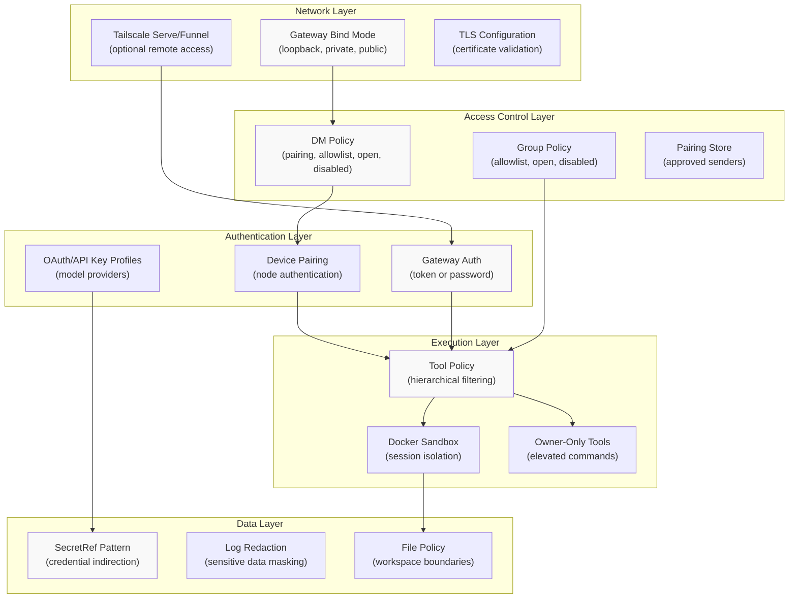
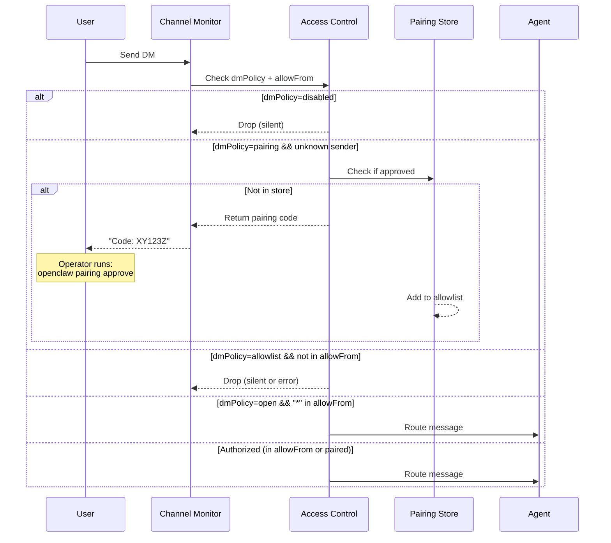
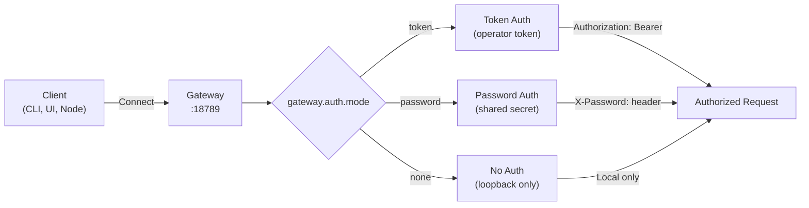
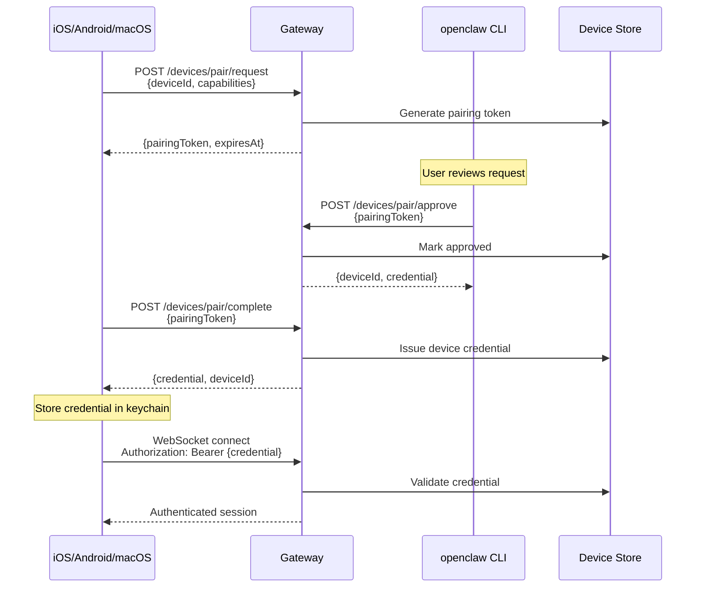
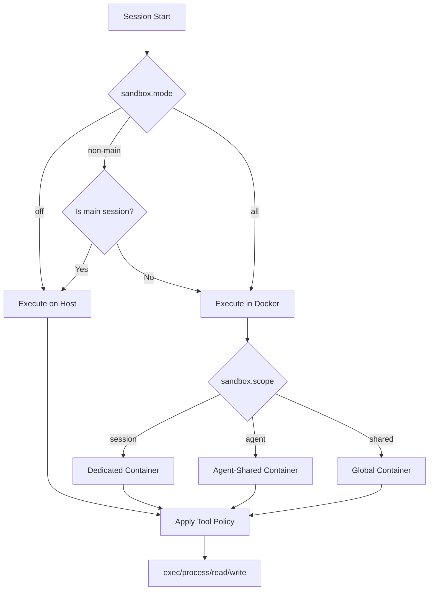
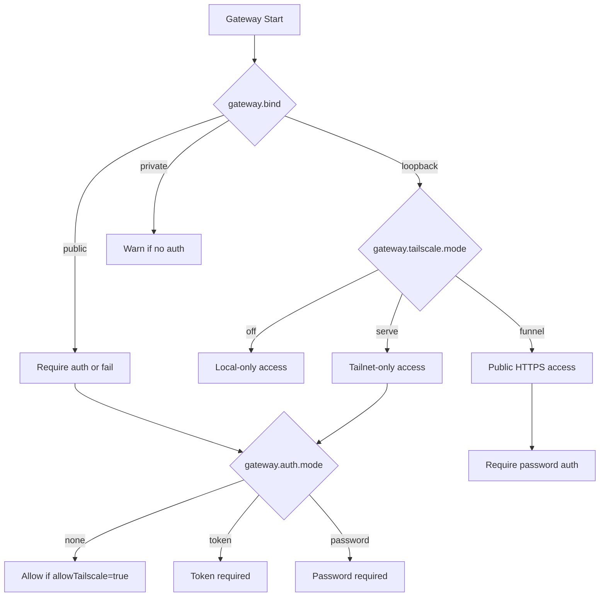
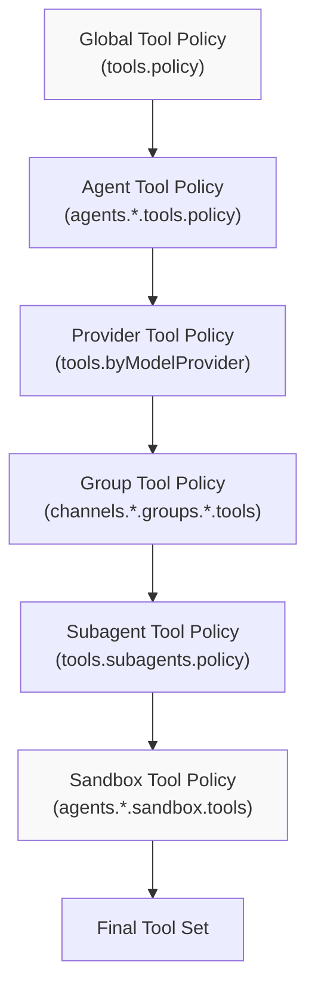

# Security

<details>
<summary>Relevant source files</summary>

The following files were used as context for generating this wiki page:

- [apps/macos/Sources/OpenClawProtocol/GatewayModels.swift](apps/macos/Sources/OpenClawProtocol/GatewayModels.swift)
- [apps/shared/OpenClawKit/Sources/OpenClawProtocol/GatewayModels.swift](apps/shared/OpenClawKit/Sources/OpenClawProtocol/GatewayModels.swift)
- [docs/gateway/background-process.md](docs/gateway/background-process.md)
- [docs/gateway/doctor.md](docs/gateway/doctor.md)
- [scripts/protocol-gen-swift.ts](scripts/protocol-gen-swift.ts)
- [src/agents/bash-process-registry.test.ts](src/agents/bash-process-registry.test.ts)
- [src/agents/bash-process-registry.ts](src/agents/bash-process-registry.ts)
- [src/agents/bash-tools.test.ts](src/agents/bash-tools.test.ts)
- [src/agents/bash-tools.ts](src/agents/bash-tools.ts)
- [src/agents/pi-embedded-helpers.ts](src/agents/pi-embedded-helpers.ts)
- [src/agents/pi-embedded-runner.ts](src/agents/pi-embedded-runner.ts)
- [src/agents/pi-embedded-subscribe.ts](src/agents/pi-embedded-subscribe.ts)
- [src/agents/pi-tools-agent-config.test.ts](src/agents/pi-tools-agent-config.test.ts)
- [src/agents/pi-tools.ts](src/agents/pi-tools.ts)
- [src/agents/tool-catalog.test.ts](src/agents/tool-catalog.test.ts)
- [src/agents/tool-catalog.ts](src/agents/tool-catalog.ts)
- [src/agents/tool-policy.plugin-only-allowlist.test.ts](src/agents/tool-policy.plugin-only-allowlist.test.ts)
- [src/agents/tool-policy.test.ts](src/agents/tool-policy.test.ts)
- [src/agents/tool-policy.ts](src/agents/tool-policy.ts)
- [src/agents/tools/gateway-tool.ts](src/agents/tools/gateway-tool.ts)
- [src/cli/models-cli.test.ts](src/cli/models-cli.test.ts)
- [src/commands/doctor.ts](src/commands/doctor.ts)
- [src/discord/monitor/thread-bindings.shared-state.test.ts](src/discord/monitor/thread-bindings.shared-state.test.ts)
- [src/gateway/method-scopes.test.ts](src/gateway/method-scopes.test.ts)
- [src/gateway/method-scopes.ts](src/gateway/method-scopes.ts)
- [src/gateway/protocol/index.ts](src/gateway/protocol/index.ts)
- [src/gateway/protocol/schema.ts](src/gateway/protocol/schema.ts)
- [src/gateway/protocol/schema/protocol-schemas.ts](src/gateway/protocol/schema/protocol-schemas.ts)
- [src/gateway/protocol/schema/types.ts](src/gateway/protocol/schema/types.ts)
- [src/gateway/server-methods-list.ts](src/gateway/server-methods-list.ts)
- [src/gateway/server-methods.ts](src/gateway/server-methods.ts)
- [src/gateway/server.ts](src/gateway/server.ts)

</details>

## Purpose and Scope

This document describes OpenClaw's security architecture, including access control, authentication, sandboxing, secret management, and network hardening. It provides an operational overview of the security model and references to implementation details.

For specific access policy mechanics (DM/group policies, pairing flows), see [Access Control Policies](#7.1). For sandbox configuration and Docker isolation, see [Sandboxing](#7.2).

---

## Security Model Overview

OpenClaw implements defense-in-depth security with multiple layers:



**Threat Model:**

- **Untrusted inbound messages**: DM senders and group members are treated as untrusted by default.
- **Privileged tool access**: Tools like `exec`, `browser`, and `nodes` can perform privileged operations on the host.
- **Credential exposure**: API keys, tokens, and OAuth credentials must be protected from logs and config leakage.
- **Network exposure**: Gateway must be safe to expose remotely (via Tailscale or public bind).

Sources: [README.md:112-125](), [docs/gateway/configuration.md:112-125]()

---

## Access Control Policies

OpenClaw enforces access control at the channel level using **DM policies** and **group policies**.

### DM Policy Modes

| Mode                | Behavior                                                               | Use Case                |
| ------------------- | ---------------------------------------------------------------------- | ----------------------- |
| `pairing` (default) | Unknown senders receive a one-time pairing code; operator must approve | Multi-user deployments  |
| `allowlist`         | Only senders in `allowFrom` or paired store can message                | Locked-down access      |
| `open`              | All inbound DMs accepted (requires `allowFrom: ["*"]`)                 | Public bots (high risk) |
| `disabled`          | All DMs ignored                                                        | Group-only bots         |

### Group Policy Modes

| Mode                  | Behavior                                               |
| --------------------- | ------------------------------------------------------ |
| `allowlist` (default) | Only groups matching configured allowlist              |
| `open`                | Bypass group allowlists (mention-gating still applies) |
| `disabled`            | Block all group/room messages                          |



**Configuration:**

```json5
{
  channels: {
    telegram: {
      dmPolicy: 'pairing', // pairing | allowlist | open | disabled
      allowFrom: ['tg:123456'], // sender allowlist
      groupPolicy: 'allowlist', // allowlist | open | disabled
      groups: {
        '*': { requireMention: true },
        '-1001234567890': {
          allowFrom: ['@admin'], // per-group sender allowlist
        },
      },
    },
  },
}
```

See [Access Control Policies](#7.1) for detailed policy resolution and pairing workflows.

Sources: [docs/gateway/configuration-reference.md:22-43](), [src/config/runtime-group-policy.ts:1-39](), [README.md:112-125]()

---

## Authentication and Authorization

### Gateway Authentication

The Gateway WebSocket/HTTP surface requires authentication when exposed beyond loopback:



**Configuration:**

```json5
{
  gateway: {
    auth: {
      mode: 'token', // token | password | none
      token: { $ref: 'env/GATEWAY_TOKEN' },
      allowTailscale: true, // trust Tailscale identity headers
    },
    bind: 'loopback', // loopback | private | public
  },
}
```

**Breaking change (v2026.3.3):** Gateway auth now requires explicit `gateway.auth.mode` when both `token` and `password` are configured.

Sources: [CHANGELOG.md:34](), [src/config/zod-schema.ts:419-452](), [docs/gateway/configuration-reference.md:688-736]()

### Device Pairing

Native clients (iOS, Android, macOS) authenticate as **nodes** via device pairing:

1. Client generates pairing request with device ID
2. Gateway returns pairing token (expires in 5 minutes)
3. User approves via CLI: `openclaw devices approve <token>`
4. Client exchanges token for long-lived device credential



Sources: [src/gateway/pairing-device.ts:1-50](), [docs/gateway/pairing.md:1-100]()

### Model Provider Authentication

API keys and OAuth tokens for model providers use **auth profiles**:

```json5
{
  auth: {
    profiles: {
      'openai-main': {
        provider: 'openai',
        mode: 'api_key', // api_key | oauth | token
        email: 'user@example.com',
      },
      'anthropic-oauth': {
        provider: 'anthropic',
        mode: 'oauth',
      },
    },
    order: {
      openai: ['openai-main', 'openai-fallback'],
      anthropic: ['anthropic-oauth'],
    },
  },
}
```

Profile credentials are stored separately and resolved at runtime via the auth resolver.

Sources: [src/config/zod-schema.ts:346-372](), [src/agents/model-auth.ts:1-100]()

---

## Sandboxing

OpenClaw can isolate agent sessions in Docker containers to limit host access. See [Sandboxing](#7.2) for full details.

**Modes:**

- `off`: No sandboxing (tools run on host)
- `non-main`: Sandbox only non-main sessions (groups, channels)
- `all`: Sandbox all sessions including direct chat

**Scopes:**

- `session`: One container per session (highest isolation)
- `agent`: One container per agent (shared across sessions)
- `shared`: One global container (lowest isolation)



**Default tool policy in sandbox:**

- **Allow:** `bash`, `process`, `read`, `write`, `edit`, `sessions_*`
- **Deny:** `browser`, `canvas`, `nodes`, `cron`, `discord`, `gateway`

Sources: [README.md:333-338](), [src/agents/sandbox.ts:1-100](), [src/agents/pi-embedded-runner/sandbox-info.ts:1-50]()

---

## Secret Management

OpenClaw uses the **SecretRef pattern** to avoid storing credentials directly in config files.

### SecretRef Schema

```typescript
type SecretRef =
  | { $ref: string } // "env/VAR_NAME" | "file/path" | "exec/command"
  | string // plain value (discouraged for secrets)
```

**Examples:**

```json5
{
  channels: {
    telegram: {
      botToken: { $ref: 'env/TELEGRAM_BOT_TOKEN' },
    },
    discord: {
      token: { $ref: 'file/~/.openclaw/credentials/discord.token' },
    },
  },
  gateway: {
    auth: {
      token: { $ref: 'exec/pass openclaw/gateway-token' },
    },
  },
}
```

### Credential Storage

**Channel credentials** are stored in `~/.openclaw/credentials/<channel>/`:

- WhatsApp: Baileys session files
- Telegram: Bot tokens (if using `tokenFile`)
- Signal: signal-cli config

**OAuth tokens** are stored in `~/.openclaw/auth/` as encrypted JSON files (per provider).

**File permissions:**

- Credential files: `0600` (owner read/write only)
- Credential directories: `0700` (owner access only)
- Cron store/backup: `0600` (enforced since v2026.3.3)

Sources: [src/config/zod-schema.ts:10-11](), [CHANGELOG.md:63](), [src/config/types.secrets.ts:1-50]()

---

## Network Security

### Gateway Bind Modes

| Mode                 | Behavior                 | Risk                    |
| -------------------- | ------------------------ | ----------------------- |
| `loopback` (default) | Bind to `127.0.0.1` only | Low (local-only access) |
| `private`            | Bind to all private IPs  | Medium (LAN exposure)   |
| `public`             | Bind to `0.0.0.0`        | High (requires auth)    |

**Enforcement:**

- When `gateway.tailscale.mode` is `serve` or `funnel`, bind must be `loopback`.
- When `gateway.bind` is `public`, `gateway.auth.mode` must be `token` or `password`.



### Tailscale Integration

OpenClaw can auto-configure Tailscale **Serve** (tailnet-only) or **Funnel** (public):

```json5
{
  gateway: {
    bind: 'loopback',
    tailscale: {
      mode: 'serve', // off | serve | funnel
      resetOnExit: false, // cleanup on shutdown
    },
    auth: {
      mode: 'token',
      allowTailscale: true, // trust Tailscale identity
    },
  },
}
```

**Security notes:**

- `serve` mode uses Tailscale identity headers for auth (when `allowTailscale: true`)
- `funnel` mode refuses to start without `gateway.auth.mode: "password"`
- Break-glass support for `ws://` URLs via `OPENCLAW_ALLOW_INSECURE_PRIVATE_WS=1`

Sources: [README.md:213-228](), [CHANGELOG.md:64](), [docs/gateway/tailscale.md:1-100]()

### Security Headers

Default HTTP response headers (added v2026.3.3):

```
Permissions-Policy: camera=(), microphone=(), geolocation=()
```

Additional headers can be configured via `gateway.http.headers`.

Sources: [CHANGELOG.md:114]()

---

## Tool Security

### Hierarchical Tool Policy

Tool availability is filtered through multiple policy layers:



**Policy resolution order:**

1. Start with all available tools
2. Apply global `tools.policy` (allow/deny/profile)
3. Apply per-agent `agents.<id>.tools.policy`
4. Apply per-provider `tools.byModelProvider.<provider>`
5. Apply per-group `channels.<channel>.groups.<id>.tools`
6. Apply subagent depth policy `tools.subagents.policy`
7. Apply sandbox policy (if sandboxed)

**Example:**

```json5
{
  tools: {
    policy: {
      allow: ['read', 'write', 'exec'],
      deny: ['browser', 'nodes'],
    },
    byModelProvider: {
      xai: { deny: ['web_search'] }, // avoid duplicate xAI native tool
    },
    subagents: {
      policy: {
        allow: ['read', 'message', 'sessions_send'],
        deny: ['exec', 'browser', 'nodes'],
      },
    },
  },
  agents: {
    list: [
      {
        id: 'main',
        sandbox: {
          mode: 'non-main',
          tools: {
            allow: ['bash', 'process', 'read', 'write'],
            deny: ['browser', 'canvas', 'nodes', 'cron'],
          },
        },
      },
    ],
  },
}
```

Sources: [src/agents/pi-tools.policy.ts:1-100](), [src/agents/tool-policy-pipeline.ts:1-100](), [README.md:333-338]()

### Owner-Only Tools

Certain tools require `senderIsOwner` flag:

- `system.run` with elevated permissions
- `gateway.*` configuration RPCs
- `/restart` command in groups

Owner status is derived from:

- Channel allowlist membership (`channels.<channel>.allowFrom`)
- Group admin status (where applicable)
- Device pairing credentials

Sources: [src/agents/tool-policy.ts:54-70](), [src/agents/openclaw-tools.ts:1-100]()

---

## Audit and Compliance

### Logging and Redaction

**Log levels:**

- `silent`, `fatal`, `error`, `warn`, `info`, `debug`, `trace`

**Redaction modes:**

- `off`: No redaction
- `tools`: Redact sensitive tool arguments and config fields (default)

**Redaction implementation:**

```json5
{
  logging: {
    level: 'info',
    redactSensitive: 'tools', // off | tools
    redactPatterns: [
      'sk-[a-zA-Z0-9]{32,}', // API keys
      '\\d{3}-\\d{2}-\\d{4}', // SSNs (custom)
    ],
  },
}
```

Sensitive fields are marked with `.register(sensitive)` in Zod schemas and automatically redacted in structured logs.

Sources: [src/config/zod-schema.ts:16](), [src/logging/redact.ts:1-50](), [CHANGELOG.md:125]()

### Dependency Audits

Recent security patches (v2026.3.3):

- Pinned `hono@4.12.5` and `@hono/node-server@1.19.10` (transitive Hono vulnerabilities)
- Bumped `tar@7.5.10` (hardlink path traversal - `GHSA-qffp-2rhf-9h96`)

```json5
{
  pnpm: {
    overrides: {
      hono: '4.12.5',
      '@hono/node-server': '1.19.10',
      tar: '7.5.10',
    },
  },
}
```

Sources: [CHANGELOG.md:86-87](), [package.json:414-428]()

### Audit Checks

The `openclaw doctor` command includes security audit checks:

- **DM policy misconfigurations**: Warns on `dmPolicy: "open"` without `allowFrom: ["*"]`
- **Group policy warnings**: Detects missing or unsafe group allowlists
- **Credential permissions**: Verifies `0600` on sensitive files
- **Gateway auth consistency**: Ensures auth mode matches bind/Tailscale config
- **Prototype pollution guards**: Uses own-property checks for account IDs

```bash
openclaw doctor                # run audit
openclaw doctor --fix          # apply repairs
openclaw doctor --yes          # auto-confirm fixes
```

Sources: [CHANGELOG.md:91](), [src/cli/commands/doctor.ts:1-100]()

---

## Security Best Practices

1. **Start with pairing**: Use `dmPolicy: "pairing"` for DMs unless you have a specific reason for `allowlist` or `open`.
2. **Sandbox non-main sessions**: Set `agents.defaults.sandbox.mode: "non-main"` to isolate groups/channels.
3. **Use SecretRef for credentials**: Never commit plain API keys to config files.
4. **Enable gateway auth**: Set `gateway.auth.mode: "token"` when binding beyond loopback.
5. **Review tool policies**: Start with minimal tool allowlists and expand as needed.
6. **Monitor logs**: Enable `logging.redactSensitive: "tools"` and review `openclaw logs`.
7. **Keep dependencies updated**: Run `openclaw update` regularly and review `CHANGELOG.md`.
8. **Restrict media roots**: Use `mediaLocalRoots` to limit file attachment sources.
9. **Validate webhook payloads**: Never enable `hooks.*.allowUnsafeExternalContent` in production.
10. **Use Docker + UFW on VPS**: Follow [VPS hardening guidance](https://docs.openclaw.ai/gateway/security#docker--ufw-policy) for public-facing deployments.

Sources: [README.md:112-125](), [docs/gateway/security.md:1-100](), [CHANGELOG.md:129-130]()
