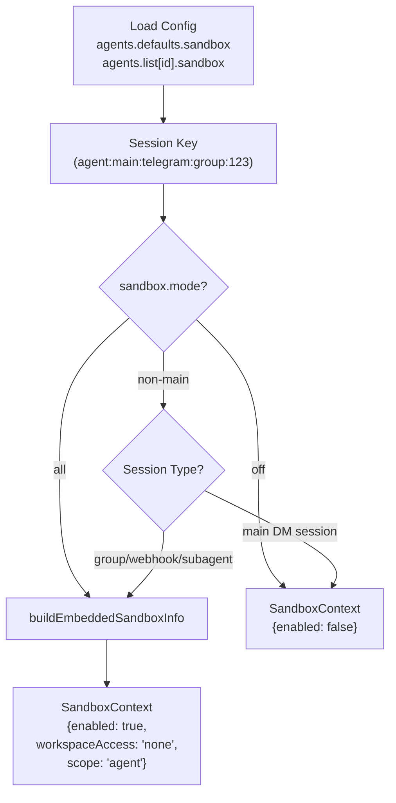
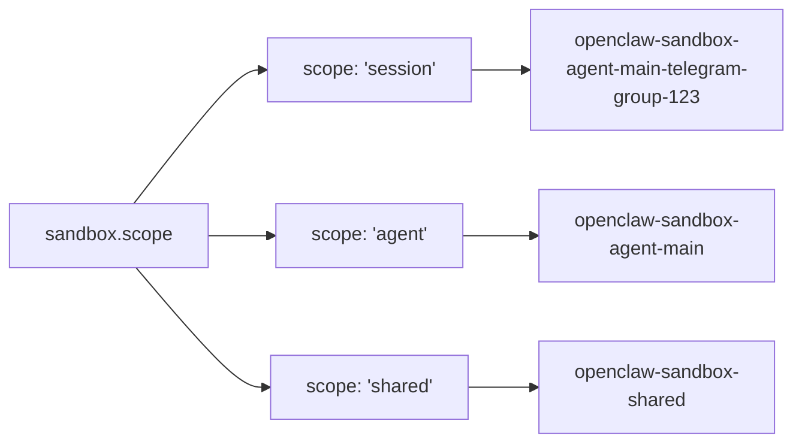
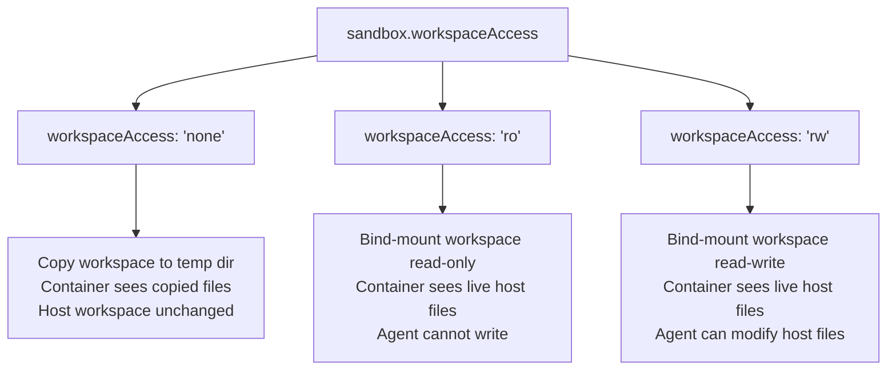
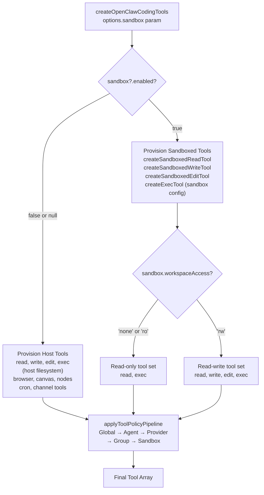
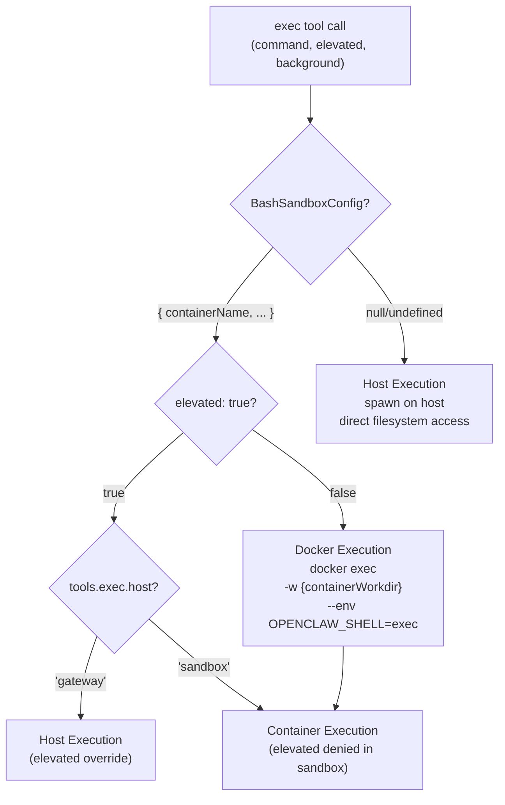
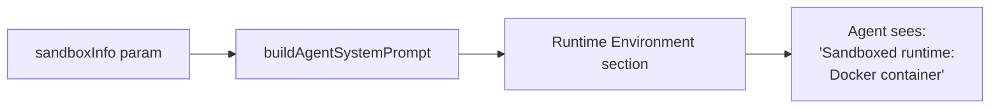

# Sandboxing

<details>
<summary>Relevant source files</summary>

The following files were used as context for generating this wiki page:

- [docs/gateway/background-process.md](docs/gateway/background-process.md)
- [docs/gateway/doctor.md](docs/gateway/doctor.md)
- [src/agents/bash-process-registry.test.ts](src/agents/bash-process-registry.test.ts)
- [src/agents/bash-process-registry.ts](src/agents/bash-process-registry.ts)
- [src/agents/bash-tools.test.ts](src/agents/bash-tools.test.ts)
- [src/agents/bash-tools.ts](src/agents/bash-tools.ts)
- [src/agents/pi-embedded-helpers.ts](src/agents/pi-embedded-helpers.ts)
- [src/agents/pi-embedded-runner.ts](src/agents/pi-embedded-runner.ts)
- [src/agents/pi-embedded-subscribe.ts](src/agents/pi-embedded-subscribe.ts)
- [src/agents/pi-tools-agent-config.test.ts](src/agents/pi-tools-agent-config.test.ts)
- [src/agents/pi-tools.ts](src/agents/pi-tools.ts)
- [src/cli/models-cli.test.ts](src/cli/models-cli.test.ts)
- [src/commands/doctor.ts](src/commands/doctor.ts)

</details>

OpenClaw provides Docker-based sandboxing for tool execution to isolate agent sessions from the host system. Sandboxing restricts filesystem access, process execution, and network capabilities for group chat sessions, webhook triggers, or any scenario requiring host protection.

This page covers sandbox modes, container lifecycle, tool filtering, workspace access controls, and security boundaries. For access control policies (DM/group allowlists), see page 10.1. For configuration reference, see page 2.3.1.

---

## Sandbox Modes and Activation

Sandboxing is configured via `agents.defaults.sandbox.mode` (or per-agent overrides in `agents.list[].sandbox.mode`). The mode determines which sessions run in Docker containers.

### Sandbox Modes

| Mode            | Behavior                                                                                | Use Case                                             |
| --------------- | --------------------------------------------------------------------------------------- | ---------------------------------------------------- |
| `off` (default) | All sessions run on host. No isolation.                                                 | Trusted single-user setups                           |
| `non-main`      | Group chats, webhooks, and non-DM sessions run in Docker. Main DM sessions run on host. | Isolate untrusted group input while keeping DMs fast |
| `all`           | All agent sessions run in Docker, including main DMs.                                   | Maximum isolation for all sessions                   |

### Sandbox Scope

The `sandbox.scope` setting controls container granularity and lifecycle:

| Scope     | Container Lifecycle                                                    | Container Name Pattern             |
| --------- | ---------------------------------------------------------------------- | ---------------------------------- |
| `session` | One container per session key. Destroyed on `/new` or session reset.   | `openclaw-sandbox-{sessionKey}`    |
| `agent`   | One container per agent ID. Shared across all sessions for that agent. | `openclaw-sandbox-agent-{agentId}` |
| `shared`  | Single shared container for all sandboxed sessions across all agents.  | `openclaw-sandbox-shared`          |

### Workspace Access Modes

The `sandbox.workspaceAccess` setting controls how the agent's workspace directory is mounted:

| Mode              | Behavior                                                                             | File Tools Available            |
| ----------------- | ------------------------------------------------------------------------------------ | ------------------------------- |
| `none`            | Workspace is **copied** to container on startup. Agent cannot modify host workspace. | `read`, `exec`                  |
| `ro` (read-only)  | Workspace is **bind-mounted** read-only. Agent can read host files but not write.    | `read`, `exec`                  |
| `rw` (read-write) | Workspace is **bind-mounted** read-write. Agent can modify host files directly.      | `read`, `write`, `edit`, `exec` |

**Default**: `none` (safest - no host filesystem access).

### Configuration Example

```json5
{
  agents: {
    defaults: {
      sandbox: {
        mode: 'non-main', // Isolate groups, run DMs on host
        scope: 'agent', // One container per agent
        workspaceAccess: 'none', // Copy workspace, no host writes
      },
    },
  },
}
```

**Sources**: [src/agents/pi-tools.ts:274](), [src/agents/pi-embedded-runner.ts:20](), [src/agents/sandbox.js]()

---

## Sandbox Context Resolution

### Context Resolution Flow

The `buildEmbeddedSandboxInfo` function (exported from [src/agents/pi-embedded-runner.ts:20]()) determines whether a session runs in a sandbox and constructs the `SandboxContext` object that controls tool provisioning.

**Diagram: Sandbox Context Resolution**



### SandboxContext Structure

When `enabled: true`, the `SandboxContext` object contains:

| Field                     | Type                         | Description                                                   |
| ------------------------- | ---------------------------- | ------------------------------------------------------------- |
| `enabled`                 | `boolean`                    | Always `true` when sandboxing is active                       |
| `sessionKey`              | `string`                     | Session key for container naming                              |
| `workspaceDir`            | `string`                     | Path to sandboxed workspace (container-side or temp copy)     |
| `agentWorkspaceDir`       | `string`                     | Original agent workspace path (host-side)                     |
| `workspaceAccess`         | `"none"` \| `"ro"` \| `"rw"` | Workspace mount mode                                          |
| `containerName`           | `string`                     | Docker container name (derived from scope + session/agent ID) |
| `containerWorkdir`        | `string`                     | Container working directory (e.g., `/workspace`)              |
| `docker`                  | `SandboxDockerConfig`        | Docker exec config (image, network, mounts)                   |
| `tools`                   | `ToolPolicy`                 | Sandbox-specific tool allowlist/denylist                      |
| `fsBridge`                | `SandboxFsBridge`            | Filesystem bridge for `none`/`ro` workspace access            |
| `browserAllowHostControl` | `boolean`                    | Whether `browser` tool can control host Chrome                |

**Sources**: [src/agents/pi-tools.ts:274](), [src/agents/sandbox.js](), [src/agents/pi-embedded-runner.ts:20]()

---

## Docker Container Lifecycle

### Container Creation and Naming

Containers are created on-demand when the first sandboxed tool is executed for a session. Container names follow these patterns:

**Diagram: Container Naming by Scope**



### Container Persistence

| Scope     | Created When                                  | Destroyed When                                             |
| --------- | --------------------------------------------- | ---------------------------------------------------------- |
| `session` | First tool call in session                    | Session reset (`/new`), session deleted, or manual cleanup |
| `agent`   | First tool call for any session of this agent | Agent removed or manual cleanup                            |
| `shared`  | First tool call across all agents             | Manual cleanup only                                        |

Containers persist across Gateway restarts. Running containers are reused if they exist when a session resumes.

### Workspace Mounting Behavior

**Diagram: Workspace Access Modes**



**Security Note**: `workspaceAccess: "rw"` allows the agent to modify host files directly. Only use this mode for trusted sessions or when you want the agent to manage workspace files (e.g., a coding agent maintaining a project).

**Sources**: [src/agents/pi-tools.ts:340-363](), [src/agents/bash-tools.exec.js]()

---

## Tool Filtering in Sandbox Contexts

When `sandbox.enabled: true`, tool provisioning follows a different path that restricts host-only capabilities.

### Tool Provisioning Flow

**Diagram: Tool Creation with Sandbox Context**



### Sandbox Tool Policy

**Allowed tools** (safe in containers):

- `read` - File reads via `SandboxFsBridge` (for `none`/`ro`) or direct mount (for `rw`)
- `exec` - Command execution inside container (`BashSandboxConfig` routes to Docker)
- `process` - Background process management within container (scoped by `sessionKey`)
- `write`, `edit` - File writes (only when `workspaceAccess: "rw"`)
- `apply_patch` - Multi-file patches (only when `workspaceAccess: "rw"` and enabled)
- `sessions_*` - Session coordination tools (use Gateway RPC, not host-dependent)

**Denied tools** (require host access):

- `browser` - Requires host Chrome/CDP connection (unless `browserAllowHostControl: true`)
- `canvas` - Requires host window manager
- `nodes` - Requires paired physical devices (macOS/iOS/Android)
- `cron` - Requires host cron scheduler
- Channel tools (`discord`, `slack`, `telegram`, etc.) - Require host channel plugin connections

### Tool Implementation Details

**Read Tool**:

- **Host**: `createReadTool(workspaceRoot)` → [src/agents/pi-tools.ts:383]()
- **Sandbox**: `createSandboxedReadTool({ root, bridge })` → [src/agents/pi-tools.ts:369-374]()
  - Uses `SandboxFsBridge.readFile()` to read from container or host copy

**Write/Edit Tools**:

- **Host**: `createHostWorkspaceWriteTool(workspaceRoot)` → [src/agents/pi-tools.ts:397]()
- **Sandbox (rw only)**: `createSandboxedWriteTool({ root, bridge })` → [src/agents/pi-tools.ts:464-483]()
  - Only provisioned when `sandbox.workspaceAccess === "rw"`
  - Uses `SandboxFsBridge.writeFile()` to write to container or host mount

**Exec Tool**:

- **Host**: `createExecTool({ cwd: workspaceRoot })` → [src/agents/pi-tools.ts:410-444]()
- **Sandbox**: `createExecTool({ sandbox: { containerName, workspaceDir, ... } })` → [src/agents/pi-tools.ts:436-443]()
  - Routes commands to Docker container via `docker exec`

**Sources**: [src/agents/pi-tools.ts:366-488](), [src/agents/bash-tools.exec.js](), [src/agents/tool-policy-pipeline.ts:50-52]()

---

## Exec Tool Sandboxing

The `exec` tool routes commands to Docker containers when `sandbox.enabled: true`. The routing logic is controlled by the `BashSandboxConfig` parameter passed to `createExecTool`.

### Exec Tool Routing

**Diagram: Exec Tool Host vs Sandbox Routing**



### Elevated Mode Interaction

When `tools.exec.elevated.enabled: true`, the `elevated` parameter allows escaping the sandbox **only if** `tools.exec.host: "gateway"` is configured:

| Config                                 | `elevated: true` Behavior      |
| -------------------------------------- | ------------------------------ |
| `tools.exec.host: "gateway"`           | Runs on host (escapes sandbox) |
| `tools.exec.host: "sandbox"` (default) | Denied (throws error)          |

**Security Note**: Elevated mode in sandbox contexts is **dangerous** and should only be enabled for trusted DM sessions. Group chats should never have elevated access.

### Background Process Scoping

Background processes (started via `background: true` or `yieldMs` timeout) are scoped by `sessionKey` and tracked in the process registry ([src/agents/bash-process-registry.ts]()). In sandbox contexts:

- Processes are isolated to the container namespace
- `process list` only shows processes for the current session's container
- `process kill` cannot affect host processes or other containers

**Sources**: [src/agents/bash-tools.ts:1-10](), [src/agents/bash-tools.exec.js](), [src/agents/pi-tools.ts:410-444]()

---

## Filesystem Isolation

### Filesystem Bridge

When `workspaceAccess` is `"none"` or `"ro"`, the sandbox uses a `SandboxFsBridge` to mediate filesystem operations:

| Method                             | Purpose                         | `workspaceAccess: "none"` | `workspaceAccess: "ro"`            |
| ---------------------------------- | ------------------------------- | ------------------------- | ---------------------------------- |
| `resolvePath(relativePath)`        | Map container path to host path | Maps to temp copy dir     | Maps to host workspace (read-only) |
| `readFile(relativePath)`           | Read file contents              | Reads from temp copy      | Reads from host workspace          |
| `writeFile(relativePath, content)` | Write file (if `rw`)            | Denied                    | Denied                             |
| `mkdirp(relativePath)`             | Create directories (if `rw`)    | Denied                    | Denied                             |
| `stat(relativePath)`               | Get file metadata               | Stats temp copy           | Stats host file                    |

When `workspaceAccess: "rw"`, tools bypass the bridge and write directly to the bind-mounted workspace.

### Workspace Guards

All sandboxed file tools are wrapped with `wrapToolWorkspaceRootGuard` ([src/agents/pi-tools.ts:377-379](), [src/agents/pi-tools.ts:466-472]()) to prevent path traversal attacks:

- Rejects absolute paths
- Rejects `..` components that escape the workspace
- Normalizes paths before passing to filesystem operations

**Sources**: [src/agents/pi-tools.read.js](), [src/agents/sandbox/fs-bridge.js]()

---

## Setup and Operations

### Building the Sandbox Image

Before enabling sandboxing, build the Docker image:

```bash
scripts/sandbox-setup.sh
```

The script:

1. Generates a Dockerfile with Node.js (matching host version), Git, curl, jq
2. Builds the image as `openclaw-sandbox:latest`
3. Verifies the image is ready

### Doctor Integration

`openclaw doctor` checks sandbox readiness and offers to build/repair the image:

```bash
openclaw doctor --fix
```

Doctor detects:

- Missing `openclaw-sandbox` image
- Outdated image (different Node version)
- Legacy image names (migrates to new naming)

### CLI Commands

```bash
# List active sandbox containers
openclaw sandbox list

# Recreate sandbox container for a session
openclaw sandbox recreate --session agent:main:whatsapp:group:123

# Explain sandbox status for current config
openclaw sandbox explain

# Remove all sandbox containers
openclaw sandbox clean
```

**Sources**: [docs/cli/index.md:42-43](), [src/commands/doctor-sandbox.js]()

---

## Security Model and Guarantees

### What Sandboxing Protects

✅ **File system isolation**: Tools cannot access host files outside the container
✅ **Process isolation**: Agent code runs in a separate process namespace
✅ **Network isolation**: Docker networking rules can restrict outbound connections
✅ **Resource limits**: Docker can enforce CPU/memory limits per container

### What Sandboxing Does Not Protect

❌ **Network exfiltration**: By default, containers have network access (can call external APIs)
❌ **Model prompt injection**: Sandboxing does not prevent prompt injection attacks
❌ **Gateway RPC abuse**: Sandboxed sessions can still call Gateway RPC methods (if `gateway` tool is enabled)
❌ **Side-channel attacks**: Container escape exploits or kernel vulnerabilities

### Recommended Security Posture

For untrusted input scenarios (groups, webhooks, public bots):

1. **Enable sandboxing**: Set `sandbox.mode: "non-main"` or `"all"`
2. **Restrict tools**: Use explicit tool allowlists, deny `gateway` tool
3. **Network isolation**: Configure Docker network policies to block egress
4. **Monitor sessions**: Review `openclaw sessions` output for suspicious activity
5. **Use strong models**: Stronger models are more resistant to prompt injection

**Sources**: [README.md:333-338](), [docs/gateway/configuration.md:206-225]()

---

## Sandbox Information in System Prompt

When a session runs in a sandbox, the system prompt includes sandbox metadata so the agent knows it's running in a restricted environment:



This allows the agent to adjust behavior (e.g., not attempt browser or node tool use).

**Sources**: [src/agents/system-prompt.ts:229](), [src/agents/system-prompt.ts:238]()

---

## Summary

OpenClaw's sandboxing system provides Docker-based isolation for tool execution, protecting the host from untrusted agent code in group chats, webhooks, and other scenarios. Sandboxing is configured via `agents.defaults.sandbox.mode` (`off`/`non-main`/`all`) and `scope` (`session`/`agent`/`shared`), with tool filtering applied automatically to deny host-only capabilities like browser control and device access. Setup requires building the `openclaw-sandbox` Docker image via `scripts/sandbox-setup.sh`, and sandboxed sessions are managed through the `openclaw sandbox` CLI commands. While sandboxing provides strong file system and process isolation, it does not prevent network exfiltration or prompt injection attacks, so additional tool restrictions and network policies are recommended for untrusted input scenarios.
