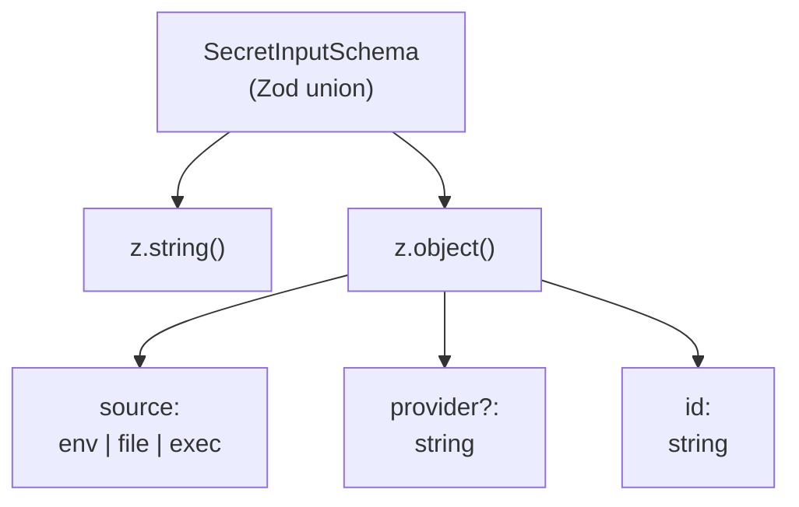
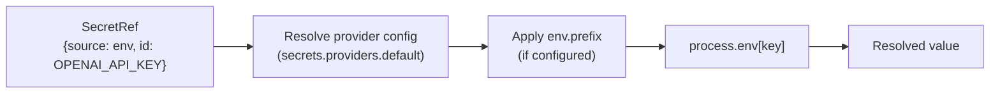
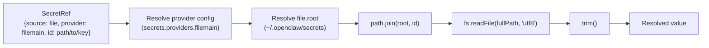
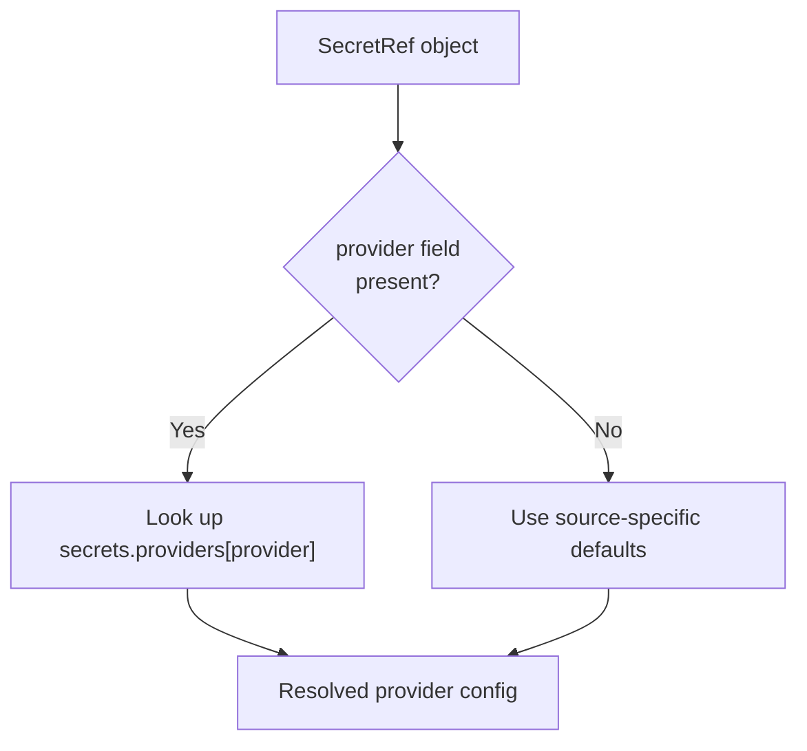
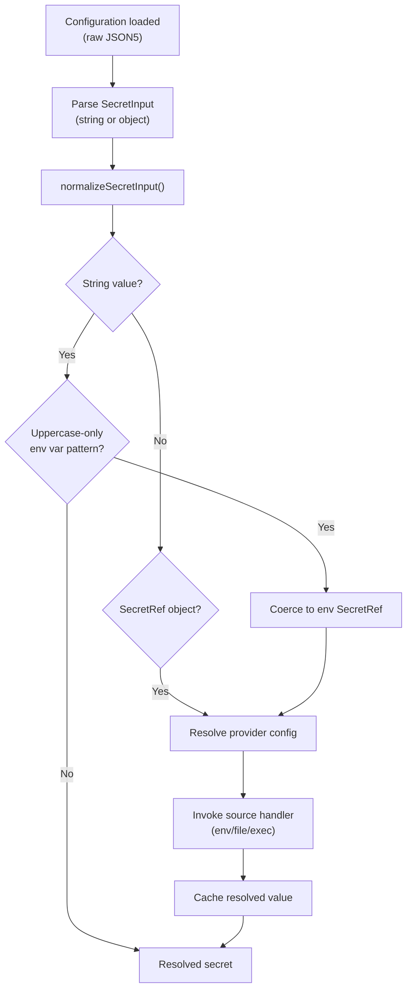

```mermaid
graph LR
    SecretRef["SecretRef<br/>{source: exec, provider: vault, id: secret/path}"]
    LookupProvider["Resolve provider config<br/>(secrets.providers.vault)"]
    BuildCommand["Build command array<br/>[command, ...args, id]"]
    Spawn["child_process.execFile()"]
    WaitTimeout["Wait with timeout<br/>(exec.timeoutMs)"]
    CaptureStdout["Capture stdout"]
    Trim["trim()"]
    Result["Resolved value"]

    SecretRef --> LookupProvider
    LookupProvider --> BuildCommand
    BuildCommand --> Spawn
    Spawn --> WaitTimeout
    WaitTimeout --> CaptureStdout
    CaptureStdout --> Trim
    Trim --> Result
```

# Secret Management

<details>
<summary>Relevant source files</summary>

The following files were used as context for generating this wiki page:

- [CHANGELOG.md](CHANGELOG.md)
- [docs/cli/memory.md](docs/cli/memory.md)
- [docs/concepts/memory.md](docs/concepts/memory.md)
- [docs/gateway/configuration-reference.md](docs/gateway/configuration-reference.md)
- [docs/gateway/configuration.md](docs/gateway/configuration.md)
- [src/agents/memory-search.test.ts](src/agents/memory-search.test.ts)
- [src/agents/memory-search.ts](src/agents/memory-search.ts)
- [src/agents/model-auth.ts](src/agents/model-auth.ts)
- [src/agents/models-config.fills-missing-provider-apikey-from-env-var.test.ts](src/agents/models-config.fills-missing-provider-apikey-from-env-var.test.ts)
- [src/agents/models-config.providers.openai-codex.test.ts](src/agents/models-config.providers.openai-codex.test.ts)
- [src/agents/models-config.providers.ts](src/agents/models-config.providers.ts)
- [src/agents/models-config.ts](src/agents/models-config.ts)
- [src/agents/pi-embedded-runner/extensions.ts](src/agents/pi-embedded-runner/extensions.ts)
- [src/agents/pi-extensions/compaction-safeguard-runtime.ts](src/agents/pi-extensions/compaction-safeguard-runtime.ts)
- [src/agents/pi-extensions/compaction-safeguard.test.ts](src/agents/pi-extensions/compaction-safeguard.test.ts)
- [src/agents/pi-extensions/compaction-safeguard.ts](src/agents/pi-extensions/compaction-safeguard.ts)
- [src/cli/memory-cli.test.ts](src/cli/memory-cli.test.ts)
- [src/cli/memory-cli.ts](src/cli/memory-cli.ts)
- [src/cli/program.ts](src/cli/program.ts)
- [src/cli/program/register.onboard.ts](src/cli/program/register.onboard.ts)
- [src/commands/auth-choice-options.test.ts](src/commands/auth-choice-options.test.ts)
- [src/commands/auth-choice-options.ts](src/commands/auth-choice-options.ts)
- [src/commands/auth-choice.apply.api-providers.ts](src/commands/auth-choice.apply.api-providers.ts)
- [src/commands/auth-choice.preferred-provider.ts](src/commands/auth-choice.preferred-provider.ts)
- [src/commands/auth-choice.test.ts](src/commands/auth-choice.test.ts)
- [src/commands/auth-choice.ts](src/commands/auth-choice.ts)
- [src/commands/configure.ts](src/commands/configure.ts)
- [src/commands/onboard-auth.config-core.ts](src/commands/onboard-auth.config-core.ts)
- [src/commands/onboard-auth.credentials.ts](src/commands/onboard-auth.credentials.ts)
- [src/commands/onboard-auth.models.ts](src/commands/onboard-auth.models.ts)
- [src/commands/onboard-auth.test.ts](src/commands/onboard-auth.test.ts)
- [src/commands/onboard-auth.ts](src/commands/onboard-auth.ts)
- [src/commands/onboard-non-interactive.ts](src/commands/onboard-non-interactive.ts)
- [src/commands/onboard-non-interactive/local/auth-choice.ts](src/commands/onboard-non-interactive/local/auth-choice.ts)
- [src/commands/onboard-types.ts](src/commands/onboard-types.ts)
- [src/config/config.compaction-settings.test.ts](src/config/config.compaction-settings.test.ts)
- [src/config/schema.help.quality.test.ts](src/config/schema.help.quality.test.ts)
- [src/config/schema.help.ts](src/config/schema.help.ts)
- [src/config/schema.labels.ts](src/config/schema.labels.ts)
- [src/config/schema.ts](src/config/schema.ts)
- [src/config/types.agent-defaults.ts](src/config/types.agent-defaults.ts)
- [src/config/types.tools.ts](src/config/types.tools.ts)
- [src/config/types.ts](src/config/types.ts)
- [src/config/zod-schema.agent-defaults.ts](src/config/zod-schema.agent-defaults.ts)
- [src/config/zod-schema.agent-runtime.ts](src/config/zod-schema.agent-runtime.ts)
- [src/config/zod-schema.ts](src/config/zod-schema.ts)
- [src/memory/manager.ts](src/memory/manager.ts)
- [src/wizard/onboarding.ts](src/wizard/onboarding.ts)

</details>

OpenClaw's secret management system provides a unified abstraction for storing and accessing sensitive credentials across configuration, environment variables, files, and external secret stores. This page documents the `SecretRef` system, secret providers, resolution mechanics, and integration points throughout the codebase.

For general configuration patterns, see [Configuration](#2.3). For environment variable handling, see [Configuration Reference](#2.3.1).

---

## Overview

OpenClaw manages secrets through the **SecretRef** system, which decouples credential storage from credential usage. Instead of embedding API keys and tokens directly in configuration files, you reference them using a structured object that specifies:

- **Source type**: `env`, `file`, or `exec`
- **Provider**: optional alias for source-specific configuration
- **ID**: the lookup key (env var name, file path, or exec argument)

This design enables:

- **Source flexibility**: switch between environment variables, file-based secrets, and external vaults without changing usage sites
- **Safe config commits**: configuration files can be versioned without leaking credentials
- **Runtime resolution**: secrets are read at the moment of use, supporting dynamic rotation
- **Provider abstraction**: centralized provider configuration for file roots, exec commands, and env prefixes

Sources: [src/config/types.secrets.ts:1-40](), [docs/gateway/configuration.md:558-593]()

---

## SecretInput Type System

### Type Definitions

Every secret-capable configuration field accepts a `SecretInput`:

```typescript
type SecretInput = string | SecretRef

type SecretRef = {
  source: 'env' | 'file' | 'exec'
  provider?: string
  id: string
}
```

**String form**: Direct plaintext value or bare environment variable name (uppercase-only, detected by regex).

**SecretRef form**: Structured object specifying source, provider, and lookup ID.

### Validation Schema



Sources: [src/config/zod-schema.core.ts:47-57](), [src/config/types.secrets.ts:1-40]()

---

## Secret Sources

### Environment Variables (`env`)

Environment variable sources resolve secrets from the process environment at runtime.

**Configuration**:

```json5
{
  models: {
    providers: {
      openai: {
        apiKey: { source: 'env', provider: 'default', id: 'OPENAI_API_KEY' },
      },
    },
  },
  secrets: {
    providers: {
      default: {
        source: 'env',
        env: { prefix: '' },
      },
    },
  },
}
```

**Resolution flow**:



**Provider configuration**:

- `env.prefix`: Optional prefix prepended to the ID when reading from `process.env`

Sources: [src/config/zod-schema.core.ts:27-36](), [src/agents/models-config.providers.ts:84-100]()

---

### File-Based Secrets (`file`)

File sources read secrets from the filesystem, useful for Docker secrets, mounted credential files, or managed secret directories.

**Configuration**:

```json5
{
  skills: {
    entries: {
      'nano-banana-pro': {
        apiKey: {
          source: 'file',
          provider: 'filemain',
          id: '/skills/entries/nano-banana-pro/apiKey',
        },
      },
    },
  },
  secrets: {
    providers: {
      filemain: {
        source: 'file',
        file: { root: '~/.openclaw/secrets' },
      },
    },
  },
}
```

**Resolution flow**:



**Provider configuration**:

- `file.root`: Base directory for relative secret paths (resolved with `~` expansion)
- ID is joined to root if relative; absolute IDs bypass root

**Security**:

- Files are read synchronously during resolution
- Symlinks are followed (no validation)
- File permissions are not enforced by OpenClaw (rely on OS-level access control)

Sources: [src/config/zod-schema.core.ts:37-44]()

---

### Executable Secrets (`exec`)

Executable sources invoke an external command to retrieve secrets, enabling integration with `vault`, `pass`, `1password`, or custom secret backends.

**Configuration**:

```json5
{
  channels: {
    googlechat: {
      serviceAccountRef: {
        source: 'exec',
        provider: 'vault',
        id: 'channels/googlechat/serviceAccount',
      },
    },
  },
  secrets: {
    providers: {
      vault: {
        source: 'exec',
        exec: {
          command: 'vault',
          args: ['kv', 'get', '-field=value'],
          timeoutMs: 5000,
        },
      },
    },
  },
}
```

**Resolution flow**:



**Provider configuration**:

- `exec.command`: Binary name or absolute path to executable
- `exec.args`: Optional argument array (ID is appended as final argument)
- `exec.timeoutMs`: Max execution time (default varies by context)

**Security**:

- Command and args are **not** shell-evaluated (no injection risk from ID)
- Stdout is captured; stderr is discarded
- Non-zero exit codes fail resolution

Sources: [src/config/zod-schema.core.ts:45-52]()

---

## Secret Provider Configuration

### Provider Schema

The `secrets.providers` section defines reusable provider configurations:

```json5
{
  secrets: {
    providers: {
      default: {
        source: 'env',
        env: { prefix: '' },
      },
      filemain: {
        source: 'file',
        file: { root: '~/.openclaw/secrets' },
      },
      vault: {
        source: 'exec',
        exec: {
          command: 'vault',
          args: ['kv', 'get', '-field=value'],
          timeoutMs: 5000,
        },
      },
    },
  },
}
```

### Provider Resolution



**Default providers** (when `provider` field is omitted):

- `env` source: reads directly from `process.env[id]`
- `file` source: treats `id` as absolute path
- `exec` source: **not supported** (provider is required)

Sources: [src/config/zod-schema.core.ts:19-57](), [src/secrets/ref-contract.ts:1-50]()

---

## Usage Patterns

### Model Provider API Keys

API keys for LLM providers are the most common secret type:

```json5
{
  models: {
    providers: {
      openai: {
        apiKey: { source: 'env', provider: 'default', id: 'OPENAI_API_KEY' },
      },
      anthropic: {
        apiKey: { source: 'file', provider: 'filemain', id: 'anthropic/key' },
      },
    },
  },
}
```

**Resolution sites**:

- [src/agents/models-config.providers.ts:152-224]() — `resolveApiKeyFromCredential`
- [src/agents/model-auth.ts:1-500]() — `resolveEnvApiKey`, `resolveModelAuth`

---

### Gateway Authentication

Gateway tokens and passwords support SecretRef:

```json5
{
  gateway: {
    auth: {
      mode: 'token',
      token: { source: 'file', provider: 'filemain', id: 'gateway/token' },
    },
  },
}
```

**Resolution sites**:

- [src/config/zod-schema.ts:663-664]() — `gateway.auth.token`, `gateway.auth.password` schemas
- [src/wizard/onboarding.ts:284-324]() — onboarding wizard resolution

---

### Channel Credentials

Channel plugins use SecretRef for bot tokens, service accounts, and webhook secrets:

```json5
{
  channels: {
    telegram: {
      botToken: {
        source: 'env',
        provider: 'default',
        id: 'TELEGRAM_BOT_TOKEN',
      },
    },
    googlechat: {
      serviceAccountRef: {
        source: 'exec',
        provider: 'vault',
        id: 'channels/googlechat/serviceAccount',
      },
    },
  },
  cron: {
    webhookToken: {
      source: 'file',
      provider: 'filemain',
      id: 'cron/webhook-secret',
    },
  },
}
```

**Schema definitions**:

- [src/config/zod-schema.ts:508]() — `cron.webhookToken`
- [src/config/zod-schema.ts:567]() — `hooks.token`
- Channel-specific schemas in provider files

---

### Skill API Keys

Skills can reference external API keys via SecretRef:

```json5
{
  skills: {
    entries: {
      'weather-api': {
        apiKey: { source: 'env', provider: 'default', id: 'WEATHER_API_KEY' },
      },
    },
  },
}
```

Sources: [src/config/zod-schema.ts:140-147](), [docs/gateway/configuration.md:558-593]()

---

## Resolution and Normalization

### Resolution Flow



**Key functions**:

- [src/utils/normalize-secret-input.ts:1-100]() — `normalizeSecretInput`, `normalizeOptionalSecretInput`
- [src/config/types.secrets.ts:40-80]() — `coerceSecretRef`, `resolveSecretInputRef`

---

### String Coercion

Bare strings are coerced to SecretRef objects when they match the environment variable pattern:

**Pattern**: `/^[A-Z_][A-Z0-9_]*$/`

**Example**:

- Input: `"OPENAI_API_KEY"`
- Coerced: `{ source: "env", provider: "default", id: "OPENAI_API_KEY" }`

Non-matching strings (lowercase, special chars, prefixes like `sk-`) are treated as plaintext values.

Sources: [src/agents/models-config.providers.ts:82-88]()

---

### Sensitive Field Marking

SecretInput fields are marked as sensitive in the Zod schema using `.register(sensitive)`:

```typescript
apiKey: SecretInputSchema.optional().register(sensitive)
```

This enables:

- **Logging redaction**: sensitive paths are masked in logs when `logging.redactSensitive` is enabled
- **UI masking**: Control UI renders these fields as password inputs
- **Schema introspection**: `schema.hints[path].sensitive === true`

Sources: [src/config/zod-schema.sensitive.ts:1-30](), [src/config/schema.hints.ts:1-500]()

---

## Security Considerations

### Plaintext vs. SecretRef

| Aspect                   | Plaintext String                      | SecretRef                                   |
| ------------------------ | ------------------------------------- | ------------------------------------------- |
| **Config file exposure** | Credential visible in version control | Reference only; no credential in config     |
| **Runtime resolution**   | Static value at config load           | Dynamic read at usage time                  |
| **Rotation support**     | Requires config edit + reload         | File/exec sources support external rotation |
| **Audit trail**          | Config history shows changes          | Source system maintains audit log           |
| **Recommended for**      | Development, testing                  | Production, shared configs                  |

### Source-Specific Risks

**Environment variables**:

- Exposed to all child processes
- Visible in `ps` output on some systems
- Leaked in error messages if not redacted

**File sources**:

- Filesystem permissions are the only access control
- No built-in encryption
- Symlink attacks possible if root is writable by untrusted users

**Exec sources**:

- Command execution overhead on every resolution
- Timeout failures can cause startup delays
- Malicious provider config can execute arbitrary commands (treat `secrets.providers` as trusted input)

### Best Practices

1. **Use SecretRef for all production credentials**: avoid plaintext in version-controlled configs
2. **Restrict provider config write access**: `secrets.providers` defines executable commands
3. **Set appropriate file modes**: `0600` for file-based secrets
4. **Use `exec` for centralized secret stores**: Vault, 1Password, etc.
5. **Enable logging redaction**: `logging.redactSensitive: "tools"` masks sensitive fields
6. **Audit secret resolution failures**: check logs for missing env vars, unreadable files, exec timeouts

Sources: [docs/gateway/configuration.md:558-593](), [src/config/schema.help.ts:1-500]()

---

## Configuration Reference

### `secrets.providers`

Defines reusable provider configurations for secret resolution.

| Field            | Type                        | Description                                   |
| ---------------- | --------------------------- | --------------------------------------------- |
| `source`         | `"env" \| "file" \| "exec"` | Source type for this provider                 |
| `env.prefix`     | `string?`                   | Prefix prepended to env var names             |
| `file.root`      | `string?`                   | Base directory for relative file paths        |
| `exec.command`   | `string`                    | Executable name or path (required for `exec`) |
| `exec.args`      | `string[]?`                 | Arguments prepended before secret ID          |
| `exec.timeoutMs` | `number?`                   | Max execution time in milliseconds            |

**Example**:

```json5
{
  secrets: {
    providers: {
      'aws-secrets': {
        source: 'exec',
        exec: {
          command: 'aws',
          args: ['secretsmanager', 'get-secret-value', '--secret-id'],
          timeoutMs: 10000,
        },
      },
    },
  },
}
```

Sources: [src/config/zod-schema.core.ts:19-57](), [docs/gateway/configuration-reference.md:1-5000]()

---

## Command-Line Secret Resolution

The `openclaw` CLI supports SecretRef resolution via the Gateway RPC when needed:

```bash
# Commands that may trigger secret resolution:
openclaw memory sync --agent main
openclaw config set models.providers.openai.apiKey '{"source":"file","id":"openai/key"}'
```

**Resolution flow**:



```mermaid
graph LR
    CLICommand["CLI command execution"]
    DetectSecretRefs["Detect SecretRef in args<br/>(command-secret-targets.ts)"]
    ConnectGateway["Connect to Gateway WebSocket"]
    SendResolveRPC["Send secrets.resolve RPC"]
    GatewayResolves["Gateway resolves via sources"]
    ReturnValues["Return resolved values"]
    CLIProceeds["CLI continues with resolved secrets"]

    CLICommand --> DetectSecretRefs
    DetectSecretRefs --> ConnectGateway
    ConnectGateway --> SendResolveRPC
    SendResolveRPC --> GatewayResolves
    GatewayResolves --> ReturnValues
    ReturnValues --> CLIProceeds
```

**Implementation**:

- [src/cli/command-secret-gateway.ts:1-200]() — `resolveCommandSecretRefsViaGateway`
- [src/cli/command-secret-targets.ts:1-100]() — Target detection for memory, config, and other commands

Sources: [src/cli/command-secret-gateway.ts:1-200](), [src/cli/memory-cli.ts:17-18]()

---

## Runtime Secret Management

### Gateway RPC Methods

The Gateway WebSocket protocol exposes secret resolution as an RPC method:

**Method**: `secrets.resolve`

**Params**:

```typescript
{
  refs: SecretRef[];
}
```

**Result**:

```typescript
{
  values: (string | null)[];  // null for resolution failures
}
```

**Access control**: Requires `operator` role (token/password auth).

### Onboarding Wizard Resolution

The onboarding wizard resolves SecretRef values when probing gateway connectivity:

```typescript
const resolvedToken = await resolveOnboardingSecretInputString({
  config: baseConfig,
  value: baseConfig.gateway?.auth?.token,
  path: 'gateway.auth.token',
  env: process.env,
})
```

Sources: [src/wizard/onboarding.ts:286-303](), [src/wizard/onboarding.secret-input.ts:1-100]()

---

## Environment Variable Substitution

In addition to SecretRef, OpenClaw supports **inline substitution** of environment variables in any config string value:

```json5
{
  gateway: { auth: { token: '${OPENCLAW_GATEWAY_TOKEN}' } },
  models: { providers: { custom: { apiKey: '${CUSTOM_API_KEY}' } } },
}
```

**Rules**:

- Only uppercase names matched: `[A-Z_][A-Z0-9_]*`
- Missing/empty vars throw an error at config load time
- Escape with `$${VAR}` for literal output
- Works inside `$include` files

**Difference from SecretRef**:

- Substitution happens **once at config load**
- SecretRef happens **at usage time**
- Substitution uses literal `${}` syntax in config
- SecretRef uses structured object

Sources: [docs/gateway/configuration.md:538-556]()
