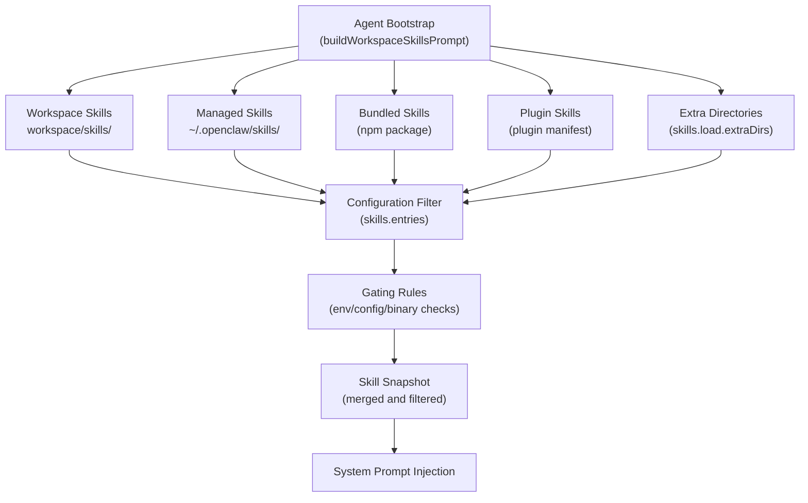
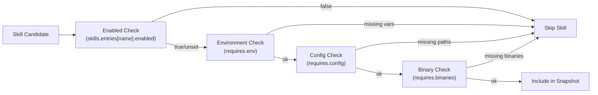
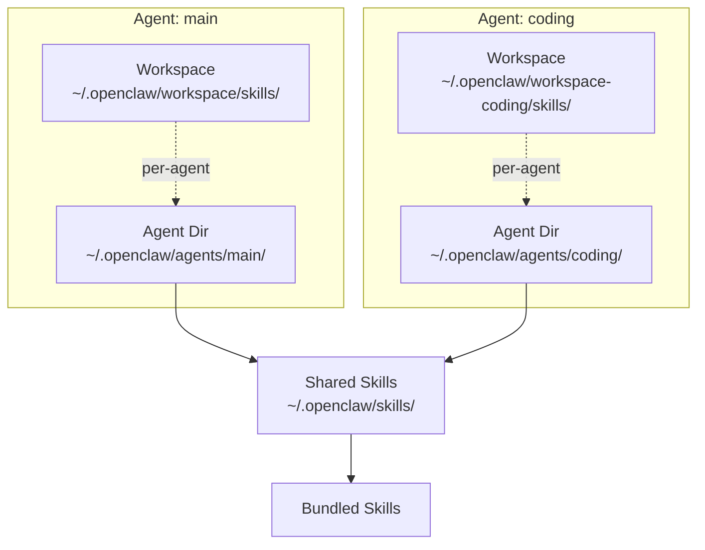
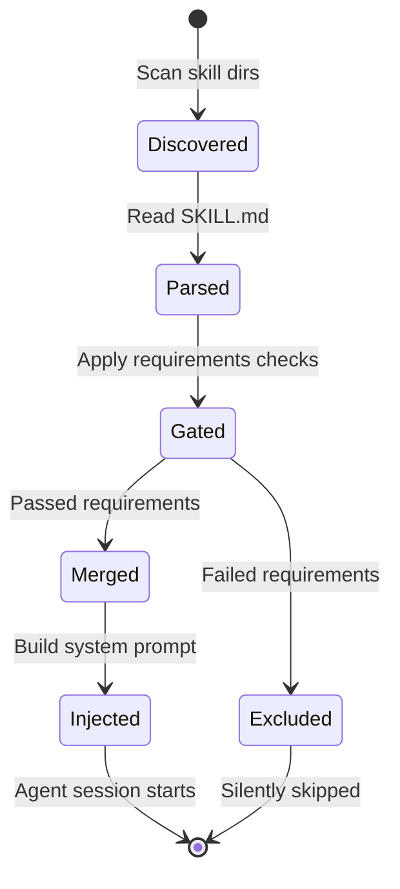

# Skills System

<details>
<summary>Relevant source files</summary>

The following files were used as context for generating this wiki page:

- [AGENTS.md](AGENTS.md)
- [README.md](README.md)
- [assets/avatar-placeholder.svg](assets/avatar-placeholder.svg)
- [docs/channels/index.md](docs/channels/index.md)
- [docs/cli/index.md](docs/cli/index.md)
- [docs/cli/onboard.md](docs/cli/onboard.md)
- [docs/concepts/multi-agent.md](docs/concepts/multi-agent.md)
- [docs/docs.json](docs/docs.json)
- [docs/gateway/index.md](docs/gateway/index.md)
- [docs/gateway/troubleshooting.md](docs/gateway/troubleshooting.md)
- [docs/help/testing.md](docs/help/testing.md)
- [docs/index.md](docs/index.md)
- [docs/reference/test.md](docs/reference/test.md)
- [docs/reference/wizard.md](docs/reference/wizard.md)
- [docs/start/getting-started.md](docs/start/getting-started.md)
- [docs/start/hubs.md](docs/start/hubs.md)
- [docs/start/onboarding.md](docs/start/onboarding.md)
- [docs/start/setup.md](docs/start/setup.md)
- [docs/start/wizard-cli-automation.md](docs/start/wizard-cli-automation.md)
- [docs/start/wizard-cli-reference.md](docs/start/wizard-cli-reference.md)
- [docs/start/wizard.md](docs/start/wizard.md)
- [docs/tools/skills-config.md](docs/tools/skills-config.md)
- [docs/tools/skills.md](docs/tools/skills.md)
- [docs/web/webchat.md](docs/web/webchat.md)
- [docs/zh-CN/channels/index.md](docs/zh-CN/channels/index.md)
- [extensions/bluebubbles/src/send-helpers.ts](extensions/bluebubbles/src/send-helpers.ts)
- [scripts/clawtributors-map.json](scripts/clawtributors-map.json)
- [scripts/e2e/parallels-macos-smoke.sh](scripts/e2e/parallels-macos-smoke.sh)
- [scripts/e2e/parallels-windows-smoke.sh](scripts/e2e/parallels-windows-smoke.sh)
- [scripts/test-parallel.mjs](scripts/test-parallel.mjs)
- [scripts/update-clawtributors.ts](scripts/update-clawtributors.ts)
- [scripts/update-clawtributors.types.ts](scripts/update-clawtributors.types.ts)
- [src/agents/subagent-registry-cleanup.test.ts](src/agents/subagent-registry-cleanup.test.ts)
- [src/gateway/hooks-test-helpers.ts](src/gateway/hooks-test-helpers.ts)
- [src/shared/config-ui-hints-types.ts](src/shared/config-ui-hints-types.ts)
- [test/setup.ts](test/setup.ts)
- [test/test-env.ts](test/test-env.ts)
- [ui/src/ui/controllers/nodes.ts](ui/src/ui/controllers/nodes.ts)
- [ui/src/ui/controllers/skills.ts](ui/src/ui/controllers/skills.ts)
- [ui/src/ui/views/agents-panels-status-files.ts](ui/src/ui/views/agents-panels-status-files.ts)
- [ui/src/ui/views/agents-panels-tools-skills.ts](ui/src/ui/views/agents-panels-tools-skills.ts)
- [ui/src/ui/views/agents-utils.test.ts](ui/src/ui/views/agents-utils.test.ts)
- [ui/src/ui/views/agents-utils.ts](ui/src/ui/views/agents-utils.ts)
- [ui/src/ui/views/agents.ts](ui/src/ui/views/agents.ts)
- [ui/src/ui/views/channel-config-extras.ts](ui/src/ui/views/channel-config-extras.ts)
- [ui/src/ui/views/chat.test.ts](ui/src/ui/views/chat.test.ts)
- [ui/src/ui/views/login-gate.ts](ui/src/ui/views/login-gate.ts)
- [ui/src/ui/views/skills.ts](ui/src/ui/views/skills.ts)
- [vitest.channels.config.ts](vitest.channels.config.ts)
- [vitest.config.ts](vitest.config.ts)
- [vitest.e2e.config.ts](vitest.e2e.config.ts)
- [vitest.extensions.config.ts](vitest.extensions.config.ts)
- [vitest.gateway.config.ts](vitest.gateway.config.ts)
- [vitest.live.config.ts](vitest.live.config.ts)
- [vitest.scoped-config.ts](vitest.scoped-config.ts)
- [vitest.unit.config.ts](vitest.unit.config.ts)

</details>

The Skills System provides modular, declarative functionality extensions for OpenClaw agents. Skills are directories containing a `SKILL.md` file with YAML frontmatter and instructions that teach agents how to use specific tools or perform specialized tasks. The system supports bundled skills (shipped with OpenClaw), managed skills (installed to `~/.openclaw/skills`), workspace skills (per-agent in `<workspace>/skills`), and plugin-provided skills.

For overall tool architecture and execution, see [Tools System](#3.4). For skill installation and registry browsing, see [Skills Management](#5.3). For detailed configuration syntax, see [Skills Configuration](#5.2).

## Skills Architecture

A skill is a self-contained directory with:

- **SKILL.md**: Markdown file with YAML frontmatter defining metadata and runtime requirements
- **Instructions**: Agent-readable documentation explaining when and how to use the skill
- **Optional assets**: Additional files referenced by the skill

Skills follow the [AgentSkills.io](https://agentskills.io) format, making them portable across compatible platforms.

### Skill Discovery and Loading



**Sources**: [docs/tools/skills.md:14-26](), [docs/tools/skills.md:29-40]()

### Precedence Order

Skills are loaded from multiple locations with strict precedence rules:

| Priority    | Location   | Scope                 | Example Path                    |
| ----------- | ---------- | --------------------- | ------------------------------- |
| 1 (highest) | Workspace  | Per-agent             | `~/.openclaw/workspace/skills/` |
| 2           | Managed    | Shared across agents  | `~/.openclaw/skills/`           |
| 3           | Bundled    | Shipped with install  | `node_modules/openclaw/skills/` |
| 4           | Plugin     | Plugin-specific       | `extensions/mattermost/skills/` |
| 5 (lowest)  | Extra dirs | Custom shared folders | `skills.load.extraDirs[0]`      |

When a skill name conflicts, the higher-priority location wins. This allows workspace skills to override bundled defaults.

**Sources**: [docs/tools/skills.md:14-26](), [docs/tools/skills.md:29-40]()

## Skill File Format

### SKILL.md Structure

```markdown
---
name: example-skill
description: Short description of what this skill does
requires:
  env:
    - API_KEY
  config:
    - some.config.path
  binaries:
    - jq
    - curl
metadata:
  openclaw:
    tags:
      - web
      - data
---

# Example Skill

Detailed instructions for the agent explaining when and how to use this skill.

## Usage

Example invocations and expected outcomes.
```

### Frontmatter Fields

| Field                               | Type     | Purpose                                |
| ----------------------------------- | -------- | -------------------------------------- |
| `name`                              | string   | Unique skill identifier                |
| `description`                       | string   | Brief summary for UI display           |
| `requires.env`                      | string[] | Required environment variables         |
| `requires.config`                   | string[] | Required config paths (dot notation)   |
| `requires.binaries`                 | string[] | Required system binaries               |
| `metadata.openclaw.tags`            | string[] | Categorization tags                    |
| `metadata.openclaw.requires.config` | string[] | Alternative config requirements format |

**Sources**: [docs/tools/skills.md:73-132](), [docs/tools/skills.md:134-173]()

## Configuration and Gating

### Skills Configuration Schema

Skills are configured via `skills.entries` in `~/.openclaw/openclaw.json`:

```json5
{
  skills: {
    entries: {
      'skill-name': {
        enabled: true,
        env: {
          API_KEY: 'secret-value-or-ref',
        },
        config: {
          'some.path': 'override-value',
        },
      },
    },
    load: {
      extraDirs: ['/path/to/custom/skills'],
    },
  },
}
```

**Sources**: [docs/tools/skills.md:175-236]()

### Gating Rules



**Gating logic**:

1. **Explicit disable**: If `skills.entries[name].enabled: false`, skip immediately
2. **Environment**: All `requires.env` variables must be set (either in process env or via `skills.entries[name].env`)
3. **Configuration**: All `requires.config` paths must exist in the active config
4. **Binaries**: All `requires.binaries` must be found via `which` (Unix) or `where` (Windows)

Skills that fail any check are silently excluded from the agent's system prompt.

**Sources**: [docs/tools/skills.md:134-173](), [docs/tools/skills.md:238-334]()

### Environment Variable Injection

Environment variables can be injected per-skill:

```json5
{
  skills: {
    entries: {
      'web-search': {
        env: {
          PERPLEXITY_API_KEY: { source: 'env', name: 'PERPLEXITY_API_KEY' },
          BRAVE_SEARCH_API_KEY: 'literal-value-here',
        },
      },
    },
  },
}
```

Values can be:

- **Literal strings**: Plaintext values
- **SecretRef objects**: `{ source: "env"|"file"|"exec", name: "..." }` for secure credential management

Injected variables are available to the agent runtime when the skill is loaded.

**Sources**: [docs/tools/skills.md:175-236]()

## Multi-Agent Considerations

In multi-agent setups, skills follow workspace isolation:



### Per-Agent vs Shared Skills

- **Per-agent skills**: Located in `<workspace>/skills`, visible only to that agent
- **Shared skills**: Located in `~/.openclaw/skills` or `skills.load.extraDirs`, visible to all agents on the host
- **Skill precedence applies per-agent**: Each agent independently resolves workspace → managed → bundled → plugin → extra

This isolation allows:

- **Specialized agents**: Each agent can have unique skills for its role (e.g., coding agent has git skills, social agent has scheduling skills)
- **Shared utilities**: Common skills live in `~/.openclaw/skills` and are available to all
- **Override behavior**: Agents can override shared skills by placing same-named skills in their workspace

**Sources**: [docs/tools/skills.md:29-40](), [docs/concepts/multi-agent.md:14-39]()

## Plugin-Provided Skills

Plugins can ship skills by declaring `skills` directories in their `openclaw.plugin.json` manifest:

```json
{
  "id": "example-plugin",
  "skills": ["skills"]
}
```

Plugin skills:

- Load when the plugin is `enabled: true` in `plugins.entries`
- Participate in normal precedence rules (workspace/managed override plugin skills)
- Can be gated via `metadata.openclaw.requires.config` in the skill's frontmatter

**Example**: Mattermost plugin might ship a `mattermost-search` skill that requires `channels.mattermost` config to be present.

**Sources**: [docs/tools/skills.md:42-49]()

## ClawHub Integration

ClawHub ([https://clawhub.com](https://clawhub.com)) is the public registry for OpenClaw skills. It provides:

- **Discovery**: Browse and search available skills
- **Installation**: `clawhub install <skill-slug>` to add skills to workspace
- **Updates**: `clawhub update --all` to sync installed skills
- **Publishing**: `clawhub sync` to publish local skills

### Installation Flow

```mermaid
sequenceDiagram
    participant User
    participant ClawHub["ClawHub CLI"]
    participant Registry["clawhub.com"]
    participant Workspace["Workspace<br/>./skills/"]
    participant Agent["Agent Runtime"]

    User->>ClawHub: clawhub install skill-name
    ClawHub->>Registry: GET /skills/skill-name
    Registry-->>ClawHub: Skill metadata + tarball URL
    ClawHub->>ClawHub: Download and extract
    ClawHub->>Workspace: Write skill files
    Workspace-->>User: Installed

    User->>Agent: Start session
    Agent->>Workspace: Scan skills/
    Workspace-->>Agent: skill-name loaded
```

By default, ClawHub installs into `./skills` under the current working directory (or falls back to the configured OpenClaw workspace).

**Sources**: [docs/tools/skills.md:51-68](), [README.md:264-268]()

## Management Interfaces

### CLI Commands

The `openclaw skills` command provides inspection and status:

```bash
# List all available skills
openclaw skills list

# Show details for one skill
openclaw skills info <name>

# Summary of ready vs missing requirements
openclaw skills check

# Show only skills that pass gating
openclaw skills list --eligible

# JSON output
openclaw skills list --json

# Verbose (include missing requirements)
openclaw skills list --verbose
```

**Output includes**:

- Skill name and description
- Source location (workspace/managed/bundled/plugin)
- Ready status (whether all requirements are met)
- Missing requirements (env vars, config paths, binaries)

**Sources**: [docs/cli/index.md:472-488](), [docs/cli/skills.md]()

### Control UI

The web-based Control UI (`http://127.0.0.1:18789/`) provides:

- Skills status table showing ready/blocked state
- API key injection forms for skills requiring credentials
- Enable/disable toggles for `skills.entries[name].enabled`
- Visual indication of missing requirements

**UI sections**:

1. **Agent Management → Skills tab**: Per-agent skill status
2. **Skills status report**: Aggregated view across all sources
3. **Configuration forms**: Inject environment variables and config overrides

**Sources**: [ui/src/ui/views/agents-utils.ts](), [ui/src/ui/views/skills.ts](), [docs/web/control-ui.md]()

### Skills Status Report

The `SkillStatusReport` structure provides runtime skill state:

```typescript
type SkillStatusReport = {
  skills: {
    id: string
    name: string
    description: string
    source: 'workspace' | 'managed' | 'bundled' | 'plugin'
    ready: boolean
    missingEnv?: string[]
    missingConfig?: string[]
    missingBinaries?: string[]
  }[]
}
```

This report is used by:

- **CLI**: `openclaw skills check` for console output
- **Control UI**: Skills management panels
- **Gateway RPC**: `skills.status` method for client queries

**Sources**: [ui/src/ui/views/agents-utils.ts:1-23](), [ui/src/ui/types.ts]()

## Skill Lifecycle



**Lifecycle stages**:

1. **Discovery**: Scan all skill directories (workspace, managed, bundled, plugin, extra)
2. **Parsing**: Read `SKILL.md` frontmatter and extract metadata
3. **Gating**: Check `enabled`, environment variables, config paths, binaries
4. **Merging**: Apply precedence rules (workspace overrides managed, etc.)
5. **Injection**: Append skill instructions to agent's system prompt
6. **Runtime**: Skills remain available for the session lifetime

Skills are re-evaluated on each agent session start, so changes to `skills.entries` or environment variables take effect immediately (no gateway restart required).

**Sources**: [docs/tools/skills.md:134-173](), [src/agents/skills.build-workspace-skills-prompt.syncs-merged-skills-into-target-workspace.test.ts]()

## Security Considerations

Skills execute with the agent's full permissions. Best practices:

1. **Review skill content**: Inspect `SKILL.md` before installation, especially from third-party sources
2. **Use workspace isolation**: Place untrusted skills in per-agent workspaces, not shared `~/.openclaw/skills`
3. **Gate with config**: Require explicit config paths via `requires.config` to prevent accidental enablement
4. **Audit enabled skills**: Run `openclaw skills list --eligible` to see what the agent can access
5. **SecretRef for credentials**: Store API keys via SecretRef instead of plaintext in `skills.entries[name].env`

**Sources**: [docs/tools/skills.md:70-71](), [docs/gateway/security.md]()
