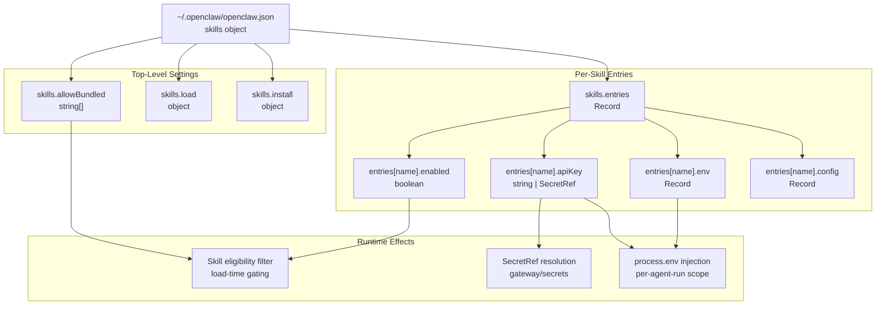
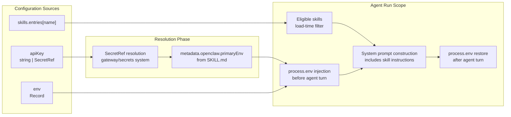
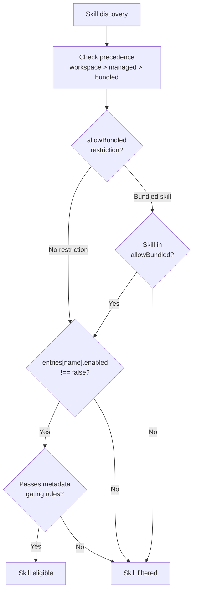

# Skills Configuration

<details>
<summary>Relevant source files</summary>

The following files were used as context for generating this wiki page:

- [README.md](README.md)
- [assets/avatar-placeholder.svg](assets/avatar-placeholder.svg)
- [docs/channels/index.md](docs/channels/index.md)
- [docs/cli/index.md](docs/cli/index.md)
- [docs/cli/onboard.md](docs/cli/onboard.md)
- [docs/concepts/multi-agent.md](docs/concepts/multi-agent.md)
- [docs/docs.json](docs/docs.json)
- [docs/gateway/index.md](docs/gateway/index.md)
- [docs/gateway/troubleshooting.md](docs/gateway/troubleshooting.md)
- [docs/index.md](docs/index.md)
- [docs/reference/wizard.md](docs/reference/wizard.md)
- [docs/start/getting-started.md](docs/start/getting-started.md)
- [docs/start/hubs.md](docs/start/hubs.md)
- [docs/start/onboarding.md](docs/start/onboarding.md)
- [docs/start/setup.md](docs/start/setup.md)
- [docs/start/wizard-cli-automation.md](docs/start/wizard-cli-automation.md)
- [docs/start/wizard-cli-reference.md](docs/start/wizard-cli-reference.md)
- [docs/start/wizard.md](docs/start/wizard.md)
- [docs/tools/skills-config.md](docs/tools/skills-config.md)
- [docs/tools/skills.md](docs/tools/skills.md)
- [docs/web/webchat.md](docs/web/webchat.md)
- [docs/zh-CN/channels/index.md](docs/zh-CN/channels/index.md)
- [extensions/bluebubbles/src/send-helpers.ts](extensions/bluebubbles/src/send-helpers.ts)
- [scripts/clawtributors-map.json](scripts/clawtributors-map.json)
- [scripts/update-clawtributors.ts](scripts/update-clawtributors.ts)
- [scripts/update-clawtributors.types.ts](scripts/update-clawtributors.types.ts)
- [src/agents/subagent-registry-cleanup.test.ts](src/agents/subagent-registry-cleanup.test.ts)

</details>

This document describes the skills configuration system in OpenClaw, including how to enable/disable skills, inject API keys and environment variables, and control skill loading and installation behavior. All skills configuration lives under the `skills` section of `~/.openclaw/openclaw.json`.

For information about the broader skills system including skill sources, precedence rules, and the `SKILL.md` format, see [Skills Overview](#5.1). For managing skills via CLI and ClawHub, see [Skills Management](#5.3).

---

## Configuration Location and Schema

Skills configuration is defined in the `skills` object within `~/.openclaw/openclaw.json`. The configuration controls which skills are enabled, how they receive credentials, and how the skill loader operates.

**Configuration file location:**

```
~/.openclaw/openclaw.json
```

**Basic structure:**

```json5
{
  skills: {
    allowBundled: ['skill-a', 'skill-b'],
    load: {
      extraDirs: ['~/custom-skills'],
      watch: true,
      watchDebounceMs: 250,
    },
    install: {
      preferBrew: true,
      nodeManager: 'npm',
    },
    entries: {
      'skill-name': {
        enabled: true,
        apiKey: '...',
        env: {
          /* ... */
        },
        config: {
          /* ... */
        },
      },
    },
  },
}
```

**Sources:** [docs/tools/skills-config.md:1-50](), [docs/tools/skills.md:189-239]()

---

## Configuration Hierarchy

The following diagram shows how skills configuration maps to runtime behavior and which code paths it affects:



**Sources:** [docs/tools/skills-config.md:1-50](), [docs/tools/skills.md:189-272]()

---

## Top-Level Configuration Fields

### `skills.allowBundled`

Optional allowlist for **bundled skills only**. When set, only bundled skills in the array are eligible for loading. This setting does not affect managed skills (`~/.openclaw/skills`) or workspace skills (`<workspace>/skills`).

**Type:** `string[]` (array of skill names)  
**Default:** `undefined` (all bundled skills eligible)

**Example:**

```json5
{
  skills: {
    allowBundled: ['gemini', 'peekaboo', 'summarize'],
  },
}
```

When `allowBundled` is defined, any bundled skill not in the list is filtered out at load time, regardless of whether it meets other gating requirements.

**Sources:** [docs/tools/skills-config.md:43-44](), [docs/tools/skills.md:226-229]()

---

### `skills.load`

Controls skill discovery and hot-reload behavior.

| Field             | Type       | Default | Description                                               |
| ----------------- | ---------- | ------- | --------------------------------------------------------- |
| `extraDirs`       | `string[]` | `[]`    | Additional skill directories to scan (lowest precedence)  |
| `watch`           | `boolean`  | `true`  | Watch skill folders and refresh snapshot on changes       |
| `watchDebounceMs` | `number`   | `250`   | Debounce interval for skill watcher events (milliseconds) |

**Example:**

```json5
{
  skills: {
    load: {
      extraDirs: [
        '~/Projects/agent-scripts/skills',
        '~/Projects/oss/skill-pack/skills',
      ],
      watch: true,
      watchDebounceMs: 500,
    },
  },
}
```

**Sources:** [docs/tools/skills-config.md:17-20](), [docs/tools/skills-config.md:46-48]()

---

### `skills.install`

Controls behavior of the skill installer (used by macOS Skills UI and CLI skill management).

| Field         | Type                                       | Default | Description                                            |
| ------------- | ------------------------------------------ | ------- | ------------------------------------------------------ |
| `preferBrew`  | `boolean`                                  | `true`  | Prefer Homebrew installers when multiple options exist |
| `nodeManager` | `"npm"` \| `"pnpm"` \| `"yarn"` \| `"bun"` | `"npm"` | Package manager for Node-based skill dependencies      |

**Example:**

```json5
{
  skills: {
    install: {
      preferBrew: true,
      nodeManager: 'pnpm',
    },
  },
}
```

**Important:** `nodeManager` only affects skill installation. The Gateway runtime should remain on Node (Bun is not recommended for Gateway due to WhatsApp/Telegram compatibility issues).

**Sources:** [docs/tools/skills-config.md:22-25](), [docs/tools/skills-config.md:49-50](), [docs/tools/skills.md:180-183]()

---

## Per-Skill Configuration: `skills.entries`

The `skills.entries` object maps skill names to per-skill configuration. Each entry can control whether the skill is enabled, inject API keys and environment variables, and provide custom configuration values.

### Configuration Key Resolution

By default, the configuration key matches the skill name from `SKILL.md` frontmatter. If a skill defines `metadata.openclaw.skillKey`, use that key instead.

**Example:** A skill with `metadata.openclaw.skillKey: "gemini-cli"` would be configured as:

```json5
{
  skills: {
    entries: {
      'gemini-cli': {
        /* config */
      },
    },
  },
}
```

**Sources:** [docs/tools/skills.md:215-218]()

---

### `entries[name].enabled`

Controls whether the skill is loaded. Setting `enabled: false` disables the skill even if it would otherwise pass gating requirements.

**Type:** `boolean`  
**Default:** `true` (or undefined, which is treated as enabled)

**Example:**

```json5
{
  skills: {
    entries: {
      peekaboo: { enabled: true },
      sag: { enabled: false },
    },
  },
}
```

**Sources:** [docs/tools/skills-config.md:27-37](), [docs/tools/skills.md:222]()

---

### `entries[name].apiKey`

Provides the API key for skills that declare `metadata.openclaw.primaryEnv`. This is a convenience field that automatically injects the key into the environment variable specified by `primaryEnv`.

**Type:** `string` (plaintext) or `SecretRef` object  
**SecretRef format:** `{ source: "env" | "file" | "exec", provider: string, id: string }`

**Example (plaintext):**

```json5
{
  skills: {
    entries: {
      'nano-banana-pro': {
        enabled: true,
        apiKey: 'your-gemini-api-key-here',
      },
    },
  },
}
```

**Example (SecretRef):**

```json5
{
  skills: {
    entries: {
      'nano-banana-pro': {
        enabled: true,
        apiKey: {
          source: 'env',
          provider: 'default',
          id: 'GEMINI_API_KEY',
        },
      },
    },
  },
}
```

The skill's `SKILL.md` must include:

```markdown
---
metadata: { 'openclaw': { 'primaryEnv': 'GEMINI_API_KEY' } }
---
```

**Sources:** [docs/tools/skills-config.md:27-37](), [docs/tools/skills.md:223-225]()

---

### `entries[name].env`

Injects environment variables during agent runs. Variables are only injected if they are not already set in the process environment.

**Type:** `Record<string, string>`

**Example:**

```json5
{
  skills: {
    entries: {
      'nano-banana-pro': {
        enabled: true,
        env: {
          GEMINI_API_KEY: 'your-key-here',
          GEMINI_MODEL: 'nano-pro',
        },
      },
    },
  },
}
```

**Important:** Environment injection is scoped to the agent run, not a global shell environment. Variables are applied when the agent turn starts and restored after the run ends.

**Sources:** [docs/tools/skills-config.md:27-37](), [docs/tools/skills.md:223](), [docs/tools/skills.md:230-239]()

---

### `entries[name].config`

Optional bag for custom per-skill configuration. Skills can access these values via the configuration they receive at load time. Custom keys must live in this object.

**Type:** `Record<string, unknown>`

**Example:**

```json5
{
  skills: {
    entries: {
      'custom-skill': {
        enabled: true,
        config: {
          endpoint: 'https://api.example.com',
          timeout: 5000,
          retries: 3,
        },
      },
    },
  },
}
```

**Sources:** [docs/tools/skills.md:226]()

---

## Environment Injection Flow

The following diagram shows how `apiKey` and `env` configuration flows into the agent runtime environment:



**Injection rules:**

1. Environment variables from `env` are only injected if not already present in `process.env`
2. `apiKey` resolution happens before injection
3. SecretRef objects are resolved to plaintext at injection time
4. Environment scope is limited to the duration of the agent run
5. Original environment is restored after the run completes

**Sources:** [docs/tools/skills.md:230-239]()

---

## Complete Configuration Example

The following example demonstrates all configuration options:

```json5
{
  skills: {
    // Bundled skill allowlist (optional)
    allowBundled: ['gemini', 'peekaboo', 'summarize'],

    // Load configuration
    load: {
      extraDirs: ['~/Projects/agent-scripts/skills', '~/shared-skills'],
      watch: true,
      watchDebounceMs: 250,
    },

    // Install preferences
    install: {
      preferBrew: true,
      nodeManager: 'pnpm',
    },

    // Per-skill configuration
    entries: {
      // Skill with plaintext API key
      'nano-banana-pro': {
        enabled: true,
        apiKey: 'plaintext-gemini-key',
        env: {
          GEMINI_MODEL: 'nano-pro',
        },
      },

      // Skill with SecretRef API key
      gemini: {
        enabled: true,
        apiKey: {
          source: 'env',
          provider: 'default',
          id: 'GEMINI_API_KEY',
        },
      },

      // Skill with custom config
      'custom-tool': {
        enabled: true,
        config: {
          endpoint: 'https://api.example.com/v1',
          timeout: 5000,
        },
      },

      // Disabled skill
      sag: {
        enabled: false,
      },

      // Simple enable
      peekaboo: {
        enabled: true,
      },
    },
  },
}
```

**Sources:** [docs/tools/skills-config.md:13-39]()

---

## Configuration Validation

OpenClaw validates the skills configuration at Gateway startup. Invalid configuration prevents the Gateway from starting. Use `openclaw doctor` to detect and repair common configuration issues.

**Validation checks:**

- `allowBundled` must be an array of strings if present
- `load.extraDirs` must be an array of valid paths
- `load.watch` must be boolean
- `load.watchDebounceMs` must be a positive number
- `install.preferBrew` must be boolean
- `install.nodeManager` must be one of: `npm`, `pnpm`, `yarn`, `bun`
- `entries` must be an object with valid per-skill configuration

**CLI validation:**

```bash
openclaw config validate
```

**Sources:** [docs/cli/index.md:395-400]()

---

## Interaction with Skill Gating

Skills configuration works alongside load-time gating rules defined in `SKILL.md` metadata. A skill must pass **both** configuration checks and gating requirements to be eligible.

**Eligibility flow:**



**Gating rules include:**

- `metadata.openclaw.requires.bins`: required binaries on PATH
- `metadata.openclaw.requires.anyBins`: at least one binary required
- `metadata.openclaw.requires.env`: required environment variables (or config values)
- `metadata.openclaw.requires.config`: required config paths that must be truthy
- `metadata.openclaw.os`: platform restrictions

**Sources:** [docs/tools/skills.md:106-146](), [docs/tools/skills.md:222-229]()

---

## CLI Integration

Skills configuration can be inspected and modified via CLI commands:

**View skills status:**

```bash
openclaw skills list
openclaw skills list --eligible  # Show only eligible skills
openclaw skills check            # Summary of ready vs missing requirements
```

**View skill details:**

```bash
openclaw skills info <skill-name>
```

**Modify configuration:**

```bash
openclaw config get skills.entries.peekaboo
openclaw config set skills.entries.peekaboo.enabled true
openclaw config set skills.allowBundled '["gemini","peekaboo"]'
```

**Sources:** [docs/cli/index.md:471-488](), [docs/tools/skills.md:52-68]()

---

## Session Snapshot Behavior

OpenClaw snapshots eligible skills when a session starts and reuses that snapshot for subsequent turns in the same session. Configuration changes (including `enabled` flags and `env` values) take effect:

1. Immediately for new sessions
2. After explicit session reset (`/new` command)
3. After Gateway restart
4. After configuration hot-reload (if enabled)

This improves performance by avoiding repeated skill discovery and gating checks for each agent turn.

**Sources:** [docs/tools/skills.md:244-252]()

---

## Security Considerations

**API key storage:**

- Plaintext API keys in configuration are readable by any process with filesystem access
- Use SecretRef objects to reference environment variables or secret providers
- Store sensitive configuration in `~/.openclaw/openclaw.json` with `0600` permissions

**Environment injection scope:**

- Variables are injected into the Gateway process, not isolated sandboxes
- Sandboxed agent runs do not inherit these variables unless explicitly passed
- Keep secrets out of system prompts and agent logs

**Skill source trust:**

- Workspace and managed skills are loaded from user-controlled directories
- Bundled skills ship with the OpenClaw package
- Use `allowBundled` to restrict which bundled skills can load
- Review third-party skills before enabling

**Sources:** [docs/tools/skills.md:69-77](), [docs/gateway/security.md:1-50]()

---

## Related Configuration

Skills configuration interacts with other parts of the OpenClaw configuration:

| Related Config               | Purpose                                                | Reference                         |
| ---------------------------- | ------------------------------------------------------ | --------------------------------- |
| `agents.defaults.workspace`  | Default workspace path containing `skills/` directory  | [Configuration Reference](#2.3.1) |
| `agents.list[].workspace`    | Per-agent workspace override                           | [Multi-Agent Routing](#2.5)       |
| `tools.allow` / `tools.deny` | Tool-level access control (affects tool dispatch)      | [Tool Policies](#3.4.1)           |
| `secrets`                    | Secret provider configuration for SecretRef resolution | [Secret Management](#10.3)        |
| `gateway.reload.mode`        | Controls whether config changes trigger hot-reload     | [Configuration System](#2.3)      |

**Sources:** [docs/tools/skills.md:28-40](), [docs/gateway/configuration.md:1-100]()
