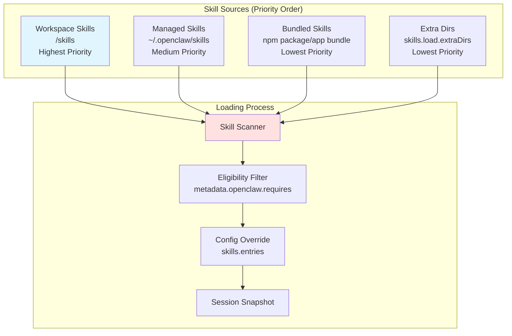
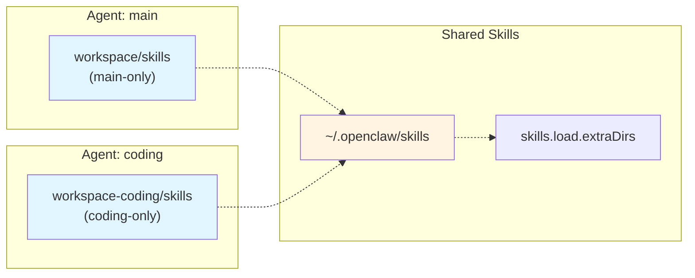
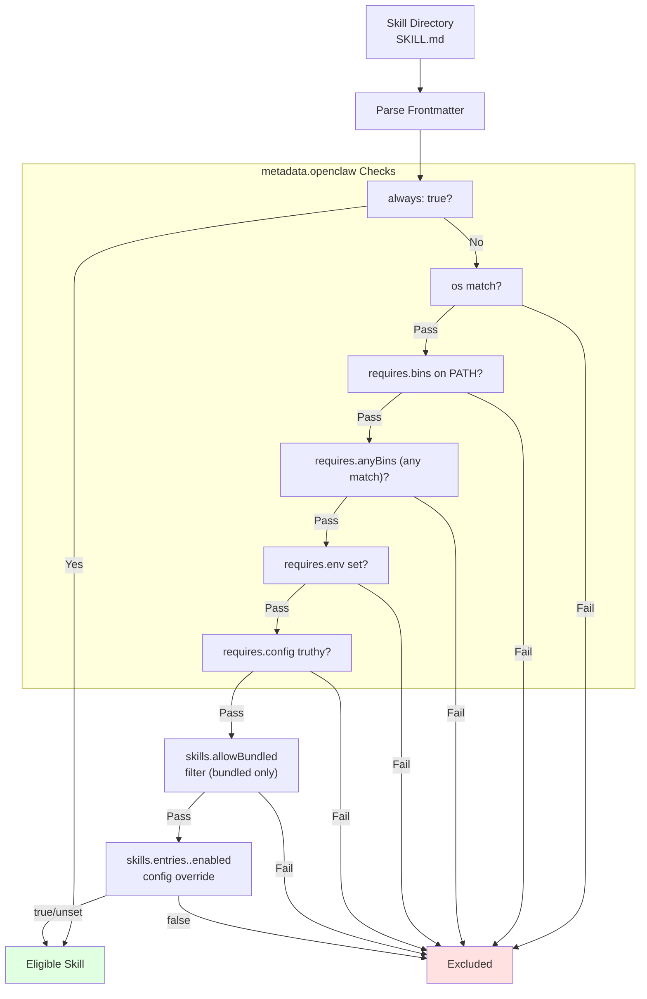
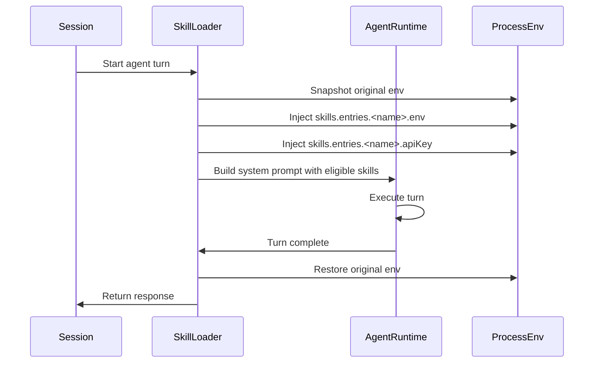
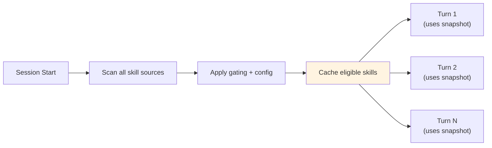

# Skills Overview

<details>
<summary>Relevant source files</summary>

The following files were used as context for generating this wiki page:

- [README.md](README.md)
- [assets/avatar-placeholder.svg](assets/avatar-placeholder.svg)
- [docs/channels/index.md](docs/channels/index.md)
- [docs/cli/index.md](docs/cli/index.md)
- [docs/cli/onboard.md](docs/cli/onboard.md)
- [docs/concepts/multi-agent.md](docs/concepts/multi-agent.md)
- [docs/docs.json](docs/docs.json)
- [docs/gateway/index.md](docs/gateway/index.md)
- [docs/gateway/troubleshooting.md](docs/gateway/troubleshooting.md)
- [docs/index.md](docs/index.md)
- [docs/reference/wizard.md](docs/reference/wizard.md)
- [docs/start/getting-started.md](docs/start/getting-started.md)
- [docs/start/hubs.md](docs/start/hubs.md)
- [docs/start/onboarding.md](docs/start/onboarding.md)
- [docs/start/setup.md](docs/start/setup.md)
- [docs/start/wizard-cli-automation.md](docs/start/wizard-cli-automation.md)
- [docs/start/wizard-cli-reference.md](docs/start/wizard-cli-reference.md)
- [docs/start/wizard.md](docs/start/wizard.md)
- [docs/tools/skills-config.md](docs/tools/skills-config.md)
- [docs/tools/skills.md](docs/tools/skills.md)
- [docs/web/webchat.md](docs/web/webchat.md)
- [docs/zh-CN/channels/index.md](docs/zh-CN/channels/index.md)
- [extensions/bluebubbles/src/send-helpers.ts](extensions/bluebubbles/src/send-helpers.ts)
- [scripts/clawtributors-map.json](scripts/clawtributors-map.json)
- [scripts/update-clawtributors.ts](scripts/update-clawtributors.ts)
- [scripts/update-clawtributors.types.ts](scripts/update-clawtributors.types.ts)
- [src/agents/subagent-registry-cleanup.test.ts](src/agents/subagent-registry-cleanup.test.ts)

</details>

This document describes the skills system in OpenClaw, which extends agent capabilities through modular instruction sets packaged as skill folders. Skills teach the agent how to use tools, discover binaries on the host, and inject environment variables or API keys at runtime.

For configuration details (enabling/disabling, API key injection, allowlists), see [Skills Configuration](#5.2).  
For CLI commands (installation, status, management), see [Skills Management](#5.3).

---

## Skills Concept

A **skill** is a directory containing a `SKILL.md` file with YAML frontmatter and markdown instructions. OpenClaw loads skills from three locations and filters them at load time based on platform, binary presence, environment variables, and configuration flags.

Skills follow the **[AgentSkills.io](https://agentskills.io)** specification for compatibility with the embedded Pi agent runtime.

**Sources:** [docs/tools/skills.md:1-50]()

---

## Skill Sources and Precedence

OpenClaw loads skills from three tiers, with workspace skills winning over managed, and managed winning over bundled:



**Precedence rules:**

| Tier  | Location                | Scope     | Overrides         |
| ----- | ----------------------- | --------- | ----------------- |
| **1** | `<workspace>/skills`    | Per-agent | Managed + Bundled |
| **2** | `~/.openclaw/skills`    | Shared    | Bundled           |
| **3** | Bundled (package)       | Global    | None              |
| **4** | `skills.load.extraDirs` | Shared    | None              |

If a skill name exists in multiple locations, the highest-priority source wins. Plugins can contribute additional skill directories via `openclaw.plugin.json` manifest entries.

**Sources:** [docs/tools/skills.md:13-48](), [docs/tools/skills-config.md:15-25]()

---

## Per-Agent vs Shared Skills

In multi-agent configurations, each agent has its own workspace directory. Skills in `<workspace>/skills` are **per-agent** and isolated. Skills in `~/.openclaw/skills` and `skills.load.extraDirs` are **shared** across all agents on the same host.



**Isolation contract:**

- **Workspace skills** load only for that agent's session.
- **Shared skills** load for all agents unless filtered by config or gating rules.
- Precedence still applies within each agent: workspace > shared > bundled.

**Sources:** [docs/tools/skills.md:28-40](), [docs/concepts/multi-agent.md:14-38]()

---

## SKILL.md Format

Every skill directory must contain a `SKILL.md` file with YAML frontmatter. The embedded Pi agent parser requires **single-line** frontmatter keys.

### Minimal Example

```markdown
---
name: nano-banana-pro
description: Generate or edit images via Gemini 3 Pro Image
---

Use the `gemini` CLI to generate images. Call:

gemini generate "a space lobster"

The result will be written to `{baseDir}/output.png`.
```

### Frontmatter Fields

| Field                      | Required | Description                                      |
| -------------------------- | -------- | ------------------------------------------------ | --------------------------------------------------- |
| `name`                     | Yes      | Skill identifier (used in config keys)           |
| `description`              | Yes      | Short summary shown to the agent                 |
| `metadata`                 | No       | Single-line JSON object with OpenClaw extensions |
| `homepage`                 | No       | URL shown in macOS Skills UI                     |
| `user-invocable`           | No       | `true                                            | false` (default: true). Exposes as slash command    |
| `disable-model-invocation` | No       | `true                                            | false` (default: false). Excludes from model prompt |
| `command-dispatch`         | No       | `tool` = bypass model and invoke tool directly   |
| `command-tool`             | No       | Tool name when `command-dispatch: tool`          |
| `command-arg-mode`         | No       | `raw` = forward raw args string to tool          |

**Instruction references:**

- Use `{baseDir}` in markdown body to reference the skill folder path.
- Example: `{baseDir}/scripts/process.py`

**Sources:** [docs/tools/skills.md:78-105](), [docs/reference/wizard.md:84-100]()

---

## Gating and Eligibility

OpenClaw filters skills at **load time** using `metadata.openclaw` requirements. Skills missing required binaries, environment variables, or config keys are excluded from the agent's system prompt.

### Gating Flow



### metadata.openclaw Fields

```markdown
---
name: gemini
description: Use Gemini CLI for coding assistance
metadata:
  {
    'openclaw':
      {
        'emoji': '♊️',
        'requires': { 'bins': ['gemini'], 'env': ['GEMINI_API_KEY'] },
        'primaryEnv': 'GEMINI_API_KEY',
        'install':
          [
            {
              'id': 'brew',
              'kind': 'brew',
              'formula': 'gemini-cli',
              'bins': ['gemini'],
              'label': 'Install Gemini CLI (brew)',
            },
          ],
      },
  }
---
```

**Field reference:**

| Field              | Type     | Description                                  |
| ------------------ | -------- | -------------------------------------------- |
| `always`           | boolean  | Always include (skip other gates)            |
| `emoji`            | string   | macOS Skills UI icon                         |
| `homepage`         | string   | Website link in UI                           |
| `os`               | string[] | Platform filter (`darwin`, `linux`, `win32`) |
| `requires.bins`    | string[] | All must exist on `PATH`                     |
| `requires.anyBins` | string[] | At least one must exist                      |
| `requires.env`     | string[] | All must be set (env or config)              |
| `requires.config`  | string[] | All must be truthy in `openclaw.json`        |
| `primaryEnv`       | string   | Env var for `skills.entries.<name>.apiKey`   |
| `install`          | object[] | Installer specs for macOS Skills UI          |

**Sandbox note:** `requires.bins` checks the **host** at load time. If an agent runs sandboxed, the binary must also exist **inside the container**. Install it via `agents.defaults.sandbox.docker.setupCommand`.

**Sources:** [docs/tools/skills.md:107-185](), [docs/tools/skills-config.md:1-50]()

---

## Environment Injection

When an agent run starts, OpenClaw:

1. Reads skill `metadata.openclaw.primaryEnv` and `metadata.openclaw.requires.env`.
2. Applies `skills.entries.<name>.env` and `skills.entries.<name>.apiKey` to `process.env`.
3. Builds the system prompt with eligible skills.
4. Restores the original environment after the run ends.

Environment injection is **scoped to the agent turn**, not a persistent shell environment.



**Config example:**

```json5
{
  skills: {
    entries: {
      'nano-banana-pro': {
        enabled: true,
        apiKey: { source: 'env', provider: 'default', id: 'GEMINI_API_KEY' },
        env: {
          GEMINI_MODEL: 'nano-pro',
          GEMINI_ENDPOINT: 'https://example.invalid',
        },
      },
    },
  },
}
```

**Sources:** [docs/tools/skills.md:216-240](), [docs/tools/skills-config.md:1-50]()

---

## Session Snapshot

For performance, OpenClaw snapshots eligible skills **when a session starts** and reuses that list for subsequent turns in the same session. Changes to skill files, config, or environment do **not** affect active sessions until the session is restarted or the gateway is reloaded.



**Refresh triggers:**

- Session restart (via `/new` or `sessions.reset` RPC)
- Gateway reload (via config file change or `gateway.restart`)
- Skill file watcher event (when `skills.load.watch: true`, default)

**Sources:** [docs/tools/skills.md:242-256]()

---

## Skill Discovery and Installation

Skills can be installed from:

- **ClawHub** (public registry at [https://clawhub.com](https://clawhub.com)): `clawhub install <skill-slug>`
- **npm packages** (plugins): listed in `openclaw.plugin.json` manifest
- **Manual copy** into workspace or managed folders

The macOS Skills UI shows installer specs from `metadata.openclaw.install` and can auto-install via `brew`, `npm`, `go`, `uv`, or download archives.

**Sources:** [docs/tools/skills.md:50-68](), [docs/tools/clawhub.md:1-100]()

---

## Related Configuration

Skills are configured under the `skills` top-level key in `~/.openclaw/openclaw.json`. See [Skills Configuration](#5.2) for:

- `skills.allowBundled` (bundled skill allowlist)
- `skills.load.extraDirs` (additional search paths)
- `skills.load.watch` (file watcher toggle)
- `skills.install.preferBrew` (installer preference)
- `skills.entries.<name>` (per-skill overrides)

**Sources:** [docs/tools/skills-config.md:1-50]()

---

## Security Considerations

- Treat third-party skills as **untrusted code**. Read them before enabling.
- Workspace and extra-dir skill discovery only accepts files whose resolved realpath stays inside the configured root (no symlink escapes).
- `skills.entries.*.env` and `skills.entries.*.apiKey` inject secrets into the **host process** for that agent turn, not the sandbox.
- For broader threat models, see [Security](#10).

**Sources:** [docs/tools/skills.md:70-77]()
