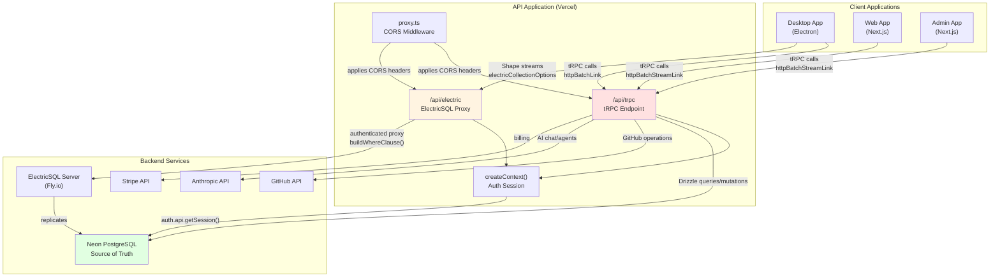
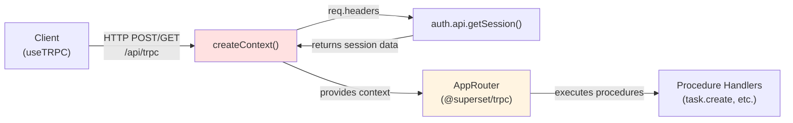
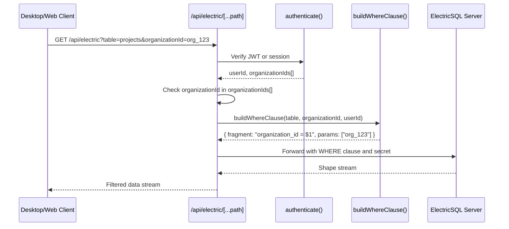
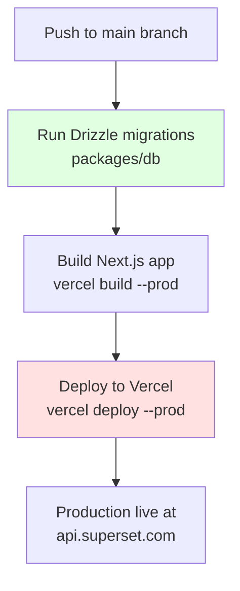

# API Application

<details>
<summary>Relevant source files</summary>

The following files were used as context for generating this wiki page:

- [.github/templates/cleanup-comment.md](.github/templates/cleanup-comment.md)
- [.github/templates/preview-comment.md](.github/templates/preview-comment.md)
- [.github/workflows/ci.yml](.github/workflows/ci.yml)
- [.github/workflows/cleanup-preview.yml](.github/workflows/cleanup-preview.yml)
- [.github/workflows/deploy-preview.yml](.github/workflows/deploy-preview.yml)
- [.github/workflows/deploy-production.yml](.github/workflows/deploy-production.yml)
- [apps/admin/src/trpc/react.tsx](apps/admin/src/trpc/react.tsx)
- [apps/api/package.json](apps/api/package.json)
- [apps/api/src/app/api/electric/[...path]/route.ts](apps/api/src/app/api/electric/[...path]/route.ts)
- [apps/api/src/app/api/electric/[...path]/utils.ts](apps/api/src/app/api/electric/[...path]/utils.ts)
- [apps/api/src/env.ts](apps/api/src/env.ts)
- [apps/api/src/proxy.ts](apps/api/src/proxy.ts)
- [apps/api/src/trpc/context.ts](apps/api/src/trpc/context.ts)
- [apps/desktop/src/renderer/routes/\_authenticated/providers/CollectionsProvider/CollectionsProvider.tsx](apps/desktop/src/renderer/routes/_authenticated/providers/CollectionsProvider/CollectionsProvider.tsx)
- [apps/desktop/src/renderer/routes/\_authenticated/providers/CollectionsProvider/collections.ts](apps/desktop/src/renderer/routes/_authenticated/providers/CollectionsProvider/collections.ts)
- [apps/web/src/trpc/react.tsx](apps/web/src/trpc/react.tsx)
- [fly.toml](fly.toml)

</details>

The API application is a Next.js backend server that provides type-safe tRPC endpoints and an ElectricSQL proxy with row-level security. It serves as the primary backend for the Web, Admin, and Desktop applications, handling authentication, database mutations, external service integrations, and secure access to real-time data synchronization.

For information about the Desktop app's tRPC communication with the API, see [IPC and tRPC Communication](#2.5). For details on ElectricSQL synchronization architecture, see [ElectricSQL Synchronization](#3.2).

---

## Technology Stack

The API application is built on the following core technologies:

| Technology             | Purpose                                               |
| ---------------------- | ----------------------------------------------------- |
| **Next.js 16**         | Web framework and deployment target                   |
| **tRPC 11**            | Type-safe API layer for mutations and queries         |
| **Better Auth**        | Authentication and session management                 |
| **Drizzle ORM**        | Database access to Neon PostgreSQL                    |
| **ElectricSQL Client** | Real-time sync proxy configuration                    |
| **Zod**                | Runtime schema validation                             |
| **SuperJSON**          | Data serialization with support for dates, maps, sets |

**Sources:** [apps/api/package.json:1-62]()

---

## Architecture Overview



**Diagram: API Application Request Flow**

The API serves as a gateway between client applications and backend services, providing two primary endpoints: tRPC for mutations/queries and an ElectricSQL proxy for real-time synchronization.

**Sources:** [apps/api/src/env.ts:1-77](), [apps/api/src/proxy.ts:1-75](), [apps/api/src/app/api/electric/[...path]/route.ts:1-105]()

---

## Core Components

### tRPC Server Setup

The API exposes tRPC procedures through a Next.js route handler. Client applications import the `AppRouter` type from `@superset/trpc` for end-to-end type safety.



**Diagram: tRPC Request Context Creation**

The `createContext()` function extracts authentication data from request headers and creates a tRPC context containing the session and auth API instance:

**Key File:** [apps/api/src/trpc/context.ts:1-19]()

```typescript
// Context creation flow:
// 1. Extract session from request headers via Better Auth
// 2. Pass session to createTRPCContext from @superset/trpc
// 3. Context includes: session, auth, headers
```

**Sources:** [apps/api/src/trpc/context.ts:1-19]()

---

### ElectricSQL Proxy with Row-Level Security

The `/api/electric/[...path]` route proxies ElectricSQL shape requests while enforcing organization-based access control.



**Diagram: ElectricSQL Proxy Authentication Flow**

**Authentication Methods:**

The proxy supports two authentication methods ([apps/api/src/app/api/electric/[...path]/route.ts:11-32]()):

1. **JWT Bearer Token**: Extracted from `Authorization: Bearer <token>` header
   - Verified using `auth.api.verifyJWT()`
   - Payload contains `sub` (userId) and `organizationIds` array
2. **Session Cookie**: Fallback method
   - Retrieved via `auth.api.getSession({ headers })`
   - Returns userId and organizationIds from session

**Row-Level Security Implementation:**

The `buildWhereClause()` function generates SQL WHERE clauses based on table name ([apps/api/src/app/api/electric/[...path]/utils.ts:69-195]()):

| Table                             | WHERE Clause Logic                                |
| --------------------------------- | ------------------------------------------------- |
| `tasks`, `projects`, `workspaces` | `organization_id = $1`                            |
| `auth.organizations`              | Query user's memberships, then `id IN (...)`      |
| `auth.users`                      | `$1 = ANY(organization_ids)`                      |
| `auth.apikeys`                    | `metadata LIKE '%"organizationId":"$1"%'`         |
| `integration_connections`         | Excludes `accessToken` and `refreshToken` columns |

**Sensitive Column Filtering:**

For tables containing secrets, the proxy explicitly sets the `columns` parameter ([apps/api/src/app/api/electric/[...path]/route.ts:77-89]()):

```typescript
// API keys: only expose non-secret fields
if (tableName === 'auth.apikeys') {
  originUrl.searchParams.set('columns', 'id,name,start,created_at,last_request')
}

// Integration connections: exclude OAuth tokens
if (tableName === 'integration_connections') {
  originUrl.searchParams.set(
    'columns',
    'id,organization_id,...,created_at,updated_at'
  )
}
```

**Sources:** [apps/api/src/app/api/electric/[...path]/route.ts:1-105](), [apps/api/src/app/api/electric/[...path]/utils.ts:1-196]()

---

### CORS Configuration

The `proxy.ts` middleware configures CORS headers for cross-origin requests from Desktop, Web, and Admin applications.

**Allowed Origins:**

[apps/api/src/proxy.ts:14-19]() defines the whitelist:

```typescript
const allowedOrigins = [
  env.NEXT_PUBLIC_WEB_URL, // https://app.superset.com
  env.NEXT_PUBLIC_ADMIN_URL, // https://admin.superset.com
  env.NEXT_PUBLIC_DESKTOP_URL, // superset://
  ...desktopDevOrigins, // http://localhost:5173 (dev only)
]
```

**Exposed Headers:**

The middleware exposes ElectricSQL and Durable Streams headers required for synchronization ([apps/api/src/proxy.ts:28-47]()):

- **Electric headers**: `electric-offset`, `electric-handle`, `electric-schema`, `electric-cursor`, `electric-chunk-last-offset`, `electric-up-to-date`
- **Stream headers**: `Stream-Next-Offset`, `Stream-Cursor`, `Stream-Up-To-Date`, `Stream-Closed`, `Producer-Epoch`

**Sources:** [apps/api/src/proxy.ts:1-75]()

---

## Environment Configuration

The API requires extensive environment variables for database access, authentication, and external integrations.

### Database and Sync

| Variable                | Purpose                                      |
| ----------------------- | -------------------------------------------- |
| `DATABASE_URL`          | Pooled connection string for Neon PostgreSQL |
| `DATABASE_URL_UNPOOLED` | Direct connection for migrations             |
| `ELECTRIC_URL`          | ElectricSQL server endpoint (Fly.io)         |
| `ELECTRIC_SECRET`       | Shared secret for Electric authentication    |
| `BLOB_READ_WRITE_TOKEN` | Vercel Blob storage token                    |

### Authentication

| Variable                                    | Purpose                                 |
| ------------------------------------------- | --------------------------------------- |
| `BETTER_AUTH_SECRET`                        | Encryption key for Better Auth sessions |
| `GOOGLE_CLIENT_ID` / `GOOGLE_CLIENT_SECRET` | Google OAuth                            |
| `GH_CLIENT_ID` / `GH_CLIENT_SECRET`         | GitHub OAuth                            |
| `NEXT_PUBLIC_COOKIE_DOMAIN`                 | Session cookie domain                   |

### External Services

| Variable                                    | Purpose                          |
| ------------------------------------------- | -------------------------------- |
| `GH_APP_ID` / `GH_APP_PRIVATE_KEY`          | GitHub App for repository access |
| `ANTHROPIC_API_KEY`                         | Claude API for AI features       |
| `LINEAR_CLIENT_ID` / `LINEAR_CLIENT_SECRET` | Linear integration               |
| `SLACK_CLIENT_ID` / `SLACK_CLIENT_SECRET`   | Slack integration                |
| `STRIPE_SECRET_KEY`                         | Billing and subscriptions        |
| `RESEND_API_KEY`                            | Transactional email              |
| `KV_REST_API_URL` / `KV_REST_API_TOKEN`     | Upstash Redis for rate limiting  |
| `QSTASH_TOKEN`                              | QStash for async job processing  |
| `TAVILY_API_KEY`                            | Web search API for agents        |

### Public Configuration

| Variable                                               | Purpose                                    |
| ------------------------------------------------------ | ------------------------------------------ |
| `NEXT_PUBLIC_API_URL`                                  | API base URL (https://api.superset.com)    |
| `NEXT_PUBLIC_WEB_URL`                                  | Web app URL (https://app.superset.com)     |
| `NEXT_PUBLIC_ADMIN_URL`                                | Admin app URL (https://admin.superset.com) |
| `NEXT_PUBLIC_POSTHOG_KEY` / `NEXT_PUBLIC_POSTHOG_HOST` | Analytics                                  |
| `NEXT_PUBLIC_SENTRY_DSN_API`                           | Error tracking                             |

**Sources:** [apps/api/src/env.ts:1-77](), [.github/workflows/deploy-production.yml:69-123]()

---

## Deployment Pipeline

The API is deployed to Vercel via GitHub Actions workflows for both production and preview environments.

### Production Deployment



**Diagram: Production Deployment Flow**

**Workflow:** [.github/workflows/deploy-production.yml:42-175]()

1. **Database Migrations** ([.github/workflows/deploy-production.yml:35-40]()): Run `drizzle-kit migrate` against production Neon database
2. **Build**: `vercel build --prod` with all environment variables injected
3. **Deploy**: `vercel deploy --prod --prebuilt` pushes to production domain

### Preview Deployment

Each pull request creates an isolated preview environment with:

- **Neon Branch Database**: [.github/workflows/deploy-preview.yml:24-78]()
  - Created via `neondatabase/create-branch-action@v6`
  - Automatically deleted when PR closes
- **Electric Fly.io App**: [.github/workflows/deploy-preview.yml:80-123]()
  - Deployed to `superset-electric-pr-<number>.fly.dev`
  - Uses preview database URL
- **Vercel API Preview**: [.github/workflows/deploy-preview.yml:125-286]()
  - Aliased to `api-pr-<number>-superset.vercel.app`
  - Environment variables reference preview database and Electric URLs

**Cross-Environment URL References:**

The deployment workflow sets consistent URLs across all preview apps ([.github/workflows/deploy-preview.yml:16-21]()):

```yaml
API_ALIAS: api-pr-${{ github.event.pull_request.number }}-superset.vercel.app
WEB_ALIAS: web-pr-${{ github.event.pull_request.number }}-superset.vercel.app
ELECTRIC_URL: https://superset-electric-pr-${{ github.event.pull_request.number }}.fly.dev/v1/shape
```

**Sources:** [.github/workflows/deploy-production.yml:1-551](), [.github/workflows/deploy-preview.yml:1-766]()

---

## Client Integration

### Desktop Application

The Desktop app creates a tRPC proxy client to call API procedures ([apps/desktop/src/renderer/routes/\_authenticated/providers/CollectionsProvider/collections.ts:138-149]()):

```typescript
const apiClient = createTRPCProxyClient<AppRouter>({
  links: [
    httpBatchLink({
      url: `${env.NEXT_PUBLIC_API_URL}/api/trpc`,
      headers: () => {
        const token = getAuthToken()
        return token ? { Authorization: `Bearer ${token}` } : {}
      },
      transformer: superjson,
    }),
  ],
})
```

**Electric Collection Mutations:**

Desktop collections use the API client for optimistic updates ([apps/desktop/src/renderer/routes/\_authenticated/providers/CollectionsProvider/collections.ts:188-205]()):

```typescript
onInsert: async ({ transaction }) => {
  const item = transaction.mutations[0].modified;
  const result = await apiClient.task.create.mutate(item);
  return { txid: result.txid };  // Fast-forward to this transaction
},
```

The returned `txid` allows ElectricSQL to skip ahead in the sync stream, ensuring the local mutation immediately reflects the server state.

**Sources:** [apps/desktop/src/renderer/routes/\_authenticated/providers/CollectionsProvider/collections.ts:1-675]()

### Web and Admin Applications

Both Next.js apps use `httpBatchStreamLink` for streaming responses:

**Web App Setup:** [apps/web/src/trpc/react.tsx:36-56]()

```typescript
const trpcClient = createTRPCClient<AppRouter>({
  links: [
    httpBatchStreamLink({
      transformer: SuperJSON,
      url: `${env.NEXT_PUBLIC_API_URL}/api/trpc`,
      headers() {
        return { 'x-trpc-source': 'nextjs-react' }
      },
      fetch(url, options) {
        return fetch(url, { ...options, credentials: 'include' })
      },
    }),
  ],
})
```

**Admin App Setup:** [apps/admin/src/trpc/react.tsx:36-61]()

Identical pattern with `credentials: "include"` to send session cookies.

**Sources:** [apps/web/src/trpc/react.tsx:1-66](), [apps/admin/src/trpc/react.tsx:1-71]()

---

## Development Workflow

### Local Development

Start the API server with environment variables loaded from `.env`:

```bash
cd apps/api
bun run dev  # Starts Next.js dev server on port 3001
```

The dev script uses `dotenv -e ../../.env` to load configuration ([apps/api/package.json:9]()).

### Type Safety Across Apps

All client applications import the `AppRouter` type from `@superset/trpc`, ensuring procedure calls are type-checked at compile time:

```typescript
import type { AppRouter } from '@superset/trpc'

// Desktop uses createTRPCProxyClient<AppRouter>
// Web/Admin use createTRPCClient<AppRouter>
```

Changes to tRPC procedures in the `@superset/trpc` package automatically propagate type errors to all consumers.

**Sources:** [apps/api/package.json:1-62]()
