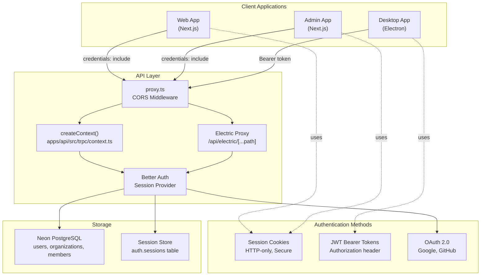
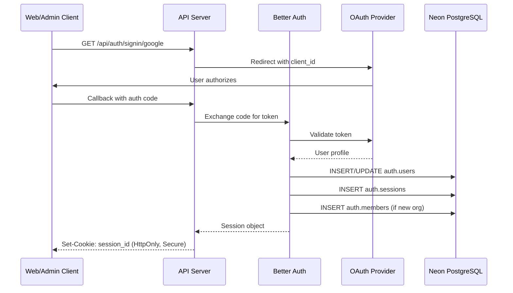
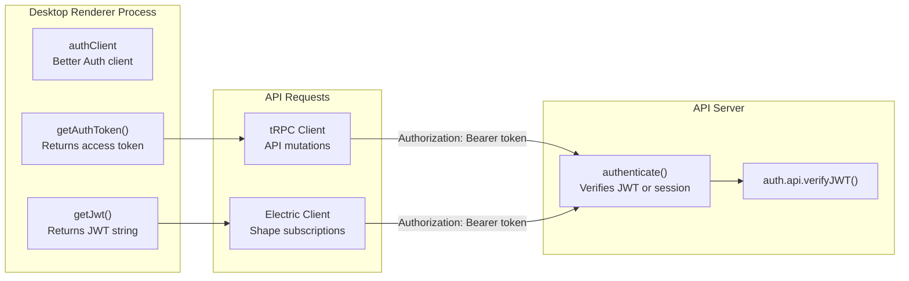
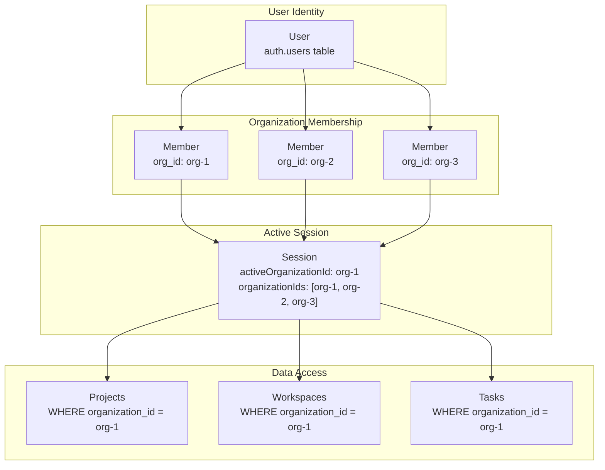
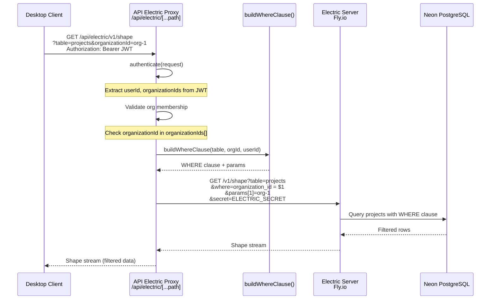
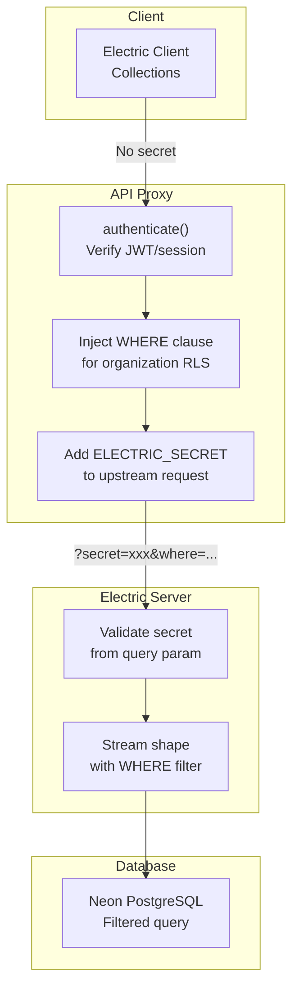
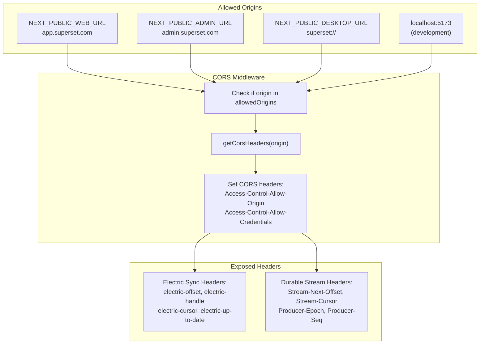
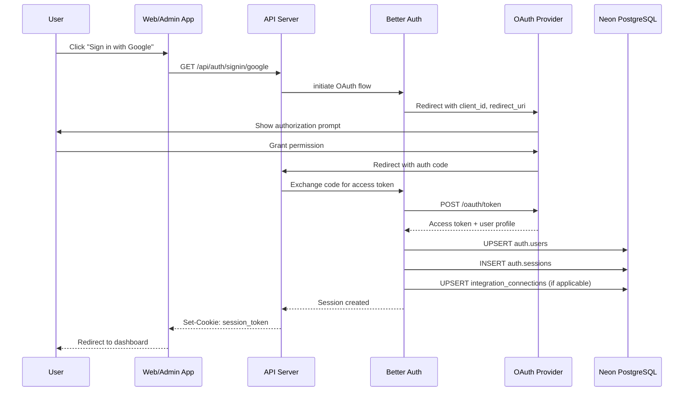
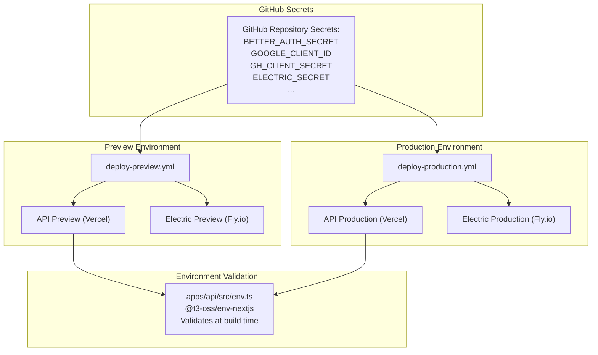

# Authentication and Authorization

<details>
<summary>Relevant source files</summary>

The following files were used as context for generating this wiki page:

- [.github/templates/cleanup-comment.md](.github/templates/cleanup-comment.md)
- [.github/templates/preview-comment.md](.github/templates/preview-comment.md)
- [.github/workflows/ci.yml](.github/workflows/ci.yml)
- [.github/workflows/cleanup-preview.yml](.github/workflows/cleanup-preview.yml)
- [.github/workflows/deploy-preview.yml](.github/workflows/deploy-preview.yml)
- [.github/workflows/deploy-production.yml](.github/workflows/deploy-production.yml)
- [apps/admin/src/trpc/react.tsx](apps/admin/src/trpc/react.tsx)
- [apps/api/package.json](apps/api/package.json)
- [apps/api/src/app/api/electric/[...path]/route.ts](apps/api/src/app/api/electric/[...path]/route.ts)
- [apps/api/src/app/api/electric/[...path]/utils.ts](apps/api/src/app/api/electric/[...path]/utils.ts)
- [apps/api/src/env.ts](apps/api/src/env.ts)
- [apps/api/src/proxy.ts](apps/api/src/proxy.ts)
- [apps/api/src/trpc/context.ts](apps/api/src/trpc/context.ts)
- [apps/desktop/src/renderer/routes/\_authenticated/providers/CollectionsProvider/CollectionsProvider.tsx](apps/desktop/src/renderer/routes/_authenticated/providers/CollectionsProvider/CollectionsProvider.tsx)
- [apps/desktop/src/renderer/routes/\_authenticated/providers/CollectionsProvider/collections.ts](apps/desktop/src/renderer/routes/_authenticated/providers/CollectionsProvider/collections.ts)
- [apps/web/src/trpc/react.tsx](apps/web/src/trpc/react.tsx)
- [fly.toml](fly.toml)

</details>

This document covers the authentication and authorization systems used across Superset's cloud services (API, Web, Admin) and the Desktop application. The system uses Better Auth for session management, JWT tokens for desktop authentication, and implements organization-based row-level security for data access through ElectricSQL.

For information about data synchronization between cloud and desktop, see section 2.10. For details on the Desktop-specific collections and data access patterns, see section 2.10.1.

---

## Overview

Superset's authentication system handles three distinct client types:

1. **Web Applications** (Web, Admin, Marketing) - Cookie-based sessions via Better Auth
2. **Desktop Application** - JWT bearer tokens for API and ElectricSQL access
3. **External Integrations** - OAuth 2.0 flows for GitHub, Google, Linear, Slack

Authorization is implemented using organization-based access control, where users belong to one or more organizations, and all data access is filtered by organization membership. ElectricSQL enforces row-level security (RLS) by proxying requests through the API, which injects WHERE clauses based on the authenticated user's organization memberships.

**Sources:** [apps/api/src/env.ts:1-77](), [apps/api/src/app/api/electric/[...path]/route.ts:1-105](), [apps/api/src/trpc/context.ts:1-19]()

---

## Authentication Architecture



**Authentication Flow Components:**

| Component         | Purpose                                 | Location                                                   |
| ----------------- | --------------------------------------- | ---------------------------------------------------------- |
| `BetterAuth`      | OAuth and session management library    | `@superset/auth` package                                   |
| `createContext()` | Creates tRPC context with session       | [apps/api/src/trpc/context.ts:4-18]()                      |
| `authenticate()`  | Validates JWT or session cookies        | [apps/api/src/app/api/electric/[...path]/route.ts:11-32]() |
| `proxy()`         | CORS middleware with credential support | [apps/api/src/proxy.ts:52-67]()                            |

**Sources:** [apps/api/src/trpc/context.ts:1-19](), [apps/api/src/app/api/electric/[...path]/route.ts:1-105](), [apps/api/src/proxy.ts:1-75]()

---

## Session Management

Better Auth manages sessions for web and admin applications. Sessions are stored server-side with cookies sent to clients.

### Session Creation Flow



### Session Retrieval

The `createContext()` function extracts session data for all tRPC procedures:

```typescript
// apps/api/src/trpc/context.ts:4-18
export const createContext = async ({
  req,
}: {
  req: Request
  resHeaders: Headers
}) => {
  const session = await auth.api.getSession({
    headers: req.headers,
  })
  return createTRPCContext({
    session,
    auth,
    headers: req.headers,
  })
}
```

The `session` object contains:

- `user`: User ID, email, name, avatar
- `session`: Active organization ID, organization IDs array
- `token`: Session token for validation

**Sources:** [apps/api/src/trpc/context.ts:1-19](), [apps/api/src/env.ts:22-22]()

---

## JWT Authentication for Desktop

The Desktop application uses JWT tokens instead of cookies for authentication with both the API and ElectricSQL.

### JWT Token Structure

JWT tokens include the following claims:

| Claim             | Description          | Usage                             |
| ----------------- | -------------------- | --------------------------------- |
| `sub`             | User ID              | Identifies the authenticated user |
| `organizationIds` | Array of org IDs     | Used for multi-org authorization  |
| `exp`             | Expiration timestamp | Token validity period             |
| `iat`             | Issued at timestamp  | Token creation time               |

### JWT Authentication Implementation



The Desktop app provides JWT tokens in two ways:

1. **For tRPC API calls** - Via `Authorization` header:

```typescript
// apps/desktop/src/renderer/routes/_authenticated/providers/CollectionsProvider/collections.ts:138-149
const apiClient = createTRPCProxyClient<AppRouter>({
  links: [
    httpBatchLink({
      url: `${env.NEXT_PUBLIC_API_URL}/api/trpc`,
      headers: () => {
        const token = getAuthToken()
        return token ? { Authorization: `Bearer ${token}` } : {}
      },
      transformer: superjson,
    }),
  ],
})
```

2. **For ElectricSQL sync** - Via dynamic header function:

```typescript
// apps/desktop/src/renderer/routes/_authenticated/providers/CollectionsProvider/collections.ts:151-156
const electricHeaders = {
  Authorization: () => {
    const token = getJwt()
    return token ? `Bearer ${token}` : ''
  },
}
```

**Sources:** [apps/desktop/src/renderer/routes/\_authenticated/providers/CollectionsProvider/collections.ts:138-156](), [apps/api/src/app/api/electric/[...path]/route.ts:11-32]()

---

## Organization-Based Authorization

All authenticated requests are filtered by organization membership. Users can belong to multiple organizations but have one active organization at a time.

### Authorization Model



### Organization Switching

Desktop users can switch their active organization through the `CollectionsProvider`:

```typescript
// apps/desktop/src/renderer/routes/_authenticated/providers/CollectionsProvider/CollectionsProvider.tsx:47-62
const switchOrganization = useCallback(
  async (organizationId: string) => {
    if (organizationId === activeOrganizationId) return
    setIsSwitching(true)
    try {
      await authClient.organization.setActive({ organizationId })
      await preloadCollections(organizationId, {
        enableV2Cloud: isV2CloudEnabled,
      })
      await refetchSession()
    } finally {
      setIsSwitching(false)
    }
  },
  [activeOrganizationId, isV2CloudEnabled, refetchSession]
)
```

This updates the session's `activeOrganizationId` and preloads ElectricSQL collections for the new organization.

**Sources:** [apps/desktop/src/renderer/routes/\_authenticated/providers/CollectionsProvider/CollectionsProvider.tsx:47-62](), [apps/api/src/app/api/electric/[...path]/route.ts:42-46]()

---

## ElectricSQL Row-Level Security

ElectricSQL does not connect directly from clients to the Electric server. Instead, the API acts as a proxy that enforces row-level security by injecting WHERE clauses based on the authenticated user's organization membership.

### Electric Proxy Authentication Flow



### Row-Level Security Implementation

The `buildWhereClause()` function generates SQL WHERE clauses for each table:

```typescript
// Example for projects table
// apps/api/src/app/api/electric/[...path]/utils.ts:225-239
case "projects":
  return build(projects, projects.organizationId, organizationId);
```

For the `auth.organizations` table, the WHERE clause is more complex, querying the user's memberships:

```typescript
// apps/api/src/app/api/electric/[...path]/utils.ts:113-137
case "auth.organizations": {
  // Use the authenticated user's ID to find their organizations
  const userMemberships = await db.query.members.findMany({
    where: eq(members.userId, userId),
    columns: { organizationId: true },
  });

  if (userMemberships.length === 0) {
    return { fragment: "1 = 0", params: [] };
  }

  const orgIds = [...new Set(userMemberships.map((m) => m.organizationId))];
  const whereExpr = inArray(
    sql`${sql.identifier(organizations.id.name)}`,
    orgIds,
  );
  // ... SQL generation
}
```

### Supported Tables with RLS

| Table Name                | WHERE Clause Strategy                     | Notes                     |
| ------------------------- | ----------------------------------------- | ------------------------- |
| `tasks`                   | `organization_id = $1`                    | Standard org filter       |
| `projects`                | `organization_id = $1`                    | Standard org filter       |
| `workspaces`              | `organization_id = $1`                    | Standard org filter       |
| `auth.members`            | `organization_id = $1`                    | Standard org filter       |
| `auth.users`              | `$1 = ANY(organization_ids)`              | Array membership check    |
| `auth.organizations`      | `id IN (...)`                             | Query user's memberships  |
| `auth.apikeys`            | `metadata LIKE '%"organizationId":"$1"%'` | JSON field search         |
| `integration_connections` | `organization_id = $1`                    | Excludes tokens from sync |

**Sources:** [apps/api/src/app/api/electric/[...path]/route.ts:34-104](), [apps/api/src/app/api/electric/[...path]/utils.ts:69-195]()

---

## Electric Secret and Connection Security

### Connection Flow with Secrets



The Electric server requires a shared secret (`ELECTRIC_SECRET`) to accept connections. This secret is:

1. **Never exposed to clients** - Only the API proxy knows it
2. **Added by the proxy** - [apps/api/src/app/api/electric/[...path]/route.ts:48-49]()
3. **Configured via environment** - [apps/api/src/env.ts:14-14]()
4. **Deployed to Fly.io** - [.github/workflows/deploy-production.yml:455-462]()

**Production Secret Configuration:**

```yaml
# .github/workflows/deploy-production.yml:455-462
- name: Stage secrets
  env:
    FLY_API_TOKEN: ${{ secrets.FLY_API_TOKEN }}
  run: |
    flyctl secrets set \
      DATABASE_URL="${{ secrets.DATABASE_URL_UNPOOLED }}" \
      ELECTRIC_SECRET="${{ secrets.ELECTRIC_SECRET }}" \
      --app superset-electric \
      --stage
```

**Sources:** [apps/api/src/app/api/electric/[...path]/route.ts:48-49](), [apps/api/src/env.ts:14-14](), [.github/workflows/deploy-production.yml:455-462](), [fly.toml:1-33]()

---

## CORS and Credential Handling

The API uses a custom CORS middleware to allow credential-based requests from authorized origins.

### CORS Configuration



**CORS Implementation:**

```typescript
// apps/api/src/proxy.ts:14-19
const allowedOrigins = [
  env.NEXT_PUBLIC_WEB_URL,
  env.NEXT_PUBLIC_ADMIN_URL,
  env.NEXT_PUBLIC_DESKTOP_URL,
  ...desktopDevOrigins,
].filter(Boolean)
```

The middleware exposes ElectricSQL synchronization headers to clients:

```typescript
// apps/api/src/proxy.ts:28-47
"Access-Control-Expose-Headers": [
  // Electric sync headers
  "electric-offset",
  "electric-handle",
  "electric-schema",
  "electric-cursor",
  "electric-chunk-last-offset",
  "electric-up-to-date",
  // Durable stream headers
  "Stream-Next-Offset",
  "Stream-Cursor",
  "Stream-Up-To-Date",
  // ... more headers
].join(", "),
"Access-Control-Allow-Credentials": "true",
```

Web and Admin apps include credentials in all requests:

```typescript
// apps/web/src/trpc/react.tsx:50-52
fetch(url, options) {
  return fetch(url, { ...options, credentials: "include" });
}
```

**Sources:** [apps/api/src/proxy.ts:1-75](), [apps/web/src/trpc/react.tsx:50-52](), [apps/admin/src/trpc/react.tsx:52-56]()

---

## OAuth Provider Integration

Superset integrates with multiple OAuth 2.0 providers for user authentication and third-party integrations.

### Supported OAuth Providers

| Provider       | Purpose                       | Environment Variables                                                     | Scopes                    |
| -------------- | ----------------------------- | ------------------------------------------------------------------------- | ------------------------- |
| **Google**     | User authentication           | `GOOGLE_CLIENT_ID`<br/>`GOOGLE_CLIENT_SECRET`                             | profile, email            |
| **GitHub**     | User auth + repository access | `GH_CLIENT_ID`<br/>`GH_CLIENT_SECRET`                                     | user, repo                |
| **GitHub App** | PR/Repository webhooks        | `GH_APP_ID`<br/>`GH_APP_PRIVATE_KEY`<br/>`GH_WEBHOOK_SECRET`              | pull_request, repository  |
| **Linear**     | Issue tracking integration    | `LINEAR_CLIENT_ID`<br/>`LINEAR_CLIENT_SECRET`<br/>`LINEAR_WEBHOOK_SECRET` | read, write               |
| **Slack**      | Team notifications            | `SLACK_CLIENT_ID`<br/>`SLACK_CLIENT_SECRET`<br/>`SLACK_SIGNING_SECRET`    | chat:write, channels:read |

### OAuth Flow Architecture



### Integration Connection Storage

OAuth tokens for integrations are stored in the `integration_connections` table but excluded from ElectricSQL sync for security:

```typescript
// apps/api/src/app/api/electric/[...path]/route.ts:84-89
if (tableName === 'integration_connections') {
  originUrl.searchParams.set(
    'columns',
    'id,organization_id,connected_by_user_id,provider,token_expires_at,external_org_id,external_org_name,config,created_at,updated_at'
  )
}
```

Note that `access_token` and `refresh_token` columns are intentionally excluded from the synced columns.

**Sources:** [apps/api/src/env.ts:18-31](), [apps/api/src/app/api/electric/[...path]/route.ts:84-89](), [.github/workflows/deploy-production.yml:83-104]()

---

## API Key Authentication

In addition to user sessions and JWT tokens, Superset supports API key authentication for programmatic access.

### API Key Structure

API keys are stored in the `auth.apikeys` table with the following attributes:

- `id`: Unique key identifier
- `name`: Human-readable key name
- `start`: First few characters (for display)
- `created_at`: Creation timestamp
- `last_request`: Last usage timestamp
- `metadata`: JSON containing `organizationId`

### API Key Row-Level Security

API keys are filtered by organization using a JSON metadata search:

```typescript
// apps/api/src/app/api/electric/[...path]/utils.ts:154-157
case "auth.apikeys": {
  const fragment = `"metadata" LIKE '%"organizationId":"' || $1 || '"%'`;
  return { fragment, params: [organizationId] };
}
```

When synced to clients, sensitive fields are excluded:

```typescript
// apps/api/src/app/api/electric/[...path]/route.ts:77-82
if (tableName === 'auth.apikeys') {
  originUrl.searchParams.set('columns', 'id,name,start,created_at,last_request')
}
```

This ensures the full API key value is never transmitted to clients via ElectricSQL sync.

**Sources:** [apps/api/src/app/api/electric/[...path]/utils.ts:154-157](), [apps/api/src/app/api/electric/[...path]/route.ts:77-82](), [apps/desktop/src/renderer/routes/\_authenticated/providers/CollectionsProvider/collections.ts:54-62]()

---

## Environment Variable Configuration

All authentication-related secrets are managed through environment variables, configured differently per deployment environment.

### Secret Categories

| Category            | Variables                                                                                                      | Usage                                  |
| ------------------- | -------------------------------------------------------------------------------------------------------------- | -------------------------------------- |
| **Better Auth**     | `BETTER_AUTH_SECRET`                                                                                           | Session encryption and signing         |
| **OAuth Providers** | `GOOGLE_CLIENT_ID/SECRET`<br/>`GH_CLIENT_ID/SECRET`<br/>`LINEAR_CLIENT_ID/SECRET`<br/>`SLACK_CLIENT_ID/SECRET` | Third-party authentication             |
| **GitHub App**      | `GH_APP_ID`<br/>`GH_APP_PRIVATE_KEY`<br/>`GH_WEBHOOK_SECRET`                                                   | Repository webhooks and PR integration |
| **Electric Sync**   | `ELECTRIC_URL`<br/>`ELECTRIC_SECRET`                                                                           | ElectricSQL server connection          |
| **Payment**         | `STRIPE_SECRET_KEY`<br/>`STRIPE_WEBHOOK_SECRET`<br/>`STRIPE_*_PRICE_ID`                                        | Subscription billing                   |
| **Queue**           | `QSTASH_TOKEN`<br/>`QSTASH_CURRENT_SIGNING_KEY`<br/>`QSTASH_NEXT_SIGNING_KEY`                                  | Background job authentication          |
| **Encryption**      | `SECRETS_ENCRYPTION_KEY`                                                                                       | Encrypting sensitive data at rest      |

### Deployment Configuration



Environment variables are validated at build time using `@t3-oss/env-nextjs`:

```typescript
// apps/api/src/env.ts:4-76
export const env = createEnv({
  shared: {
    NODE_ENV: z.enum(["development", "production", "test\
```
