# Deployment Pipeline

<details>
<summary>Relevant source files</summary>

The following files were used as context for generating this wiki page:

- [.github/templates/cleanup-comment.md](.github/templates/cleanup-comment.md)
- [.github/templates/preview-comment.md](.github/templates/preview-comment.md)
- [.github/workflows/ci.yml](.github/workflows/ci.yml)
- [.github/workflows/cleanup-preview.yml](.github/workflows/cleanup-preview.yml)
- [.github/workflows/deploy-preview.yml](.github/workflows/deploy-preview.yml)
- [.github/workflows/deploy-production.yml](.github/workflows/deploy-production.yml)
- [apps/admin/src/trpc/react.tsx](apps/admin/src/trpc/react.tsx)
- [apps/api/package.json](apps/api/package.json)
- [apps/api/src/app/api/electric/[...path]/route.ts](apps/api/src/app/api/electric/[...path]/route.ts)
- [apps/api/src/app/api/electric/[...path]/utils.ts](apps/api/src/app/api/electric/[...path]/utils.ts)
- [apps/api/src/env.ts](apps/api/src/env.ts)
- [apps/api/src/proxy.ts](apps/api/src/proxy.ts)
- [apps/api/src/trpc/context.ts](apps/api/src/trpc/context.ts)
- [apps/desktop/src/renderer/routes/\_authenticated/providers/CollectionsProvider/CollectionsProvider.tsx](apps/desktop/src/renderer/routes/_authenticated/providers/CollectionsProvider/CollectionsProvider.tsx)
- [apps/desktop/src/renderer/routes/\_authenticated/providers/CollectionsProvider/collections.ts](apps/desktop/src/renderer/routes/_authenticated/providers/CollectionsProvider/collections.ts)
- [apps/web/src/trpc/react.tsx](apps/web/src/trpc/react.tsx)
- [fly.toml](fly.toml)

</details>

## Purpose and Scope

This document describes the CI/CD deployment pipeline for the Superset monorepo. It covers GitHub Actions workflows for continuous integration checks, preview environment creation per pull request, production deployments to Vercel and Fly.io, and automatic cleanup of preview resources.

For information about the overall backend architecture including API structure and tRPC routers, see [API Application](#3.1). For details on ElectricSQL synchronization and shape streaming, see [ElectricSQL Synchronization](#3.2).

---

## Overview

The deployment pipeline uses a **multi-environment strategy** with three deployment targets:

- **CI Pipeline**: Runs lint, test, typecheck, and build checks on all PRs and main branch commits
- **Preview Environments**: Creates isolated database branches and application deployments for each open PR
- **Production Environment**: Deploys to production infrastructure when changes are merged to the `main` branch

All cloud applications (API, Web, Marketing, Admin, Docs) deploy to **Vercel**, while the ElectricSQL sync server deploys to **Fly.io**. Database migrations apply to **Neon PostgreSQL**.

Sources: [.github/workflows/deploy-preview.yml:1-766](), [.github/workflows/deploy-production.yml:1-551]()

---

## CI Pipeline

### Continuous Integration Checks

The CI workflow [`ci.yml`](.github/workflows/ci.yml:1-133) runs four parallel jobs on every push to `main` and every pull request:

| Job           | Description                               | Command                                          |
| ------------- | ----------------------------------------- | ------------------------------------------------ |
| **sherif**    | Validates monorepo dependency consistency | `bunx sherif`                                    |
| **lint**      | Runs ESLint across all packages           | `bun run lint`                                   |
| **test**      | Executes test suites                      | `bun run test`                                   |
| **typecheck** | Verifies TypeScript types                 | `bun run typecheck`                              |
| **build**     | Builds the Desktop app                    | `bun turbo run build --filter=@superset/desktop` |

All jobs use **Bun 1.3.6** as the package manager and runtime, with dependency caching via GitHub Actions cache. The Desktop build job validates that the Electron app can compile successfully.

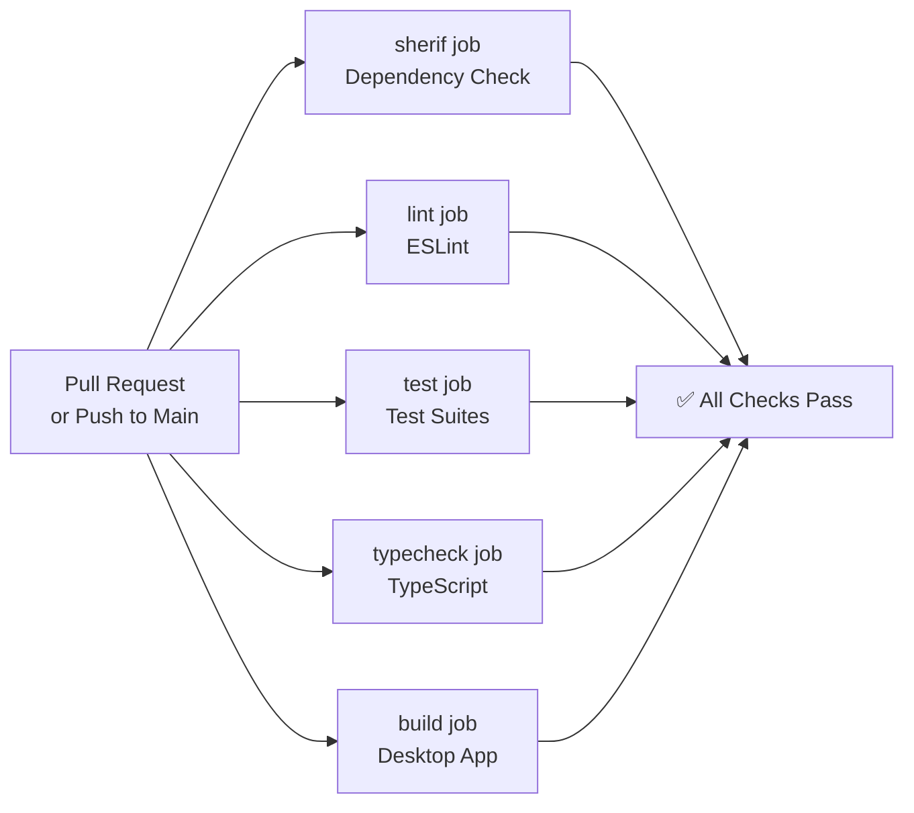

**CI Workflow Triggers**

Sources: [.github/workflows/ci.yml:1-133]()

---

## Preview Environment Deployment

### Preview Deployment Architecture

When a pull request is opened, synchronized, or reopened, the [`deploy-preview.yml`](.github/workflows/deploy-preview.yml:1-766) workflow creates a complete isolated environment:

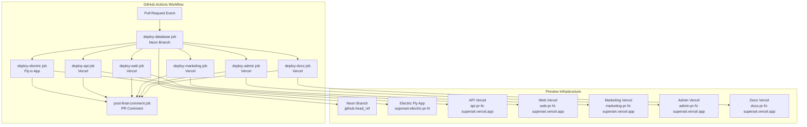

**Preview URL Pattern**

Each preview deployment uses a consistent naming scheme with the PR number:

- **API**: `https://api-pr-{PR_NUMBER}-superset.vercel.app`
- **Web**: `https://web-pr-{PR_NUMBER}-superset.vercel.app`
- **Marketing**: `https://marketing-pr-{PR_NUMBER}-superset.vercel.app`
- **Admin**: `https://admin-pr-{PR_NUMBER}-superset.vercel.app`
- **Docs**: `https://docs-pr-{PR_NUMBER}-superset.vercel.app`
- **Electric**: `https://superset-electric-pr-{PR_NUMBER}.fly.dev/v1/shape`

Sources: [.github/workflows/deploy-preview.yml:13-21]()

---

### Preview Deployment Jobs

#### 1. Database Deployment (Neon Branch)

The `deploy-database` job creates an isolated PostgreSQL database using Neon's branching feature:

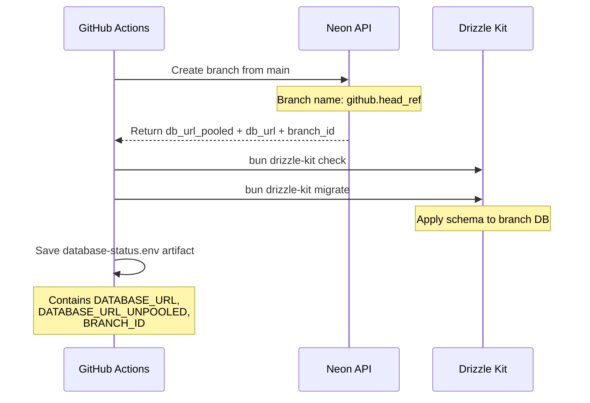

The job uses the [`neondatabase/create-branch-action@v6`](.github/workflows/deploy-preview.yml:49) action to create a branch named after `github.head_ref`. The action returns both pooled and unpooled connection strings, which subsequent jobs download via artifacts.

**Schema Validation and Migration**

After branch creation, the workflow runs:

- `bun drizzle-kit check` - Validates schema consistency
- `bun drizzle-kit migrate` - Applies pending migrations

Sources: [.github/workflows/deploy-preview.yml:24-78]()

#### 2. Electric Deployment (Fly.io)

The `deploy-electric` job deploys a dedicated ElectricSQL sync server instance:

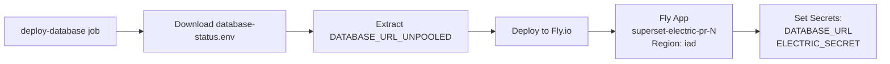

The deployment uses [`superfly/fly-pr-review-apps@1.3.0`](.github/workflows/deploy-preview.yml:100) action with configuration from [`fly.toml`](fly.toml:1-33):

| Configuration    | Value                              |
| ---------------- | ---------------------------------- |
| **App Name**     | `superset-electric-pr-{PR_NUMBER}` |
| **Region**       | `iad` (US East)                    |
| **Image**        | `electricsql/electric:1.4.13`      |
| **Memory**       | 8192 MB                            |
| **CPUs**         | 4 (performance)                    |
| **Health Check** | `GET /v1/health` every 10s         |

Sources: [.github/workflows/deploy-preview.yml:80-123](), [fly.toml:1-33]()

#### 3. Vercel Deployments

Five separate jobs deploy Next.js applications to Vercel in parallel:

**API Deployment** ([deploy-api](.github/workflows/deploy-preview.yml:125-285))

The API deployment is the most complex, requiring 40+ environment variables including:

- Database URLs (pooled and unpooled)
- OAuth credentials (Google, GitHub, Linear, Slack)
- Third-party API keys (Stripe, Anthropic, Resend, QStash)
- ElectricSQL connection details

```bash
vercel pull --yes --environment=preview --token=$VERCEL_TOKEN
vercel build --token=$VERCEL_TOKEN
vercel deploy --prebuilt --archive=tgz --token=$VERCEL_TOKEN [--env flags...]
vercel alias $VERCEL_URL $API_ALIAS --scope=$VERCEL_ORG_ID --token=$VERCEL_TOKEN
```

**Web, Marketing, Admin, Docs Deployments**

These follow the same pattern as API but with application-specific environment variables. Each deployment:

1. Downloads database artifact (if needed)
2. Installs Vercel CLI version `50.22.1`
3. Pulls project configuration
4. Builds the application
5. Deploys to Vercel
6. Aliases to the PR-specific URL

Sources: [.github/workflows/deploy-preview.yml:125-692]()

#### 4. Deployment Status Comment

The `post-final-comment` job aggregates status from all deployment jobs and posts a comment to the PR:

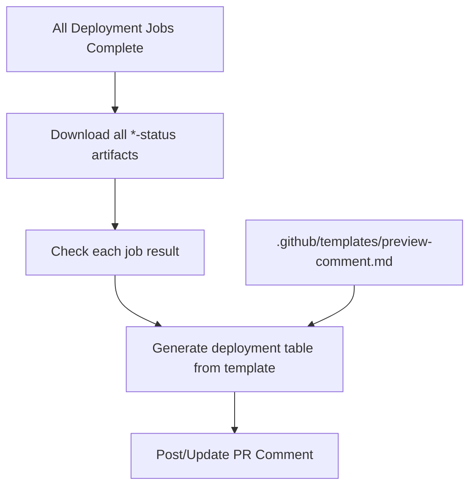

The comment displays a table with status indicators (✅/❌) and links for each service. The comment uses the tag `"🚀-preview-deployment"` to enable updating the same comment on subsequent pushes.

Sources: [.github/workflows/deploy-preview.yml:694-766](), [.github/templates/preview-comment.md:1-52]()

---

### Concurrency Control

Preview deployments use concurrency groups to prevent race conditions:

```yaml
concurrency:
  group: preview-${{ github.event.pull_request.number }}
  cancel-in-progress: true
```

This ensures only one preview deployment runs per PR at a time, canceling any in-progress deployments when new commits are pushed.

Sources: [.github/workflows/deploy-preview.yml:9-11]()

---

## Production Deployment

### Production Deployment Flow

The [`deploy-production.yml`](.github/workflows/deploy-production.yml:1-551) workflow triggers on:

- Pushes to the `main` branch
- Manual workflow dispatch

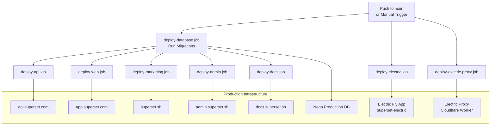

**Key Differences from Preview Deployments**

| Aspect   | Preview                        | Production                               |
| -------- | ------------------------------ | ---------------------------------------- |
| Database | New Neon branch                | Production database (migrations only)    |
| Electric | New Fly app per PR             | Persistent `superset-electric` app       |
| Vercel   | Preview deployment             | Production deployment with `--prod` flag |
| Aliases  | `*-pr-{N}-superset.vercel.app` | Production domains                       |
| Cleanup  | Automatic on PR close          | Never cleaned up                         |

Sources: [.github/workflows/deploy-production.yml:1-551]()

---

### Production Deployment Jobs

#### 1. Database Migrations

The production database job **only runs migrations**, it does not create a new database:

```bash
bun drizzle-kit migrate
```

This applies any pending schema changes to the production Neon PostgreSQL database using the `DATABASE_URL_UNPOOLED` connection string.

Sources: [.github/workflows/deploy-production.yml:12-40]()

#### 2. Vercel Production Deployments

Each Vercel deployment uses the `--prod` flag to deploy to production:

```bash
vercel pull --yes --environment=production --token=$VERCEL_TOKEN
vercel build --prod --token=$VERCEL_TOKEN
vercel deploy --prod --prebuilt --archive=tgz --token=$VERCEL_TOKEN [--env flags...]
```

The `--prod` flag ensures the deployment:

- Uses production environment variables
- Deploys to the production domain (e.g., `api.superset.com`)
- Does not create preview URLs

Sources: [.github/workflows/deploy-production.yml:42-440]()

#### 3. Electric Fly.io Production Deployment

The Electric production deployment uses staged secrets and remote-only builds:

```bash
flyctl secrets set \
  DATABASE_URL="${DATABASE_URL_UNPOOLED}" \
  ELECTRIC_SECRET="${ELECTRIC_SECRET}" \
  --app superset-electric \
  --stage

flyctl deploy . --config fly.toml --remote-only
```

The `--stage` flag prepares secrets for the next deployment without triggering a restart. The `--remote-only` flag ensures the Docker build occurs on Fly.io's infrastructure rather than locally.

Sources: [.github/workflows/deploy-production.yml:442-467]()

#### 4. Electric Proxy Cloudflare Deployment

A Cloudflare Worker acts as a proxy for ElectricSQL shape requests, providing additional authentication and row-level security. The deployment uses Wrangler:

```bash
bunx wrangler deploy
```

This worker is defined in [`apps/electric-proxy`](apps/electric-proxy) and intercepts requests before they reach the Electric server on Fly.io.

Sources: [.github/workflows/deploy-production.yml:469-497]()

---

## Preview Resource Cleanup

### Cleanup Workflow

When a pull request is closed, the [`cleanup-preview.yml`](.github/workflows/cleanup-preview.yml:1-48) workflow automatically deletes preview resources:

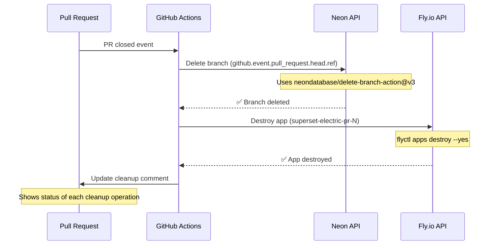

**Cleanup Operations**

| Resource           | Action                                 | Failure Handling          |
| ------------------ | -------------------------------------- | ------------------------- |
| Neon Branch        | `neondatabase/delete-branch-action@v3` | `continue-on-error: true` |
| Electric Fly App   | `flyctl apps destroy --yes`            | `continue-on-error: true` |
| Vercel Deployments | (Automatic by Vercel)                  | N/A                       |

Vercel automatically removes preview deployments when branches are deleted, so no explicit cleanup is needed. The workflow uses `continue-on-error: true` to ensure one failed cleanup doesn't block the others.

Sources: [.github/workflows/cleanup-preview.yml:1-48]()

---

## Environment Variables and Secrets

### Secret Management Strategy

Secrets are stored in GitHub Secrets and injected into workflows via `${{ secrets.SECRET_NAME }}` syntax. Secrets are categorized by scope:

**Authentication Secrets**

- `BETTER_AUTH_SECRET` - Better Auth session encryption key
- `GOOGLE_CLIENT_ID`, `GOOGLE_CLIENT_SECRET` - Google OAuth
- `GH_CLIENT_ID`, `GH_CLIENT_SECRET` - GitHub OAuth
- `GH_APP_ID`, `GH_APP_PRIVATE_KEY`, `GH_WEBHOOK_SECRET` - GitHub App
- `LINEAR_CLIENT_ID`, `LINEAR_CLIENT_SECRET`, `LINEAR_WEBHOOK_SECRET` - Linear integration
- `SLACK_CLIENT_ID`, `SLACK_CLIENT_SECRET`, `SLACK_SIGNING_SECRET` - Slack integration

**Infrastructure Secrets**

- `DATABASE_URL`, `DATABASE_URL_UNPOOLED` - Neon connection strings (production only)
- `ELECTRIC_URL`, `ELECTRIC_SECRET` - ElectricSQL configuration
- `ELECTRIC_SECRET_PREVIEW` - Electric secret for preview environments
- `VERCEL_TOKEN`, `VERCEL_ORG_ID` - Vercel API authentication
- `FLY_API_TOKEN` - Fly.io API authentication
- `CLOUDFLARE_API_TOKEN`, `CLOUDFLARE_ACCOUNT_ID` - Cloudflare Workers

**Third-Party API Keys**

- `ANTHROPIC_API_KEY` - AI model access
- `STRIPE_SECRET_KEY`, `STRIPE_WEBHOOK_SECRET` - Payment processing
- `RESEND_API_KEY` - Email delivery
- `QSTASH_TOKEN`, `QSTASH_CURRENT_SIGNING_KEY`, `QSTASH_NEXT_SIGNING_KEY` - Queue system
- `KV_REST_API_URL`, `KV_REST_API_TOKEN`, `KV_URL` - Redis/KV storage
- `TAVILY_API_KEY` - Search API

**Observability Secrets**

- `NEXT_PUBLIC_POSTHOG_KEY`, `NEXT_PUBLIC_POSTHOG_HOST` - Analytics
- `POSTHOG_API_KEY`, `POSTHOG_PROJECT_ID` - Analytics server-side
- `NEXT_PUBLIC_SENTRY_DSN_*` - Error tracking (per-app DSNs)
- `SENTRY_AUTH_TOKEN` - Sentry API access

Sources: [.github/workflows/deploy-preview.yml:165-217](), [apps/api/src/env.ts:1-76]()

---

## Infrastructure Component Mapping

### Deployment Target Reference

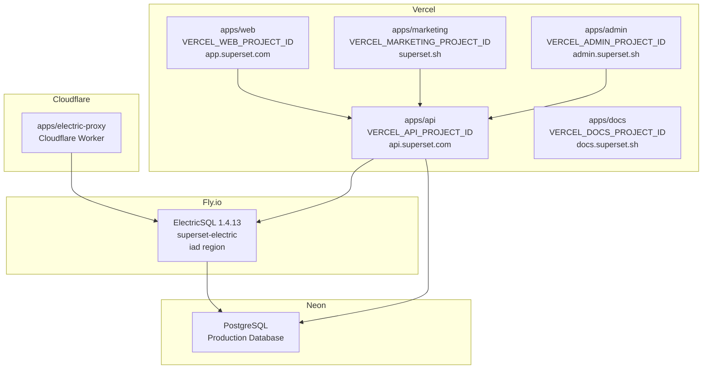

**Component Repository Locations**

| Component      | Repository Path                        | Deployment Target  |
| -------------- | -------------------------------------- | ------------------ |
| API            | `apps/api`                             | Vercel             |
| Web            | `apps/web`                             | Vercel             |
| Marketing      | `apps/marketing`                       | Vercel             |
| Admin          | `apps/admin`                           | Vercel             |
| Docs           | `apps/docs`                            | Vercel             |
| Electric Proxy | `apps/electric-proxy`                  | Cloudflare Workers |
| ElectricSQL    | N/A (uses official Docker image)       | Fly.io             |
| Database       | `packages/db` (schema/migrations only) | Neon PostgreSQL    |

Sources: [.github/workflows/deploy-production.yml:42-550](), [fly.toml:1-33]()

---

## Electric Configuration

### Fly.io Application Settings

The [`fly.toml`](fly.toml:1-33) configuration defines the ElectricSQL deployment parameters:

```toml
app = "superset-electric"
primary_region = "iad"

[build]
image = "electricsql/electric:1.4.13"

[[vm]]
memory = "8192mb"
cpu_kind = "performance"
cpus = 4

[env]
ELECTRIC_DATABASE_USE_IPV6 = "true"
ELECTRIC_MAX_CONCURRENT_REQUESTS = '{"initial": 3000, "existing": 10000}'
```

**Key Configuration Details**

- **Image**: Uses official Electric Docker image version `1.4.13`
- **Memory**: 8 GB allocation for handling concurrent shape subscriptions
- **CPU**: 4 performance CPUs for processing change data capture streams
- **Region**: `iad` (US East) for proximity to Neon database
- **Health Check**: HTTP GET to `/v1/health` every 10 seconds
- **Mount**: Persistent volume `electric_data` at `/var/lib/electric` for local state

The high concurrent request limit (`10000` for existing connections) supports the Desktop app's collection subscriptions across multiple organizations.

Sources: [fly.toml:1-33]()

---

## CORS and API Proxy Configuration

### CORS Headers for Desktop/Web Integration

The API application includes a middleware proxy that configures CORS headers for cross-origin requests from the Desktop app and Web applications:

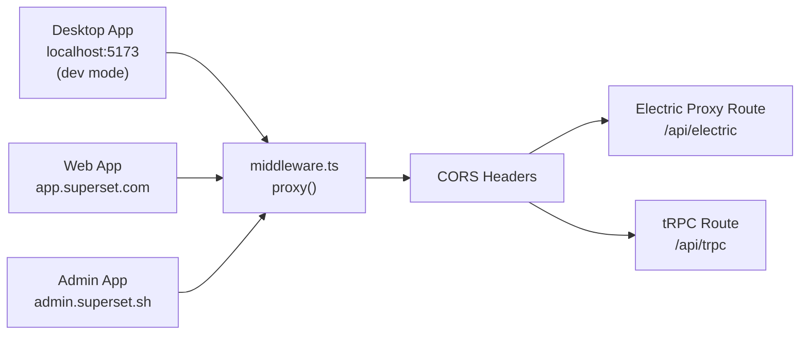

**Allowed Origins**

The proxy determines allowed origins from environment variables:

- `NEXT_PUBLIC_WEB_URL`
- `NEXT_PUBLIC_ADMIN_URL`
- `NEXT_PUBLIC_DESKTOP_URL`
- Development: `http://localhost:5173`, `http://127.0.0.1:5173`

**Exposed Headers for Electric Sync**

The middleware exposes Electric-specific headers required for shape streaming:

- `electric-offset`, `electric-handle`, `electric-schema`
- `electric-cursor`, `electric-chunk-last-offset`
- `electric-up-to-date`

Sources: [apps/api/src/proxy.ts:1-74]()

---

## Electric Shape Proxy and Row-Level Security

### Authentication and Authorization Flow

The `/api/electric/[...path]` route acts as an authenticated proxy to ElectricSQL, enforcing organization-based row-level security:

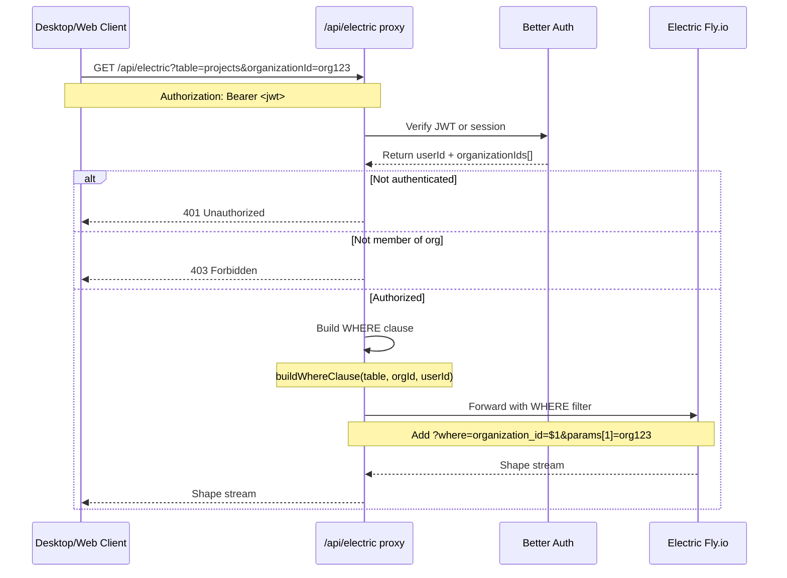

**WHERE Clause Generation**

The [`buildWhereClause`](apps/api/src/app/api/electric/[...path]/utils.ts:69-195) function generates SQL fragments for each table type:

```typescript
// Example for projects table
build(projects, projects.organizationId, organizationId)
// Returns: { fragment: "organization_id = $1", params: [organizationId] }

// Example for auth.users table
{ fragment: `$1 = ANY("organization_ids")`, params: [organizationId] }
```

**Supported Tables**

The proxy supports 20+ table types with organization-based filtering:

- Application tables: `tasks`, `projects`, `workspaces`, `v2_*`
- Auth tables: `auth.members`, `auth.organizations`, `auth.users`, `auth.invitations`
- Integration tables: `integration_connections`, `github_repositories`
- System tables: `device_presence`, `agent_commands`, `subscriptions`

Sources: [apps/api/src/app/api/electric/[...path]/route.ts:1-104](), [apps/api/src/app/api/electric/[...path]/utils.ts:1-195]()

---

## Desktop Collection Configuration

### Electric Client Setup

The Desktop app configures Electric collections to connect through the API proxy:

```typescript
const electricUrl = `${env.NEXT_PUBLIC_ELECTRIC_URL}/v1/shape`

const electricHeaders = {
  Authorization: () => {
    const token = getJwt()
    return token ? `Bearer ${token}` : ''
  },
}
```

Collections use `electricCollectionOptions` with shape subscriptions:

```typescript
createCollection(
  electricCollectionOptions<SelectProject>({
    id: `projects-${organizationId}`,
    shapeOptions: {
      url: electricUrl,
      params: {
        table: 'projects',
        organizationId,
      },
      headers: electricHeaders,
      columnMapper: snakeCamelMapper(),
    },
    getKey: (item) => item.id,
  })
)
```

The `NEXT_PUBLIC_ELECTRIC_URL` environment variable points to the API proxy endpoint (`/api/electric`), not directly to Electric on Fly.io. This ensures all shape requests are authenticated and filtered by organization.

Sources: [apps/desktop/src/renderer/routes/\_authenticated/providers/CollectionsProvider/collections.ts:50-239]()

---

## Deployment Artifact Flow

### Inter-Job Dependency Management

Preview deployments use GitHub Actions artifacts to share data between jobs:

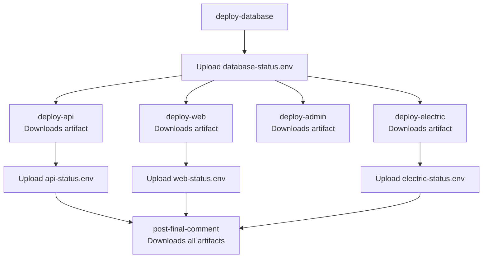

**Artifact Contents**

Each status artifact contains environment variables for comment generation:

```bash
# database-status.env
DATABASE_STATUS="✅"
DATABASE_LINK="<a href=\"...\">View Branch</a>"
DATABASE_URL="postgres://..."
DATABASE_URL_UNPOOLED="postgres://..."
BRANCH_ID="br_123"

# api-status.env
API_STATUS="✅"
API_LINK="<a href=\"https://api-pr-123-superset.vercel.app\">Open Preview</a>"
API_URL="https://api-pr-123-superset.vercel.app"
```

The final comment job merges all artifacts and uses `envsubst` to populate the template.

Sources: [.github/workflows/deploy-preview.yml:64-78](), [.github/workflows/deploy-preview.yml:707-759]()
