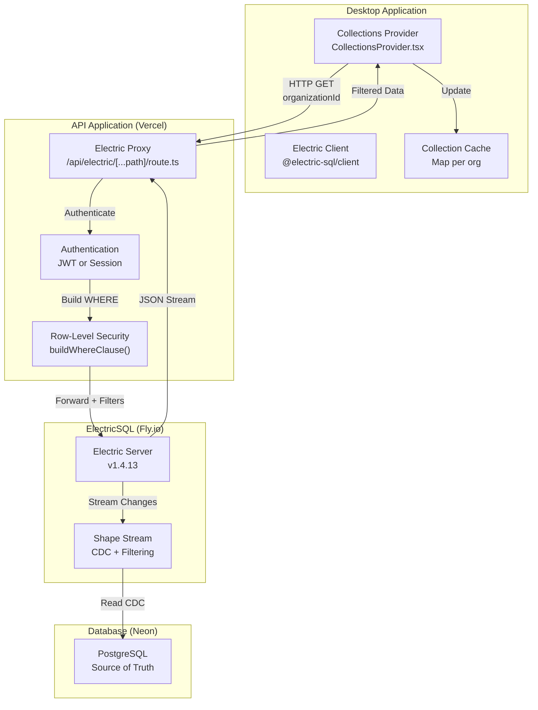
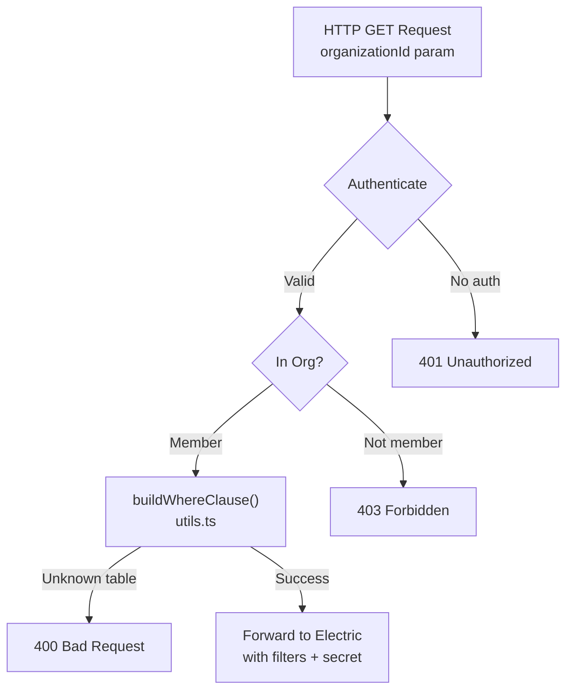
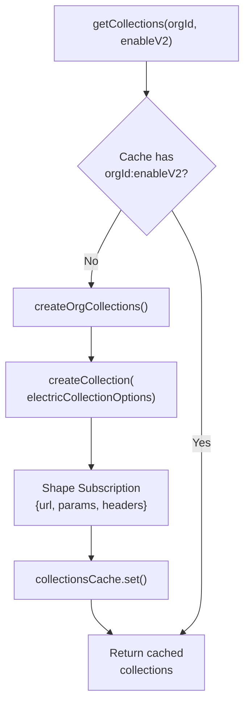
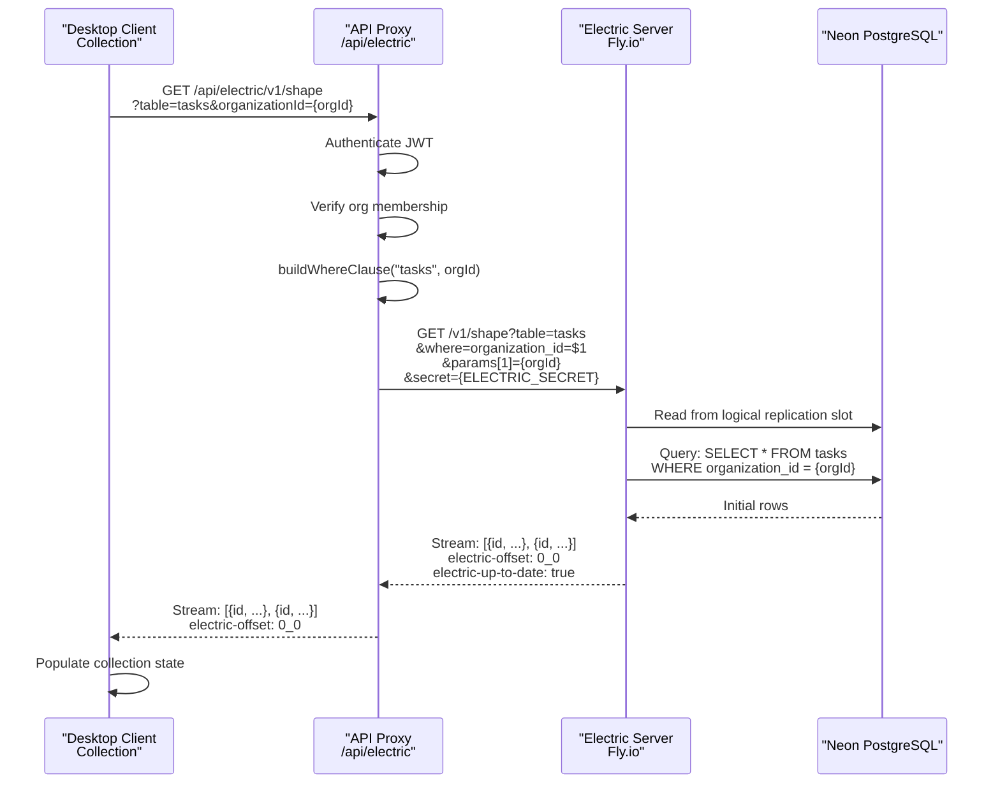
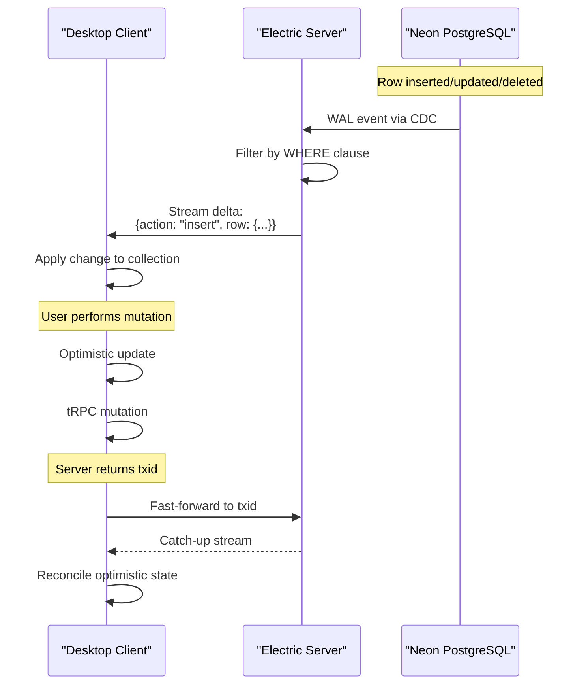
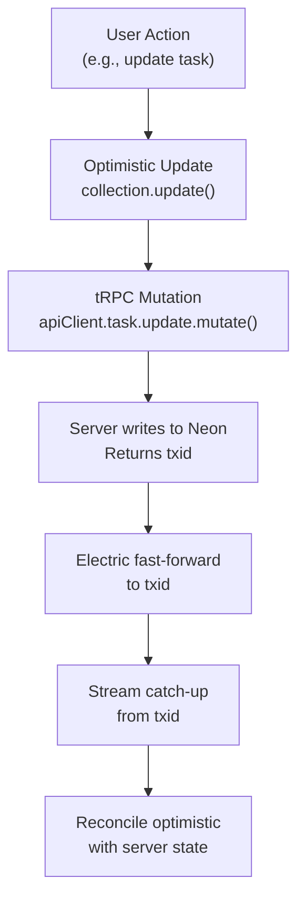

# ElectricSQL Synchronization

<details>
<summary>Relevant source files</summary>

The following files were used as context for generating this wiki page:

- [.github/templates/cleanup-comment.md](.github/templates/cleanup-comment.md)
- [.github/templates/preview-comment.md](.github/templates/preview-comment.md)
- [.github/workflows/ci.yml](.github/workflows/ci.yml)
- [.github/workflows/cleanup-preview.yml](.github/workflows/cleanup-preview.yml)
- [.github/workflows/deploy-preview.yml](.github/workflows/deploy-preview.yml)
- [.github/workflows/deploy-production.yml](.github/workflows/deploy-production.yml)
- [apps/admin/src/trpc/react.tsx](apps/admin/src/trpc/react.tsx)
- [apps/api/package.json](apps/api/package.json)
- [apps/api/src/app/api/electric/[...path]/route.ts](apps/api/src/app/api/electric/[...path]/route.ts)
- [apps/api/src/app/api/electric/[...path]/utils.ts](apps/api/src/app/api/electric/[...path]/utils.ts)
- [apps/api/src/env.ts](apps/api/src/env.ts)
- [apps/api/src/proxy.ts](apps/api/src/proxy.ts)
- [apps/api/src/trpc/context.ts](apps/api/src/trpc/context.ts)
- [apps/desktop/src/renderer/routes/_authenticated/providers/CollectionsProvider/CollectionsProvider.tsx](apps/desktop/src/renderer/routes/_authenticated/providers/CollectionsProvider/CollectionsProvider.tsx)
- [apps/desktop/src/renderer/routes/_authenticated/providers/CollectionsProvider/collections.ts](apps/desktop/src/renderer/routes/_authenticated/providers/CollectionsProvider/collections.ts)
- [apps/web/src/trpc/react.tsx](apps/web/src/trpc/react.tsx)
- [fly.toml](fly.toml)

</details>


This page documents the ElectricSQL-based real-time data synchronization system that enables the Superset Desktop application to maintain a local copy of cloud data with millisecond-level updates. This system provides the foundation for multi-user collaboration, organization data sharing, and offline-capable features.

For information about the local-only database used by the desktop app, see [Local Database Access](#2.10.2). For the broader data synchronization architecture, see [Data Synchronization](#2.10).

---

## Overview

The ElectricSQL synchronization layer consists of three primary components:

1. **ElectricSQL Server** - Deployed on Fly.io, streams changes from Neon PostgreSQL
2. **API Proxy Layer** - Next.js endpoints that enforce authentication and row-level security
3. **Desktop Client Collections** - React-based shape subscriptions that maintain local state

The system uses ElectricSQL's shape-based synchronization protocol, where each table subscription is a "shape" with optional filters. The desktop app never connects directly to the ElectricSQL server; all requests are proxied through the API layer to enforce security policies.

---

## Architecture Components

### System Overview



**Sources:** [apps/desktop/src/renderer/routes/_authenticated/providers/CollectionsProvider/collections.ts:1-675](), [apps/api/src/app/api/electric/[...path]/route.ts:1-105](), [fly.toml:1-33]()

### ElectricSQL Server Deployment

The ElectricSQL server runs as a containerized application on Fly.io, using the official Electric Docker image.

| Configuration | Value |
|---------------|-------|
| **Image** | `electricsql/electric:1.4.13` |
| **Region** | `iad` (US East) |
| **Memory** | 8192 MB |
| **CPU** | 4 performance cores |
| **Port** | 3000 (internal) |
| **Health Check** | `/v1/health` every 10s |
| **Persistent Storage** | `/var/lib/electric` (mounted volume) |

The server is configured with environment variables:

- `DATABASE_URL` - Neon PostgreSQL connection (unpooled)
- `ELECTRIC_SECRET` - Shared secret for API authentication
- `ELECTRIC_DATABASE_USE_IPV6` - Enable IPv6 for Neon
- `ELECTRIC_MAX_CONCURRENT_REQUESTS` - Request limits (3000 initial, 10000 existing)

**Sources:** [fly.toml:1-33](), [.github/workflows/deploy-production.yml:442-468]()

### API Proxy Layer

The API application exposes an Electric proxy endpoint at `/api/electric/[...path]` that performs three critical functions:

1. **Authentication** - Validates JWT bearer tokens or session cookies
2. **Authorization** - Verifies user belongs to requested organization
3. **Row-Level Security** - Injects WHERE clauses to filter data by organization



**Sources:** [apps/api/src/app/api/electric/[...path]/route.ts:34-104]()

The proxy endpoint performs the following steps:

1. Extracts bearer token or session from request headers
2. Verifies user identity via `auth.api.verifyJWT()` or `auth.api.getSession()`
3. Checks `organizationId` parameter against user's `organizationIds` array
4. Calls `buildWhereClause()` to generate table-specific filter
5. Appends filter as `where` and `params[n]` query parameters
6. Adds `secret` query parameter for Electric authentication
7. Forwards request to Electric server and streams response

**Sources:** [apps/api/src/app/api/electric/[...path]/route.ts:34-104]()

---

## Row-Level Security Implementation

The `buildWhereClause` function in [apps/api/src/app/api/electric/[...path]/utils.ts:69-195]() generates SQL WHERE fragments for each supported table. The function uses Drizzle ORM's QueryBuilder to construct parameterized queries, then extracts the WHERE clause fragment.

### Supported Tables

| Table | Filter Logic | Row Owner |
|-------|--------------|-----------|
| `tasks` | `organization_id = ?` | Organization |
| `task_statuses` | `organization_id = ?` | Organization |
| `projects` | `organization_id = ?` | Organization |
| `v2_projects` | `organization_id = ?` | Organization |
| `v2_devices` | `organization_id = ?` | Organization |
| `v2_device_presence` | `organization_id = ?` | Organization |
| `v2_users_devices` | `organization_id = ?` | Organization |
| `v2_workspaces` | `organization_id = ?` | Organization |
| `workspaces` | `organization_id = ?` | Organization |
| `auth.members` | `organization_id = ?` | Organization |
| `auth.invitations` | `organization_id = ?` | Organization |
| `auth.organizations` | `id IN (user_orgs)` | User membership |
| `auth.users` | `? = ANY(organization_ids)` | Organization membership |
| `auth.apikeys` | `metadata LIKE '%organizationId":"..."'` | Metadata filter |
| `device_presence` | `organization_id = ?` | Organization |
| `agent_commands` | `organization_id = ?` | Organization |
| `integration_connections` | `organization_id = ?` | Organization |
| `subscriptions` | `reference_id = ?` | Organization (reference) |
| `chat_sessions` | `organization_id = ?` | Organization |
| `session_hosts` | `organization_id = ?` | Organization |
| `github_repositories` | `organization_id = ?` | Organization |
| `github_pull_requests` | `organization_id = ?` | Organization |

**Sources:** [apps/api/src/app/api/electric/[...path]/utils.ts:69-195]()

### Special Cases

**Organizations Table**: Uses a subquery to find all organizations where the user is a member:

```typescript
// Pseudocode from utils.ts:113-137
const userMemberships = await db.query.members.findMany({
  where: eq(members.userId, userId),
  columns: { organizationId: true }
});
const orgIds = [...new Set(userMemberships.map(m => m.organizationId))];
return { fragment: "id IN ($1, $2, ...)", params: orgIds };
```

**Users Table**: Filters users who have the organization in their `organization_ids` JSONB array:

```typescript
// From utils.ts:139-142
return { fragment: "$1 = ANY(organization_ids)", params: [organizationId] };
```

**API Keys Table**: Uses a LIKE pattern to match organization ID in JSON metadata:

```typescript
// From utils.ts:154-157
return { 
  fragment: "metadata LIKE '%\"organizationId\":\"' || $1 || '\"%'",
  params: [organizationId]
};
```

**Sources:** [apps/api/src/app/api/electric/[...path]/utils.ts:113-157]()

### Column Filtering

For security-sensitive tables, the proxy restricts which columns are synced:

- **auth.apikeys**: Only syncs `id`, `name`, `start`, `created_at`, `last_request` (excludes full key hash)
- **integration_connections**: Excludes `access_token` and `refresh_token` fields

**Sources:** [apps/api/src/app/api/electric/[...path]/route.ts:77-89]()

---

## Desktop Client Collections

The desktop application uses the `@tanstack/react-db` and `@tanstack/electric-db-collection` packages to manage ElectricSQL shape subscriptions as React state.

### Collection Creation Flow



**Sources:** [apps/desktop/src/renderer/routes/_authenticated/providers/CollectionsProvider/collections.ts:652-672]()

### Collection Cache Structure

Collections are cached per organization using a compound key: `${organizationId}:${enableV2Cloud ? "v2" : "legacy"}`. This allows instant switching between organizations without re-subscribing to shapes.

```typescript
// From collections.ts:115-122
const collectionsCache = new Map<string, OrgCollections>();

function getCollectionsCacheKey(
  organizationId: string,
  enableV2Cloud: boolean
): string {
  return `${organizationId}:${enableV2Cloud ? "v2" : "legacy"}`;
}
```

**Sources:** [apps/desktop/src/renderer/routes/_authenticated/providers/CollectionsProvider/collections.ts:114-122]()

### Electric Collection Options

Each collection is configured with:

```typescript
// Pseudocode from collections.ts:175-207
createCollection(
  electricCollectionOptions<SelectTask>({
    id: `tasks-${organizationId}`,
    shapeOptions: {
      url: electricUrl, // NEXT_PUBLIC_ELECTRIC_URL/v1/shape
      params: {
        table: "tasks",
        organizationId: organizationId
      },
      headers: {
        Authorization: () => `Bearer ${getJwt()}`
      },
      columnMapper: snakeCamelMapper() // snake_case -> camelCase
    },
    getKey: (item) => item.id,
    onInsert: async ({ transaction }) => { /* mutation handler */ },
    onUpdate: async ({ transaction }) => { /* mutation handler */ },
    onDelete: async ({ transaction }) => { /* mutation handler */ }
  })
)
```

**Sources:** [apps/desktop/src/renderer/routes/_authenticated/providers/CollectionsProvider/collections.ts:175-207]()

### Dynamic Headers

The `Authorization` header is provided as a function that reads the current JWT dynamically. This ensures expired tokens are not cached:

```typescript
// From collections.ts:151-156
const electricHeaders = {
  Authorization: () => {
    const token = getJwt();
    return token ? `Bearer ${token}` : "";
  }
};
```

**Sources:** [apps/desktop/src/renderer/routes/_authenticated/providers/CollectionsProvider/collections.ts:151-156]()

---

## Shape Subscription Protocol

### Initial Subscription Flow



**Sources:** [apps/api/src/app/api/electric/[...path]/route.ts:34-104](), [apps/desktop/src/renderer/routes/_authenticated/providers/CollectionsProvider/collections.ts:175-207]()

### Incremental Updates

After the initial load, the client maintains a persistent connection (or polls with offset) to receive incremental updates:



**Sources:** [apps/desktop/src/renderer/routes/_authenticated/providers/CollectionsProvider/collections.ts:188-205]()

---

## Mutation Handling and Optimistic Updates

ElectricSQL collections support optimistic mutations with server-side reconciliation. The desktop app performs mutations via tRPC, receives a transaction ID (`txid`), then fast-forwards the Electric stream to that point.

### Mutation Flow with Transaction ID



**Sources:** [apps/desktop/src/renderer/routes/_authenticated/providers/CollectionsProvider/collections.ts:188-205]()

### Example: Task Update

The `tasks` collection defines an `onUpdate` handler that calls the tRPC mutation and returns the `txid`:

```typescript
// From collections.ts:193-200
onUpdate: async ({ transaction }) => {
  const { original, changes } = transaction.mutations[0];
  const result = await apiClient.task.update.mutate({
    ...changes,
    id: original.id
  });
  return { txid: result.txid }; // Electric fast-forwards to this txid
}
```

**Sources:** [apps/desktop/src/renderer/routes/_authenticated/providers/CollectionsProvider/collections.ts:193-200]()

### tRPC Client Configuration

The collections module creates a singleton tRPC client with dynamic authentication:

```typescript
// From collections.ts:138-149
const apiClient = createTRPCProxyClient<AppRouter>({
  links: [
    httpBatchLink({
      url: `${env.NEXT_PUBLIC_API_URL}/api/trpc`,
      headers: () => {
        const token = getAuthToken();
        return token ? { Authorization: `Bearer ${token}` } : {};
      },
      transformer: superjson
    })
  ]
});
```

**Sources:** [apps/desktop/src/renderer/routes/_authenticated/providers/CollectionsProvider/collections.ts:138-149]()

---

## Collection Preloading and Organization Switching

### Preload Strategy

Collections are lazily initialized—they don't subscribe to shapes until accessed. The `preloadCollections` function explicitly starts subscriptions to ensure data is ready when the user needs it:

```typescript
// From collections.ts:622-645
export async function preloadCollections(
  organizationId: string,
  options?: {
    includeChatCollections?: boolean;
    enableV2Cloud?: boolean;
  }
): Promise<void> {
  const { chatSessions, sessionHosts, ...collections } = 
    getCollections(organizationId, enableV2Cloud);
  
  const orgCollections = Object.entries(collections)
    .filter(([name]) => name !== "organizations")
    .map(([, collection]) => collection as Collection<object>);
  
  const collectionsToPreload = includeChatCollections
    ? [...orgCollections, chatSessions, sessionHosts]
    : orgCollections;
  
  await Promise.allSettled(
    collectionsToPreload.map(c => c.preload())
  );
}
```

**Sources:** [apps/desktop/src/renderer/routes/_authenticated/providers/CollectionsProvider/collections.ts:622-645]()

### CollectionsProvider Integration

The `CollectionsProvider` component manages the active organization's collections and provides a `switchOrganization` function:

```typescript
// From CollectionsProvider.tsx:47-62
const switchOrganization = useCallback(
  async (organizationId: string) => {
    if (organizationId === activeOrganizationId) return;
    setIsSwitching(true);
    try {
      await authClient.organization.setActive({ organizationId });
      await preloadCollections(organizationId, {
        enableV2Cloud: isV2CloudEnabled
      });
      await refetchSession();
    } finally {
      setIsSwitching(false);
    }
  },
  [activeOrganizationId, isV2CloudEnabled, refetchSession]
);
```

**Sources:** [apps/desktop/src/renderer/routes/_authenticated/providers/CollectionsProvider/CollectionsProvider.tsx:47-62]()

### Effect-Based Preloading

The provider also preloads collections when the active organization changes:

```typescript
// From CollectionsProvider.tsx:64-69
useEffect(() => {
  preloadActiveOrganizationCollections(
    activeOrganizationId,
    isV2CloudEnabled
  );
}, [activeOrganizationId, isV2CloudEnabled]);
```

**Sources:** [apps/desktop/src/renderer/routes/_authenticated/providers/CollectionsProvider/CollectionsProvider.tsx:64-69]()

---

## V2 Cloud Feature Flag Handling

Some collections are conditionally created based on the `V2_CLOUD` feature flag. When disabled, these collections are replaced with empty local-only collections:

```typescript
// From collections.ts:241-260
const v2Projects = enableV2Cloud
  ? createCollection(
      electricCollectionOptions<SelectV2Project>({
        id: `v2_projects-${organizationId}`,
        shapeOptions: { /* ... */ },
        getKey: (item) => item.id
      })
    )
  : createDisabledCollection<SelectV2Project, string>(
      `v2_projects-disabled-${organizationId}`,
      (item) => item.id
    );
```

The `createDisabledCollection` helper creates a local-only collection with no data:

```typescript
// From collections.ts:124-135
function createDisabledCollection<
  T extends object,
  TKey extends string | number
>(id: string, getKey: (item: T) => TKey): Collection<T> {
  return createCollection(
    localOnlyCollectionOptions({
      id,
      getKey,
      initialData: []
    })
  ) as unknown as Collection<T>;
}
```

**Sources:** [apps/desktop/src/renderer/routes/_authenticated/providers/CollectionsProvider/collections.ts:124-135](), [apps/desktop/src/renderer/routes/_authenticated/providers/CollectionsProvider/collections.ts:241-260]()

---

## Deployment Infrastructure

### Production Deployment

The production Electric server is deployed to Fly.io as part of the main deployment workflow:

**Workflow Steps:**
1. Stage secrets (`DATABASE_URL`, `ELECTRIC_SECRET`) using `flyctl secrets set --stage`
2. Deploy using `flyctl deploy --remote-only` with [fly.toml:1-33]() configuration
3. Server auto-starts and connects to Neon production database

**Sources:** [.github/workflows/deploy-production.yml:442-468]()

### Preview Environments

Each pull request gets an isolated Electric instance for testing:

**Deployment Process:**
1. Create Neon branch database for PR
2. Deploy Electric app: `superset-electric-pr-{number}`
3. Configure with PR-specific database URL
4. Set environment variable: `ELECTRIC_URL=https://superset-electric-pr-{number}.fly.dev/v1/shape`
5. Deploy API with PR-specific Electric URL

**Cleanup Process:**
- When PR closes, Neon branch is deleted
- Electric Fly.io app is destroyed: `flyctl apps destroy superset-electric-pr-{number}`

**Sources:** [.github/workflows/deploy-preview.yml:80-123](), [.github/workflows/cleanup-preview.yml:25-35]()

### Environment Configuration

| Environment | API Application | Desktop Application |
|-------------|----------------|---------------------|
| **ELECTRIC_URL** | Server-side: `env.ELECTRIC_URL` | Client-side: `env.NEXT_PUBLIC_ELECTRIC_URL` |
| **ELECTRIC_SECRET** | Server-side: `env.ELECTRIC_SECRET` | N/A (not exposed to client) |
| **Purpose** | Proxy forwarding and auth | Shape subscription endpoint |

The API application environment requires both the Electric URL and secret:

```typescript
// From apps/api/src/env.ts:13-14
ELECTRIC_URL: z.string().url(),
ELECTRIC_SECRET: z.string().min(16),
```

**Sources:** [apps/api/src/env.ts:13-14](), [apps/desktop/src/renderer/routes/_authenticated/providers/CollectionsProvider/collections.ts:52]()

---

## CORS Configuration

The API proxy allows Electric-specific headers for cross-origin requests from the desktop app:

**Exposed Headers:**
- `electric-offset` - Current position in shape stream
- `electric-handle` - Shape subscription handle
- `electric-schema` - Table schema version
- `electric-cursor` - Cursor for resumable streams
- `electric-chunk-last-offset` - Last offset in current chunk
- `electric-up-to-date` - Boolean indicating stream is caught up

**Allowed Request Headers:**
- `X-Electric-Backend` - Backend identifier
- `Producer-Id`, `Producer-Epoch`, `Producer-Seq` - Durable streams metadata
- `Stream-Closed` - Stream closure signal

**Sources:** [apps/api/src/proxy.ts:28-46]()

---

## Key Design Decisions

### Why Proxy Instead of Direct Connection?

The desktop app never connects directly to the ElectricSQL server. All requests go through the API proxy for three reasons:

1. **Security** - `ELECTRIC_SECRET` is never exposed to the client
2. **Row-Level Security** - Organization-based filtering enforced server-side
3. **Audit Trail** - All data access logged through API layer

### Why Cache Collections Per Organization?

Collections are cached with a compound key `${orgId}:${enableV2Cloud}` to enable:

1. **Instant Switching** - No re-subscription delay when switching orgs
2. **Memory Efficiency** - Unused orgs remain cached but don't consume bandwidth
3. **Feature Flag Isolation** - V2 and legacy collections coexist independently

### Why Use Shape-Based Subscriptions?

ElectricSQL's shape protocol provides:

1. **Bandwidth Efficiency** - Only changed rows are transmitted
2. **Resumable Streams** - Client can resume from last offset after disconnect
3. **Live Queries** - Changes appear in real-time without polling
4. **Type Safety** - Shapes map directly to TypeScript types

**Sources:** [apps/desktop/src/renderer/routes/_authenticated/providers/CollectionsProvider/collections.ts:114-122](), [apps/api/src/app/api/electric/[...path]/route.ts:34-104]()