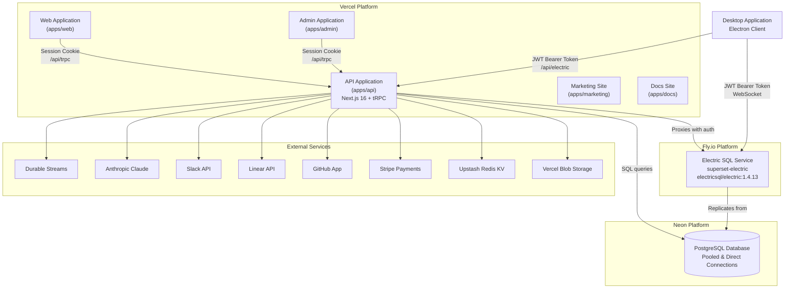
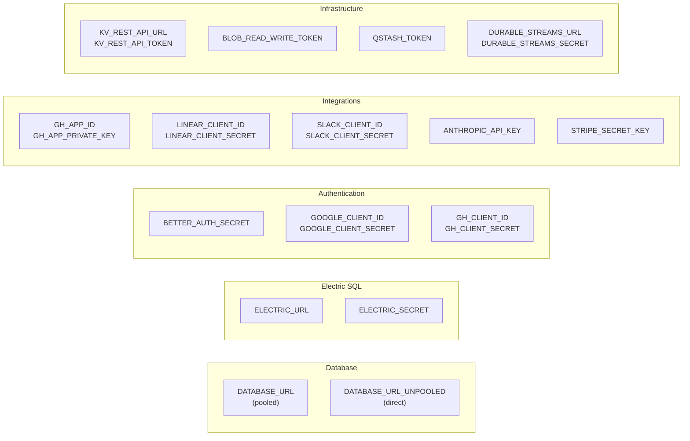
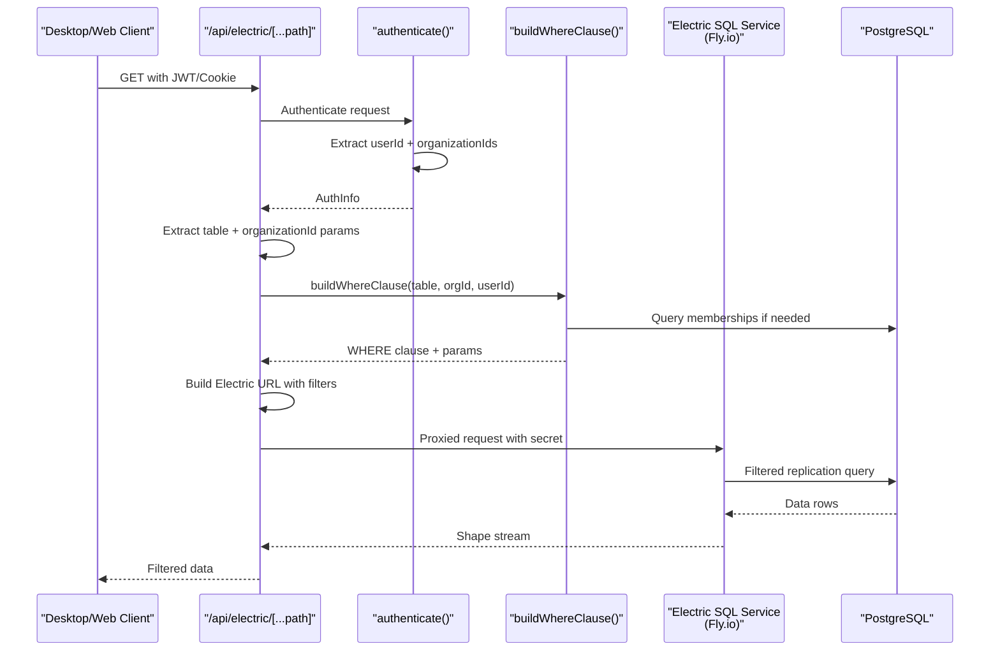
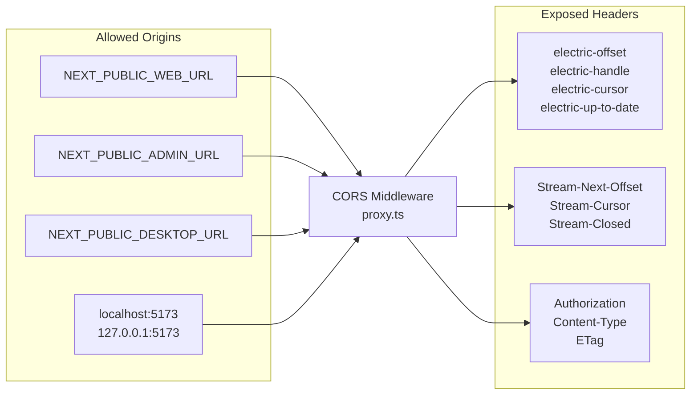
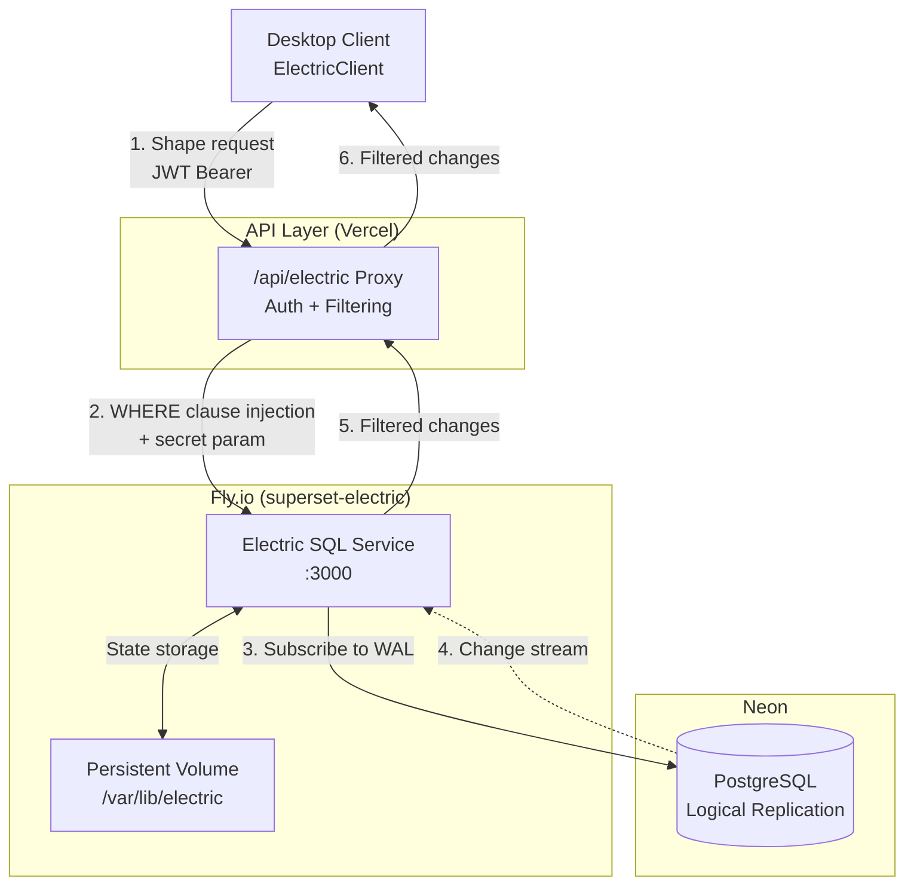
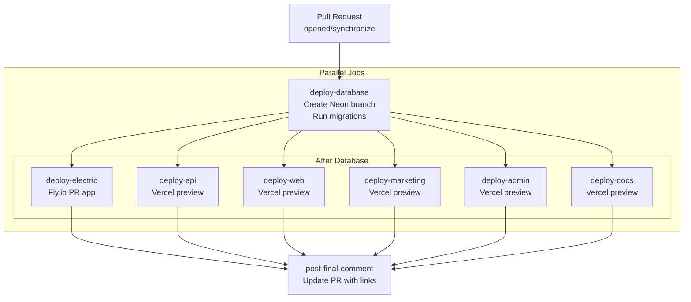
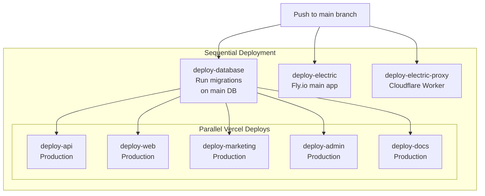
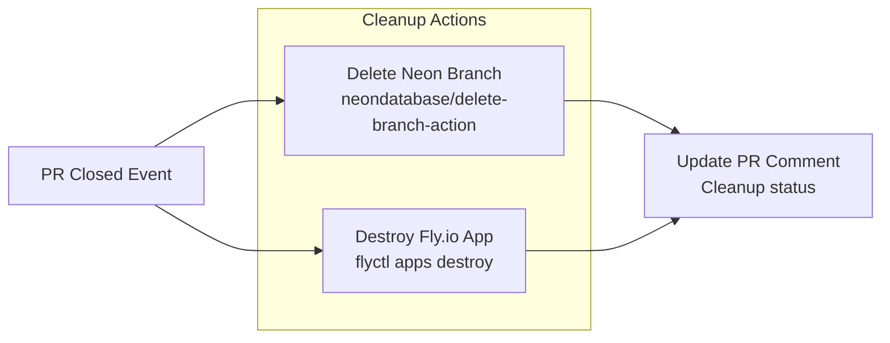

# Backend Services

<details>
<summary>Relevant source files</summary>

The following files were used as context for generating this wiki page:

- [.github/templates/cleanup-comment.md](.github/templates/cleanup-comment.md)
- [.github/templates/preview-comment.md](.github/templates/preview-comment.md)
- [.github/workflows/ci.yml](.github/workflows/ci.yml)
- [.github/workflows/cleanup-preview.yml](.github/workflows/cleanup-preview.yml)
- [.github/workflows/deploy-preview.yml](.github/workflows/deploy-preview.yml)
- [.github/workflows/deploy-production.yml](.github/workflows/deploy-production.yml)
- [apps/admin/src/trpc/react.tsx](apps/admin/src/trpc/react.tsx)
- [apps/api/package.json](apps/api/package.json)
- [apps/api/src/app/api/electric/[...path]/route.ts](apps/api/src/app/api/electric/[...path]/route.ts)
- [apps/api/src/app/api/electric/[...path]/utils.ts](apps/api/src/app/api/electric/[...path]/utils.ts)
- [apps/api/src/env.ts](apps/api/src/env.ts)
- [apps/api/src/proxy.ts](apps/api/src/proxy.ts)
- [apps/api/src/trpc/context.ts](apps/api/src/trpc/context.ts)
- [apps/desktop/src/renderer/routes/_authenticated/providers/CollectionsProvider/CollectionsProvider.tsx](apps/desktop/src/renderer/routes/_authenticated/providers/CollectionsProvider/CollectionsProvider.tsx)
- [apps/desktop/src/renderer/routes/_authenticated/providers/CollectionsProvider/collections.ts](apps/desktop/src/renderer/routes/_authenticated/providers/CollectionsProvider/collections.ts)
- [apps/web/src/trpc/react.tsx](apps/web/src/trpc/react.tsx)
- [fly.toml](fly.toml)

</details>


## Purpose and Scope

This document covers the backend infrastructure and services that power Superset. This includes the API application deployed to Vercel, the Electric SQL service for real-time data synchronization, database management, and deployment pipelines. For information about authentication implementation details, see [Authentication System](#3.4). For client-side data synchronization patterns, see [Data Synchronization](#2.10).

## Architecture Overview

The backend services consist of several key components deployed across multiple platforms:



**Sources:** [apps/api/src/env.ts:1-77](), [.github/workflows/deploy-production.yml:1-551](), [fly.toml:1-33]()

## API Application Structure

The API application is a Next.js application located at `apps/api` that serves as the central backend. It provides tRPC endpoints for mutations and proxies Electric SQL for real-time queries.

### Core Dependencies

| Package | Version | Purpose |
|---------|---------|---------|
| `next` | ^16.0.10 | Next.js framework |
| `@trpc/server` | ^11.7.1 | tRPC server implementation |
| `better-auth` | 1.4.18 | Authentication system |
| `drizzle-orm` | 0.45.1 | Database ORM |
| `@electric-sql/client` | 1.5.12 | Electric SQL client |
| `stripe` | ^20.2.0 | Payment processing |
| `@anthropic-ai/sdk` | ^0.78.0 | AI integration |

**Sources:** [apps/api/package.json:1-63]()

### Environment Configuration

The API requires extensive environment variables for integration with external services. The configuration is validated using `@t3-oss/env-nextjs` with Zod schemas:



All environment variables are validated at startup with strict type checking and minimum length requirements. Missing or invalid variables cause the application to fail immediately.

**Sources:** [apps/api/src/env.ts:1-77]()

## Electric SQL Proxy Service

The API application acts as an authentication gateway for Electric SQL, proxying requests from clients to the Electric SQL service while enforcing access control.

### Request Flow



**Sources:** [apps/api/src/app/api/electric/[...path]/route.ts:1-105]()

### Authentication Implementation

The proxy supports two authentication methods:

1. **JWT Bearer Token** - Used by the Desktop application
2. **Session Cookie** - Used by Web/Admin applications

```typescript
// From route.ts:11-32
async function authenticate(request: Request): Promise<AuthInfo | null> {
    const bearer = request.headers.get("Authorization");
    if (bearer?.startsWith("Bearer ")) {
        const token = bearer.slice(7);
        // Verify JWT and extract organizationIds
    }
    
    const sessionData = await auth.api.getSession({ headers: request.headers });
    if (!sessionData?.user) return null;
    return {
        userId: sessionData.user.id,
        organizationIds: sessionData.session.organizationIds ?? [],
    };
}
```

**Sources:** [apps/api/src/app/api/electric/[...path]/route.ts:11-32]()

### WHERE Clause Generation

The `buildWhereClause` function dynamically constructs SQL WHERE clauses based on the requested table and user's organization membership. This ensures data isolation at the database level.

#### Supported Tables

| Table Name | Filter Column | Special Logic |
|------------|--------------|---------------|
| `tasks` | `organization_id` | Simple org filter |
| `task_statuses` | `organization_id` | Simple org filter |
| `projects` | `organization_id` | Simple org filter |
| `workspaces` | `organization_id` | Simple org filter |
| `auth.members` | `organization_id` | Simple org filter |
| `auth.invitations` | `organization_id` | Simple org filter |
| `auth.organizations` | `id` | IN list of user's orgs |
| `auth.users` | `organization_ids` | Array contains check |
| `auth.apikeys` | `metadata` | JSONB path filter |
| `device_presence` | `organization_id` | Simple org filter |
| `agent_commands` | `organization_id` | Simple org filter |
| `integration_connections` | `organization_id` | Simple org filter |
| `subscriptions` | `reference_id` | Uses orgId as reference |
| `chat_sessions` | `organization_id` | Simple org filter |
| `session_hosts` | `organization_id` | Simple org filter |
| `github_repositories` | `organization_id` | Simple org filter |
| `github_pull_requests` | `organization_id` | Simple org filter |

**Sources:** [apps/api/src/app/api/electric/[...path]/utils.ts:23-162]()

### Column Filtering

For tables containing sensitive data, the proxy explicitly limits which columns are exposed:

```typescript
// From route.ts:77-89
if (tableName === "auth.apikeys") {
    originUrl.searchParams.set(
        "columns",
        "id,name,start,created_at,last_request",
    );
}

if (tableName === "integration_connections") {
    originUrl.searchParams.set(
        "columns",
        "id,organization_id,connected_by_user_id,provider,token_expires_at,...",
    );
}
```

This prevents tokens and other secrets from being replicated to clients.

**Sources:** [apps/api/src/app/api/electric/[...path]/route.ts:77-89]()

## CORS Configuration

The API implements a middleware proxy that handles CORS for cross-origin requests from the Desktop application and Web clients.



The middleware exposes Electric SQL protocol headers and Durable Streams headers so clients can properly handle sync state and streaming responses.

**Sources:** [apps/api/src/proxy.ts:1-75]()

## tRPC Context Creation

The API creates a tRPC context for each request that includes authentication information:

```typescript
// From context.ts:4-18
export const createContext = async ({
    req,
}: {
    req: Request;
    resHeaders: Headers;
}) => {
    const session = await auth.api.getSession({
        headers: req.headers,
    });
    return createTRPCContext({
        session,
        auth,
        headers: req.headers,
    });
};
```

This context is available to all tRPC routers and procedures, providing access to the authenticated user and their session data.

**Sources:** [apps/api/src/trpc/context.ts:1-19]()

## Client Integration Patterns

### Desktop Application

The Desktop application creates Electric SQL collections that subscribe to shapes through the API proxy:

```typescript
// From collections.ts:106-138
const tasks = createCollection(
    electricCollectionOptions<SelectTask>({
        id: `tasks-${organizationId}`,
        shapeOptions: {
            url: electricUrl,  // Points to /api/electric
            params: {
                table: "tasks",
                organizationId,
            },
            headers: electricHeaders,  // JWT Bearer token
            columnMapper,
        },
        getKey: (item) => item.id,
        onInsert: async ({ transaction }) => {
            // Write-through to API via tRPC
            const result = await apiClient.task.create.mutate(item);
            return { txid: result.txid };
        },
    }),
);
```

Collections implement a write-through pattern where mutations go through tRPC endpoints and return transaction IDs for reconciliation.

**Sources:** [apps/desktop/src/renderer/routes/_authenticated/providers/CollectionsProvider/collections.ts:106-138]()

### Web Applications

Web and Admin applications use tRPC with session-based authentication:

```typescript
// From web/src/trpc/react.tsx:44-53
httpBatchStreamLink({
    transformer: SuperJSON,
    url: `${env.NEXT_PUBLIC_API_URL}/api/trpc`,
    headers() {
        return { "x-trpc-source": "nextjs-react" };
    },
    fetch(url, options) {
        return fetch(url, { ...options, credentials: "include" });
    },
})
```

The `credentials: "include"` option ensures session cookies are sent with each request.

**Sources:** [apps/web/src/trpc/react.tsx:44-53](), [apps/admin/src/trpc/react.tsx:44-58]()

## Electric SQL Infrastructure

The Electric SQL service runs on Fly.io and replicates data from PostgreSQL to connected clients in real-time.

### Fly.io Configuration

```toml
app = "superset-electric"
primary_region = "iad"

[build]
image = "electricsql/electric:1.4.13"

[[vm]]
memory = "8192mb"
cpu_kind = "performance"
cpus = 4

[env]
ELECTRIC_DATABASE_USE_IPV6 = "true"
ELECTRIC_MAX_CONCURRENT_REQUESTS = '{"initial": 3000, "existing": 10000}'
```

The service is configured with:
- **8GB RAM** and **4 performance CPUs** for handling concurrent connections
- **IPv6 support** for database connections
- **High concurrency limits** (3,000 initial, 10,000 existing requests)
- **Health checks** every 10 seconds at `/v1/health`
- **Persistent volume** mounted at `/var/lib/electric` for state storage

**Sources:** [fly.toml:1-33]()

### Connection Flow



**Sources:** [fly.toml:1-33](), [apps/api/src/app/api/electric/[...path]/route.ts:34-104]()

## Deployment Pipelines

Superset uses GitHub Actions for automated deployment to preview and production environments.

### Preview Deployment Flow



Each PR gets:
- **Unique Neon database branch** named after the PR branch
- **Dedicated Electric Fly.io app** (`superset-electric-pr-{number}`)
- **5 Vercel preview deployments** with custom aliases:
  - `api-pr-{number}-superset.vercel.app`
  - `web-pr-{number}-superset.vercel.app`
  - `marketing-pr-{number}-superset.vercel.app`
  - `admin-pr-{number}-superset.vercel.app`
  - `docs-pr-{number}-superset.vercel.app`

**Sources:** [.github/workflows/deploy-preview.yml:1-766]()

### Production Deployment Flow



Production deployment:
1. **Database migrations run first** on the main Neon database
2. **All Vercel apps deploy in parallel** after migrations complete
3. **Electric SQL deploys independently** to `superset-electric` on Fly.io
4. **Electric proxy deploys** to Cloudflare Workers (separate from API proxy)

**Sources:** [.github/workflows/deploy-production.yml:1-551]()

### Cleanup on PR Close

When a PR is closed, preview resources are automatically cleaned up:



Vercel preview deployments are automatically removed by Vercel when the branch is deleted.

**Sources:** [.github/workflows/cleanup-preview.yml:1-49]()

### Environment Variables by Deployment

| Category | Preview | Production | Purpose |
|----------|---------|------------|---------|
| Database | Neon branch URLs | Main Neon URLs | Database connections |
| Electric | PR-specific URL | Production URL | Sync service endpoint |
| Auth | Shared secrets | Shared secrets | OAuth credentials |
| Integrations | Shared keys | Shared keys | GitHub/Linear/Slack/Stripe |
| Monitoring | Preview environment | Production environment | Sentry/PostHog tracking |

All secret values are stored in GitHub Actions secrets and injected at deploy time.

**Sources:** [.github/workflows/deploy-preview.yml:163-217](), [.github/workflows/deploy-production.yml:69-123]()