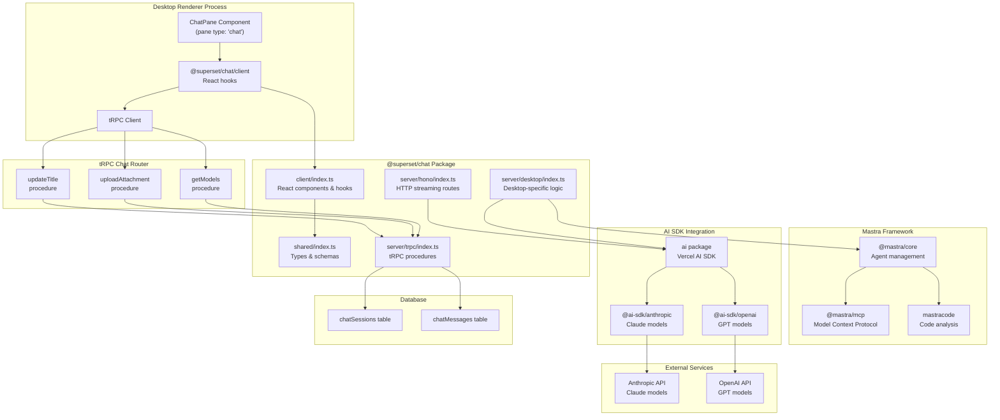
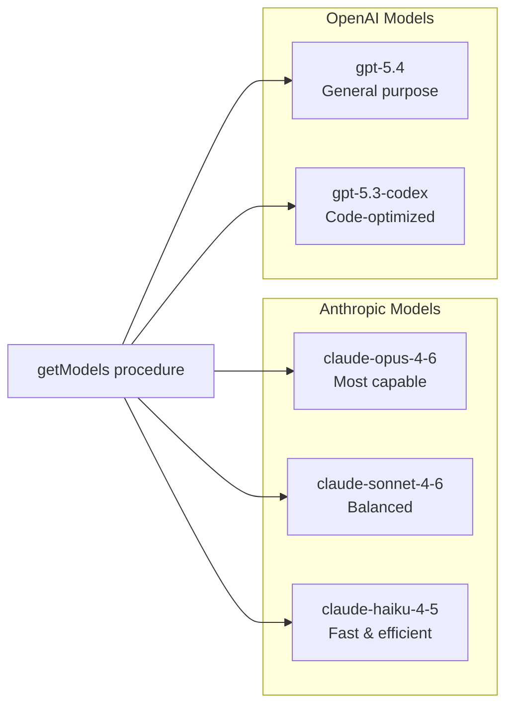
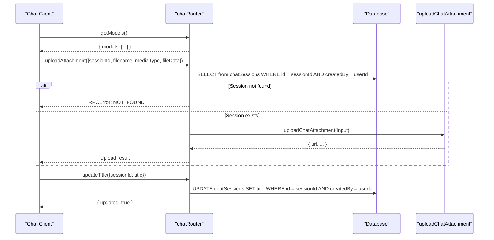
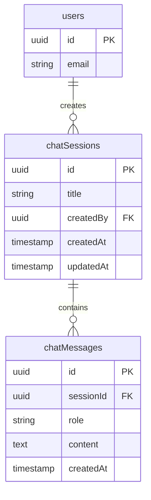
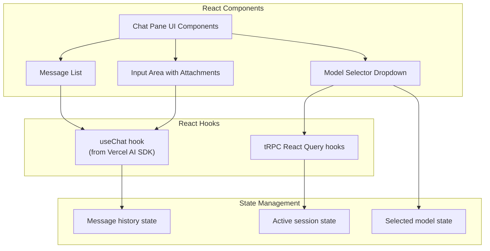
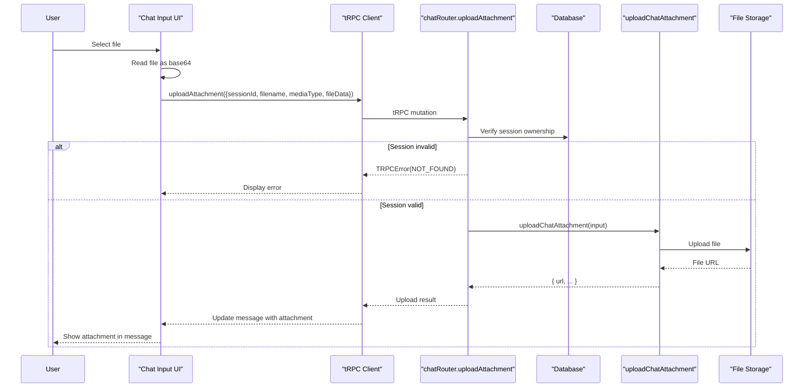
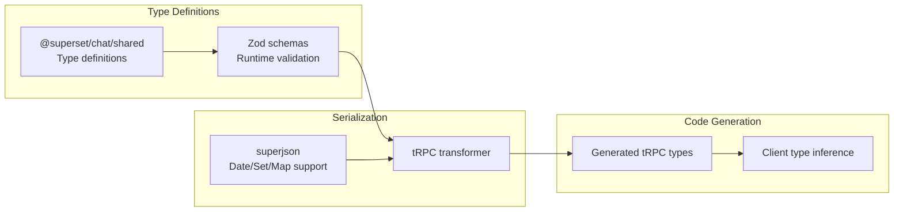

# AI Chat Integration

<details>
<summary>Relevant source files</summary>

The following files were used as context for generating this wiki page:

- [packages/chat/package.json](packages/chat/package.json)
- [packages/trpc/src/router/chat/chat.ts](packages/trpc/src/router/chat/chat.ts)

</details>

The AI Chat Integration system enables conversational AI interactions within Superset workspaces, providing access to multiple AI models from Anthropic and OpenAI. This system is implemented through the `@superset/chat` package, which integrates the Mastra framework for agent management and the Vercel AI SDK for streaming responses.

For information about the chat UI pane component itself, see [Tab and Pane System](#2.7). For terminal-based command execution, see [Terminal System](#2.8).

---

## Architecture Overview

The chat system is structured as a multi-layer architecture spanning client, server, and external AI provider services:



**Sources:** [packages/chat/package.json:1-61](), high-level system diagrams

---

## Package Structure

The `@superset/chat` package provides multiple entry points for different runtime contexts:

| Export Path                     | Purpose                                | Target Runtime   |
| ------------------------------- | -------------------------------------- | ---------------- |
| `@superset/chat/client`         | React components and hooks for chat UI | Renderer process |
| `@superset/chat/shared`         | Shared types, schemas, and constants   | All contexts     |
| `@superset/chat/server/desktop` | Desktop-specific chat server logic     | Main process     |
| `@superset/chat/server/trpc`    | tRPC procedure definitions             | API server       |
| `@superset/chat/server/hono`    | Hono HTTP streaming routes             | API server       |

This modular structure allows the desktop app to use client-side components while the API server implements the backend procedures.

**Sources:** [packages/chat/package.json:5-26]()

---

## Available AI Models

The system provides access to multiple AI models from Anthropic and OpenAI:



The available models are defined in [packages/trpc/src/router/chat/chat.ts:10-36]() as:

| Model ID                      | Display Name  | Provider  | Use Case                                   |
| ----------------------------- | ------------- | --------- | ------------------------------------------ |
| `anthropic/claude-opus-4-6`   | Opus 4.6      | Anthropic | Most capable model for complex reasoning   |
| `anthropic/claude-sonnet-4-6` | Sonnet 4.6    | Anthropic | Balanced performance and speed             |
| `anthropic/claude-haiku-4-5`  | Haiku 4.5     | Anthropic | Fast responses for simpler tasks           |
| `openai/gpt-5.4`              | GPT-5.4       | OpenAI    | General-purpose language model             |
| `openai/gpt-5.3-codex`        | GPT-5.3 Codex | OpenAI    | Optimized for code generation and analysis |

The `getModels` procedure [packages/trpc/src/router/chat/chat.ts:39-41]() returns this list to clients, allowing the UI to present model selection options.

**Sources:** [packages/trpc/src/router/chat/chat.ts:10-41]()

---

## tRPC Chat Router

The chat router exposes three main procedures for managing chat sessions:



### getModels Procedure

Returns the list of available AI models [packages/trpc/src/router/chat/chat.ts:39-41]():

```typescript
getModels: protectedProcedure.query(() => {
  return { models: AVAILABLE_MODELS }
})
```

This is a simple query that requires authentication (`protectedProcedure`) and returns the static model list.

### uploadAttachment Procedure

Handles file uploads for chat sessions [packages/trpc/src/router/chat/chat.ts:43-73]():

**Input Schema:**

- `sessionId`: UUID of the chat session
- `filename`: Original filename (1-255 characters)
- `mediaType`: MIME type of the file
- `fileData`: Base64-encoded file contents

**Flow:**

1. Validates that the session exists and belongs to the authenticated user [packages/trpc/src/router/chat/chat.ts:53-62]()
2. Throws `NOT_FOUND` error if session is invalid [packages/trpc/src/router/chat/chat.ts:64-69]()
3. Calls `uploadChatAttachment` utility to handle the actual upload [packages/trpc/src/router/chat/chat.ts:71]()
4. Returns the upload result

### updateTitle Procedure

Updates the title of a chat session [packages/trpc/src/router/chat/chat.ts:75-89]():

**Input Schema:**

- `sessionId`: UUID of the chat session
- `title`: New title string

**Implementation:**

- Uses Drizzle ORM to update the `chatSessions` table [packages/trpc/src/router/chat/chat.ts:78-87]()
- Filters by both `sessionId` and `createdBy` to enforce ownership [packages/trpc/src/router/chat/chat.ts:82-85]()
- Returns `{ updated: boolean }` indicating success

**Sources:** [packages/trpc/src/router/chat/chat.ts:38-90]()

---

## Database Schema Integration

The chat system integrates with the Superset database through the `chatSessions` table:



The router enforces row-level security by filtering queries with `eq(chatSessions.createdBy, ctx.session.user.id)` [packages/trpc/src/router/chat/chat.ts:59](), ensuring users can only access their own chat sessions.

**Sources:** [packages/trpc/src/router/chat/chat.ts:2-3](), [packages/trpc/src/router/chat/chat.ts:53-62]()

---

## Dependencies and Framework Integration

The chat package integrates several AI and framework dependencies:

### Mastra Framework

The package uses `@mastra/core` (v1.3.0) and `@mastra/mcp` (v1.0.2) for agent orchestration and Model Context Protocol support [packages/chat/package.json:35-36](). Mastra provides:

- Agent lifecycle management
- Tool execution framework
- Context management for conversations

### Vercel AI SDK

The `ai` package (v6.0.0) [packages/chat/package.json:41]() provides:

- Streaming response handling
- Model-agnostic interface
- React hooks for UI integration

### AI Model Providers

Two provider-specific SDKs enable model access:

- `@ai-sdk/anthropic` (v3.0.43) [packages/chat/package.json:33]() - Claude models
- `@ai-sdk/openai` (v3.0.36) [packages/chat/package.json:34]() - GPT models

### Code Analysis

The `mastracode` package (v0.4.0) [packages/chat/package.json:43]() provides code understanding capabilities for AI agents, allowing them to analyze workspace files.

**Sources:** [packages/chat/package.json:32-45]()

---

## Integration with Workspace System

The chat system integrates with the workspace filesystem through `@superset/workspace-fs` [packages/chat/package.json:38](), enabling AI agents to:

- Read file contents from the current workspace
- Analyze code structure
- Provide context-aware suggestions
- Reference specific files in conversations

This integration allows chat sessions to be workspace-aware, with access to the Git worktree structure documented in [Workspace System](#2.6).

**Sources:** [packages/chat/package.json:38]()

---

## Client-Side Integration

The chat client provides React components and hooks for the renderer process:



The client exports (`@superset/chat/client`) provide peer dependencies on:

- `react` (v18 or v19) [packages/chat/package.json:51]()
- `@tanstack/react-query` (v5) [packages/chat/package.json:48]()
- `@trpc/client` and `@trpc/react-query` (v11.7.1) [packages/chat/package.json:49-50]()

**Sources:** [packages/chat/package.json:6-10](), [packages/chat/package.json:48-51]()

---

## Attachment Upload Flow

The attachment system enables users to include files in chat conversations:



### Security Validation

The upload procedure enforces several security checks [packages/trpc/src/router/chat/chat.ts:53-69]():

1. **Session Ownership**: Verifies the session belongs to the authenticated user
2. **Zod Schema Validation**: Ensures filename (1-255 chars) and mediaType are valid [packages/trpc/src/router/chat/chat.ts:44-50]()
3. **Base64 Content**: Validates fileData is a non-empty base64 string [packages/trpc/src/router/chat/chat.ts:49]()

The `uploadChatAttachment` utility [packages/trpc/src/router/chat/chat.ts:8]() is imported from `./utils/upload-chat-attachment` and handles the actual storage logic (not shown in provided files).

**Sources:** [packages/trpc/src/router/chat/chat.ts:43-73]()

---

## Type Safety and Validation

The chat system uses Zod schemas for runtime validation and SuperJSON for type-safe serialization:



The package includes `superjson` (v2.2.5) [packages/chat/package.json:44]() and `zod` (v4.3.5) [packages/chat/package.json:45]() for handling complex types and validation across the IPC boundary.

**Sources:** [packages/chat/package.json:44-45]()

---

## Development and Testing

The chat package includes minimal development scripts:

```bash
# Type checking only (no emission)
bun run typecheck

# Test execution (currently no tests defined)
bun test --pass-with-no-tests
```

The `typecheck` script [packages/chat/package.json:29]() runs TypeScript in checking mode without emitting declarations, useful for validating types during development.

The package is marked as `private: true` [packages/chat/package.json:4](), indicating it's not published to npm and only used within the monorepo.

**Sources:** [packages/chat/package.json:28-30](), [packages/chat/package.json:4]()
