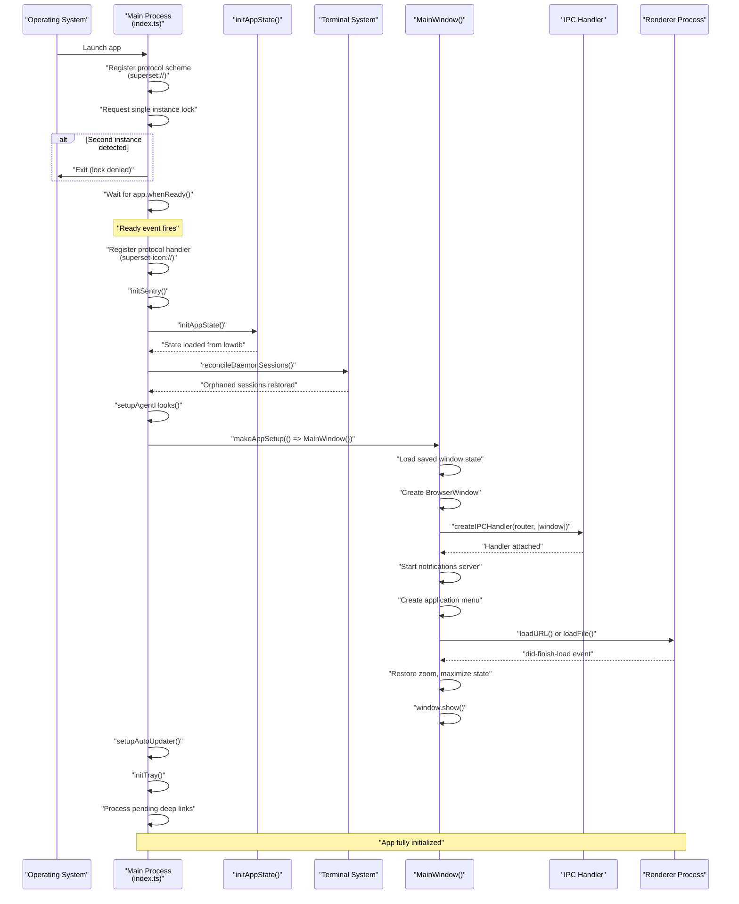
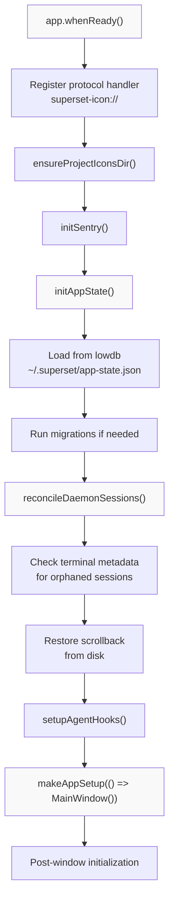
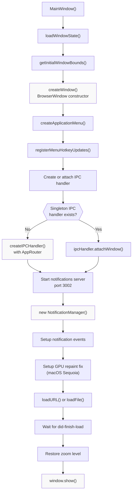
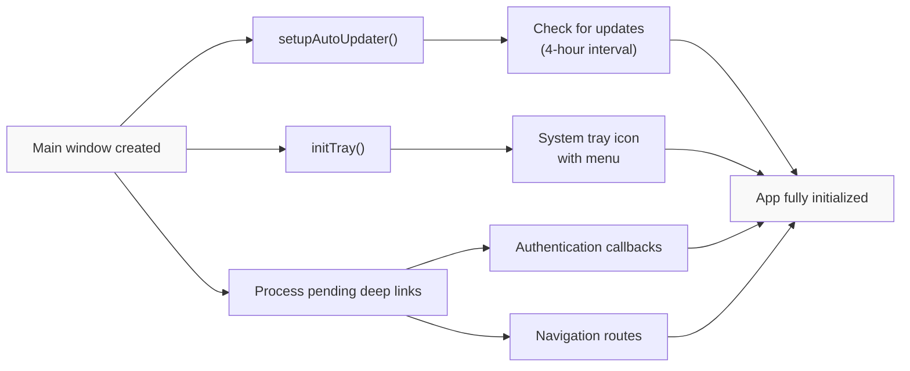
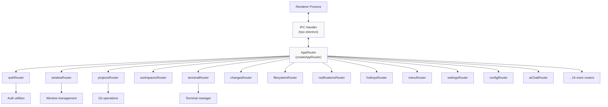
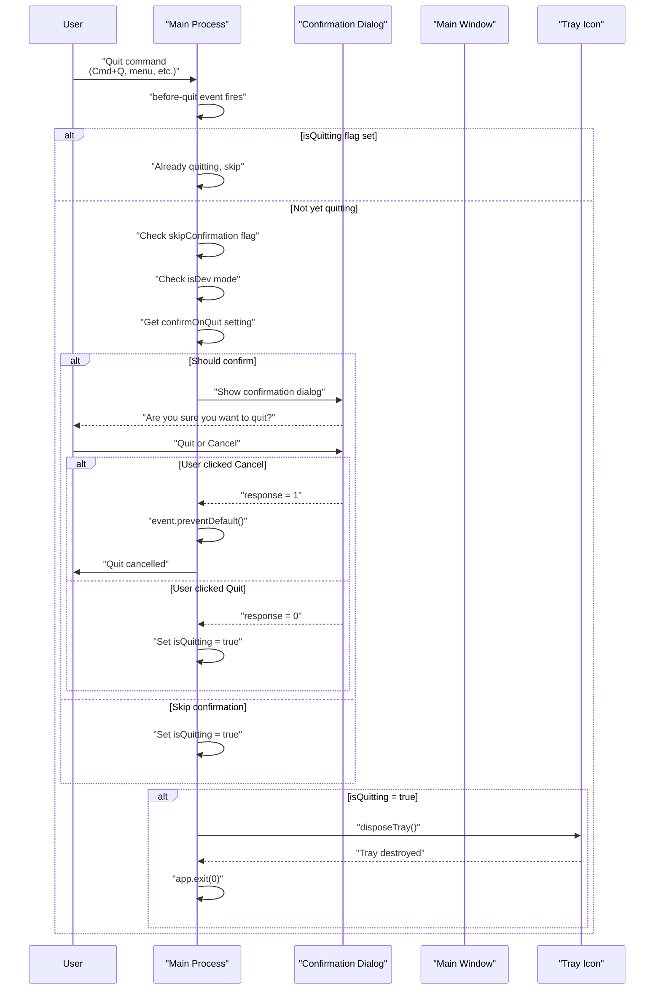

# Application Lifecycle and Initialization

Relevant source files

The following files were used as context for generating this wiki page:

- [.github/actions/merge-mac-manifests/action.yml](.github/actions/merge-mac-manifests/action.yml)
- [.github/actions/merge-mac-manifests/merge-mac-manifests.mjs](.github/actions/merge-mac-manifests/merge-mac-manifests.mjs)
- [.github/workflows/build-desktop.yml](.github/workflows/build-desktop.yml)
- [.github/workflows/release-desktop-canary.yml](.github/workflows/release-desktop-canary.yml)
- [.github/workflows/release-desktop.yml](.github/workflows/release-desktop.yml)
- [apps/api/src/app/api/auth/desktop/connect/route.ts](apps/api/src/app/api/auth/desktop/connect/route.ts)
- [apps/desktop/BUILDING.md](apps/desktop/BUILDING.md)
- [apps/desktop/RELEASE.md](apps/desktop/RELEASE.md)
- [apps/desktop/create-release.sh](apps/desktop/create-release.sh)
- [apps/desktop/electron-builder.ts](apps/desktop/electron-builder.ts)
- [apps/desktop/electron.vite.config.ts](apps/desktop/electron.vite.config.ts)
- [apps/desktop/package.json](apps/desktop/package.json)
- [apps/desktop/scripts/copy-native-modules.ts](apps/desktop/scripts/copy-native-modules.ts)
- [apps/desktop/src/main/env.main.ts](apps/desktop/src/main/env.main.ts)
- [apps/desktop/src/main/index.ts](apps/desktop/src/main/index.ts)
- [apps/desktop/src/main/lib/auto-updater.ts](apps/desktop/src/main/lib/auto-updater.ts)
- [apps/desktop/src/renderer/env.renderer.ts](apps/desktop/src/renderer/env.renderer.ts)
- [apps/desktop/src/renderer/index.html](apps/desktop/src/renderer/index.html)
- [apps/desktop/vite/helpers.ts](apps/desktop/vite/helpers.ts)
- [apps/web/src/app/auth/desktop/success/page.tsx](apps/web/src/app/auth/desktop/success/page.tsx)
- [biome.jsonc](biome.jsonc)
- [bun.lock](bun.lock)
- [package.json](package.json)
- [packages/ui/package.json](packages/ui/package.json)
- [scripts/lint.sh](scripts/lint.sh)

This document describes the Electron desktop application's startup sequence, initialization order, window state restoration, and shutdown handling. It covers the main process initialization from app launch through window creation and IPC setup.

For build configuration and packaging, see [Build and Release System](#2.2). For auto-update behavior after initialization, see [Auto-Update System](#2.3). For IPC communication patterns, see [IPC and tRPC Communication](#2.5).

---

## Overview

The desktop application follows a multi-stage initialization process:

1. **Pre-Ready Phase**: Protocol registration, single instance lock, environment setup
2. **Ready Phase**: Sentry, app state, database migrations, terminal reconciliation  
3. **Window Creation**: Main window, IPC setup, notifications server, menu
4. **Post-Window**: Auto-updater, tray, deep link processing

The main process manages native system integration while the renderer process handles UI. Communication occurs exclusively through tRPC over Electron IPC channels.

**Sources**: [apps/desktop/src/main/index.ts:1-262]()

---

## Application Entry Points

The Electron app has three separate Node.js processes, each with its own entry point:

| Process | Entry Point | Purpose |
|---------|-------------|---------|
| **Main Process** | `src/main/index.ts` | Application lifecycle, window management, native APIs |
| **Terminal Host** | `src/main/terminal-host/index.ts` | Persistent terminal session daemon |
| **PTY Subprocess** | `src/main/terminal-host/pty-subprocess.ts` | Individual shell process wrapper |

These entry points are configured in the electron-vite build:

[apps/desktop/electron.vite.config.ts:95-101]()

The main process is the primary orchestrator. The terminal host and PTY subprocess are spawned as child processes for terminal persistence (see [Terminal System](#2.8) for details).

**Sources**: [apps/desktop/electron.vite.config.ts:1-251]()

---

## Startup Sequence Diagram

**Sources**: [apps/desktop/src/main/index.ts:214-260](), [apps/desktop/src/main/windows/main.ts:86-270]()

---

## Pre-Ready Initialization

Before `app.whenReady()` fires, several critical tasks must complete:

### Protocol Scheme Registration

Custom protocol schemes must be registered before the app is ready:

[apps/desktop/src/main/index.ts:188-198]()

The `superset://` protocol enables deep linking for authentication callbacks and navigation. The `superset-icon://` protocol (registered in the ready handler) serves project icons from the local filesystem.

### Single Instance Lock

Only one instance of the app can run at a time:

[apps/desktop/src/main/index.ts:200-213]()

If a second instance attempts to launch, the first instance receives the command-line arguments (including any deep link URLs) via the `second-instance` event.

### Workspace Name Override

The app name can be customized per workspace for development:

[apps/desktop/src/main/index.ts:24-27]()

This allows running multiple instances in different Turborepo workspaces (e.g., `Superset (web)`, `Superset (desktop)`).

**Sources**: [apps/desktop/src/main/index.ts:1-40](), [shared/env.shared:1-50]()

---

## Ready Phase Initialization

Once `app.whenReady()` resolves, the main initialization sequence begins:

**Sources**: [apps/desktop/src/main/index.ts:214-260]()

### App State Initialization

`initAppState()` loads persisted application state from lowdb:

[apps/desktop/src/main/index.ts:234]()

This includes tabs state, hotkey customizations, and other UI preferences. The state is stored in `~/.superset/app-state.json` using the lowdb JSON file database.

### Terminal Session Reconciliation

Before creating the window, the terminal system checks for orphaned sessions (terminals that were running when the app crashed):

[apps/desktop/src/main/index.ts:237]()

This process reads terminal metadata from `~/.superset/terminal-history/`, detects sessions without an `endedAt` timestamp, and restores their scrollback. See [Terminal Persistence and History](#2.8.2) for details.

**Sources**: [apps/desktop/src/main/index.ts:214-260](), [apps/desktop/src/main/lib/app-state.ts:1-100]()

---

## Window Creation and IPC Setup

The main window creation is handled by `MainWindow()`, which returns a configured `BrowserWindow` instance:

**Sources**: [apps/desktop/src/main/windows/main.ts:86-270]()

### Singleton IPC Handler

The IPC handler is a singleton to prevent duplicate handlers when the window reopens (macOS behavior):

[apps/desktop/src/main/windows/main.ts:34-36]()

[apps/desktop/src/main/windows/main.ts:128-135]()

When a window closes and reopens, the existing handler is reused and simply attached to the new window.

### Window State Persistence

Window bounds, maximized state, and zoom level are persisted across restarts:

[apps/desktop/src/main/windows/main.ts:87-88]()

The state is saved when the window closes:

[apps/desktop/src/main/windows/main.ts:246-258]()

### Development vs Production Loading

The window loading strategy differs between development and production:

**Development**: Loads from Vite dev server at `http://localhost:${DESKTOP_VITE_PORT}/`

**Production**: Loads from built HTML file using `loadFile()`

This is handled in the window loader utility:

[apps/desktop/src/lib/window-loader.ts:20-32]()

**Sources**: [apps/desktop/src/main/windows/main.ts:86-270](), [apps/desktop/src/lib/window-loader.ts:1-51]()

---

## Post-Window Initialization

After the main window is created, final initialization tasks run:

### Auto-Updater Setup

The auto-updater is configured after the window exists:

[apps/desktop/src/main/index.ts:246]()

It immediately checks for updates, then rechecks every 4 hours. The updater uses GitHub Releases as the update source. See [Auto-Update System](#2.3) for details.

### Tray Icon

A system tray icon is initialized with a context menu:

[apps/desktop/src/main/index.ts:247]()

This provides quick access to common actions even when the window is hidden or minimized.

### Deep Link Processing

Deep links may arrive before the window exists (cold start via protocol URL):

[apps/desktop/src/main/index.ts:82-92]()

The URL is queued and processed after initialization completes:

[apps/desktop/src/main/index.ts:249-257]()

**Sources**: [apps/desktop/src/main/index.ts:245-260](), [apps/desktop/src/main/lib/auto-updater.ts:200-283]()

---

## IPC Router Architecture

The main process exposes functionality to the renderer via a tRPC router with 20+ specialized routers:

The router is created with a getter function that provides the current window:

[apps/desktop/src/lib/trpc/routers/index.ts:24-47]()

This ensures routers always have access to the active window even if it's recreated (macOS window reopen behavior).

**Sources**: [apps/desktop/src/lib/trpc/routers/index.ts:1-50](), [apps/desktop/src/main/windows/main.ts:128-135]()

---

## Environment Variable Injection

Environment variables are injected at build time through the Vite configuration:

**Main Process**: [apps/desktop/electron.vite.config.ts:46-90]()

**Renderer Process**: [apps/desktop/electron.vite.config.ts:146-191]()

This includes:
- API URLs (`NEXT_PUBLIC_API_URL`, `NEXT_PUBLIC_STREAMS_URL`, etc.)
- Analytics keys (PostHog)
- Error tracking (Sentry DSN)
- Development ports

The `defineEnv()` helper stringifies values for static replacement:

[apps/desktop/vite/helpers.ts:19-24]()

**Sources**: [apps/desktop/electron.vite.config.ts:1-251](), [apps/desktop/vite/helpers.ts:1-85]()

---

## Shutdown Sequence

The shutdown process ensures clean termination and optional user confirmation:

### Quit Confirmation

By default, the app prompts for confirmation before quitting (unless in development mode):

[apps/desktop/src/main/index.ts:116-145]()

The setting is stored in the local database and defaults to `true`:

[apps/desktop/src/main/index.ts:98-105]()

### Skip Confirmation API

Internal code can bypass the confirmation dialog:

[apps/desktop/src/main/index.ts:107-114]()

This is used by the auto-updater when installing updates, which requires a restart.

### Window Close Behavior

When the main window closes, it saves state and cleans up resources:

[apps/desktop/src/main/windows/main.ts:246-268]()

The window close event:
1. Saves window bounds and zoom level
2. Stops the notifications server
3. Disposes the notification manager
4. Removes all notification listeners
5. Detaches terminal listeners
6. Detaches the window from the IPC handler (handler stays alive)

**Sources**: [apps/desktop/src/main/index.ts:95-145](), [apps/desktop/src/main/windows/main.ts:246-268]()

---

## Development Mode Differences

Development mode includes several special behaviors:

### Parent Process Monitoring

electron-vite may exit without signaling the child Electron process. To handle this, a watchdog checks if the parent process is alive:

[apps/desktop/src/main/index.ts:158-186]()

### Dev Protocol Registration

The protocol scheme registration differs in dev mode to pass the correct entry point:

[apps/desktop/src/main/index.ts:30-35]()

### Skip Quit Confirmation

Development mode always skips the quit confirmation dialog:

[apps/desktop/src/main/index.ts:119-121]()

### Dev Menu

A special "Dev" menu provides utilities for testing:

[apps/desktop/src/main/lib/menu.ts:121-154]()

This includes:
- Reset terminal state (clears all terminal history and metadata)
- Simulate update states (downloading, ready, error)

**Sources**: [apps/desktop/src/main/index.ts:119-186](), [apps/desktop/src/main/lib/menu.ts:121-154]()

---

## Error Handling

Uncaught exceptions and unhandled rejections are logged but don't crash the app:

[apps/desktop/src/main/index.ts:147-155]()

This prevents the app from exiting unexpectedly, though errors should still be caught and handled properly in production code.

### GPU Process Recovery

On macOS Sequoia+, GPU process crashes can corrupt compositor layers. The app detects these crashes and forces a repaint:

[apps/desktop/src/main/windows/main.ts:78-84]()

The `forceRepaint()` function invalidates the webcontents and performs a tiny resize to reconstruct the compositor layer tree:

[apps/desktop/src/main/windows/main.ts:66-75]()

### Render Process Errors

The window also logs (but doesn't crash on) render process failures:

[apps/desktop/src/main/windows/main.ts:224-244]()

**Sources**: [apps/desktop/src/main/index.ts:147-155](), [apps/desktop/src/main/windows/main.ts:66-84](), [apps/desktop/src/main/windows/main.ts:224-244]()

---

## macOS-Specific Behaviors

### Open URL Event

macOS can trigger `open-url` events before the app is ready (cold start via protocol link):

[apps/desktop/src/main/index.ts:86-93]()

The URL is queued and processed after initialization completes.

### Window Reopen

On macOS, closing the last window doesn't quit the app. The window can be reopened from the dock icon. The singleton IPC handler pattern ensures this works correctly:

[apps/desktop/src/main/windows/main.ts:34-36]()

### Background Throttling

macOS Sequoia+ can corrupt GPU layers when background throttling is enabled. The app disables it:

[apps/desktop/src/main/windows/main.ts:124-126]()

### Repaint on Restore

Windows that become visible again need a repaint to fix compositor issues:

[apps/desktop/src/main/windows/main.ts:204-211]()

**Sources**: [apps/desktop/src/main/index.ts:86-93](), [apps/desktop/src/main/windows/main.ts:34-36](), [apps/desktop/src/main/windows/main.ts:124-126](), [apps/desktop/src/main/windows/main.ts:204-211]()

---

## Initialization Timing Summary

| Phase | Timing | Key Actions |
|-------|--------|-------------|
| **Launch** | T+0ms | Protocol registration, single instance check |
| **Pre-Ready** | T+0-500ms | Wait for Electron ready event |
| **Ready** | T+500ms | Protocol handler, Sentry, app state load |
| **Database** | T+600ms | Run migrations, load settings |
| **Terminal** | T+700ms | Reconcile orphaned sessions, restore scrollback |
| **Window** | T+800ms | Create window, setup IPC, start notifications |
| **Renderer** | T+1000ms | Load HTML, initialize React, mount components |
| **Post-Window** | T+1500ms | Auto-updater, tray, deep links |
| **Fully Ready** | T+2000ms | All systems operational |

These are approximate timings on a modern Mac with SSD. Actual times vary based on:
- Number of orphaned terminal sessions to restore
- Database migration complexity
- Cold vs warm Electron/Chromium startup

**Sources**: [apps/desktop/src/main/index.ts:214-260]()