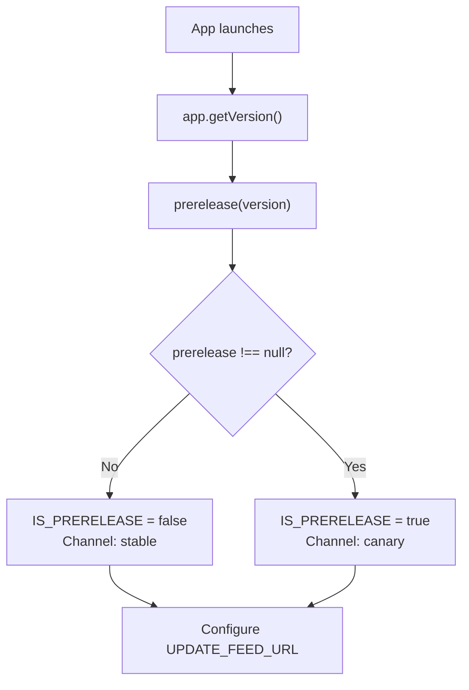
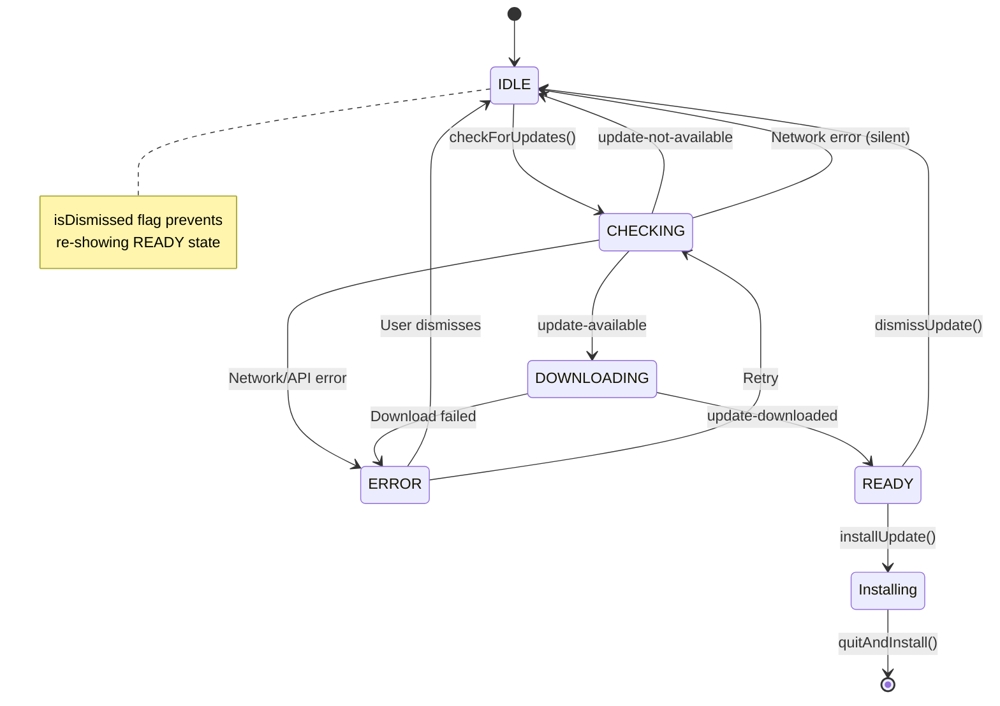
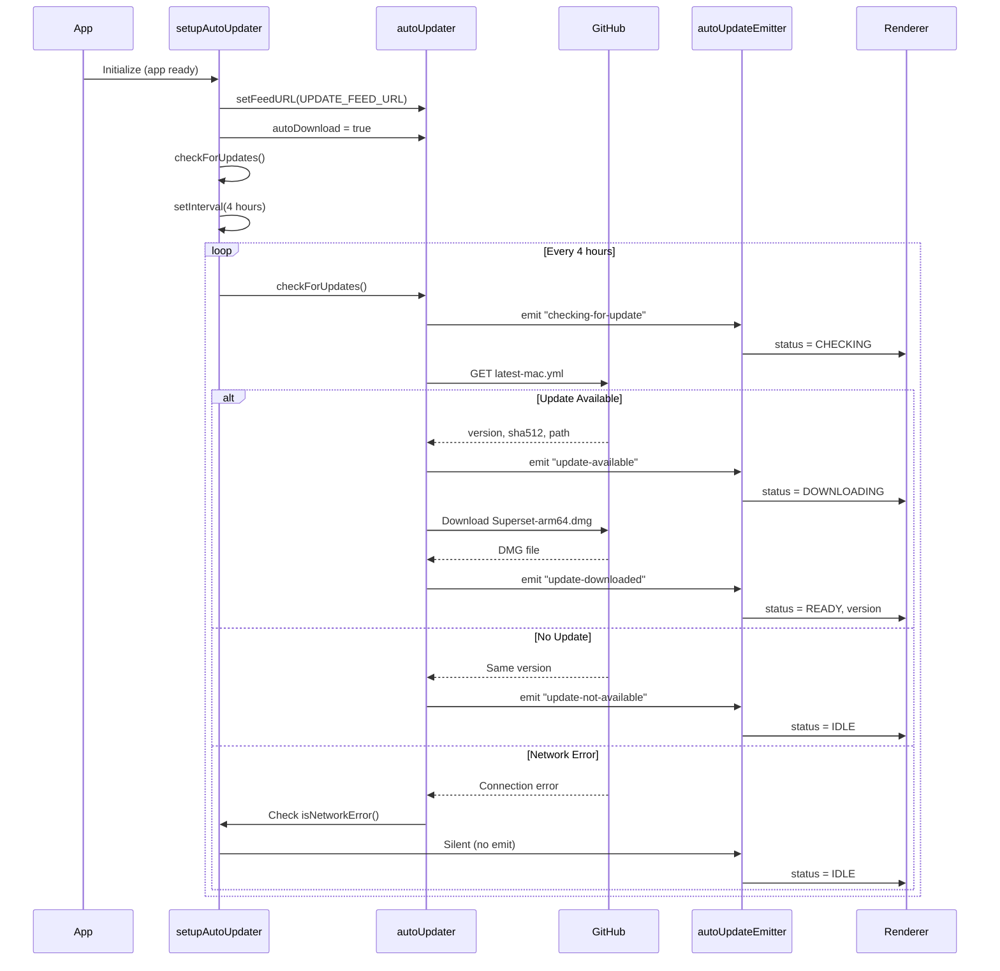
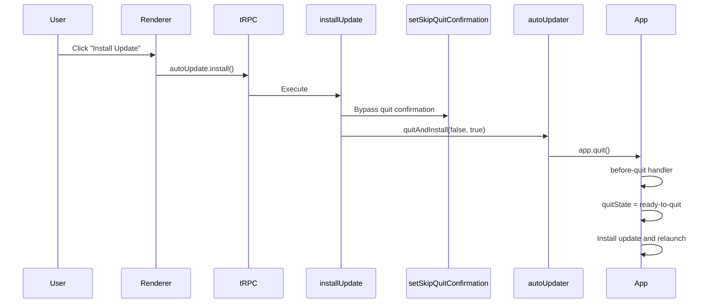
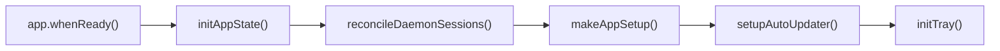
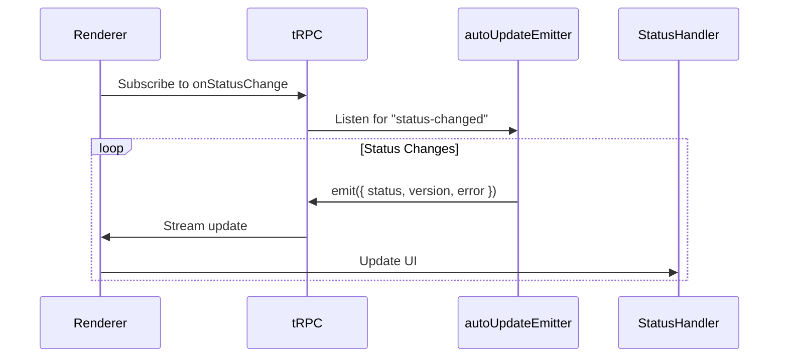
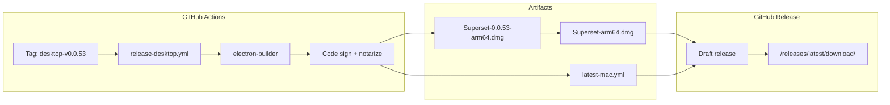

# Auto-Update System

<details>
<summary>Relevant source files</summary>

The following files were used as context for generating this wiki page:

- [.github/actions/merge-mac-manifests/action.yml](.github/actions/merge-mac-manifests/action.yml)
- [.github/actions/merge-mac-manifests/merge-mac-manifests.mjs](.github/actions/merge-mac-manifests/merge-mac-manifests.mjs)
- [.github/workflows/build-desktop.yml](.github/workflows/build-desktop.yml)
- [.github/workflows/release-desktop-canary.yml](.github/workflows/release-desktop-canary.yml)
- [.github/workflows/release-desktop.yml](.github/workflows/release-desktop.yml)
- [apps/api/src/app/api/auth/desktop/connect/route.ts](apps/api/src/app/api/auth/desktop/connect/route.ts)
- [apps/desktop/BUILDING.md](apps/desktop/BUILDING.md)
- [apps/desktop/RELEASE.md](apps/desktop/RELEASE.md)
- [apps/desktop/create-release.sh](apps/desktop/create-release.sh)
- [apps/desktop/electron-builder.ts](apps/desktop/electron-builder.ts)
- [apps/desktop/electron.vite.config.ts](apps/desktop/electron.vite.config.ts)
- [apps/desktop/package.json](apps/desktop/package.json)
- [apps/desktop/scripts/copy-native-modules.ts](apps/desktop/scripts/copy-native-modules.ts)
- [apps/desktop/src/main/env.main.ts](apps/desktop/src/main/env.main.ts)
- [apps/desktop/src/main/index.ts](apps/desktop/src/main/index.ts)
- [apps/desktop/src/main/lib/auto-updater.ts](apps/desktop/src/main/lib/auto-updater.ts)
- [apps/desktop/src/renderer/env.renderer.ts](apps/desktop/src/renderer/env.renderer.ts)
- [apps/desktop/src/renderer/index.html](apps/desktop/src/renderer/index.html)
- [apps/desktop/vite/helpers.ts](apps/desktop/vite/helpers.ts)
- [apps/web/src/app/auth/desktop/success/page.tsx](apps/web/src/app/auth/desktop/success/page.tsx)
- [biome.jsonc](biome.jsonc)
- [bun.lock](bun.lock)
- [package.json](package.json)
- [packages/ui/package.json](packages/ui/package.json)
- [scripts/lint.sh](scripts/lint.sh)

</details>

## Purpose and Scope

This document covers the auto-update system for the Superset desktop application, which uses `electron-updater` to deliver application updates to end users. The system handles update checking, downloading, installation, and channel management (stable vs canary releases).

For information about the build and release pipeline that produces update artifacts, see [Build and Release System](#2.2).

## Overview

The auto-update system provides seamless application updates using GitHub Releases as the distribution mechanism. Updates are checked automatically at application launch and periodically during runtime. The system supports two release channels (stable and canary) with channel-specific feed URLs, automatic download, and installation on application quit.

**Key Components:**

| Component            | Location                                              | Purpose                                                     |
| -------------------- | ----------------------------------------------------- | ----------------------------------------------------------- |
| `setupAutoUpdater()` | [apps/desktop/src/main/lib/auto-updater.ts:200-271]() | Initializes update system with feed URLs and event handlers |
| `autoUpdateEmitter`  | [apps/desktop/src/main/lib/auto-updater.ts:38]()      | EventEmitter for status change notifications                |
| `electron-updater`   | [apps/desktop/package.json:85]()                      | Third-party library for auto-update functionality           |
| Update manifest      | `latest-mac.yml`                                      | Metadata file with version and download URLs                |

Sources: [apps/desktop/src/main/lib/auto-updater.ts:1-272](), [apps/desktop/package.json:85]()

## Channel-Based Update Feeds

The system determines the appropriate update channel by inspecting the application version for prerelease components using semver parsing.

### Channel Detection



Sources: [apps/desktop/src/main/lib/auto-updater.ts:17-23]()

### Feed URLs

| Channel | Version Pattern | Feed URL                                                                   |
| ------- | --------------- | -------------------------------------------------------------------------- |
| Stable  | `0.0.53`        | `https://github.com/superset-sh/superset/releases/latest/download`         |
| Canary  | `0.0.53-canary` | `https://github.com/superset-sh/superset/releases/download/desktop-canary` |

The `allowDowngrade` configuration is enabled for canary builds, allowing users to switch from canary back to stable releases.

Sources: [apps/desktop/src/main/lib/auto-updater.ts:23-30](), [apps/desktop/src/main/lib/auto-updater.ts:209]()

## Update State Machine

The auto-updater tracks state using the `AUTO_UPDATE_STATUS` enum, with transitions managed through the `emitStatus()` function.

### Status Flow Diagram



### Status Definitions

| Status        | Description                            | User Action              |
| ------------- | -------------------------------------- | ------------------------ |
| `IDLE`        | No update activity or update dismissed | None                     |
| `CHECKING`    | Querying GitHub releases for updates   | None (automatic)         |
| `DOWNLOADING` | Update file download in progress       | None (automatic)         |
| `READY`       | Update downloaded and ready to install | User prompted to install |
| `ERROR`       | Update check or download failed        | User can retry           |

Sources: [apps/desktop/src/main/lib/auto-updater.ts:60-77](), [shared/auto-update.ts]()

### Network Error Handling

Network errors are silently suppressed to avoid user-visible errors for transient connectivity issues. The system retries on the next scheduled check.

```typescript
// Silent error patterns - no user notification
SILENT_ERROR_PATTERNS = [
  "net::ERR_INTERNET_DISCONNECTED",
  "net::ERR_NETWORK_CHANGED",
  "net::ERR_CONNECTION_REFUSED",
  "ENOTFOUND",
  "ETIMEDOUT",
  ...
]
```

Sources: [apps/desktop/src/main/lib/auto-updater.ts:42-58]()

## Update Check Flow

### Automatic Update Sequence



Sources: [apps/desktop/src/main/lib/auto-updater.ts:200-271](), [apps/desktop/src/main/lib/auto-updater.ts:102-117]()

### Update Check Interval

The system checks for updates at two points:

1. **Initial check**: Immediately when app is ready ([apps/desktop/src/main/lib/auto-updater.ts:261-270]())
2. **Periodic checks**: Every 4 hours using `setInterval()` ([apps/desktop/src/main/lib/auto-updater.ts:10](), [apps/desktop/src/main/lib/auto-updater.ts:258-259]())

The interval timer is unref'd to prevent keeping the event loop alive.

Sources: [apps/desktop/src/main/lib/auto-updater.ts:10](), [apps/desktop/src/main/lib/auto-updater.ts:258-270]()

## Installation Flow

### User-Initiated Installation

When the user accepts an update, the `installUpdate()` function is called from the renderer process via tRPC.



The `quitAndInstall()` parameters:

- First argument (`false`): Do not force immediate close
- Second argument (`true`): Relaunch after installation

Sources: [apps/desktop/src/main/lib/auto-updater.ts:86-95](), [apps/desktop/src/main/index.ts:112-114]()

### Auto-Install on Quit

The system is configured with `autoInstallOnAppQuit = true`, which automatically installs downloaded updates when the user quits the application normally.

Sources: [apps/desktop/src/main/lib/auto-updater.ts:206]()

## Integration Points

### Main Process Initialization

The auto-updater is initialized in the main process after the app is ready.



Sources: [apps/desktop/src/main/index.ts:218-248]()

### tRPC Router Endpoints

The auto-updater exposes several tRPC endpoints for renderer communication:

| Endpoint                      | Function                       | Description                        |
| ----------------------------- | ------------------------------ | ---------------------------------- |
| `autoUpdate.status`           | `getUpdateStatus()`            | Returns current status and version |
| `autoUpdate.check`            | `checkForUpdates()`            | Initiates update check             |
| `autoUpdate.checkInteractive` | `checkForUpdatesInteractive()` | Check with user feedback dialog    |
| `autoUpdate.install`          | `installUpdate()`              | Installs downloaded update         |
| `autoUpdate.dismiss`          | `dismissUpdate()`              | Dismisses update notification      |
| `autoUpdate.onStatusChange`   | subscription                   | Streams status changes             |

Sources: [apps/desktop/src/main/lib/auto-updater.ts:79-100](), [apps/desktop/src/main/lib/trpc/routers/auto-update.ts]()

### Event Subscription Pattern

The renderer process subscribes to update status changes using tRPC subscriptions:



Sources: [apps/desktop/src/main/lib/auto-updater.ts:38](), [apps/desktop/src/main/lib/auto-updater.ts:76]()

## Release Pipeline Integration

### Artifact Generation

The build pipeline creates update artifacts during the release workflow:



The workflow creates stable-named copies to ensure `/releases/latest/download/` URLs always point to the newest version without requiring version numbers in the URL.

Sources: [.github/workflows/release-desktop.yml:44-66](), [apps/desktop/RELEASE.md:54-61]()

### Manifest File Structure

The `latest-mac.yml` file contains update metadata:

```yaml
version: 0.0.53
files:
  - url: Superset-arm64.dmg
    sha512: <hash>
    size: <bytes>
path: Superset-arm64.dmg
sha512: <hash>
releaseDate: 2025-01-15T12:00:00.000Z
```

This manifest is queried by `electron-updater` to determine if updates are available.

Sources: [.github/workflows/release-desktop.yml:44-66](), [apps/desktop/electron-builder.ts:20-29]()

## Configuration

### Electron Builder Configuration

The update system is configured in `electron-builder.ts`:

| Setting                              | Value           | Purpose                                 |
| ------------------------------------ | --------------- | --------------------------------------- |
| `generateUpdatesFilesForAllChannels` | `true`          | Creates manifests for stable and canary |
| `publish.provider`                   | `"github"`      | Use GitHub Releases                     |
| `publish.owner`                      | `"superset-sh"` | Repository owner                        |
| `publish.repo`                       | `"superset"`    | Repository name                         |

Sources: [apps/desktop/electron-builder.ts:20-29]()

### Runtime Configuration

Settings applied in `setupAutoUpdater()`:

| Setting                | Value                | Purpose                               |
| ---------------------- | -------------------- | ------------------------------------- |
| `autoDownload`         | `true`               | Automatically download updates        |
| `autoInstallOnAppQuit` | `true`               | Install on normal app quit            |
| `allowDowngrade`       | `IS_PRERELEASE`      | Allow switching from canary to stable |
| `setFeedURL()`         | Channel-specific URL | Explicit feed URL for stable/canary   |

Sources: [apps/desktop/src/main/lib/auto-updater.ts:200-216]()

## Platform Support

The auto-update system is currently **macOS-only**. The system checks `PLATFORM.IS_MAC` before initializing and exits early on other platforms.

```typescript
if (env.NODE_ENV === 'development' || !PLATFORM.IS_MAC) {
  return
}
```

Windows and Linux builds do not use the auto-update system and must be manually updated.

Sources: [apps/desktop/src/main/lib/auto-updater.ts:201-203](), [apps/desktop/src/main/lib/auto-updater.ts:103-105]()

## Development and Testing

### Development Mode Behavior

In development mode (`NODE_ENV === "development"`), the auto-updater is disabled to prevent interference with hot-reload and development workflows.

### Simulation Functions

The system provides simulation functions for testing UI integration:

| Function                | Effect                                          |
| ----------------------- | ----------------------------------------------- |
| `simulateUpdateReady()` | Sets status to READY with version "99.0.0-test" |
| `simulateDownloading()` | Sets status to DOWNLOADING                      |
| `simulateError()`       | Sets status to ERROR with test message          |

These functions are only available in development mode.

Sources: [apps/desktop/src/main/lib/auto-updater.ts:178-198]()

### Interactive Update Check

The `checkForUpdatesInteractive()` function provides immediate user feedback with dialogs for manual update checks triggered from the application menu.

Sources: [apps/desktop/src/main/lib/auto-updater.ts:119-176]()
