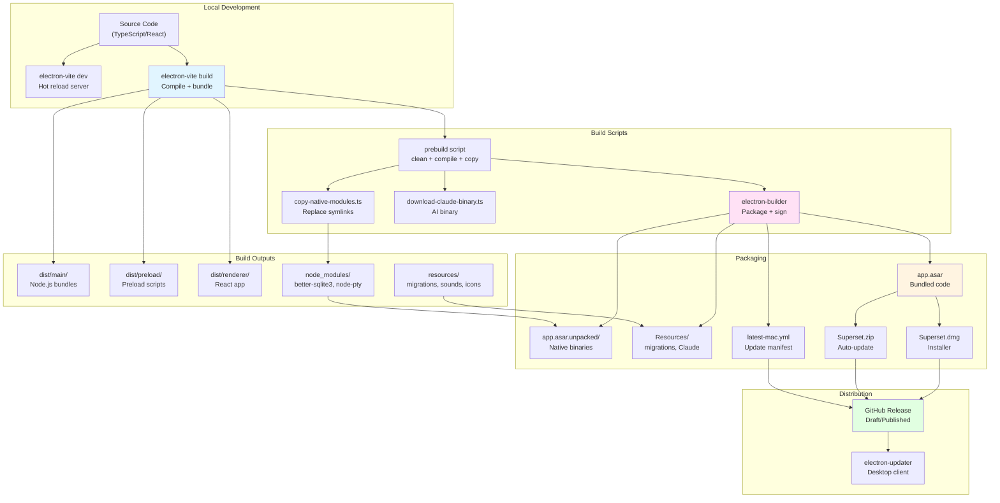
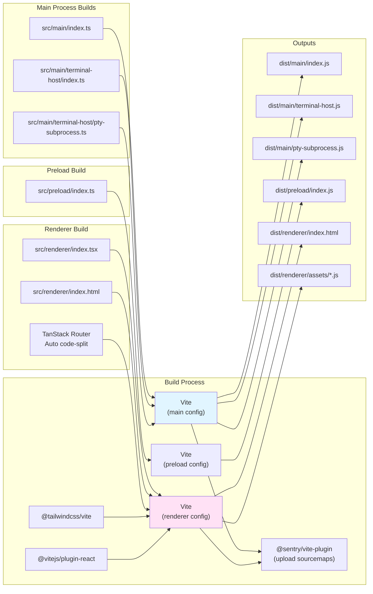
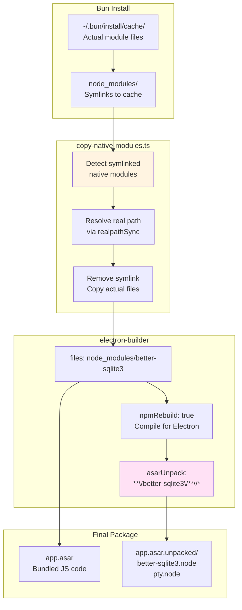
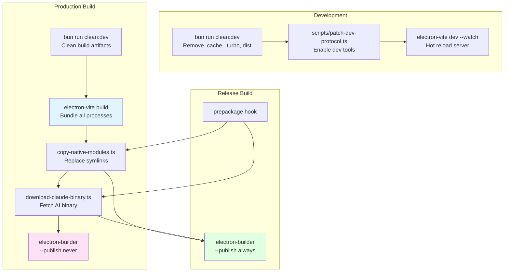
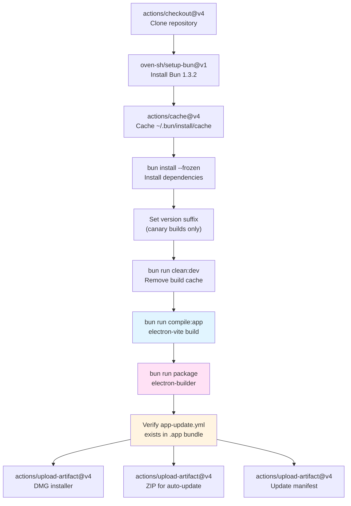
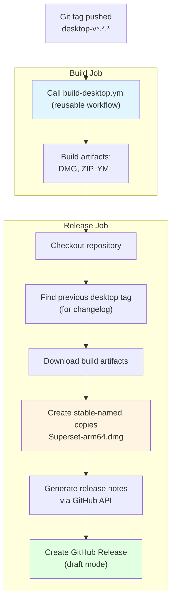
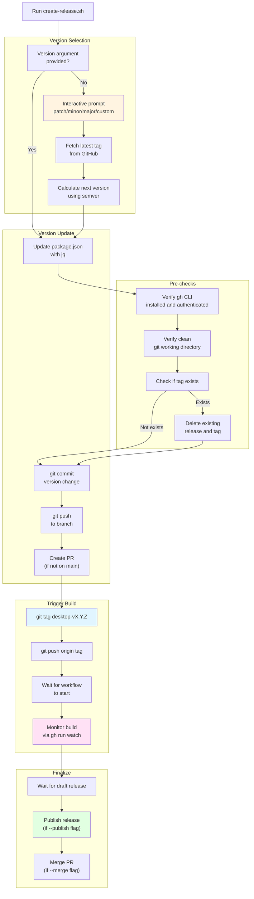
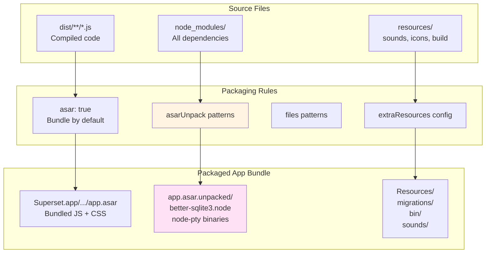
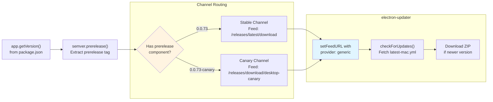

# Build and Release System

<details>
<summary>Relevant source files</summary>

The following files were used as context for generating this wiki page:

- [.github/actions/merge-mac-manifests/action.yml](.github/actions/merge-mac-manifests/action.yml)
- [.github/actions/merge-mac-manifests/merge-mac-manifests.mjs](.github/actions/merge-mac-manifests/merge-mac-manifests.mjs)
- [.github/workflows/build-desktop.yml](.github/workflows/build-desktop.yml)
- [.github/workflows/release-desktop-canary.yml](.github/workflows/release-desktop-canary.yml)
- [.github/workflows/release-desktop.yml](.github/workflows/release-desktop.yml)
- [apps/api/src/app/api/auth/desktop/connect/route.ts](apps/api/src/app/api/auth/desktop/connect/route.ts)
- [apps/desktop/BUILDING.md](apps/desktop/BUILDING.md)
- [apps/desktop/RELEASE.md](apps/desktop/RELEASE.md)
- [apps/desktop/create-release.sh](apps/desktop/create-release.sh)
- [apps/desktop/electron-builder.ts](apps/desktop/electron-builder.ts)
- [apps/desktop/electron.vite.config.ts](apps/desktop/electron.vite.config.ts)
- [apps/desktop/package.json](apps/desktop/package.json)
- [apps/desktop/scripts/copy-native-modules.ts](apps/desktop/scripts/copy-native-modules.ts)
- [apps/desktop/src/main/env.main.ts](apps/desktop/src/main/env.main.ts)
- [apps/desktop/src/main/index.ts](apps/desktop/src/main/index.ts)
- [apps/desktop/src/main/lib/auto-updater.ts](apps/desktop/src/main/lib/auto-updater.ts)
- [apps/desktop/src/renderer/env.renderer.ts](apps/desktop/src/renderer/env.renderer.ts)
- [apps/desktop/src/renderer/index.html](apps/desktop/src/renderer/index.html)
- [apps/desktop/vite/helpers.ts](apps/desktop/vite/helpers.ts)
- [apps/web/src/app/auth/desktop/success/page.tsx](apps/web/src/app/auth/desktop/success/page.tsx)
- [biome.jsonc](biome.jsonc)
- [bun.lock](bun.lock)
- [package.json](package.json)
- [packages/ui/package.json](packages/ui/package.json)
- [scripts/lint.sh](scripts/lint.sh)

</details>

## Purpose and Scope

This document describes the build and release infrastructure for the Superset desktop application. It covers the electron-vite build configuration, electron-builder packaging setup, native module handling, GitHub Actions workflows for automated builds, the release process, and integration with the auto-update system. For information about the auto-update mechanism from the user's perspective, see [Auto-Update System](#2.3).

---

## System Overview

The desktop application uses a multi-stage build and release pipeline that transforms TypeScript source code into signed, distributable macOS application bundles with automatic update capabilities.

**Build and Release Pipeline**



**Sources:** [apps/desktop/package.json:16-36](), [apps/desktop/electron.vite.config.ts:1-251](), [apps/desktop/electron-builder.ts:1-173]()

---

## Build Configuration

### electron-vite Configuration

The application uses `electron-vite` to build three separate entry points with different capabilities:

| Entry Point        | Runtime   | Purpose                   | External Dependencies                    |
| ------------------ | --------- | ------------------------- | ---------------------------------------- |
| **main**           | Node.js   | Main process, system APIs | `electron`, `better-sqlite3`, `node-pty` |
| **terminal-host**  | Node.js   | PTY daemon process        | Same as main                             |
| **pty-subprocess** | Node.js   | Individual PTY instance   | Same as main                             |
| **preload**        | Sandboxed | IPC bridge to renderer    | `trpc-electron`, `@sentry/electron`      |
| **renderer**       | Chromium  | React UI                  | None (all bundled)                       |

**electron-vite Build Configuration**



**Sources:** [apps/desktop/electron.vite.config.ts:42-116](), [apps/desktop/electron.vite.config.ts:118-143](), [apps/desktop/electron.vite.config.ts:145-249]()

The configuration defines environment variables at build time, injecting production defaults for API URLs, Sentry DSN, PostHog keys, and other service endpoints. [apps/desktop/electron.vite.config.ts:46-90](), [apps/desktop/electron.vite.config.ts:146-191]()

### electron-builder Configuration

The `electron-builder.ts` configuration file defines how the compiled application is packaged into distributable formats.

| Configuration   | Value                      | Purpose                              |
| --------------- | -------------------------- | ------------------------------------ |
| **appId**       | `com.superset.desktop`     | macOS bundle identifier              |
| **productName** | `Superset`                 | Application display name             |
| **asar**        | `true`                     | Bundle app code into archive         |
| **asarUnpack**  | Native modules + resources | Files that must remain on filesystem |
| **npmRebuild**  | `true`                     | Rebuild native modules for Electron  |
| **notarize**    | `true`                     | Apple notarization required          |

**Sources:** [apps/desktop/electron-builder.ts:14-22](), [apps/desktop/electron-builder.ts:37-49]()

### Native Module Handling

Native Node.js modules (`better-sqlite3`, `node-pty`) cannot be bundled by Vite and must be handled specially:

**Native Module Packaging Strategy**



**Sources:** [apps/desktop/scripts/copy-native-modules.ts:1-84](), [apps/desktop/electron-builder.ts:38-49](), [apps/desktop/electron-builder.ts:68-109]()

The `copy-native-modules.ts` script runs before packaging to ensure native modules are real files rather than symlinks, which electron-builder cannot follow. [apps/desktop/scripts/copy-native-modules.ts:25-61]()

Additional dependencies like `bindings` and `file-uri-to-path` must also be included because `better-sqlite3` uses them to locate its native `.node` file at runtime. [apps/desktop/electron-builder.ts:85-96]()

---

## Build Process

### Build Scripts Execution Flow

The `package.json` defines a chain of scripts that orchestrate the build:



**Sources:** [apps/desktop/package.json:16-36]()

| Script                | Command                                     | Purpose                     |
| --------------------- | ------------------------------------------- | --------------------------- |
| `clean:dev`           | `rimraf ./node_modules/.dev`                | Remove development cache    |
| `compile:app`         | `electron-vite build`                       | Build main/preload/renderer |
| `copy:native-modules` | `bun run scripts/copy-native-modules.ts`    | Prepare native modules      |
| `download:claude`     | `bun run scripts/download-claude-binary.ts` | Fetch Claude binary         |
| `prebuild`            | Chain of above                              | Prepare for packaging       |
| `build`               | `electron-builder --publish never`          | Local packaging             |
| `package`             | `electron-builder`                          | Package with config         |
| `release`             | `electron-builder --publish always`         | Upload to GitHub            |

**Sources:** [apps/desktop/package.json:17-30]()

### Environment Variable Injection

The build system injects environment variables at two stages:

1. **Build time** (electron-vite): Variables are replaced in compiled code using Vite's `define` option
2. **Runtime** (HTML CSP): API URLs are injected into `index.html` Content Security Policy

**Sources:** [apps/desktop/electron.vite.config.ts:46-90](), [apps/desktop/vite/helpers.ts:64-84]()

---

## GitHub Actions Workflows

### Build Workflow (Reusable)

The `build-desktop.yml` workflow is a reusable workflow that can be invoked with different parameters for stable and canary releases.

**Build Workflow Steps**



**Sources:** [.github/workflows/build-desktop.yml:31-143]()

The workflow supports parameterization for different release channels:

| Parameter                 | Stable                | Canary                       |
| ------------------------- | --------------------- | ---------------------------- |
| `channel`                 | `stable`              | `canary`                     |
| `version_suffix`          | `` (empty)            | `-canary`                    |
| `electron_builder_config` | `electron-builder.ts` | `electron-builder-canary.ts` |
| `artifact_prefix`         | `desktop`             | `desktop-canary`             |

**Sources:** [.github/workflows/build-desktop.yml:4-29]()

The version suffix is appended to `package.json` version before building, creating versions like `0.0.73-canary`. [.github/workflows/build-desktop.yml:63-78]()

### Release Workflow

The `release-desktop.yml` workflow is triggered by Git tags matching `desktop-v*.*.*` and creates a GitHub Release.

**Release Workflow Steps**



**Sources:** [.github/workflows/release-desktop.yml:1-118]()

The workflow creates stable-named copies (without version numbers) to ensure the auto-update system can always fetch the latest version from a consistent URL:

```
Superset-0.0.73-arm64.dmg → Superset-arm64.dmg
Superset-0.0.73-arm64-mac.zip → Superset-arm64-mac.zip
```

**Sources:** [.github/workflows/release-desktop.yml:61-82]()

---

## Release Process

### Automated Release Script

The `create-release.sh` script automates the entire release process from version selection to GitHub Release creation.

**Release Script Flow**



**Sources:** [apps/desktop/create-release.sh:1-449]()

The script provides interactive version selection by fetching the latest desktop release tag from GitHub and calculating patch/minor/major increments. [apps/desktop/create-release.sh:113-172]()

It supports republishing by detecting existing tags and offering to clean them up before creating a new release. [apps/desktop/create-release.sh:198-246]()

### Manual Release Process

For manual releases without the script:

1. Update `apps/desktop/package.json` version
2. Commit and push changes
3. Create and push a Git tag: `git tag desktop-v0.0.73 && git push origin desktop-v0.0.73`
4. GitHub Actions automatically builds and creates a draft release
5. Review and publish the draft release manually

**Sources:** [apps/desktop/RELEASE.md:43-52]()

---

## Packaging and Artifacts

### ASAR Archive Structure

Electron Builder packages the application code into an ASAR (Atom Shell Archive) file for integrity and performance. However, native binaries and certain resources must remain unpacked on the filesystem.

**ASAR Packaging Strategy**



**Sources:** [apps/desktop/electron-builder.ts:37-66]()

Files that must be unpacked (specified in `asarUnpack`):

| Pattern                                 | Reason                                         |
| --------------------------------------- | ---------------------------------------------- |
| `**/node_modules/better-sqlite3/**/*`   | Native `.node` binary                          |
| `**/node_modules/bindings/**/*`         | Used by better-sqlite3 to locate native module |
| `**/node_modules/file-uri-to-path/**/*` | Dependency of bindings                         |
| `**/node_modules/node-pty/**/*`         | Native PTY binaries                            |
| `**/resources/sounds/**/*`              | External audio players need filesystem access  |
| `**/resources/tray/**/*`                | Electron Tray API requires filesystem access   |

**Sources:** [apps/desktop/electron-builder.ts:38-49]()

### Extra Resources

Resources placed outside the ASAR archive in the application's `Resources` directory:

| Resource                | Path                   | Purpose                                                     |
| ----------------------- | ---------------------- | ----------------------------------------------------------- |
| **Database migrations** | `resources/migrations` | Drizzle ORM needs filesystem access to read migration files |
| **Claude binary**       | `bin/darwin-arm64`     | AI agent executable (platform-specific)                     |

**Sources:** [apps/desktop/electron-builder.ts:51-66]()

These resources are accessed via `process.resourcesPath` at runtime. [apps/desktop/electron-builder.ts:51-58]()

### Generated Artifacts

Each build produces three artifacts for distribution:

| Artifact            | Filename Pattern                   | Purpose                                          |
| ------------------- | ---------------------------------- | ------------------------------------------------ |
| **DMG Installer**   | `Superset-{version}-arm64.dmg`     | User download for fresh installs                 |
| **ZIP Archive**     | `Superset-{version}-arm64-mac.zip` | Auto-update downloads this                       |
| **Update Manifest** | `latest-mac.yml`                   | Describes available update version and checksums |

**Sources:** [.github/workflows/build-desktop.yml:120-142]()

The release workflow creates stable-named copies without version numbers to support auto-update's expectation of consistent URLs:

```
/releases/latest/download/Superset-arm64.dmg
/releases/latest/download/Superset-arm64-mac.zip
/releases/latest/download/latest-mac.yml
```

**Sources:** [.github/workflows/release-desktop.yml:61-82]()

---

## Auto-Update Integration

### Update Feed Configuration

The `electron-builder.ts` configuration generates update manifests for the `electron-updater` library to consume:

```typescript
publish: {
  provider: "github",
  owner: "superset-sh",
  repo: "superset",
}
generateUpdatesFilesForAllChannels: true
```

**Sources:** [apps/desktop/electron-builder.ts:20-29]()

This creates a `latest-mac.yml` file that electron-updater fetches to detect available updates. The file contains version information, file URLs, and SHA-512 checksums. [apps/desktop/electron-builder.ts:24-29]()

### Channel System (Stable/Canary)

The desktop app supports two update channels based on the version string:

**Update Channel Detection**



**Sources:** [apps/desktop/src/main/lib/auto-updater.ts:11-30](), [apps/desktop/src/main/lib/auto-updater.ts:200-221]()

The channel detection uses `semver.prerelease()` to parse the version string. Versions like `0.0.73` have no prerelease components and use the stable channel, while `0.0.73-canary` has `["canary"]` and uses the canary channel. [apps/desktop/src/main/lib/auto-updater.ts:13-23]()

Canary builds enable `allowDowngrade` so users can switch back to stable releases. [apps/desktop/src/main/lib/auto-updater.ts:210]()

### Update Manifest Verification

The build workflow includes a verification step to ensure `app-update.yml` exists in the packaged application bundle:

```bash
APP_DIR=$(ls -d release/mac-arm64/*.app | head -1)
test -f "$APP_DIR/Contents/Resources/app-update.yml"
```

**Sources:** [.github/workflows/build-desktop.yml:111-118]()

This file must exist for auto-update to function. If missing, the build fails. The `app-update.yml` file is generated by electron-builder based on the `publish` configuration. [apps/desktop/electron-builder.ts:24-29]()

---

## Code Signing and Notarization

### macOS Code Signing

The build workflow uses GitHub repository secrets for code signing:

| Secret                        | Purpose                                |
| ----------------------------- | -------------------------------------- |
| `MAC_CERTIFICATE`             | Base64-encoded P12 certificate         |
| `MAC_CERTIFICATE_PASSWORD`    | Certificate password                   |
| `APPLE_ID`                    | Apple Developer account email          |
| `APPLE_APP_SPECIFIC_PASSWORD` | App-specific password for notarization |
| `APPLE_TEAM_ID`               | 10-character team identifier           |

**Sources:** [.github/workflows/build-desktop.yml:102-108]()

The electron-builder configuration enables both code signing and notarization:

```typescript
mac: {
  hardenedRuntime: true,
  gatekeeperAssess: false,
  notarize: true,
  extendInfo: {
    NSLocalNetworkUsageDescription: "...",
    NSBonjourServices: ["_http._tcp", "_https._tcp"]
  }
}
```

**Sources:** [apps/desktop/electron-builder.ts:114-136]()

### Local Network Permission

The `extendInfo` configuration includes `NSLocalNetworkUsageDescription` and `NSBonjourServices` to trigger the macOS local network permission prompt. This is required for the desktop app to connect to local development servers. [apps/desktop/electron-builder.ts:130-135]()

A helper function in the main process can trigger this permission prompt programmatically by attempting to send a multicast DNS query. [apps/desktop/src/main/lib/local-network-permission.ts:13-56]()

---

## Development vs Production Builds

### Development Mode

In development, electron-vite runs a Vite dev server for hot module replacement:

```bash
bun run dev
# → electron-vite dev --watch
```

The renderer loads from `http://localhost:${DESKTOP_VITE_PORT}` with live reloading enabled. [apps/desktop/src/lib/window-loader.ts:20-26]()

Environment variables are sourced from the repository's `.env` file. [apps/desktop/electron.vite.config.ts:21]()

**Sources:** [apps/desktop/package.json:19-20](), [apps/desktop/electron.vite.config.ts:20-24](), [apps/desktop/src/lib/window-loader.ts:1-51]()

### Production Mode

Production builds compile all code ahead of time and load from the filesystem:

```bash
bun run build
# → clean:dev + compile:app + copy:native-modules + download:claude + electron-builder
```

The renderer loads from `file://` URLs with hash-based routing: `file:///path/to/index.html#/`. [apps/desktop/src/lib/window-loader.ts:27-32]()

Environment variables are baked into the compiled code at build time with production defaults. [apps/desktop/electron.vite.config.ts:46-90]()

**Sources:** [apps/desktop/package.json:25-26](), [apps/desktop/electron.vite.config.ts:42-90]()

---

**Sources:** [apps/desktop/package.json:1-208](), [apps/desktop/electron.vite.config.ts:1-251](), [apps/desktop/electron-builder.ts:1-173](), [.github/workflows/build-desktop.yml:1-143](), [.github/workflows/release-desktop.yml:1-118](), [apps/desktop/create-release.sh:1-449](), [apps/desktop/scripts/copy-native-modules.ts:1-84](), [apps/desktop/src/main/lib/auto-updater.ts:1-284](), [apps/desktop/vite/helpers.ts:1-85](), [apps/desktop/RELEASE.md:1-85]()
