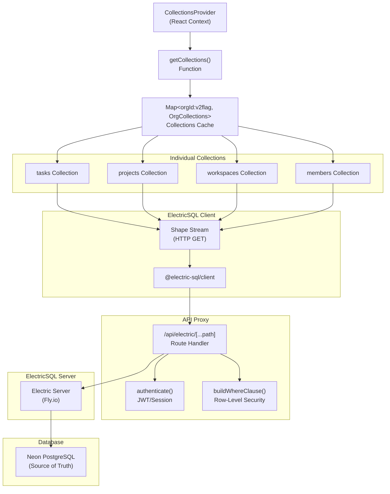
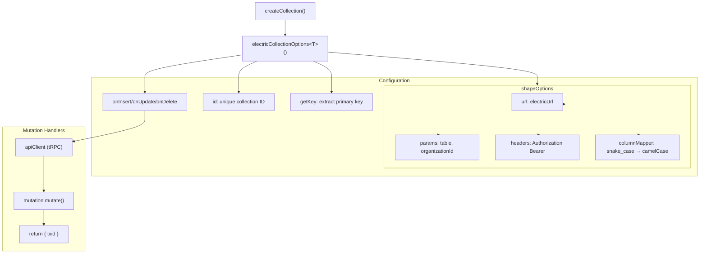
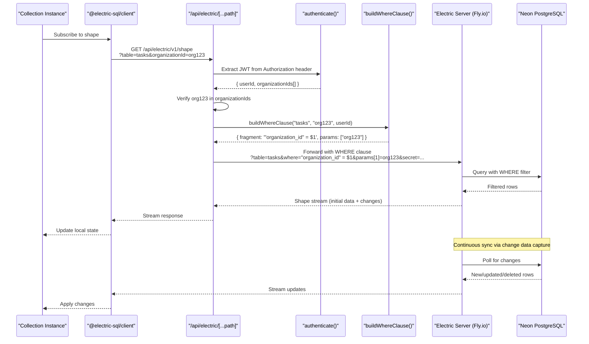
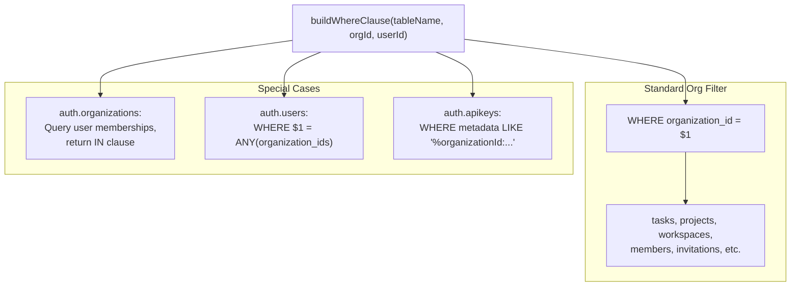
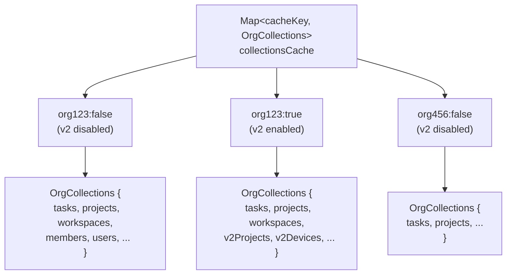
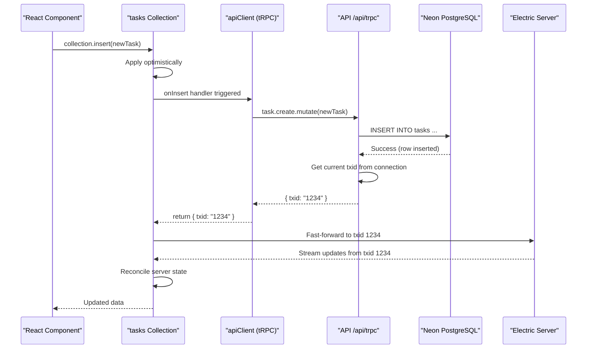
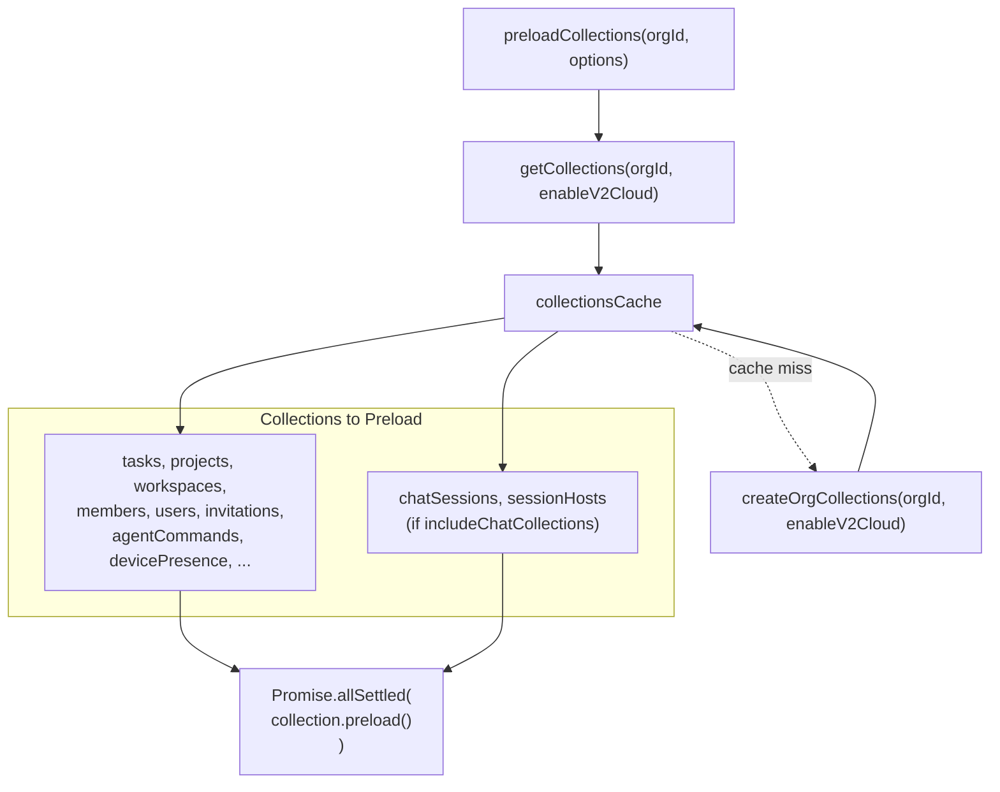
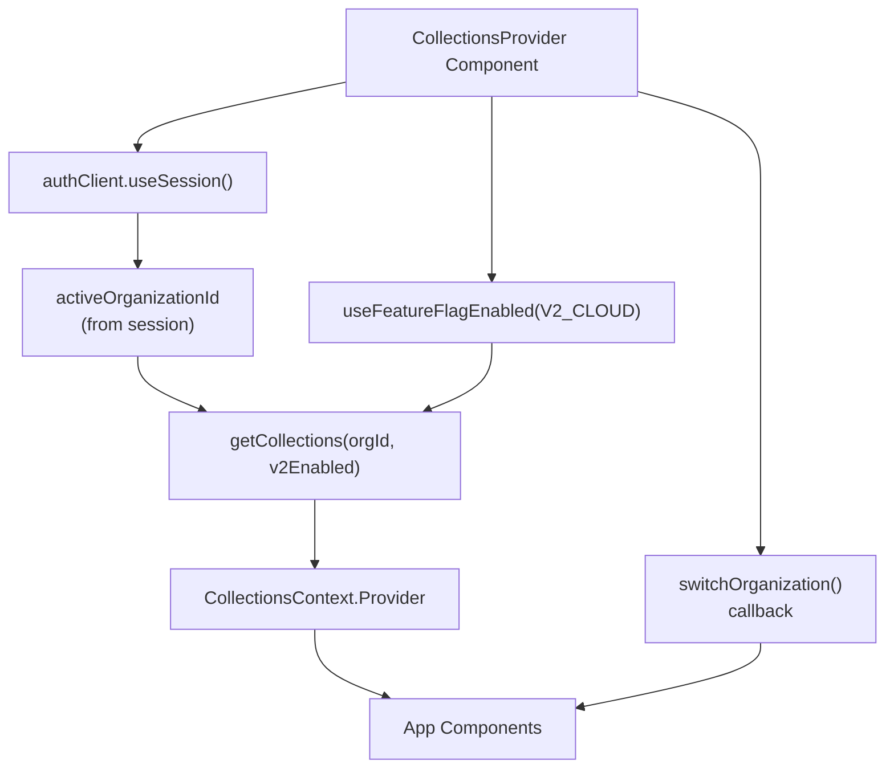

# ElectricSQL Collections

<details>
<summary>Relevant source files</summary>

The following files were used as context for generating this wiki page:

- [.github/templates/cleanup-comment.md](.github/templates/cleanup-comment.md)
- [.github/templates/preview-comment.md](.github/templates/preview-comment.md)
- [.github/workflows/ci.yml](.github/workflows/ci.yml)
- [.github/workflows/cleanup-preview.yml](.github/workflows/cleanup-preview.yml)
- [.github/workflows/deploy-preview.yml](.github/workflows/deploy-preview.yml)
- [.github/workflows/deploy-production.yml](.github/workflows/deploy-production.yml)
- [apps/admin/src/trpc/react.tsx](apps/admin/src/trpc/react.tsx)
- [apps/api/package.json](apps/api/package.json)
- [apps/api/src/app/api/electric/[...path]/route.ts](apps/api/src/app/api/electric/[...path]/route.ts)
- [apps/api/src/app/api/electric/[...path]/utils.ts](apps/api/src/app/api/electric/[...path]/utils.ts)
- [apps/api/src/env.ts](apps/api/src/env.ts)
- [apps/api/src/proxy.ts](apps/api/src/proxy.ts)
- [apps/api/src/trpc/context.ts](apps/api/src/trpc/context.ts)
- [apps/desktop/src/renderer/routes/_authenticated/providers/CollectionsProvider/CollectionsProvider.tsx](apps/desktop/src/renderer/routes/_authenticated/providers/CollectionsProvider/CollectionsProvider.tsx)
- [apps/desktop/src/renderer/routes/_authenticated/providers/CollectionsProvider/collections.ts](apps/desktop/src/renderer/routes/_authenticated/providers/CollectionsProvider/collections.ts)
- [apps/web/src/trpc/react.tsx](apps/web/src/trpc/react.tsx)
- [fly.toml](fly.toml)

</details>


ElectricSQL Collections provide real-time data synchronization between the desktop application's renderer process and the cloud PostgreSQL database via ElectricSQL shape streams. This system enables organization-scoped data access with automatic caching, row-level security, and optimistic consistency for mutations.

For local-only data access patterns (settings, tabs), see [Local Database Access](#2.10.2). For the backend ElectricSQL infrastructure and deployment, see [ElectricSQL Synchronization](#3.2).

---

## Architecture Overview

Collections are built on top of TanStack React DB's `Collection` abstraction with ElectricSQL as the synchronization backend. Each collection represents a table in the cloud database, filtered to a specific organization and automatically kept in sync via HTTP shape streams.

### High-Level Data Flow



**Sources:** [apps/desktop/src/renderer/routes/_authenticated/providers/CollectionsProvider/collections.ts:1-675](), [apps/desktop/src/renderer/routes/_authenticated/providers/CollectionsProvider/CollectionsProvider.tsx:1-93]()

---

## Collection Types and Schema

Each organization's collections are defined in the `OrgCollections` interface, representing synchronized tables from the cloud database.

### Collection Definitions

| Collection Name | Type | Table Name | Key Field | Mutations |
|----------------|------|------------|-----------|-----------|
| `tasks` | `Collection<SelectTask>` | `tasks` | `id` | Create, Update, Delete |
| `taskStatuses` | `Collection<SelectTaskStatus>` | `task_statuses` | `id` | Read-only |
| `projects` | `Collection<SelectProject>` | `projects` | `id` | Read-only |
| `workspaces` | `Collection<SelectWorkspace>` | `workspaces` | `id` | Read-only |
| `members` | `Collection<SelectMember>` | `auth.members` | `id` | Read-only |
| `users` | `Collection<SelectUser>` | `auth.users` | `id` | Read-only |
| `invitations` | `Collection<SelectInvitation>` | `auth.invitations` | `id` | Read-only |
| `agentCommands` | `Collection<SelectAgentCommand>` | `agent_commands` | `id` | Update |
| `devicePresence` | `Collection<SelectDevicePresence>` | `device_presence` | `id` | Read-only |
| `integrationConnections` | `Collection<IntegrationConnectionDisplay>` | `integration_connections` | `id` | Read-only |
| `subscriptions` | `Collection<SelectSubscription>` | `subscriptions` | `id` | Read-only |
| `apiKeys` | `Collection<ApiKeyDisplay>` | `auth.apikeys` | `id` | Read-only |
| `chatSessions` | `Collection<SelectChatSession>` | `chat_sessions` | `id` | Read-only |
| `sessionHosts` | `Collection<SelectSessionHost>` | `session_hosts` | `id` | Read-only |
| `githubRepositories` | `Collection<SelectGithubRepository>` | `github_repositories` | `id` | Read-only |
| `githubPullRequests` | `Collection<SelectGithubPullRequest>` | `github_pull_requests` | `id` | Read-only |

### V2 Cloud Collections

When the `V2_CLOUD` feature flag is enabled, additional collections are created for the new cloud architecture:

| Collection Name | Type | Table Name | Conditional |
|----------------|------|------------|-------------|
| `v2Projects` | `Collection<SelectV2Project>` | `v2_projects` | `enableV2Cloud` |
| `v2Devices` | `Collection<SelectV2Device>` | `v2_devices` | `enableV2Cloud` |
| `v2DevicePresence` | `Collection<SelectV2DevicePresence>` | `v2_device_presence` | `enableV2Cloud` |
| `v2UsersDevices` | `Collection<SelectV2UsersDevices>` | `v2_users_devices` | `enableV2Cloud` |
| `v2Workspaces` | `Collection<SelectV2Workspace>` | `v2_workspaces` | `enableV2Cloud` |

**Sources:** [apps/desktop/src/renderer/routes/_authenticated/providers/CollectionsProvider/collections.ts:69-112](), [apps/desktop/src/renderer/routes/_authenticated/providers/CollectionsProvider/collections.ts:241-344]()

---

## Collection Creation and Configuration

Collections are created using `electricCollectionOptions` which configures TanStack React DB with ElectricSQL-specific settings.

### Collection Creation Pattern



### Example: Tasks Collection

```typescript
// Simplified from collections.ts
const tasks = createCollection(
  electricCollectionOptions<SelectTask>({
    id: `tasks-${organizationId}`,
    shapeOptions: {
      url: electricUrl,                     // Electric shape endpoint
      params: {
        table: "tasks",
        organizationId,                     // Row-level security param
      },
      headers: electricHeaders,             // Dynamic auth token
      columnMapper,                         // snake_case conversion
    },
    getKey: (item) => item.id,
    onInsert: async ({ transaction }) => {
      const item = transaction.mutations[0].modified;
      const result = await apiClient.task.create.mutate(item);
      return { txid: result.txid };         // Fast-forward to this txid
    },
    // ... onUpdate, onDelete handlers
  }),
);
```

**Key Configuration Elements:**

- **`id`**: Unique identifier per collection per organization (e.g., `tasks-org123`)
- **`url`**: Points to `${NEXT_PUBLIC_ELECTRIC_URL}/v1/shape`
- **`params.table`**: Database table name to subscribe to
- **`params.organizationId`**: Filter parameter for row-level security
- **`headers.Authorization`**: Dynamic function that reads current JWT via `getJwt()`
- **`columnMapper`**: Converts PostgreSQL `snake_case` to JavaScript `camelCase`
- **`getKey`**: Extracts primary key for collection indexing

**Sources:** [apps/desktop/src/renderer/routes/_authenticated/providers/CollectionsProvider/collections.ts:175-207](), [apps/desktop/src/renderer/routes/_authenticated/providers/CollectionsProvider/collections.ts:50-52]()

---

## Shape Subscription and Sync Flow

Each collection subscribes to an ElectricSQL "shape" – a filtered, real-time stream of table changes.

### Shape Request Flow



**Sources:** [apps/api/src/app/api/electric/[...path]/route.ts:34-104](), [apps/api/src/app/api/electric/[...path]/utils.ts:69-195]()

---

## Authentication and Row-Level Security

The API proxy at `/api/electric/[...path]` enforces authentication and builds WHERE clauses to restrict data access based on organization membership.

### Authentication Flow

The `authenticate()` function supports two authentication methods:

1. **JWT Token** (preferred for desktop app):
   - Reads `Authorization: Bearer <token>` header
   - Verifies JWT using `auth.api.verifyJWT()`
   - Extracts `userId` and `organizationIds` from payload

2. **Session Cookie** (fallback):
   - Calls `auth.api.getSession()` with request headers
   - Retrieves session data from cookie-based authentication

**Sources:** [apps/api/src/app/api/electric/[...path]/route.ts:11-32]()

### Row-Level Security Implementation

The `buildWhereClause()` function constructs SQL WHERE predicates based on the table name:



**Example WHERE Clauses:**

- **Standard tables** (`tasks`, `projects`, etc.): `"organization_id" = $1`
- **`auth.organizations`**: `"id" IN ($1, $2, ...)` (all orgs user is a member of)
- **`auth.users`**: `$1 = ANY("organization_ids")` (users in the organization)
- **`auth.apikeys`**: `"metadata" LIKE '%"organizationId":"' || $1 || '"%'`

**Column Filtering:**

Some tables expose only specific columns to prevent leaking sensitive data:

- **`auth.apikeys`**: Only exposes `id`, `name`, `start`, `created_at`, `last_request` (excludes full token hash)
- **`integration_connections`**: Excludes `access_token` and `refresh_token` fields

**Sources:** [apps/api/src/app/api/electric/[...path]/utils.ts:69-195](), [apps/api/src/app/api/electric/[...path]/route.ts:62-89]()

---

## Organization-Based Collection Caching

Collections are cached per organization to enable instant switching without re-establishing sync connections.

### Cache Structure



### Cache Key Generation

The cache key combines `organizationId` and the `enableV2Cloud` feature flag:

```typescript
function getCollectionsCacheKey(organizationId: string, enableV2Cloud: boolean): string {
  return `${organizationId}:${enableV2Cloud ? "v2" : "legacy"}`;
}
```

This means:
- Same organization with different feature flag settings gets separate cache entries
- Collections persist in memory across organization switches
- Preloading populates the cache before switching

**Sources:** [apps/desktop/src/renderer/routes/_authenticated/providers/CollectionsProvider/collections.ts:114-122](), [apps/desktop/src/renderer/routes/_authenticated/providers/CollectionsProvider/collections.ts:652-672]()

---

## Mutations and Transaction ID Fast-Forward

Collections support optimistic mutations with server-side validation. After a successful mutation, ElectricSQL uses the returned `txid` to fast-forward the client's stream position.

### Mutation Flow



### Mutation Handler Examples

**Insert Handler (Tasks):**

```typescript
onInsert: async ({ transaction }) => {
  const item = transaction.mutations[0].modified;
  const result = await apiClient.task.create.mutate(item);
  return { txid: result.txid };  // Electric fast-forwards to this point
},
```

**Update Handler (Agent Commands):**

```typescript
onUpdate: async ({ transaction }) => {
  const { original, changes } = transaction.mutations[0];
  const result = await apiClient.agent.updateCommand.mutate({
    ...changes,
    id: original.id,
  });
  return { txid: result.txid };
},
```

**Delete Handler (Tasks):**

```typescript
onDelete: async ({ transaction }) => {
  const item = transaction.mutations[0].original;
  const result = await apiClient.task.delete.mutate(item.id);
  return { txid: result.txid };
},
```

**Fast-Forward Mechanism:**

When a mutation returns a `txid`, ElectricSQL uses it to skip ahead in the shape stream. This ensures:
- The client doesn't process its own change twice
- The client sees the server's canonical version of the data
- Conflicts are resolved server-side

**Read-Only Collections:**

Collections without mutation handlers are read-only. Changes must be made through other means (e.g., backend processes, admin panels).

**Sources:** [apps/desktop/src/renderer/routes/_authenticated/providers/CollectionsProvider/collections.ts:188-205](), [apps/desktop/src/renderer/routes/_authenticated/providers/CollectionsProvider/collections.ts:423-430]()

---

## Collection Lifecycle and Preloading

Collections are lazy by default – they don't establish connections until subscribed to or explicitly preloaded.

### Preloading Strategy



### Preload Timing

**On Organization Change:**

```typescript
// In CollectionsProvider
useEffect(() => {
  preloadActiveOrganizationCollections(
    activeOrganizationId,
    isV2CloudEnabled,
  );
}, [activeOrganizationId, isV2CloudEnabled]);
```

**Before Switching Organizations:**

```typescript
const switchOrganization = async (organizationId: string) => {
  setIsSwitching(true);
  await authClient.organization.setActive({ organizationId });
  await preloadCollections(organizationId, { enableV2Cloud: isV2CloudEnabled });
  await refetchSession();
  setIsSwitching(false);
};
```

### Collection Lifecycle Phases

1. **Creation**: Collections are created when `getCollections()` is called for a new org
2. **Preloading**: `preload()` initiates the shape stream subscription
3. **Active**: Collections receive real-time updates via HTTP streaming
4. **Cached**: Collections remain in memory when switching to another org
5. **Reactivation**: Returning to a cached org reuses existing connections

**Chat Collections Exception:**

Chat-related collections (`chatSessions`, `sessionHosts`) can be excluded from preloading to reduce initial load time:

```typescript
await preloadCollections(organizationId, {
  includeChatCollections: false,  // Skip chat collections
  enableV2Cloud: true,
});
```

**Sources:** [apps/desktop/src/renderer/routes/_authenticated/providers/CollectionsProvider/collections.ts:617-645](), [apps/desktop/src/renderer/routes/_authenticated/providers/CollectionsProvider/CollectionsProvider.tsx:22-69]()

---

## Disabled Collections Pattern

When feature flags disable certain functionality (e.g., V2 cloud), collections are created as local-only stubs to prevent errors.

### Disabled Collection Creation

```typescript
function createDisabledCollection<T extends object, TKey extends string | number>(
  id: string,
  getKey: (item: T) => TKey
): Collection<T> {
  return createCollection(
    localOnlyCollectionOptions({
      id,
      getKey,
      initialData: [],  // Always empty
    }),
  ) as unknown as Collection<T>;
}
```

**Usage Example:**

```typescript
const v2Projects = enableV2Cloud
  ? createCollection(electricCollectionOptions({ /* ... */ }))
  : createDisabledCollection<SelectV2Project, string>(
      `v2_projects-disabled-${organizationId}`,
      (item) => item.id,
    );
```

This pattern ensures:
- Components can always reference `collections.v2Projects` without null checks
- Disabled collections return empty arrays
- No network requests are made for disabled features

**Sources:** [apps/desktop/src/renderer/routes/_authenticated/providers/CollectionsProvider/collections.ts:124-135](), [apps/desktop/src/renderer/routes/_authenticated/providers/CollectionsProvider/collections.ts:241-260]()

---

## CollectionsProvider React Context

The `CollectionsProvider` component wraps the authenticated app and provides collections access via React Context.

### Provider Structure



### Context Value

```typescript
interface CollectionsContextType {
  // All organization collections
  tasks: Collection<SelectTask>;
  projects: Collection<SelectProject>;
  workspaces: Collection<SelectWorkspace>;
  // ... other collections
  
  // Global collection (not org-scoped)
  organizations: Collection<SelectOrganization>;
  
  // Organization switcher
  switchOrganization: (organizationId: string) => Promise<void>;
}
```

### Usage in Components

```typescript
import { useCollections } from './CollectionsProvider';

function MyComponent() {
  const { tasks, projects, switchOrganization } = useCollections();
  
  // Subscribe to collection
  const allTasks = tasks.useAll();
  const firstProject = projects.useOne((p) => p.id === 'project-123');
  
  // Switch organization
  await switchOrganization('org-456');
}
```

**Sources:** [apps/desktop/src/renderer/routes/_authenticated/providers/CollectionsProvider/CollectionsProvider.tsx:1-93](), [apps/desktop/src/renderer/routes/_authenticated/providers/CollectionsProvider/collections.ts:669-674]()

---

## Environment Configuration

Collections rely on environment variables for ElectricSQL connectivity and authentication.

### Required Environment Variables

| Variable | Purpose | Example |
|----------|---------|---------|
| `NEXT_PUBLIC_ELECTRIC_URL` | Electric API endpoint (proxied through API) | `https://api.superset.com/api/electric` |
| `NEXT_PUBLIC_API_URL` | tRPC API base URL | `https://api.superset.com` |
| `ELECTRIC_URL` | Direct Electric server URL (API-side) | `https://superset-electric.fly.dev` |
| `ELECTRIC_SECRET` | Electric server authentication secret | `(secret token)` |

### Construction of Electric URL

```typescript
// In collections.ts (renderer)
const electricUrl = `${env.NEXT_PUBLIC_ELECTRIC_URL}/v1/shape`;
// Results in: https://api.superset.com/api/electric/v1/shape
```

The desktop app never connects directly to the Electric server. All requests flow through the API proxy for security.

**Sources:** [apps/desktop/src/renderer/routes/_authenticated/providers/CollectionsProvider/collections.ts:52](), [apps/api/src/env.ts:13-14](), [apps/api/src/app/api/electric/[...path]/route.ts:48]()

---

## Special Collections

### Organizations Collection

Unlike org-scoped collections, the `organizations` collection is global and filters to show only organizations the user is a member of:

```typescript
const organizationsCollection = createCollection(
  electricCollectionOptions<SelectOrganization>({
    id: "organizations",
    shapeOptions: {
      url: electricUrl,
      params: { table: "auth.organizations" },  // No organizationId param
      headers: electricHeaders,
      columnMapper,
    },
    getKey: (item) => item.id,
  }),
);
```

The API proxy handles the filtering by querying the user's memberships and building an `IN` clause.

**Sources:** [apps/desktop/src/renderer/routes/_authenticated/providers/CollectionsProvider/collections.ts:158-169](), [apps/api/src/app/api/electric/[...path]/utils.ts:113-137]()

### Local Storage Collections

Some collections use `localStorageCollectionOptions` instead of `electricCollectionOptions` to persist UI state locally:

- **`v2SidebarProjects`**: Sidebar project expansion state
- **`v2SidebarWorkspaces`**: Sidebar workspace organization
- **`v2SidebarSections`**: Sidebar custom sections

These collections are not synced across devices and exist only for UI preferences.

**Sources:** [apps/desktop/src/renderer/routes/_authenticated/providers/CollectionsProvider/collections.ts:562-587]()