# Data Synchronization

<details>
<summary>Relevant source files</summary>

The following files were used as context for generating this wiki page:

- [.github/templates/cleanup-comment.md](.github/templates/cleanup-comment.md)
- [.github/templates/preview-comment.md](.github/templates/preview-comment.md)
- [.github/workflows/ci.yml](.github/workflows/ci.yml)
- [.github/workflows/cleanup-preview.yml](.github/workflows/cleanup-preview.yml)
- [.github/workflows/deploy-preview.yml](.github/workflows/deploy-preview.yml)
- [.github/workflows/deploy-production.yml](.github/workflows/deploy-production.yml)
- [apps/admin/src/trpc/react.tsx](apps/admin/src/trpc/react.tsx)
- [apps/api/package.json](apps/api/package.json)
- [apps/api/src/app/api/electric/[...path]/route.ts](apps/api/src/app/api/electric/[...path]/route.ts)
- [apps/api/src/app/api/electric/[...path]/utils.ts](apps/api/src/app/api/electric/[...path]/utils.ts)
- [apps/api/src/env.ts](apps/api/src/env.ts)
- [apps/api/src/proxy.ts](apps/api/src/proxy.ts)
- [apps/api/src/trpc/context.ts](apps/api/src/trpc/context.ts)
- [apps/desktop/src/renderer/routes/_authenticated/providers/CollectionsProvider/CollectionsProvider.tsx](apps/desktop/src/renderer/routes/_authenticated/providers/CollectionsProvider/CollectionsProvider.tsx)
- [apps/desktop/src/renderer/routes/_authenticated/providers/CollectionsProvider/collections.ts](apps/desktop/src/renderer/routes/_authenticated/providers/CollectionsProvider/collections.ts)
- [apps/web/src/trpc/react.tsx](apps/web/src/trpc/react.tsx)
- [fly.toml](fly.toml)

</details>


This document describes the data synchronization architecture that enables real-time data sharing between the Desktop application's local SQLite database and the cloud Neon PostgreSQL database. The system uses ElectricSQL for bidirectional sync with organization-based row-level security and optimistic consistency guarantees.

For information about the local database schema and migrations, see [Local Database Access](#2.10.2). For details on how Collections are integrated into the React component tree, see [ElectricSQL Collections](#2.10.1).

## Architecture Overview

The Superset data layer uses a hybrid architecture with three distinct data storage tiers:

| Storage Tier | Technology | Purpose | Access Pattern |
|-------------|------------|---------|----------------|
| **Cloud Database** | Neon PostgreSQL | Source of truth for organization data | API server queries via Drizzle ORM |
| **Sync Layer** | ElectricSQL (Fly.io) | Real-time replication | HTTP Shape streams |
| **Local Database** | SQLite via Drizzle | Desktop app local data | Direct SQL queries |

### Data Synchronization Architecture

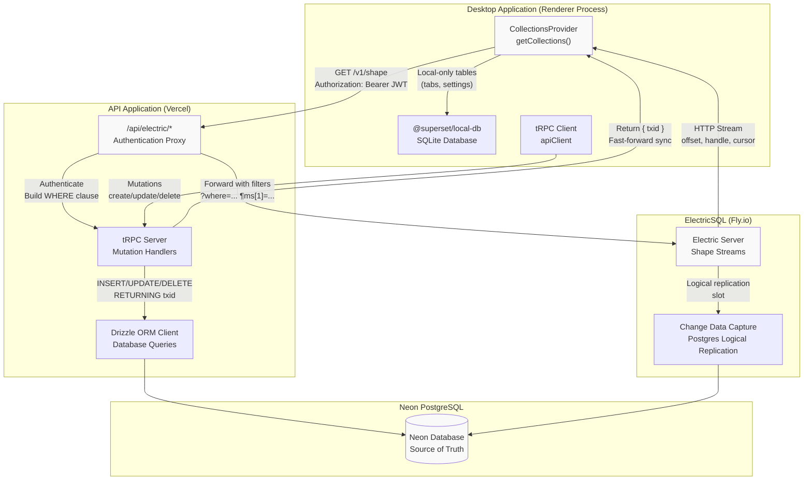

**Sources:** [apps/desktop/src/renderer/routes/_authenticated/providers/CollectionsProvider/collections.ts:1-673](), [apps/api/src/app/api/electric/[...path]/route.ts:1-105](), [fly.toml:1-33]()

## ElectricSQL Collections

The Desktop app uses `@tanstack/react-db` collections backed by ElectricSQL for cloud-synced data. Collections are created per-organization and cached for instant switching between organizations.

### Collection Creation and Caching

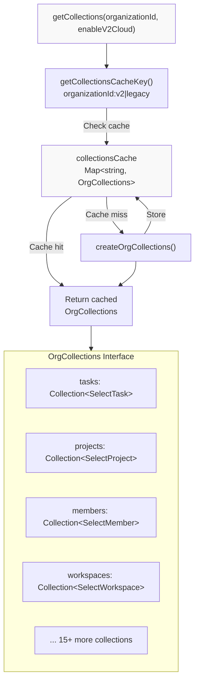

**Sources:** [apps/desktop/src/renderer/routes/_authenticated/providers/CollectionsProvider/collections.ts:114-122](), [apps/desktop/src/renderer/routes/_authenticated/providers/CollectionsProvider/collections.ts:171-615](), [apps/desktop/src/renderer/routes/_authenticated/providers/CollectionsProvider/collections.ts:652-672]()

### Electric Collection Configuration

Each collection is configured with `electricCollectionOptions` that specify:

| Option | Purpose | Example |
|--------|---------|---------|
| `id` | Unique collection identifier | `tasks-${organizationId}` |
| `shapeOptions.url` | Electric shape endpoint | `${ELECTRIC_URL}/v1/shape` |
| `shapeOptions.params` | Table and filters | `{ table: "tasks", organizationId }` |
| `shapeOptions.headers` | Authorization | `Authorization: Bearer ${jwt}` |
| `shapeOptions.columnMapper` | Snake-to-camel conversion | `snakeCamelMapper()` |
| `getKey` | Row identifier function | `(item) => item.id` |
| `onInsert/onUpdate/onDelete` | Mutation handlers | Calls tRPC, returns `{ txid }` |

**Example Collection Definition:**

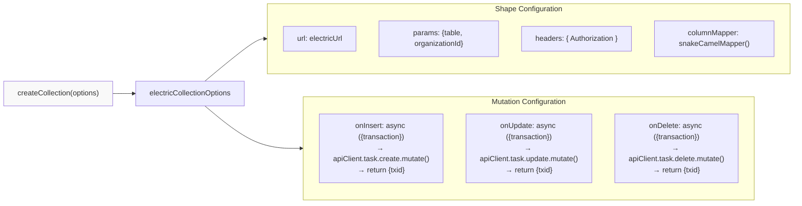

**Sources:** [apps/desktop/src/renderer/routes/_authenticated/providers/CollectionsProvider/collections.ts:175-207](), [apps/desktop/src/renderer/routes/_authenticated/providers/CollectionsProvider/collections.ts:50-52]()

### Local-Only vs Synced Collections

The system distinguishes between two types of collections:

**Cloud-Synced Collections:**
- Use `electricCollectionOptions` with shape subscriptions
- Examples: `tasks`, `projects`, `workspaces`, `members`
- Automatically sync with Neon database via Electric

**Local-Only Collections:**
- Use `localStorageCollectionOptions` or `localOnlyCollectionOptions`
- Examples: `v2SidebarProjects`, `v2SidebarWorkspaces`, `v2SidebarSections`
- Stored in browser localStorage, not synced to cloud
- Used for UI state that should persist locally

**V2 Cloud Feature Flag:**
- Collections like `v2Devices`, `v2Projects`, `v2Workspaces` are conditional
- When `enableV2Cloud` is false, they become disabled collections
- Disabled collections return empty data without making network requests

**Sources:** [apps/desktop/src/renderer/routes/_authenticated/providers/CollectionsProvider/collections.ts:124-135](), [apps/desktop/src/renderer/routes/_authenticated/providers/CollectionsProvider/collections.ts:241-260](), [apps/desktop/src/renderer/routes/_authenticated/providers/CollectionsProvider/collections.ts:562-587]()

## Authentication Proxy Layer

The Desktop app does not connect directly to the ElectricSQL server. Instead, all Electric requests go through the API's `/api/electric/*` proxy endpoint for authentication and row-level security.

### Electric Proxy Request Flow

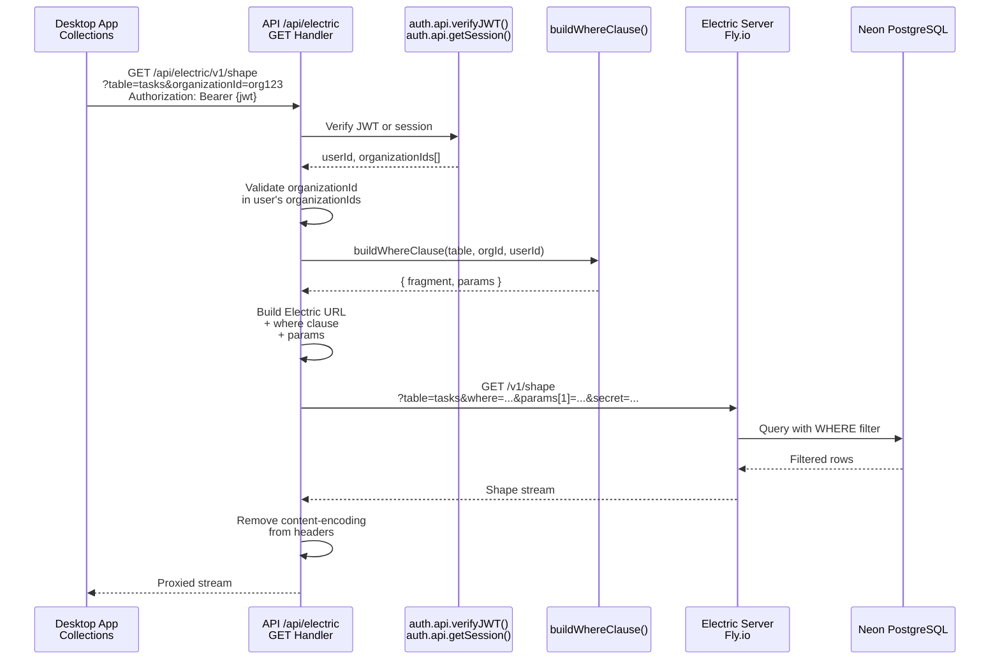

**Sources:** [apps/api/src/app/api/electric/[...path]/route.ts:34-104](), [apps/api/src/app/api/electric/[...path]/route.ts:11-32]()

### Authentication Methods

The proxy supports two authentication methods:

**1. JWT Token (Desktop App):**
- Header: `Authorization: Bearer {token}`
- Verified via `auth.api.verifyJWT()`
- Payload contains `sub` (userId) and `organizationIds` array

**2. Session Cookie (Web App):**
- Fallback if no Bearer token
- Verified via `auth.api.getSession()`
- Session contains `user.id` and `session.organizationIds`

**Sources:** [apps/api/src/app/api/electric/[...path]/route.ts:11-32]()

## Row-Level Security with WHERE Clauses

The proxy enforces organization-based row-level security by building SQL WHERE clauses that filter data to only what the user can access.

### WHERE Clause Construction

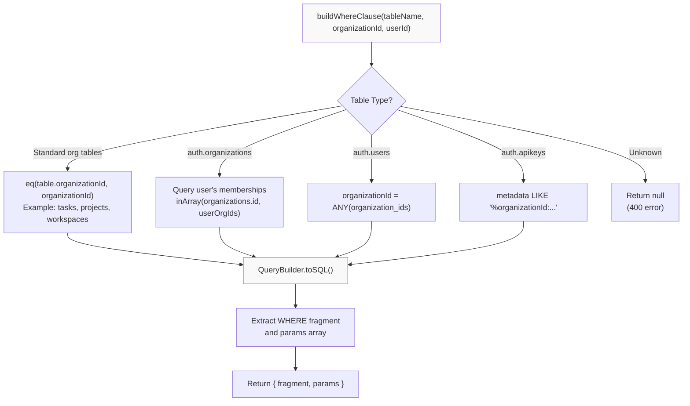

**Sources:** [apps/api/src/app/api/electric/[...path]/utils.ts:69-195]()

### Table-Specific Filters

| Table | Filter Logic | Code Reference |
|-------|-------------|----------------|
| `tasks` | `organization_id = $1` | [utils.ts:75-76]() |
| `projects` | `organization_id = $1` | [utils.ts:81-82]() |
| `auth.organizations` | `id IN (user's org IDs)` | [utils.ts:113-136]() |
| `auth.users` | `$1 = ANY(organization_ids)` | [utils.ts:139-142]() |
| `auth.apikeys` | `metadata LIKE '%"organizationId":"..."'` | [utils.ts:154-157]() |
| `integration_connections` | `organization_id = $1` | [utils.ts:159-164]() |

**Column Filtering:**

Some tables have sensitive columns removed via the `columns` parameter:

- `auth.apikeys`: Only returns `id,name,start,created_at,last_request` (excludes the actual API key)
- `integration_connections`: Excludes `access_token` and `refresh_token`

**Sources:** [apps/api/src/app/api/electric/[...path]/route.ts:77-89](), [apps/api/src/app/api/electric/[...path]/utils.ts:69-195]()

## Mutation Flow and Optimistic Updates

When users modify data through collections, mutations flow through tRPC to the API, which writes to Neon and returns a transaction ID for fast-forward sync.

### Mutation Flow Diagram

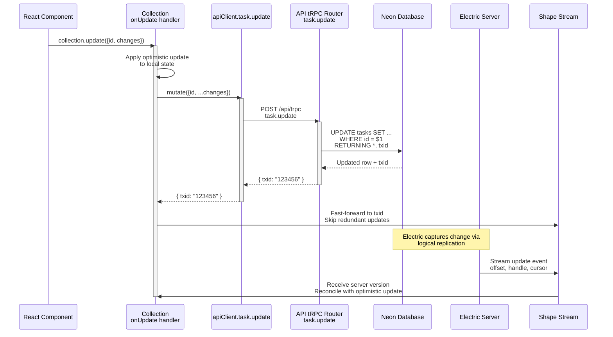

**Sources:** [apps/desktop/src/renderer/routes/_authenticated/providers/CollectionsProvider/collections.ts:188-205](), [apps/desktop/src/renderer/routes/_authenticated/providers/CollectionsProvider/collections.ts:423-431]()

### Transaction ID (txid) Fast-Forward

The mutation handlers return a `txid` from the database, which the Electric client uses to fast-forward its sync position:

1. **Client makes mutation** → Optimistic update applied locally
2. **API executes mutation** → Database returns `txid` (transaction ID)
3. **Client receives `txid`** → Collection fast-forwards to that point in stream
4. **Electric streams change** → Client already knows about it, skips redundant update

This prevents the "double update" problem where:
- Without txid: Client sees its own change echoed back from the server
- With txid: Client fast-forwards past its own change

**Sources:** [apps/desktop/src/renderer/routes/_authenticated/providers/CollectionsProvider/collections.ts:188-205]()

## Shape Streams and Sync Protocol

ElectricSQL uses a "shape" abstraction for subscribing to filtered subsets of tables. Each shape is a long-lived HTTP stream that delivers incremental updates.

### Shape Stream Headers

Electric returns metadata headers with each response:

| Header | Purpose | Example |
|--------|---------|---------|
| `electric-offset` | Current position in stream | `"12345"` |
| `electric-handle` | Shape handle for reconnection | `"abc123-def456"` |
| `electric-cursor` | Cursor for pagination | `"0_0"` |
| `electric-chunk-last-offset` | Last offset in chunk | `"12350"` |
| `electric-up-to-date` | Whether fully synced | `"true"` |

These headers are exposed via CORS configuration in the proxy.

**Sources:** [apps/api/src/proxy.ts:28-47]()

### Shape Request Parameters

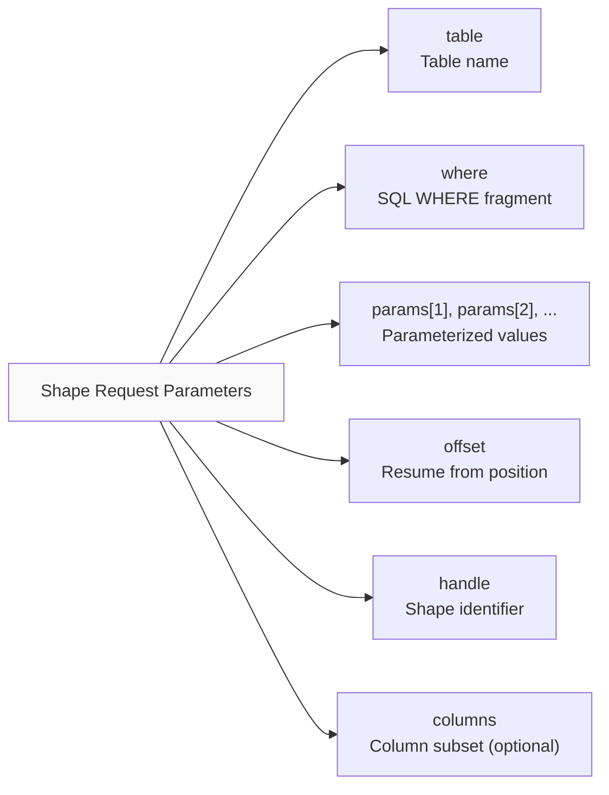

**Example Electric Request:**
```
GET /v1/shape
  ?table=tasks
  &where=organization_id = $1
  &params[1]=org_123xyz
  &offset=12345
  &handle=abc123-def456
  &secret=<ELECTRIC_SECRET>
```

**Sources:** [apps/api/src/app/api/electric/[...path]/route.ts:48-75]()

## Organization Switching and Collection Preloading

The system preloads collections for an organization before switching to it, ensuring instant UI updates when users change organizations.

### Collection Preloading Flow

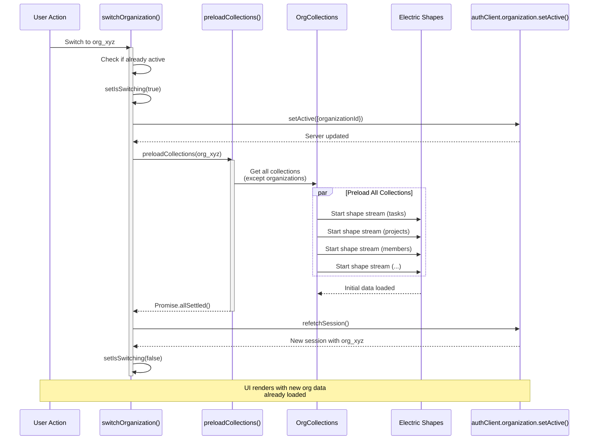

**Sources:** [apps/desktop/src/renderer/routes/_authenticated/providers/CollectionsProvider/CollectionsProvider.tsx:47-62](), [apps/desktop/src/renderer/routes/_authenticated/providers/CollectionsProvider/collections.ts:622-645]()

### Collections Cache Strategy

Collections are cached per organization to enable instant switching:

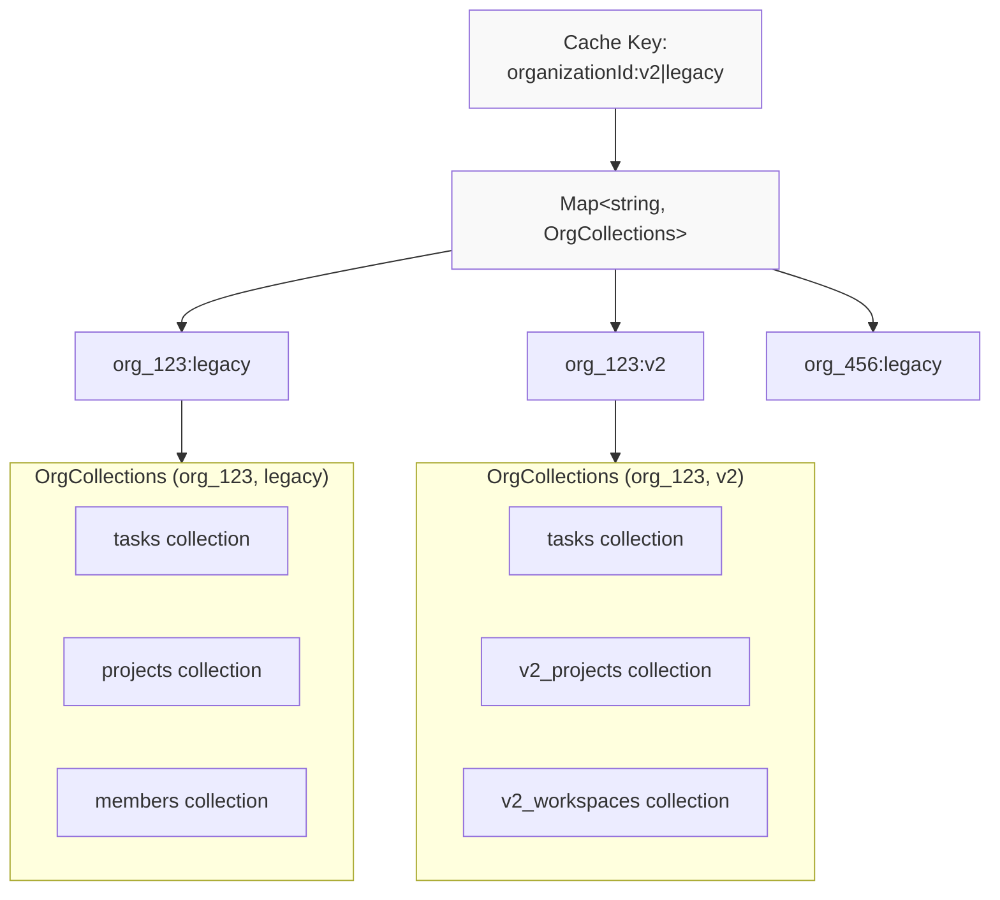

**Key Points:**
- Same organization can have different collections when v2 cloud flag changes
- Collections persist in memory across organization switches
- Switching back to a previously-viewed org is instant (no re-sync needed)

**Sources:** [apps/desktop/src/renderer/routes/_authenticated/providers/CollectionsProvider/collections.ts:114-122](), [apps/desktop/src/renderer/routes/_authenticated/providers/CollectionsProvider/collections.ts:652-672]()

## ElectricSQL Deployment

The ElectricSQL sync server runs as a separate service on Fly.io, independent of the API and database.

### Electric Server Configuration

The `fly.toml` configuration defines the Electric deployment:

| Setting | Value | Purpose |
|---------|-------|---------|
| **Image** | `electricsql/electric:1.4.13` | Official Electric Docker image |
| **Memory** | `8192mb` (8 GB) | Handle concurrent shape streams |
| **CPUs** | `4 performance` | Process change data efficiently |
| **Region** | `iad` (Virginia) | Co-located with Neon database |
| **Port** | `3000` | Internal HTTP service port |
| **Volume** | `/var/lib/electric` | Persistent storage for state |

**Environment Variables:**
- `DATABASE_URL`: Connection to Neon PostgreSQL (unpooled)
- `ELECTRIC_SECRET`: Secret for authenticated requests
- `ELECTRIC_DATABASE_USE_IPV6`: Enable IPv6 for Fly.io
- `ELECTRIC_MAX_CONCURRENT_REQUESTS`: `{"initial": 3000, "existing": 10000}`

**Sources:** [fly.toml:1-33]()

### Preview Environment Deployment

For pull request previews, the deployment workflow creates ephemeral Electric instances:

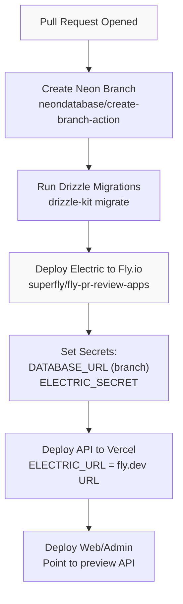

Each preview environment gets:
- Isolated Neon database branch
- Dedicated Electric Fly.io app (`superset-electric-pr-{number}`)
- Environment-specific Electric URL and secrets

**Cleanup:**
When the PR closes, the cleanup workflow deletes:
- Neon branch
- Electric Fly.io app

**Sources:** [.github/workflows/deploy-preview.yml:80-123](), [.github/workflows/cleanup-preview.yml:25-34]()

### Production Deployment

Production Electric deployment is separate from preview:

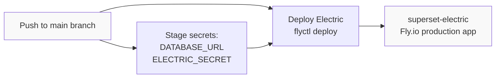

The production workflow:
1. Stages secrets via `flyctl secrets set --stage`
2. Deploys with `flyctl deploy --remote-only`
3. Fly.io performs rolling restart with new secrets

**Sources:** [.github/workflows/deploy-production.yml:442-467]()

## API Environment Variables

The API application requires several Electric-related environment variables:

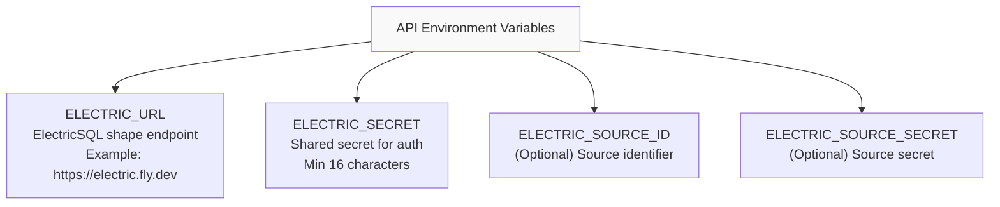

These are validated at startup via `@t3-oss/env-nextjs`:

**Sources:** [apps/api/src/env.ts:13-16](), [.github/workflows/deploy-preview.yml:206-208](), [.github/workflows/deploy-production.yml:111-112]()

## CORS Configuration for Electric Headers

The API proxy middleware configures CORS to expose Electric sync headers to the Desktop app:

**Exposed Headers:**
```
electric-offset
electric-handle
electric-schema
electric-cursor
electric-chunk-last-offset
electric-up-to-date
```

This allows the Electric client in the renderer to read sync metadata from responses.

**Sources:** [apps/api/src/proxy.ts:28-47]()