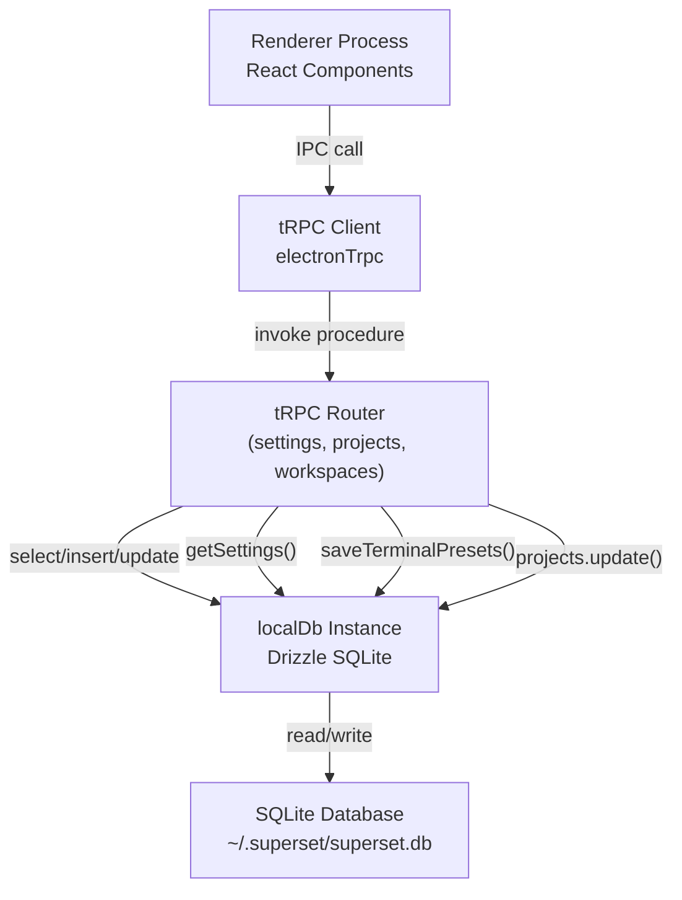
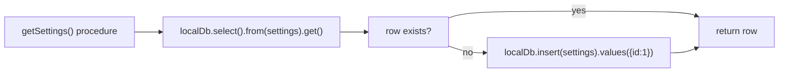
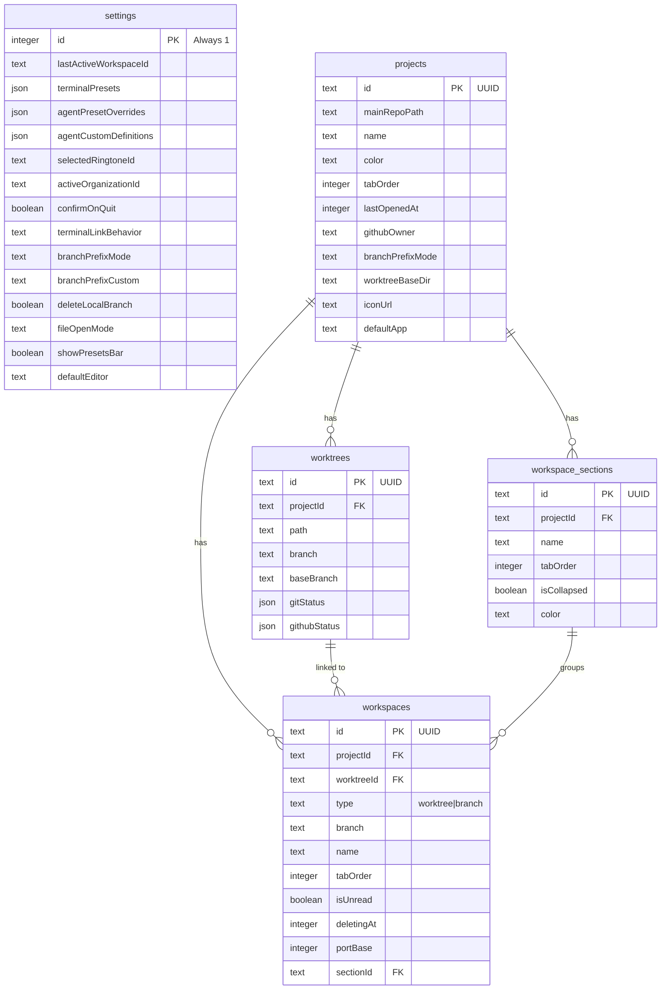
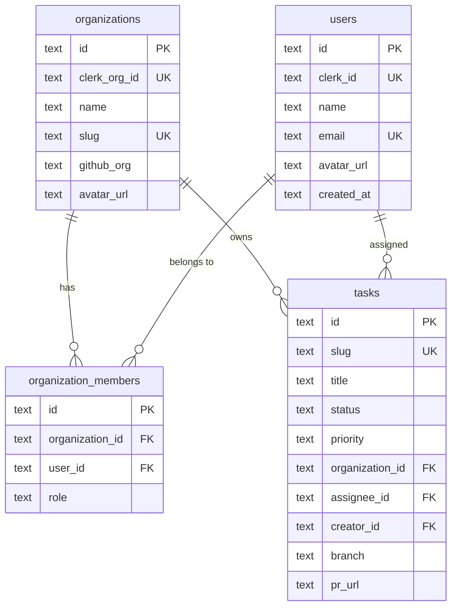
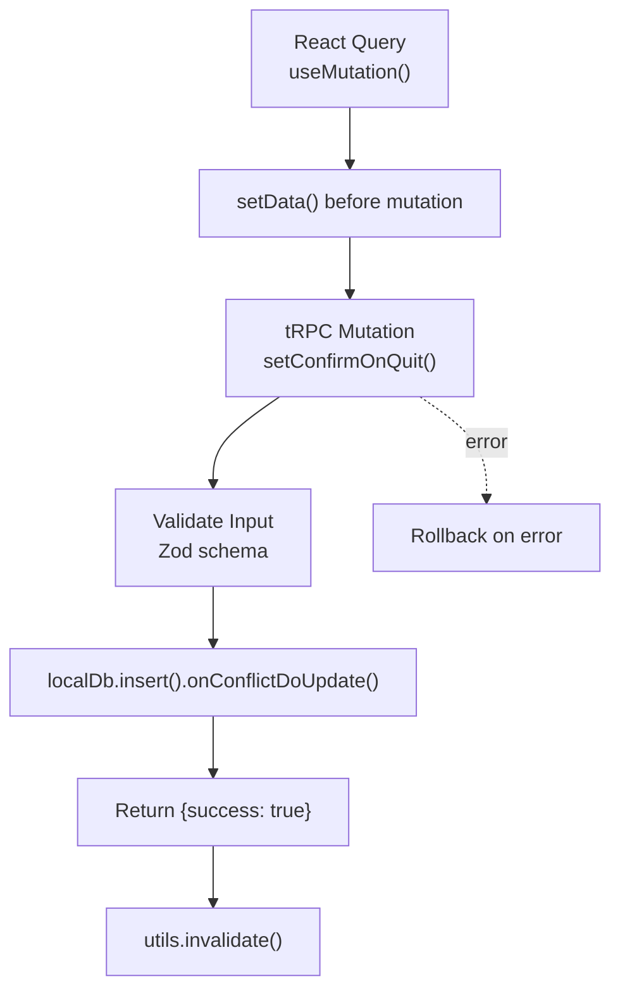
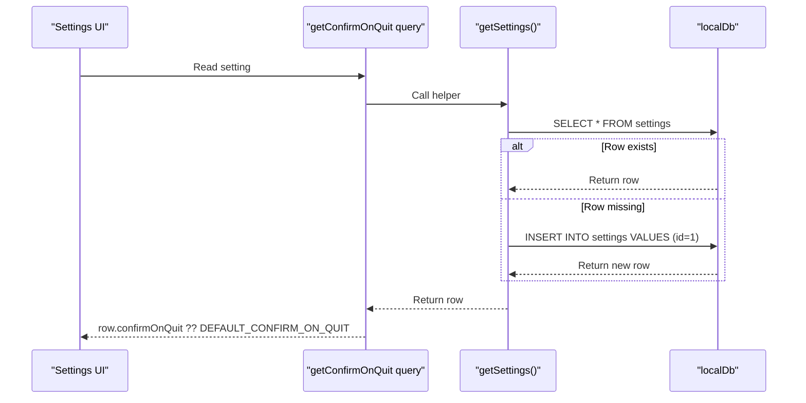
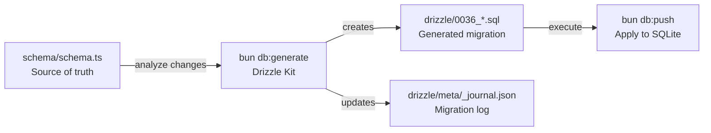
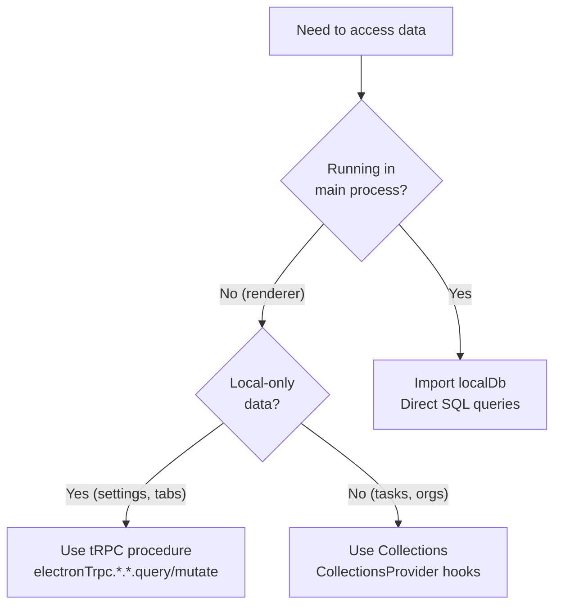
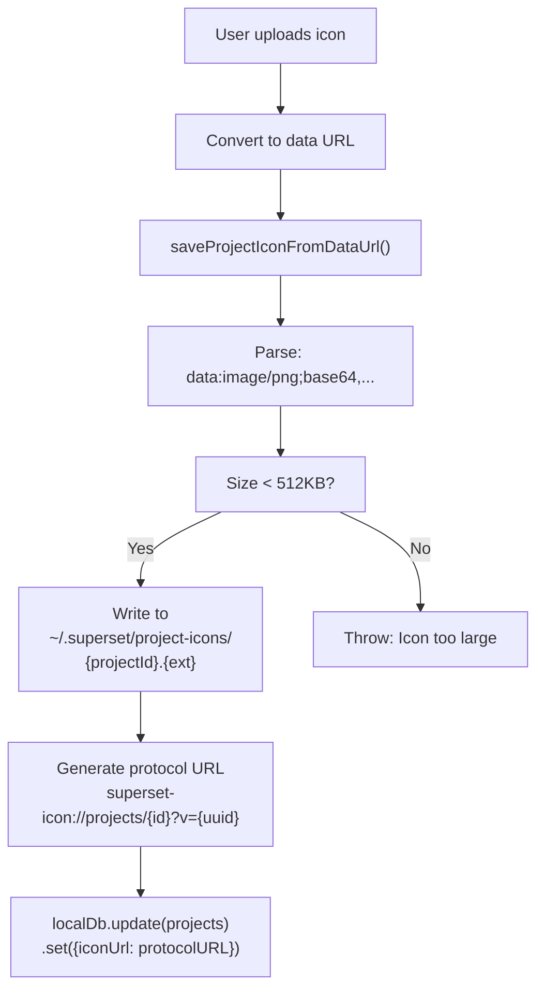

# Local Database Access

<details>
<summary>Relevant source files</summary>

The following files were used as context for generating this wiki page:

- [apps/desktop/src/lib/trpc/routers/projects/utils/favicon-discovery.ts](apps/desktop/src/lib/trpc/routers/projects/utils/favicon-discovery.ts)
- [apps/desktop/src/lib/trpc/routers/settings/index.ts](apps/desktop/src/lib/trpc/routers/settings/index.ts)
- [apps/desktop/src/main/lib/project-icons.ts](apps/desktop/src/main/lib/project-icons.ts)
- [apps/desktop/src/renderer/routes/_authenticated/settings/behavior/components/BehaviorSettings/BehaviorSettings.tsx](apps/desktop/src/renderer/routes/_authenticated/settings/behavior/components/BehaviorSettings/BehaviorSettings.tsx)
- [apps/desktop/src/renderer/routes/_authenticated/settings/project/$projectId/components/ProjectSettings/ProjectSettings.tsx](apps/desktop/src/renderer/routes/_authenticated/settings/project/$projectId/components/ProjectSettings/ProjectSettings.tsx)
- [apps/desktop/src/renderer/routes/_authenticated/settings/project/$projectId/general/page.tsx](apps/desktop/src/renderer/routes/_authenticated/settings/project/$projectId/general/page.tsx)
- [apps/desktop/src/renderer/routes/_authenticated/settings/utils/settings-search/settings-search.ts](apps/desktop/src/renderer/routes/_authenticated/settings/utils/settings-search/settings-search.ts)
- [apps/desktop/src/shared/constants.ts](apps/desktop/src/shared/constants.ts)
- [packages/local-db/drizzle/meta/_journal.json](packages/local-db/drizzle/meta/_journal.json)
- [packages/local-db/src/schema/schema.ts](packages/local-db/src/schema/schema.ts)

</details>


This page documents direct SQLite database access in the desktop application's main process, covering Drizzle ORM usage, schema organization, and common CRUD patterns for local-only data.

For information about cloud-synchronized data access, see [ElectricSQL Collections](#2.10.1). For the overall data synchronization architecture, see [Data Synchronization](#2.10).

---

## Overview and Architecture

The desktop application maintains a local SQLite database accessed exclusively from the main process via the `localDb` instance. This database stores both **local-only data** (tabs, settings, workspaces) and **synced table schemas** that mirror cloud data received via ElectricSQL.

**Key Characteristics:**
- **Process Boundary**: Only the main process accesses SQLite directly; renderer process uses tRPC procedures
- **ORM**: Drizzle ORM provides type-safe queries and schema management
- **Migration System**: 36+ migrations tracked via Drizzle Kit
- **Dual Purpose**: Stores both local-only state and cached cloud data

### LocalDB Access Flow



Sources: [apps/desktop/src/lib/trpc/routers/settings/index.ts:1-814](), [packages/local-db/src/schema/schema.ts:1-384]()

---

## The localDb Instance

The `localDb` instance is a Drizzle database client configured for SQLite, imported throughout the main process codebase as the primary database access point.

### Import Pattern

```typescript
import { localDb } from "main/lib/local-db";
```

All tRPC routers and main process modules import this singleton instance. It provides type-safe query builders that return synchronous results (SQLite is always local, no async needed for queries).

### Drizzle ORM Query Patterns

**Select Query:**
```typescript
const row = localDb.select().from(settings).get();
```

**Insert with Conflict Resolution (Upsert):**
```typescript
localDb
  .insert(settings)
  .values({ id: 1, terminalPresets: presets })
  .onConflictDoUpdate({
    target: settings.id,
    set: { terminalPresets: presets },
  })
  .run();
```

**Update with Where Clause:**
```typescript
localDb
  .update(projects)
  .set({ lastOpenedAt: Date.now() })
  .where(eq(projects.id, projectId))
  .run();
```

Sources: [apps/desktop/src/lib/trpc/routers/settings/index.ts:73-104]()

### Table Access Flow from tRPC



Sources: [apps/desktop/src/lib/trpc/routers/settings/index.ts:73-79]()

---

## Schema Organization

The SQLite schema is organized into two categories: local-only tables managed exclusively by the desktop app, and synced tables that mirror cloud PostgreSQL schemas.

### Table Categories

| Category | Tables | Purpose | Managed By |
|----------|--------|---------|------------|
| **Local-Only** | `settings`, `projects`, `worktrees`, `workspaces`, `workspace_sections`, `browser_history` | Desktop app state, user preferences, local workspace tracking | Desktop app only |
| **Synced** | `users`, `organizations`, `organization_members`, `tasks` | Cloud data replicated via ElectricSQL | ElectricSQL sync engine |

### Local-Only Tables Schema



Sources: [packages/local-db/src/schema/schema.ts:20-223]()

### Synced Tables Schema

Synced tables use snake_case column names matching PostgreSQL exactly, allowing ElectricSQL to write data directly without transformation:



Sources: [packages/local-db/src/schema/schema.ts:224-357]()

---

## Common Access Patterns

### Pattern 1: Upsert with Single-Row Tables

The `settings` table uses a single-row pattern where all settings are stored in one row with `id=1`. Updates use `onConflictDoUpdate` to merge changes:

```typescript
function getSettings() {
  let row = localDb.select().from(settings).get();
  if (!row) {
    row = localDb.insert(settings).values({ id: 1 }).returning().get();
  }
  return row;
}

// Update specific columns
localDb
  .insert(settings)
  .values({ id: 1, confirmOnQuit: true })
  .onConflictDoUpdate({
    target: settings.id,
    set: { confirmOnQuit: true },
  })
  .run();
```

This pattern ensures settings always exist and individual columns can be updated atomically without reading first.

Sources: [apps/desktop/src/lib/trpc/routers/settings/index.ts:73-79](), [apps/desktop/src/lib/trpc/routers/settings/index.ts:476-486]()

### Pattern 2: JSON Column Storage

Complex objects are stored as JSON columns with type safety via Drizzle's `$type<T>()`:

```typescript
// Schema definition
terminalPresets: text("terminal_presets", { mode: "json" })
  .$type<TerminalPreset[]>()

// Reading
const presets = getSettings().terminalPresets ?? [];

// Writing
function saveTerminalPresets(presets: TerminalPreset[]) {
  localDb
    .insert(settings)
    .values({ id: 1, terminalPresets: presets })
    .onConflictDoUpdate({
      target: settings.id,
      set: { terminalPresets: presets },
    })
    .run();
}
```

JSON columns are used for: `terminalPresets`, `agentPresetOverrides`, `agentCustomDefinitions`, `gitStatus`, `githubStatus`, `labels`.

Sources: [apps/desktop/src/lib/trpc/routers/settings/index.ts:81-104](), [packages/local-db/src/schema/schema.ts:176-187]()

### Pattern 3: Optimistic Updates in tRPC

tRPC mutations use optimistic updates by setting data immediately and rolling back on error:

```typescript
setConfirmOnQuit: publicProcedure
  .input(z.object({ enabled: z.boolean() }))
  .mutation(({ input }) => {
    localDb
      .insert(settings)
      .values({ id: 1, confirmOnQuit: input.enabled })
      .onConflictDoUpdate({
        target: settings.id,
        set: { confirmOnQuit: input.enabled },
      })
      .run();
    
    return { success: true };
  })
```

Renderer-side React Query hooks handle optimistic UI updates by setting cached data before the mutation completes.

Sources: [apps/desktop/src/lib/trpc/routers/settings/index.ts:473-486](), [apps/desktop/src/renderer/routes/_authenticated/settings/behavior/components/BehaviorSettings/BehaviorSettings.tsx:48-63]()

### Pattern 4: Conditional Column Updates

Project settings support per-project overrides with NULL representing "use global default":

```typescript
updateProject.mutate({
  id: projectId,
  patch: {
    branchPrefixMode: value === "default" ? null : (value as BranchPrefixMode),
    branchPrefixCustom: customPrefixInput || null,
  },
});
```

NULL values trigger fallback logic in query functions:

```typescript
const effectiveMode = project.branchPrefixMode ?? globalSettings.branchPrefixMode ?? "none";
```

Sources: [apps/desktop/src/renderer/routes/_authenticated/settings/project/$projectId/components/ProjectSettings/ProjectSettings.tsx:172-190]()

### Access Pattern Diagram



Sources: [apps/desktop/src/lib/trpc/routers/settings/index.ts:473-486](), [apps/desktop/src/renderer/routes/_authenticated/settings/behavior/components/BehaviorSettings/BehaviorSettings.tsx:44-63]()

---

## Settings Single-Row Pattern

The `settings` table uses a unique single-row pattern where `id=1` always contains all application settings. This simplifies settings access and ensures atomic updates.

### Single-Row Design Rationale

| Aspect | Implementation | Benefit |
|--------|---------------|---------|
| **Primary Key** | `id` always equals `1` | Only one settings row ever exists |
| **Lazy Initialization** | Created on first read if missing | No need for migration to populate |
| **Column Additions** | New columns default to NULL | Forward-compatible schema evolution |
| **Upsert Pattern** | `onConflictDoUpdate` on `settings.id` | Atomic updates without read-before-write |
| **Fallback Values** | `row.column ?? DEFAULT_CONSTANT` | Clean null handling with constants |

### Settings Access Implementation



Sources: [apps/desktop/src/lib/trpc/routers/settings/index.ts:73-79](), [apps/desktop/src/lib/trpc/routers/settings/index.ts:468-471]()

### Settings Table Structure

The settings table contains 20+ columns covering all global preferences:

**Terminal & UI:**
- `terminalPresets` (JSON): User-defined terminal presets
- `terminalPresetsInitialized` (boolean): First-run flag
- `terminalLinkBehavior` (enum): How terminal links open
- `showPresetsBar` (boolean): Show presets toolbar
- `useCompactTerminalAddButton` (boolean): Compact UI mode

**AI & Agents:**
- `agentPresetOverrides` (JSON): Custom agent configurations
- `agentCustomDefinitions` (JSON): User-defined agents

**Git & Branching:**
- `branchPrefixMode` (enum): none, author, github, custom
- `branchPrefixCustom` (text): Custom prefix string
- `deleteLocalBranch` (boolean): Cleanup behavior
- `worktreeBaseDir` (text): Global worktree location

**Appearance:**
- `terminalFontFamily` / `terminalFontSize`: Terminal font settings
- `editorFontFamily` / `editorFontSize`: Editor font settings
- `selectedRingtoneId` (text): Notification sound

**Application:**
- `confirmOnQuit` (boolean): Show quit confirmation
- `fileOpenMode` (enum): split-pane or new-tab
- `showResourceMonitor` (boolean): Display resource usage
- `openLinksInApp` (boolean): Use built-in browser
- `defaultEditor` (enum): Global external editor choice

**Workspace State:**
- `lastActiveWorkspaceId` (text): Resume last workspace
- `activeOrganizationId` (text): Current organization context

Sources: [packages/local-db/src/schema/schema.ts:173-219](), [apps/desktop/src/shared/constants.ts:43-51]()

---

## Migration System

The local database schema evolves through Drizzle migrations tracked in a journal file. As of the current codebase, 36 migrations have been applied.

### Migration Management



Sources: [packages/local-db/drizzle/meta/_journal.json:1-265]()

### Migration History Summary

Recent migrations demonstrate the schema's evolution:

| Migration | Date | Purpose |
|-----------|------|---------|
| 0036 | 2025-01-13 | Add agent settings (overrides, custom definitions) |
| 0035 | 2025-01-11 | Add workspace sections for organization |
| 0034 | 2025-01-09 | Add compact terminal button setting |
| 0033 | 2025-01-08 | Font settings for terminal and editor |
| 0032 | 2024-12-30 | Migrate workspace IDs to UUIDv4 |
| 0031 | 2024-12-27 | Add open links in app setting |
| 0029 | 2024-12-21 | Add workspace base branch override |
| 0027 | 2024-12-20 | Per-project default app configuration |
| 0026 | 2024-12-18 | Browser history table for URL autocomplete |

The migration system uses timestamp-based versioning (`when` field) and tracks Drizzle schema version (`version: "6"`), SQLite dialect (`dialect: "sqlite"`), and breakpoint support.

Sources: [packages/local-db/drizzle/meta/_journal.json:1-265]()

### Schema Evolution Strategy

**Forward Compatibility:**
- New columns added with NULL defaults
- Settings queries use fallback constants: `row.newColumn ?? DEFAULT_VALUE`
- No breaking changes to existing columns

**Partial Index Example:**
Migration 0006 creates a partial unique index not expressible in Drizzle's schema DSL:

```sql
CREATE UNIQUE INDEX workspaces_unique_branch_per_project
  ON workspaces(project_id) 
  WHERE type = 'branch'
```

This enforces one branch-type workspace per project while allowing multiple worktree workspaces. The constraint exists only in the migration file, documented in schema comments.

Sources: [packages/local-db/src/schema/schema.ts:135-141]()

---

## Local-Only vs Synced Data Patterns

The local database serves dual purposes: storing desktop-only state and caching cloud-synced data. Understanding the distinction is crucial for correct data access.

### Data Access Decision Tree



### Local-Only Data Examples

**Settings Access:**
```typescript
// Renderer: via tRPC
const { data: confirmOnQuit } = electronTrpc.settings.getConfirmOnQuit.useQuery();

// Main process: direct localDb
const row = localDb.select().from(settings).get();
const confirmOnQuit = row?.confirmOnQuit ?? DEFAULT_CONFIRM_ON_QUIT;
```

**Project Metadata:**
```typescript
// Renderer: tRPC mutation
updateProject.mutate({ 
  id: projectId, 
  patch: { color: newColor } 
});

// Main process: in tRPC router
localDb.update(projects).set({ color: newColor }).where(eq(projects.id, projectId)).run();
```

Sources: [apps/desktop/src/lib/trpc/routers/settings/index.ts:468-471](), [apps/desktop/src/renderer/routes/_authenticated/settings/behavior/components/BehaviorSettings/BehaviorSettings.tsx:46-48]()

### Synced Data Access

Cloud-synced data (organizations, tasks, users) should **never be modified** via `localDb` directly. Use the ElectricSQL collections API in the renderer, which handles sync protocol and conflict resolution.

**Correct Pattern:**
```typescript
// Read synced data via collections
const { data: tasks } = useTasks();

// Mutations go through API tRPC, not desktop tRPC
await apiTrpc.tasks.update.mutate({ id, status: "done" });
```

**Anti-Pattern (Don't Do This):**
```typescript
// ❌ Never write synced tables directly
localDb.update(tasks).set({ status: "done" }).run(); // Wrong!
```

Direct writes to synced tables will be overwritten by the next sync cycle and can corrupt the Electric transaction log.

Sources: [packages/local-db/src/schema/schema.ts:224-357]()

---

## Project Icon Storage

Project icons are managed via a special storage system that keeps icon files on disk and stores protocol URLs in the database.

### Icon Storage Flow



Sources: [apps/desktop/src/main/lib/project-icons.ts:82-111](), [apps/desktop/src/renderer/routes/_authenticated/settings/project/$projectId/components/ProjectSettings/ProjectSettings.tsx:150-166]()

### Icon Discovery

When importing a project, the system automatically searches for common favicon files:

**Discovery Patterns:**
- `favicon.ico`, `favicon.png`, `favicon.svg`
- `logo.png`, `logo.svg`
- `public/favicon.*`, `static/favicon.*`
- `.github/logo.*`

The discovery function uses `fast-glob` to search with ignore patterns for `node_modules`, `.git`, `dist`, and `build` directories.

Sources: [apps/desktop/src/lib/trpc/routers/projects/utils/favicon-discovery.ts:9-86]()

---

## Summary

**Key Takeaways:**

1. **Process Boundary**: Only main process accesses SQLite via `localDb`; renderer uses tRPC
2. **Single-Row Settings**: All settings stored in one row (`id=1`) with NULL-based fallbacks
3. **Upsert Pattern**: `onConflictDoUpdate` enables atomic updates without read-before-write
4. **JSON Columns**: Complex objects stored as typed JSON for flexibility
5. **Dual Purpose**: Local-only tables managed by desktop app, synced tables written by Electric
6. **Migration System**: 36+ Drizzle migrations track schema evolution
7. **Icon Storage**: Files stored on disk, protocol URLs in database

**Related Documentation:**
- [ElectricSQL Collections](#2.10.1) - Cloud-synced data access patterns
- [Data Synchronization](#2.10) - Overall sync architecture
- [Settings Management](#2.11) - High-level settings system overview