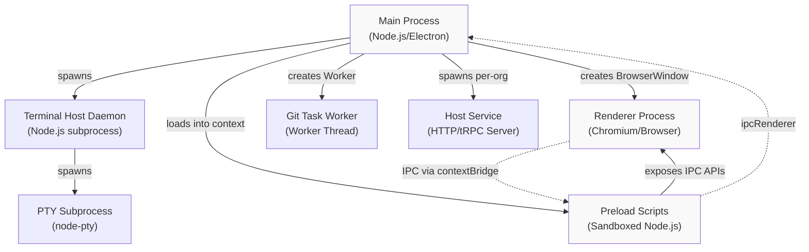
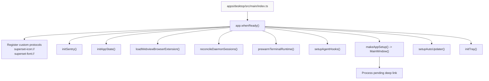
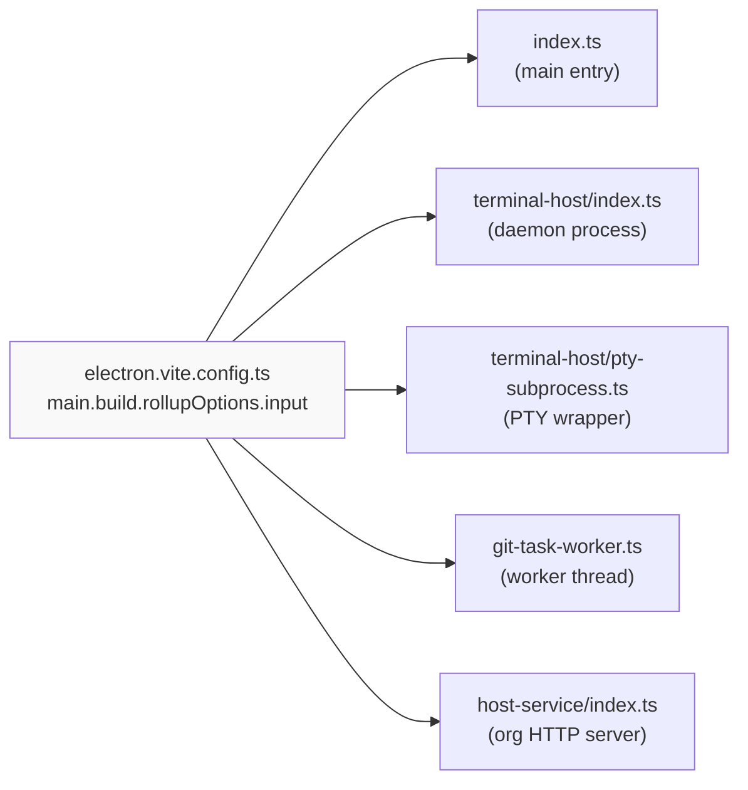

# Electron Process Architecture

<details>
<summary>Relevant source files</summary>

The following files were used as context for generating this wiki page:

- [.github/actions/merge-mac-manifests/action.yml](.github/actions/merge-mac-manifests/action.yml)
- [.github/actions/merge-mac-manifests/merge-mac-manifests.mjs](.github/actions/merge-mac-manifests/merge-mac-manifests.mjs)
- [.github/workflows/build-desktop.yml](.github/workflows/build-desktop.yml)
- [.github/workflows/release-desktop-canary.yml](.github/workflows/release-desktop-canary.yml)
- [.github/workflows/release-desktop.yml](.github/workflows/release-desktop.yml)
- [apps/api/src/app/api/auth/desktop/connect/route.ts](apps/api/src/app/api/auth/desktop/connect/route.ts)
- [apps/desktop/BUILDING.md](apps/desktop/BUILDING.md)
- [apps/desktop/RELEASE.md](apps/desktop/RELEASE.md)
- [apps/desktop/create-release.sh](apps/desktop/create-release.sh)
- [apps/desktop/electron-builder.ts](apps/desktop/electron-builder.ts)
- [apps/desktop/electron.vite.config.ts](apps/desktop/electron.vite.config.ts)
- [apps/desktop/package.json](apps/desktop/package.json)
- [apps/desktop/scripts/copy-native-modules.ts](apps/desktop/scripts/copy-native-modules.ts)
- [apps/desktop/src/main/env.main.ts](apps/desktop/src/main/env.main.ts)
- [apps/desktop/src/main/index.ts](apps/desktop/src/main/index.ts)
- [apps/desktop/src/main/lib/auto-updater.ts](apps/desktop/src/main/lib/auto-updater.ts)
- [apps/desktop/src/renderer/env.renderer.ts](apps/desktop/src/renderer/env.renderer.ts)
- [apps/desktop/src/renderer/index.html](apps/desktop/src/renderer/index.html)
- [apps/desktop/vite/helpers.ts](apps/desktop/vite/helpers.ts)
- [apps/web/src/app/auth/desktop/success/page.tsx](apps/web/src/app/auth/desktop/success/page.tsx)
- [biome.jsonc](biome.jsonc)
- [bun.lock](bun.lock)
- [package.json](package.json)
- [packages/ui/package.json](packages/ui/package.json)
- [scripts/lint.sh](scripts/lint.sh)

</details>

## Purpose and Scope

This document describes the multi-process architecture of the Superset desktop application built with Electron. It covers the separation between main process (Node.js), renderer process (Chromium), and preload scripts, along with their security boundaries, build configuration, and inter-process communication mechanisms.

For details on IPC implementation via tRPC, see [IPC and tRPC Communication](#2.5). For application initialization sequence, see [Application Lifecycle and Initialization](#2.1).

---

## Electron Multi-Process Model

The desktop application follows Electron's standard multi-process architecture, separating concerns between privileged Node.js code and untrusted browser code.

### Process Types and Responsibilities



**Sources:** [apps/desktop/electron.vite.config.ts:99-118]()

| Process        | Runtime                    | Purpose                                               | Privileges                               |
| -------------- | -------------------------- | ----------------------------------------------------- | ---------------------------------------- |
| Main           | Node.js + Electron APIs    | App lifecycle, native integrations, system operations | Full system access                       |
| Renderer       | Chromium V8                | React UI, user interactions                           | Sandboxed browser context                |
| Preload        | Node.js (context isolated) | Secure IPC bridge                                     | Limited Node.js APIs via `contextBridge` |
| Terminal Host  | Node.js subprocess         | Persistent terminal session management                | Same as main, runs independently         |
| PTY Subprocess | Node.js subprocess         | Individual terminal shell instances                   | Spawned by terminal host                 |
| Git Worker     | Worker thread              | Heavy Git operations                                  | Runs in separate thread                  |
| Host Service   | Node.js subprocess         | Per-organization HTTP/tRPC server                     | Runs independently per org               |

---

## Main Process Architecture

The main process is the application's privileged backend running in Node.js. It has full access to Electron APIs, file system, and native modules.

### Main Process Entry Point



**Sources:** [apps/desktop/src/main/index.ts:283-365]()

### Main Process Responsibilities

The main process handles:

1. **Application Lifecycle**: Window management, quit confirmation, signal handling
2. **Deep Linking**: Protocol URL handling (`superset://`) for OAuth callbacks and navigation
3. **Auto-Updates**: Checking and installing updates via `electron-updater`
4. **Custom Protocols**: Serving project icons and system fonts via `protocol.handle()`
5. **Native Integrations**: Tray icon, dock icon, Apple Events permission
6. **Subprocess Management**: Spawning terminal daemons, PTY processes, Git workers, host services
7. **IPC Server**: Exposing tRPC routers to renderer via `trpc-electron`

**Sources:** [apps/desktop/src/main/index.ts:1-367]()

### Main Process Build Configuration

The main process is bundled into multiple entry points for different subprocess types:



**Sources:** [apps/desktop/electron.vite.config.ts:99-118]()

The main process build externalizes native modules to avoid bundling them:

- `electron`
- `better-sqlite3`
- `node-pty`
- `@parcel/watcher`
- Platform-specific packages (`@ast-grep/napi-*`, `@libsql/*-*`)

**Sources:** [apps/desktop/runtime-dependencies.ts]()

### Main Process Environment Variables

Main process uses `process.env` at runtime, validated via `@t3-oss/env-core`:

```typescript
// apps/desktop/src/main/env.main.ts
export const env = createEnv({
  server: {
    NODE_ENV: z.enum(["development", "production", "test\
```
