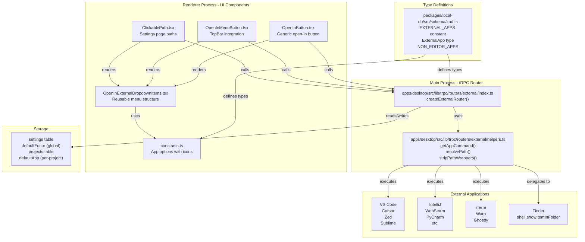
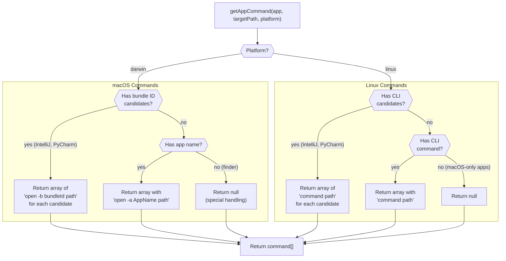
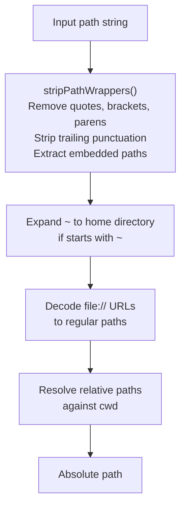
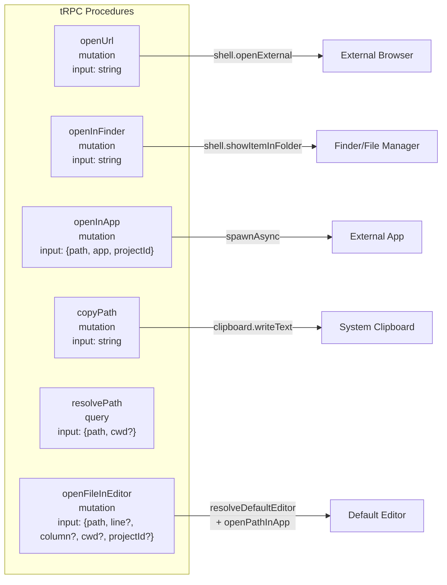
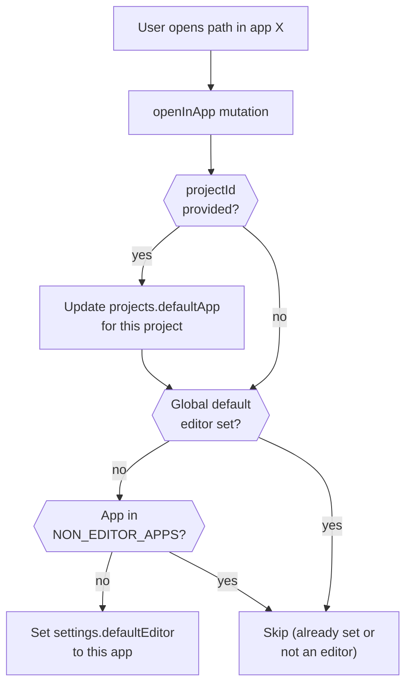
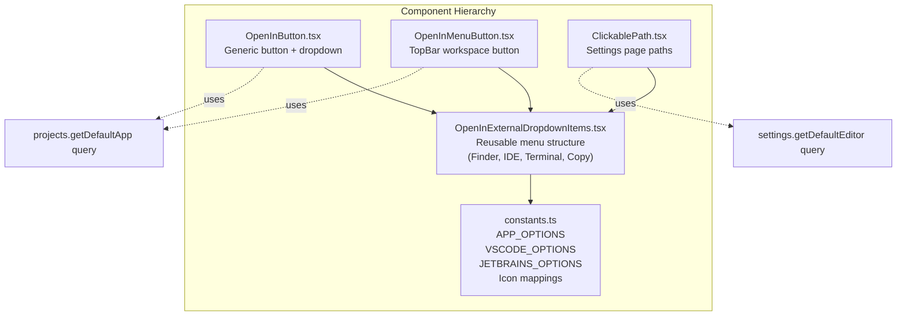

# External Application Integration

<details>
<summary>Relevant source files</summary>

The following files were used as context for generating this wiki page:

- [apps/desktop/src/lib/trpc/routers/external/helpers.test.ts](apps/desktop/src/lib/trpc/routers/external/helpers.test.ts)
- [apps/desktop/src/lib/trpc/routers/external/helpers.ts](apps/desktop/src/lib/trpc/routers/external/helpers.ts)
- [apps/desktop/src/lib/trpc/routers/external/index.ts](apps/desktop/src/lib/trpc/routers/external/index.ts)
- [apps/desktop/src/renderer/assets/app-icons/android-studio.svg](apps/desktop/src/renderer/assets/app-icons/android-studio.svg)
- [apps/desktop/src/renderer/assets/app-icons/antigravity.svg](apps/desktop/src/renderer/assets/app-icons/antigravity.svg)
- [apps/desktop/src/renderer/assets/app-icons/sublime.svg](apps/desktop/src/renderer/assets/app-icons/sublime.svg)
- [apps/desktop/src/renderer/assets/app-icons/zed.png](apps/desktop/src/renderer/assets/app-icons/zed.png)
- [apps/desktop/src/renderer/components/OpenInButton/OpenInButton.tsx](apps/desktop/src/renderer/components/OpenInButton/OpenInButton.tsx)
- [apps/desktop/src/renderer/components/OpenInExternalDropdown/OpenInExternalDropdownItems.tsx](apps/desktop/src/renderer/components/OpenInExternalDropdown/OpenInExternalDropdownItems.tsx)
- [apps/desktop/src/renderer/components/OpenInExternalDropdown/constants.ts](apps/desktop/src/renderer/components/OpenInExternalDropdown/constants.ts)
- [apps/desktop/src/renderer/components/OpenInExternalDropdown/index.ts](apps/desktop/src/renderer/components/OpenInExternalDropdown/index.ts)
- [apps/desktop/src/renderer/routes/_authenticated/_dashboard/components/TopBar/TopBar.tsx](apps/desktop/src/renderer/routes/_authenticated/_dashboard/components/TopBar/TopBar.tsx)
- [apps/desktop/src/renderer/routes/_authenticated/_dashboard/components/TopBar/components/OpenInMenuButton/OpenInMenuButton.tsx](apps/desktop/src/renderer/routes/_authenticated/_dashboard/components/TopBar/components/OpenInMenuButton/OpenInMenuButton.tsx)
- [apps/desktop/src/renderer/routes/_authenticated/settings/components/ClickablePath/ClickablePath.tsx](apps/desktop/src/renderer/routes/_authenticated/settings/components/ClickablePath/ClickablePath.tsx)
- [docs/issues/linux-open-editor-fix.md](docs/issues/linux-open-editor-fix.md)
- [packages/local-db/src/schema/zod.ts](packages/local-db/src/schema/zod.ts)

</details>


## Purpose and Scope

This document describes how Superset integrates with external applications such as code editors, IDEs, terminal emulators, and file managers. The system enables users to open workspace directories, files, and paths in their preferred external applications through UI actions, keyboard shortcuts, and programmatic invocations.

For information about the integrated terminal system (within Superset itself), see [2.8](#2.8). For opening files in the built-in file viewer pane, see [2.7.4](#2.7.4).

---

## System Architecture



**Sources:** [apps/desktop/src/lib/trpc/routers/external/index.ts](), [apps/desktop/src/lib/trpc/routers/external/helpers.ts](), [packages/local-db/src/schema/zod.ts:158-198](), [apps/desktop/src/renderer/components/OpenInButton/OpenInButton.tsx](), [apps/desktop/src/renderer/components/OpenInExternalDropdown/OpenInExternalDropdownItems.tsx]()

---

## Supported Applications

The system defines a comprehensive list of external applications in the `EXTERNAL_APPS` constant. Applications are categorized by type:

### Application Categories

| Category | Apps | Notes |
|----------|------|-------|
| **File Managers** | `finder` | macOS-only, uses `shell.showItemInFolder` |
| **Modern Editors** | `cursor`, `antigravity`, `windsurf`, `zed`, `sublime` | Single-edition apps |
| **VS Code** | `vscode`, `vscode-insiders` | Standard and Insiders builds |
| **JetBrains IDEs** | `intellij`, `webstorm`, `pycharm`, `phpstorm`, `rubymine`, `goland`, `clion`, `rider`, `datagrip`, `appcode`, `fleet`, `rustrover`, `android-studio` | Multi-edition support for IntelliJ and PyCharm |
| **macOS-Only Editors** | `xcode` | Not available on Linux |
| **Terminal Emulators** | `iterm`, `warp`, `terminal`, `ghostty` | iTerm and Terminal are macOS-only |

### Non-Editor Applications

Applications in the `NON_EDITOR_APPS` array cannot be set as the global default editor, as they are not code editors:

```typescript
export const NON_EDITOR_APPS: readonly ExternalApp[] = [
\t"finder",
\t"iterm",
\t"warp",
\t"terminal",
\t"ghostty",
] as const;
```

**Sources:** [packages/local-db/src/schema/zod.ts:158-198](), [apps/desktop/src/renderer/components/OpenInExternalDropdown/constants.ts:38-180]()

---

## Platform-Specific Command Generation

The `getAppCommand()` function generates shell commands to open paths in external applications. Command structure differs significantly between macOS and Linux.



### macOS Command Mappings

macOS uses the `open` command with two flag variants:

- **`-a` (Application Name)**: Used for most applications
- **`-b` (Bundle ID)**: Used for multi-edition JetBrains IDEs to resolve edition-specific `.app` bundles

Example mappings from `MACOS_APP_NAMES`:

```typescript
const MACOS_APP_NAMES: Record<ExternalApp, string | null> = {
\tvscode: "Visual Studio Code",
\tcursor: "Cursor",
\tzed: "Zed",
\t// ...
\tintellij: null, // Multi-edition, uses bundle IDs
\tpycharm: null,  // Multi-edition, uses bundle IDs
};
```

Bundle ID candidates for multi-edition apps:

```typescript
const BUNDLE_ID_CANDIDATES: Partial<Record<ExternalApp, string[]>> = {
\tintellij: ["com.jetbrains.intellij", "com.jetbrains.intellij.ce"],
\tpycharm: ["com.jetbrains.pycharm", "com.jetbrains.pycharm.ce"],
};
```

**Sources:** [apps/desktop/src/lib/trpc/routers/external/helpers.ts:6-43](), [apps/desktop/src/lib/trpc/routers/external/helpers.ts:93-109]()

### Linux Command Mappings

Linux uses direct CLI commands registered in the system `$PATH`:

```typescript
const LINUX_CLI_COMMANDS: Record<ExternalApp, string | null> = {
\tvscode: "code",
\tcursor: "cursor",
\tzed: "zed",
\tsublime: "subl",
\t// ...
\tintellij: null, // Multi-edition, uses CLI candidates
\tpycharm: null,  // Multi-edition, uses CLI candidates
\txcode: null,    // macOS only
\titerm: null,    // macOS only
};
```

CLI command candidates for multi-edition apps (JetBrains Toolbox vs package managers):

```typescript
const LINUX_CLI_CANDIDATES: Partial<Record<ExternalApp, string[]>> = {
\tintellij: ["idea", "intellij-idea-ultimate", "intellij-idea-community"],
\tpycharm: ["pycharm", "pycharm-professional", "pycharm-community"],
};
```

**Sources:** [apps/desktop/src/lib/trpc/routers/external/helpers.ts:45-83](), [apps/desktop/src/lib/trpc/routers/external/helpers.ts:112-123](), [docs/issues/linux-open-editor-fix.md]()

### Fallback Behavior

The `openPathInApp()` function in the tRPC router implements fallback logic:

1. Try all command candidates in order
2. If all candidates fail for multi-edition apps, throw the last error
3. If `getAppCommand()` returns `null`, delegate to Electron's `shell.openPath()` (uses OS default handler)

**Sources:** [apps/desktop/src/lib/trpc/routers/external/index.ts:55-84]()

---

## Path Resolution and Cleaning

The system handles path inputs from various sources (terminal output, clipboard, user input) that may contain wrapper characters or require expansion.



### Path Wrapper Stripping

The `stripPathWrappers()` function removes common wrapper characters while preserving valid path components:

**Wrapper Characters Removed:**
- Quotes: `"`, `'`, `` ` ``
- Brackets: `()`, `[]`, `<>`

**Preserved Patterns:**
- File extensions: `.ts`, `.json`
- Line/column suffixes: `:42`, `:42:10`
- Embedded paths: `text(path/to/file)more` → `path/to/file`

**Examples:**

| Input | Output |
|-------|--------|
| `"./path/file.ts"` | `./path/file.ts` |
| `./path/file.ts.` | `./path/file.ts` |
| `./path/file.ts:42` | `./path/file.ts:42` |
| `see (src/file.ts) here` | `src/file.ts` |
| `"./path/file.ts",` | `./path/file.ts` |

**Sources:** [apps/desktop/src/lib/trpc/routers/external/helpers.ts:126-268](), [apps/desktop/src/lib/trpc/routers/external/helpers.test.ts:301-583]()

### Path Resolution

The `resolvePath()` function performs the full resolution pipeline:

1. **Strip wrappers** via `stripPathWrappers()`
2. **Decode `file://` URLs** to regular paths with URL decoding
3. **Expand tilde** (`~`) to home directory
4. **Resolve relative paths** against provided `cwd` or `process.cwd()`

**Examples:**

| Input | CWD | Output |
|-------|-----|--------|
| `~/Documents/file.ts` | - | `/Users/username/Documents/file.ts` |
| `"src/file.ts"` | `/project` | `/project/src/file.ts` |
| `file:///Users/test/My%20Documents/file.ts` | - | `/Users/test/My Documents/file.ts` |

**Sources:** [apps/desktop/src/lib/trpc/routers/external/helpers.ts:270-302](), [apps/desktop/src/lib/trpc/routers/external/helpers.test.ts:151-299]()

---

## tRPC API

The external router (`createExternalRouter()`) exposes five procedures for interacting with external applications.



### Procedure Definitions

#### `openUrl`

Opens URLs in the system default browser.

```typescript
openUrl: publicProcedure
  .input(z.string())
  .mutation(async ({ input }) => {
    await shell.openExternal(input);
  })
```

#### `openInFinder`

Opens a path in the system file manager.

```typescript
openInFinder: publicProcedure
  .input(z.string())
  .mutation(async ({ input }) => {
    shell.showItemInFolder(input);
  })
```

#### `openInApp`

Opens a path in a specific external application. Automatically persists the choice as the default editor for the project (if `projectId` provided) and globally (if not already set).

```typescript
openInApp: publicProcedure
  .input(z.object({
    path: z.string(),
    app: ExternalAppSchema,
    projectId: z.string().optional(),
  }))
  .mutation(async ({ input }) => {
    await openPathInApp(input.path, input.app);
    
    // Persist per-project default
    if (input.projectId) {
      localDb.update(projects)
        .set({ defaultApp: input.app })
        .where(eq(projects.id, input.projectId))
        .run();
    }
    
    // Best-effort: Set global default editor
    ensureGlobalDefaultEditor(input.app);
  })
```

#### `copyPath`

Copies a path string to the system clipboard.

```typescript
copyPath: publicProcedure
  .input(z.string())
  .mutation(async ({ input }) => {
    clipboard.writeText(input);
  })
```

#### `resolvePath`

Resolves a path string (cleaning wrappers, expanding tilde, etc.) and returns the absolute path. Used primarily for testing/debugging.

```typescript
resolvePath: publicProcedure
  .input(z.object({
    path: z.string(),
    cwd: z.string().optional(),
  }))
  .query(({ input }) => resolvePath(input.path, input.cwd))
```

#### `openFileInEditor`

Opens a file in the default editor for the project (if set) or the global default editor. Falls back to `shell.openPath()` if no editor is configured.

```typescript
openFileInEditor: publicProcedure
  .input(z.object({
    path: z.string(),
    line: z.number().optional(),
    column: z.number().optional(),
    cwd: z.string().optional(),
    projectId: z.string().optional(),
  }))
  .mutation(async ({ input }) => {
    const filePath = resolvePath(input.path, input.cwd);
    const app = resolveDefaultEditor(input.projectId);
    
    if (!app) {
      // Fallback to OS default handler
      await shell.openPath(filePath);
      return;
    }
    
    await openPathInApp(filePath, app);
  })
```

**Sources:** [apps/desktop/src/lib/trpc/routers/external/index.ts:90-181]()

---

## Default Editor Management

The system maintains two levels of default editor preferences:

1. **Global Default**: Stored in `settings.defaultEditor`
2. **Per-Project Default**: Stored in `projects.defaultApp`



### Resolution Order

When determining which editor to use, the system follows this priority:

1. **Project-specific default** (if `projectId` provided)
2. **Global default editor** (from settings)
3. **No default** (return `null`, trigger OS fallback)

The `resolveDefaultEditor()` function implements this logic:

```typescript
export function resolveDefaultEditor(projectId?: string): ExternalApp | null {
\tif (projectId) {
\t\tconst project = localDb
\t\t\t.select()
\t\t\t.from(projects)
\t\t\t.where(eq(projects.id, projectId))
\t\t\t.get();
\t\tif (project?.defaultApp) return project.defaultApp;
\t}
\tconst row = localDb.select().from(settings).get();
\treturn row?.defaultEditor ?? null;
}
```

### Auto-Setting Global Default

The `ensureGlobalDefaultEditor()` function automatically sets the global default editor on first use of an editor app (ignoring non-editor apps like Finder or terminal emulators):

```typescript
function ensureGlobalDefaultEditor(app: ExternalApp) {
\tif (nonEditorSet.has(app)) return;
\t
\tconst row = localDb.select().from(settings).get();
\tif (!row?.defaultEditor) {
\t\tlocalDb
\t\t\t.insert(settings)
\t\t\t.values({ id: 1, defaultEditor: app })
\t\t\t.onConflictDoUpdate({
\t\t\t\ttarget: settings.id,
\t\t\t\tset: { defaultEditor: app },
\t\t\t})
\t\t\t.run();
\t}
}
```

**Sources:** [apps/desktop/src/lib/trpc/routers/external/index.ts:20-53]()

---

## UI Components

The system provides reusable UI components for displaying "Open In" menus with app icons and keyboard shortcuts.



### OpenInButton

Generic button component with dropdown menu. Used in various contexts throughout the app.

**Props:**
- `path`: Target path to open
- `label?`: Optional label to display
- `showShortcuts?`: Whether to show keyboard shortcut hints
- `projectId?`: For per-project default editor

**Features:**
- Displays last-used app icon if available
- Split button design: main button opens in last-used app, dropdown shows all options
- Keyboard shortcut hints (`OPEN_IN_APP`, `COPY_PATH`)

**Sources:** [apps/desktop/src/renderer/components/OpenInButton/OpenInButton.tsx]()

### OpenInMenuButton

Specialized button for the TopBar showing the current workspace path.

**Additional Features:**
- Shows workspace branch name
- Compact layout for TopBar
- Displays online/offline status context

**Sources:** [apps/desktop/src/renderer/routes/_authenticated/_dashboard/components/TopBar/components/OpenInMenuButton/OpenInMenuButton.tsx]()

### ClickablePath

Lightweight component for making file paths clickable in the settings UI.

**Features:**
- Uses global default editor (no project context)
- Simple text + external link icon design
- Opens dropdown on click

**Sources:** [apps/desktop/src/renderer/routes/_authenticated/settings/components/ClickablePath/ClickablePath.tsx]()

### OpenInExternalDropdownItems

Reusable dropdown menu structure with categorized app options:

**Menu Structure:**
1. **Finder** (top-level)
2. **IDE** (submenu)
   - Cursor, Antigravity, Windsurf, Zed, Sublime, Xcode
   - **VS Code** (sub-submenu): Standard, Insiders
   - **JetBrains** (sub-submenu): IntelliJ, WebStorm, PyCharm, etc.
3. **Terminal** (submenu): iTerm, Warp, Terminal, Ghostty
4. **Copy Path** (bottom, with separator)

**Customization Props:**
- `renderAppTrailing`: Custom trailing content per app (e.g., shortcuts, "Default" badge)
- `copyPathTrailing`: Custom trailing content for Copy Path item
- Various className props for styling individual sections

**Sources:** [apps/desktop/src/renderer/components/OpenInExternalDropdown/OpenInExternalDropdownItems.tsx]()

### App Icon Assets

Icons are stored as individual SVG/PNG files per app, with separate light/dark variants where needed:

```typescript
export interface OpenInExternalAppOption {
\tid: ExternalApp;
\tlabel: string;
\tlightIcon: string;
\tdarkIcon: string;
\tdisplayLabel?: string; // Optional override for display
}
```

Example: Windsurf uses different icons for light/dark themes:
- Light: `windsurf.svg`
- Dark: `windsurf-white.svg`

**Sources:** [apps/desktop/src/renderer/components/OpenInExternalDropdown/constants.ts:30-192]()

---

## Keyboard Shortcuts

The external app system integrates with the hotkey system (see [2.14](#2.14)) via two actions:

| Action | Default Shortcut | Behavior |
|--------|------------------|----------|
| `OPEN_IN_APP` | Platform-specific | Opens current context (workspace, file) in default editor |
| `COPY_PATH` | Platform-specific | Copies current context path to clipboard |

UI components use `useHotkeyText()` to display the current bindings in tooltips and menu items.

**Sources:** [apps/desktop/src/renderer/components/OpenInButton/OpenInButton.tsx:39-44](), [apps/desktop/src/renderer/routes/_authenticated/_dashboard/components/TopBar/components/OpenInMenuButton/OpenInMenuButton.tsx:56-59]()

---

## Testing

The system includes comprehensive unit tests for path resolution and command generation logic.

### Test Coverage

**Path Resolution Tests** (`helpers.test.ts`):
- Home directory expansion (`~`)
- Absolute path handling
- Relative path resolution against `cwd`
- `file://` URL decoding
- Wrapper character stripping (quotes, brackets, parens)
- Trailing punctuation handling
- Embedded path extraction (`text(path)more`)
- Line/column suffix preservation (`:42`, `:42:10`)
- File extension preservation

**Command Generation Tests** (`helpers.test.ts`):
- macOS command generation (`open -a`, `open -b`)
- Multi-edition JetBrains IDE candidates
- Linux CLI command generation
- Cross-platform behavior differences
- Path preservation with special characters

**Example Test Pattern:**

```typescript
test("extracts path from text(path)more pattern", () => {
  expect(stripPathWrappers("text(src/file.ts)more")).toBe("src/file.ts");
});

test("returns bundle ID candidates for intellij (multi-edition)", () => {
  const result = getAppCommand("intellij", "/path/to/file");
  expect(result).toEqual([
    { command: "open", args: ["-b", "com.jetbrains.intellij", "/path/to/file"] },
    { command: "open", args: ["-b", "com.jetbrains.intellij.ce", "/path/to/file"] },
  ]);
});
```

**Sources:** [apps/desktop/src/lib/trpc/routers/external/helpers.test.ts]()