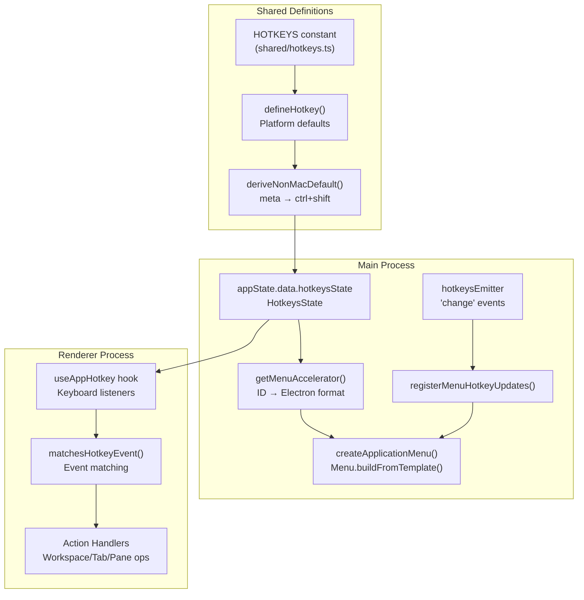
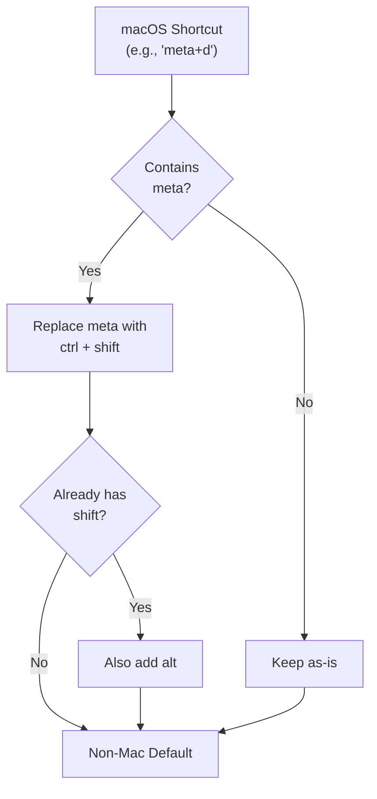
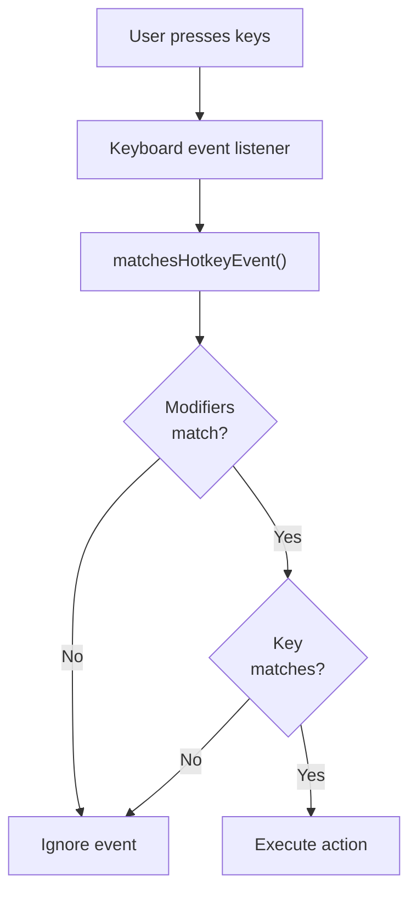

# Hotkeys and Application Menu

<details>
<summary>Relevant source files</summary>

The following files were used as context for generating this wiki page:

- [apps/desktop/src/lib/trpc/routers/ui-state/index.ts](apps/desktop/src/lib/trpc/routers/ui-state/index.ts)
- [apps/desktop/src/renderer/routes/_authenticated/_dashboard/workspace/$workspaceId/page.tsx](apps/desktop/src/renderer/routes/_authenticated/_dashboard/workspace/$workspaceId/page.tsx)
- [apps/desktop/src/renderer/screens/main/components/WorkspaceView/ContentView/TabsContent/GroupStrip/GroupItem.tsx](apps/desktop/src/renderer/screens/main/components/WorkspaceView/ContentView/TabsContent/GroupStrip/GroupItem.tsx)
- [apps/desktop/src/renderer/screens/main/components/WorkspaceView/ContentView/TabsContent/GroupStrip/GroupStrip.tsx](apps/desktop/src/renderer/screens/main/components/WorkspaceView/ContentView/TabsContent/GroupStrip/GroupStrip.tsx)
- [apps/desktop/src/renderer/screens/main/components/WorkspaceView/ContentView/TabsContent/TabContentContextMenu.tsx](apps/desktop/src/renderer/screens/main/components/WorkspaceView/ContentView/TabsContent/TabContentContextMenu.tsx)
- [apps/desktop/src/renderer/screens/main/components/WorkspaceView/ContentView/TabsContent/TabView/FileViewerPane/FileViewerPane.tsx](apps/desktop/src/renderer/screens/main/components/WorkspaceView/ContentView/TabsContent/TabView/FileViewerPane/FileViewerPane.tsx)
- [apps/desktop/src/renderer/screens/main/components/WorkspaceView/ContentView/TabsContent/TabView/FileViewerPane/components/DiffViewerContextMenu/DiffViewerContextMenu.tsx](apps/desktop/src/renderer/screens/main/components/WorkspaceView/ContentView/TabsContent/TabView/FileViewerPane/components/DiffViewerContextMenu/DiffViewerContextMenu.tsx)
- [apps/desktop/src/renderer/screens/main/components/WorkspaceView/ContentView/TabsContent/TabView/FileViewerPane/components/FileEditorContextMenu/FileEditorContextMenu.tsx](apps/desktop/src/renderer/screens/main/components/WorkspaceView/ContentView/TabsContent/TabView/FileViewerPane/components/FileEditorContextMenu/FileEditorContextMenu.tsx)
- [apps/desktop/src/renderer/screens/main/components/WorkspaceView/ContentView/TabsContent/TabView/FileViewerPane/components/FileViewerContent/FileViewerContent.tsx](apps/desktop/src/renderer/screens/main/components/WorkspaceView/ContentView/TabsContent/TabView/FileViewerPane/components/FileViewerContent/FileViewerContent.tsx)
- [apps/desktop/src/renderer/screens/main/components/WorkspaceView/ContentView/TabsContent/TabView/TabPane.tsx](apps/desktop/src/renderer/screens/main/components/WorkspaceView/ContentView/TabsContent/TabView/TabPane.tsx)
- [apps/desktop/src/renderer/screens/main/components/WorkspaceView/ContentView/TabsContent/TabView/index.tsx](apps/desktop/src/renderer/screens/main/components/WorkspaceView/ContentView/TabsContent/TabView/index.tsx)
- [apps/desktop/src/renderer/screens/main/components/WorkspaceView/ContentView/components/EditorContextMenu/EditorContextMenu.tsx](apps/desktop/src/renderer/screens/main/components/WorkspaceView/ContentView/components/EditorContextMenu/EditorContextMenu.tsx)
- [apps/desktop/src/renderer/screens/main/components/WorkspaceView/ContentView/components/PaneContextMenuItems/PaneContextMenuItems.tsx](apps/desktop/src/renderer/screens/main/components/WorkspaceView/ContentView/components/PaneContextMenuItems/PaneContextMenuItems.tsx)
- [apps/desktop/src/renderer/screens/main/components/WorkspaceView/ContentView/components/index.ts](apps/desktop/src/renderer/screens/main/components/WorkspaceView/ContentView/components/index.ts)
- [apps/desktop/src/renderer/stores/tabs/store.ts](apps/desktop/src/renderer/stores/tabs/store.ts)
- [apps/desktop/src/renderer/stores/tabs/terminal-callbacks.ts](apps/desktop/src/renderer/stores/tabs/terminal-callbacks.ts)
- [apps/desktop/src/renderer/stores/tabs/types.ts](apps/desktop/src/renderer/stores/tabs/types.ts)
- [apps/desktop/src/renderer/stores/tabs/utils.test.ts](apps/desktop/src/renderer/stores/tabs/utils.test.ts)
- [apps/desktop/src/renderer/stores/tabs/utils.ts](apps/desktop/src/renderer/stores/tabs/utils.ts)
- [apps/desktop/src/shared/hotkeys.ts](apps/desktop/src/shared/hotkeys.ts)
- [apps/desktop/src/shared/tabs-types.ts](apps/desktop/src/shared/tabs-types.ts)

</details>


## Overview

The desktop application implements a comprehensive hotkey system that provides keyboard shortcuts across workspace navigation, tab management, pane operations, and window controls. The system is designed with platform-awareness, automatically converting macOS shortcuts (using `meta`) to Windows/Linux equivalents (using `ctrl+shift`). Hotkeys integrate with both the Electron application menu and renderer-side keyboard event handlers.

The hotkey system consists of:
- **HOTKEYS Constant** - Central definition of all shortcuts with platform defaults
- **HotkeysState** - Per-platform overrides stored in app state
- **Application Menu** - Native menu with accelerators derived from hotkeys
- **Renderer Hooks** - Direct keyboard event handling via `useAppHotkey`
- **Reserved Shortcuts** - Protection against conflicts with terminal input and OS shortcuts
- **Event System** - `menuEmitter` and `hotkeysEmitter` for coordination

All app hotkeys require a primary modifier (`ctrl` or `meta`) to avoid conflicts with terminal input.

Sources: [apps/desktop/src/shared/hotkeys.ts:1-764](), [apps/desktop/src/main/lib/menu.ts:1-174](), [apps/desktop/src/main/windows/main.ts:13-68]()

## System Architecture

The hotkey system bridges the main process (Electron menu) and renderer process (keyboard event handlers) with shared definitions and state.

**Hotkey System Architecture**



Sources: [apps/desktop/src/shared/hotkeys.ts:1-764](), [apps/desktop/src/main/lib/menu.ts:1-174](), [apps/desktop/src/main/lib/app-state.ts]()

## HOTKEYS Constant

The `HOTKEYS` constant in `shared/hotkeys.ts` defines all keyboard shortcuts with platform-specific defaults. Each hotkey is created using the `defineHotkey` helper function.

**Structure:**

```typescript
export const HOTKEYS = {
  JUMP_TO_WORKSPACE_1: defineHotkey({
    keys: "meta+1",
    label: "Switch to Workspace 1",
    category: "Workspace",
  }),
  // ... 40+ more shortcuts
} as const satisfies Record<string, HotkeyDefinition>;
```

**HotkeyDefinition Interface:**

| Field | Type | Description |
|-------|------|-------------|
| `label` | `string` | Human-readable name for display |
| `category` | `HotkeyCategory` | Grouping (Workspace/Layout/Terminal/Window/Help) |
| `description` | `string?` | Optional detailed description |
| `defaults` | `Record<HotkeyPlatform, string \| null>` | Per-platform default bindings |
| `isHidden` | `boolean?` | Hide from settings UI if true |

**Categories:**

The system organizes shortcuts into five categories:

| Category | Purpose | Example Shortcuts |
|----------|---------|-------------------|
| `Workspace` | Workspace navigation and creation | `JUMP_TO_WORKSPACE_1`, `NEXT_WORKSPACE` |
| `Layout` | Sidebar and split-pane management | `TOGGLE_SIDEBAR`, `SPLIT_RIGHT` |
| `Terminal` | Terminal operations and navigation | `NEW_GROUP`, `FIND_IN_TERMINAL` |
| `Window` | Window-level operations | `CLOSE_WINDOW`, `OPEN_IN_APP` |
| `Help` | Help and settings access | `SHOW_HOTKEYS` |

Sources: [apps/desktop/src/shared/hotkeys.ts:365-561](), [apps/desktop/src/shared/hotkeys.ts:10-28]()

## Platform-Aware Defaults

The `defineHotkey` function automatically derives Windows/Linux shortcuts from macOS shortcuts using `deriveNonMacDefault`.

**Derivation Logic:**



**Examples:**

| macOS Shortcut | Windows/Linux Shortcut | Reasoning |
|----------------|------------------------|-----------|
| `meta+d` | `ctrl+shift+d` | `meta` → `ctrl+shift` |
| `meta+shift+d` | `ctrl+shift+alt+d` | `meta` → `ctrl+shift`, already has `shift` so add `alt` |
| `meta+1` | `ctrl+shift+1` | Direct conversion |
| `meta+alt+left` | `ctrl+shift+alt+left` | Preserves `alt` |

**Implementation:**

The `deriveNonMacDefault` function ([apps/desktop/src/shared/hotkeys.ts:322-339]()) parses the canonical hotkey string, removes `meta` if present, adds `ctrl+shift`, and conditionally adds `alt` if `shift` was already present.

Sources: [apps/desktop/src/shared/hotkeys.ts:322-363](), [apps/desktop/src/shared/hotkeys.ts:341-363]()

## Hotkey State and Overrides

The `HotkeysState` stores per-platform overrides to defaults. This state is persisted in `appState.data.hotkeysState` and allows users to customize bindings (future feature).

**State Structure:**

```typescript
interface HotkeysState {
  version: number;
  byPlatform: Record<HotkeyPlatform, Partial<Record<HotkeyId, string | null>>>;
}
```

**Platform Types:**

```typescript
type HotkeyPlatform = "darwin" | "win32" | "linux";
```

**Effective Hotkey Resolution:**

When determining which hotkey to use, the system checks:

1. **Override exists** - Use the override from `HotkeysState.byPlatform[platform][hotkeyId]`
2. **Default only** - Use the default from `HOTKEYS[hotkeyId].defaults[platform]`

The `getEffectiveHotkey` function ([apps/desktop/src/shared/hotkeys.ts:604-611]()) implements this resolution logic.

**Example State:**

```json
{
  "version": 1,
  "byPlatform": {
    "darwin": {
      "SPLIT_RIGHT": "meta+shift+v"
    },
    "win32": {},
    "linux": {}
  }
}
```

In this example, macOS users have customized the split-right shortcut from the default `meta+d` to `meta+shift+v`.

Sources: [apps/desktop/src/shared/hotkeys.ts:34-47](), [apps/desktop/src/shared/hotkeys.ts:604-622](), [apps/desktop/src/main/lib/app-state.ts]()

## Application Menu Integration

The native Electron application menu displays keyboard shortcuts as accelerators. The `getMenuAccelerator` function converts hotkey IDs to Electron accelerator strings.

**Menu Creation Flow:**

```mermaid
sequenceDiagram
    participant Main as MainWindow()
    participant Create as createApplicationMenu()
    participant Get as getMenuAccelerator()
    participant State as appState.data.hotkeysState
    participant Convert as toElectronAccelerator()
    participant Menu as Menu.buildFromTemplate()
    
    Main->>Create: Call on startup
    Create->>Get: getMenuAccelerator("CLOSE_WINDOW")
    Get->>State: Read byPlatform overrides
    State-->>Get: Overrides for platform
    Get->>Convert: toElectronAccelerator(keys, platform)
    Convert-->>Get: "Command+Shift+W"
    Get-->>Create: Accelerator string
    Create->>Menu: Build menu with accelerators
    Menu-->>Main: Set application menu
```

**Accelerator Conversion:**

The `toElectronAccelerator` function ([apps/desktop/src/shared/hotkeys.ts:735-763]()) converts canonical hotkey format to Electron's accelerator syntax:

| Canonical Format | Electron Accelerator | Notes |
|------------------|---------------------|-------|
| `meta+shift+w` | `Command+Shift+W` | macOS |
| `ctrl+shift+w` | `Ctrl+Shift+W` | Windows/Linux |
| `meta+slash` | `Command+/` | Special key mapping |
| `meta+left` | `Command+Left` | Arrow key capitalized |

**Menu Registration:**

The `registerMenuHotkeyUpdates` function ([apps/desktop/src/main/lib/menu.ts:31-37]()) sets up a listener on `hotkeysEmitter` to rebuild the menu when hotkey bindings change:

```typescript
hotkeysEmitter.on("change", () => {
  createApplicationMenu();
});
```

This ensures the menu accelerators stay synchronized with any hotkey customizations.

Sources: [apps/desktop/src/main/lib/menu.ts:23-29](), [apps/desktop/src/main/lib/menu.ts:31-37](), [apps/desktop/src/main/lib/menu.ts:39-173](), [apps/desktop/src/shared/hotkeys.ts:735-763]()

## Renderer-Side Hotkey Execution

The renderer process handles keyboard events directly using the `useAppHotkey` hook (implementation not shown in provided files but referenced in high-level diagram). This enables shortcuts to work even when focus is on elements like terminals.

**Event Matching Process:**



**Matching Logic:**

The `matchesHotkeyEvent` function ([apps/desktop/src/shared/hotkeys.ts:221-254]()) compares a keyboard event against a canonical hotkey string:

1. **Parse canonical hotkey** - Extract modifiers and key
2. **Check each modifier** - Verify `metaKey`, `ctrlKey`, `altKey`, `shiftKey` match requirements
3. **Normalize key** - Apply key aliases (e.g., `arrowleft` → `left`)
4. **Match key** - Compare normalized event key to canonical key

**Primary Modifier Requirement:**

All app hotkeys must include `ctrl` or `meta` to avoid interfering with terminal input. The `hasPrimaryModifier` function ([apps/desktop/src/shared/hotkeys.ts:317-320]()) enforces this constraint.

Sources: [apps/desktop/src/shared/hotkeys.ts:221-254](), [apps/desktop/src/shared/hotkeys.ts:256-288](), [apps/desktop/src/shared/hotkeys.ts:317-320]()

## Reserved Shortcuts

The hotkey system enforces reserved shortcuts to prevent conflicts with terminal input and operating system functions.

**Terminal Reserved Shortcuts:**

These shortcuts are blocked because they provide essential terminal functionality:

| Shortcut | Purpose | Why Reserved |
|----------|---------|--------------|
| `ctrl+c` | Send SIGINT | Kill running process |
| `ctrl+d` | Send EOF | Exit shell/REPL |
| `ctrl+z` | Send SIGTSTP | Suspend process |
| `ctrl+s` | Flow control | Pause terminal output (XOFF) |
| `ctrl+q` | Flow control | Resume terminal output (XON) |
| `ctrl+\` | Send SIGQUIT | Force quit with core dump |

The `TERMINAL_RESERVED_CHORDS` set ([apps/desktop/src/shared/hotkeys.ts:109-116]()) defines these shortcuts. The `isTerminalReservedHotkey` function checks if a shortcut conflicts with terminal input.

**OS Reserved Shortcuts:**

Platform-specific shortcuts that the OS handles directly:

| Platform | Shortcut | OS Function |
|----------|----------|-------------|
| macOS | `meta+q` | Quit application |
| macOS | `meta+space` | Spotlight search |
| macOS | `meta+tab` | Application switcher |
| Windows | `alt+f4` | Close window |
| Windows | `ctrl+alt+delete` | System interrupt menu |
| Windows/Linux | `alt+tab` | Application switcher |

The `OS_RESERVED_CHORDS` map ([apps/desktop/src/shared/hotkeys.ts:118-122]()) tracks these per-platform. The `isOsReservedHotkey` function prevents assignment of these shortcuts.

**Primary Modifier Enforcement:**

All app hotkeys must include `ctrl` or `meta` as a primary modifier. This rule ensures:
1. **No terminal conflicts** - Single-key shortcuts (like `a`, `b`) won't intercept typing
2. **Consistent behavior** - Shortcuts work even when terminal has focus
3. **Discoverability** - Users expect app shortcuts to use modifier keys

The `hotkeyFromKeyboardEvent` function ([apps/desktop/src/shared/hotkeys.ts:256-288]()) rejects events without a primary modifier:

```typescript
// App hotkeys must include ctrl or meta to avoid conflicts with terminal input
if (!event.ctrlKey && !event.metaKey) {
  return null;
}
```

Sources: [apps/desktop/src/shared/hotkeys.ts:109-122](), [apps/desktop/src/shared/hotkeys.ts:256-288](), [apps/desktop/src/shared/hotkeys.ts:290-320]()

## Event System

The hotkey system uses two event emitters for coordination between main and renderer processes.

**menuEmitter:**

Triggers actions from menu item clicks. Used when users select menu items or click native accelerators.

**Events:**

| Event | Payload | Purpose |
|-------|---------|---------|
| `"open-settings"` | `"keyboard"` | Opens settings dialog to keyboard shortcuts tab |

Example usage in menu creation ([apps/desktop/src/main/lib/menu.ts:102-107]()):

```typescript
{
  label: "Keyboard Shortcuts",
  accelerator: showHotkeysAccelerator,
  click: () => {
    menuEmitter.emit("open-settings", "keyboard");
  },
}
```

**hotkeysEmitter:**

Notifies that hotkey bindings have changed, triggering menu rebuilds.

**Events:**

| Event | Payload | Purpose |
|-------|---------|---------|
| `"change"` | None | Hotkey bindings were modified |

The `registerMenuHotkeyUpdates` function ([apps/desktop/src/main/lib/menu.ts:31-37]()) listens for changes:

```typescript
hotkeysEmitter.on("change", () => {
  createApplicationMenu();
});
```

This ensures menu accelerators stay synchronized when users customize hotkeys (future feature).

Sources: [apps/desktop/src/main/lib/menu.ts:31-37](), [apps/desktop/src/main/lib/menu.ts:102-107](), [apps/desktop/src/main/lib/menu-events.ts](), [apps/desktop/src/main/lib/hotkeys-events.ts]()

## Complete Reference Table

| Category | Shortcut | Action | Context |
|----------|----------|--------|---------|
| **Workspace** | `⌘ ⌥ ←` | Previous Workspace | Any workspace active |
| **Workspace** | `⌘ ⌥ →` | Next Workspace | Any workspace active |
| **Tab Management** | `⌘ T` | New Tab | Workspace active |
| **Tab Management** | `⌘ W` | Close Tab | Tab selected |
| **Tab Navigation** | `⌘ ⌥ ↑` | Previous Tab | Multiple tabs exist |
| **Tab Navigation** | `⌘ ⌥ ↓` | Next Tab | Multiple tabs exist |
| **Tab Navigation** | `⌘ 1` - `⌘ 9` | Jump to Tab 1-9 | Tab at position exists |
| **Split View** | `⌘ D` | Split Vertical | Tab selected |
| **Split View** | `⌘ ⇧ D` | Split Horizontal | Tab selected |
| **UI Toggle** | `⌘ S` | Toggle Sidebar | Always available |

**Platform Notes:**
- `⌘` represents the Command key on macOS and Ctrl key on Windows/Linux
- `⌥` represents the Option/Alt key on macOS and Alt key on Windows/Linux
- `⇧` represents the Shift key

Sources: [apps/desktop/src/renderer/screens/main/components/TopBar/WorkspaceTabs/index.tsx:30-44](), [apps/desktop/src/renderer/screens/main/components/WorkspaceView/index.tsx:38-78](), [apps/desktop/src/renderer/screens/main/index.tsx:16-37]()