# Desktop Application

<details>
<summary>Relevant source files</summary>

The following files were used as context for generating this wiki page:

- [.github/actions/merge-mac-manifests/action.yml](.github/actions/merge-mac-manifests/action.yml)
- [.github/actions/merge-mac-manifests/merge-mac-manifests.mjs](.github/actions/merge-mac-manifests/merge-mac-manifests.mjs)
- [.github/workflows/build-desktop.yml](.github/workflows/build-desktop.yml)
- [.github/workflows/release-desktop-canary.yml](.github/workflows/release-desktop-canary.yml)
- [.github/workflows/release-desktop.yml](.github/workflows/release-desktop.yml)
- [apps/api/src/app/api/auth/desktop/connect/route.ts](apps/api/src/app/api/auth/desktop/connect/route.ts)
- [apps/desktop/BUILDING.md](apps/desktop/BUILDING.md)
- [apps/desktop/RELEASE.md](apps/desktop/RELEASE.md)
- [apps/desktop/create-release.sh](apps/desktop/create-release.sh)
- [apps/desktop/electron-builder.ts](apps/desktop/electron-builder.ts)
- [apps/desktop/electron.vite.config.ts](apps/desktop/electron.vite.config.ts)
- [apps/desktop/package.json](apps/desktop/package.json)
- [apps/desktop/scripts/copy-native-modules.ts](apps/desktop/scripts/copy-native-modules.ts)
- [apps/desktop/src/main/env.main.ts](apps/desktop/src/main/env.main.ts)
- [apps/desktop/src/main/index.ts](apps/desktop/src/main/index.ts)
- [apps/desktop/src/main/lib/auto-updater.ts](apps/desktop/src/main/lib/auto-updater.ts)
- [apps/desktop/src/renderer/env.renderer.ts](apps/desktop/src/renderer/env.renderer.ts)
- [apps/desktop/src/renderer/index.html](apps/desktop/src/renderer/index.html)
- [apps/desktop/vite/helpers.ts](apps/desktop/vite/helpers.ts)
- [apps/web/src/app/auth/desktop/success/page.tsx](apps/web/src/app/auth/desktop/success/page.tsx)
- [biome.jsonc](biome.jsonc)
- [bun.lock](bun.lock)
- [package.json](package.json)
- [packages/ui/package.json](packages/ui/package.json)
- [scripts/lint.sh](scripts/lint.sh)

</details>


## Purpose and Scope

The Desktop Application is an Electron-based native application that serves as the primary interface for Superset. It provides a full-featured development environment with integrated terminal emulation, Git worktree management, file editing, AI-assisted coding, and browser-based debugging capabilities. The desktop app runs locally on macOS, Windows, and Linux, with local SQLite storage synchronized to the cloud via ElectricSQL.

This document covers the desktop application's architecture, build system, release process, and core infrastructure. For details on specific subsystems, see:
- Application initialization and lifecycle: [#2.1](#2.1)
- Build configuration and packaging: [#2.2](#2.2)
- Auto-update system: [#2.3](#2.3)
- Process architecture and IPC: [#2.4](#2.4) and [#2.5](#2.5)
- Workspace and Git integration: [#2.6](#2.6)
- Terminal system: [#2.8](#2.8)
- Data synchronization: [#2.10](#2.10)

---

## Architecture Overview

The desktop application follows Electron's multi-process architecture with a Node.js main process, Chromium-based renderer process, and several auxiliary processes for specialized tasks. The application is built as part of a monorepo structure at [apps/desktop/]() and shares common packages with the web and API applications.

### Process Architecture

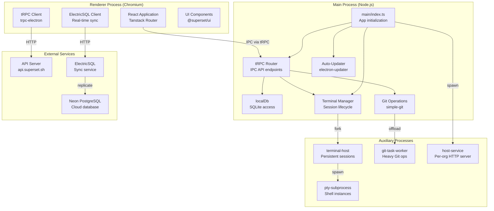

**Sources:** [apps/desktop/electron.vite.config.ts:102-112](), [apps/desktop/src/main/index.ts:1-367](), [diagrams showing multi-process architecture]()

---

## Technology Stack

The desktop application uses the following core technologies:

| Technology | Purpose | Package/Version |
|------------|---------|-----------------|
| **Electron** | Cross-platform desktop framework | `electron@40.2.1` |
| **React** | UI rendering | `react@19.2.0` |
| **Vite** | Build tool (via electron-vite) | `vite@7.1.3`, `electron-vite@4.0.0` |
| **tRPC** | Type-safe IPC communication | `@trpc/server@11.7.1`, `trpc-electron@0.1.2` |
| **TanStack Router** | Client-side routing | `@tanstack/react-router@1.147.3` |
| **ElectricSQL** | Real-time database sync | `@electric-sql/client@1.5.12` |
| **Drizzle ORM** | SQLite database access | `drizzle-orm@0.45.1` |
| **xterm.js** | Terminal emulation | `@xterm/xterm@6.1.0-beta.195` |
| **node-pty** | PTY subprocess management | `node-pty@1.1.0` |
| **simple-git** | Git operations | `simple-git@3.30.0` |
| **electron-updater** | Auto-update functionality | `electron-updater@6.7.3` |
| **Tailwind CSS** | Styling | `tailwindcss@4.1.18` |
| **Zustand** | State management | `zustand@5.0.8` |
| **CodeMirror** | Code editor | `@codemirror/view@6.39.16` |

**Sources:** [apps/desktop/package.json:37-217]()

---

## Build System

### Compilation with electron-vite

The desktop app uses `electron-vite` to compile three separate bundles:

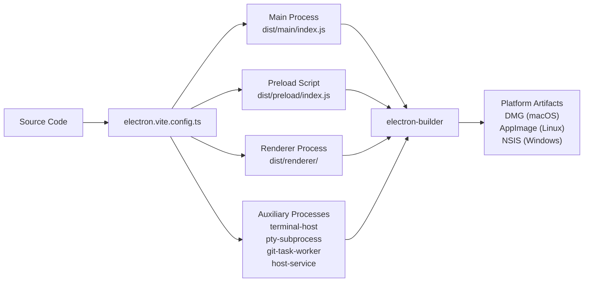

The main build configuration is defined in [apps/desktop/electron.vite.config.ts](), which creates separate Vite configurations for:

- **Main process** ([electron.vite.config.ts:47-127]()): Node.js bundle with access to Electron APIs
- **Preload script** ([electron.vite.config.ts:129-158]()): Sandboxed context bridge
- **Renderer process** ([electron.vite.config.ts:160-263]()): React application with browser APIs

### Entry Points

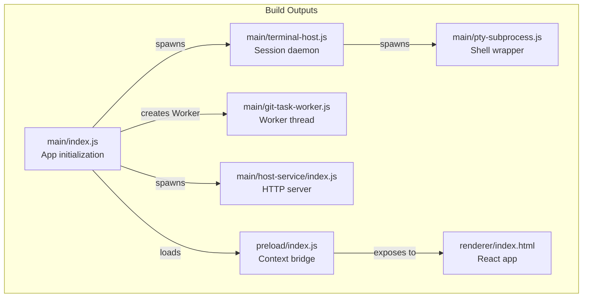

**Sources:** [apps/desktop/electron.vite.config.ts:102-112]()

### Native Module Handling

Native modules like `node-pty`, `better-sqlite3`, and platform-specific packages require special handling during the build:

1. **Externalization**: Native modules are marked as external in the Vite config to prevent bundling ([electron.vite.config.ts:116]())
2. **Copying**: A pre-build script ([apps/desktop/scripts/copy-native-modules.ts]()) resolves symlinks and copies native modules to `node_modules/`
3. **ASAR unpacking**: The `asarUnpack` configuration in [apps/desktop/electron-builder.ts:47-53]() ensures native binaries are extracted outside the ASAR archive

**Sources:** [apps/desktop/electron.vite.config.ts:116](), [apps/desktop/electron-builder.ts:46-53](), [apps/desktop/scripts/copy-native-modules.ts:1-453]()

### Build Scripts

| Script | Purpose | Command |
|--------|---------|---------|
| `generate:icons` | Generate file type icons | `bun run scripts/generate-file-icons.ts` |
| `clean:dev` | Clean development artifacts | `rimraf ./node_modules/.dev` |
| `compile:app` | Compile with electron-vite | `electron-vite build` |
| `copy:native-modules` | Prepare native modules | `bun run scripts/copy-native-modules.ts` |
| `validate:native-runtime` | Verify native module compatibility | `bun run scripts/validate-native-runtime.ts` |
| `package` | Package with electron-builder | `electron-builder --config electron-builder.ts` |

**Sources:** [apps/desktop/package.json:16-35]()

---

## Packaging with electron-builder

The [apps/desktop/electron-builder.ts]() configuration defines platform-specific packaging:

### Platform Targets

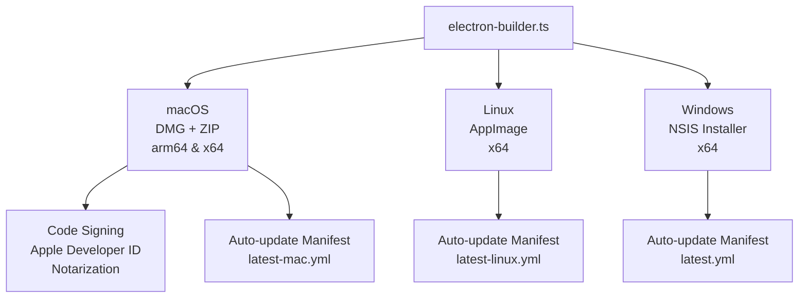

**Key packaging features:**

- **ASAR Archive**: Application code is packaged into `app.asar` with native modules unpacked ([electron-builder.ts:46-53]())
- **Extra Resources**: Database migrations and sounds are placed outside ASAR at [electron-builder.ts:56-68]()
- **macOS Entitlements**: Required for microphone, local network, and Apple Events permissions ([electron-builder.ts:97-116]())
- **Deep Linking**: Protocol handler for `superset://` URLs ([electron-builder.ts:120-123]())

**Sources:** [apps/desktop/electron-builder.ts:22-153]()

---

## Release Process

### Release Channels

The desktop app supports two release channels:

| Channel | Description | Tag Format | Build Frequency |
|---------|-------------|------------|-----------------|
| **Stable** | Production releases | `desktop-v1.0.0` | Manual via git tag |
| **Canary** | Pre-release builds | `desktop-canary` | Automated every 12 hours |

### Stable Release Workflow

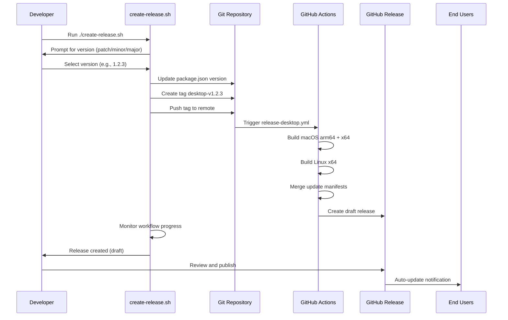

**Sources:** [apps/desktop/create-release.sh:1-460](), [.github/workflows/release-desktop.yml:1-147]()

### Canary Release Workflow

The canary workflow runs automatically on a schedule:

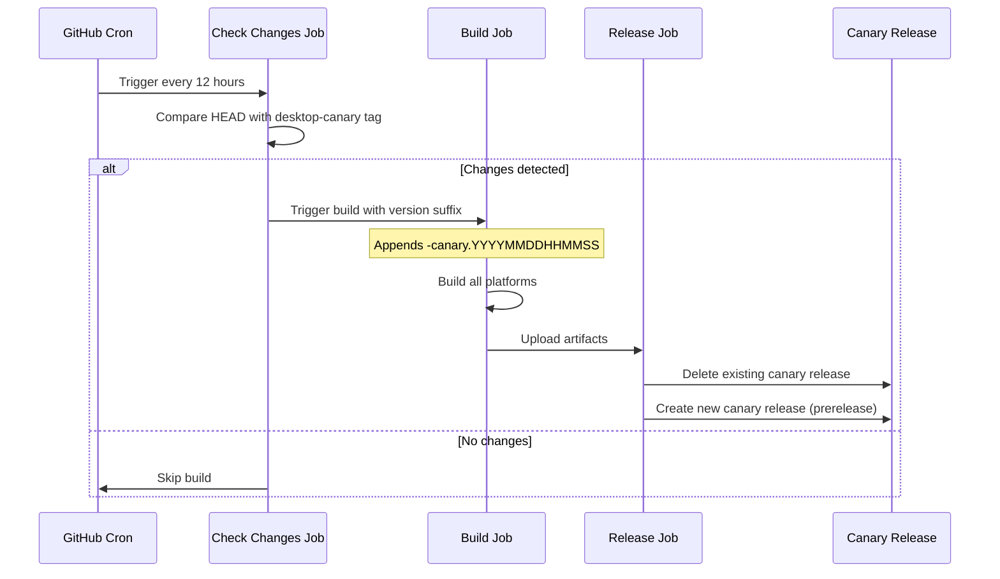

**Sources:** [.github/workflows/release-desktop-canary.yml:1-158]()

### Build Matrix

The build workflow uses a matrix strategy to build for multiple architectures in parallel:

| Platform | Architecture | Runner | Output Format |
|----------|--------------|--------|---------------|
| macOS | arm64 | `macos-latest` | DMG, ZIP, update manifest |
| macOS | x64 | `macos-latest` | DMG, ZIP, update manifest |
| Linux | x64 | `ubuntu-latest` | AppImage, update manifest |

**Sources:** [.github/workflows/build-desktop.yml:32-256]()

### Auto-Update Manifest Merging

macOS builds produce separate manifests for arm64 and x64. A custom GitHub Action merges them into a single `latest-mac.yml`:

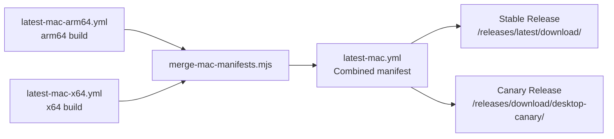

**Sources:** [.github/actions/merge-mac-manifests/action.yml:1-43](), [.github/actions/merge-mac-manifests/merge-mac-manifests.mjs:1-279]()

---

## Auto-Update System

The desktop app uses `electron-updater` to check for and install updates automatically.

### Update Flow

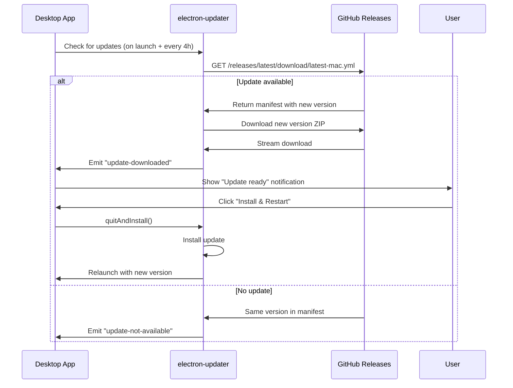

**Sources:** [apps/desktop/src/main/lib/auto-updater.ts:1-286]()

### Update Feed URLs

The auto-updater uses different feed URLs based on the build channel:

```typescript
// Stable channel (no prerelease identifier in version)
const UPDATE_FEED_URL = "https://github.com/superset-sh/superset/releases/latest/download";

// Canary channel (version contains prerelease identifier like "1.2.0-canary")
const UPDATE_FEED_URL = "https://github.com/superset-sh/superset/releases/download/desktop-canary";
```

**Sources:** [apps/desktop/src/main/lib/auto-updater.ts:28-32]()

### Auto-Update Configuration

Key configuration in [apps/desktop/src/main/lib/auto-updater.ts:202-224]():

- `autoDownload: true` - Downloads updates automatically
- `autoInstallOnAppQuit: true` - Installs on next quit
- `disableDifferentialDownload: true` - Downloads full package (more reliable)
- `allowDowngrade: true` (canary only) - Allows switching back to stable

**Sources:** [apps/desktop/src/main/lib/auto-updater.ts:202-224]()

---

## Application Initialization

### Main Process Startup Sequence

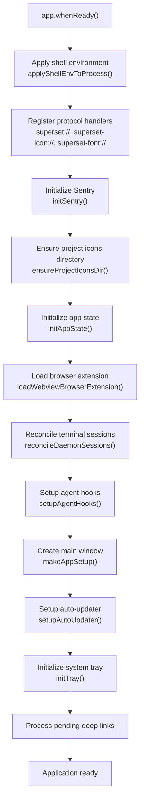

**Sources:** [apps/desktop/src/main/index.ts:283-365]()

### Deep Linking

The application handles `superset://` protocol URLs for authentication and navigation:

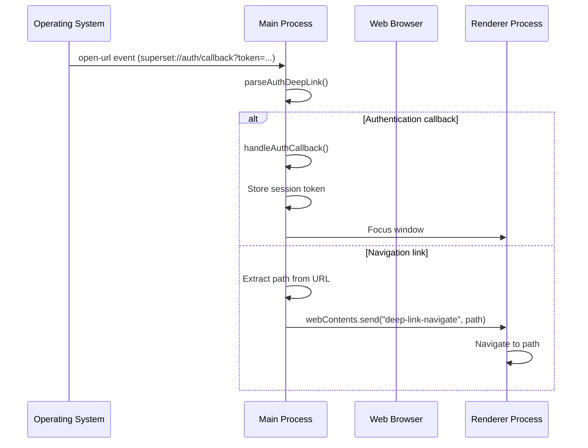

**Sources:** [apps/desktop/src/main/index.ts:69-92]()

### Renderer Process Entry

The renderer process starts from [apps/desktop/src/renderer/index.html]():

1. Theme boot script loads before body ([index.html:6]())
2. Content Security Policy enforces security boundaries ([index.html:20]())
3. React application mounts to `<app>` element ([index.html:24-25]())

**CSP Configuration:**
- `script-src 'self' 'wasm-unsafe-eval'` - Allows WebAssembly for xterm.js ImageAddon
- `connect-src` includes localhost, API URL, Electric URL, PostHog, Sentry, Outlit
- `frame-src https: http: data: blob:` - Allows browser pane webview

**Sources:** [apps/desktop/src/renderer/index.html:1-28]()

---

## Environment Variables

The desktop app uses separate environment configurations for main and renderer processes:

### Main Process Environment

Defined in [apps/desktop/src/main/env.main.ts]() using `@t3-oss/env-core`:

| Variable | Type | Default |
|----------|------|---------|
| `NODE_ENV` | `"development" \| "production" \| "test"` | `"development"` |
| `NEXT_PUBLIC_API_URL` | `URL` | `"https://api.superset.sh"` |
| `NEXT_PUBLIC_ELECTRIC_URL` | `URL` | `"https://electric-proxy.avi-6ac.workers.dev"` |
| `NEXT_PUBLIC_WEB_URL` | `URL` | `"https://app.superset.sh"` |
| `SENTRY_DSN_DESKTOP` | `string` (optional) | - |
| `NEXT_PUBLIC_POSTHOG_KEY` | `string` (optional) | - |

**Sources:** [apps/desktop/src/main/env.main.ts:12-52]()

### Renderer Process Environment

Defined in [apps/desktop/src/renderer/env.renderer.ts]() with build-time injection via Vite:

- Values are replaced by Vite's `define` configuration during build ([electron.vite.config.ts:161-209]())
- The `process.env.*` references become literal strings in the compiled bundle
- Validation uses the same schema but operates on build-time values

**Sources:** [apps/desktop/src/renderer/env.renderer.ts:1-63](), [apps/desktop/electron.vite.config.ts:161-209]()

---

## Data Architecture

The desktop application uses a hybrid data architecture with local SQLite storage and cloud synchronization:

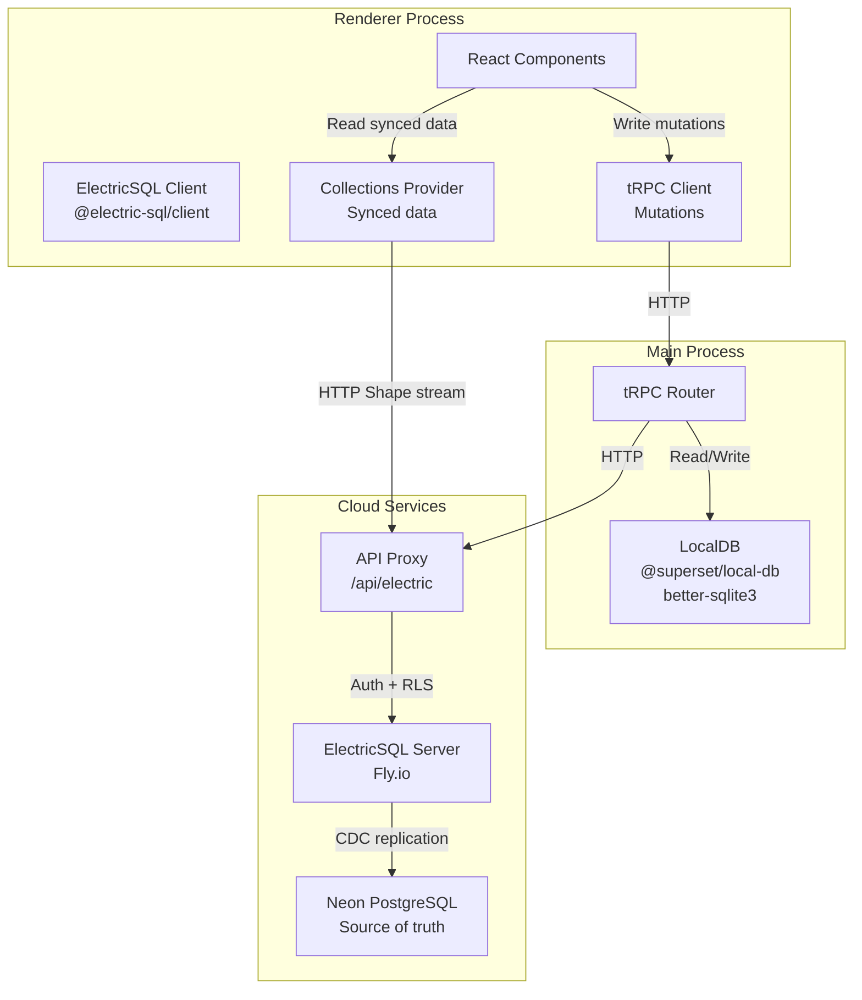

### Local-Only vs Synced Data

| Data Type | Storage | Sync | Example Tables |
|-----------|---------|------|----------------|
| **Local-only** | SQLite (`localDb`) | No | `settings`, `tabs`, `panes` |
| **Cloud-synced** | Neon PostgreSQL | Yes (via Electric) | `projects`, `workspaces`, `organizations` |

**Sources:** [High-level diagrams](), [apps/desktop/src/main/lib/local-db.ts]()

---

## Protocol Handlers

The desktop app registers custom protocol handlers for loading local resources:

### superset-icon://

Serves project icons from the local filesystem:

```typescript
// Example: superset-icon://project-abc123
protocol.handle("superset-icon", (request) => {
  const projectId = new URL(request.url).pathname.replace(/^\//, "");
  const iconPath = getProjectIconPath(projectId);
  return net.fetch(pathToFileURL(iconPath).toString());
});
```

**Sources:** [apps/desktop/src/main/index.ts:289-301]()

### superset-font://

Serves system fonts (macOS only) so the renderer can use `@font-face` with CSP `font-src 'self'`:

```typescript
// Example: superset-font://SFMono-Regular.otf
protocol.handle("superset-font", async (request) => {
  const filename = path.basename(new URL(request.url).pathname);
  // Search system font directories
  for (const dir of SYSTEM_FONT_DIRS) {
    const fontPath = path.join(dir, filename);
    return await net.fetch(pathToFileURL(fontPath).toString());
  }
});
```

**Sources:** [apps/desktop/src/main/index.ts:305-331]()

---

## Security Model

The desktop app follows Electron security best practices:

### Context Isolation

- **Preload script** ([apps/desktop/src/preload/index.ts]()) runs in isolated context
- Exposes limited API surface via `contextBridge`
- Renderer cannot directly access Node.js or Electron APIs

### Content Security Policy

Defined in [apps/desktop/src/renderer/index.html:20]():
- `default-src 'self'` - Only allow same-origin by default
- `script-src 'self' 'wasm-unsafe-eval'` - WebAssembly for xterm.js
- `connect-src` whitelist - API, Electric, PostHog, Sentry, localhost
- No `'unsafe-eval'` - Prevents arbitrary code execution

### IPC Communication

All renderer-to-main communication goes through type-safe tRPC procedures:
- No direct `ipcMain`/`ipcRenderer` usage
- Input validation via Zod schemas
- Type safety enforced at compile time

**Sources:** [apps/desktop/src/renderer/index.html:8-27](), [apps/desktop/src/preload/index.ts]()

---

## Native Module Runtime Dependencies

Several packages require special handling as external native modules:

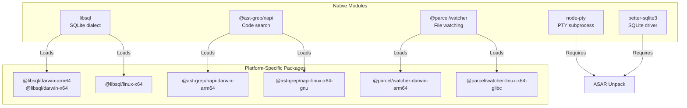

The [apps/desktop/scripts/copy-native-modules.ts]() script handles:
1. Replacing Bun symlinks with real files
2. Fetching platform-specific packages for cross-compilation
3. Ensuring all required native binaries are present

**Sources:** [apps/desktop/scripts/copy-native-modules.ts:1-453](), [apps/desktop/runtime-dependencies.ts](), [apps/desktop/electron-builder.ts:47-53]()