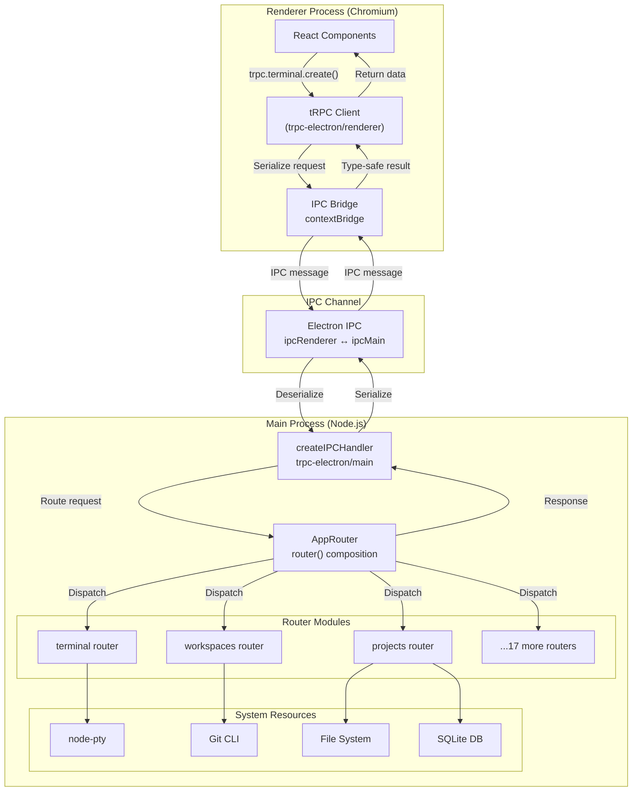

# IPC and tRPC Communication

<details>
<summary>Relevant source files</summary>

The following files were used as context for generating this wiki page:

- [.github/actions/merge-mac-manifests/action.yml](.github/actions/merge-mac-manifests/action.yml)
- [.github/actions/merge-mac-manifests/merge-mac-manifests.mjs](.github/actions/merge-mac-manifests/merge-mac-manifests.mjs)
- [.github/workflows/build-desktop.yml](.github/workflows/build-desktop.yml)
- [.github/workflows/release-desktop-canary.yml](.github/workflows/release-desktop-canary.yml)
- [.github/workflows/release-desktop.yml](.github/workflows/release-desktop.yml)
- [apps/api/src/app/api/auth/desktop/connect/route.ts](apps/api/src/app/api/auth/desktop/connect/route.ts)
- [apps/desktop/BUILDING.md](apps/desktop/BUILDING.md)
- [apps/desktop/RELEASE.md](apps/desktop/RELEASE.md)
- [apps/desktop/create-release.sh](apps/desktop/create-release.sh)
- [apps/desktop/electron-builder.ts](apps/desktop/electron-builder.ts)
- [apps/desktop/electron.vite.config.ts](apps/desktop/electron.vite.config.ts)
- [apps/desktop/package.json](apps/desktop/package.json)
- [apps/desktop/scripts/copy-native-modules.ts](apps/desktop/scripts/copy-native-modules.ts)
- [apps/desktop/src/lib/trpc/routers/projects/projects.ts](apps/desktop/src/lib/trpc/routers/projects/projects.ts)
- [apps/desktop/src/main/env.main.ts](apps/desktop/src/main/env.main.ts)
- [apps/desktop/src/main/index.ts](apps/desktop/src/main/index.ts)
- [apps/desktop/src/main/lib/auto-updater.ts](apps/desktop/src/main/lib/auto-updater.ts)
- [apps/desktop/src/renderer/components/NewWorkspaceModal/NewWorkspaceModal.tsx](apps/desktop/src/renderer/components/NewWorkspaceModal/NewWorkspaceModal.tsx)
- [apps/desktop/src/renderer/components/NewWorkspaceModal/NewWorkspaceModalDraftContext.tsx](apps/desktop/src/renderer/components/NewWorkspaceModal/NewWorkspaceModalDraftContext.tsx)
- [apps/desktop/src/renderer/components/NewWorkspaceModal/components/NewWorkspaceModalContent/NewWorkspaceModalContent.tsx](apps/desktop/src/renderer/components/NewWorkspaceModal/components/NewWorkspaceModalContent/NewWorkspaceModalContent.tsx)
- [apps/desktop/src/renderer/components/NewWorkspaceModal/components/NewWorkspaceModalContent/index.ts](apps/desktop/src/renderer/components/NewWorkspaceModal/components/NewWorkspaceModalContent/index.ts)
- [apps/desktop/src/renderer/components/NewWorkspaceModal/components/PromptGroup/PromptGroup.tsx](apps/desktop/src/renderer/components/NewWorkspaceModal/components/PromptGroup/PromptGroup.tsx)
- [apps/desktop/src/renderer/components/NewWorkspaceModal/components/PromptGroup/components/PRLinkCommand/PRLinkCommand.tsx](apps/desktop/src/renderer/components/NewWorkspaceModal/components/PromptGroup/components/PRLinkCommand/PRLinkCommand.tsx)
- [apps/desktop/src/renderer/components/NewWorkspaceModal/components/PromptGroup/components/PromptGroupAdvancedOptions/PromptGroupAdvancedOptions.tsx](apps/desktop/src/renderer/components/NewWorkspaceModal/components/PromptGroup/components/PromptGroupAdvancedOptions/PromptGroupAdvancedOptions.tsx)
- [apps/desktop/src/renderer/components/NewWorkspaceModal/components/PromptGroup/components/PromptGroupAdvancedOptions/index.ts](apps/desktop/src/renderer/components/NewWorkspaceModal/components/PromptGroup/components/PromptGroupAdvancedOptions/index.ts)
- [apps/desktop/src/renderer/env.renderer.ts](apps/desktop/src/renderer/env.renderer.ts)
- [apps/desktop/src/renderer/index.html](apps/desktop/src/renderer/index.html)
- [apps/desktop/src/renderer/react-query/workspaces/useOpenTrackedWorktree.ts](apps/desktop/src/renderer/react-query/workspaces/useOpenTrackedWorktree.ts)
- [apps/desktop/src/renderer/stores/new-workspace-modal.ts](apps/desktop/src/renderer/stores/new-workspace-modal.ts)
- [apps/desktop/vite/helpers.ts](apps/desktop/vite/helpers.ts)
- [apps/web/src/app/auth/desktop/success/page.tsx](apps/web/src/app/auth/desktop/success/page.tsx)
- [biome.jsonc](biome.jsonc)
- [bun.lock](bun.lock)
- [package.json](package.json)
- [packages/ui/package.json](packages/ui/package.json)
- [scripts/lint.sh](scripts/lint.sh)

</details>

## Purpose and Scope

This document describes the Inter-Process Communication (IPC) system that enables type-safe communication between the Electron main process and renderer process. Superset uses [tRPC](https://trpc.io/) with the `trpc-electron` adapter to expose main process functionality to the renderer through a strongly-typed API. This system provides 20+ specialized routers covering terminal management, Git operations, file system access, workspace management, and more.

For information about specific router implementations (terminals, workspaces, etc.), see their respective sections in [2.6](#2.6) through [2.14](#2.14). For the renderer-side client setup and state management, see [2.11](#2.11).

---

## Architecture Overview

The IPC system follows a client-server architecture where the main process hosts a tRPC router (server) and the renderer process connects via an IPC-based tRPC client. All communication is type-safe and validated at compile-time through TypeScript.

### IPC Communication Flow



**Sources:** [apps/desktop/src/main/windows/main.ts:1-271](), [apps/desktop/src/lib/trpc/routers/index.ts:1-50]()

---

## IPC Handler Lifecycle

### Singleton Pattern

The IPC handler is created as a singleton that persists across window closures and reopenings. This is critical on macOS, where closing the window doesn't quit the application, and reopening requires reattaching to the existing handler rather than creating duplicate handlers.

[apps/desktop/src/main/windows/main.ts:34-35]():

```typescript
// Singleton IPC handler to prevent duplicate handlers on window reopen (macOS)
let ipcHandler: ReturnType<typeof createIPCHandler> | null = null
```

### Handler Creation and Window Attachment

The handler is created once on first window creation and reused for subsequent windows:

[apps/desktop/src/main/windows/main.ts:128-135]():

```typescript
if (ipcHandler) {
  ipcHandler.attachWindow(window)
} else {
  ipcHandler = createIPCHandler({
    router: createAppRouter(getWindow),
    windows: [window],
  })
}
```

The `createAppRouter` function receives a `getWindow` getter that always returns the current window reference, ensuring routers don't hold stale window references:

[apps/desktop/src/main/windows/main.ts:59-62]():

```typescript
let currentWindow: BrowserWindow | null = null

// Routers receive this getter so they always see the current window, not a stale reference
const getWindow = () => currentWindow
```

### Window Detachment on Close

When a window closes, it detaches from the IPC handler but the handler remains alive:

[apps/desktop/src/main/windows/main.ts:265-267]():

```typescript
// Detach window from IPC handler (handler stays alive for window reopen)
ipcHandler?.detachWindow(window)
currentWindow = null
```

**Sources:** [apps/desktop/src/main/windows/main.ts:34-35](), [apps/desktop/src/main/windows/main.ts:59-267]()

---

## AppRouter Structure

### Router Composition

The `AppRouter` is composed of 16 specialized routers, each handling a distinct domain of functionality. The router is created using tRPC's `router()` combinator:

[apps/desktop/src/lib/trpc/routers/index.ts:24-47]():

```typescript
export const createAppRouter = (getWindow: () => BrowserWindow | null) => {
  return router({
    aiChat: createAiChatRouter(),
    analytics: createAnalyticsRouter(),
    auth: createAuthRouter(),
    autoUpdate: createAutoUpdateRouter(),
    cache: createCacheRouter(),
    window: createWindowRouter(getWindow),
    projects: createProjectsRouter(getWindow),
    workspaces: createWorkspacesRouter(),
    terminal: createTerminalRouter(),
    changes: createChangesRouter(),
    filesystem: createFilesystemRouter(),
    notifications: createNotificationsRouter(),
    ports: createPortsRouter(),
    menu: createMenuRouter(),
    hotkeys: createHotkeysRouter(getWindow),
    external: createExternalRouter(),
    settings: createSettingsRouter(),
    config: createConfigRouter(),
    uiState: createUiStateRouter(),
    ringtone: createRingtoneRouter(),
  })
}
```

### Type Export

The `AppRouter` type is exported for use in the renderer process:

[apps/desktop/src/lib/trpc/routers/index.ts:49]():

```typescript
export type AppRouter = ReturnType<typeof createAppRouter>
```

This type is imported by the renderer's tRPC client to provide full type inference for all IPC calls.

**Sources:** [apps/desktop/src/lib/trpc/routers/index.ts:1-50]()

---

## Router Modules

Each router module encapsulates related functionality. Some routers require access to the current window, while others operate independently.

### Router Inventory

| Router Name     | Purpose                                             | Requires Window |
| --------------- | --------------------------------------------------- | --------------- |
| `aiChat`        | AI chat session lifecycle and stream management     | No              |
| `analytics`     | Analytics event tracking                            | No              |
| `auth`          | Authentication flow and session management          | No              |
| `autoUpdate`    | Application auto-update system                      | No              |
| `cache`         | Key-value cache operations                          | No              |
| `window`        | Window state management (maximize, minimize, close) | Yes             |
| `projects`      | Project/repository management, cloning, opening     | Yes             |
| `workspaces`    | Workspace creation, deletion, initialization        | No              |
| `terminal`      | Terminal session management, PTY operations         | No              |
| `changes`       | Git status and change detection                     | No              |
| `filesystem`    | File system operations, directory listing           | No              |
| `notifications` | Notification subscriptions via SSE                  | No              |
| `ports`         | Port availability checking                          | No              |
| `menu`          | Application menu actions and events                 | No              |
| `hotkeys`       | Hotkey configuration management                     | Yes             |
| `external`      | External link handling                              | No              |
| `settings`      | Settings persistence and retrieval                  | No              |
| `config`        | Workspace configuration (setup/teardown scripts)    | No              |
| `uiState`       | UI state persistence (tabs, panes, window state)    | No              |
| `ringtone`      | Notification sound management                       | No              |

### Window-Dependent Routers

Three routers receive the `getWindow` getter because they need direct access to the `BrowserWindow` instance:

- **`window`**: Controls window state (show, focus, maximize, minimize, set bounds)
- **`projects`**: Needs to show file picker dialogs and focus window after operations
- **`hotkeys`**: May need to trigger window-level actions or focus changes

[apps/desktop/src/lib/trpc/routers/index.ts:31-32,40]():

```typescript
window: createWindowRouter(getWindow),
projects: createProjectsRouter(getWindow),
// ...
hotkeys: createHotkeysRouter(getWindow),
```

**Sources:** [apps/desktop/src/lib/trpc/routers/index.ts:1-50]()

---

## Router Architecture Diagram

```mermaid
graph TB
    subgraph "AppRouter Factory"
        CreateAppRouter["createAppRouter(getWindow)"]
    end

    subgraph "Core Infrastructure Routers"
        Window["window<br/>createWindowRouter(getWindow)"]
        Auth["auth<br/>createAuthRouter()"]
        AutoUpdate["autoUpdate<br/>createAutoUpdateRouter()"]
        Cache["cache<br/>createCacheRouter()"]
    end

    subgraph "Development Environment Routers"
        Projects["projects<br/>createProjectsRouter(getWindow)"]
        Workspaces["workspaces<br/>createWorkspacesRouter()"]
        Terminal["terminal<br/>createTerminalRouter()"]
        Changes["changes<br/>createChangesRouter()"]
        Config["config<br/>createConfigRouter()"]
    end

    subgraph "File and System Routers"
        Filesystem["filesystem<br/>createFilesystemRouter()"]
        Ports["ports<br/>createPortsRouter()"]
        External["external<br/>createExternalRouter()"]
    end

    subgraph "UI and User Experience Routers"
        UIState["uiState<br/>createUiStateRouter()"]
        Settings["settings<br/>createSettingsRouter()"]
        Hotkeys["hotkeys<br/>createHotkeysRouter(getWindow)"]
        Menu["menu<br/>createMenuRouter()"]
        Notifications["notifications<br/>createNotificationsRouter()"]
        Ringtone["ringtone<br/>createRingtoneRouter()"]
    end

    subgraph "AI Features Routers"
        AIChat["aiChat<br/>createAiChatRouter()"]
        Analytics["analytics<br/>createAnalyticsRouter()"]
    end

    CreateAppRouter --> Window
    CreateAppRouter --> Auth
    CreateAppRouter --> AutoUpdate
    CreateAppRouter --> Cache

    CreateAppRouter --> Projects
    CreateAppRouter --> Workspaces
    CreateAppRouter --> Terminal
    CreateAppRouter --> Changes
    CreateAppRouter --> Config

    CreateAppRouter --> Filesystem
    CreateAppRouter --> Ports
    CreateAppRouter --> External

    CreateAppRouter --> UIState
    CreateAppRouter --> Settings
    CreateAppRouter --> Hotkeys
    CreateAppRouter --> Menu
    CreateAppRouter --> Notifications
    CreateAppRouter --> Ringtone

    CreateAppRouter --> AIChat
    CreateAppRouter --> Analytics
```



**Sources:** [apps/desktop/src/lib/trpc/routers/index.ts:24-46]()

---

## Type Safety Mechanism

### Type Inference Flow

The tRPC system provides end-to-end type safety through TypeScript type inference. The flow works as follows:

1. **Router Definition**: Each router defines procedures with input schemas (using Zod) and return types
2. **Type Export**: `AppRouter` type is exported from the main process
3. **Client Import**: Renderer imports `AppRouter` type (not runtime code)
4. **Type Inference**: tRPC client uses the type to infer all procedure signatures
5. **Compile-Time Validation**: TypeScript ensures all calls match the router's signature

```mermaid
graph LR
    subgraph "Main Process"
        RouterImpl["Router Implementation<br/>procedures with<br/>input/output types"]
        AppRouterType["export type AppRouter"]
    end

    subgraph "Type System"
        TypeDef["AppRouter Type Definition<br/>(compile-time only)"]
    end

    subgraph "Renderer Process"
        ClientImport["import type { AppRouter }"]
        TRPCClient["trpc client with<br/>AppRouter type parameter"]
        ComponentCall["Component calls<br/>trpc.terminal.create()"]
    end

    RouterImpl -->|"ReturnType<typeof createAppRouter>"| AppRouterType
    AppRouterType -->|"Type export (no runtime)"| TypeDef
    TypeDef -->|"Type import"| ClientImport
    ClientImport -->|"Generic parameter"| TRPCClient
    TRPCClient -->|"Fully typed"| ComponentCall
```



### Runtime Type Validation

Input validation occurs at runtime using Zod schemas defined in each procedure's `.input()` method. This provides:

- **Input validation**: Malformed requests are rejected before reaching handler code
- **Type coercion**: Strings are converted to numbers, dates, etc. as specified
- **Error messages**: Clear validation errors for debugging

**Sources:** [apps/desktop/src/lib/trpc/routers/index.ts:49]()

---

## Communication Patterns

### Request-Response Pattern

Most procedures use the standard request-response pattern with `.query()` (read-only) or `.mutation()` (write operations):

```typescript
// Example structure (not actual code)
router({
  terminal: router({
    create: mutation()
      .input(z.object({ cwd: z.string() }))
      .mutation(async ({ input }) => {
        // Create terminal session
        return { paneId: 'terminal-123' }
      }),

    getStatus: query()
      .input(z.object({ paneId: z.string() }))
      .query(async ({ input }) => {
        // Return status
        return { isRunning: true }
      }),
  }),
})
```

### Observable Pattern for Streaming

For streaming data (terminal output, notifications), routers use `.subscription()` procedures that return observables:

```typescript
// Example structure (not actual code)
router({
  terminal: router({
    stream: subscription()
      .input(z.object({ paneId: z.string() }))
      .subscription(({ input }) => {
        return observable((emit) => {
          // Emit data as it arrives
          pty.on('data', (data) => emit.next({ data }))

          return () => {
            // Cleanup on unsubscribe
          }
        })
      }),
  }),
})
```

The renderer subscribes to these observables and receives real-time updates as they occur.

### Error Handling

tRPC procedures can throw `TRPCError` instances which are serialized and sent back to the renderer with proper error codes:

```typescript
// Example error pattern (not actual code)
if (!isValidWorkspace) {
  throw new TRPCError({
    code: 'BAD_REQUEST',
    message: 'Invalid workspace ID',
  })
}
```

The renderer receives these as typed errors that can be handled appropriately in the UI.

**Sources:** Based on tRPC patterns referenced throughout [apps/desktop/src/lib/trpc/routers/index.ts:1-50]()

---

## Integration with Event Systems

### Menu Event Emitter

The menu system uses a separate event emitter for application menu actions, which is then exposed through the `menu` router:

[apps/desktop/src/main/lib/menu.ts:113]():

```typescript
menuEmitter.emit('open-settings', 'keyboard')
```

This pattern allows menu actions (triggered by keyboard accelerators or menu clicks) to be communicated to the renderer through tRPC subscriptions.

### Hotkey Updates

The hotkey system uses an event emitter to notify when hotkey configurations change, triggering menu updates:

[apps/desktop/src/main/lib/menu.ts:31-37]():

```typescript
export function registerMenuHotkeyUpdates() {
  if (isHotkeyListenerRegistered) return
  isHotkeyListenerRegistered = true
  hotkeysEmitter.on('change', () => {
    createApplicationMenu()
  })
}
```

The menu then reflects updated keyboard accelerators from the hotkey configuration.

**Sources:** [apps/desktop/src/main/lib/menu.ts:1-190]()

---

## Summary

The IPC and tRPC system provides:

- **Type-safe communication** between renderer and main processes
- **Modular router architecture** with 16 specialized routers
- **Singleton handler lifecycle** that persists across window reopenings
- **Multiple communication patterns**: queries, mutations, and observables
- **Full type inference** from main process to renderer at compile-time
- **Runtime validation** using Zod schemas
- **Integration points** with native event systems (menu, hotkeys)

This architecture enables the renderer to remain sandboxed while accessing system-level functionality (PTY, Git, file system) through a strongly-typed, validated API surface.
