# Settings Management

<details>
<summary>Relevant source files</summary>

The following files were used as context for generating this wiki page:

- [apps/desktop/src/lib/trpc/routers/projects/utils/favicon-discovery.ts](apps/desktop/src/lib/trpc/routers/projects/utils/favicon-discovery.ts)
- [apps/desktop/src/lib/trpc/routers/settings/index.ts](apps/desktop/src/lib/trpc/routers/settings/index.ts)
- [apps/desktop/src/main/lib/project-icons.ts](apps/desktop/src/main/lib/project-icons.ts)
- [apps/desktop/src/renderer/routes/_authenticated/settings/behavior/components/BehaviorSettings/BehaviorSettings.tsx](apps/desktop/src/renderer/routes/_authenticated/settings/behavior/components/BehaviorSettings/BehaviorSettings.tsx)
- [apps/desktop/src/renderer/routes/_authenticated/settings/project/$projectId/components/ProjectSettings/ProjectSettings.tsx](apps/desktop/src/renderer/routes/_authenticated/settings/project/$projectId/components/ProjectSettings/ProjectSettings.tsx)
- [apps/desktop/src/renderer/routes/_authenticated/settings/project/$projectId/general/page.tsx](apps/desktop/src/renderer/routes/_authenticated/settings/project/$projectId/general/page.tsx)
- [apps/desktop/src/renderer/routes/_authenticated/settings/utils/settings-search/settings-search.ts](apps/desktop/src/renderer/routes/_authenticated/settings/utils/settings-search/settings-search.ts)
- [apps/desktop/src/shared/constants.ts](apps/desktop/src/shared/constants.ts)
- [packages/local-db/drizzle/meta/_journal.json](packages/local-db/drizzle/meta/_journal.json)
- [packages/local-db/src/schema/schema.ts](packages/local-db/src/schema/schema.ts)

</details>


This document describes the settings management system in the Superset desktop application, covering storage architecture, access patterns, and the various categories of user preferences. The system manages both global user settings and project-specific overrides through a local SQLite database accessed via tRPC procedures.

For information about terminal-specific configuration like presets and agent definitions, see [2.11.2 Terminal and Agent Presets](#2.11.2). For project-level settings and their relationship to global settings, see [2.11.3 Project-Specific Settings](#2.11.3).

---

## Storage Architecture

The settings system uses a **single-row pattern** in the `settings` SQLite table. All user preferences are stored in a single row with `id=1`, where each column represents a different setting. This design allows for simple atomic updates and graceful handling of unset values.

### Single-Row Pattern

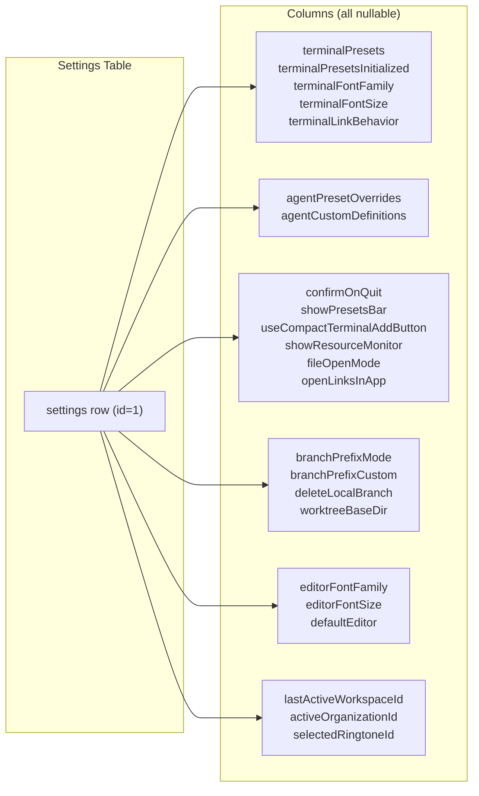

**Sources:** [packages/local-db/src/schema/schema.ts:173-219]()

The `getSettings()` helper function ensures the row exists by inserting a new row if none is found:

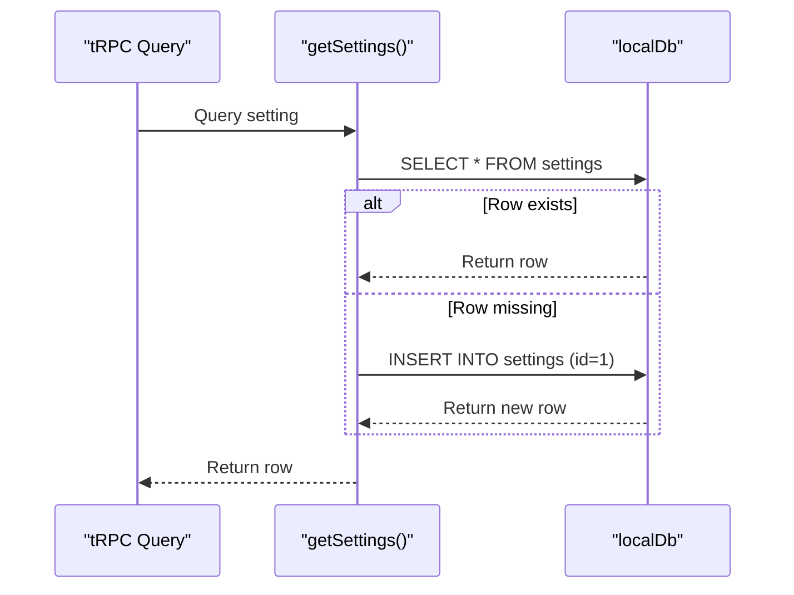

**Sources:** [apps/desktop/src/lib/trpc/routers/settings/index.ts:73-79]()

---

## Schema Evolution

The settings schema has evolved through **36+ migrations**, showing incremental feature additions without breaking changes. The migration journal tracks each schema change with timestamps and version numbers.

### Key Migrations Timeline

| Migration | Date | Description |
|-----------|------|-------------|
| 0003 | Jan 2025 | Added `confirmOnQuit` setting |
| 0004 | Jan 2025 | Added `terminalLinkBehavior` setting |
| 0013 | Jan 2025 | Added `autoApplyDefaultPreset` flag |
| 0014 | Jan 2025 | Added `branchPrefixMode` and `branchPrefixCustom` |
| 0015 | Jan 2025 | Added `notificationSoundsMuted` |
| 0018 | Jan 2025 | Added `deleteLocalBranch` setting |
| 0020 | Jan 2025 | Added `fileOpenMode` setting |
| 0023 | Jan 2025 | Added `showPresetsBar` setting |
| 0028 | Jan 2025 | Added `showResourceMonitor` setting |
| 0031 | Jan 2025 | Added `openLinksInApp` setting |
| 0034 | Jan 2025 | Added `useCompactTerminalAddButton` setting |
| 0036 | Jan 2025 | Added agent settings (`agentPresetOverrides`, `agentCustomDefinitions`) |

**Sources:** [packages/local-db/drizzle/meta/_journal.json:1-264]()

This incremental approach allows the application to:
- Add new features without requiring data migrations
- Maintain backward compatibility
- Use nullable columns with default values
- Gracefully handle missing settings

---

## Settings Access Patterns

The settings system uses tRPC procedures for all read and write operations. Each setting has a pair of procedures: a query to read the value and a mutation to update it.

### Read Pattern: Queries with Defaults

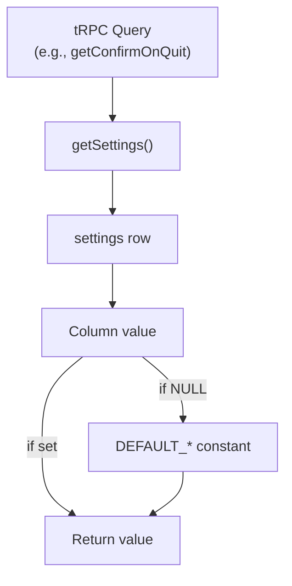

**Example:** The `getConfirmOnQuit` query reads the `confirmOnQuit` column and falls back to `DEFAULT_CONFIRM_ON_QUIT` if the value is NULL:

**Sources:** [apps/desktop/src/lib/trpc/routers/settings/index.ts:468-471](), [apps/desktop/src/shared/constants.ts:43]()

### Write Pattern: Atomic Upsert Mutations

All settings mutations use the **insert-on-conflict-update** pattern for atomic upserts:

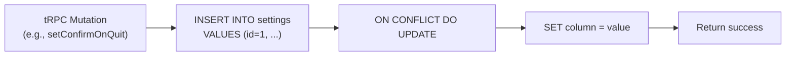

**Sources:** [apps/desktop/src/lib/trpc/routers/settings/index.ts:473-486]()

This pattern ensures:
- **Atomicity:** Row creation and update are atomic
- **Safety:** No race conditions between read and write
- **Simplicity:** Single operation for both insert and update

---

## Settings Categories

The settings system organizes preferences into logical categories, each with dedicated UI sections and tRPC procedures.

### Terminal Settings

| Setting | Column | Type | Default | Description |
|---------|--------|------|---------|-------------|
| Terminal Presets | `terminalPresets` | JSON | Built-in agents | Preset commands and configurations |
| Presets Initialized | `terminalPresetsInitialized` | Boolean | `false` | Flag to prevent re-initialization |
| Terminal Font Family | `terminalFontFamily` | String | NULL | Custom font for terminals |
| Terminal Font Size | `terminalFontSize` | Integer | NULL | Font size for terminals |
| Link Behavior | `terminalLinkBehavior` | Enum | `"file-viewer"` | How to open links from terminal |
| Show Presets Bar | `showPresetsBar` | Boolean | `true` | Display presets toolbar |
| Compact Add Button | `useCompactTerminalAddButton` | Boolean | `true` | Use compact terminal add button |

**Sources:** [packages/local-db/src/schema/schema.ts:176-210](), [apps/desktop/src/shared/constants.ts:40-51]()

### Agent Settings

Agent configurations use a **three-layer system** stored in JSON columns:

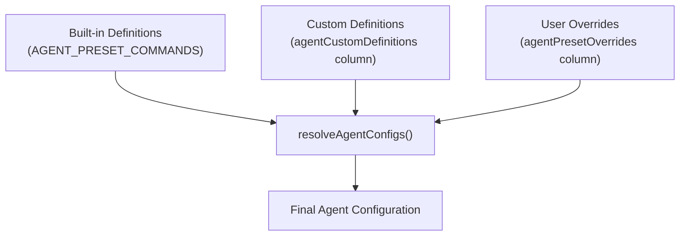

**Sources:** [apps/desktop/src/lib/trpc/routers/settings/index.ts:130-135](), [shared/utils/agent-settings]()

The `agentPresetOverrides` column uses a **versioned envelope** structure to support future schema migrations:

```typescript
{
  version: 1,
  presets: [
    { id: "agent-id", overrides: { /* ... */ } }
  ]
}
```

**Sources:** [apps/desktop/src/lib/trpc/routers/settings/index.ts:106-109]()

### UI Behavior Settings

| Setting | Column | Type | Default | Description |
|---------|--------|------|---------|-------------|
| Confirm on Quit | `confirmOnQuit` | Boolean | `true` | Show confirmation dialog when quitting |
| File Open Mode | `fileOpenMode` | Enum | `"split-pane"` | How to open files (split-pane or new-tab) |
| Show Resource Monitor | `showResourceMonitor` | Boolean | `true` | Display CPU/memory usage in top bar |
| Open Links in App | `openLinksInApp` | Boolean | `false` | Use built-in browser for links |
| Notification Sounds Muted | `notificationSoundsMuted` | Boolean | `false` | Mute notification sounds |

**Sources:** [packages/local-db/src/schema/schema.ts:190-217](), [apps/desktop/src/shared/constants.ts:43-51]()

### Git Workflow Settings

| Setting | Column | Type | Default | Description |
|---------|--------|------|---------|-------------|
| Branch Prefix Mode | `branchPrefixMode` | Enum | `"none"` | Mode for branch prefixes (none, author, github, custom) |
| Branch Prefix Custom | `branchPrefixCustom` | String | NULL | Custom prefix when mode is "custom" |
| Delete Local Branch | `deleteLocalBranch` | Boolean | `false` | Delete local branch when removing workspace |
| Worktree Base Dir | `worktreeBaseDir` | String | NULL | Global base directory for worktrees |

**Sources:** [packages/local-db/src/schema/schema.ts:200-216](), [apps/desktop/src/lib/trpc/routers/settings/index.ts:597-630]()

### Font Settings

Font customization is available separately for terminals and editors:

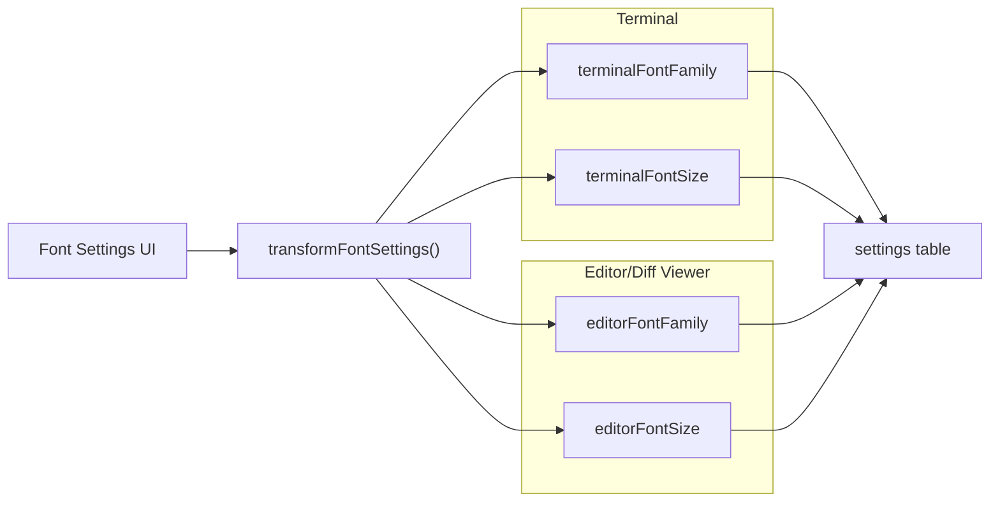

**Sources:** [packages/local-db/src/schema/schema.ts:211-214](), [apps/desktop/src/lib/trpc/routers/settings/index.ts:682-711]()

Font settings are validated and transformed before storage using `transformFontSettings()` from the font-settings utility module.

**Sources:** [apps/desktop/src/lib/trpc/routers/settings/font-settings.utils.ts]()

### Reference Settings

| Setting | Column | Description |
|---------|--------|-------------|
| Last Active Workspace | `lastActiveWorkspaceId` | ID of the most recently active workspace |
| Active Organization | `activeOrganizationId` | Currently selected organization for ElectricSQL sync |
| Selected Ringtone | `selectedRingtoneId` | ID of the notification ringtone |
| Default Editor | `defaultEditor` | Global default application for opening files |

**Sources:** [packages/local-db/src/schema/schema.ts:175-218]()

---

## Project-Specific Settings

Some settings support **project-level overrides** that take precedence over global settings. These are stored in the `projects` table rather than the `settings` table.

### Override Hierarchy

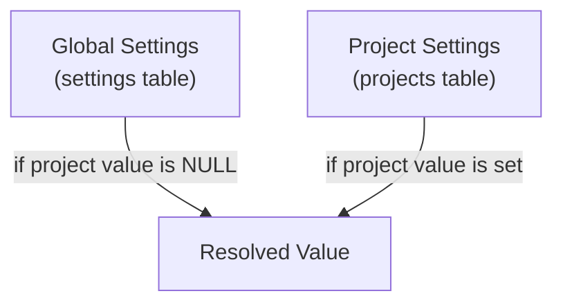

### Supported Project Overrides

| Global Setting | Project Column | Description |
|----------------|----------------|-------------|
| Branch Prefix Mode | `branchPrefixMode` | Override global branch prefix mode |
| Branch Prefix Custom | `branchPrefixCustom` | Override custom branch prefix |
| Worktree Base Dir | `worktreeBaseDir` | Override global worktree location |
| Default Editor | `defaultApp` | Override global default application |

**Additional project-only setting:**
- `workspaceBaseBranch` - Default base branch for new workspaces (no global equivalent)

**Sources:** [packages/local-db/src/schema/schema.ts:42-48](), [apps/desktop/src/renderer/routes/_authenticated/settings/project/$projectId/components/ProjectSettings/ProjectSettings.tsx:172-211]()

### Resolution Logic Example

When creating a new workspace, the system resolves the branch prefix:

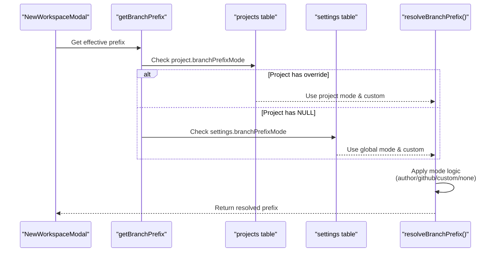

**Sources:** [apps/desktop/src/renderer/routes/_authenticated/settings/project/$projectId/components/ProjectSettings/ProjectSettings.tsx:255-274]()

---

## Terminal Presets System

Terminal presets are a special category of settings that support **lazy initialization** and **default presets**.

### Preset Storage Structure

Presets are stored as a JSON array in the `terminalPresets` column:

```typescript
[
  {
    id: "uuid",
    name: "Claude",
    description: "Launch Claude with context",
    cwd: "",
    commands: ["claude --context"],
    executionMode: "new-tab",
    isDefault?: true,
    applyOnWorkspaceCreated?: true,
    applyOnNewTab?: true,
    pinnedToBar?: true
  }
]
```

**Sources:** [packages/local-db/src/schema/schema.ts:176-178]()

### Lazy Initialization Flow

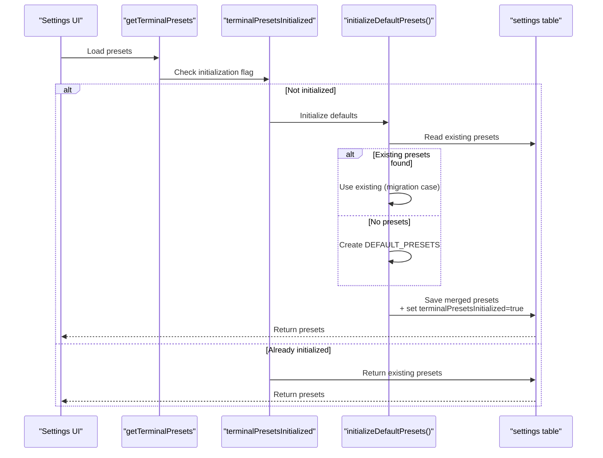

**Sources:** [apps/desktop/src/lib/trpc/routers/settings/index.ts:155-173](), [apps/desktop/src/lib/trpc/routers/settings/index.ts:188-194]()

### Default Presets

The system provides **six default presets** for common AI agents:

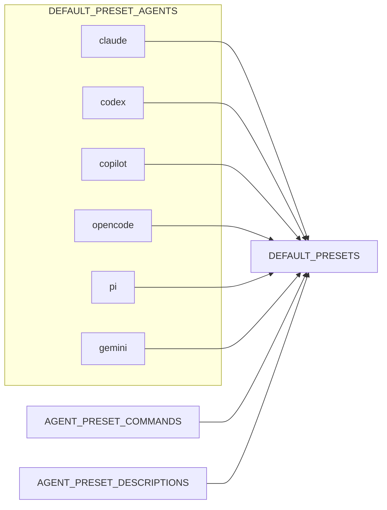

**Sources:** [apps/desktop/src/lib/trpc/routers/settings/index.ts:137-153]()

### Preset Auto-Apply System

Presets can be automatically applied on specific triggers:

| Trigger | Field | Description |
|---------|-------|-------------|
| Workspace Creation | `applyOnWorkspaceCreated` | Apply when new workspace is created |
| New Tab | `applyOnNewTab` | Apply when new terminal tab is opened |
| Default (legacy) | `isDefault` | Legacy flag migrated to explicit triggers |

**Sources:** [apps/desktop/src/lib/trpc/routers/settings/index.ts:175-184](), [apps/desktop/src/lib/trpc/routers/settings/index.ts:334-372]()

---

## Settings tRPC Router

The settings router exposes **50+ tRPC procedures** for managing all aspects of user preferences. All procedures follow consistent naming conventions and patterns.

### Router Structure

```mermaid
graph TB
    SettingsRouter["createSettingsRouter()"]
    
    subgraph "Terminal Procedures"
        GetPresets["getTerminalPresets"]
        CreatePreset["createTerminalPreset"]
        UpdatePreset["updateTerminalPreset"]
        DeletePreset["deleteTerminalPreset"]
        SetDefault["setDefaultPreset"]
        SetAutoApply["setPresetAutoApply"]
        Reorder["reorderTerminalPresets"]
    end
    
    subgraph "Agent Procedures"
        GetAgents["getAgentPresets"]
        UpdateAgent["updateAgentPreset"]
        ResetAgent["resetAgentPreset"]
        ResetAll["resetAllAgentPresets"]
    end
    
    subgraph "Behavior Procedures"
        GetConfirm["getConfirmOnQuit"]
        SetConfirm["setConfirmOnQuit"]
        GetFileMode["getFileOpenMode"]
        SetFileMode["setFileOpenMode"]
        GetResource["getShowResourceMonitor"]
        SetResource["setShowResourceMonitor"]
        GetLinks["getOpenLinksInApp"]
        SetLinks["setOpenLinksInApp"]
    end
    
    subgraph "Git Procedures"
        GetBranch["getBranchPrefix"]
        SetBranch["setBranchPrefix"]
        GetDelete["getDeleteLocalBranch"]
        SetDelete["setDeleteLocalBranch"]
        GetWorktree["getWorktreeBaseDir"]
        SetWorktree["setWorktreeBaseDir"]
    end
    
    subgraph "Font Procedures"
        GetFont["getFontSettings"]
        SetFont["setFontSettings"]
    end
    
    subgraph "Utility Procedures"
        Restart["restartApp"]
        GetGitInfo["getGitInfo"]
    end
    
    SettingsRouter --> GetPresets
    SettingsRouter --> GetAgents
    SettingsRouter --> GetConfirm
    SettingsRouter --> GetBranch
    SettingsRouter --> GetFont
    SettingsRouter --> Restart
```

**Sources:** [apps/desktop/src/lib/trpc/routers/settings/index.ts:186-813]()

### Procedure Naming Convention

| Pattern | Example | Purpose |
|---------|---------|---------|
| `get<Setting>` | `getConfirmOnQuit` | Query current value |
| `set<Setting>` | `setConfirmOnQuit` | Update value |
| `get<Entity>s` | `getTerminalPresets` | Query collection |
| `create<Entity>` | `createTerminalPreset` | Create new item |
| `update<Entity>` | `updateTerminalPreset` | Update existing item |
| `delete<Entity>` | `deleteTerminalPreset` | Remove item |

---

## Settings UI Architecture

The settings UI is organized into sections with a **searchable interface** that allows users to filter settings by keywords.

### Settings Search System

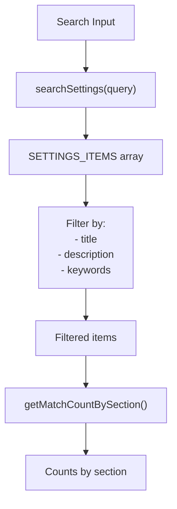

**Sources:** [apps/desktop/src/renderer/routes/_authenticated/settings/utils/settings-search/settings-search.ts:989-1012]()

### Settings Items Metadata

Each setting has metadata for search and display:

```typescript
{
  id: "behavior-confirm-quit",
  section: "behavior",
  title: "Confirm before quitting",
  description: "Show a confirmation dialog when quitting the app",
  keywords: ["features", "confirm", "quit", "exit", "close", "dialog"]
}
```

The `SETTINGS_ITEMS` array contains **80+ indexed settings** across all categories.

**Sources:** [apps/desktop/src/renderer/routes/_authenticated/settings/utils/settings-search/settings-search.ts:83-987]()

### Setting Sections

| Section ID | Description | Example Settings |
|------------|-------------|------------------|
| `account` | User account and profile | Profile, sign out |
| `organization` | Organization management | Name, members, logo |
| `appearance` | Visual customization | Theme, fonts, markdown style |
| `ringtones` | Notification sounds | Ringtone selection |
| `keyboard` | Keyboard shortcuts | Hotkey bindings |
| `behavior` | General behavior | Confirm quit, file open mode, resource monitor |
| `git` | Git workflow | Branch prefix, worktree location |
| `agents` | AI agent configuration | Enabled agents, commands, prompts |
| `terminal` | Terminal settings | Presets, sessions, link behavior |
| `models` | AI model auth | Anthropic, OpenAI credentials |
| `integrations` | External services | Linear, GitHub, Slack |
| `billing` | Subscription management | Plans, usage |
| `project` | Project-specific settings | Branch prefix override, scripts |
| `apikeys` | API key management | MCP server keys |
| `permissions` | System permissions | Disk access, accessibility |

**Sources:** [apps/desktop/src/renderer/stores/settings-state.ts]()

### Visibility Filtering

The UI supports filtering visible items based on search results:

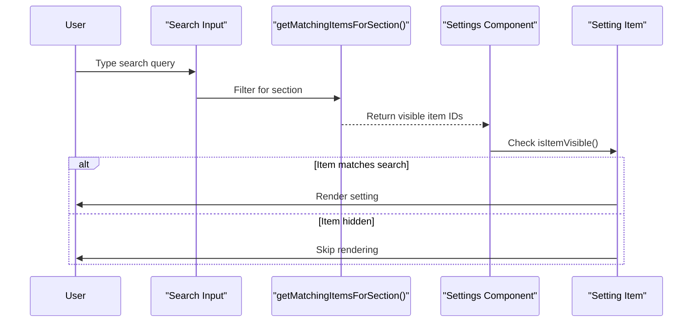

**Sources:** [apps/desktop/src/renderer/routes/_authenticated/settings/utils/settings-search/settings-search.ts:1014-1027](), [apps/desktop/src/renderer/routes/_authenticated/settings/behavior/components/BehaviorSettings/BehaviorSettings.tsx:23-42]()

---

## Default Values and Constants

All settings use constants for default values, ensuring consistency across the application.

### Constants Module

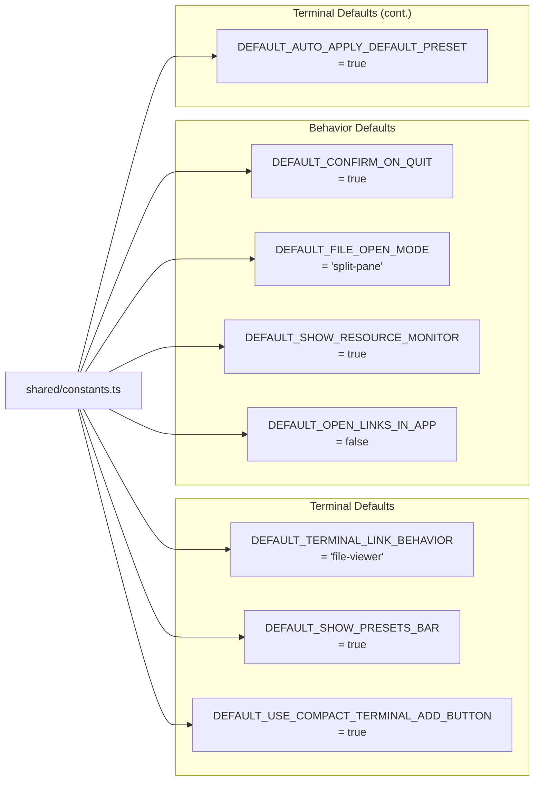

**Sources:** [apps/desktop/src/shared/constants.ts:43-51]()

These constants are referenced throughout the settings router when querying NULL values:

```typescript
getConfirmOnQuit: publicProcedure.query(() => {
  const row = getSettings();
  return row.confirmOnQuit ?? DEFAULT_CONFIRM_ON_QUIT;
})
```

**Sources:** [apps/desktop/src/lib/trpc/routers/settings/index.ts:468-471]()

---

## Special Settings Features

### Ringtone Validation

The ringtone system validates selected ringtones against available built-in and custom ringtones:

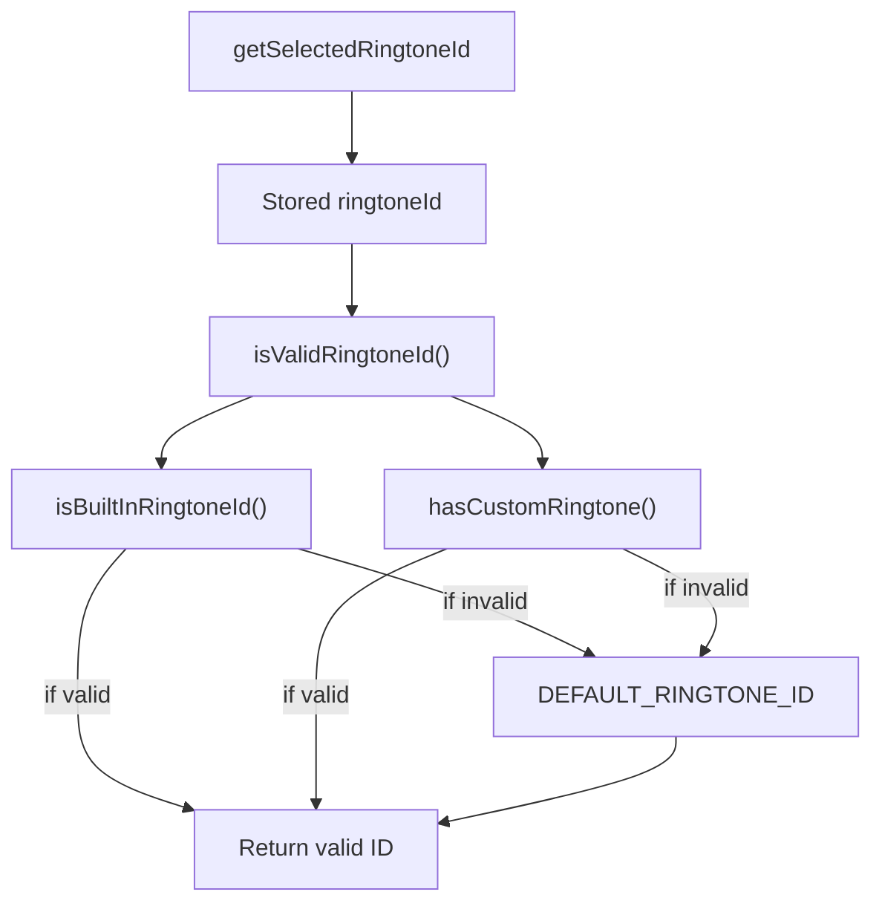

If an invalid ringtone ID is detected, the system automatically resets it to the default:

**Sources:** [apps/desktop/src/lib/trpc/routers/settings/index.ts:420-444]()

### App Restart

The `restartApp` mutation triggers an application restart, using the `quitWithoutConfirmation` helper to bypass the quit confirmation dialog:

**Sources:** [apps/desktop/src/lib/trpc/routers/settings/index.ts:591-595]()

### Git Information Query

The `getGitInfo` procedure retrieves Git configuration for use in branch prefix resolution:

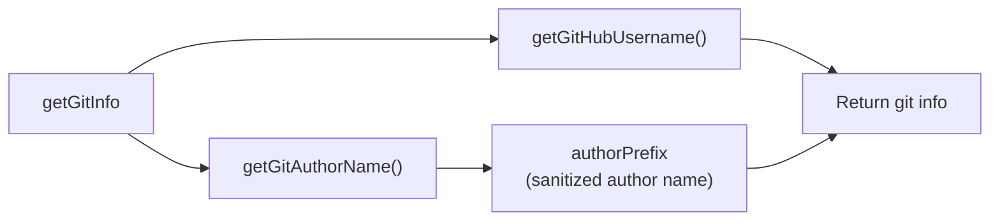

**Sources:** [apps/desktop/src/lib/trpc/routers/settings/index.ts:632-640]()

This information is used when resolving branch prefixes in "author" or "github" mode.

---

## Project Icon Management

Project settings include a custom icon system that stores images on disk and references them via protocol URLs.

### Icon Storage Flow

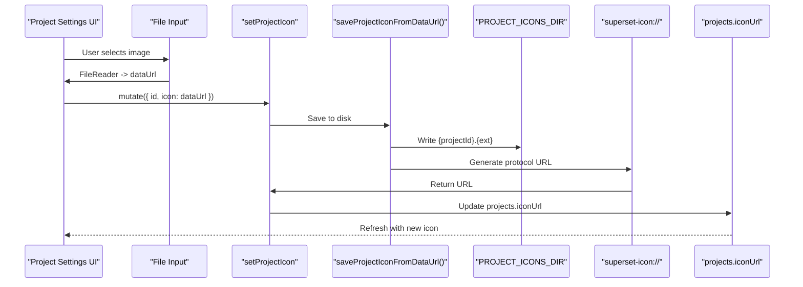

**Sources:** [apps/desktop/src/renderer/routes/_authenticated/settings/project/$projectId/components/ProjectSettings/ProjectSettings.tsx:144-166](), [apps/desktop/src/main/lib/project-icons.ts:82-111]()

### Icon Discovery

When a project is opened, the system attempts to discover a favicon or logo:

**Sources:** [apps/desktop/src/lib/trpc/routers/projects/utils/favicon-discovery.ts:40-86]()

The discovery system searches for common patterns like:
- `favicon.ico`, `favicon.png`, `favicon.svg`
- `logo.png`, `logo.svg`
- `public/favicon.*`
- `.github/logo.*`

Icons are subject to size limits (256KB for discovered, 512KB for uploaded).

**Sources:** [apps/desktop/src/lib/trpc/routers/projects/utils/favicon-discovery.ts:10-34](), [apps/desktop/src/main/lib/project-icons.ts:10]()