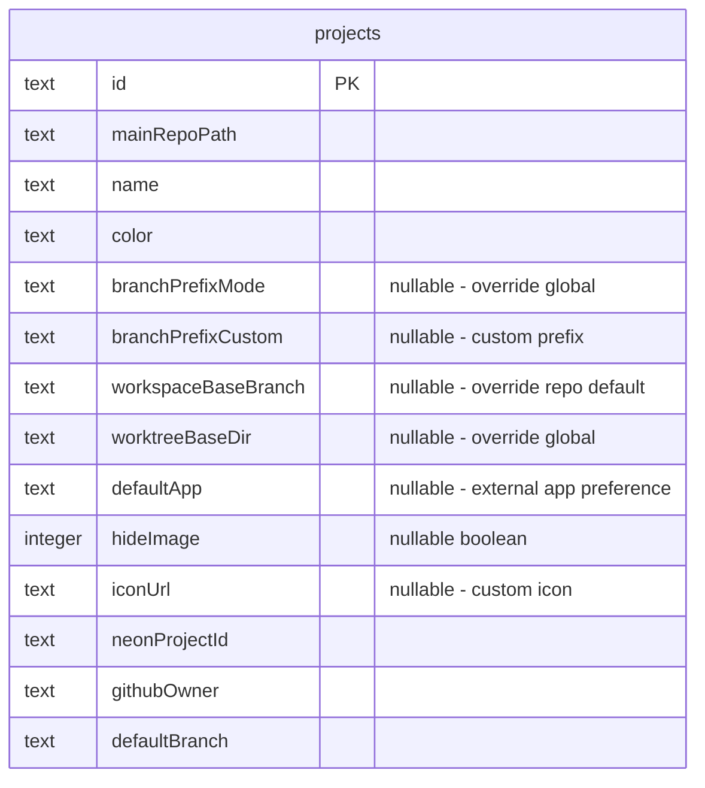
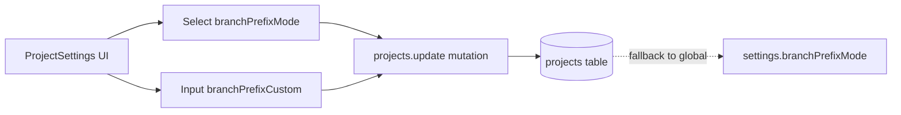
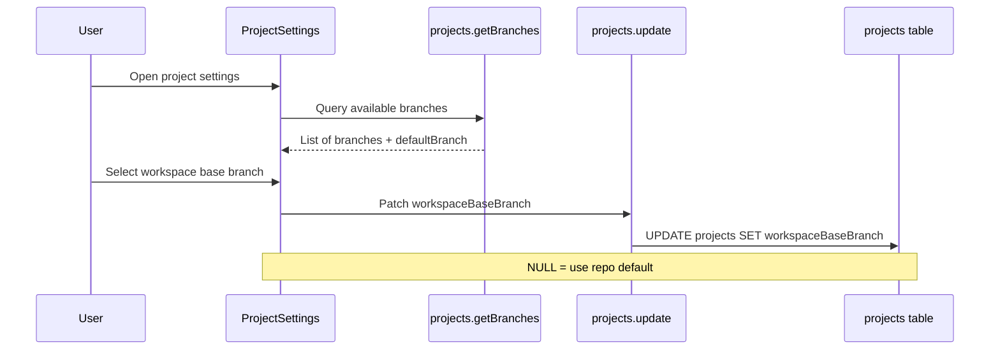
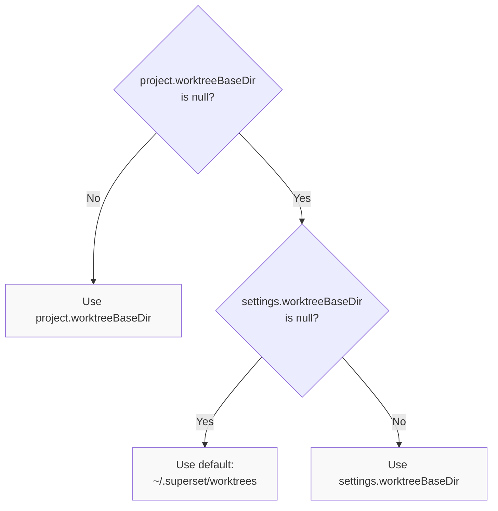
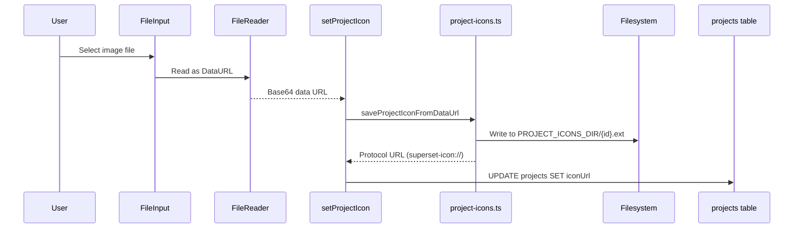
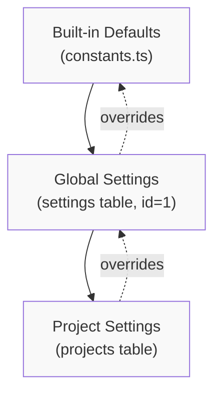
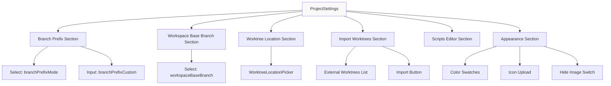
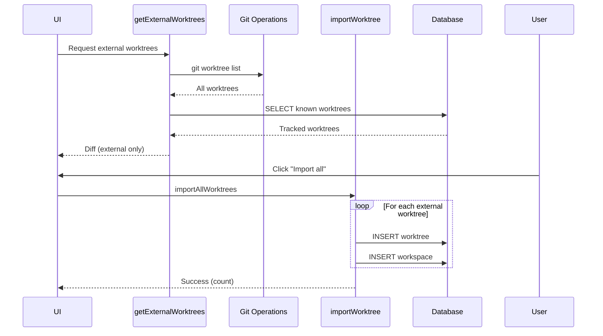
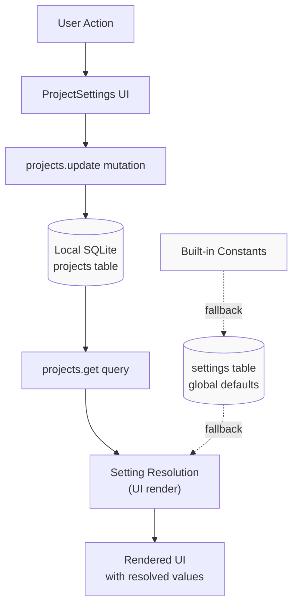

# Project-Specific Settings

<details>
<summary>Relevant source files</summary>

The following files were used as context for generating this wiki page:

- [apps/desktop/src/lib/trpc/routers/projects/utils/favicon-discovery.ts](apps/desktop/src/lib/trpc/routers/projects/utils/favicon-discovery.ts)
- [apps/desktop/src/lib/trpc/routers/settings/index.ts](apps/desktop/src/lib/trpc/routers/settings/index.ts)
- [apps/desktop/src/main/lib/project-icons.ts](apps/desktop/src/main/lib/project-icons.ts)
- [apps/desktop/src/renderer/routes/_authenticated/settings/behavior/components/BehaviorSettings/BehaviorSettings.tsx](apps/desktop/src/renderer/routes/_authenticated/settings/behavior/components/BehaviorSettings/BehaviorSettings.tsx)
- [apps/desktop/src/renderer/routes/_authenticated/settings/project/$projectId/components/ProjectSettings/ProjectSettings.tsx](apps/desktop/src/renderer/routes/_authenticated/settings/project/$projectId/components/ProjectSettings/ProjectSettings.tsx)
- [apps/desktop/src/renderer/routes/_authenticated/settings/project/$projectId/general/page.tsx](apps/desktop/src/renderer/routes/_authenticated/settings/project/$projectId/general/page.tsx)
- [apps/desktop/src/renderer/routes/_authenticated/settings/utils/settings-search/settings-search.ts](apps/desktop/src/renderer/routes/_authenticated/settings/utils/settings-search/settings-search.ts)
- [apps/desktop/src/shared/constants.ts](apps/desktop/src/shared/constants.ts)
- [packages/local-db/drizzle/meta/_journal.json](packages/local-db/drizzle/meta/_journal.json)
- [packages/local-db/src/schema/schema.ts](packages/local-db/src/schema/schema.ts)

</details>


This page documents the project-specific settings system, which allows users to configure per-project overrides for Git behavior, worktree location, external app preferences, and visual appearance. These settings are stored in the `projects` table and take precedence over global settings.

For global settings that apply across all projects, see [Settings Schema and Storage](#2.11.1). For terminal and agent preset configuration, see [Terminal and Agent Presets](#2.11.2).

---

## Overview

Project-specific settings provide granular control over workspace creation, Git operations, and project appearance on a per-repository basis. These settings override global defaults when present, allowing customization for different repository workflows.

**Key Capabilities:**
- Override branch prefix mode for workspace creation
- Set project-specific default base branch
- Configure custom worktree storage location
- Assign default external applications
- Customize sidebar appearance (color, icon)

**Sources:** [packages/local-db/src/schema/schema.ts:20-54](), [apps/desktop/src/renderer/routes/_authenticated/settings/project/$projectId/components/ProjectSettings/ProjectSettings.tsx:86-639]()

---

## Database Schema

Project-specific settings are stored as columns in the `projects` table. These columns use nullable types to distinguish between "not set" (use global default) and explicitly configured values.



### Project Settings Fields

| Field | Type | Purpose |
|-------|------|---------|
| `branchPrefixMode` | `BranchPrefixMode \| null` | Override for global branch prefix mode (`"none"`, `"author"`, `"github"`, `"custom"`) |
| `branchPrefixCustom` | `text \| null` | Custom prefix string when mode is `"custom"` |
| `workspaceBaseBranch` | `text \| null` | Default base branch for new workspaces (overrides repository default) |
| `worktreeBaseDir` | `text \| null` | Custom directory for this project's worktrees (overrides global setting) |
| `defaultApp` | `ExternalApp \| null` | Default external app for opening files in this project |
| `hideImage` | `boolean \| null` | Whether to hide project image in sidebar |
| `iconUrl` | `text \| null` | Protocol URL for custom project icon |

**Sources:** [packages/local-db/src/schema/schema.ts:20-54]()

---

## Settings Categories

### Branch Prefix Configuration

Branch prefix settings control how new workspace branch names are generated. Projects can override the global default with their own mode or custom prefix.



**Resolution Logic:**

1. Check `project.branchPrefixMode` - if null, use global `settings.branchPrefixMode`
2. Resolve prefix based on mode:
   - `"none"` → no prefix
   - `"author"` → Git author name (lowercased, hyphenated)
   - `"github"` → GitHub username
   - `"custom"` → `project.branchPrefixCustom` value

**UI Implementation:**

The branch prefix selector displays preview text showing the resolved prefix with example branch name:

[apps/desktop/src/renderer/routes/_authenticated/settings/project/$projectId/components/ProjectSettings/ProjectSettings.tsx:308-317]()

The mode can be set to `"default"` which explicitly falls back to the global setting, or to a specific mode which overrides it.

**Sources:** [apps/desktop/src/renderer/routes/_authenticated/settings/project/$projectId/components/ProjectSettings/ProjectSettings.tsx:172-202](), [shared/utils/branch.ts]()

### Workspace Base Branch

The `workspaceBaseBranch` field specifies which branch new workspaces should be created from by default. This overrides the repository's default branch (usually `main` or `master`).



**Fallback Behavior:**

When creating a new workspace, the system resolves the base branch as:
1. User-selected one-off base branch (if specified in creation modal)
2. `project.workspaceBaseBranch` (if not null)
3. Repository's default branch from Git config

**Missing Branch Handling:**

The UI detects when a configured base branch no longer exists in the repository and displays a warning. New workspaces will fall back to the repository default in this case.

[apps/desktop/src/renderer/routes/_authenticated/settings/project/$projectId/components/ProjectSettings/ProjectSettings.tsx:286-402]()

**Sources:** [apps/desktop/src/renderer/routes/_authenticated/settings/project/$projectId/components/ProjectSettings/ProjectSettings.tsx:204-211](), [apps/desktop/src/renderer/routes/_authenticated/settings/project/$projectId/components/ProjectSettings/ProjectSettings.tsx:355-403]()

### Worktree Location Override

Projects can override the global `worktreeBaseDir` setting to store their worktrees in a custom location.



**Implementation:**

The `WorktreeLocationPicker` component provides a file dialog for selecting a custom directory. Setting the value to `null` removes the override and falls back to the global setting.

[apps/desktop/src/renderer/routes/_authenticated/settings/project/$projectId/components/ProjectSettings/ProjectSettings.tsx:410-428]()

**Sources:** [apps/desktop/src/renderer/routes/_authenticated/settings/project/$projectId/components/ProjectSettings/ProjectSettings.tsx:213-217](), [apps/desktop/src/renderer/routes/_authenticated/settings/components/WorktreeLocationPicker.tsx]()

### Default Application Configuration

The `defaultApp` field specifies which external application should be used by default when opening files from this project. This overrides the global `settings.defaultEditor`.

**Supported Applications:**

External apps are defined in the `EXTERNAL_APPS` enum (from `@superset/local-db`), which includes:
- Code editors (VS Code, Cursor, Zed, Sublime Text, etc.)
- IDEs (IntelliJ IDEA, WebStorm, etc.)
- Terminals (iTerm2, Warp, etc.)

**Validation:**

Non-editor apps (like terminals) cannot be set as the global default editor, but can be set as a project-specific default app.

**Sources:** [apps/desktop/src/lib/trpc/routers/settings/index.ts:773-800](), [packages/local-db/src/schema/zod.ts]()

### Appearance Customization

#### Project Color

Projects can be assigned one of several predefined colors that appear in the sidebar. The default color is a muted gray.

[apps/desktop/src/renderer/routes/_authenticated/settings/project/$projectId/components/ProjectSettings/ProjectSettings.tsx:539-567]()

**Color Options:**

Colors are defined in `PROJECT_COLORS` constant in [shared/constants/project-colors.ts](). Each color has a `name` and `value` (hex code).

#### Project Icon

Projects can have custom icons uploaded as image files (PNG, JPEG, SVG, ICO). Icons are stored in the filesystem and referenced via protocol URLs.



**Icon Storage:**

Icons are saved to `~/.superset/project-icons/{projectId}.{ext}` with a maximum file size of 512KB. The `iconUrl` field stores a protocol URL with cache-busting query parameter:

```
superset-icon://projects/{projectId}?v={uuid}
```

**Automatic Discovery:**

When a project is first imported, the system attempts to discover a favicon or logo file using common patterns (e.g., `favicon.ico`, `public/logo.png`, `.github/logo.svg`).

**Sources:** [apps/desktop/src/renderer/routes/_authenticated/settings/project/$projectId/components/ProjectSettings/ProjectSettings.tsx:144-170](), [apps/desktop/src/main/lib/project-icons.ts:1-147](), [apps/desktop/src/lib/trpc/routers/projects/utils/favicon-discovery.ts:1-87]()

#### Hide Image

The `hideImage` boolean flag controls whether the project's image (icon or discovered favicon) is displayed in the sidebar.

[apps/desktop/src/renderer/routes/_authenticated/settings/project/$projectId/components/ProjectSettings/ProjectSettings.tsx:568-582]()

**Sources:** [apps/desktop/src/renderer/routes/_authenticated/settings/project/$projectId/components/ProjectSettings/ProjectSettings.tsx:533-635]()

---

## Settings Persistence and Access

### tRPC Procedures

Project settings are managed through the `projects` tRPC router, not the `settings` router.

**Key Procedures:**

| Procedure | Type | Purpose |
|-----------|------|---------|
| `projects.get` | Query | Retrieve project record with all settings |
| `projects.update` | Mutation | Patch project settings fields |
| `projects.setProjectIcon` | Mutation | Upload and save custom project icon |
| `projects.getBranches` | Query | List branches for base branch selector |
| `projects.getGitAuthor` | Query | Get Git author info for prefix resolution |

**Update Pattern:**

All project setting updates use a patch-based mutation that accepts partial updates:

[apps/desktop/src/renderer/routes/_authenticated/settings/project/$projectId/components/ProjectSettings/ProjectSettings.tsx:122-130]()

**Sources:** [apps/desktop/src/renderer/routes/_authenticated/settings/project/$projectId/components/ProjectSettings/ProjectSettings.tsx:96-140]()

### Setting Inheritance

Project settings follow a three-tier hierarchy:



**Resolution Example (Branch Prefix):**

1. Check `project.branchPrefixMode`
   - If not null → use project-specific mode
   - If null → check `settings.branchPrefixMode`
2. Check `settings.branchPrefixMode`
   - If not null → use global mode
   - If null → use `DEFAULT_BRANCH_PREFIX_MODE` (hardcoded as `"none"`)
3. Resolve prefix string based on mode

**Sources:** [apps/desktop/src/renderer/routes/_authenticated/settings/project/$projectId/components/ProjectSettings/ProjectSettings.tsx:255-274](), [shared/constants.ts]()

---

## UI Components

### ProjectSettings Component

The main settings interface for a project, rendered at `/settings/project/{projectId}/general`.

**Component Structure:**



**Visibility Filtering:**

The component accepts a `visibleItems` prop for search filtering. When a user searches in settings, only matching items are displayed.

[apps/desktop/src/renderer/routes/_authenticated/settings/project/$projectId/components/ProjectSettings/ProjectSettings.tsx:86-94]()

**Sources:** [apps/desktop/src/renderer/routes/_authenticated/settings/project/$projectId/components/ProjectSettings/ProjectSettings.tsx:1-639]()

### SettingsSection Helper

A reusable layout component for grouping related settings with an icon, title, and description.

[apps/desktop/src/renderer/routes/_authenticated/settings/project/$projectId/components/ProjectSettings/ProjectSettings.tsx:59-84]()

**Sources:** [apps/desktop/src/renderer/routes/_authenticated/settings/project/$projectId/components/ProjectSettings/ProjectSettings.tsx:59-84]()

### WorktreeLocationPicker

Shared component for selecting a custom worktree directory, used by both global and project-specific settings.

**Features:**
- File dialog for directory selection
- Display of current path or fallback label
- Reset button to clear override
- Validation and error handling

**Sources:** [apps/desktop/src/renderer/routes/_authenticated/settings/components/WorktreeLocationPicker.tsx]()

---

## Import External Worktrees

Projects can import existing Git worktrees from disk that were not created by Superset. This feature scans for untracked worktrees and allows batch or individual import.



**Detection:**

The system uses `git worktree list` to find all worktrees on disk, then filters out those already tracked in the database.

**Import Process:**

1. User selects individual worktree or "Import all"
2. For each worktree:
   - Create `worktrees` table entry
   - Create corresponding `workspaces` table entry
   - Link to parent project
3. Imported workspaces appear in sidebar immediately

**Sources:** [apps/desktop/src/renderer/routes/_authenticated/settings/project/$projectId/components/ProjectSettings/ProjectSettings.tsx:218-253](), [apps/desktop/src/renderer/routes/_authenticated/settings/project/$projectId/components/ProjectSettings/ProjectSettings.tsx:430-526]()

---

## Settings Search Integration

Project settings are indexed for the settings search feature, allowing users to quickly find specific configuration options.

**Indexed Items:**

| Item ID | Title | Keywords |
|---------|-------|----------|
| `PROJECT_BRANCH_PREFIX` | Branch Prefix | git, branch, prefix, naming, worktree, custom |
| `PROJECT_WORKTREE_LOCATION` | Worktree Location | worktree, location, directory, path, override |
| `PROJECT_IMPORT_WORKTREES` | Import Worktrees | import, worktree, workspace, external, existing |
| `PROJECT_SCRIPTS` | Scripts | scripts, setup, teardown, bash, shell, automation |

**Search Behavior:**

When a user enters a search query, the UI filters visible settings items by matching against titles, descriptions, and keywords. Only matching sections are displayed in the ProjectSettings component.

[apps/desktop/src/renderer/routes/_authenticated/settings/project/$projectId/general/page.tsx:49-61]()

**Sources:** [apps/desktop/src/renderer/routes/_authenticated/settings/utils/settings-search/settings-search.ts:754-863](), [apps/desktop/src/renderer/routes/_authenticated/settings/project/$projectId/general/page.tsx:1-61]()

---

## Data Flow Summary



**Key Points:**

1. All project settings are stored as nullable columns in the `projects` table
2. `null` values indicate "use global default" rather than "unset"
3. Resolution happens at read time (in UI or business logic)
4. Updates are performed via the `projects.update` mutation with patch objects
5. Icons are stored on filesystem and referenced via protocol URLs
6. External worktrees can be imported to track manually-created Git worktrees

**Sources:** [packages/local-db/src/schema/schema.ts:20-54](), [apps/desktop/src/renderer/routes/_authenticated/settings/project/$projectId/components/ProjectSettings/ProjectSettings.tsx:1-639]()