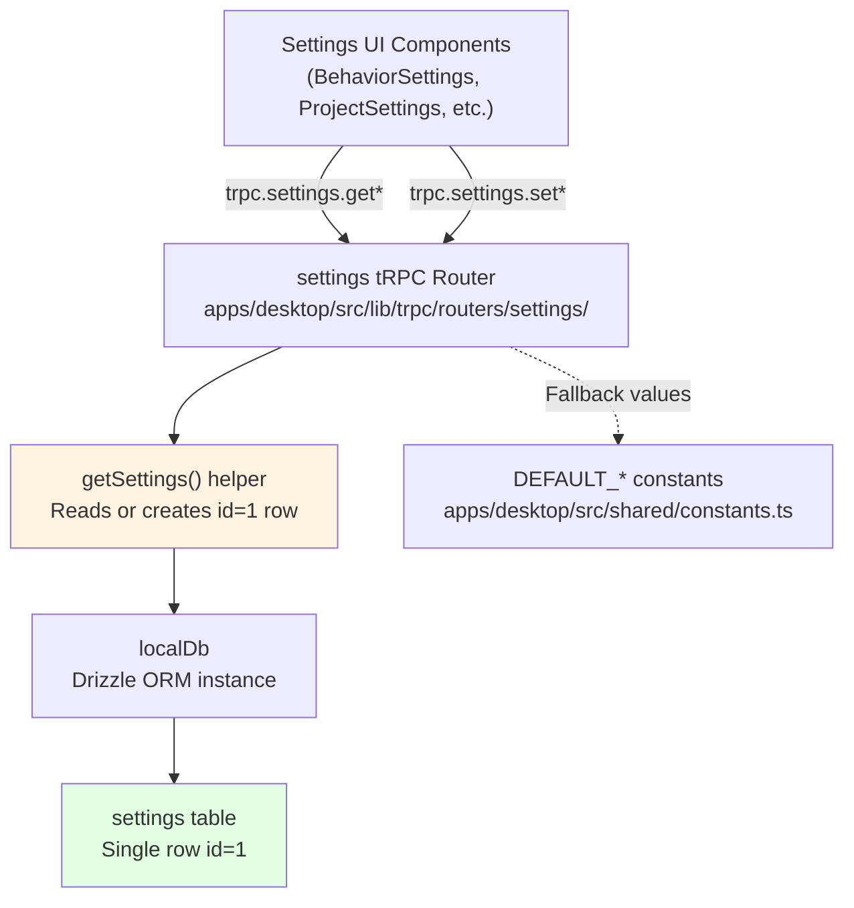
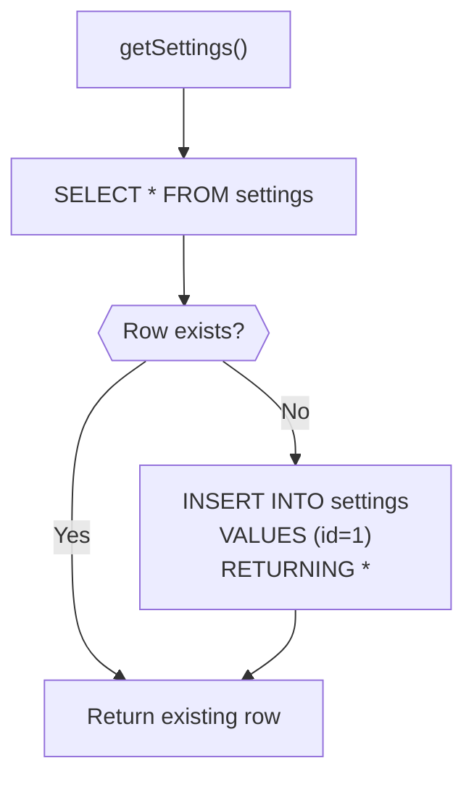
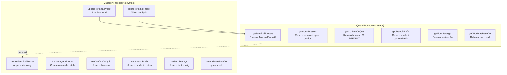
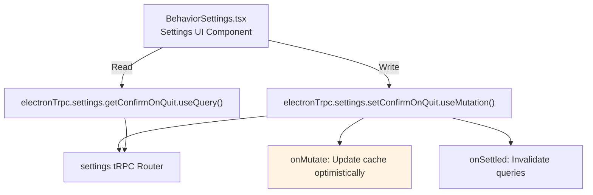
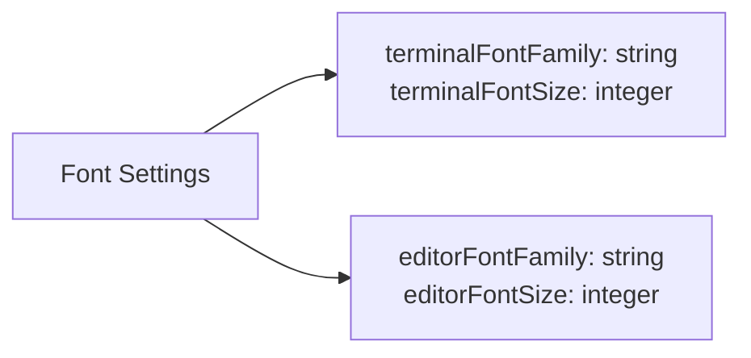
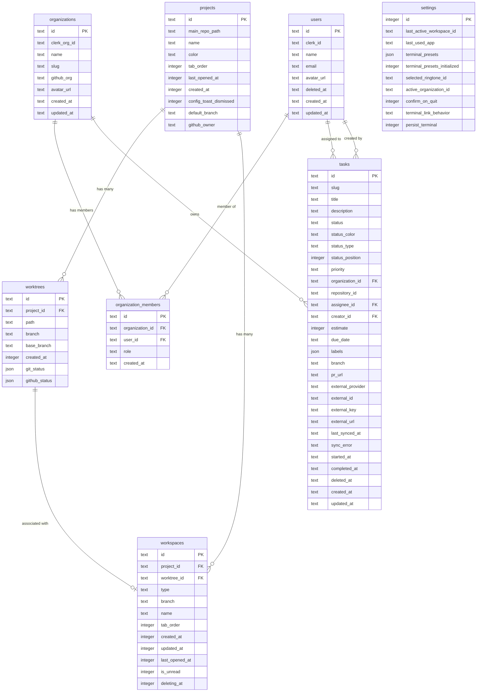

# Settings Schema and Storage

<details>
<summary>Relevant source files</summary>

The following files were used as context for generating this wiki page:

- [apps/desktop/src/lib/trpc/routers/projects/utils/favicon-discovery.ts](apps/desktop/src/lib/trpc/routers/projects/utils/favicon-discovery.ts)
- [apps/desktop/src/lib/trpc/routers/settings/index.ts](apps/desktop/src/lib/trpc/routers/settings/index.ts)
- [apps/desktop/src/main/lib/project-icons.ts](apps/desktop/src/main/lib/project-icons.ts)
- [apps/desktop/src/renderer/routes/_authenticated/settings/behavior/components/BehaviorSettings/BehaviorSettings.tsx](apps/desktop/src/renderer/routes/_authenticated/settings/behavior/components/BehaviorSettings/BehaviorSettings.tsx)
- [apps/desktop/src/renderer/routes/_authenticated/settings/project/$projectId/components/ProjectSettings/ProjectSettings.tsx](apps/desktop/src/renderer/routes/_authenticated/settings/project/$projectId/components/ProjectSettings/ProjectSettings.tsx)
- [apps/desktop/src/renderer/routes/_authenticated/settings/project/$projectId/general/page.tsx](apps/desktop/src/renderer/routes/_authenticated/settings/project/$projectId/general/page.tsx)
- [apps/desktop/src/renderer/routes/_authenticated/settings/utils/settings-search/settings-search.ts](apps/desktop/src/renderer/routes/_authenticated/settings/utils/settings-search/settings-search.ts)
- [apps/desktop/src/shared/constants.ts](apps/desktop/src/shared/constants.ts)
- [packages/local-db/drizzle/meta/_journal.json](packages/local-db/drizzle/meta/_journal.json)
- [packages/local-db/src/schema/schema.ts](packages/local-db/src/schema/schema.ts)

</details>


This page documents the settings storage architecture, including the SQLite schema for the `settings` table, the single-row storage pattern, tRPC access layer, and migration history. Settings store global application preferences including terminal presets, agent configurations, UI preferences, and behavioral flags.

## Settings Storage Architecture

Settings are stored in a singleton row in the SQLite `settings` table (`id = 1`). The tRPC settings router provides type-safe access with optimistic updates via TanStack Query mutations.

**Settings Storage Flow**



**Sources**: [apps/desktop/src/lib/trpc/routers/settings/index.ts:1-814](), [packages/local-db/src/schema/schema.ts:173-219]()
</thinking>

## Settings Table Schema

The `settings` table is a singleton table storing global application preferences. All columns except `id` are nullable, using `NULL` to represent "not set" (falling back to hardcoded defaults).

| Column | Type | Default | Description |
|--------|------|---------|-------------|
| `id` | integer | 1 | PRIMARY KEY, always 1 (singleton pattern) |
| `lastActiveWorkspaceId` | text | NULL | UUID of most recently active workspace |
| `terminalPresets` | json | NULL | Array of `TerminalPreset[]` objects |
| `terminalPresetsInitialized` | boolean | NULL | Flag indicating presets have been initialized |
| `agentPresetOverrides` | json | NULL | `AgentPresetOverrideEnvelope` object |
| `agentCustomDefinitions` | json | NULL | Array of `AgentCustomDefinition[]` objects |
| `selectedRingtoneId` | text | NULL | ID of selected notification sound |
| `activeOrganizationId` | text | NULL | UUID of currently active organization |
| `confirmOnQuit` | boolean | NULL | Show confirmation dialog on quit |
| `terminalLinkBehavior` | text | NULL | `"file-viewer"` or `"external-editor"` |
| `terminalPersistence` | boolean | true | Enable terminal session persistence |
| `autoApplyDefaultPreset` | boolean | NULL | Auto-apply default preset on new tabs |
| `branchPrefixMode` | text | NULL | `BranchPrefixMode`: `"none"`, `"author"`, `"github"`, `"custom"` |
| `branchPrefixCustom` | text | NULL | Custom branch prefix string |
| `notificationSoundsMuted` | boolean | NULL | Mute all notification sounds |
| `deleteLocalBranch` | boolean | NULL | Delete local branch when removing worktree workspace |
| `fileOpenMode` | text | NULL | `"split-pane"` or `"new-tab"` |
| `showPresetsBar` | boolean | NULL | Show terminal presets bar |
| `useCompactTerminalAddButton` | boolean | NULL | Use compact "+" button in terminal UI |
| `terminalFontFamily` | text | NULL | Terminal font family name |
| `terminalFontSize` | integer | NULL | Terminal font size in pixels |
| `editorFontFamily` | text | NULL | Editor/diff font family name |
| `editorFontSize` | integer | NULL | Editor/diff font size in pixels |
| `showResourceMonitor` | boolean | NULL | Show CPU/memory usage in top bar |
| `worktreeBaseDir` | text | NULL | Global worktree base directory path |
| `openLinksInApp` | boolean | NULL | Open links in built-in browser instead of external |
| `defaultEditor` | text | NULL | `ExternalApp` enum for default editor |

**TypeScript Types**: `InsertSettings`, `SelectSettings` inferred from Drizzle schema

**Sources**: [packages/local-db/src/schema/schema.ts:173-219](), [apps/desktop/src/lib/trpc/routers/settings/index.ts:1-814]()
</thinking>

## Single-Row Pattern

The settings table uses a singleton pattern where all settings are stored in a single row with `id = 1`. The `getSettings()` helper function ensures this row always exists, creating it on first access.

**getSettings() Implementation**



**Code Implementation**:

```typescript
function getSettings() {
  let row = localDb.select().from(settings).get();
  if (!row) {
    row = localDb.insert(settings).values({ id: 1 }).returning().get();
  }
  return row;
}
```

All mutation procedures use `INSERT ... ON CONFLICT DO UPDATE` to upsert the singleton row:

```typescript
localDb
  .insert(settings)
  .values({ id: 1, confirmOnQuit: enabled })
  .onConflictDoUpdate({
    target: settings.id,
    set: { confirmOnQuit: enabled },
  })
  .run();
```

**Sources**: [apps/desktop/src/lib/trpc/routers/settings/index.ts:73-79](), [apps/desktop/src/lib/trpc/routers/settings/index.ts:476-486]()
</thinking>

## JSON Column Storage

Complex settings structures are stored as JSON columns with TypeScript type annotations. These columns are read, mutated in memory, and written back atomically.

### Terminal Presets

Terminal presets are stored as a JSON array in `terminalPresets` column. Each preset defines commands to run when creating a terminal.

**TerminalPreset Type Structure**:

```typescript
interface TerminalPreset {
  id: string;                    // UUID
  name: string;                  // Display name
  description?: string;          // Optional description
  cwd: string;                   // Working directory
  commands: string[];            // Array of shell commands
  pinnedToBar?: boolean;         // Pin to presets bar
  executionMode?: ExecutionMode; // "new-tab" | "split-pane" | "replace"
  isDefault?: boolean;           // Legacy default preset flag
  applyOnWorkspaceCreated?: boolean; // Auto-apply on workspace creation
  applyOnNewTab?: boolean;       // Auto-apply on new tab
}
```

**Preset Initialization**: On first access, `initializeDefaultPresets()` merges any existing presets with built-in defaults (Claude, Codex, Copilot, OpenCode, Pi, Gemini) and sets `terminalPresetsInitialized = true`.

**Sources**: [apps/desktop/src/lib/trpc/routers/settings/index.ts:146-173](), [packages/local-db/src/schema/schema.ts:176-178]()

### Agent Preset Overrides

Agent configurations are stored in two JSON columns:

- `agentCustomDefinitions`: Array of user-created agent definitions
- `agentPresetOverrides`: Patch-based override envelope with version field

**AgentPresetOverrideEnvelope Structure**:

```typescript
interface AgentPresetOverrideEnvelope {
  version: number;              // Schema version (currently 1)
  presets: {
    [agentId: string]: {
      enabled?: boolean;        // Show/hide in launcher
      noPromptCommand?: string; // Command without prompt variable
      promptCommand?: string;   // Command with ${prompt} variable
      taskPromptTemplate?: string; // Template for task-based launches
    };
  };
}
```

Agent settings use a three-layer resolution system:
1. Built-in definitions from `AGENT_PRESET_COMMANDS` constants
2. Custom definitions from `agentCustomDefinitions`
3. User overrides from `agentPresetOverrides`

**Sources**: [apps/desktop/src/lib/trpc/routers/settings/index.ts:106-135](), [packages/local-db/src/schema/schema.ts:182-187]()
</thinking>

## tRPC Settings Router

The settings router provides type-safe procedures for reading and updating settings. All mutations follow an optimistic update pattern with automatic cache invalidation.

**Settings Router Structure**



**Common Query Pattern**:

All queries follow this pattern:
1. Call `getSettings()` to get singleton row
2. Read column value
3. Return value ?? DEFAULT_CONSTANT

Example:
```typescript
getConfirmOnQuit: publicProcedure.query(() => {
  const row = getSettings();
  return row.confirmOnQuit ?? DEFAULT_CONFIRM_ON_QUIT;
})
```

**Common Mutation Pattern**:

All mutations follow this pattern:
1. Validate input via Zod schema
2. Transform/normalize input if needed
3. Upsert using `INSERT ... ON CONFLICT DO UPDATE`
4. Return success or updated value

Example:
```typescript
setConfirmOnQuit: publicProcedure
  .input(z.object({ enabled: z.boolean() }))
  .mutation(({ input }) => {
    localDb
      .insert(settings)
      .values({ id: 1, confirmOnQuit: input.enabled })
      .onConflictDoUpdate({
        target: settings.id,
        set: { confirmOnQuit: input.enabled },
      })
      .run();
    return { success: true };
  })
```

**Sources**: [apps/desktop/src/lib/trpc/routers/settings/index.ts:186-814]()

## Default Constants

Settings use nullable columns to distinguish "not set" from explicit values. When a column is `NULL`, the application falls back to hardcoded constants defined in `apps/desktop/src/shared/constants.ts`.

**Default Values Table**

| Constant | Value | Used By |
|----------|-------|---------|
| `DEFAULT_CONFIRM_ON_QUIT` | `true` | `confirmOnQuit` |
| `DEFAULT_TERMINAL_LINK_BEHAVIOR` | `"file-viewer"` | `terminalLinkBehavior` |
| `DEFAULT_FILE_OPEN_MODE` | `"split-pane"` | `fileOpenMode` |
| `DEFAULT_AUTO_APPLY_DEFAULT_PRESET` | `true` | `autoApplyDefaultPreset` |
| `DEFAULT_SHOW_PRESETS_BAR` | `true` | `showPresetsBar` |
| `DEFAULT_USE_COMPACT_TERMINAL_ADD_BUTTON` | `true` | `useCompactTerminalAddButton` |
| `DEFAULT_SHOW_RESOURCE_MONITOR` | `true` | `showResourceMonitor` |
| `DEFAULT_OPEN_LINKS_IN_APP` | `false` | `openLinksInApp` |

**Default Agent Presets**:

The router defines built-in agent presets that are initialized on first access:

```typescript
const DEFAULT_PRESET_AGENTS = [
  "claude",
  "codex", 
  "copilot",
  "opencode",
  "pi",
  "gemini",
] as const;
```

Each agent maps to commands defined in `AGENT_PRESET_COMMANDS` from `@superset/shared/agent-command`.

**Sources**: [apps/desktop/src/shared/constants.ts:43-52](), [apps/desktop/src/lib/trpc/routers/settings/index.ts:137-153]()
</thinking>

## Migration History

The settings table has evolved through 36+ migrations. Below are the migrations that added or modified settings columns.

**Settings-Related Migrations**

```mermaid
graph LR
    M0000["0000_initial_schema<br/>Create settings table"]
    M0002["0002_add_active_organization_id<br/>activeOrganizationId"]
    M0003["0003_add_confirm_on_quit_setting<br/>confirmOnQuit"]
    M0004["0004_add_terminal_link_behavior_setting<br/>terminalLinkBehavior"]
    M0011["0011_add_terminal_persistence<br/>No-op migration"]
    M0012["0012_add_persist_terminal<br/>terminalPersistence"]
    M0013["0013_add_auto_apply_default_preset<br/>autoApplyDefaultPreset"]
    M0014["0014_add_branch_prefix_config<br/>branchPrefixMode, branchPrefixCustom"]
    M0015["0015_add_notification_sounds_muted<br/>notificationSoundsMuted"]
    M0016["0016_add_telemetry_enabled<br/>telemetryEnabled (later removed)"]
    M0018["0018_add_delete_local_branch_setting<br/>deleteLocalBranch"]
    M0020["0020_add_file_open_mode_setting<br/>fileOpenMode"]
    M0023["0023_add_show_presets_bar_setting<br/>showPresetsBar"]
    M0028["0028_add_show_resource_monitor_setting<br/>showResourceMonitor"]
    M0031["0031_add_open_links_in_app_setting<br/>openLinksInApp"]
    M0034["0034_add_use_compact_terminal_add_button_setting<br/>useCompactTerminalAddButton"]
    M0036["0036_add_agent_settings<br/>agentPresetOverrides, agentCustomDefinitions"]
    
    M0000 --> M0002 --> M0003 --> M0004
    M0004 --> M0011 --> M0012 --> M0013 --> M0014 --> M0015 --> M0016
    M0016 --> M0018 --> M0020 --> M0023 --> M0028 --> M0031 --> M0034 --> M0036
```



**Migration 0011/0012 Special Case**

Migration 0011 attempted to add `terminal_persistence` but was made a no-op due to idempotency issues during development. Migration 0012 correctly added `persist_terminal` with a `DEFAULT true` constraint:

```sql
-- Migration 0011 (no-op)
SELECT 1;

-- Migration 0012
ALTER TABLE `settings` ADD `persist_terminal` integer DEFAULT true;
```

This is the only settings column with a non-NULL default value applied at the database level.

**Sources**: [packages/local-db/drizzle/meta/_journal.json:1-264](), [packages/local-db/drizzle/0011_add_terminal_persistence.sql:1-5](), [packages/local-db/drizzle/0012_add_persist_terminal.sql:1-1]()

## Settings Access Patterns

The settings router is accessed from UI components via the `electronTrpc` client. TanStack Query provides automatic caching, optimistic updates, and invalidation.

**Common Access Pattern**



**Example: Confirm on Quit Toggle**

```typescript
// UI Component: BehaviorSettings.tsx
const { data: confirmOnQuit } = electronTrpc.settings.getConfirmOnQuit.useQuery();

const setConfirmOnQuit = electronTrpc.settings.setConfirmOnQuit.useMutation({
  onMutate: async ({ enabled }) => {
    // Cancel outgoing queries
    await utils.settings.getConfirmOnQuit.cancel();
    
    // Snapshot current value
    const previous = utils.settings.getConfirmOnQuit.getData();
    
    // Optimistically update cache
    utils.settings.getConfirmOnQuit.setData(undefined, enabled);
    
    return { previous };
  },
  onError: (_err, _vars, context) => {
    // Rollback on error
    if (context?.previous !== undefined) {
      utils.settings.getConfirmOnQuit.setData(undefined, context.previous);
    }
  },
  onSettled: () => {
    // Refetch to ensure consistency
    utils.settings.getConfirmOnQuit.invalidate();
  },
});
```

This pattern ensures:
1. **Instant UI updates** via optimistic updates
2. **Automatic rollback** if mutation fails
3. **Server consistency** via post-mutation invalidation

**Sources**: [apps/desktop/src/renderer/routes/_authenticated/settings/behavior/components/BehaviorSettings/BehaviorSettings.tsx:46-67]()

## Font Settings

Font settings use a dedicated schema transformer to normalize input values before storage.

**Font Settings Fields**



The `setFontSettings` mutation uses `transformFontSettings()` utility to:
- Strip whitespace from font family names
- Normalize font size to positive integers
- Convert empty strings to `null`

**Sources**: [apps/desktop/src/lib/trpc/routers/settings/index.ts:682-711](), [apps/desktop/src/lib/trpc/routers/settings/font-settings.utils.ts:1-55]()
</thinking>

## Worktree Base Directory Settings

The `worktreeBaseDir` setting demonstrates the hierarchical override pattern used throughout settings:

1. **Global default**: Hardcoded fallback path (`~/.superset/worktrees`)
2. **Global setting**: `settings.worktreeBaseDir` (user-configured global path)
3. **Project override**: `projects.worktreeBaseDir` (per-project override)

When creating a worktree, the resolution order is:
```
project.worktreeBaseDir ?? settings.worktreeBaseDir ?? DEFAULT_WORKTREE_PATH
```

This pattern is also used for:
- Branch prefix mode (`project.branchPrefixMode` overrides `settings.branchPrefixMode`)
- Default editor/app (`project.defaultApp` overrides `settings.defaultEditor`)

**Sources**: [apps/desktop/src/lib/trpc/routers/settings/index.ts:733-751](), [apps/desktop/src/renderer/routes/_authenticated/settings/project/$projectId/components/ProjectSettings/ProjectSettings.tsx:213-217]()
</thinking>

## Related Pages

- **Page 2.11.2**: Terminal and Agent Presets - Detailed documentation of preset systems and preset execution modes
- **Page 2.11.3**: Project-Specific Settings - Documentation of project-level overrides and per-project configuration
- **Page 2.10.2**: Local Database Access - Broader context of `localDb` usage patterns and Drizzle ORM integration

## Entity Relationship Diagram

The schema enforces referential integrity through foreign key constraints, with cascading deletes to maintain consistency.



**Sources**: [packages/local-db/src/schema/schema.ts:16-284](), [packages/local-db/drizzle/meta/0012_snapshot.json:1-1007]()

## Local Tables

### Projects Table

The `projects` table represents Git repositories opened by the user. Each project serves as the root container for worktrees and workspaces.

| Column | Type | Constraints | Description |
|--------|------|-------------|-------------|
| `id` | text | PRIMARY KEY | UUID generated by `uuidv4()` |
| `main_repo_path` | text | NOT NULL, INDEXED | Absolute filesystem path to the main repository |
| `name` | text | NOT NULL | Display name of the project |
| `color` | text | NOT NULL | Hex color code for UI identification |
| `tab_order` | integer | NULL | Position in the project switcher |
| `last_opened_at` | integer | NOT NULL, INDEXED | Unix timestamp (ms) of last access |
| `created_at` | integer | NOT NULL | Unix timestamp (ms) of creation |
| `config_toast_dismissed` | integer | NULL | Boolean flag for config file toast dismissal |
| `default_branch` | text | NULL | Default branch name (e.g., "main", "master") |
| `github_owner` | text | NULL | GitHub username or org name for the repository |

**Indexes**:
- `projects_main_repo_path_idx` on `main_repo_path` - Fast lookup by filesystem path
- `projects_last_opened_at_idx` on `last_opened_at` - Efficient sorting for recent projects list

**TypeScript Types**: `InsertProject`, `SelectProject` inferred from schema

**Sources**: [packages/local-db/src/schema/schema.ts:16-45]()

### Worktrees Table

The `worktrees` table represents Git worktrees created within a project. Worktrees provide isolated working directories for different branches.

| Column | Type | Constraints | Description |
|--------|------|-------------|-------------|
| `id` | text | PRIMARY KEY | UUID generated by `uuidv4()` |
| `project_id` | text | NOT NULL, FK → projects(id), INDEXED | Parent project reference |
| `path` | text | NOT NULL | Absolute filesystem path to the worktree |
| `branch` | text | NOT NULL, INDEXED | Branch name checked out in this worktree |
| `base_branch` | text | NULL | Branch from which this worktree was created |
| `created_at` | integer | NOT NULL | Unix timestamp (ms) of creation |
| `git_status` | json | NULL | Cached Git status object (typed as `GitStatus`) |
| `github_status` | json | NULL | Cached GitHub PR status (typed as `GitHubStatus`) |

**Foreign Keys**:
- `project_id` references `projects.id` with `ON DELETE CASCADE`

**Indexes**:
- `worktrees_project_id_idx` on `project_id` - Fast project → worktrees queries
- `worktrees_branch_idx` on `branch` - Branch name lookups

**JSON Column Types**: The `git_status` and `github_status` columns use Drizzle's JSON mode with TypeScript types defined in [packages/local-db/src/schema/zod.ts]().

**Sources**: [packages/local-db/src/schema/schema.ts:47-75]()

### Workspaces Table

The `workspaces` table represents active workspace environments. A workspace can be either branch-based (working in the main repository) or worktree-based (working in a separate worktree).

| Column | Type | Constraints | Description |
|--------|------|-------------|-------------|
| `id` | text | PRIMARY KEY | UUID generated by `uuidv4()` |
| `project_id` | text | NOT NULL, FK → projects(id), INDEXED | Parent project reference |
| `worktree_id` | text | NULL, FK → worktrees(id), INDEXED | Associated worktree (only for type="worktree") |
| `type` | text | NOT NULL | WorkspaceType enum: "branch" or "worktree" |
| `branch` | text | NOT NULL | Branch name for both workspace types |
| `name` | text | NOT NULL | Display name of the workspace |
| `tab_order` | integer | NOT NULL | Position in the workspace tabs |
| `created_at` | integer | NOT NULL | Unix timestamp (ms) of creation |
| `updated_at` | integer | NOT NULL | Unix timestamp (ms) of last update |
| `last_opened_at` | integer | NOT NULL, INDEXED | Unix timestamp (ms) of last access |
| `is_unread` | integer | DEFAULT false | Boolean flag for unread notification indicator |
| `deleting_at` | integer | NULL | Unix timestamp (ms) when deletion started (non-null = deletion in progress) |

**Foreign Keys**:
- `project_id` references `projects.id` with `ON DELETE CASCADE`
- `worktree_id` references `worktrees.id` with `ON DELETE CASCADE`

**Indexes**:
- `workspaces_project_id_idx` on `project_id`
- `workspaces_worktree_id_idx` on `worktree_id`
- `workspaces_last_opened_at_idx` on `last_opened_at`

**Partial Unique Index**: Migration 0006 creates a partial unique index enforcing one branch workspace per project:
```sql
CREATE UNIQUE INDEX workspaces_unique_branch_per_project
  ON workspaces(project_id) WHERE type = 'branch'
```
This constraint is not expressed in the Drizzle schema DSL and is only applied via migration.

**Soft Deletion**: The `deleting_at` field implements optimistic UI by marking workspaces as "deleting" before the async deletion completes. Queries should filter out rows where `deleting_at IS NOT NULL`.

**Sources**: [packages/local-db/src/schema/schema.ts:77-124](), [packages/local-db/drizzle/meta/0012_snapshot.json:757-900]()

### Settings Table

The `settings` table is a singleton table (always `id = 1`) storing global application preferences and state.

| Column | Type | Constraints | Description |
|--------|------|-------------|-------------|
| `id` | integer | PRIMARY KEY, DEFAULT 1 | Always 1 (singleton) |
| `last_active_workspace_id` | text | NULL | UUID of most recently active workspace |
| `last_used_app` | text | NULL | ExternalApp enum for "Open In" functionality |
| `terminal_presets` | json | NULL | Array of TerminalPreset objects |
| `terminal_presets_initialized` | integer | NULL | Boolean flag for preset initialization |
| `selected_ringtone_id` | text | NULL | ID of selected notification sound |
| `active_organization_id` | text | NULL | UUID of currently active organization |
| `confirm_on_quit` | integer | NULL | Boolean flag for quit confirmation dialog |
| `terminal_link_behavior` | text | NULL | TerminalLinkBehavior enum: "external-editor" or "browser" |
| `persist_terminal` | integer | DEFAULT true | Boolean flag enabling terminal session persistence |

**TypeScript Types**: The JSON and enum columns use TypeScript types from [packages/local-db/src/schema/zod.ts]():
- `ExternalApp`
- `TerminalPreset[]`
- `TerminalLinkBehavior`

**Migration History**: The `persist_terminal` column was added in migration 0012 (replacing a non-idempotent migration 0011). See [Migration Evolution](#migration-evolution) below.

**Sources**: [packages/local-db/src/schema/schema.ts:126-148](), [packages/local-db/drizzle/meta/0012_snapshot.json:284-365]()

## Synced Tables

These tables are replicated from a cloud PostgreSQL database via Electric SQL. Column names use `snake_case` to match the PostgreSQL schema exactly, allowing Electric to write data directly without transformation.

### Users Table

The `users` table stores user account information synced from the cloud authentication system (Clerk).

| Column | Type | Constraints | Description |
|--------|------|-------------|-------------|
| `id` | text | PRIMARY KEY | UUID from cloud database |
| `clerk_id` | text | NOT NULL, UNIQUE, INDEXED | Clerk user identifier |
| `name` | text | NOT NULL | User's display name |
| `email` | text | NOT NULL, UNIQUE, INDEXED | User's email address |
| `avatar_url` | text | NULL | URL to user's avatar image |
| `deleted_at` | text | NULL | ISO 8601 timestamp of soft deletion |
| `created_at` | text | NOT NULL | ISO 8601 timestamp of creation |
| `updated_at` | text | NOT NULL | ISO 8601 timestamp of last update |

**Indexes**:
- `users_email_idx` on `email`
- `users_clerk_id_idx` on `clerk_id`
- Unique constraints on `clerk_id` and `email`

**Timestamp Format**: Cloud-synced tables use ISO 8601 text timestamps (e.g., "2024-01-01T00:00:00Z") rather than Unix milliseconds used by local tables.

**Sources**: [packages/local-db/src/schema/schema.ts:161-180]()

### Organizations Table

The `organizations` table stores organization/team information synced from the cloud.

| Column | Type | Constraints | Description |
|--------|------|-------------|-------------|
| `id` | text | PRIMARY KEY | UUID from cloud database |
| `clerk_org_id` | text | UNIQUE, INDEXED | Clerk organization identifier |
| `name` | text | NOT NULL | Organization display name |
| `slug` | text | NOT NULL, UNIQUE, INDEXED | URL-safe organization identifier |
| `github_org` | text | NULL | Associated GitHub organization name |
| `avatar_url` | text | NULL | URL to organization's avatar image |
| `created_at` | text | NOT NULL | ISO 8601 timestamp of creation |
| `updated_at` | text | NOT NULL | ISO 8601 timestamp of last update |

**Indexes**:
- `organizations_slug_idx` on `slug`
- `organizations_clerk_org_id_idx` on `clerk_org_id`
- Unique constraints on `clerk_org_id` and `slug`

**Sources**: [packages/local-db/src/schema/schema.ts:185-204]()

### Organization Members Table

The `organization_members` table is a join table representing user memberships in organizations.

| Column | Type | Constraints | Description |
|--------|------|-------------|-------------|
| `id` | text | PRIMARY KEY | UUID from cloud database |
| `organization_id` | text | NOT NULL, FK → organizations(id), INDEXED | Organization reference |
| `user_id` | text | NOT NULL, FK → users(id), INDEXED | User reference |
| `role` | text | NOT NULL | Member role (e.g., "owner", "member") |
| `created_at` | text | NOT NULL | ISO 8601 timestamp of membership creation |

**Foreign Keys**:
- `organization_id` references `organizations.id` with `ON DELETE CASCADE`
- `user_id` references `users.id` with `ON DELETE CASCADE`

**Indexes**:
- `organization_members_organization_id_idx` on `organization_id`
- `organization_members_user_id_idx` on `user_id`

**Sources**: [packages/local-db/src/schema/schema.ts:209-229]()

### Tasks Table

The `tasks` table stores task/issue management data with optional integration to external systems (e.g., Linear).

| Column | Type | Constraints | Description |
|--------|------|-------------|-------------|
| `id` | text | PRIMARY KEY | UUID from cloud database |
| `slug` | text | NOT NULL, UNIQUE, INDEXED | Human-readable task identifier (e.g., "SUP-123") |
| `title` | text | NOT NULL | Task title |
| `description` | text | NULL | Task description (may contain Markdown) |
| `status` | text | NOT NULL, INDEXED | Current status label |
| `status_color` | text | NULL | Hex color for status badge |
| `status_type` | text | NULL | Status category (e.g., "todo", "in_progress", "done") |
| `status_position` | integer | NULL | Position in status column for sorting |
| `priority` | text | NOT NULL | TaskPriority enum: "urgent", "high", "medium", "low", "none" |
| `organization_id` | text | NOT NULL, FK → organizations(id), INDEXED | Owning organization |
| `repository_id` | text | NULL | Associated repository ID (future use) |
| `assignee_id` | text | NULL, FK → users(id), INDEXED | Assigned user |
| `creator_id` | text | NOT NULL, FK → users(id) | Creating user |
| `estimate` | integer | NULL | Time estimate in minutes |
| `due_date` | text | NULL | ISO 8601 date string |
| `labels` | json | NULL | Array of label strings |
| `branch` | text | NULL | Git branch name associated with task |
| `pr_url` | text | NULL | GitHub pull request URL |
| `external_provider` | text | NULL | IntegrationProvider enum: "linear" |
| `external_id` | text | NULL | ID in external system |
| `external_key` | text | NULL | Key in external system (e.g., "LIN-123") |
| `external_url` | text | NULL | URL to task in external system |
| `last_synced_at` | text | NULL | ISO 8601 timestamp of last sync |
| `sync_error` | text | NULL | Error message from last sync attempt |
| `started_at` | text | NULL | ISO 8601 timestamp when work started |
| `completed_at` | text | NULL | ISO 8601 timestamp when completed |
| `deleted_at` | text | NULL | ISO 8601 timestamp of soft deletion |
| `created_at` | text | NOT NULL, INDEXED | ISO 8601 timestamp of creation |
| `updated_at` | text | NOT NULL | ISO 8601 timestamp of last update |

**Foreign Keys**:
- `organization_id` references `organizations.id` with `ON DELETE CASCADE`
- `assignee_id` references `users.id` with `ON DELETE SET NULL`
- `creator_id` references `users.id` with `ON DELETE CASCADE`

**Indexes**:
- `tasks_slug_idx` on `slug`
- `tasks_organization_id_idx` on `organization_id`
- `tasks_assignee_id_idx` on `assignee_id`
- `tasks_status_idx` on `status`
- `tasks_created_at_idx` on `created_at`

**Type Definitions**:
```typescript
type TaskPriority = "urgent" | "high" | "medium" | "low" | "none";
type IntegrationProvider = "linear";
```

**Sources**: [packages/local-db/src/schema/schema.ts:155-283]()

## Migration Evolution

The database schema evolves through numbered migrations applied sequentially. The migration journal tracks all applied changes.

```mermaid
graph LR
    M0000["0000_initial_schema<br/>Create local tables"]
    M0001["0001_add_synced_tables<br/>Add users, orgs, tasks"]
    M0002["0002_add_active_organization_id<br/>settings.active_organization_id"]
    M0003["0003_add_confirm_on_quit_setting<br/>settings.confirm_on_quit"]
    M0004["0004_add_terminal_link_behavior_setting<br/>settings.terminal_link_behavior"]
    M0005["0005_add_navigation_style<br/>(Removed/merged)"]
    M0006["0006_add_unique_branch_workspace_index<br/>Partial unique index"]
    M0007["0007_add_workspace_is_unread<br/>workspaces.is_unread"]
    M0008["0008_add_group_tabs_position<br/>(UI state)"]
    M0009["0009_add_github_owner_to_projects<br/>projects.github_owner"]
    M0010["0010_add_workspace_deleting_at<br/>workspaces.deleting_at"]
    M0011["0011_add_terminal_persistence<br/>No-op (idempotency issue)"]
    M0012["0012_add_persist_terminal<br/>settings.persist_terminal"]
    
    M0000 --> M0001 --> M0002 --> M0003 --> M0004 --> M0005
    M0005 --> M0006 --> M0007 --> M0008 --> M0009 --> M0010
    M0010 --> M0011 --> M0012
```



### Migration Journal

The migration journal is stored in [packages/local-db/drizzle/meta/_journal.json]():

| Index | Tag | When (Unix ms) | Description |
|-------|-----|----------------|-------------|
| 0 | 0000_initial_schema | 1766444030452 | Created projects, worktrees, workspaces, settings tables |
| 1 | 0001_add_synced_tables | 1766773809299 | Added users, organizations, organization_members, tasks |
| 2 | 0002_add_active_organization_id | 1766776955487 | Added settings.active_organization_id |
| 3 | 0003_add_confirm_on_quit_setting | 1766932805546 | Added settings.confirm_on_quit |
| 4 | 0004_add_terminal_link_behavior_setting | 1767166138761 | Added settings.terminal_link_behavior |
| 5 | 0005_add_navigation_style | 1767166547886 | Navigation style setting (deprecated) |
| 6 | 0006_add_unique_branch_workspace_index | 1767230000000 | Partial unique index on workspaces |
| 7 | 0007_add_workspace_is_unread | 1767350000000 | Added workspaces.is_unread |
| 8 | 0008_add_group_tabs_position | 1767548339097 | Tab position tracking |
| 9 | 0009_add_github_owner_to_projects | 1767652257969 | Added projects.github_owner |
| 10 | 0010_add_workspace_deleting_at | 1768004449114 | Added workspaces.deleting_at |
| 11 | 0011_add_terminal_persistence | 1768790828810 | No-op migration (replaced by 0012) |
| 12 | 0012_add_persist_terminal | 1768799848274 | Added settings.persist_terminal |

### Migration 0011/0012: Terminal Persistence

Migration 0011 was intentionally made a no-op due to an idempotency issue during development. The column `terminal_persistence` was removed and replaced with `persist_terminal` in migration 0012 to ensure clean migration state for all users.

**Migration 0011** ([packages/local-db/drizzle/0011_add_terminal_persistence.sql]()):
```sql
-- Migration 11 is intentionally empty (no-op)
-- The terminal_persistence column was removed due to idempotency issues
-- See migration 0012 for the replacement column: persist_terminal
SELECT 1;
```

**Migration 0012** ([packages/local-db/drizzle/0012_add_persist_terminal.sql]()):
```sql
ALTER TABLE `settings` ADD `persist_terminal` integer DEFAULT true;
```

**Sources**: [packages/local-db/drizzle/meta/_journal.json:1-97](), [packages/local-db/drizzle/0011_add_terminal_persistence.sql:1-5](), [packages/local-db/drizzle/0012_add_persist_terminal.sql:1-1]()

## Type System Integration

The schema uses Drizzle ORM's type inference to generate TypeScript types automatically. Each table exports `Insert*` and `Select*` types:

```typescript
// Example from projects table
export type InsertProject = typeof projects.$inferInsert;
export type SelectProject = typeof projects.$inferSelect;
```

These types are used throughout the codebase for type-safe database operations:
- `InsertProject` - Used when creating new project records
- `SelectProject` - Used when reading project data from queries

### JSON Column Types

JSON columns use Drizzle's `$type<T>()` method to specify TypeScript types:

```typescript
// Example from schema.ts
gitStatus: text("git_status", { mode: "json" }).$type<GitStatus>()
terminalPresets: text("terminal_presets", { mode: "json" }).$type<TerminalPreset[]>()
labels: text("labels", { mode: "json" }).$type<string[]>()
```

The types `GitStatus`, `GitHubStatus`, `WorkspaceType`, `ExternalApp`, `TerminalLinkBehavior`, and `TerminalPreset` are defined in the schema's Zod validation module.

### Timestamp Conventions

The schema uses two different timestamp formats:

| Table Category | Format | Type | Example |
|----------------|--------|------|---------|
| Local tables | Unix milliseconds | `integer` | `1768799848274` |
| Synced tables | ISO 8601 | `text` | `"2024-01-01T00:00:00.000Z"` |

This distinction reflects the data sources: local tables use JavaScript's `Date.now()`, while synced tables preserve PostgreSQL's ISO 8601 format from the cloud database.

**Sources**: [packages/local-db/src/schema/schema.ts:1-284]()