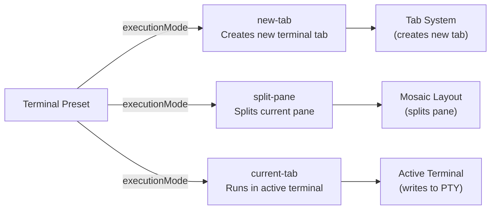
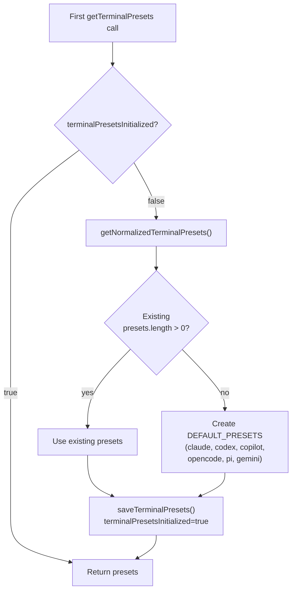
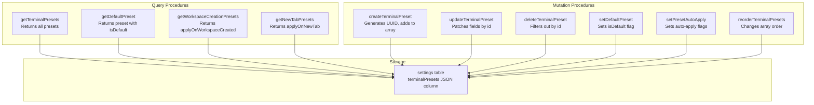
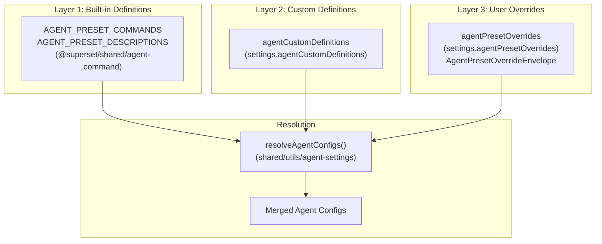
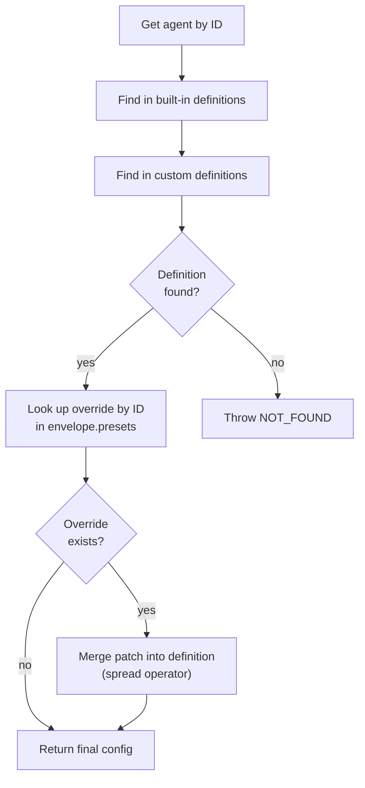
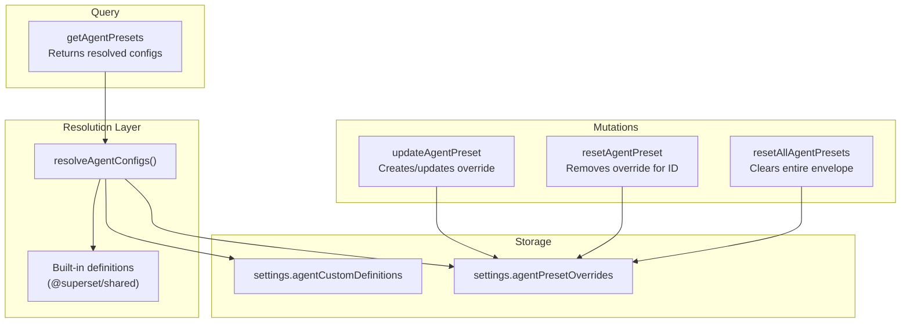
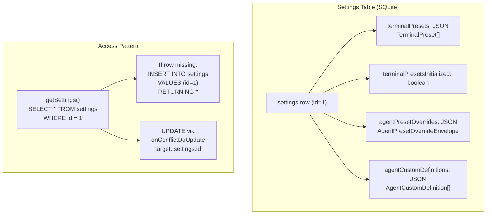

# Terminal and Agent Presets

<details>
<summary>Relevant source files</summary>

The following files were used as context for generating this wiki page:

- [apps/desktop/src/lib/trpc/routers/projects/utils/favicon-discovery.ts](apps/desktop/src/lib/trpc/routers/projects/utils/favicon-discovery.ts)
- [apps/desktop/src/lib/trpc/routers/settings/index.ts](apps/desktop/src/lib/trpc/routers/settings/index.ts)
- [apps/desktop/src/main/lib/project-icons.ts](apps/desktop/src/main/lib/project-icons.ts)
- [apps/desktop/src/renderer/routes/\_authenticated/settings/behavior/components/BehaviorSettings/BehaviorSettings.tsx](apps/desktop/src/renderer/routes/_authenticated/settings/behavior/components/BehaviorSettings/BehaviorSettings.tsx)
- [apps/desktop/src/renderer/routes/\_authenticated/settings/project/$projectId/components/ProjectSettings/ProjectSettings.tsx](apps/desktop/src/renderer/routes/_authenticated/settings/project/$projectId/components/ProjectSettings/ProjectSettings.tsx)
- [apps/desktop/src/renderer/routes/\_authenticated/settings/project/$projectId/general/page.tsx](apps/desktop/src/renderer/routes/_authenticated/settings/project/$projectId/general/page.tsx)
- [apps/desktop/src/renderer/routes/\_authenticated/settings/utils/settings-search/settings-search.ts](apps/desktop/src/renderer/routes/_authenticated/settings/utils/settings-search/settings-search.ts)
- [apps/desktop/src/shared/constants.ts](apps/desktop/src/shared/constants.ts)
- [packages/local-db/drizzle/meta/\_journal.json](packages/local-db/drizzle/meta/_journal.json)
- [packages/local-db/src/schema/schema.ts](packages/local-db/src/schema/schema.ts)

</details>

This document describes the terminal and agent preset systems, which allow users to define reusable command sequences and AI agent configurations. Terminal presets automate command execution with configurable execution modes, while agent presets provide customizable AI agent configurations for workspace creation and task execution.

For general settings architecture and storage patterns, see [Settings Schema and Storage](#2.11.1). For project-specific configuration, see [Project-Specific Settings](#2.11.3).

---

## Overview

The desktop application provides two complementary preset systems:

1. **Terminal Presets**: User-defined command sequences that execute in terminal sessions with configurable execution modes (new tab, split pane, current tab) and auto-apply triggers
2. **Agent Presets**: AI agent configurations with custom commands, task prompts, and model settings that control how agents launch and interact with workspaces

Both systems store configuration in the `settings` table as JSON columns and provide tRPC APIs for CRUD operations. Terminal presets are initialized lazily with built-in defaults, while agent presets use a three-layer architecture (built-in definitions, custom definitions, user overrides).

---

## Terminal Preset System

### Data Model and Schema

Terminal presets are stored as a JSON array in `settings.terminalPresets` with the following structure:

```typescript
interface TerminalPreset {
  id: string // UUID
  name: string // Display name
  description?: string // Optional description
  cwd: string // Working directory (can be empty)
  commands: string[] // Array of shell commands to execute
  executionMode?: ExecutionMode // "new-tab" | "split-pane" | "current-tab"
  pinnedToBar?: boolean // Show in presets bar
  isDefault?: boolean // Legacy: apply on all triggers
  applyOnWorkspaceCreated?: boolean // Auto-apply when workspace created
  applyOnNewTab?: boolean // Auto-apply when new tab opened
}
```

| Field                     | Type             | Description                                                                 |
| ------------------------- | ---------------- | --------------------------------------------------------------------------- |
| `id`                      | `string`         | Unique identifier (UUID v4)                                                 |
| `name`                    | `string`         | Preset display name                                                         |
| `description`             | `string?`        | Optional description                                                        |
| `cwd`                     | `string`         | Working directory path (empty string means workspace root)                  |
| `commands`                | `string[]`       | Ordered array of shell commands                                             |
| `executionMode`           | `ExecutionMode?` | How to execute: `new-tab`, `split-pane`, `current-tab` (default: `new-tab`) |
| `pinnedToBar`             | `boolean?`       | Whether preset appears in quick-access bar                                  |
| `isDefault`               | `boolean?`       | Legacy flag for auto-apply (migrated on first edit)                         |
| `applyOnWorkspaceCreated` | `boolean?`       | Auto-execute when creating workspace                                        |
| `applyOnNewTab`           | `boolean?`       | Auto-execute when opening new tab                                           |

**Sources:**

- [packages/local-db/src/schema/schema.ts:176-178]()
- [apps/desktop/src/lib/trpc/routers/settings/index.ts:11]()

---

### Execution Modes

Terminal presets support three execution modes that determine where commands run:



**Execution Mode Behavior:**

- **`new-tab`** (default): Creates a new terminal tab and executes commands in it
- **`split-pane`**: Splits the current pane horizontally or vertically and executes in the new pane
- **`current-tab`**: Executes commands in the currently active terminal session

**Sources:**

- [apps/desktop/src/lib/trpc/routers/settings/index.ts:249-257]()
- [apps/desktop/src/lib/trpc/routers/settings/index.ts:300-301]()

---

### Default Presets and Initialization

Terminal presets are initialized lazily on first access with six built-in agent presets:



**Built-in Default Presets:**

| Name       | Description            | Commands                                       |
| ---------- | ---------------------- | ---------------------------------------------- |
| `claude`   | Claude.ai AI Assistant | Commands from `AGENT_PRESET_COMMANDS.claude`   |
| `codex`    | Codex AI Assistant     | Commands from `AGENT_PRESET_COMMANDS.codex`    |
| `copilot`  | GitHub Copilot         | Commands from `AGENT_PRESET_COMMANDS.copilot`  |
| `opencode` | OpenCode Assistant     | Commands from `AGENT_PRESET_COMMANDS.opencode` |
| `pi`       | Pi AI Assistant        | Commands from `AGENT_PRESET_COMMANDS.pi`       |
| `gemini`   | Google Gemini          | Commands from `AGENT_PRESET_COMMANDS.gemini`   |

The initialization process:

1. Check `settings.terminalPresetsInitialized` flag [apps/desktop/src/lib/trpc/routers/settings/index.ts:157]()
2. If not initialized, check for existing presets (migration case)
3. If empty, create default presets from `DEFAULT_PRESET_AGENTS` [apps/desktop/src/lib/trpc/routers/settings/index.ts:137-153]()
4. Save with `terminalPresetsInitialized: true` to prevent re-initialization
5. Return merged presets

**Sources:**

- [apps/desktop/src/lib/trpc/routers/settings/index.ts:137-173]()
- [apps/desktop/src/lib/trpc/routers/settings/index.ts:188-194]()

---

### Auto-Apply Triggers

Presets can automatically execute when specific events occur:

```mermaid
graph TB
    subgraph "Workspace Creation"
        WS_Create["User creates workspace"]
        WS_Query["getPresetsForTrigger<br/>('applyOnWorkspaceCreated')"]
        WS_Filter["Filter presets where<br/>applyOnWorkspaceCreated=true"]
        WS_Fallback["If empty, find<br/>isDefault preset"]
        WS_Execute["Execute preset commands"]
    end

    subgraph "New Tab"
        Tab_Create["User opens new terminal tab"]
        Tab_Query["getPresetsForTrigger<br/>('applyOnNewTab')"]
        Tab_Filter["Filter presets where<br/>applyOnNewTab=true"]
        Tab_Fallback["If empty, find<br/>isDefault preset"]
        Tab_Execute["Execute preset commands"]
    end

    WS_Create --> WS_Query
    WS_Query --> WS_Filter
    WS_Filter --> WS_Fallback
    WS_Fallback --> WS_Execute

    Tab_Create --> Tab_Query
    Tab_Query --> Tab_Filter
    Tab_Filter --> Tab_Fallback
    Tab_Fallback --> Tab_Execute
```



The `getPresetsForTrigger` function [apps/desktop/src/lib/trpc/routers/settings/index.ts:176-184]() implements fallback logic:

1. Filter presets by the specified trigger field
2. If any found, return all matching presets
3. If none found, find preset with `isDefault: true`
4. Return default preset (if exists) or empty array

**Migration from `isDefault`:**

When a user first toggles an auto-apply field on a preset marked `isDefault: true`, the system migrates the preset [apps/desktop/src/lib/trpc/routers/settings/index.ts:349-361]():

1. Remove `isDefault: undefined`
2. Set `applyOnWorkspaceCreated: true`
3. Set `applyOnNewTab: true`
4. Apply the user's toggle to the specified field

**Sources:**

- [apps/desktop/src/lib/trpc/routers/settings/index.ts:176-184]()
- [apps/desktop/src/lib/trpc/routers/settings/index.ts:334-372]()
- [apps/desktop/src/lib/trpc/routers/settings/index.ts:407-418]()

---

### Terminal Preset CRUD Operations

The settings router exposes tRPC procedures for managing terminal presets:



**Key Procedures:**

| Procedure                     | Type     | Purpose                                             |
| ----------------------------- | -------- | --------------------------------------------------- |
| `getTerminalPresets`          | Query    | Returns all presets with lazy initialization        |
| `createTerminalPreset`        | Mutation | Creates new preset with UUID, default executionMode |
| `updateTerminalPreset`        | Mutation | Patches preset fields by ID                         |
| `deleteTerminalPreset`        | Mutation | Removes preset from array                           |
| `setDefaultPreset`            | Mutation | Sets/unsets isDefault flag                          |
| `setPresetAutoApply`          | Mutation | Toggles auto-apply fields with migration            |
| `reorderTerminalPresets`      | Mutation | Reorders presets by moving to target index          |
| `getDefaultPreset`            | Query    | Returns preset marked isDefault                     |
| `getWorkspaceCreationPresets` | Query    | Returns presets for workspace trigger               |
| `getNewTabPresets`            | Query    | Returns presets for new tab trigger                 |

**Create Flow:**

[apps/desktop/src/lib/trpc/routers/settings/index.ts:241-265]()

1. Generate `crypto.randomUUID()` for preset ID
2. Merge input with defaults: `executionMode: "new-tab"`
3. Append to existing presets array
4. Save to database via `saveTerminalPresets()`
5. Return created preset

**Update Flow:**

[apps/desktop/src/lib/trpc/routers/settings/index.ts:267-306]()

1. Find preset by ID in array
2. Apply patch fields conditionally (only if `!== undefined`)
3. Save mutated array
4. Return success

**Reorder Flow:**

[apps/desktop/src/lib/trpc/routers/settings/index.ts:374-405]()

1. Find current index of preset
2. Remove preset from array with `splice(currentIndex, 1)`
3. Insert at target index with `splice(targetIndex, 0, removed)`
4. Save reordered array

**Sources:**

- [apps/desktop/src/lib/trpc/routers/settings/index.ts:188-418]()

---

## Agent Preset System

### Three-Layer Architecture

Agent presets use a more complex system with three layers that merge to produce final configurations:



**Layer Descriptions:**

1. **Built-in Definitions** (read-only): Hard-coded agent definitions from `@superset/shared/agent-command` providing default commands and descriptions
2. **Custom Definitions**: User-created agent definitions stored in `settings.agentCustomDefinitions` that extend or replace built-ins
3. **User Overrides**: Partial patches to built-in or custom definitions stored in `settings.agentPresetOverrides` as an envelope structure

The `resolveAgentConfigs` utility merges these layers [apps/desktop/src/lib/trpc/routers/settings/index.ts:130-135]():

```typescript
resolveAgentConfigs({
  customDefinitions: readRawAgentCustomDefinitions(),
  overrideEnvelope: readRawAgentPresetOverrides(),
})
```

**Sources:**

- [apps/desktop/src/lib/trpc/routers/settings/index.ts:1-16]()
- [apps/desktop/src/lib/trpc/routers/settings/index.ts:106-135]()
- [packages/local-db/src/schema/schema.ts:182-187]()

---

### Agent Preset Override Envelope

The override system uses an envelope structure to version and track user modifications:

```typescript
interface AgentPresetOverrideEnvelope {
  version: 1
  presets: Array<{
    id: AgentDefinitionId // e.g., "claude", "codex"
    patch: Partial<{
      // Fields that can be overridden
      commands?: string[]
      promptCommand?: string
      taskPrompt?: string
      enabled?: boolean
      // ... other agent-specific fields
    }>
  }>
}
```

**Envelope Design:**

- `version: 1` allows future schema evolution
- `presets` array contains partial patches indexed by agent ID
- Only modified fields are stored (sparse overrides)
- Empty patches mean "use defaults"

**Override Resolution Flow:**



**Sources:**

- [apps/desktop/src/lib/trpc/routers/settings/index.ts:106-128]()
- [apps/desktop/src/lib/trpc/routers/settings/index.ts:196-226]()

---

### Agent Preset Configuration Structure

Agent definitions contain both command configuration and UI metadata:

```typescript
interface AgentDefinition {
  id: AgentDefinitionId // Unique identifier
  name: string // Display name
  description?: string // Optional description

  // Command execution
  commands?: string[] // No-prompt launch commands
  promptCommand?: string // Prompt-based launch command

  // Task integration
  taskPrompt?: string // Template for task-based launches

  // UI configuration
  enabled?: boolean // Show in launchers
  iconUrl?: string // Custom icon
  color?: string // Theme color

  // Model configuration (if applicable)
  modelProvider?: string // e.g., "anthropic", "openai"
  modelId?: string // Specific model version
}
```

**Agent-Specific Fields:**

Different agent types may have additional fields:

- **Chat agents**: `taskPrompt` templates with variable substitution
- **CLI tools**: `commands` array for multi-step setup
- **External apps**: `promptCommand` for interactive mode

**Sources:**

- [apps/desktop/src/lib/trpc/routers/settings/index.ts:14-16]()
- [apps/desktop/src/renderer/routes/\_authenticated/settings/utils/settings-search/settings-search.ts:489-542]()

---

### Agent Preset CRUD Operations

The settings router provides procedures for managing agent presets:



**Key Procedures:**

| Procedure              | Type     | Purpose                                                            |
| ---------------------- | -------- | ------------------------------------------------------------------ |
| `getAgentPresets`      | Query    | Returns all resolved agent configs (built-in + custom + overrides) |
| `updateAgentPreset`    | Mutation | Creates or updates override patch for specific agent               |
| `resetAgentPreset`     | Mutation | Removes override for agent (reverts to definition)                 |
| `resetAllAgentPresets` | Mutation | Clears entire override envelope                                    |

**Update Flow:**

[apps/desktop/src/lib/trpc/routers/settings/index.ts:196-226]()

1. Find agent definition by ID (built-in or custom)
2. Throw `NOT_FOUND` if definition doesn't exist
3. Normalize patch fields via `normalizeAgentPresetPatch()`
4. Create new override envelope with patch via `createOverrideEnvelopeWithPatch()`
5. Save envelope to database
6. Return resolved agent config

**Reset Flow:**

[apps/desktop/src/lib/trpc/routers/settings/index.ts:227-236]()

1. Remove override entry from envelope by ID
2. Save modified envelope
3. Return success (agent reverts to base definition)

**Reset All Flow:**

[apps/desktop/src/lib/trpc/routers/settings/index.ts:237-240]()

1. Replace entire envelope with `{ version: 1, presets: [] }`
2. All agents revert to definitions
3. Return success

**Sources:**

- [apps/desktop/src/lib/trpc/routers/settings/index.ts:195-240]()

---

## Storage and Persistence

Both preset systems share the single-row settings pattern:



**Storage Implementation:**

The `getSettings()` helper [apps/desktop/src/lib/trpc/routers/settings/index.ts:73-79]() ensures the settings row exists:

```typescript
function getSettings() {
  let row = localDb.select().from(settings).get()
  if (!row) {
    row = localDb.insert(settings).values({ id: 1 }).returning().get()
  }
  return row
}
```

**Save Patterns:**

Both preset systems use upsert pattern [apps/desktop/src/lib/trpc/routers/settings/index.ts:91-104]():

```typescript
localDb
  .insert(settings)
  .values({ id: 1, terminalPresets: presets })
  .onConflictDoUpdate({
    target: settings.id,
    set: { terminalPresets: presets },
  })
  .run()
```

**Migration History:**

Preset-related migrations in the schema:

- Migration 0013: Added `autoApplyDefaultPreset` field
- Migration 0023: Added `showPresetsBar` setting
- Migration 0036: Added `agentPresetOverrides` and `agentCustomDefinitions` columns

**Sources:**

- [apps/desktop/src/lib/trpc/routers/settings/index.ts:73-104]()
- [packages/local-db/src/schema/schema.ts:173-219]()
- [packages/local-db/drizzle/meta/\_journal.json:99-263]()

---

## UI Integration Points

The preset systems integrate with multiple UI components:

```mermaid
graph TB
    subgraph "Settings UI"
        TerminalSettings["Terminal Settings Page<br/>(settings/terminal)"]
        AgentSettings["Agent Settings Page<br/>(settings/agents)"]

        PresetList["Preset List<br/>(create/edit/delete)"]
        PresetForm["Preset Form<br/>(name, commands, mode)"]
        AutoApply["Auto-Apply Toggles<br/>(workspace/tab triggers)"]
    end

    subgraph "Workspace UI"
        PresetsBar["Presets Bar<br/>(pinnedToBar presets)"]
        LauncherDropdown["Agent Launcher Dropdown<br/>(enabled agents)"]
        NewWorkspaceModal["New Workspace Modal<br/>(workspace creation trigger)"]
    end

    subgraph "Terminal UI"
        NewTabButton["New Tab Button<br/>(new tab trigger)"]
        QuickAdd["Quick Add Menu<br/>(preset templates)"]
    end

    subgraph "Settings Router"
        GetPresets["getTerminalPresets"]
        GetAgents["getAgentPresets"]
        WSCreation["getWorkspaceCreationPresets"]
        NewTab["getNewTabPresets"]
    end

    TerminalSettings --> GetPresets
    AgentSettings --> GetAgents

    PresetsBar --> GetPresets
    LauncherDropdown --> GetAgents
    NewWorkspaceModal --> WSCreation
    NewTabButton --> NewTab
    QuickAdd --> GetPresets
```



**Settings Search Integration:**

Terminal and agent presets are indexed in the settings search system [apps/desktop/src/renderer/routes/\_authenticated/settings/utils/settings-search/settings-search.ts:38-42]():

```typescript
TERMINAL_PRESETS: "terminal-presets",
TERMINAL_QUICK_ADD: "terminal-quick-add",
AGENTS_ENABLED: "agents-enabled",
AGENTS_COMMANDS: "agents-commands",
AGENTS_TASK_PROMPTS: "agents-task-prompts",
```

**Visibility Filtering:**

UI components accept `visibleItems?: SettingItemId[] | null` prop to filter settings based on search query [apps/desktop/src/renderer/routes/\_authenticated/settings/behavior/components/BehaviorSettings/BehaviorSettings.tsx:18-42]().

**Sources:**

- [apps/desktop/src/renderer/routes/\_authenticated/settings/utils/settings-search/settings-search.ts:38-42]()
- [apps/desktop/src/renderer/routes/\_authenticated/settings/utils/settings-search/settings-search.ts:544-619]()
- [apps/desktop/src/renderer/routes/\_authenticated/settings/behavior/components/BehaviorSettings/BehaviorSettings.tsx:18-42]()

---

## Related Settings

**Global Settings** that affect preset behavior:

| Setting                       | Column                                 | Default | Purpose                                  |
| ----------------------------- | -------------------------------------- | ------- | ---------------------------------------- |
| `showPresetsBar`              | `settings.showPresetsBar`              | `true`  | Show/hide presets bar in workspace view  |
| `autoApplyDefaultPreset`      | `settings.autoApplyDefaultPreset`      | `true`  | Auto-execute default preset (deprecated) |
| `useCompactTerminalAddButton` | `settings.useCompactTerminalAddButton` | `true`  | Use compact + button vs preset dropdown  |

**Project-Level Overrides:**

While presets are global, project settings can affect their execution:

- `projects.defaultApp`: Default external editor (affects agent launch context)
- `projects.workspaceBaseBranch`: Base branch for workspace creation (affects preset CWD)

**Sources:**

- [apps/desktop/src/shared/constants.ts:43-51]()
- [apps/desktop/src/lib/trpc/routers/settings/index.ts:488-529]()
- [apps/desktop/src/renderer/routes/\_authenticated/settings/project/$projectId/components/ProjectSettings/ProjectSettings.tsx:1-639]()
